# 高并发系统设计问题

<font style="color:rgb(51, 51, 51);background-color:rgb(248, 246, 244);">最近有位粉丝问了我一个问题：如何设计一个高并发系统？</font>

<font style="color:rgb(51, 51, 51);background-color:rgb(248, 246, 244);">这是一个非常高频的面试题，面试官可以从多个角度，考查技术的广度和深度。</font>

<font style="color:rgb(51, 51, 51);background-color:rgb(248, 246, 244);">今天这篇文章跟大家一起聊聊高并发系统设计一些关键点，希望对你会有所帮助。</font>

## **<font style="color:rgb(34, 34, 34);background-color:rgb(248, 246, 244);">1 页面静态化</font>**
<font style="color:rgb(51, 51, 51);background-color:rgb(248, 246, 244);">对于高并发系统的页面功能，我们必须要做静态化设计。</font>

<font style="color:rgb(51, 51, 51);background-color:rgb(248, 246, 244);">如果并发访问系统的用户非常多，每次用户访问页面的时候，都通过服务器动态渲染，会导致服务端承受过大的压力，而导致页面无法正常加载的情况发生。</font>

<font style="color:rgb(51, 51, 51);background-color:rgb(248, 246, 244);">我们可以使用Freemarker或Velocity模板引擎，实现页面静态化功能。</font>

<font style="color:rgb(51, 51, 51);background-color:rgb(248, 246, 244);">以商城官网首页为例，我们可以在Job中，每隔一段时间，查询出所有需要在首页展示的数据，汇总到一起，使用模板引擎生成到html文件当中。</font>

<font style="color:rgb(51, 51, 51);background-color:rgb(248, 246, 244);">然后将该html文件，通过shell脚本，自动同步到前端页面相关的服务器上。</font>

## **<font style="color:rgb(34, 34, 34);background-color:rgb(248, 246, 244);">2 CDN加速</font>**
<font style="color:rgb(51, 51, 51);background-color:rgb(248, 246, 244);">虽说页面静态化可以提升网站网页的访问速度，但还不够，因为用户分布在全国各地，有些人在北京，有些人在成都，有些人在深圳，地域相差很远，他们访问网站的网速各不相同。</font>

<font style="color:rgb(51, 51, 51);background-color:rgb(248, 246, 244);">如何才能让用户最快访问到活动页面呢？</font>

<font style="color:rgb(51, 51, 51);background-color:rgb(248, 246, 244);">这就需要使用CDN，它的全称是Content Delivery Network，即内容分发网络。</font>

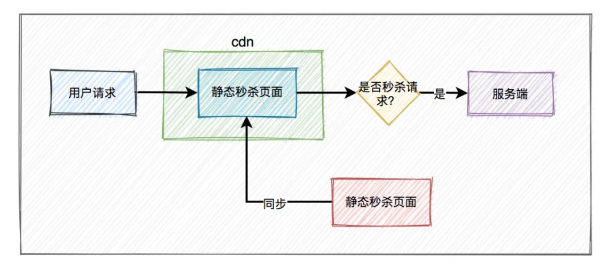

<font style="color:rgb(51, 51, 51);background-color:rgb(248, 246, 244);">使用户就近获取所需内容，降低网络拥塞，提高用户访问响应速度和命中率。</font>

<font style="color:rgb(51, 51, 51);background-color:rgb(248, 246, 244);">CDN加速的基本原理是：将网站的静态内容（如图片、CSS、JavaScript文件等）复制并存储到分布在全球各地的服务器节点上。</font>

<font style="color:rgb(51, 51, 51);background-color:rgb(248, 246, 244);">当用户请求访问网站时，CDN系统会根据用户的地理位置，自动将内容分发给离用户最近的服务器，从而实现快速访问。</font>

<font style="color:rgb(51, 51, 51);background-color:rgb(248, 246, 244);">国内常见的CDN提供商有阿里云CDN、腾讯云CDN、百度云加速等，它们提供了全球分布的节点服务器，为全球范围内的网站加速服务。</font>

## **<font style="color:rgb(34, 34, 34);background-color:rgb(248, 246, 244);">3 缓存</font>**
<font style="color:rgb(51, 51, 51);background-color:rgb(248, 246, 244);">在高并发的系统中，缓存可以说是必不可少的技术之一。</font>

<font style="color:rgb(51, 51, 51);background-color:rgb(248, 246, 244);">目前缓存有两种：</font>

1. <font style="color:rgb(51, 51, 51);background-color:rgb(248, 246, 244);">基于应用服务器的内存缓存，也就是我们说的二级缓存。</font>
2. <font style="color:rgb(51, 51, 51);background-color:rgb(248, 246, 244);">使用缓存中间件，比如：Redis、Memcached等，这种是分布式缓存。</font>

<font style="color:rgb(51, 51, 51);background-color:rgb(248, 246, 244);">这两种缓存各有优缺点。</font>

<font style="color:rgb(51, 51, 51);background-color:rgb(248, 246, 244);">二级缓存的性能更好，但因为是基于应用服务器内存的缓存，如果系统部署到了多个服务器节点，可能会存在数据不一致的情况。</font>

<font style="color:rgb(51, 51, 51);background-color:rgb(248, 246, 244);">而Redis或Memcached虽说性能上比不上二级缓存，但它们是分布式缓存，避免多个服务器节点数据不一致的问题。</font>

<font style="color:rgb(51, 51, 51);background-color:rgb(248, 246, 244);">缓存的用法一般是这样的：</font>

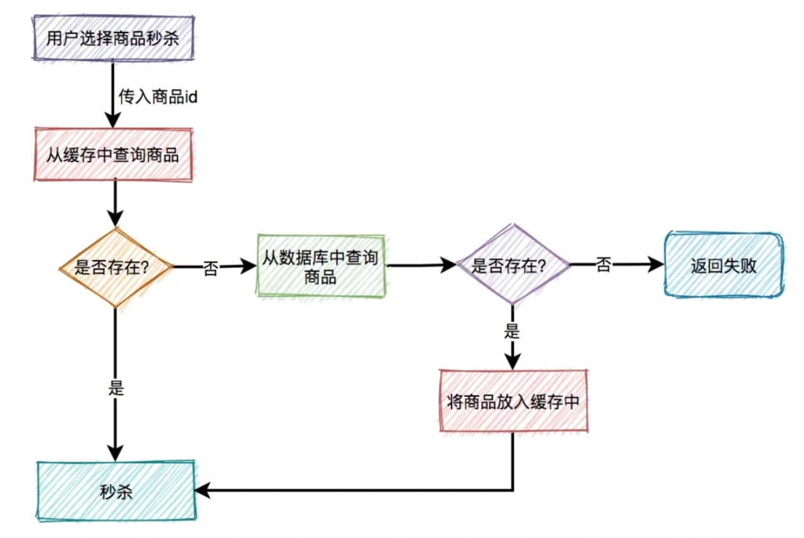

<font style="color:rgb(51, 51, 51);background-color:rgb(248, 246, 244);">使用缓存之后，可以减轻访问数据库的压力，显著的提升系统的性能。</font>

<font style="color:rgb(51, 51, 51);background-color:rgb(248, 246, 244);">有些业务场景，甚至会分布式缓存和二级缓存一起使用。</font>

<font style="color:rgb(51, 51, 51);background-color:rgb(248, 246, 244);">比如获取商品分类数据，流程如下：</font>

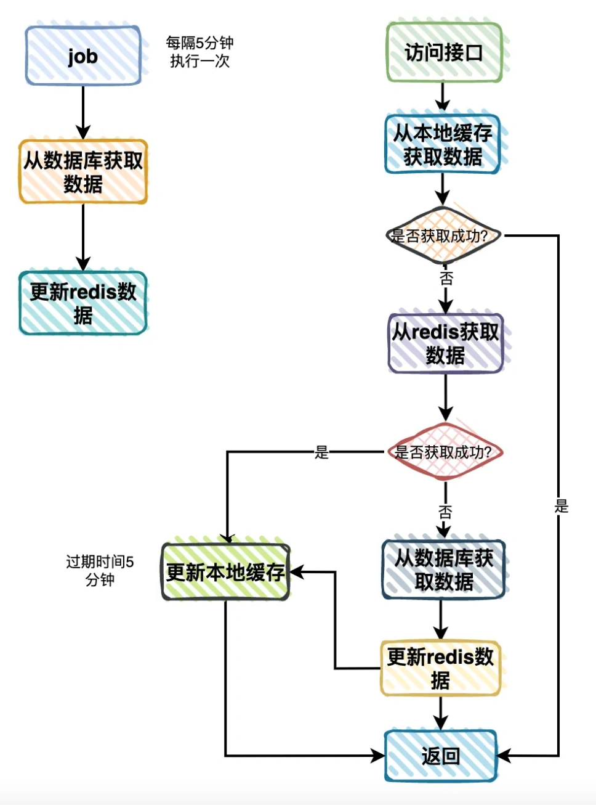

<font style="color:rgb(51, 51, 51);background-color:rgb(248, 246, 244);">我们在使用缓存时，一定要结合实际业务场景，切记不要为了缓存而缓存。</font>

## **<font style="color:rgb(34, 34, 34);background-color:rgb(248, 246, 244);">4 异步</font>**
<font style="color:rgb(51, 51, 51);background-color:rgb(248, 246, 244);">有时候，我们在高并发系统当中，某些接口的业务逻辑，没必要都同步执行。</font>

<font style="color:rgb(51, 51, 51);background-color:rgb(248, 246, 244);">比如有个用户请求接口中，需要做业务操作，发站内通知，和记录操作日志。为了实现起来比较方便，通常我们会将这些逻辑放在接口中同步执行，势必会对接口性能造成一定的影响。</font>

<font style="color:rgb(51, 51, 51);background-color:rgb(248, 246, 244);">接口内部流程图如下：</font>

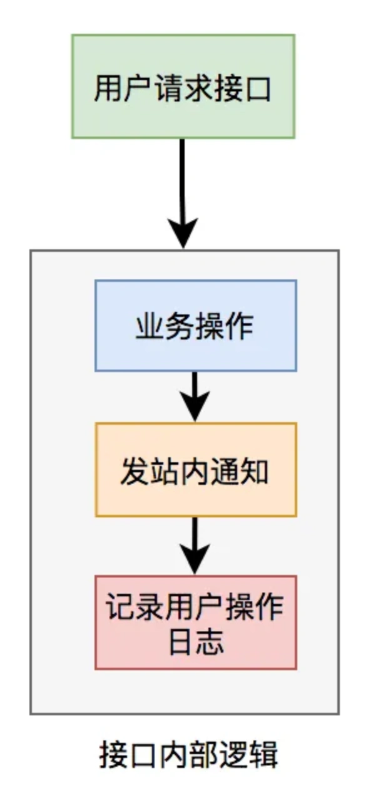

<font style="color:rgb(51, 51, 51);background-color:rgb(248, 246, 244);">这个接口表面上看起来没有问题，但如果你仔细梳理一下业务逻辑，会发现只有业务操作才是核心逻辑，其他的功能都是非核心逻辑。</font>

<font style="color:rgb(51, 51, 51);background-color:rgb(248, 246, 244);">在这里有个原则就是：核心逻辑可以同步执行，同步写库。非核心逻辑，可以异步执行，异步写库。</font>

<font style="color:rgb(51, 51, 51);background-color:rgb(248, 246, 244);">上面这个例子中，发站内通知和用户操作日志功能，对实时性要求不高，即使晚点写库，用户无非是晚点收到站内通知，或者运营晚点看到用户操作日志，对业务影响不大，所以完全可以异步处理。</font>

<font style="color:rgb(51, 51, 51);background-color:rgb(248, 246, 244);">通常异步主要有两种：多线程 和 mq。</font>

### **<font style="color:rgb(34, 34, 34);background-color:rgb(248, 246, 244);">4.1 线程池</font>**
<font style="color:rgb(51, 51, 51);background-color:rgb(248, 246, 244);">使用线程池改造之后，接口逻辑如下：</font>

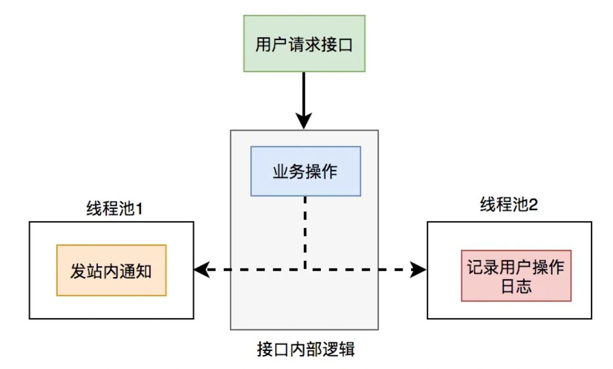

<font style="color:rgb(51, 51, 51);background-color:rgb(248, 246, 244);">发站内通知和用户操作日志功能，被提交到了两个单独的线程池中。</font>

<font style="color:rgb(51, 51, 51);background-color:rgb(248, 246, 244);">这样接口中重点关注的是业务操作，把其他的逻辑交给线程异步执行，这样改造之后，让接口性能瞬间提升了。</font>

<font style="color:rgb(51, 51, 51);background-color:rgb(248, 246, 244);">但使用线程池有个小问题就是：如果服务器重启了，或者是需要被执行的功能出现异常了，无法重试，会丢数据。</font>

<font style="color:rgb(51, 51, 51);background-color:rgb(248, 246, 244);">那么这个问题该怎么办呢？</font>

### **<font style="color:rgb(34, 34, 34);background-color:rgb(248, 246, 244);">4.2 mq</font>**
<font style="color:rgb(51, 51, 51);background-color:rgb(248, 246, 244);">使用mq改造之后，接口逻辑如下：</font>

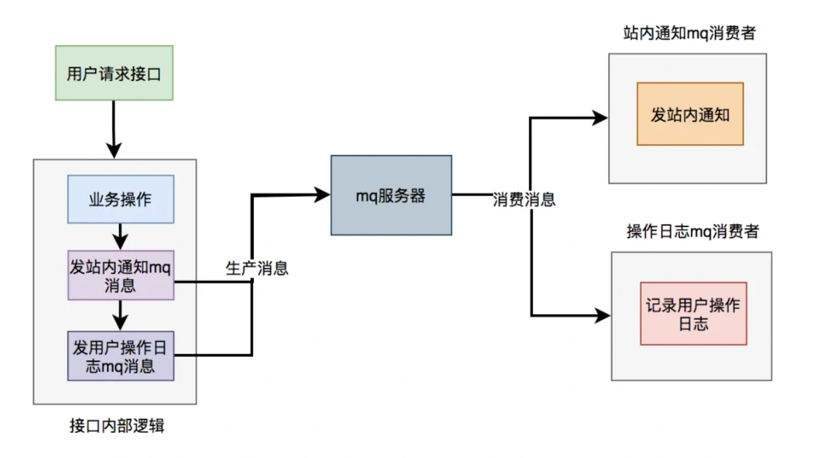

<font style="color:rgb(51, 51, 51);background-color:rgb(248, 246, 244);">对于发站内通知和用户操作日志功能，在接口中并没真正实现，它只发送了mq消息到mq服务器。然后由mq消费者消费消息时，才真正的执行这两个功能。</font>

<font style="color:rgb(51, 51, 51);background-color:rgb(248, 246, 244);">这样改造之后，接口性能同样提升了，因为发送mq消息速度是很快的，我们只需关注业务操作的代码即可。</font>

## **<font style="color:rgb(34, 34, 34);background-color:rgb(248, 246, 244);">5 多线程处理</font>**
<font style="color:rgb(51, 51, 51);background-color:rgb(248, 246, 244);">在高并发系统当中，用户的请求量很大。</font>

<font style="color:rgb(51, 51, 51);background-color:rgb(248, 246, 244);">假如我们现在用mq处理业务逻辑。</font>

<font style="color:rgb(51, 51, 51);background-color:rgb(248, 246, 244);">一下子有大量的用户请求，产生了大量的mq消息，保存到了mq服务器。</font>

<font style="color:rgb(51, 51, 51);background-color:rgb(248, 246, 244);">而mq的消费者，消费速度很慢。</font>

<font style="color:rgb(51, 51, 51);background-color:rgb(248, 246, 244);">可能会导致大量的消息积压问题。</font>

<font style="color:rgb(51, 51, 51);background-color:rgb(248, 246, 244);">从而严重影响数据的实时性。</font>

<font style="color:rgb(51, 51, 51);background-color:rgb(248, 246, 244);">我们需要对消息的消费者做优化。</font>

<font style="color:rgb(51, 51, 51);background-color:rgb(248, 246, 244);">最快的方式是使用多线程消费消息，比如：改成线程池消费消息。</font>

<font style="color:rgb(51, 51, 51);background-color:rgb(248, 246, 244);">当然核心线程数、最大线程数、队列大小 和 线程回收时间，一定要做成配置的，后面可以根据实际情况动态调整。</font>

<font style="color:rgb(51, 51, 51);background-color:rgb(248, 246, 244);">这样改造之后，我们可以快速解决消息积压问题。</font>

<font style="color:rgb(51, 51, 51);background-color:rgb(248, 246, 244);">除此之外，在很多数据导入场景，用多线程导入数据，可以提升效率。</font>

<font style="color:rgb(100, 100, 100);background-color:rgb(248, 246, 244);">温馨提醒一下：使用多线程消费消息，可能会出现消息的顺序问题。如果你的业务场景中，需要保证消息的顺序，则要用其他的方式解决问题。感兴趣的小伙伴，可以找我私聊。</font>

## **<font style="color:rgb(34, 34, 34);background-color:rgb(248, 246, 244);">6 分库分表</font>**
<font style="color:rgb(51, 51, 51);background-color:rgb(248, 246, 244);">有时候，高并发系统的吞吐量受限的不是别的，而是数据库。</font>

<font style="color:rgb(51, 51, 51);background-color:rgb(248, 246, 244);">当系统发展到一定的阶段，用户并发量大，会有大量的数据库请求，需要占用大量的数据库连接，同时会带来磁盘IO的性能瓶颈问题。</font>

<font style="color:rgb(51, 51, 51);background-color:rgb(248, 246, 244);">此外，随着用户数量越来越多，产生的数据也越来越多，一张表有可能存不下。由于数据量太大，sql语句查询数据时，即使走了索引也会非常耗时。</font>

<font style="color:rgb(51, 51, 51);background-color:rgb(248, 246, 244);">这时该怎么办呢？</font>

<font style="color:rgb(51, 51, 51);background-color:rgb(248, 246, 244);">答：需要做分库分表。</font>

<font style="color:rgb(51, 51, 51);background-color:rgb(248, 246, 244);">如下图所示：</font>

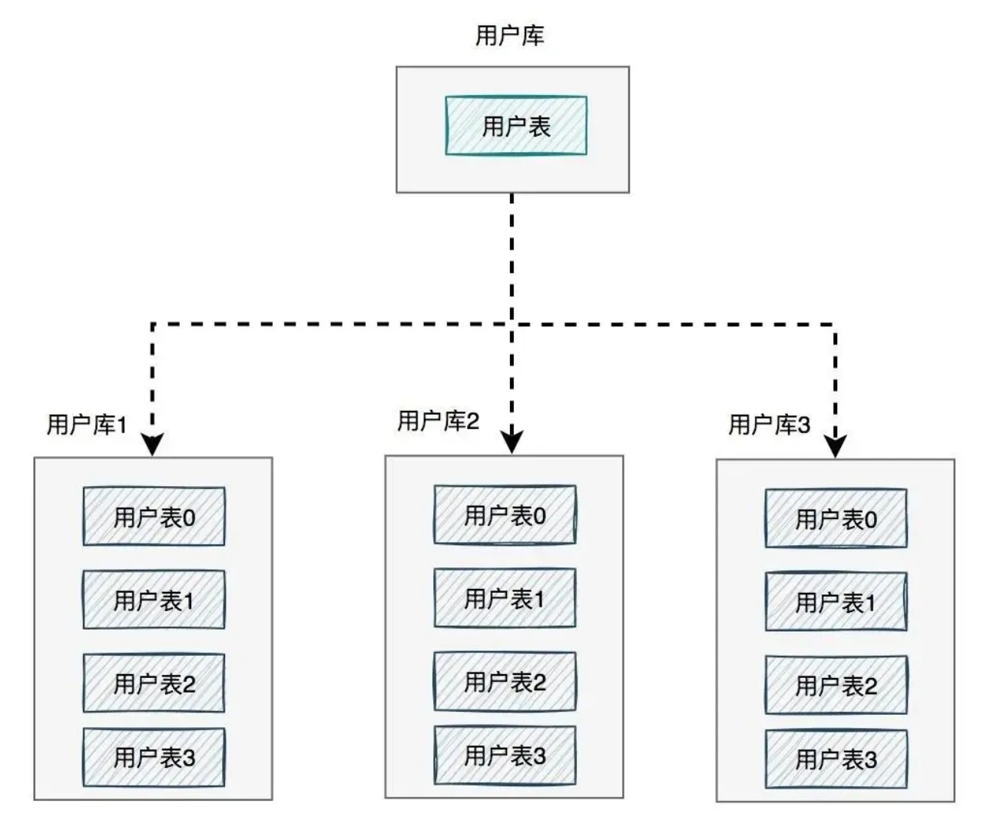

<font style="color:rgb(51, 51, 51);background-color:rgb(248, 246, 244);">图中将用户库拆分成了三个库，每个库都包含了四张用户表。</font>

<font style="color:rgb(51, 51, 51);background-color:rgb(248, 246, 244);">如果有用户请求过来的时候，先根据用户id路由到其中一个用户库，然后再定位到某张表。</font>

<font style="color:rgb(51, 51, 51);background-color:rgb(248, 246, 244);">路由的算法挺多的：</font>

+ <font style="color:rgb(51, 51, 51);background-color:rgb(248, 246, 244);">根据id取模，比如：id=7，有4张表，则7%4=3，模为3，路由到用户表3。</font>
+ <font style="color:rgb(51, 51, 51);background-color:rgb(248, 246, 244);">给id指定一个区间范围，比如：id的值是0-10万，则数据存在用户表0，id的值是10-20万，则数据存在用户表1。</font>
+ <font style="color:rgb(51, 51, 51);background-color:rgb(248, 246, 244);">一致性hash算法</font>

<font style="color:rgb(51, 51, 51);background-color:rgb(248, 246, 244);">分库分表主要有两个方向：垂直和水平。</font>

<font style="color:rgb(51, 51, 51);background-color:rgb(248, 246, 244);">说实话垂直方向（即业务方向）更简单。</font>

<font style="color:rgb(51, 51, 51);background-color:rgb(248, 246, 244);">在水平方向（即数据方向）上，分库和分表的作用，其实是有区别的，不能混为一谈。</font>

+ <font style="color:rgb(51, 51, 51);background-color:rgb(248, 246, 244);">分库：是为了解决数据库连接资源不足问题，和磁盘IO的性能瓶颈问题。</font>
+ <font style="color:rgb(51, 51, 51);background-color:rgb(248, 246, 244);">分表：是为了解决单表数据量太大，sql语句查询数据时，即使走了索引也非常耗时问题。此外还可以解决消耗cpu资源问题。</font>
+ <font style="color:rgb(51, 51, 51);background-color:rgb(248, 246, 244);">分库分表：可以解决 数据库连接资源不足、磁盘IO的性能瓶颈、检索数据耗时 和 消耗cpu资源等问题。</font>

<font style="color:rgb(51, 51, 51);background-color:rgb(248, 246, 244);">如果在有些业务场景中，用户并发量很大，但是需要保存的数据量很少，这时可以只分库，不分表。</font>

<font style="color:rgb(51, 51, 51);background-color:rgb(248, 246, 244);">如果在有些业务场景中，用户并发量不大，但是需要保存的数量很多，这时可以只分表，不分库。</font>

<font style="color:rgb(51, 51, 51);background-color:rgb(248, 246, 244);">如果在有些业务场景中，用户并发量大，并且需要保存的数量也很多时，可以分库分表。</font>

<font style="color:rgb(51, 51, 51);background-color:rgb(248, 246, 244);">关于分库分表更详细的内容，可以看看我另一篇文章，里面讲的更深入《</font>[<font style="color:rgb(51, 51, 51);background-color:rgb(248, 246, 244);">阿里二面：为什么分库分表？</font>](https://mp.weixin.qq.com/s?__biz=MzkwNjMwMTgzMQ==&mid=2247490459&idx=1&sn=1e4296228c00aa4203aab481575ac916&chksm=c0ebc373f79c4a658de7ce7f0d8cf30b1f45adb346c2386321779e7cf85a757a12337d3ae233&token=2041133408&lang=zh_CN&scene=21#wechat_redirect)<font style="color:rgb(51, 51, 51);background-color:rgb(248, 246, 244);">》</font>

## **<font style="color:rgb(34, 34, 34);background-color:rgb(248, 246, 244);">7 池化技术</font>**
<font style="color:rgb(51, 51, 51);background-color:rgb(248, 246, 244);">其实不光是高并发系统，为了性能考虑，有些低并发的系统，也在使用池化技术，比如：数据库连接池、线程池等。</font>

<font style="color:rgb(51, 51, 51);background-color:rgb(248, 246, 244);">池化技术是多例设计模式的一个体现。</font>

<font style="color:rgb(51, 51, 51);background-color:rgb(248, 246, 244);">我们都知道创建和销毁数据库连接是非常耗时耗资源的操作。</font>

<font style="color:rgb(51, 51, 51);background-color:rgb(248, 246, 244);">如果每次用户请求，都需要创建一个新的数据库连接，势必会影响程序的性能。</font>

<font style="color:rgb(51, 51, 51);background-color:rgb(248, 246, 244);">为了提升性能，我们可以创建一批数据库连接，保存到内存中的某个集合中，缓存起来。</font>

<font style="color:rgb(51, 51, 51);background-color:rgb(248, 246, 244);">这样的话，如果下次有需要用数据库连接的时候，就能直接从集合中获取，不用再额外创建数据库连接，这样处理将会给我们提升系统性能。</font>

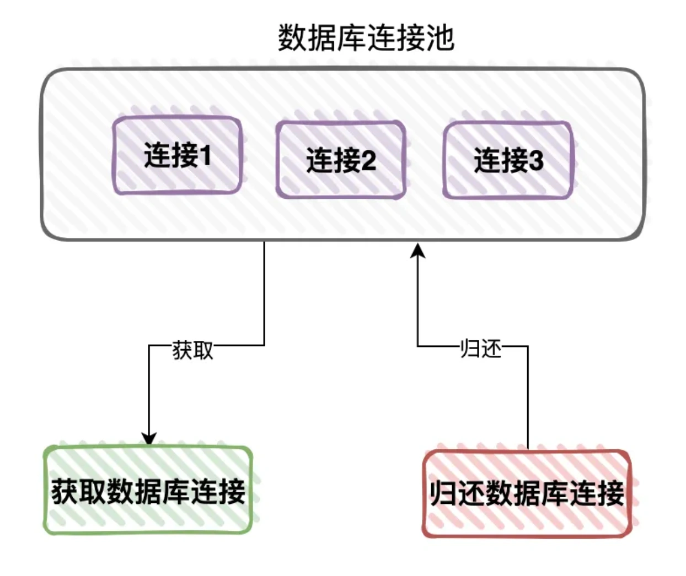

<font style="color:rgb(51, 51, 51);background-color:rgb(248, 246, 244);">当然用完之后，需要及时归还。</font>

<font style="color:rgb(51, 51, 51);background-color:rgb(248, 246, 244);">目前常用的数据库连接池有：Druid、C3P0、hikari和DBCP等。</font>

## **<font style="color:rgb(34, 34, 34);background-color:rgb(248, 246, 244);">8 读写分离</font>**
<font style="color:rgb(51, 51, 51);background-color:rgb(248, 246, 244);">不知道你有没有听说过二八原则，在一个系统当中可能有80%是读数据请求，另外20%是写数据请求。</font>

<font style="color:rgb(51, 51, 51);background-color:rgb(248, 246, 244);">不过这个比例也不是绝对的。</font>

<font style="color:rgb(51, 51, 51);background-color:rgb(248, 246, 244);">我想告诉大家的是，一般的系统读数据请求会远远大于写数据请求。</font>

<font style="color:rgb(51, 51, 51);background-color:rgb(248, 246, 244);">如果读数据请求和写数据请求，都访问同一个数据库，可能会相互抢占数据库连接，相互影响。</font>

<font style="color:rgb(51, 51, 51);background-color:rgb(248, 246, 244);">我们都知道，一个数据库的数据库连接数量是有限，是非常宝贵的资源，不能因为读数据请求，影响到写数据请求吧？</font>

<font style="color:rgb(51, 51, 51);background-color:rgb(248, 246, 244);">这就需要对数据库做读写分离了。</font>

<font style="color:rgb(51, 51, 51);background-color:rgb(248, 246, 244);">于是，就出现了主从读写分离架构：</font>

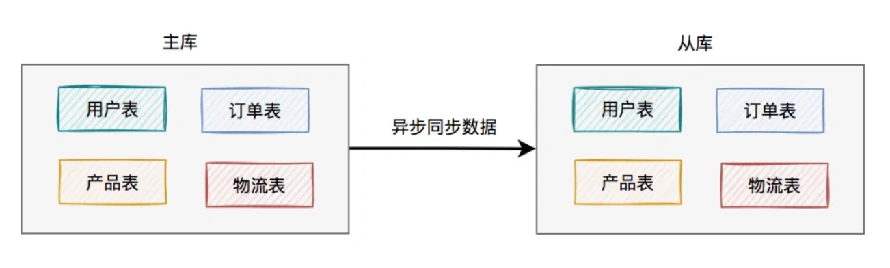

<font style="color:rgb(51, 51, 51);background-color:rgb(248, 246, 244);">考虑刚开始用户量还没那么大，选择的是一主一从的架构，也就是常说的一个master，一个slave。</font>

<font style="color:rgb(51, 51, 51);background-color:rgb(248, 246, 244);">所有的写数据请求，都指向主库。一旦主库写完数据之后，立马异步同步给从库。这样所有的读数据请求，就能及时从从库中获取到数据了（除非网络有延迟）。</font>

<font style="color:rgb(51, 51, 51);background-color:rgb(248, 246, 244);">但这里有个问题就是：如果用户量确实有些大，如果master挂了，升级slave为master，将所有读写请求都指向新master。</font>

<font style="color:rgb(51, 51, 51);background-color:rgb(248, 246, 244);">但此时，如果这个新master根本扛不住所有的读写请求，该怎么办？</font>

<font style="color:rgb(51, 51, 51);background-color:rgb(248, 246, 244);">这就需要一主多从的架构了：</font>

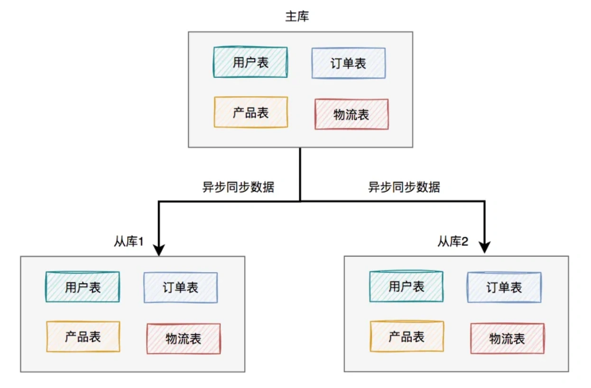

<font style="color:rgb(51, 51, 51);background-color:rgb(248, 246, 244);">上图中我列的是一主两从，如果master挂了，可以选择从库1或从库2中的一个，升级为新master。假如我们在这里升级从库1为新master，则原来的从库2就变成了新master的的slave了。</font>

<font style="color:rgb(51, 51, 51);background-color:rgb(248, 246, 244);">调整之后的架构图如下：</font>

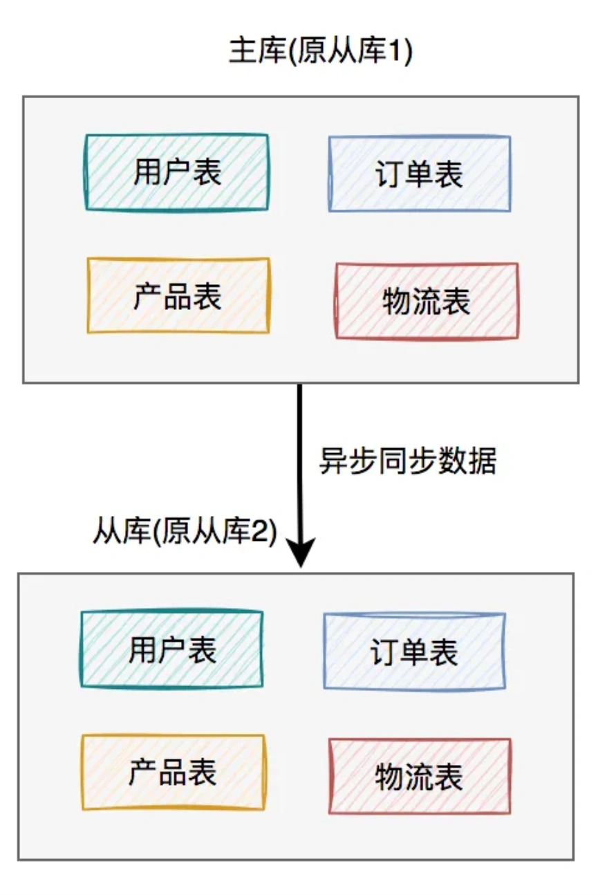

<font style="color:rgb(51, 51, 51);background-color:rgb(248, 246, 244);">这样就能解决上面的问题了。</font>

<font style="color:rgb(51, 51, 51);background-color:rgb(248, 246, 244);">除此之外，如果查询请求量再增大，我们还可以将架构升级为一主三从、一主四从...一主N从等。</font>

## **<font style="color:rgb(34, 34, 34);background-color:rgb(248, 246, 244);">9 索引</font>**
<font style="color:rgb(51, 51, 51);background-color:rgb(248, 246, 244);">在高并发的系统当中，用户经常需要查询数据，对数据库增加索引，是必不可少的一个环节。</font>

<font style="color:rgb(51, 51, 51);background-color:rgb(248, 246, 244);">尤其是表中数据非常多时，加了索引，跟没加索引，执行同一条sql语句，查询相同的数据，耗时可能会相差N个数量级。</font>

<font style="color:rgb(51, 51, 51);background-color:rgb(248, 246, 244);">虽说索引能够提升SQL语句的查询速度，但索引也不是越多越好。</font>

<font style="color:rgb(51, 51, 51);background-color:rgb(248, 246, 244);">在insert数据时，需要给索引分配额外的资源，对insert的性能有一定的损耗。</font>

<font style="color:rgb(51, 51, 51);background-color:rgb(248, 246, 244);">我们要根据实际业务场景来决定创建哪些索引，索引少了，影响查询速度，索引多了，影响写入速度。</font>

<font style="color:rgb(51, 51, 51);background-color:rgb(248, 246, 244);">很多时候，我们需要经常对索引做优化。</font>

1. <font style="color:rgb(51, 51, 51);background-color:rgb(248, 246, 244);">可以将多个单个索引，改成一个联合索引。</font>
2. <font style="color:rgb(51, 51, 51);background-color:rgb(248, 246, 244);">删除不要索引。</font>
3. <font style="color:rgb(51, 51, 51);background-color:rgb(248, 246, 244);">使用explain关键字，查询SQL语句的执行计划，看看哪些走了索引，哪些没有走索引。</font>
4. <font style="color:rgb(51, 51, 51);background-color:rgb(248, 246, 244);">要注意索引失效的一些场景。</font>
5. <font style="color:rgb(51, 51, 51);background-color:rgb(248, 246, 244);">必要时可以使用force index来强制查询sql走某个索引。</font>

<font style="color:rgb(51, 51, 51);background-color:rgb(248, 246, 244);">如果你想进一步了解explain的详细用法，可以看看我的另一篇文章《</font>[<font style="color:rgb(51, 51, 51);background-color:rgb(248, 246, 244);">explain | 索引优化的这把绝世好剑，你真的会用吗？</font>](https://mp.weixin.qq.com/s?__biz=MzkwNjMwMTgzMQ==&mid=2247490262&idx=1&sn=a67f610afa984ecca130a54a3be453ab&chksm=c0ebc23ef79c4b2869dea998e413c5cbea6aeeea01ee74efc7c1a5fc228baa7beca215adf3ea&token=751314179&lang=zh_CN&scene=21#wechat_redirect)<font style="color:rgb(51, 51, 51);background-color:rgb(248, 246, 244);">》。</font>

<font style="color:rgb(51, 51, 51);background-color:rgb(248, 246, 244);">如果你想进一步了解哪些情况下索引会失效，可以看看我的另一篇文章《</font>[<font style="color:rgb(51, 51, 51);background-color:rgb(248, 246, 244);">聊聊索引失效的10种场景，太坑了</font>](https://mp.weixin.qq.com/s?__biz=MzkwNjMwMTgzMQ==&mid=2247491626&idx=1&sn=18fc949c06f04fe8f4c29b6fc5c66f9c&chksm=c0e838c2f79fb1d45c6f9b2ab188bb4663414690bab0718a7d46beb875e6b83e5e67ec27d2ff&token=902535653&lang=zh_CN&scene=21#wechat_redirect)<font style="color:rgb(51, 51, 51);background-color:rgb(248, 246, 244);">》。</font>

## **<font style="color:rgb(34, 34, 34);background-color:rgb(248, 246, 244);">10 批处理</font>**
<font style="color:rgb(51, 51, 51);background-color:rgb(248, 246, 244);">有时候，我们需要从指定的用户集合中，查询出有哪些是在数据库中已经存在的。</font>

<font style="color:rgb(51, 51, 51);background-color:rgb(248, 246, 244);">实现代码可以这样写：</font>

```plain
public List<User> queryUser(List<User> searchList) {
    if (CollectionUtils.isEmpty(searchList)) {
        return Collections.emptyList();
    }

    List<User> result = Lists.newArrayList();
    searchList.forEach(user -> result.add(userMapper.getUserById(user.getId())));
    return result;
}
```

<font style="color:rgb(51, 51, 51);background-color:rgb(248, 246, 244);">这里如果有50个用户，则需要循环50次，去查询数据库。我们都知道，每查询一次数据库，就是一次远程调用。</font>

<font style="color:rgb(51, 51, 51);background-color:rgb(248, 246, 244);">如果查询50次数据库，就有50次远程调用，这是非常耗时的操作。</font>

<font style="color:rgb(51, 51, 51);background-color:rgb(248, 246, 244);">那么，我们如何优化呢？</font>

<font style="color:rgb(51, 51, 51);background-color:rgb(248, 246, 244);">答：批处理。</font>

<font style="color:rgb(51, 51, 51);background-color:rgb(248, 246, 244);">具体代码如下：</font>

```plain
public List<User> queryUser(List<User> searchList) {
    if (CollectionUtils.isEmpty(searchList)) {
        return Collections.emptyList();
    }
    List<Long> ids = searchList.stream().map(User::getId).collect(Collectors.toList());
    return userMapper.getUserByIds(ids);
}
```

<font style="color:rgb(51, 51, 51);background-color:rgb(248, 246, 244);">提供一个根据用户id集合批量查询用户的接口，只远程调用一次，就能查询出所有的数据。</font>

<font style="color:rgb(51, 51, 51);background-color:rgb(248, 246, 244);">这里有个需要注意的地方是：id集合的大小要做限制，最好一次不要请求太多的数据。要根据实际情况而定，建议控制每次请求的记录条数在500以内。</font>

## **<font style="color:rgb(34, 34, 34);background-color:rgb(248, 246, 244);">11 集群</font>**
<font style="color:rgb(51, 51, 51);background-color:rgb(248, 246, 244);">系统部署的服务器节点，可能会down机，比如：服务器的磁盘坏了，或者操作系统出现内存不足问题。</font>

<font style="color:rgb(51, 51, 51);background-color:rgb(248, 246, 244);">为了保证系统的高可用，我们需要部署多个节点，构成一个集群，防止因为部分服务器节点挂了，导致系统的整个服务不可用的情况发生。</font>

<font style="color:rgb(51, 51, 51);background-color:rgb(248, 246, 244);">集群有很多种：</font>

1. <font style="color:rgb(51, 51, 51);background-color:rgb(248, 246, 244);">应用服务器集群</font>
2. <font style="color:rgb(51, 51, 51);background-color:rgb(248, 246, 244);">数据库集群</font>
3. <font style="color:rgb(51, 51, 51);background-color:rgb(248, 246, 244);">中间件集群</font>
4. <font style="color:rgb(51, 51, 51);background-color:rgb(248, 246, 244);">文件服务器集群</font>

<font style="color:rgb(51, 51, 51);background-color:rgb(248, 246, 244);">我们以中间件Redis为例。</font>

<font style="color:rgb(51, 51, 51);background-color:rgb(248, 246, 244);">在高并发系统中，用户的数据量非常庞大时，比如用户的缓存数据总共大小有40G，一个服务器节点只有16G的内存。</font>

<font style="color:rgb(51, 51, 51);background-color:rgb(248, 246, 244);">这样需要部署3台服务器节点。</font>

<font style="color:rgb(51, 51, 51);background-color:rgb(248, 246, 244);">该业务场景，使用普通的master/slave模式，或者使用哨兵模式都行不通。</font>

<font style="color:rgb(51, 51, 51);background-color:rgb(248, 246, 244);">40G的数据，不能只保存到一台服务器节点，需要均分到3个master服务器节点上，一个master服务器节点保存13.3G的数据。</font>

<font style="color:rgb(51, 51, 51);background-color:rgb(248, 246, 244);">当有用户请求过来的时候，先经过路由，根据用户的id或者ip，每次都访问指定的服务器节点。</font>

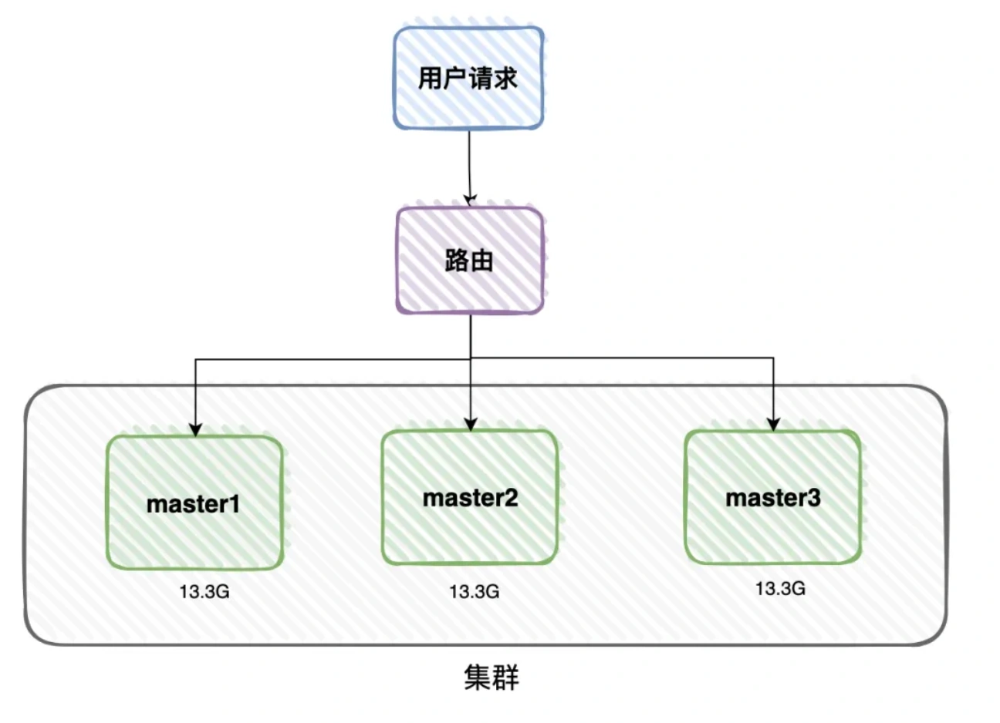

<font style="color:rgb(51, 51, 51);background-color:rgb(248, 246, 244);">这用就构成了一个集群。</font>

<font style="color:rgb(51, 51, 51);background-color:rgb(248, 246, 244);">但这样有风险，为了防止其中一个master服务器节点挂掉，导致部分用户的缓存访问不了，还需要对数据做备份。</font>

<font style="color:rgb(51, 51, 51);background-color:rgb(248, 246, 244);">这样每一个master，都需要有一个slave，做数据备份。</font>

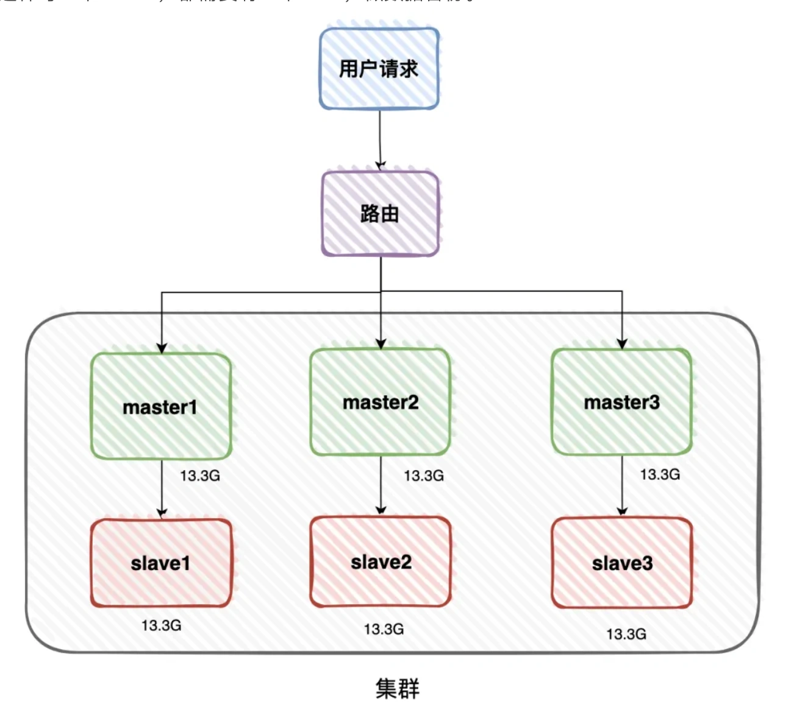

<font style="color:rgb(51, 51, 51);background-color:rgb(248, 246, 244);">如果master挂了，可以将slave升级为新的master，而不影响用户的正常使用。</font>

## **<font style="color:rgb(34, 34, 34);background-color:rgb(248, 246, 244);">12 负载均衡</font>**
<font style="color:rgb(51, 51, 51);background-color:rgb(248, 246, 244);">如果我们的系统部署到了多台服务器节点。那么哪些用户的请求，访问节点a，哪些用户的请求，访问节点b，哪些用户的请求，访问节点c？</font>

<font style="color:rgb(51, 51, 51);background-color:rgb(248, 246, 244);">我们需要某种机制，将用户的请求，转发到具体的服务器节点上。</font>

<font style="color:rgb(51, 51, 51);background-color:rgb(248, 246, 244);">这就需要使用负载均衡机制了。</font>

<font style="color:rgb(51, 51, 51);background-color:rgb(248, 246, 244);">在linux下有Nginx、LVS、Haproxy等服务可以提供负载均衡服务。</font>

<font style="color:rgb(51, 51, 51);background-color:rgb(248, 246, 244);">在SpringCloud微服务架构中，大部分使用的负载均衡组件就是Ribbon、OpenFegin或SpringCloud Loadbalancer。</font>

<font style="color:rgb(51, 51, 51);background-color:rgb(248, 246, 244);">硬件方面，可以使用F5实现负载均衡。它可以基于交换机实现负载均衡，性能更好，但是价格更贵一些。</font>

<font style="color:rgb(51, 51, 51);background-color:rgb(248, 246, 244);">常用的负载均衡策略有：</font>

1. <font style="color:rgb(51, 51, 51);background-color:rgb(248, 246, 244);">轮询：每个请求按时间顺序逐一分配到不同的服务器节点，如果服务器节点down掉，能自动剔除。</font>
2. <font style="color:rgb(51, 51, 51);background-color:rgb(248, 246, 244);">weight权重：weight代表权重默认为1，权重越高，服务器节点被分配到的概率越大。weight和访问比率成正比，用于服务器节点性能不均的情况。</font>
3. <font style="color:rgb(51, 51, 51);background-color:rgb(248, 246, 244);">ip hash：每个请求按访问ip的hash结果分配, 这样每个访客固定访问同一个服务器节点，它是解诀Session共享的问题的解决方案之一。</font>
4. <font style="color:rgb(51, 51, 51);background-color:rgb(248, 246, 244);">最少连接数：把请求转发给连接数较少的服务器节点。轮询算法是把请求平均的转发给各个服务器节点，使它们的负载大致相同；但有些请求占用的时间很长，会导致其所在的服务器节点负载较高。这时least_conn方式就可以达到更好的负载均衡效果。</font>
5. <font style="color:rgb(51, 51, 51);background-color:rgb(248, 246, 244);">最短响应时间：按服务器节点的响应时间来分配请求，响应时间短的服务器节点优先被分配。</font>

<font style="color:rgb(51, 51, 51);background-color:rgb(248, 246, 244);">当然还有其他的策略，在这里就不给大家一一介绍了。</font>

## **<font style="color:rgb(34, 34, 34);background-color:rgb(248, 246, 244);">13 限流</font>**
<font style="color:rgb(51, 51, 51);background-color:rgb(248, 246, 244);">对于高并发系统，为了保证系统的稳定性，需要对用户的请求量做限流。</font>

<font style="color:rgb(51, 51, 51);background-color:rgb(248, 246, 244);">特别是秒杀系统中，如果不做任何限制，绝大部分商品可能是被机器抢到，而非正常的用户，有点不太公平。</font>

<font style="color:rgb(51, 51, 51);background-color:rgb(248, 246, 244);">所以，我们有必要识别这些非法请求，做一些限制。那么，我们该如何现在这些非法请求呢？</font>

<font style="color:rgb(51, 51, 51);background-color:rgb(248, 246, 244);">目前有两种常用的限流方式：</font>

+ <font style="color:rgb(51, 51, 51);background-color:rgb(248, 246, 244);">基于nginx限流</font>
+ <font style="color:rgb(51, 51, 51);background-color:rgb(248, 246, 244);">基于redis限流</font>

### **<font style="color:rgb(34, 34, 34);background-color:rgb(248, 246, 244);">13.1 对同一用户限流</font>**
<font style="color:rgb(51, 51, 51);background-color:rgb(248, 246, 244);">为了防止某个用户，请求接口次数过于频繁，可以只针对该用户做限制。</font>

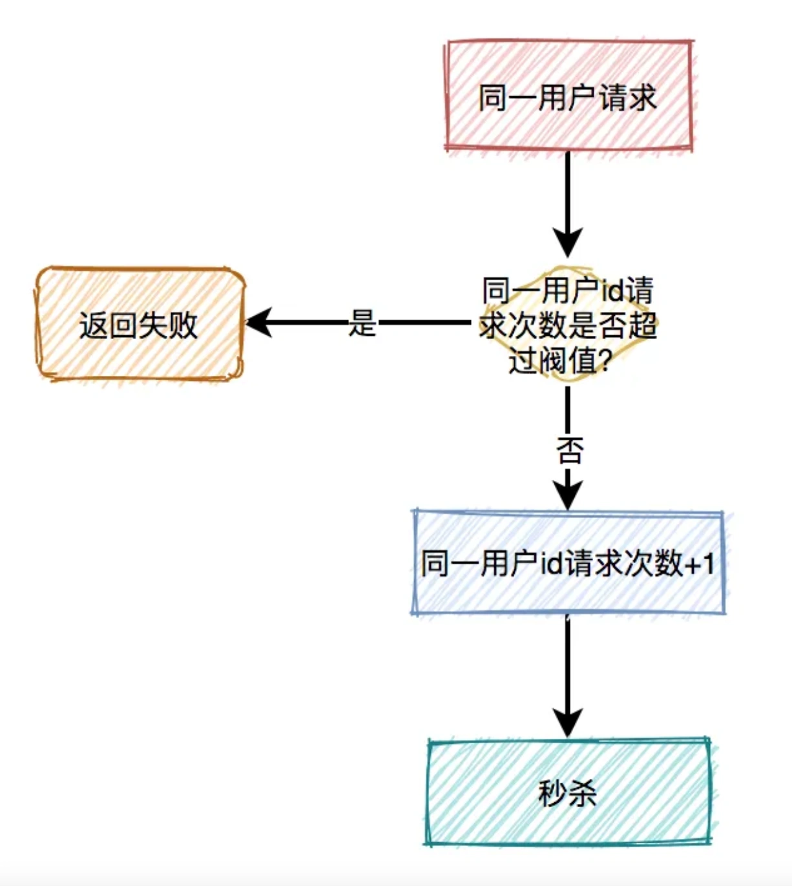

<font style="color:rgb(51, 51, 51);background-color:rgb(248, 246, 244);">限制同一个用户id，比如每分钟只能请求5次接口。</font>

### **<font style="color:rgb(34, 34, 34);background-color:rgb(248, 246, 244);">13.2 对同一ip限流</font>**
<font style="color:rgb(51, 51, 51);background-color:rgb(248, 246, 244);">有时候只对某个用户限流是不够的，有些高手可以模拟多个用户请求，这种nginx就没法识别了。</font>

<font style="color:rgb(51, 51, 51);background-color:rgb(248, 246, 244);">这时需要加同一ip限流功能。</font>

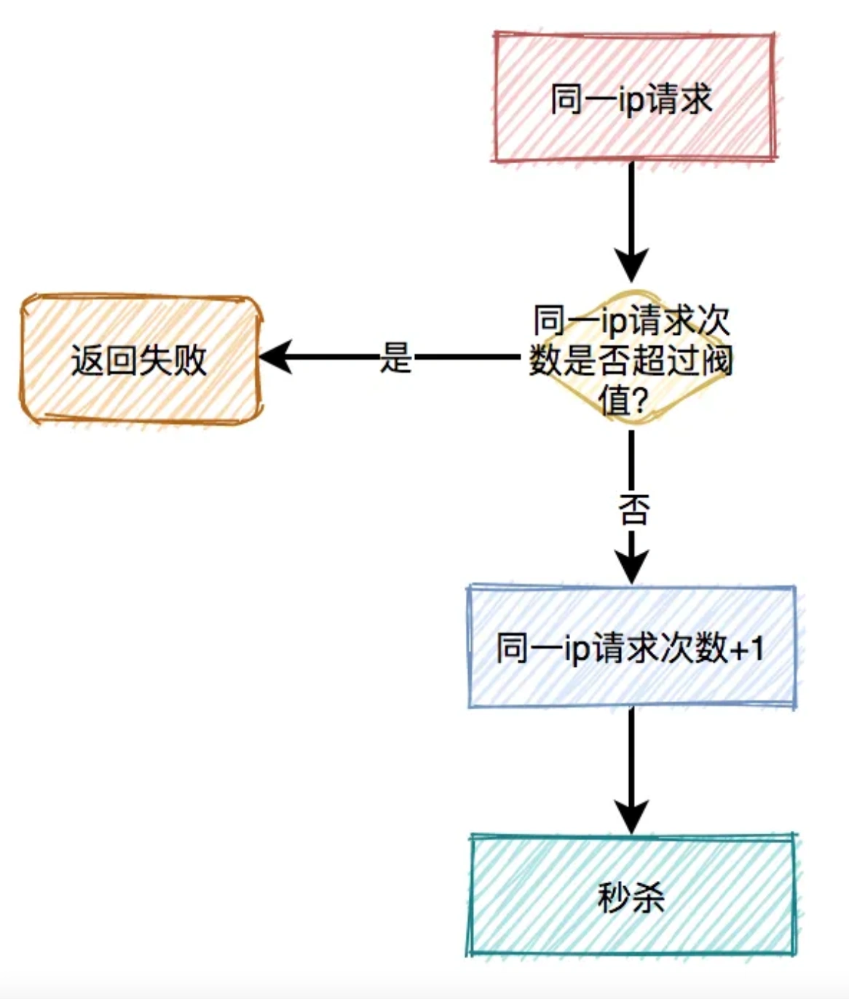

<font style="color:rgb(51, 51, 51);background-color:rgb(248, 246, 244);">限制同一个ip，比如每分钟只能请求5次接口。</font>

<font style="color:rgb(51, 51, 51);background-color:rgb(248, 246, 244);">但这种限流方式可能会有误杀的情况，比如同一个公司或网吧的出口ip是相同的，如果里面有多个正常用户同时发起请求，有些用户可能会被限制住。</font>

### **<font style="color:rgb(34, 34, 34);background-color:rgb(248, 246, 244);">13.3 对接口限流</font>**
<font style="color:rgb(51, 51, 51);background-color:rgb(248, 246, 244);">别以为限制了用户和ip就万事大吉，有些高手甚至可以使用代理，每次都请求都换一个ip。</font>

<font style="color:rgb(51, 51, 51);background-color:rgb(248, 246, 244);">这时可以限制请求的接口总次数。</font>

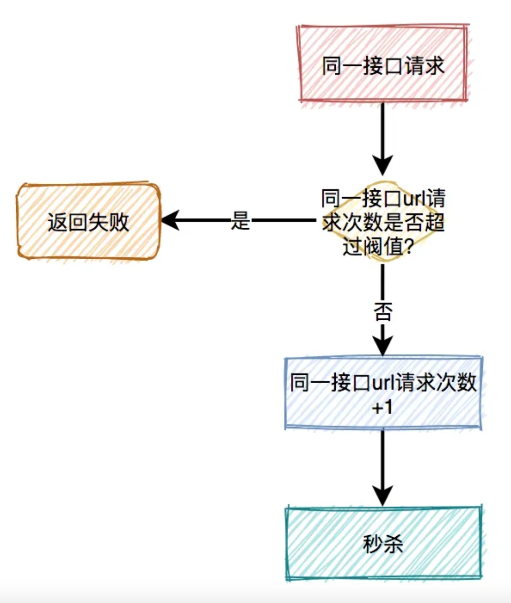

<font style="color:rgb(51, 51, 51);background-color:rgb(248, 246, 244);">在高并发场景下，这种限制对于系统的稳定性是非常有必要的。但可能由于有些非法请求次数太多，达到了该接口的请求上限，而影响其他的正常用户访问该接口。看起来有点得不偿失。</font>

### **<font style="color:rgb(34, 34, 34);background-color:rgb(248, 246, 244);">13.4 加验证码</font>**
<font style="color:rgb(51, 51, 51);background-color:rgb(248, 246, 244);">相对于上面三种方式，加验证码的方式可能更精准一些，同样能限制用户的访问频次，但好处是不会存在误杀的情况。</font>

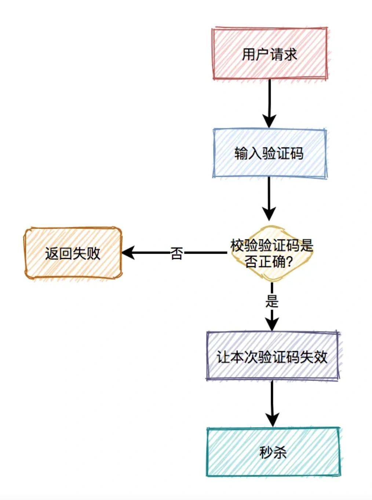

<font style="color:rgb(51, 51, 51);background-color:rgb(248, 246, 244);">通常情况下，用户在请求之前，需要先输入验证码。用户发起请求之后，服务端会去校验该验证码是否正确。只有正确才允许进行下一步操作，否则直接返回，并且提示验证码错误。</font>

<font style="color:rgb(51, 51, 51);background-color:rgb(248, 246, 244);">此外，验证码一般是一次性的，同一个验证码只允许使用一次，不允许重复使用。</font>

<font style="color:rgb(51, 51, 51);background-color:rgb(248, 246, 244);">普通验证码，由于生成的数字或者图案比较简单，可能会被破解。优点是生成速度比较快，缺点是有安全隐患。</font>

<font style="color:rgb(51, 51, 51);background-color:rgb(248, 246, 244);">还有一个验证码叫做：移动滑块，它生成速度比较慢，但比较安全，是目前各大互联网公司的首选。</font>

## **<font style="color:rgb(34, 34, 34);background-color:rgb(248, 246, 244);">14 服务降级</font>**
<font style="color:rgb(51, 51, 51);background-color:rgb(248, 246, 244);">前面已经说过，对于高并发系统，为了保证系统的稳定性，需要做限流。</font>

<font style="color:rgb(51, 51, 51);background-color:rgb(248, 246, 244);">但光做限流还不够。</font>

<font style="color:rgb(51, 51, 51);background-color:rgb(248, 246, 244);">我们需要合理利用服务器资源，保留核心的功能，将部分非核心的功能，我们可以选择屏蔽或者下线掉。</font>

<font style="color:rgb(51, 51, 51);background-color:rgb(248, 246, 244);">我们需要做服务降级。</font>

<font style="color:rgb(51, 51, 51);background-color:rgb(248, 246, 244);">我们在设计高并发系统时，可以预留一些服务降级的开关。</font>

<font style="color:rgb(51, 51, 51);background-color:rgb(248, 246, 244);">比如在秒杀系统中，核心的功能是商品的秒杀，对于商品的评论功能，可以暂时屏蔽掉。</font>

<font style="color:rgb(51, 51, 51);background-color:rgb(248, 246, 244);">在服务端的分布式配置中心，比如：apollo中，可以增加一个开关，配置是否展示评论功能，默认是true。</font>

<font style="color:rgb(51, 51, 51);background-color:rgb(248, 246, 244);">前端页面通过服务器的接口，获取到该配置参数。</font>

<font style="color:rgb(51, 51, 51);background-color:rgb(248, 246, 244);">如果需要暂时屏蔽商品评论功能，可以将apollo中的参数设置成false。</font>

<font style="color:rgb(51, 51, 51);background-color:rgb(248, 246, 244);">此外，我们在设计高并发系统时，还可以预留一些兜底方案。</font>

<font style="color:rgb(51, 51, 51);background-color:rgb(248, 246, 244);">比如某个分类查询接口，要从redis中获取分类数据，返回给用户。但如果那一条redis挂了，则查询数据失败。</font>

<font style="color:rgb(51, 51, 51);background-color:rgb(248, 246, 244);">这时候，我们可以增加一个兜底方案。</font>

<font style="color:rgb(51, 51, 51);background-color:rgb(248, 246, 244);">如果从redis中获取不到数据，则从apollo中获取一份默认的分类数据。</font>

<font style="color:rgb(51, 51, 51);background-color:rgb(248, 246, 244);">目前使用较多的熔断降级中间件是：Hystrix 和 Sentinel。</font>

+ <font style="color:rgb(51, 51, 51);background-color:rgb(248, 246, 244);">Hystrix是Netflix开源的熔断降级组件。</font>
+ <font style="color:rgb(51, 51, 51);background-color:rgb(248, 246, 244);">Sentinel是阿里中间件团队开源的一款不光具有熔断降级功能，同时还支持系统负载保护的组件。</font>

<font style="color:rgb(51, 51, 51);background-color:rgb(248, 246, 244);">二者的区别如下图所示：</font>

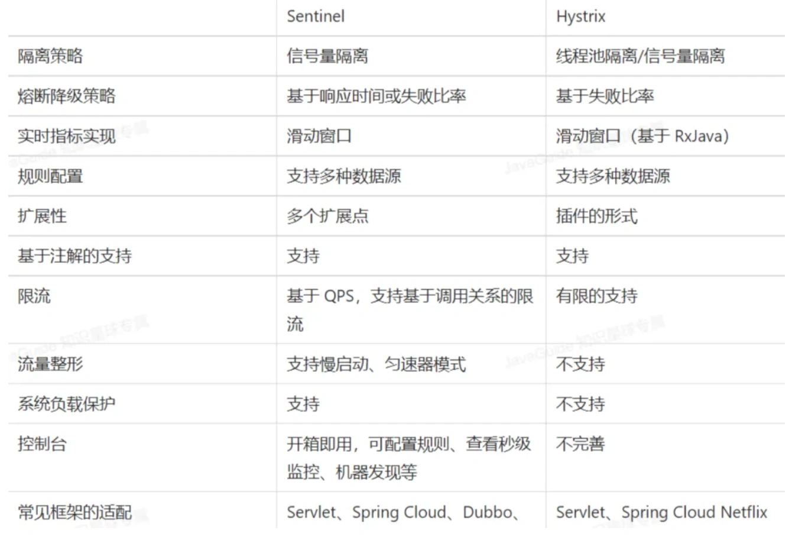

<font style="color:rgb(51, 51, 51);background-color:rgb(248, 246, 244);">有些高并发系统，为了保证系统的稳定性，不只部署在一个机房当中。</font>

<font style="color:rgb(51, 51, 51);background-color:rgb(248, 246, 244);">为了防止机房断电，或者某些不可逆的因素，比如：发生地震，导致机房挂了。</font>

<font style="color:rgb(51, 51, 51);background-color:rgb(248, 246, 244);">需要把系统部署到多个机房。</font>

<font style="color:rgb(51, 51, 51);background-color:rgb(248, 246, 244);">我们之前的游戏登录系统，就部署到了深圳、天津和成都，这三个机房。</font>

<font style="color:rgb(51, 51, 51);background-color:rgb(248, 246, 244);">这三个机房都有用户的流量，其中深圳机房占了40%，天津机房占了30%，成都机房占了30%。</font>

<font style="color:rgb(51, 51, 51);background-color:rgb(248, 246, 244);">如果其中的某个机房突然挂了，流量会被自动分配到另外两个机房当中，不会影响用户的正常使用。</font>

<font style="color:rgb(51, 51, 51);background-color:rgb(248, 246, 244);">这就需要使用异地多活架构了。</font>

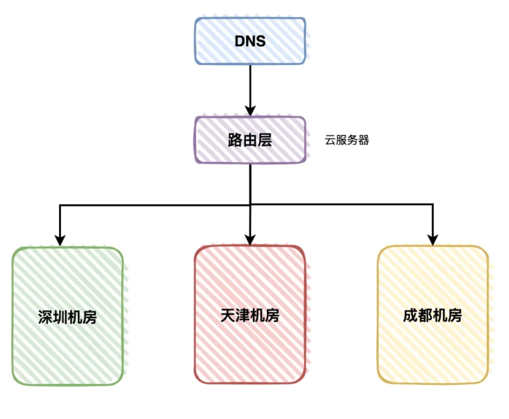

<font style="color:rgb(51, 51, 51);background-color:rgb(248, 246, 244);">用户请求先经过第三方的DNS服务器解析，然后该用户请求到达路由服务器，部署在云服务器上。</font>

<font style="color:rgb(51, 51, 51);background-color:rgb(248, 246, 244);">路由服务器，根据一定的算法，会将该用户请求分配到具体的机房。</font>

<font style="color:rgb(51, 51, 51);background-color:rgb(248, 246, 244);">异地多活的难度是多个机房需要做数据同步，如何保证数据的一致性？</font>

## **<font style="color:rgb(34, 34, 34);background-color:rgb(248, 246, 244);">17 压测</font>**
<font style="color:rgb(51, 51, 51);background-color:rgb(248, 246, 244);">高并发系统，在上线之前，必须要做的一件事是做压力测试。</font>

<font style="color:rgb(51, 51, 51);background-color:rgb(248, 246, 244);">我们先要预估一下生产环境的请求量，然后对系统做压力测试，之后评估系统需要部署多少个服务器节点。</font>

<font style="color:rgb(51, 51, 51);background-color:rgb(248, 246, 244);">比如预估有10000的qps，一个服务器节点最大支持1000pqs，这样我们需要部署10个服务器节点。</font>

<font style="color:rgb(51, 51, 51);background-color:rgb(248, 246, 244);">但假如只部署10个服务器节点，万一突增了一些新的用户请求，服务器可能会扛不住压力。</font>

<font style="color:rgb(51, 51, 51);background-color:rgb(248, 246, 244);">因此，部署的服务器节点，需要把预估用户请求量的多一些，比如：按3倍的用户请求量来计算。</font>

<font style="color:rgb(51, 51, 51);background-color:rgb(248, 246, 244);">这样我们需要部署30个服务器节点。</font>

<font style="color:rgb(51, 51, 51);background-color:rgb(248, 246, 244);">压力测试的结果跟环境有关，在dev环境或者test环境，只能压测一个大概的趋势。</font>

<font style="color:rgb(51, 51, 51);background-color:rgb(248, 246, 244);">想要更真实的数据，我们需要在pre环境，或者跟生产环境相同配置的专门的压测环境中，进行压力测试。</font>

<font style="color:rgb(51, 51, 51);background-color:rgb(248, 246, 244);">目前市面上做压力测试的工具有很多，比如开源的有：Jemter、LoaderRunnder、Locust等等。</font>

<font style="color:rgb(51, 51, 51);background-color:rgb(248, 246, 244);">收费的有：阿里自研的云压测工具PTS。</font>

## **<font style="color:rgb(34, 34, 34);background-color:rgb(248, 246, 244);">18 监控</font>**
<font style="color:rgb(51, 51, 51);background-color:rgb(248, 246, 244);">为了出现系统或者SQL问题时，能够让我们及时发现，我们需要对系统做监控。</font>

<font style="color:rgb(51, 51, 51);background-color:rgb(248, 246, 244);">目前业界使用比较多的开源监控系统是：Prometheus。</font>

<font style="color:rgb(51, 51, 51);background-color:rgb(248, 246, 244);">它提供了 监控 和 预警 的功能。</font>

<font style="color:rgb(51, 51, 51);background-color:rgb(248, 246, 244);">架构图如下：</font>

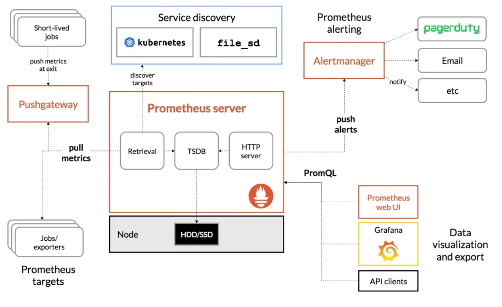

<font style="color:rgb(51, 51, 51);background-color:rgb(248, 246, 244);">我们可以用它监控如下信息：</font>

+ <font style="color:rgb(51, 51, 51);background-color:rgb(248, 246, 244);">接口响应时间</font>
+ <font style="color:rgb(51, 51, 51);background-color:rgb(248, 246, 244);">调用第三方服务耗时</font>
+ <font style="color:rgb(51, 51, 51);background-color:rgb(248, 246, 244);">慢查询sql耗时</font>
+ <font style="color:rgb(51, 51, 51);background-color:rgb(248, 246, 244);">cpu使用情况</font>
+ <font style="color:rgb(51, 51, 51);background-color:rgb(248, 246, 244);">内存使用情况</font>
+ <font style="color:rgb(51, 51, 51);background-color:rgb(248, 246, 244);">磁盘使用情况</font>
+ <font style="color:rgb(51, 51, 51);background-color:rgb(248, 246, 244);">数据库使用情况</font>

<font style="color:rgb(51, 51, 51);background-color:rgb(248, 246, 244);">等等。。。</font>

<font style="color:rgb(51, 51, 51);background-color:rgb(248, 246, 244);">它的界面大概长这样子：</font>

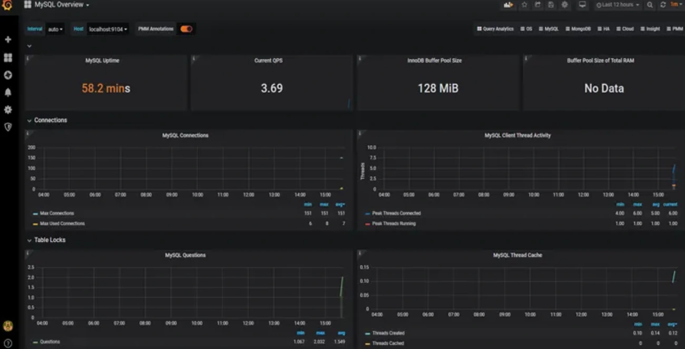

<font style="color:rgb(51, 51, 51);background-color:rgb(248, 246, 244);">可以看到mysql当前qps，活跃线程数，连接数，缓存池的大小等信息。</font>

<font style="color:rgb(51, 51, 51);background-color:rgb(248, 246, 244);">如果发现数据量连接池占用太多，对接口的性能肯定会有影响。</font>

<font style="color:rgb(51, 51, 51);background-color:rgb(248, 246, 244);">这时可能是代码中开启了连接忘了关，或者并发量太大了导致的，需要做进一步排查和系统优化。</font>

<font style="color:rgb(51, 51, 51);background-color:rgb(248, 246, 244);">截图中只是它一小部分功能，如果你想了解更多功能，可以访问Prometheus的官网：</font>[<font style="color:rgb(51, 51, 51);background-color:rgb(248, 246, 244);">https://prometheus.io/</font>](https://prometheus.io/)

<font style="color:rgb(51, 51, 51);background-color:rgb(248, 246, 244);">其实，高并发的系统中，还需要考虑安全问题，比如：</font>

1. <font style="color:rgb(51, 51, 51);background-color:rgb(248, 246, 244);">遇到用户不断变化ip刷接口怎办？</font>
2. <font style="color:rgb(51, 51, 51);background-color:rgb(248, 246, 244);">遇到用户大量访问缓存中不存在的数据，导致缓存雪崩怎么办？</font>
3. <font style="color:rgb(51, 51, 51);background-color:rgb(248, 246, 244);">如果用户发起ddos攻击怎么办？</font>
4. <font style="color:rgb(51, 51, 51);background-color:rgb(248, 246, 244);">用户并发量突增，导致服务器扛不住了，如何动态扩容？</font>

<font style="color:rgb(51, 51, 51);background-color:rgb(248, 246, 244);"></font>

  
 


> 更新: 2024-09-11 10:49:55  
> 原文: <https://www.yuque.com/yuqueyonghue6cvnv/cxhfwd/vm50n0oo9qkmmnlw>