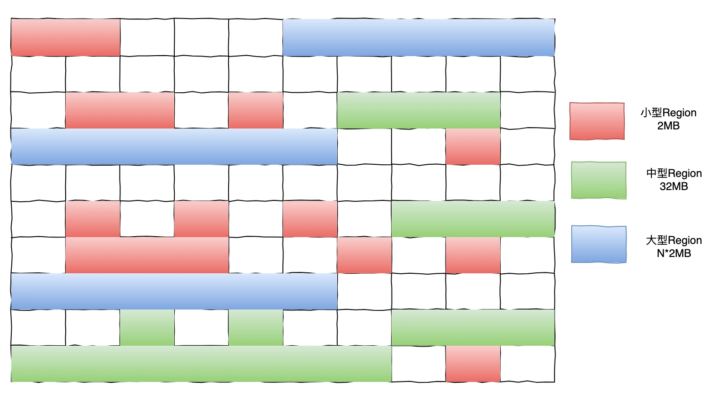
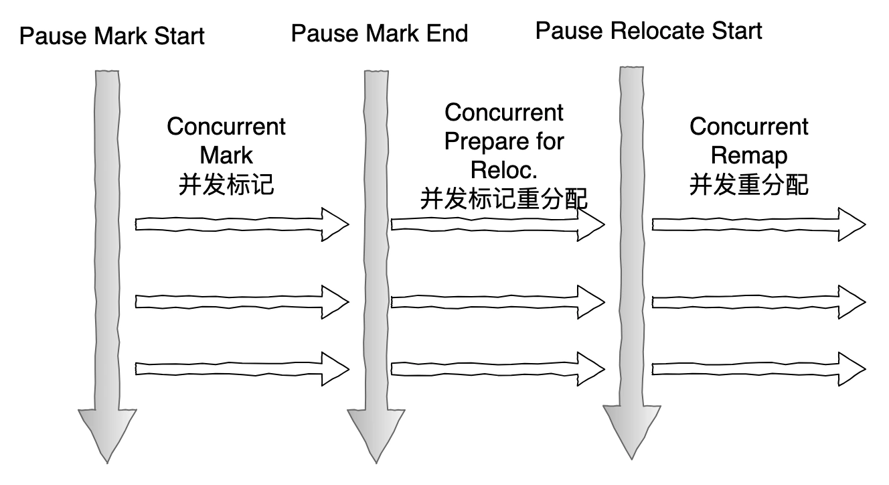
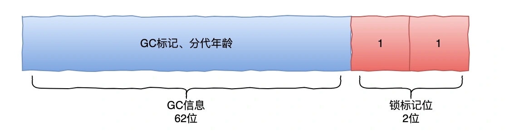
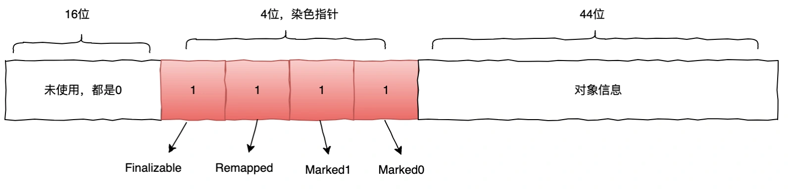
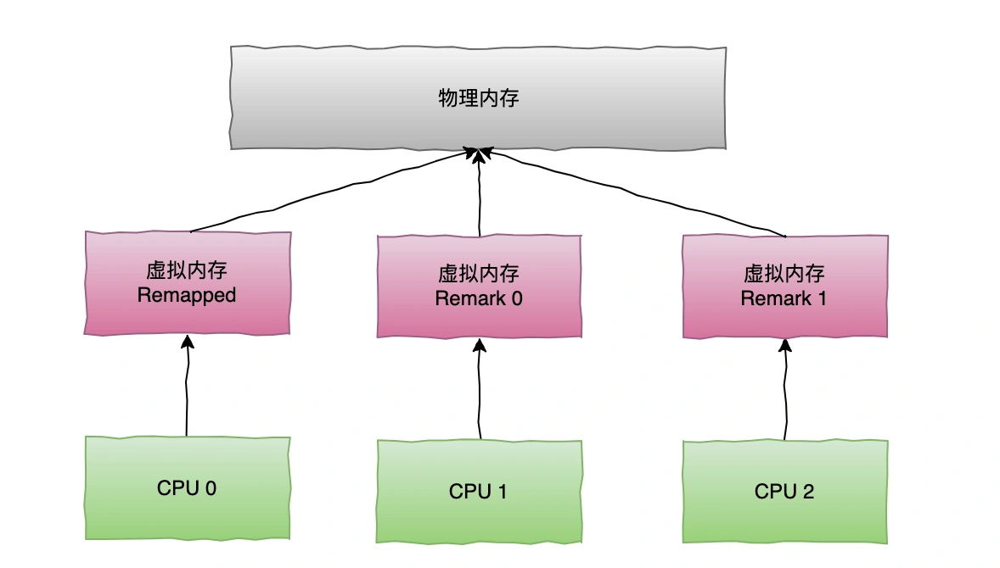

# 010 | 你知道低延迟、高吞吐量、TB量级的 ZGC 实现原理吗？

# <font style="color:rgb(0, 0, 0);background-color:rgb(248, 246, 244);">什么是 ZGC？</font>
<font style="color:rgb(51, 51, 51);background-color:rgb(248, 246, 244);">ZGC（Z Garbage Collector）是一款新一代的垃圾回收器，它在 JDK 11 中被引入。ZGC 采用了读屏障（Read Barrier）和染色指针（Colored Pointer）等技术，实现了精确的内存管理，并能够在任意时间点暂停应用程序。</font>

<font style="color:rgb(51, 51, 51);background-color:rgb(248, 246, 244);">ZGC 的目标是在未来替代 G1 成为默认的垃圾回收器。ZGC 主要有以下几个特点：</font>

+ <font style="color:rgb(51, 51, 51);background-color:rgb(248, 246, 244);">大堆支持：支持 TB 量级的堆。</font>
+ <font style="color:rgb(51, 51, 51);background-color:rgb(248, 246, 244);">低延迟：ZGC 的目标主要是低延迟，最大 GC 停顿时间不超过 10ms。</font>
+ <font style="color:rgb(51, 51, 51);background-color:rgb(248, 246, 244);">高吞吐：在满足低延迟的基础上，ZGC 对于吞吐量虽然有一定降低到 15%，但是这可以通过扩容解决，并不影响 ZGC 低延迟的优秀性能。</font>
+ <font style="color:rgb(51, 51, 51);background-color:rgb(248, 246, 244);">并发性：ZGC 是一款并发的垃圾收集器，可以在程序运行的同时，进行垃圾回收操作。</font>
+ <font style="color:rgb(51, 51, 51);background-color:rgb(248, 246, 244);">分代：在 JDK21 之前，ZGC 都是不分代的，这个主要是基于实现复杂性考虑，所以先推出一个不分代版本。在 JDK21 之后，ZGC 开始支持分代。</font>

<font style="color:rgb(51, 51, 51);background-color:rgb(248, 246, 244);">下面我们来看下不分代 ZGC 的设计。</font>

# <font style="color:rgb(0, 0, 0);background-color:rgb(248, 246, 244);">ZGC 内存布局</font>
<font style="color:rgb(51, 51, 51);background-color:rgb(248, 246, 244);">和 G1 类似，ZGC 的堆内存也是基于 Region 布局的。ZGC 的 Region 支持动态地创建和销毁，而且 Region 的大小主要有以下三类：</font>



+ <font style="color:rgb(51, 51, 51);background-color:rgb(248, 246, 244);">小型 Region：2MB，用于放置小于 256kb 的对象。</font>
+ <font style="color:rgb(51, 51, 51);background-color:rgb(248, 246, 244);">中型 Region：32MB，用于放置大于等于 256kb 且小于 4MB 的对象。</font>
+ <font style="color:rgb(51, 51, 51);background-color:rgb(248, 246, 244);">大型 Region：容量不固定，可以动态的变化，但必须是 2MB 的整数倍，大型 Region 实际中容量可能小于中型 Region，最小支持到 4MB，每个大型 Region 只会存放一个对象，且大型 Region 在 ZGC 中不会被重分配。</font>

# <font style="color:rgb(0, 0, 0);background-color:rgb(248, 246, 244);">ZGC 回收过程</font>
<font style="color:rgb(51, 51, 51);background-color:rgb(248, 246, 244);">ZGC 采用标记-复制算法，不过 ZGC 对该算法做了重大改进：ZGC 在标记、转移和重定位阶段几乎都是并发的。这也是 ZGC 低延迟的关键因素。</font>

<font style="color:rgb(51, 51, 51);background-color:rgb(248, 246, 244);">ZGC 的垃圾回收过程可以分为以下几个阶段：</font>



+ <font style="color:rgb(51, 51, 51);background-color:rgb(248, 246, 244);">初始标记：STW，标记所有 GC ROOTS 直接引用对象。</font>
+ <font style="color:rgb(51, 51, 51);background-color:rgb(248, 246, 244);">并发标记：遍历对象图做可达性分析。和 G1 不同的是，ZGC 的标记是在</font>**<font style="color:rgb(34, 34, 34);background-color:rgb(248, 246, 244);">染色指针</font>**<font style="color:rgb(51, 51, 51);background-color:rgb(248, 246, 244);">上而不是在对象上进行标记。</font>
+ <font style="color:rgb(51, 51, 51);background-color:rgb(248, 246, 244);">最终标记：STW，处理一些弱根对象，解决并发标记出现的漏标问题。</font>
+ <font style="color:rgb(51, 51, 51);background-color:rgb(248, 246, 244);">并发预备重分配：这个阶段主要统计本次回收过程需要清理的 Region，组成重分配集合。</font>
+ <font style="color:rgb(51, 51, 51);background-color:rgb(248, 246, 244);">并发重分配-开始阶段：STW，处理 GC ROOTS 根对象指向重定向集合。</font>
+ <font style="color:rgb(51, 51, 51);background-color:rgb(248, 246, 244);">并发重分配：该阶段是 ZGC 回收过程的核心，主要把重分配集合中的存活对象复制到新的 Region，并且为重分配集合中的每个 Region 维护一个</font>**<font style="color:rgb(34, 34, 34);background-color:rgb(248, 246, 244);">转发表</font>**<font style="color:rgb(51, 51, 51);background-color:rgb(248, 246, 244);">，记录旧对象到新对象的指向关系。ZGC 采用一种惰性重定向，也就是当有用户线程访问了重分配集合中对象时，这次访问会被</font>**<font style="color:rgb(34, 34, 34);background-color:rgb(248, 246, 244);">读屏障</font>**<font style="color:rgb(51, 51, 51);background-color:rgb(248, 246, 244);">所截取，根据已维护的新旧对象指向关系，将访问转发到新的对象上，同时修正该对象引用的新值。</font>
+ <font style="color:rgb(51, 51, 51);background-color:rgb(248, 246, 244);">并发重映射：重映射要做的就是修正指向重分配集旧对象的所有引用。然而这不是一个急切去完成的任务，因此，ZGC 把这个阶段要做的工作，合并到了下一次 GC 的并发标记阶段去完成，就减少了一次遍历对象图的开销。一旦所有指针都修正后，转发表就可以释放了。</font>

<font style="color:rgb(100, 100, 100);background-color:rgb(248, 246, 244);">看完这个回收过程，是不是很多概念不是很理解呢，比如什么是染色指针？什么又是读屏障？</font>

<font style="color:rgb(51, 51, 51);background-color:rgb(248, 246, 244);">别急，咱们一个一个来看下。</font>

# <font style="color:rgb(0, 0, 0);background-color:rgb(248, 246, 244);">染色指针</font>
<font style="color:rgb(51, 51, 51);background-color:rgb(248, 246, 244);">Colored Pointers，即染色指针。这个是 ZGC 的核心设计之一，我们知道 CMS、G1 等垃圾回收器的 GC 信息是保存在对象头中的。</font>



<font style="color:rgb(51, 51, 51);background-color:rgb(248, 246, 244);">但是 ZGC 的 GC 信息是保存在指针上，每个对象有一个 64 位指针，分别是：</font>



+ <font style="color:rgb(51, 51, 51);background-color:rgb(248, 246, 244);">16 位：预留以后使用。</font>
+ <font style="color:rgb(51, 51, 51);background-color:rgb(248, 246, 244);">1 位：Finalizable 标识，和并发处理有关，表示该对象只能通过 finalizable 才能访问。</font>
+ <font style="color:rgb(51, 51, 51);background-color:rgb(248, 246, 244);">1 位：Remapped 标识，对象重定位使用，说明对象未指向 relocation set 中。</font>
+ <font style="color:rgb(51, 51, 51);background-color:rgb(248, 246, 244);">1 位：Marked1 标识，如下。</font>
+ <font style="color:rgb(51, 51, 51);background-color:rgb(248, 246, 244);">1 位：Marked0 标识，和 Marked1 一样，都是标记对象用于辅助 GC。Marked0、Marked1、Remapped 三者是互斥关系，三者只能有一个为 1。</font>
+ <font style="color:rgb(51, 51, 51);background-color:rgb(248, 246, 244);">44 位：对象的地址，可支持 2^42=16T 内存。</font>

<font style="color:rgb(100, 100, 100);background-color:rgb(248, 246, 244);">为什么需要两个 mark 标记位呢？</font>

<font style="color:rgb(51, 51, 51);background-color:rgb(248, 246, 244);">每个 GC 周期开始时，会交互使用标记位，使上次的 GC 周期中修正的已标记状态失效，所有引用变成未标记。</font>

+ <font style="color:rgb(51, 51, 51);background-color:rgb(248, 246, 244);">GC 周期 1:使用 mark0，周期结束后引用 mark 标记变成 01。</font>
+ <font style="color:rgb(51, 51, 51);background-color:rgb(248, 246, 244);">GC 周期 2:使用 mark1，周期结束后引用 mark 标记变成 10。</font>

<font style="color:rgb(100, 100, 100);background-color:rgb(248, 246, 244);">ZGC 为什么使用染色指针呢？</font>

<font style="color:rgb(51, 51, 51);background-color:rgb(248, 246, 244);">主要还是有以下几个优势：</font>

1. <font style="color:rgb(51, 51, 51);background-color:rgb(248, 246, 244);">提高回收效率，染色指针使得某个 Region 的存活对象转移之后，这个 Region 就可以被回收掉，不需要等待整个堆所有指向该 Region 的引用都被修正后才能清理。</font>
2. <font style="color:rgb(51, 51, 51);background-color:rgb(248, 246, 244);">染色指针能够大幅度减少在垃圾收集过程之中内存屏障的使用数量。</font>
3. <font style="color:rgb(51, 51, 51);background-color:rgb(248, 246, 244);">染色指针的扩展性设计，可以作为一个存储结构用于记录更多和对象标记、重定位过程相关的信息，以便以后提升性能。</font>

# <font style="color:rgb(0, 0, 0);background-color:rgb(248, 246, 244);">内存多重映射</font>
<font style="color:rgb(51, 51, 51);background-color:rgb(248, 246, 244);">ZGC 基于染色指针使用了内存多重映射，将物理内存映射为不同的地址视图。</font>

<font style="color:rgb(51, 51, 51);background-color:rgb(248, 246, 244);">把染色指针中的标志位看作是地址的分段符，那只要将这些不同的地址段都映射到同一个物理内存空间，经过多重映射转换后，就可以使用染色指针正常进行寻址了。</font>



<font style="color:rgb(51, 51, 51);background-color:rgb(248, 246, 244);">Marked0、Marked1 和 Remapped 这三个虚拟内存作为 ZGC 的三个视图空间，在同一个时间点内只能有一个有效。</font>

<font style="color:rgb(51, 51, 51);background-color:rgb(248, 246, 244);">ZGC 就是通过这三个视图空间的切换，来完成并发的垃圾回收。</font>

# <font style="color:rgb(0, 0, 0);background-color:rgb(248, 246, 244);">读屏障</font>
<font style="color:rgb(51, 51, 51);background-color:rgb(248, 246, 244);">在并发标记和转移对象的过程中，因为用户线程还在运行可能带来不一致问题。</font>

<font style="color:rgb(51, 51, 51);background-color:rgb(248, 246, 244);">之前的 GC 收集器使采用写屏障，而 ZGC 采用了完全不同的实现-读屏障，这也是 ZGC 一个非常重要的特性。 比如下面的代码。</font>

```plain
Object o = obj.fieldA;
//加入读屏障

Object p=o;
o.doSomething();
int i = obj.fieldB;
```

<font style="color:rgb(51, 51, 51);background-color:rgb(248, 246, 244);">第一行尝试把堆中一个对象引用 obj.fieldA 赋值给 o。</font>

<font style="color:rgb(51, 51, 51);background-color:rgb(248, 246, 244);">如果这时候对象在 GC 时被转移走，那么 ZGC 会加上读屏障，读屏障会把读出的指针更新到对象的新引用地址上，并且修正堆里的指针，这样就保证在应用程序并发运行时，也能实时读取到最新的有效指针，也就不需要 STW 了。</font>

# <font style="color:rgb(0, 0, 0);background-color:rgb(248, 246, 244);">ZGC 触发时机</font>
<font style="color:rgb(51, 51, 51);background-color:rgb(248, 246, 244);">ZGC 目前有 4 种机制触发：</font>

+ <font style="color:rgb(51, 51, 51);background-color:rgb(248, 246, 244);">固定时间触发：可以设置 ZGC 以固定的频率触发，设置参数为:ZCollectionInterval。默认为 0，即不使用。</font>
+ <font style="color:rgb(51, 51, 51);background-color:rgb(248, 246, 244);">预热触发：指 JVM 启动后，当堆内存达到 10%、20%、30%时，会主动触发垃圾回收，最多三次。</font>
+ <font style="color:rgb(51, 51, 51);background-color:rgb(248, 246, 244);">分配速率：基于分配速率来预测是否触发，ZGC 是基于正态分布统计，计算内存 99.9%可能的最大分配速率，以及次速率下内存将要耗尽的时间，在耗尽之前触发 GC。这是 ZGC 中最常见的垃圾回收触发机制。</font>
+ <font style="color:rgb(51, 51, 51);background-color:rgb(248, 246, 244);">主动触发：当满足以下两个条件时触发：1.距离上次 GC 后，堆内存增长 10%。2.超过 5min。</font>

# <font style="color:rgb(0, 0, 0);background-color:rgb(248, 246, 244);">ZGC 常用参数</font>
<font style="color:rgb(51, 51, 51);background-color:rgb(248, 246, 244);">ZGC 可调优的参数不是很多，不会像 CMS 那么复杂。</font>

```ruby
-Xms -Xmx：堆的最大内存和最小内存，这里都设置为10G，程序的堆内存将保持10G不变。
-XX:ReservedCodeCacheSize -XX:InitialCodeCacheSize: 设置CodeCache的大小， JIT编译的代码都放在CodeCache中，一般服务64m或128m就已经足够。我们的服务因为有一定特殊性，所以设置的较大，后面会详细介绍。
-XX:+UnlockExperimentalVMOptions -XX:+UseZGC：启用ZGC的配置。
-XX:ConcGCThreads：并发回收垃圾的线程。默认是总核数的12.5%，8核CPU默认是1。调大后GC变快，但会占用程序运行时的CPU资源，吞吐会受到影响。
-XX:ParallelGCThreads：STW阶段使用线程数，默认是总核数的60%。
-XX:ZCollectionInterval：ZGC发生的最小时间间隔，单位秒。
-XX:ZAllocationSpikeTolerance：ZGC触发自适应算法的修正系数，默认2，数值越大，越早的触发ZGC。
-XX:+UnlockDiagnosticVMOptions -XX:-ZProactive：是否启用主动回收，默认开启，这里的配置表示关闭。
-Xlog：设置GC日志中的内容、格式、位置以及每个日志的大小。
```


> 更新: 2024-11-07 09:52:31  
> 原文: <https://www.yuque.com/yuqueyonghue6cvnv/cxhfwd/gi2oe3nusfadcs4y>