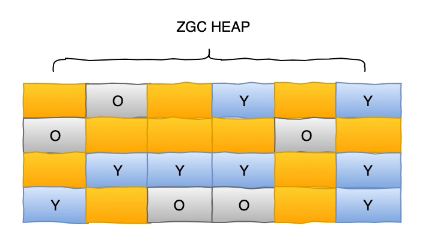
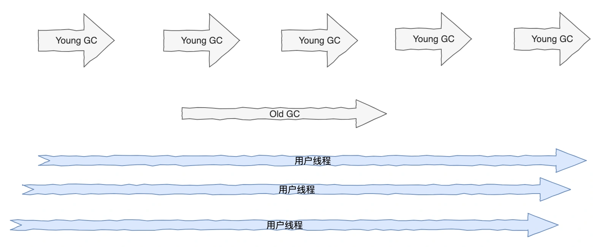
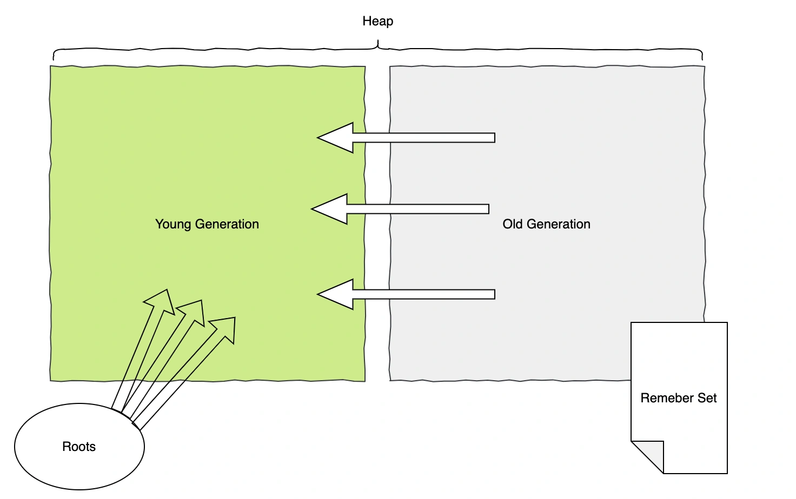
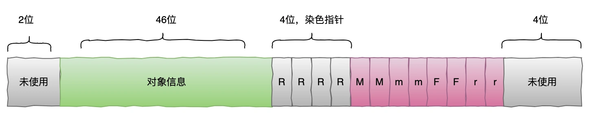

# 011 | 分代 ZGC 有哪些特性，与普通 ZGC 有什么区别？

# **<font style="color:rgb(34, 34, 34);background-color:rgb(248, 246, 244);">分代 ZGC 有哪些特性？</font>**
<font style="color:rgb(51, 51, 51);background-color:rgb(248, 246, 244);">我们之前了解到 ZGC 是不分代的，ZGC 通过几乎完全并发的方式实现毫秒级的停顿时间，而且可支持高达 16TB 的堆大小，但同时，也带来了应用系统吞吐量下降的风险，因为 ZGC 也占用了一定的应用系统的 CPU 资源。</font>

<font style="color:rgb(51, 51, 51);background-color:rgb(248, 246, 244);">那么这种情况下，JDK21 给我们带来了分代 ZGC，即 Generational ZGC，我们都知道应用程序中大多对象都是朝生夕亡的，分代 ZGC 就是通过区分年轻代和老年代对象提高应用程序性能。</font>

<font style="color:rgb(51, 51, 51);background-color:rgb(248, 246, 244);">下面我们一起来看下相比于普通 ZGC，分代 ZGC 都有哪些特性？</font>

# **<font style="color:rgb(34, 34, 34);background-color:rgb(248, 246, 244);">分代 ZGC 内存布局</font>**
<font style="color:rgb(51, 51, 51);background-color:rgb(248, 246, 244);">分代 ZGC 将堆内存分为不同的代，通过这种分代方式，Generational ZGC 更有效地管理内存，提升性能。</font>



+ <font style="color:rgb(51, 51, 51);background-color:rgb(248, 246, 244);">新生代：主要存放短生命周期的对象，通常会经历频繁的垃圾回收。</font>
+ <font style="color:rgb(51, 51, 51);background-color:rgb(248, 246, 244);">老年代：存放长生命周期的对象，通常较少被回收。</font>

<font style="color:rgb(51, 51, 51);background-color:rgb(248, 246, 244);">分代 ZGC 流程</font>



<font style="color:rgb(51, 51, 51);background-color:rgb(248, 246, 244);">分代 ZGC 的整体流程和普通 ZGC 差不多，分代 ZGC 中 Young GC、Old GC 和应用线程都是独立并行执行的。不过 Old GC 会依赖 Young GC，分代 ZGC 分为：</font>

<font style="color:rgb(51, 51, 51);background-color:rgb(248, 246, 244);">Minor Collection：只收集年轻代，根据 GC Roots 和记忆集中老年代对年轻代的引用记录，扫描出需要回收的对象。</font>

+ 

<font style="color:rgb(51, 51, 51);background-color:rgb(248, 246, 244);">Major Colection：收集年轻代和老年代，首先对年轻代进行收集标记，得到年轻代对老年代的引用，结合 GC Roots 开始对 Old 区的回收。</font>

+ 

<font style="color:rgb(51, 51, 51);background-color:rgb(248, 246, 244);">在以往垃圾回收器中，通常我们需要考虑设置年轻代大小来调优，设置一个合理正确的值可能需要踩一些坑。而在 ZGC 中引入了自动调节的机制，再也不需要我们来设置年轻代大小或晋升老年代等参数，年轻代、老年代大小，什么时候晋升老年代等由 ZGC 动态调节变化。</font>

# **<font style="color:rgb(34, 34, 34);background-color:rgb(248, 246, 244);">染色指针</font>**


<font style="color:rgb(51, 51, 51);background-color:rgb(248, 246, 244);">在分代 ZGC 中，染色指针多了很多元数据，分代 ZGC 通过这种全新的染色指针结构做了不少优化：</font>

+ <font style="color:rgb(51, 51, 51);background-color:rgb(248, 246, 244);">支持更大的堆大小：对象的有效地址达到 46 位。</font>
+ <font style="color:rgb(51, 51, 51);background-color:rgb(248, 246, 244);">拥有了更多的颜色标记位。</font>
+ <font style="color:rgb(51, 51, 51);background-color:rgb(248, 246, 244);">优化普通 ZGC 的 RSS 指标翻了 3 倍的问题，因为普通 ZGC 颜色标记位中除掉一未使用，其他 3 位不管哪位为 1，都要映射 3 次指向相同的物理地址。</font>
+ <font style="color:rgb(51, 51, 51);background-color:rgb(248, 246, 244);">和普通 ZGC 保持了相同的指令数。</font>

# **<font style="color:rgb(34, 34, 34);background-color:rgb(248, 246, 244);">多重映射内存</font>**
<font style="color:rgb(51, 51, 51);background-color:rgb(248, 246, 244);">分代 ZGC 不再使用多重映射内存，因为分代 ZGC 的元数据比较多，使用多重映射内存的方法不再能行得通。</font>

<font style="color:rgb(51, 51, 51);background-color:rgb(248, 246, 244);">因此，在寄存器和栈中的内存地址需要为普通的无色指针。 分代 ZGC 不再能通过此减少加载或存储内存屏障的开销，需要在有色和无色指针之间转换，即：</font>

+ <font style="color:rgb(51, 51, 51);background-color:rgb(248, 246, 244);">加载屏障：在加载时移除元数据</font>
+ <font style="color:rgb(51, 51, 51);background-color:rgb(248, 246, 244);">存储屏障：在存储时恢复元数据 为了最大程度减少开销，ZGC 需要尽可能优化染色指针的布局，以减少整体开销。</font>

# **<font style="color:rgb(34, 34, 34);background-color:rgb(248, 246, 244);">堆区域密度</font>**
<font style="color:rgb(51, 51, 51);background-color:rgb(248, 246, 244);">如果一个区域的存活对象很多，将它们一个个移到老年代堆的操作是不值得的。ZGC 会分析年轻代存活对象的密度，以此为一句来判断是否有机会就地升级为老年代。否则，这个区域会保留为年轻代。</font>

# **<font style="color:rgb(34, 34, 34);background-color:rgb(248, 246, 244);">大对象处理</font>**
<font style="color:rgb(51, 51, 51);background-color:rgb(248, 246, 244);">ZGC 已经可以很好地处理大型对象。通过将虚拟内存与物理内存解耦，并提前保留虚拟内存，大对象的碎片问题通常可以避免</font>

<font style="color:rgb(51, 51, 51);background-color:rgb(248, 246, 244);">在分代 ZGC 中，允许在年轻代中分配大对象。鉴于该区域现在可以在不重分配的情况下老化，因此不再需要在老一代中分配大对象。相反，如果大对象寿命较短，则可以在年轻代中收集它们；如果寿命较长，则可以廉价地将它们提升到老年代。</font>

# **<font style="color:rgb(34, 34, 34);background-color:rgb(248, 246, 244);">分代 ZGC 特有参数</font>**
```ruby
-XX:+ZGenerational: 开启分代ZGC
-XX:ZCollectionIntervalMinor: ZGC进行年轻代垃圾收集(MinorGC)的时间间隔（秒）
-XX:ZCollectionIntervalMajor: ZGC进行老年代垃圾收集(MajorGC)的时间间隔（秒）
-XX:ZYoungCompactionLimit: 控制ZGC何时进行年轻代的压缩操作
```


> 更新: 2024-11-07 09:52:49  
> 原文: <https://www.yuque.com/yuqueyonghue6cvnv/cxhfwd/vfxnpfmi02blndir>