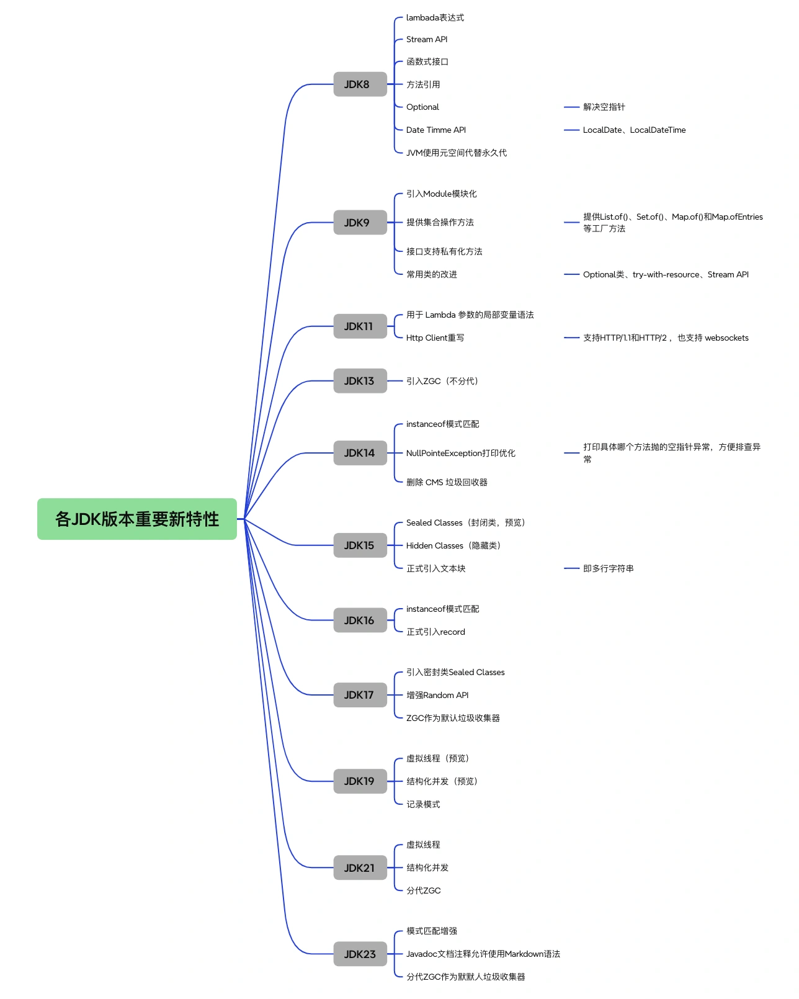
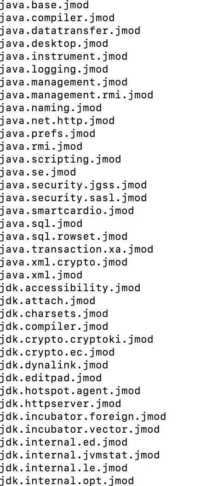
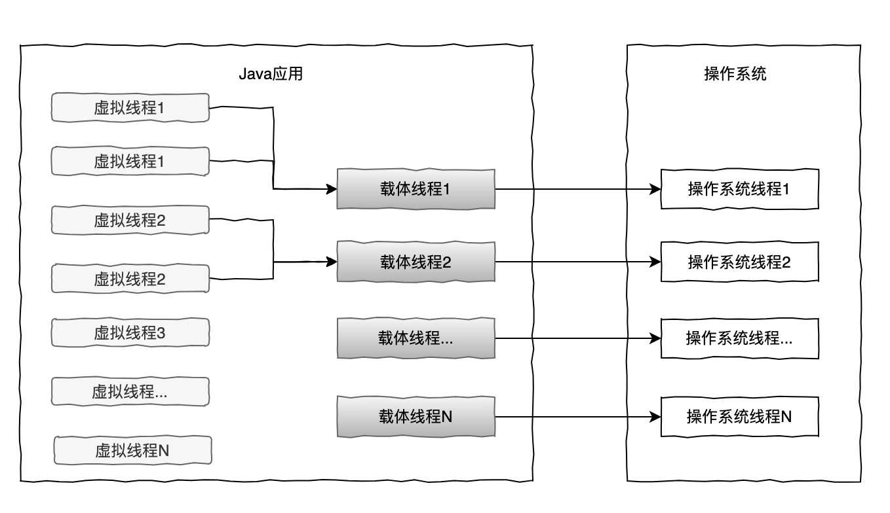

# 012｜JDK8 ~ 23 的新特性有哪些？

<font style="color:rgb(100, 100, 100);background-color:rgb(248, 246, 244);">JDK 版本现在已经出到 23 了，但是目前大部分项目还是在用 JDK8，那么 JDK8 版本后都有啥新特性呢？</font>

<font style="color:rgb(51, 51, 51);background-color:rgb(248, 246, 244);">我们先来简单梳理下一些重要版本推出的新特性：</font>



<font style="color:rgb(51, 51, 51);background-color:rgb(248, 246, 244);">大家在查看 JDK 各版本特性时需要区分下预览特性和正式特性，预览特性是正在开发中的特性，通常还在评估阶段，可能尚未完全确定，而正式特性则是已经确定并可以在生产环境中使用的功能 ‌。</font>

<font style="color:rgb(51, 51, 51);background-color:rgb(248, 246, 244);">比如 Record 是在 JDK14 版本作为预览特性引入的，但是在 JDK16 成为正式特性，所以大家在评估使用 JDK 版本时要注意下这一点。</font>

<font style="color:rgb(51, 51, 51);background-color:rgb(248, 246, 244);">下面我们用些例子来看下不同版本中的一些重要特性，其中有哪些可以大大提供我们的效率和性能呢？</font>

# **<font style="color:rgb(34, 34, 34);background-color:rgb(248, 246, 244);">1、文本块</font>**
<font style="color:rgb(51, 51, 51);background-color:rgb(248, 246, 244);">⽂本块功能，⽂本块指多⾏的字符串，使⽤连续的三个双引号来包围⼀段带换⾏的⽂字，它避免了换⾏转义的需要，并⽀持 String.format。</font>

```plain
public static void main(String[] args) {
        String sql =
                """
                select order_no,amt,st \s
                from order \
                where order_no='123123';
                """;
        System.out.println(sql);
    }
    //输出：
    select order_no,amt,st
from order where order_no='123123';
```

<font style="color:rgb(51, 51, 51);background-color:rgb(248, 246, 244);">如上所示，\表示用来将两行连接成一行，\s 表示单个空白字符。</font>

# **<font style="color:rgb(34, 34, 34);background-color:rgb(248, 246, 244);">2、Switch 表达式</font>**
<font style="color:rgb(51, 51, 51);background-color:rgb(248, 246, 244);">从 JDK8 到 JDK23，Switch 表达式做了很多的增强。</font>

+ <font style="color:rgb(51, 51, 51);background-color:rgb(248, 246, 244);">Switch 语句，既可以做语句使用，也可以做表达式使用。</font>
+ <font style="color:rgb(51, 51, 51);background-color:rgb(248, 246, 244);">添加了 yield 关键字，可以代替 break 和 switch 返回值的作用。</font>

<font style="color:rgb(51, 51, 51);background-color:rgb(248, 246, 244);">表达式使用示例：</font>

```plain
switch (st){
            case "初始化","处理中","下单失败" -> System.out.println(st);
            case "下单成功","支付成功" -> System.out.println(st);
            default -> System.out.println(st);
        }
```

<font style="color:rgb(51, 51, 51);background-color:rgb(248, 246, 244);">返回值使用示例：</font>

```plain
nt state = switch (st){
            case "初始化","处理中","下单失败" -> 1;
            case "下单成功","支付成功" -> 0;
            default -> {
                //其他处理

                yield 2;
            }
        };
```

# **<font style="color:rgb(34, 34, 34);background-color:rgb(248, 246, 244);">3、instanceof 模式匹配</font>**
<font style="color:rgb(51, 51, 51);background-color:rgb(248, 246, 244);">instanceof 增强了模式匹配的功能，如果变量类型经过 instanceof 判断能够匹配⽬标类型，则对应分⽀中⽆需再做类型强转，这样一定程度上使代码更加简洁了。</font>

```plain
if (num instanceof Integer i && i >= 0) {
            //如果是Integer类型，可以直接使用i操作
        } else if (num instanceof List s && s.size() > 0) {

        }
```

# **<font style="color:rgb(34, 34, 34);background-color:rgb(248, 246, 244);">4、记录类 Record</font>**
<font style="color:rgb(100, 100, 100);background-color:rgb(248, 246, 244);">在一些场景中，我们希望对象创建后，它的属性无法被修改，只能通过初始化来设置，那么在 JDK17 中就可以用 record 来定义这个类了。</font>

<font style="color:rgb(51, 51, 51);background-color:rgb(248, 246, 244);">在 JDK17 中，被 record 定义的类是一种不可变的常量，只能用来定义一种简单的不可变的数据结构，如下，使用 record 来声明金额对象，带有金额和币种两个属性：</font>

```plain
public record Amount(BigDecimal amt, String currency) {

}
```

<font style="color:rgb(51, 51, 51);background-color:rgb(248, 246, 244);">这个金额类只能初始化时设置属性值，后面无法被修改（包括反射），在获取属性时，不是通过 get 方法，而是直接通过属性名。</font>

```plain
Amount amount = new Amount(BigDecimal.valueOf(100L),"RMB");
System.out.println(amount.amt());
```

# **<font style="color:rgb(34, 34, 34);background-color:rgb(248, 246, 244);">5、模块化 Module</font>**
<font style="color:rgb(51, 51, 51);background-color:rgb(248, 246, 244);">模块化是 JDK9 之后引入的重要机制，在这之前，通常我们是在一个一个 package 下面写代码的，模块化在包之间增加了更高级别的聚合，module 是 java 中 package 包的上一层抽象，模块路径可以包含多个模块，每个模块可以包含多个包。</font>

<font style="color:rgb(51, 51, 51);background-color:rgb(248, 246, 244);">比如，在 JDK8 安装目录下，JDK 内置的类是以一个个 jar 包的形式存在，在 JDK17 的安装目录下，我们可以看到 jmods 目录下就是这些以 jmod 后缀的文件，这些就是模块。</font>



<font style="color:rgb(51, 51, 51);background-color:rgb(248, 246, 244);">可以看到，在后面 JDK 版本中，JDK 都已经采用模块化的方式。</font>

<font style="color:rgb(100, 100, 100);background-color:rgb(248, 246, 244);">那么，我们要如何使用 module 呢？</font>

<font style="color:rgb(51, 51, 51);background-color:rgb(248, 246, 244);">首先，声明一个 module，在每个模块的根目录下创建一个 module-info.java 文件。 在这个文件中，用 module 关键字，声明一个模块，如下：</font>

```plain
module module1{
    requires java.base;
    exports com.module1;
}
```

+ <font style="color:rgb(51, 51, 51);background-color:rgb(248, 246, 244);">requires：表示对其他 module 的依赖</font>
+ <font style="color:rgb(51, 51, 51);background-color:rgb(248, 246, 244);">exports：表示当前 module 对外开放的 API</font>

# **<font style="color:rgb(34, 34, 34);background-color:rgb(248, 246, 244);">6、虚拟线程</font>**
<font style="color:rgb(51, 51, 51);background-color:rgb(248, 246, 244);">虚拟线程是 Java 中最重要的创新之一，在 JDK21 中正式引入。</font>

<font style="color:rgb(100, 100, 100);background-color:rgb(248, 246, 244);">为什么需要虚拟线程呢？</font>

<font style="color:rgb(51, 51, 51);background-color:rgb(248, 246, 244);">主要之前 Java 线程存在一些不足的地方：</font>

+ <font style="color:rgb(51, 51, 51);background-color:rgb(248, 246, 244);">之前 Java 线程只是对操作系统内核线程的一个简单包装，也就是 Java 线程和操作系统线程是 1:1 的，线程的创建和销毁都需要系统内核完成，这涉及用户态切换，资源开销很大。</font>
+ <font style="color:rgb(51, 51, 51);background-color:rgb(248, 246, 244);">线程栈需要保存在内存中，假设每个线程占用 2MB，创建 200 个线程就需要 400MB。</font>
+ <font style="color:rgb(51, 51, 51);background-color:rgb(248, 246, 244);">线程的上下文切换需要涉及内核的系统调用。</font>



<font style="color:rgb(51, 51, 51);background-color:rgb(248, 246, 244);">因此在高并发场景下，以上都会成为系统性能的瓶颈。而虚拟线程是一种轻量级线程，由 Java 虚拟机调度，虚拟线程占用空间小，线程切换的开销几乎可忽略不计，它的出现就解决了以上问题，可以保证我们编写出高吞吐高并发的应用程序。</font>

<font style="color:rgb(51, 51, 51);background-color:rgb(248, 246, 244);">虚拟线程在使用上和普通线程没有太大差异，以下几种方式都可以，示例：</font>

```plain
Thread.startVirtualThread(() -> {
            //处理任务

        });
        Thread.ofVirtual().start(() -> {
            //处理任务
        });
        ExecutorService executorService = Executors.newVirtualThreadPerTaskExecutor();
        executorService.submit(() -> {
            //处理任务
        });
```


> 更新: 2024-11-07 09:53:04  
> 原文: <https://www.yuque.com/yuqueyonghue6cvnv/cxhfwd/udvl92qtrpfnql6l>