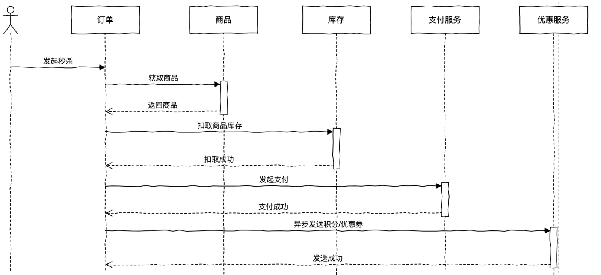
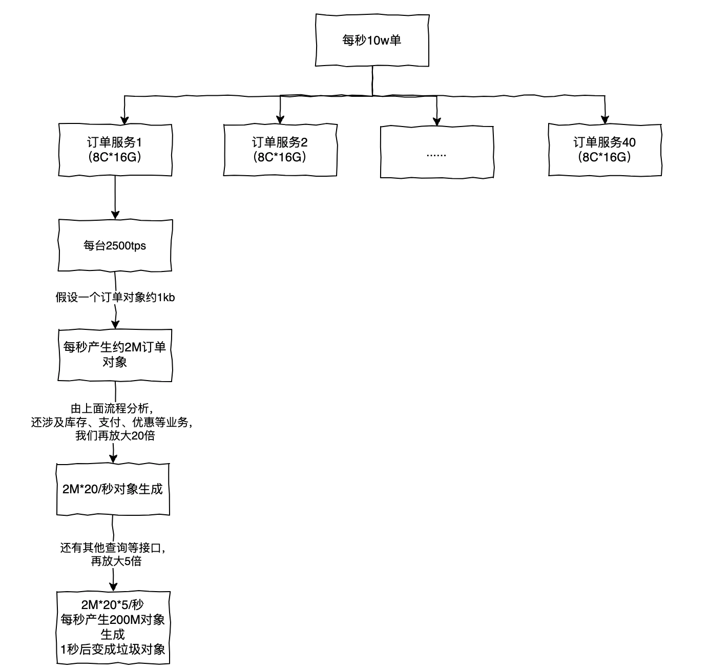
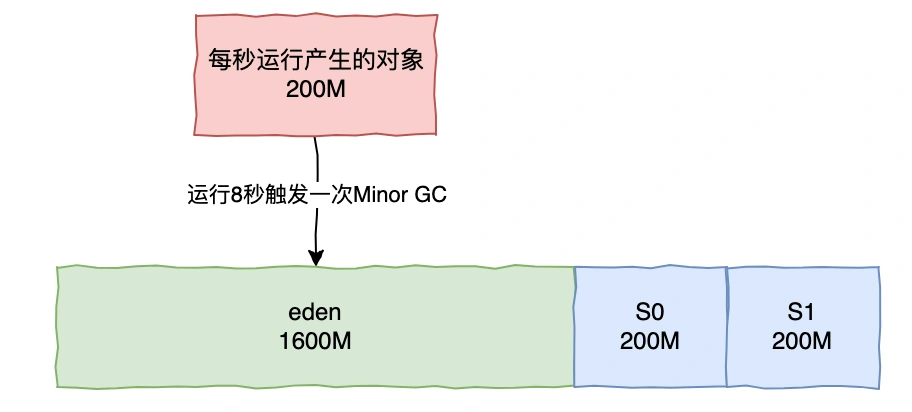
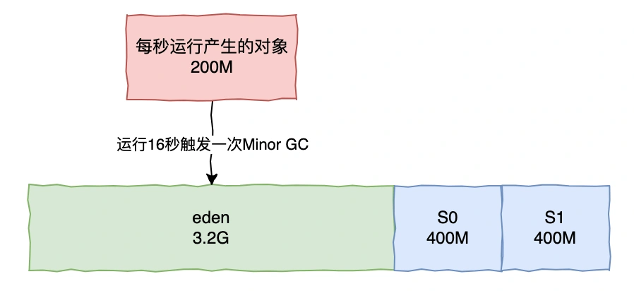

# 013 | 10W 级的并发场景，JVM 如何优化？

<font style="color:rgb(51, 51, 51);background-color:rgb(248, 246, 244);">要支持 10w 级以上的并发场景，在 JVM 那么有哪些方面值得优化呢？</font>

<font style="color:rgb(51, 51, 51);background-color:rgb(248, 246, 244);">以秒杀为例，大型电商系统会拆分多个微服务，比如订单服务，商品服务，优惠服务，库存服务，支付服务等等。</font>

<font style="color:rgb(51, 51, 51);background-color:rgb(248, 246, 244);">我们以下单为例，如下是简约版下单流程</font>



<font style="color:rgb(51, 51, 51);background-color:rgb(248, 246, 244);">一般我们需要结合业务和已有的资源，再去评估 JVM 的 GC 频率来作为参考：</font>

1. <font style="color:rgb(51, 51, 51);background-color:rgb(248, 246, 244);">首先结合业务流程分析，计算我们服务系统每秒产生的对象占用内存大小。</font>
2. <font style="color:rgb(51, 51, 51);background-color:rgb(248, 246, 244);">假设我们采用服务器规模 8C*16G，估算下新生代的空间，大概多久触发 MinorGC。</font>
3. <font style="color:rgb(51, 51, 51);background-color:rgb(248, 246, 244);">为了避免频繁的 Full GC，我们可以重新估算具体需要的机器配置和数量，给 JVM 设置多大内存。</font>

<font style="color:rgb(51, 51, 51);background-color:rgb(248, 246, 244);">我们先来分析下在 10W TPS 下单场景中，我们每秒产生的对象占用内存大小。</font>



## **<font style="color:rgb(34, 34, 34);background-color:rgb(248, 246, 244);">如何选择垃圾回收器？</font>**
<font style="color:rgb(51, 51, 51);background-color:rgb(248, 246, 244);">在选择垃圾回收器的时候，我们需要考虑两个指标：</font>

+ <font style="color:rgb(51, 51, 51);background-color:rgb(248, 246, 244);">吞吐量： CPU 在用户应用程序运行的时间/（CPU 在用户应用程序运行的时间+CPU 垃圾回收器运行的时间）。</font>
+ <font style="color:rgb(51, 51, 51);background-color:rgb(248, 246, 244);">响应时间：平均每次 GC 的耗时。</font>

<font style="color:rgb(51, 51, 51);background-color:rgb(248, 246, 244);">目前主流的垃圾回收器配置是新生代采用 ParNew，老年代采用 CMS 组合的方式，虽然在 JDK8 以后更加推荐使用 G1。一般来说，对于延迟敏感的推荐 CMS；在大内存、要求高吞吐推荐 G1。</font>

<font style="color:rgb(51, 51, 51);background-color:rgb(248, 246, 244);">在电商下单场景中，用户对于些许的延迟可能会比较敏感，所以以下还是以 CMS 使用为例。</font>

<font style="color:rgb(100, 100, 100);background-color:rgb(248, 246, 244);">然后，我要如何设置 JVM 参数呢？</font>

## **<font style="color:rgb(34, 34, 34);background-color:rgb(248, 246, 244);">堆内存大小设置</font>**
<font style="color:rgb(51, 51, 51);background-color:rgb(248, 246, 244);">对于 8G 内存，我们一般设置内存一半多些给 JVM，正常的 JVM 参数设置如下</font>

```plain
-Xms8192M -Xmx8192M Xmn2048M -Xss1M -XX:MMetaspaceSize=256M -XX:MaxMetaspaceSize=256M -XX:SurvivorRatio=8
```



<font style="color:rgb(51, 51, 51);background-color:rgb(248, 246, 244);">这样设置，而在下单场景，大多对象都是短期存活的，这样设置因为动态对象年龄判断原则导致频繁出发 Full GC。 所以可以调整新生代内存大小</font>

```plain
-Xms8192M -Xmx8192M -Xmn4086M -Xss1M -XX:MMetaspaceSize=256M -XX:MaxMetaspaceSize=256M -XX:SurvivorRatio=8
```



<font style="color:rgb(51, 51, 51);background-color:rgb(248, 246, 244);">这样就降低了对象频繁进入老年代的问题，实际上很多优化都是围绕着如何减少 Full GC 去做的，就是尽可能把短期存活的对象留在 survivor 里，不要进入老年代，这样就可以在 Minor GC 的时候回收掉这些对象，不会产生 Full GC，从而引发 STW，影响系统性能。</font>

<font style="color:rgb(100, 100, 100);background-color:rgb(248, 246, 244);">除了新生代大小外，还有什么可以优化呢？</font>

## **<font style="color:rgb(34, 34, 34);background-color:rgb(248, 246, 244);">常见 JVM 参数优化</font>**
1. <font style="color:rgb(51, 51, 51);background-color:rgb(248, 246, 244);">新生代动态对象年龄：默认设置为 15。本例子中每次 Minor GC 间隔 20s 左右，而在下单场景中，一般对象几秒内就会变成垃圾对象了，像这么长时间都还没被回收的话，其实可以早点放到老年代，这样也不会占用新生代的内存了，比如通过设置参数-XX:MaxTenuringThreshold=5，那么经历过 5 次 Minor GC 后就会进入老年代。</font>
2. <font style="color:rgb(51, 51, 51);background-color:rgb(248, 246, 244);">针对大对象，有时我们会在本地缓存一些不常变化的配置，可结合实际业务评估这些对象大小比如会超过 2M，而且会一直存活保留，那么针对这些对象其实可以直接进入老年代，可以通过设置参数-XX:PretenureSizeThreshold=2M。</font>
3. <font style="color:rgb(51, 51, 51);background-color:rgb(248, 246, 244);">针对 CMS 的碎片整理，因为 CMS 基于标记-清除算法实现，会产生内存碎片，如果这些内存碎片长时间不清理的话，那么老年代的内存可用空间会降低，所以 CMS 也提供了两个参数用于内存碎片的整理：</font>
    - <font style="color:rgb(51, 51, 51);background-color:rgb(248, 246, 244);">-XX:+UseCMSCompactAtFullCollection，开启内存碎片整理。</font>
    - <font style="color:rgb(51, 51, 51);background-color:rgb(248, 246, 244);">-XX:CMSFullGCsBeforeCompaction，执行指定次数的 Full GC 后，进行一次内存整理压缩整理的 Full GC。</font>
4. <font style="color:rgb(51, 51, 51);background-color:rgb(248, 246, 244);">元空间大小，Meta 区域的大小一定要指定，如果我们代码类或引入动态生成类的技术超过元空间大小，那么会触发 Full GC，可以通过 jstat 命令查看项目生成类的大小来评估具体设置值，一般设置 256M 够了。</font>
5. <font style="color:rgb(51, 51, 51);background-color:rgb(248, 246, 244);">JIT 即时编译，-XX:ReservedCodeCacheSize。JIT 是 JVM 一个非常重要的特性，CodeCahce 存放的就是即时编译器所生成的二进制代码。</font>
6. <font style="color:rgb(51, 51, 51);background-color:rgb(248, 246, 244);">JVM 逃逸分析，逃逸分析也是一种优化手段，JVM 如果分析确定一个对象不会逃逸于方法之外，那么这个对象会被分配在栈上，而不是在堆上，这样一定程度上就可以减轻 GC 压力。</font>


> 更新: 2024-11-07 09:53:39  
> 原文: <https://www.yuque.com/yuqueyonghue6cvnv/cxhfwd/dzgyt6q2fb12y34u>