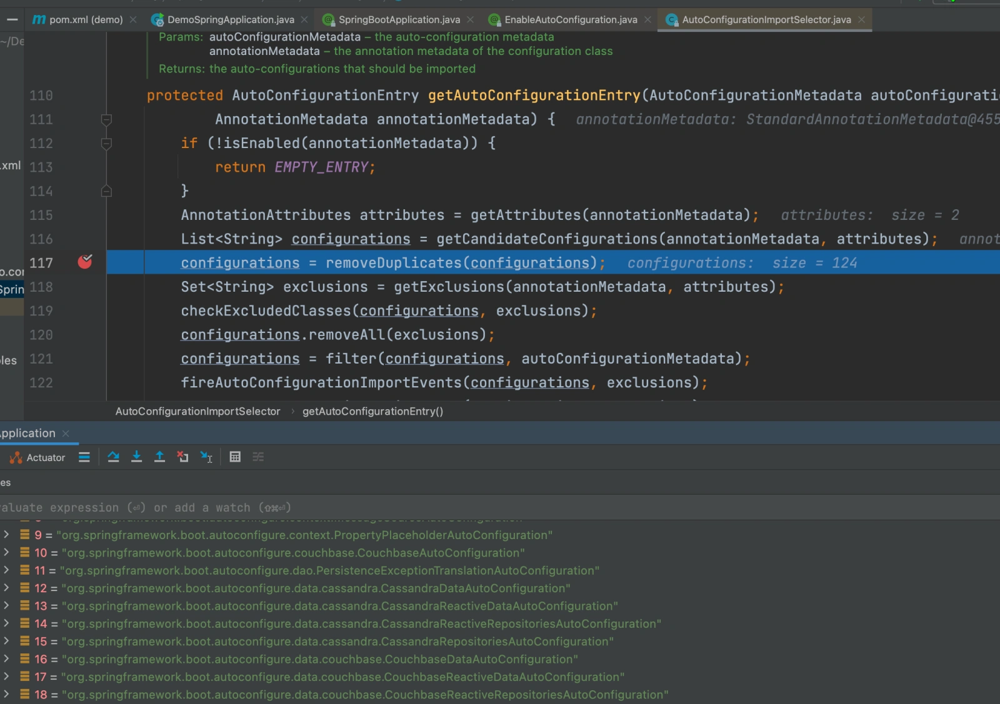
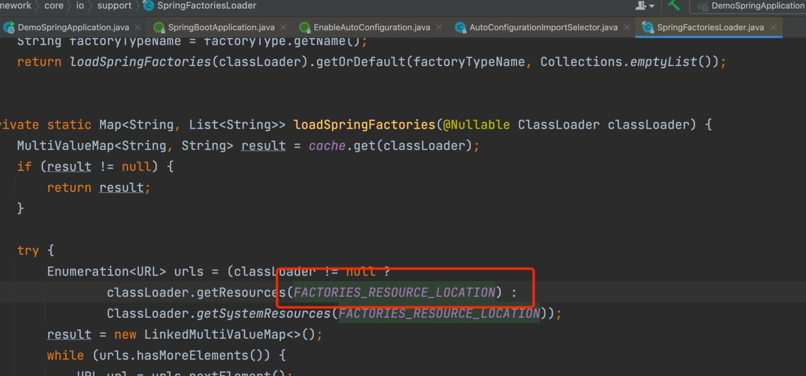
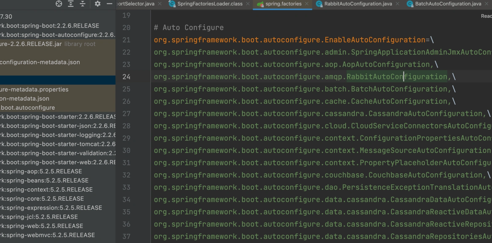

# 014｜Springboot 自动化配置实现原理？

<font style="color:rgb(51, 51, 51);background-color:rgb(248, 246, 244);">我们都知道，使用 SprngBoot 可以大大简化我们的开发效率，相比于 SpringMVC，省去了我们定义一堆配置类的工作，那么它是如何实现的呢？所谓的约定大于配置、自动配置又是指什么？</font>

<font style="color:rgb(51, 51, 51);background-color:rgb(248, 246, 244);">码哥创建了《Java 面试高手心法 58 讲》陪伴群，群里可以答疑、以及赠送书籍活动，每满 100 人会发红包。提那家我的微信： Magebyte1024，备注「面试专栏」，即可进群。</font>

# **<font style="color:rgb(34, 34, 34);background-color:rgb(248, 246, 244);">@SpringBootApplication</font>**
<font style="color:rgb(51, 51, 51);background-color:rgb(248, 246, 244);">首先，我们先来看下 SpringBoot 的启动注解 @SpringBootApplication</font>

```less
@Target(ElementType.TYPE)
@Retention(RetentionPolicy.RUNTIME)
@Documented
@Inherited
@SpringBootConfiguration
@EnableAutoConfiguration
@ComponentScan(excludeFilters = { @Filter(type = FilterType.CUSTOM, classes = TypeExcludeFilter.class),
        @Filter(type = FilterType.CUSTOM, classes = AutoConfigurationExcludeFilter.class) })
public @interface SpringBootApplication {
}
```

<font style="color:rgb(51, 51, 51);background-color:rgb(248, 246, 244);">@SpringBootApplication 注解是标注在某个类上，SpringBoot 就运行这个类的 main 方法来启动 SpringBoot 应用，由代码可见，它其实就是一个组合注解，主要包含三个注解</font>

+ <font style="color:rgb(51, 51, 51);background-color:rgb(248, 246, 244);">@SpringBootConfiguration：这个注解点进去会发现其实就是@Configuration，用来标注当前类是配置类。</font>
+ <font style="color:rgb(51, 51, 51);background-color:rgb(248, 246, 244);">@EnableAutoConfiguration：表示开启自动配置。</font>
+ <font style="color:rgb(51, 51, 51);background-color:rgb(248, 246, 244);">@ComponentScan：配置包扫描，我们可以自定义配置需要扫描或排除的路径或类。</font>

<font style="color:rgb(51, 51, 51);background-color:rgb(248, 246, 244);">重点在@EnableAutoConfiguration 这个注解，这个是自动配置的核心实现关键。</font>

```less
@Target(ElementType.TYPE)
@Retention(RetentionPolicy.RUNTIME)
@Documented
@Inherited
@AutoConfigurationPackage
@Import(AutoConfigurationImportSelector.class)
public @interface EnableAutoConfiguration {
}
```

1. <font style="color:rgb(51, 51, 51);background-color:rgb(248, 246, 244);">@AutoConfigurationPackage：这个注解里有一个@Import 注解，Spring 的@Import 注解简单来说就是导入一组 Class 到 Spring 容器，这里主要是把@SpringBootApplication 标注的类即启动类，所在包路径或子路径下所有的组件都扫描注册到 Spring 容器中。</font>

<font style="color:rgb(100, 100, 100);background-color:rgb(248, 246, 244);">提问：这里会扫描哪些类呢？</font>

<font style="color:rgb(51, 51, 51);background-color:rgb(248, 246, 244);">主要是标注了 Spring 特点注解的类，比如@Component、@Service、@Repository、@Controller、@Configuration，以及带有@ComponentScan 注解指定扫描的包路径。</font>

1. <font style="color:rgb(51, 51, 51);background-color:rgb(248, 246, 244);">@Import(AutoConfigurationImportSelector.class)：AutoConfigurationImportSelector 这个是开启自动配置类的选择器，决定了带入哪些类。</font>

<font style="color:rgb(51, 51, 51);background-color:rgb(248, 246, 244);">我们启动时打个断点进去会发现在 AutoConfigurationImportSelector 的 getAutoConfigurationEntry 方法加载了一堆配置类，类名词都是**AutoConfiguration。</font>



<font style="color:rgb(100, 100, 100);background-color:rgb(248, 246, 244);">那么这些都是默认的配置类了，它是如何加载的呢？</font>

# **<font style="color:rgb(34, 34, 34);background-color:rgb(248, 246, 244);">SpringBoot SPI 机制</font>**
<font style="color:rgb(51, 51, 51);background-color:rgb(248, 246, 244);">再点击上一步的 getCandidateConfigurations 方法进去看，最后进到这里</font>



<font style="color:rgb(51, 51, 51);background-color:rgb(248, 246, 244);">可以发现 AutoConfigurationImportSelector 对象是通过 SPI 机制，解析 Jar 包下的 META_INF/spring.factories 文件，取 key 为 EnableAutoConfiguration 的数据项，并做初步的条件过滤，作为自动配置类。如下图</font>



<font style="color:rgb(51, 51, 51);background-color:rgb(248, 246, 244);">这就是所谓“约定大于配置”了，SpringBoot 通过 SPI 机制去加载约定路径 META_INF/spring.factories 文件下的配置类。</font>

<font style="color:rgb(100, 100, 100);background-color:rgb(248, 246, 244);">我们看到上面配置类非常多，这些全部都会创建注入到 Spring 容器吗？</font>

# **<font style="color:rgb(34, 34, 34);background-color:rgb(248, 246, 244);">@Conditional 注解</font>**
<font style="color:rgb(51, 51, 51);background-color:rgb(248, 246, 244);">当然不是，我们只会创建我们需要引入的类，这里有用到另一个关键注解@Conditional。</font>

<font style="color:rgb(51, 51, 51);background-color:rgb(248, 246, 244);">@Conditional 是 Spring 底层注解，作用是根据不同条件，来创建注入满足指定条件下的配置类。</font>

<font style="color:rgb(51, 51, 51);background-color:rgb(248, 246, 244);">常用的 Conditional 注解：</font>

+ <font style="color:rgb(51, 51, 51);background-color:rgb(248, 246, 244);">ConditionalOnBean：是否存在某个某类或某个名字的 Bean</font>
+ <font style="color:rgb(51, 51, 51);background-color:rgb(248, 246, 244);">ConditionalOnMissingBean：是否缺失某个某类或某个名字的 Bean</font>
+ <font style="color:rgb(51, 51, 51);background-color:rgb(248, 246, 244);">ConditionalOnSingleCandidate：是否符合指定类型的 Bean 只有一个</font>
+ <font style="color:rgb(51, 51, 51);background-color:rgb(248, 246, 244);">ConditionalOnClass：是否存在某个类</font>
+ <font style="color:rgb(51, 51, 51);background-color:rgb(248, 246, 244);">ConditionalOnMissingClass：是否缺失某个类</font>
+ <font style="color:rgb(51, 51, 51);background-color:rgb(248, 246, 244);">ConditionalOnExpression：指定的表达式返回的是 true 还是 false</font>
+ <font style="color:rgb(51, 51, 51);background-color:rgb(248, 246, 244);">ConditionalOnJava：判断 Java 版本</font>
+ <font style="color:rgb(51, 51, 51);background-color:rgb(248, 246, 244);">ConditionalOnWebApplication：当前应用是不是一个 Web 应用</font>
+ <font style="color:rgb(51, 51, 51);background-color:rgb(248, 246, 244);">ConditionalOnNotWebApplication：当前应用不是一个 Web 应用</font>
+ <font style="color:rgb(51, 51, 51);background-color:rgb(248, 246, 244);">ConditionalOnProperty：Environment 中是否存在某个属性</font>

<font style="color:rgb(51, 51, 51);background-color:rgb(248, 246, 244);">也就是说，最后还是通过 @Conditional 去加载满足特定条件下的配置类。</font>

# **<font style="color:rgb(34, 34, 34);background-color:rgb(248, 246, 244);">SpringBoot 与 Tomcat 整合</font>**
<font style="color:rgb(51, 51, 51);background-color:rgb(248, 246, 244);">通过前面我们知道了 Spring Boot 的自动配置机制，我们再来看下实际开源组件中是如何做的，以 SpringBoot 和 Tomcat 的整合为例子。</font>

<font style="color:rgb(51, 51, 51);background-color:rgb(248, 246, 244);">一般我们要创建一个 web 项目，需要引入 spring-boot-starter-web 这个 jar 包，而这个 spring-boot-starter-web jar 包实际上又引入了 spring-web、spring-webmvc、spring-boot-starter-tomcat（里面有引入了 tomcat-embed-core），所以我们引入 spring-boot-starter-web 相当于引入了 Tomcat。</font>

<font style="color:rgb(51, 51, 51);background-color:rgb(248, 246, 244);">在 SpringBoot 众多配置类中有一个 ServletWebServerFactoryAutoConfiguration：</font>

```less
@Configuration(proxyBeanMethods = false)
@AutoConfigureOrder(Ordered.HIGHEST_PRECEDENCE)
@ConditionalOnClass(ServletRequest.class)
@ConditionalOnWebApplication(type = Type.SERVLET)
@EnableConfigurationProperties(ServerProperties.class)
@Import({ ServletWebServerFactoryAutoConfiguration.BeanPostProcessorsRegistrar.class,
        ServletWebServerFactoryConfiguration.EmbeddedTomcat.class,
        ServletWebServerFactoryConfiguration.EmbeddedJetty.class,
        ServletWebServerFactoryConfiguration.EmbeddedUndertow.class })
public class ServletWebServerFactoryAutoConfiguration {
}
```

<font style="color:rgb(51, 51, 51);background-color:rgb(248, 246, 244);">可以看到，这个配置类的条件为：</font>

+ <font style="color:rgb(51, 51, 51);background-color:rgb(248, 246, 244);">@ConditionalOnClass(ServletRequest.class)：项目依赖需要有 ServletRequest 类</font>
+ <font style="color:rgb(51, 51, 51);background-color:rgb(248, 246, 244);">@ConditionalOnWebApplication(type = Type.SERVLET)：项目应用类型是 SpringMVC。</font>

<font style="color:rgb(51, 51, 51);background-color:rgb(248, 246, 244);">因为引入了 Tomcat，第一个条件满足，引入 spring-boot-starter-web 中的 webmvc，第二个条件也满足，所以 Spring 会去加载它。</font>

<font style="color:rgb(51, 51, 51);background-color:rgb(248, 246, 244);">Import 注解里有几个配置类，看其中一个</font>

```less
@Configuration(proxyBeanMethods = false)
    @ConditionalOnClass({ Servlet.class, Tomcat.class, UpgradeProtocol.class })
    @ConditionalOnMissingBean(value = ServletWebServerFactory.class, search = SearchStrategy.CURRENT)
    static class EmbeddedTomcat {
    }
```

<font style="color:rgb(51, 51, 51);background-color:rgb(248, 246, 244);">其实就是说，通常我们项目中有 Tomcat 依赖，那就基本符合条件了，TomcatServletWebServerFactory 这个对象也就被加载到 Spring 容器中，其它两个 EmbeddedJetty、EmbeddedUndertow 也一样。</font>

<font style="color:rgb(51, 51, 51);background-color:rgb(248, 246, 244);">后面就是通过 TomcatServletWebServerFactory 去完成 Tomcat 加载、启动的事了，到这里也就完成了基本的加载了。</font>

<font style="color:rgb(51, 51, 51);background-color:rgb(248, 246, 244);">最后，你知道如何自定义实现一个 SpringBoot Starer 了吗？</font>


> 更新: 2025-05-15 21:30:55  
> 原文: <https://www.yuque.com/yuqueyonghue6cvnv/cxhfwd/pxlqqp22ib7tvts8>