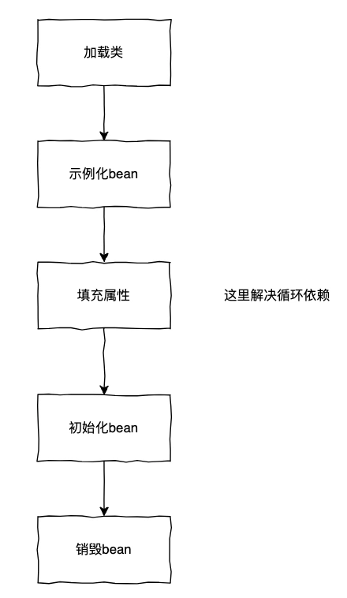
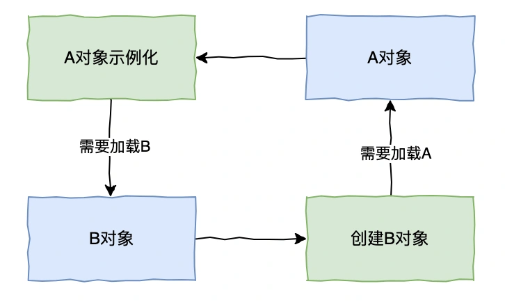
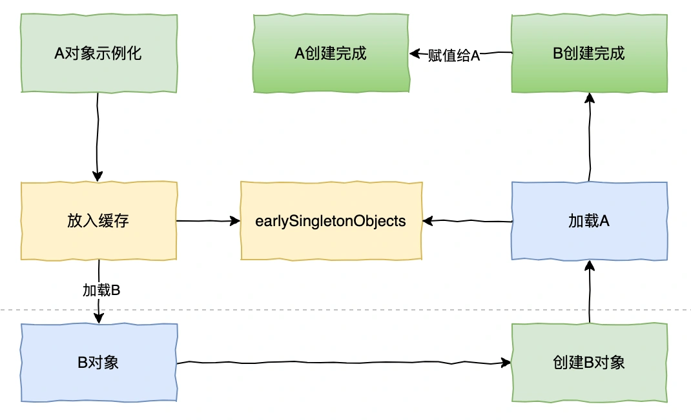
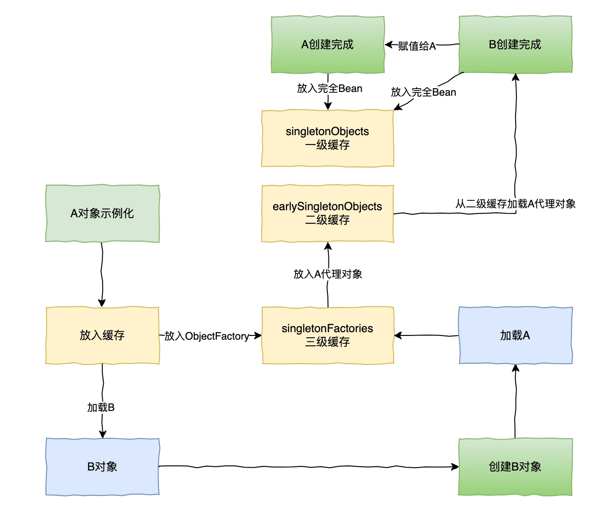

# 015 | Spring 循环依赖如何解决？

<font style="color:rgb(100, 100, 100);background-color:rgb(248, 246, 244);">什么是循环依赖？</font>

<font style="color:rgb(51, 51, 51);background-color:rgb(248, 246, 244);">很简单，就是对象 A 依赖对象 B，而对象 B 又依赖了对象 A。</font>

```perl
// A依赖了B
class A{
 private B b;
}

// B依赖了A
class B{
 private A a;
}
```

<font style="color:rgb(51, 51, 51);background-color:rgb(248, 246, 244);">正常情况下，如果我们手动 new 的方式去创建对象，那么循环依赖根本不算问题，而在 Spring 中，一个对象的创建不是简单的 new 出来的，而是通过一系列 Bean 生命周期，也才导致循环依赖问题的出现。</font>

<font style="color:rgb(51, 51, 51);background-color:rgb(248, 246, 244);">我们先来看下 Bean 的生命周期</font>



<font style="color:rgb(51, 51, 51);background-color:rgb(248, 246, 244);">那么根据上文，A 类中存在一个 B 类的 b 属性，当 A 类示例化时，就会去给 b 属性去赋值，此时就会去 BeanFactory 中去获取 B 类所对应的单例 bean。如果此时 BeanFactory 中存在 B 对应的 Bean，那么直接拿来赋值给 b 属性；如果此时 BeanFactory 中不存在 B 对应的 Bean，则需要生成一个 B 对应的 Bean，然后赋值给 b 属性。</font>



<font style="color:rgb(51, 51, 51);background-color:rgb(248, 246, 244);">问题出现在 BeanFactory 不存在 B 对应 Bean 的时候，需要去示例化 B，这时又需要去对 A 类的属性 a 做一样的操作，就出现了循环依赖。</font>

<font style="color:rgb(100, 100, 100);background-color:rgb(248, 246, 244);">那这个问题要如何解决呢？我能不能提前把创建的 A 放到一个中间缓存对象呢？</font>

## **<font style="color:rgb(34, 34, 34);background-color:rgb(248, 246, 244);">二级缓存思路</font>**
<font style="color:rgb(51, 51, 51);background-color:rgb(248, 246, 244);">假设在示例化 A 后，先提前把 A 存入到一个缓存 Map 中，就叫 earlySingletonObjects。这时候会发现在创建 B 时，就可以到这个缓存 Map 把提前加载到缓存的 A 取出，完成 B 的对象创建，最后把 B 对象赋值到 A 对象的 b 属性，那么 A 自然就创建出来了。</font>



<font style="color:rgb(51, 51, 51);background-color:rgb(248, 246, 244);">因为创建的单例对象始终只有一个，即使 B 加载的 A 属性是原始对象也不影响，因为最终 A 对象是加载完成的。</font>

<font style="color:rgb(100, 100, 100);background-color:rgb(248, 246, 244);">在这个过程中，貌似 Spring 用一个缓存 ap 就可以解决了，那为什么还需要第三级缓存？</font>

<font style="color:rgb(51, 51, 51);background-color:rgb(248, 246, 244);">因为 Spring 还存在对象是 AOP 代理的情况，如果 A 对象是被 Spring AOP 代理，最终生成的是一个代理对象，而 B 一开始加载的却是 A 的原始对象，显然是有问题的。</font>

<font style="color:rgb(51, 51, 51);background-color:rgb(248, 246, 244);">我们再来看下 Bean 的生命周期，AOP 是通过 BeanPostProcessor 来实现的，在 Spring 中 AOP 利用的要么是 JDK 动态代理，要么 CGLib 的动态代理，所以如果给一个类中的某个方法设置了切面，那么这个类最终就需要生成一个代理对象。</font>

<font style="color:rgb(100, 100, 100);background-color:rgb(248, 246, 244);">那么要如何解决这种情况呢？</font>

## **<font style="color:rgb(34, 34, 34);background-color:rgb(248, 246, 244);">三级缓存思路</font>**
<font style="color:rgb(51, 51, 51);background-color:rgb(248, 246, 244);">在 Spring 中，就是用三级缓存来解决这种循环依赖问题的，我们来看下有哪三级。</font>

+ <font style="color:rgb(51, 51, 51);background-color:rgb(248, 246, 244);">singletonObjects：一级缓存，主要存放的是已经完成实例化、属性填充和初始化所有步骤的单例 Bean 实例。</font>
+ <font style="color:rgb(51, 51, 51);background-color:rgb(248, 246, 244);">earlySingletonObjects：主要存放的已经完成初始化，但属性还没自动赋值的 Bean。</font>
+ <font style="color:rgb(51, 51, 51);background-color:rgb(248, 246, 244);">singletonFactories：singletonFactories 中存的是某个 beanName 对应的 ObjectFactory，在 bean 的生命周期中，生成完原始对象之后，就会构造一个 ObjectFactory 存入 singletonFactories 中。当前 bean 在依赖注入时发现出现了循环依赖，从三级缓存根据 beanName 得到一个 ObjectFactory，然后调用 ObjectFactory 生成 Bean，此时会得到一个 A 原始对象经过 AOP 之后的代理对象，然后把该代理对象放入 earlySingletonObjects 中。</font>

<font style="color:rgb(51, 51, 51);background-color:rgb(248, 246, 244);">完整加载流程如下</font>



<font style="color:rgb(51, 51, 51);background-color:rgb(248, 246, 244);">首先，Spring 创建 Bean 实例，这里仅仅是实例化，未初始化属性。</font>

<font style="color:rgb(51, 51, 51);background-color:rgb(248, 246, 244);">然后，缓存创建 Bean 的工厂对象 ObjectFactory 到三级缓存 singletonFactories。</font>

<font style="color:rgb(51, 51, 51);background-color:rgb(248, 246, 244);">接着，在注入属性时，发现某个依赖对象未初始化完成，会从三级缓存获取 ObjectFactory，内部秩序 Lambda 表达式得到代理对象，放入二级缓存。</font>

<font style="color:rgb(51, 51, 51);background-color:rgb(248, 246, 244);">最后，把对象引用赋值给对应属性，对象创建完成后放入 singletonObjects。</font>

<font style="color:rgb(51, 51, 51);background-color:rgb(248, 246, 244);">至此，整个循环依赖解决了。</font>

## **<font style="color:rgb(34, 34, 34);background-color:rgb(248, 246, 244);">循环依赖解决方式</font>**
<font style="color:rgb(51, 51, 51);background-color:rgb(248, 246, 244);">最后，再来总结下 Spring 出现循环依赖场景</font>

<font style="color:rgb(51, 51, 51);background-color:rgb(248, 246, 244);">能解决循环依赖的场景：</font>

+ <font style="color:rgb(51, 51, 51);background-color:rgb(248, 246, 244);">单例属性注入（setter）</font>
+ <font style="color:rgb(51, 51, 51);background-color:rgb(248, 246, 244);">单例的字段注入（Autowired 注解）</font>

<font style="color:rgb(51, 51, 51);background-color:rgb(248, 246, 244);">不能解决循环依赖的场景：</font>

+ <font style="color:rgb(51, 51, 51);background-color:rgb(248, 246, 244);">多例 setter 注入</font>
+ <font style="color:rgb(51, 51, 51);background-color:rgb(248, 246, 244);">构造器注入</font>
+ <font style="color:rgb(51, 51, 51);background-color:rgb(248, 246, 244);">DependsOn 循环依赖</font>

<font style="color:rgb(51, 51, 51);background-color:rgb(248, 246, 244);">对于构造器注入的循环依赖，可以通过 Setter 注入 或 字段注入，或者通过 @Lazy 注解延迟注入。而对于原型 Bean 的循环依赖，通常需要通过其他设计模式或调整作用域来避免了。</font>


> 更新: 2025-05-15 21:31:06  
> 原文: <https://www.yuque.com/yuqueyonghue6cvnv/cxhfwd/qlrhburphe5a5xhm>