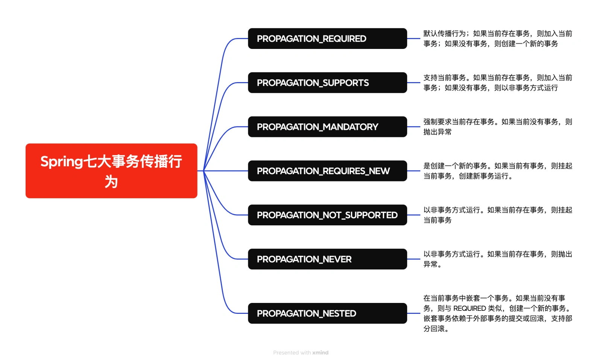
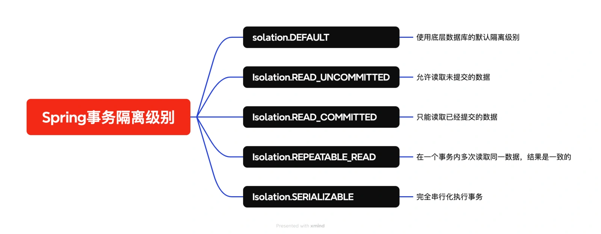

# 016｜Spring 事务都有哪些坑？事务失效的原因有哪些

<font style="color:rgb(51, 51, 51);">大家工作中肯定有用过 Spring 事务，在某些情况下，我们对多张表进行操作，为了保证这个业务操作的原子性（一起成功或一起失败），我们就会用到 Spring 事务来避免数据不一致的情况发生。</font>

<font style="color:rgb(51, 51, 51);">我们使用 Spring 事务也比较简单，主要有两种</font>

+ <font style="color:rgb(51, 51, 51);">声明式事务：通过@Transactional 注解来实现，这个方法的核心是 AOP（面向切面编程），Spring 会在方法执行前、后以及发生异常时处理事务。</font>
+ <font style="color:rgb(51, 51, 51);">编程式事务：编程式事务管理也就是你通过手动控制事务的方式，去提交和回滚事务，通过 PlatformTransactionManager 使用。</font>

<font style="color:rgb(51, 51, 51);">那么，大家在使用 Spring 事务的时候有遇到哪些坑呢？我在代码中明明使用了事务，但是却没有生效？或者没有按照你预期的方式去运行？</font>

<font style="color:rgb(51, 51, 51);">下面我们一起来看下都有哪些坑。</font>

## **<font style="color:rgb(34, 34, 34);">1、方法没有被 public 修饰</font>**
<font style="color:rgb(51, 51, 51);">通过事务注解使用的方式，方法没有被 public 修饰、使用 private、final、static 修饰等。</font>

```typescript
@Transactional
    private void performTransaction() {
        doSomething();
    }
```

<font style="color:rgb(51, 51, 51);">我们知道，Spring 使用 AOP 来处理事务，而 AOP 默认是基于代理的。由于 Spring AOP 默认基于 JDK 动态代理 或 CGLIB 代理，只有 public 方法才会被代理，private、static 和 final 方法不会被代理，所以导致事务管理无法生效。</font>

## **<font style="color:rgb(34, 34, 34);">2、同一个类中的方法调用</font>**
<font style="color:rgb(51, 51, 51);">@Transactional 不能拦截同一个类中的方法调用</font>

```typescript
public void performTransaction() {
        doSomething();
    }
    @Transactional
    public void doSomething(){

    }
```

<font style="color:rgb(51, 51, 51);">Spring 创建的代理对象会拦截外部调用，但方法内部的调用不会经过代理。可把方法移到</font>**<font style="color:rgb(34, 34, 34);">外部类或者通过 Spring 上下文的方式调用。</font>**

## **<font style="color:rgb(34, 34, 34);">3、只对 RuntimeException 和 Error 生效</font>**
<font style="color:rgb(51, 51, 51);">默认对 RuntimeException 和 Error 生效。</font>

<font style="color:rgb(51, 51, 51);">Spring 默认只会在 RuntimeException 和 Error 类的异常发生时回滚事务。而对于检查异常（如 IOException、SQLException 等），默认是不会回滚的.</font>

```csharp
@Transactional(rollbackFor = {SQLException.class, Exception.class})
public void someMethod() throws SQLException {
    // 执行数据库操作
}
```

<font style="color:rgb(51, 51, 51);">如果要回滚，需要自己指定异常类型。</font>

## **<font style="color:rgb(34, 34, 34);">4、Spring 事务传播行为的坑</font>**
<font style="color:rgb(100, 100, 100);">大家看下这段代码，如果 B 抛出异常，A 会回滚吗？</font>

```java
@Transactional(propagation = Propagation.REQUIRED)
public void A() {
        B();
    }
 @Transactional(propagation = Propagation.REQUIRES_NEW)
 public void B(){

    }
```

<font style="color:rgb(51, 51, 51);">答案是不会，因为 Propagation.REQUIRES_NEW 表示每次都会创建一个新的事务，这个与 A 方法的事务是隔离的。</font>

<font style="color:rgb(51, 51, 51);">我们再看下 Spring 事务都有哪些传播行为。</font>



## **<font style="color:rgb(34, 34, 34);">5、多数据源下的事务</font>**
<font style="color:rgb(51, 51, 51);">如果我们的项目是</font>**<font style="color:rgb(34, 34, 34);">多数据源的场景，事务是无法正确地在多个数据源间传播的</font>**<font style="color:rgb(51, 51, 51);">，Spring 默认的事务管理器（如 DataSourceTransactionManager）只能管理一个数据源的事务。</font>

<font style="color:rgb(51, 51, 51);">如果你的事务没有生效，那么很可能是你共用了一个事务管理器，应该如下面的代码针对每个数据源都有配置相应的事务管理器才行。</font>

```typescript
@Configuration
public class MultiDataSourceConfig {
    @Bean
    public DataSourceTransactionManager transactionManagerA() {
        return new DataSourceTransactionManager(dataSourceA());
    }

    @Bean
    public DataSourceTransactionManager transactionManagerB() {
        return new DataSourceTransactionManager(dataSourceB());
    }
}
```

## **<font style="color:rgb(34, 34, 34);">6、多线程下使用 Spring 事务</font>**
<font style="color:rgb(51, 51, 51);">我们很多场景下都会用到多线程去提高程序的运行效率，那在下面的多线程场景下使用 Spring 事务会生效吗？</font>

```plain
@Transactional
    public void executeTransaction() {
        // 保存订单
        orderRepository.save(order1);

        // 更新余额
        new Thread(() -> {
            balanceRepository.upt(balance1);
        }).start();
    }
```

<font style="color:rgb(51, 51, 51);">这种情况当然不会，因为 Spring 的事务是通过 ThreadLocal 来保证线程安全的，事务和当前线程绑定在一起，新线程无法继承主线程的事务上下文。</font>

<font style="color:rgb(51, 51, 51);">我们可以通过编程式事务 TransactionTemplate 的方式解决。</font>

## **<font style="color:rgb(34, 34, 34);">7、Spring 事务隔离级别的坑</font>**
<font style="color:rgb(51, 51, 51);">在我们使用 Spring 事务隔离级别的时候，也会碰到一些坑，比如</font>

```java
@Transactional(isolation = Isolation.READ_UNCOMMITTED)
    public void processTransaction() {
        // 查询一个账户余额
        BigDecimal balance = accountRepository.getBalance(accountId);

        // 假设余额不足，抛出异常
        if (balance.compareTo(BigDecimal.ZERO) < 0) {
            throw new RuntimeException("Insufficient balance!");
        }
    }
```

<font style="color:rgb(51, 51, 51);">如果另一个事务正在修改账户余额且未提交，READ_UNCOMMITTED 隔离级别可能读取未提交的数据，导致逻辑判断错误。</font>

<font style="color:rgb(51, 51, 51);">所以我们需要设置正确的隔离级别，当然默认情况下</font>**<font style="color:rgb(34, 34, 34);">与数据库隔离级别保持一致就行</font>**<font style="color:rgb(51, 51, 51);">，较多的情况我们都是使用读已提交或可重复读这两个级别。</font>



**<font style="color:rgb(157, 157, 157);background-color:rgb(255, 253, 252);">  
</font>**


> 更新: 2025-05-15 21:31:33  
> 原文: <https://www.yuque.com/yuqueyonghue6cvnv/cxhfwd/ulfhnzgwuxvkylog>