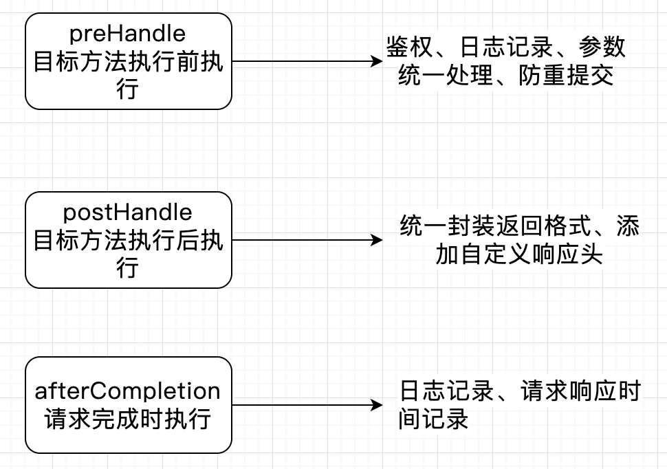

# 017 | Spring 扩展点有哪些？优雅宕机、平滑启动、动态创建 Bean......

<font style="color:rgb(100, 100, 100);background-color:rgb(248, 246, 244);">Spring 有哪些扩展点，工作又有用到哪些呢？</font>

<font style="color:rgb(51, 51, 51);background-color:rgb(248, 246, 244);">本文就来讲一些 Spring 比较常见且实用的扩展点。</font>

## **<font style="color:rgb(34, 34, 34);background-color:rgb(248, 246, 244);">BeanPostProcessor</font>**
<font style="color:rgb(51, 51, 51);background-color:rgb(248, 246, 244);">BeanPostProcessor，即 Bean 的后置处理器，作用是在每个 Bean 实例化后、初始化前后执行，可以在 Bean 初始化前后进行自定义操作。 Spring 常见内置的 BeanPostProcessor 有：</font>

+ <font style="color:rgb(51, 51, 51);background-color:rgb(248, 246, 244);">AutowiredAnnotationBeanPostProcessor:处理@Autowired 注解的依赖注入。</font>
+ <font style="color:rgb(51, 51, 51);background-color:rgb(248, 246, 244);">RequiredAnnotationBeanPostProcessor: 检查标注了@Required 的属性是否被设置。</font>
+ <font style="color:rgb(51, 51, 51);background-color:rgb(248, 246, 244);">InstantiationAwareBeanPostProcessor：允许在 Bean 实例化前进行额外的处理，比如通过代理或工厂方法返回代理对象</font>
+ <font style="color:rgb(51, 51, 51);background-color:rgb(248, 246, 244);">SmartInstantiationAwareBeanPostProcessor：扩展 InstantiationAwareBeanPostProcessor，支持提前暴露 Bean 的引用，用于解决循环依赖。</font>
+ <font style="color:rgb(51, 51, 51);background-color:rgb(248, 246, 244);">CommonAnnotationBeanPostProcessor： 处理@Resource、@PostConstruct、@PreDestroy 注解</font>
+ <font style="color:rgb(51, 51, 51);background-color:rgb(248, 246, 244);">AnnotationAwareAspectJAutoProxyCreator： 处理一些注解或者是 AOP 切面的动态代理</font>

<font style="color:rgb(51, 51, 51);background-color:rgb(248, 246, 244);">通过上面的 BeanPostProcessor 的实现，可以看出 Spring 很多注解都是通过它实现的。</font>

<font style="color:rgb(100, 100, 100);background-color:rgb(248, 246, 244);">它在哪些第三方框架中有用到呢？</font>

1. <font style="color:rgb(51, 51, 51);background-color:rgb(248, 246, 244);">MyBatis 框架：MyBatis-Spring 使用 MapperScannerConfigurer，结合 BeanPostProcessor 自动扫描 Mapper 接口并注入到 Spring 容器中。Spring 容器初始化时，通过 BeanPostProcessor 实现为每个 Mapper 接口创建代理，从而实现 SQL 查询映射。</font>
2. <font style="color:rgb(51, 51, 51);background-color:rgb(248, 246, 244);">Feign：Spring Cloud 的 FeignClientFactoryBean 使用 BeanPostProcessor 为带有 @FeignClient 注解的接口创建代理对象，将方法调用转换为对应的 REST API 请求，简化服务间的通信。</font>

## **<font style="color:rgb(34, 34, 34);background-color:rgb(248, 246, 244);">BeanFactoryPostProcessor</font>**
<font style="color:rgb(51, 51, 51);background-color:rgb(248, 246, 244);">BeanFactoryPostProcessor 表示 Bean 的后置处理器，是用来对 Bean 进行加工的，类似的，BeanFactoryPostProcessor 理解为 BeanFactory 的后置处理器，用来用对 BeanFactory 进行加工的。</font>

<font style="color:rgb(51, 51, 51);background-color:rgb(248, 246, 244);">Spring 支持用户定义 BeanFactoryPostProcessor 的实现类 Bean，来对 BeanFactory 进行加工，比如：</font>

```java
@Component
public class CustBeanFactoryPostProcessor implements BeanFactoryPostProcessor {

 @Override
 public void postProcessBeanFactory(ConfigurableListableBeanFactory beanFactory) throws BeansException {
  BeanDefinition beanDefinition = beanFactory.getBeanDefinition("userService");
  beanDefinition.setAutowireCandidate(false);
 }
}
```

<font style="color:rgb(51, 51, 51);background-color:rgb(248, 246, 244);">上面这个代码，就是在创建单例 Bean 之前，利用了 BeanFactoryPostProcessor 来拿到 BeanFactory，然后获取 BeanFactory 内的某个 BeanDefinition 对象并进行修改。</font>

## **<font style="color:rgb(34, 34, 34);background-color:rgb(248, 246, 244);">BeanDefinitionRegistryPostProcessor</font>**
<font style="color:rgb(51, 51, 51);background-color:rgb(248, 246, 244);">这个主要用来修改 BeanDefinition，实例化 Bean 对象之前，需要先读取 Bean 的相关属性，保存到 BeanDefinition 对象中。</font>

```plain
public interface BeanDefinitionRegistryPostProcessor extends BeanFactoryPostProcessor {

 void postProcessBeanDefinitionRegistry(BeanDefinitionRegistry registry) throws BeansException;

}
```

<font style="color:rgb(51, 51, 51);background-color:rgb(248, 246, 244);">我们可以看到 BeanDefinitionRegistryPostProcessor 继承了 BeanFactoryPostProcessor 接口，并新增了一个方法，如果我们提供一个类来实现 BeanDefinitionRegistryPostProcessor，那么在 postProcessBeanDefinitionRegistry()方法中就可以实现注册 BeanDefinition 的逻辑了。</font>

```java
@Component
public class CustDefinitionRegistryPostProcessor implements BeanDefinitionRegistryPostProcessor {

 @Override
 public void postProcessBeanDefinitionRegistry(BeanDefinitionRegistry registry) throws BeansException {
  AbstractBeanDefinition beanDefinition = BeanDefinitionBuilder.genericBeanDefinition().getBeanDefinition();
  beanDefinition.setBeanClass(User.class);
  registry.registerBeanDefinition("user", beanDefinition);
 }

 @Override
 public void postProcessBeanFactory(ConfigurableListableBeanFactory beanFactory) throws BeansException {
  BeanDefinition beanDefinition = beanFactory.getBeanDefinition("userService");
  beanDefinition.setAutowireCandidate(false);
 }
}
```

## **<font style="color:rgb(34, 34, 34);background-color:rgb(248, 246, 244);">全局异常处理</font>**
<font style="color:rgb(100, 100, 100);background-color:rgb(248, 246, 244);">在业务代码中无法避免抛出异常给用户，你们项目中是如何处理的？</font>

<font style="color:rgb(51, 51, 51);background-color:rgb(248, 246, 244);">我们当然不能直接返回代码的异常信息给到用户，首先这个非常不友好，而且还可能会暴露核心源码出去，那么我们就会用到 Spring 的全局异常处理。核心注解@RestControllerAdvice、@ExceptionHandler，如下：</font>

```perl
@RestControllerAdvice
public class GlobalExceptionHandler {

    @ExceptionHandler(Exception.class)
    public String handleException(Exception e) {
        //处理异常，返回指定错误吗
        retur nnull;
    }
}
```

<font style="color:rgb(51, 51, 51);background-color:rgb(248, 246, 244);">我们可以如上面代码去拦截我们想要抛出去的自定义异常，根据参数异常、业务异常、系统异常等不同异常类型，去封装要返回出去的错误吗，还可在这统一做异常码的监控，而不需要在代码中每个地方都处理一遍。</font>

## **<font style="color:rgb(34, 34, 34);background-color:rgb(248, 246, 244);">自定义拦截器</font>**
<font style="color:rgb(51, 51, 51);background-color:rgb(248, 246, 244);">很多情况下，我们希望拦截 Http 请求做一些公共处理，比如鉴权、日志打印、自定义监控、自定义请求头、请求参数统一处理等，这时候我们就可以用到 Spring 自定义拦截器 HandlerInterceptor，它主要有三个核心方法：</font>



## **<font style="color:rgb(34, 34, 34);background-color:rgb(248, 246, 244);">Spring 平滑启动</font>**
<font style="color:rgb(51, 51, 51);background-color:rgb(248, 246, 244);">通过实现 ApplicationRunner 的接口，可以在 Spring 项目启动时提前做一些扩展处理，比如缓存预热，服务预热等，在应用启动后针对 redis，数据库，feign 等调用查询一遍，完成链接池资源初始化，这样时不会因为需要加载资源导致第一笔请求出现特别慢的情况，很好地实现了服务的平滑启动。</font>

```java
@Component
public class CustRunner implements ApplicationRunner {

    @Autowired
    private LoadDCacheService loadCacheService;

    public void run(ApplicationArguments args) throws Exception {
        loadCacheService.load();
    }
}
```

## **<font style="color:rgb(34, 34, 34);background-color:rgb(248, 246, 244);">Spring 优雅停机</font>**
<font style="color:rgb(100, 100, 100);background-color:rgb(248, 246, 244);">Spring 如何做到优雅停机？重启服务时请求还没处理完怎么办？</font>

```plain
server:
  shutdown: graceful
```

<font style="color:rgb(51, 51, 51);background-color:rgb(248, 246, 244);">通过上面启用 Graceful Shutdown 的方式，</font>**<font style="color:rgb(34, 34, 34);background-color:rgb(248, 246, 244);">启用后 Spring 确保应用关闭时，会关闭接受新的请求，以及处理完所有请求后再终止进程</font>**<font style="color:rgb(51, 51, 51);background-color:rgb(248, 246, 244);">。当然这个也有时间限制的，默认是 30s，也可以通过 server.shutdown.grace-period 来自定义。</font>

<font style="color:rgb(51, 51, 51);background-color:rgb(248, 246, 244);">除此之外，在服务停机时，我们还可以去自定义一些处理逻辑比如关闭资源操作等，通过实现 DisposableBean 接口的方式。</font>

```java
@Component
public class CustDestoryService implements DisposableBean {

    @Override
    public void destroy() throws Exception {
        // 执行资源清理等操作

    }
}
```

<font style="color:rgb(51, 51, 51);background-color:rgb(248, 246, 244);">Spring 还有其它很常用的扩展地方，比如 Spring Bean 的初始化方法@PostConstruct、过滤器 Filter、Spring Event 等等，这里就不一一展开了，大家可以自己慢慢摸索。</font>


> 更新: 2025-05-15 21:31:50  
> 原文: <https://www.yuque.com/yuqueyonghue6cvnv/cxhfwd/ugux2syevae3y8yz>