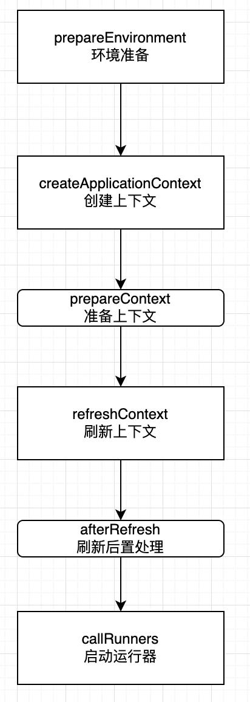

# 018 | Spring 有哪些经典的设计模式？你在项目中有使用过哪些？

<font style="color:rgb(100, 100, 100);">你知道 Spring 中有哪些经典的设计模式吗？你在项目中有使用过吗？</font>

## **<font style="color:rgb(34, 34, 34);">1、工厂模式</font>**
<font style="color:rgb(100, 100, 100);">工厂模式：工厂模式通过定义一个接口或抽象类来创建对象，而由子类决定具体实例化的类。</font>

<font style="color:rgb(51, 51, 51);">Spring 通过 BeanFactory 和 ApplicationContext 使用工厂模式，创建和管理 Bean，很好地将创建对象和使用对象的逻辑分离，提高了代码的可扩展性。</font>

```plain
ApplicationContext context = new AnnotationConfigApplicationContext(AppConfig.class);
  MyService myService = context.getBean(MyService.class);
```

## **<font style="color:rgb(34, 34, 34);">2、单例模式</font>**
<font style="color:rgb(100, 100, 100);">单例模式：单例模式确保一个类只有一个实例，并提供全局访问点。</font>

<font style="color:rgb(51, 51, 51);">在 Spring 中，Bean 的默认作用域是 Singleton，也就是默认使用单例模式管理创建 Bean，主要是为了避免重复创建无状态对象，节省资源开销。</font>

```plain
// 测试
ApplicationContext context = new AnnotationConfigApplicationContext(AppConfig.class);
SingletonBean bean1 = context.getBean(SingletonBean.class);
SingletonBean bean2 = context.getBean(SingletonBean.class);
System.out.println(bean1 == bean2); // 结果为true
```

## **<font style="color:rgb(34, 34, 34);">3、代理模式</font>**
<font style="color:rgb(100, 100, 100);">代理模式：代理模式通过代理对象控制对目标对象的访问。</font>

<font style="color:rgb(51, 51, 51);">Spring AOP 就是使用动态代理来实现方法拦截和切面逻辑的，达到在不修改目标对象的情况下，动态添加横切逻辑（如日志、事务）的目的。</font>

<font style="color:rgb(51, 51, 51);">Spring 中实现动态代理有两种方式：</font>

+ <font style="color:rgb(51, 51, 51);">JDK 动态代理：如果目标类实现了接口，Spring 默认使用 JDK 动态代理，仅代理接口方法。</font>
+ <font style="color:rgb(51, 51, 51);">CGLIB：如果目标类没有实现接口，Spring 必须使用 CGLIB 动态代理，也可通过注解@EnableAspectJAutoProxy(proxyTargetClass = true)强制使用。</font>

```java
@Aspect
@Component
public class LoggingAspect {
    @Before("execution(* com.example.service.OrderService.*(..))")
    public void logBefore() {
        System.out.println("Method execution started.");
    }
}

@Service
public class OrderService {
    public void performTask() {
        System.out.println("Task performed.");
    }
}
```

## **<font style="color:rgb(34, 34, 34);">4、模板方法模式</font>**
<font style="color:rgb(100, 100, 100);">模版方法：模板方法模式定义一个算法的骨架，允许子类实现具体步骤。</font>

<font style="color:rgb(51, 51, 51);">模板方法的作用主要是避免重复实现通用逻辑，提高代码复用性，Spring 中很多地方都有使用到这个设计模式，比如 JdbcTemplate、RestTemplate、SpringApplication 的 run 方法等。</font>

<font style="color:rgb(51, 51, 51);">特别在 Spring 启动流程中，它的核心方法</font><font style="color:rgb(51, 51, 51);"> </font>[<font style="color:rgb(177, 75, 67);">SpringApplication.run</font>](http://springapplication.run/)<font style="color:rgb(51, 51, 51);">()就是启动流程的模板方法，定义了启动的整体骨架。</font>



<font style="color:rgb(51, 51, 51);">这里 Spring 就是通过在 run 明确定义了启动流程的每一个步骤，在这每一个步骤中都提供了钩子方法和监听器事件去扩展，提高了代码的灵活扩展性。</font>

<font style="color:rgb(51, 51, 51);">比如在 callRunners 最后一步会去调用 ApplicationRunner 和 CommandLineRunner，那么我们可以通过实现 ApplicationRunner 接口，自定义应用启动时做一些预热加载动作，也可以实现 ApplicationListener 接口自定义监听 Spring 启动后要做的逻辑处理。</font>

## **<font style="color:rgb(34, 34, 34);">5、观察者模式</font>**
<font style="color:rgb(100, 100, 100);">观察者模式：观察者模式定义了对象间一对多的依赖，当一个对象状态改变时，所有依赖者会收到通知。</font>

<font style="color:rgb(51, 51, 51);">Spring 的 ApplicationEvent 就是基于观察者模式实现事件机制，实现了松耦合的消息通知机制，非常便于扩展。</font>

## **<font style="color:rgb(34, 34, 34);">6、适配器模式</font>**
<font style="color:rgb(100, 100, 100);">适配器模式：适配器模式通过包装一个对象，使其兼容其他接口。</font>

<font style="color:rgb(51, 51, 51);">在 Spring MVC 中，HandlerAdapter 就是使用适配器模式适配不同类型的控制器，使得 DispatcherServlet 可以无缝支持多种类型的 Handler，而无需了解其具体实现细节。</font>

<font style="color:rgb(51, 51, 51);">比如 SimpleControllerHandlerAdapter 处理实现 Controller 接口的控制器，HttpRequestHandlerAdapter 处理实现 HttpRequestHandler 接口的控制器，RequestMappingHandlerAdapter 处理使用@RequestMapping 注解的控制器。</font>

<font style="color:rgb(51, 51, 51);">适配器三个角色定义：</font>

+ <font style="color:rgb(51, 51, 51);">目标接口（Target）：客户端期望的接口，在 Spring MVC 中是 HandlerAdapter。</font>
+ <font style="color:rgb(51, 51, 51);">适配者（Adaptee）：被适配的类，在 Spring MVC 中是各种 Handler 实现。</font>
+ <font style="color:rgb(51, 51, 51);">适配器（Adapter）：适配器类，连接 HandlerAdapter 和 Handler。</font>

<font style="color:rgb(100, 100, 100);">如果我要自定义一个自己的处理器，那么要如何适配呢？</font>

<font style="color:rgb(51, 51, 51);">首先，自定义处理器</font>

```java
public interface CustomHandler {
    void processRequest(HttpServletRequest request, HttpServletResponse response) throws Exception;
}
```

<font style="color:rgb(51, 51, 51);">自定义适配器：</font>

```plain
public class CustomHandlerAdapter implements HandlerAdapter {
    //判断当前适配器是否支持CustomHandler（自定义控制器）
    @Override
    public boolean supports(Object handler) {
        return handler instanceof CustomHandler;
    }
    //执行Handler逻辑
    @Override
    public ModelAndView handle(HttpServletRequest request, HttpServletResponse response, Object handler) throws Exception {
        ((CustomHandler) handler).processRequest(request, response);
        return null;
    }
   //返回资源的最后修改时间，用于缓存支持
    @Override
    public long getLastModified(HttpServletRequest request, Object handler) {
        return -1;
    }
}
```

<font style="color:rgb(51, 51, 51);">注册自定义适配器</font>

```typescript
@Configuration
public class WebConfig implements WebMvcConfigurer {
    @Override
    public void configureHandlerAdapters(List<HandlerAdapter> adapters) {
        adapters.add(new CustomHandlerAdapter());
    }
}
```

<font style="color:rgb(51, 51, 51);">这样，DispatcherServlet 就可以支持处理 CustomHandler 类型的控制器了。</font>

## **<font style="color:rgb(34, 34, 34);">7、责任链模式</font>**
<font style="color:rgb(100, 100, 100);">责任链模式：职责链模式将多个对象按顺序链接，每个对象处理请求并决定是否传递给下一个对象。</font>

<font style="color:rgb(51, 51, 51);">Spring Security 过滤器链和 Spring MVC 的拦截器链中都有使用到责任链模式，这样可以灵活地自定义过滤器、拦截器加到链中，每个过滤器按顺序执行，每个处理逻辑都是独立的，非常便于扩展和修改。</font>

<font style="color:rgb(100, 100, 100);">假设在做一个金融交易项目，需要校验参数，订单号、金额、子账户号合法性、账户是否存在等等，你会如何实现这个校验逻辑呢？</font>

<font style="color:rgb(100, 100, 100);">小白：等等，这个我会，不是很简单吗，直接上代码</font>

```plain
if(!validateOrder()){
    throw new RuntimeException("订单校验不通过！");
}else if(!validateAmount()){
    throw new RuntimeException("金额校验不通过！");
}else if(!validateAcct()){
    throw new RuntimeException("子账户校验不通过！");
}......
```

<font style="color:rgb(51, 51, 51);">这段代码虽然能跑通逻辑，但是看起来又臭又长，学习到这篇文章后，当然是使用责任链模式来实现啦，我们可以封装好每个校验处理器，每个接口自定义一个责任链把需要校验的组件加入到链中即可。</font>

<font style="color:rgb(51, 51, 51);">首先，定义责任链节点接口</font>

```java
public interface ValidationHandler {
    /**
     * 处理校验逻辑
     * @param request 校验请求数据
     * @throws ValidationException 校验异常
     */
    void handle(ValidationRequest request) throws ValidationException;
}
```

<font style="color:rgb(51, 51, 51);">然后，实现每个校验处理器组件，这里以订单号校验组件为例子。</font>

```java
//订单号校验组件
public class OrderValidationHandler implements ValidationHandler {
    @Override
    public void handle(ValidationRequest request) throws ValidationException {
        if (!isValidOrder(request.getOrderNumber())) {
            throw new ValidationException("订单号无效");
        }
        System.out.println("订单号校验通过");
    }

    private boolean isValidOrder(String orderNumber) {
        // 模拟校验订单号逻辑
        return orderNumber.startsWith("ORD");
    }
}
```

<font style="color:rgb(51, 51, 51);">最后，定义一个类用于构建责任链</font>

```plain
public class ValidationChain {
    private final List<ValidationHandler> handlers = new ArrayList<>();

    public ValidationChain addHandler(ValidationHandler handler) {
        handlers.add(handler);
        return this;
    }

    public void execute(ValidationRequest request) throws ValidationException {
        for (ValidationHandler handler : handlers) {
            handler.handle(request);
        }
    }
}
```

<font style="color:rgb(51, 51, 51);">使用举例</font>

```plain
// 构建责任链
            ValidationChain chain = new ValidationChain();
            chain.addHandler(new ParameterValidationHandler())
                 .addHandler(new OrderValidationHandler())
                 .addHandler(new AmountValidationHandler())
                 .addHandler(new SubAccountValidationHandler())
                 .addHandler(new PermissionValidationHandler());

            // 执行责任链
            chain.execute(request);
```

<font style="color:rgb(51, 51, 51);">这样在新增校验逻辑时，只需要实现新的 ValidationHandler 即可，而且每个接口根据自己需要校验的逻辑构建自己的责任链，非常便于扩展。</font>

<font style="color:rgb(51, 51, 51);">大家如果不想再写冗长 if else 的代码判断逻辑，可以考虑采用这种优雅的方式来实现。</font>


**<font style="color:rgb(157, 157, 157);background-color:rgb(255, 253, 252);">  
</font>**


> 更新: 2025-05-15 21:32:18  
> 原文: <https://www.yuque.com/yuqueyonghue6cvnv/cxhfwd/igzn7ilz9w9en6hc>