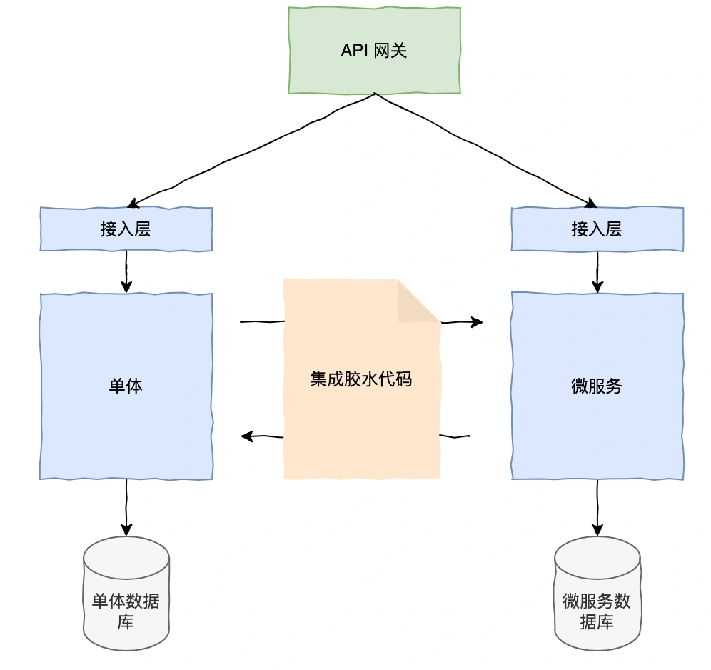
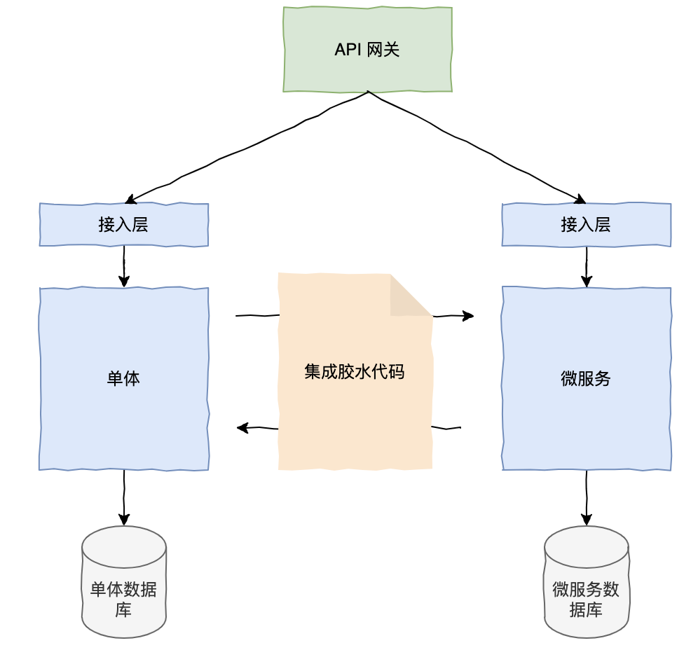
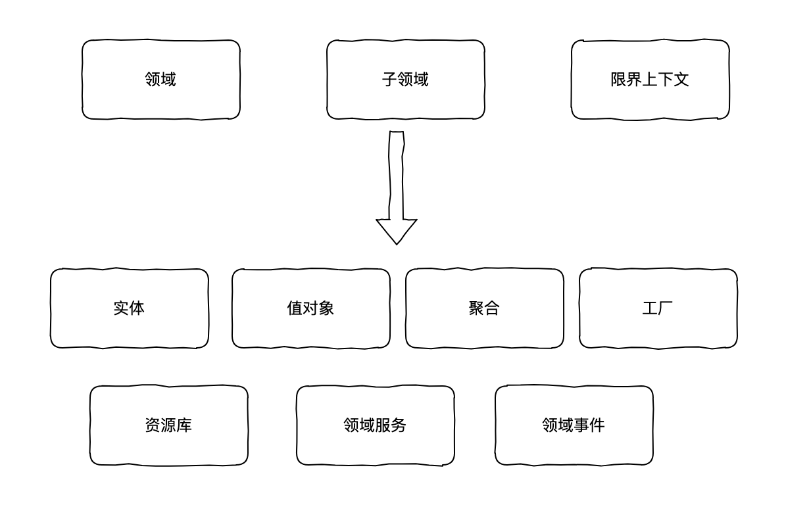

# 019|单体应用如何重构为微服务，架构原则有哪些？

不知道大家有没有用负责过这样一个大单体应用，在这个应用里，不同业务的代码都放在一个项目里，为了快速实现业务需求，代码业务全部在一个地方实现，逻辑写得"又臭又长"。

然后，业务又提了新的优化需求，后面的人怕出问题也不敢改这段代码，于是直接从这个地方拷贝代码到新的地方修修改改，测试没问题后又直接上线了，此以往，周而复始，这些代码越来越多，最后形成一座大山，于是出现了各种问题：

+ 可扩展性差：比如你的项目涉及交易、结算、账户等等不同模块，这些代码耦合在一个项目里，即时你只需要修改其中一个地方，可能都需要全量回归，大大增加了测试的复杂度。而一旦某个模块出问题时，你的整个系统就不可用了，这时你又得加班加点了。
+ 部署困难：单体应用往往是一个“大包”部署，涉及所有模块的更新和部署。对于金融交易项目，任何一个模块的小更新或修复，都可能需要停机进行整体更新，影响系统的高可用性和业务连续性。特别是当系统的交易量较大时，停机时间可能导致用户体验恶化。
+ 维护成本高：在一个大型的单体应用中，多个开发人员同时开发多个功能模块时，可能会导致开发效率降低和代码冲突，测试和运维的成本也逐渐增加。
+ 横向扩容差：这些单体应用难以横向扩展，在处理高并发、大流量的金融交易时，如果请求量突然增加，于是只能对整个应用一起扩容，造成资源浪费。
+ 技术栈不够灵活：单体应用中的不同模块可能会使用相同的技术栈，例如 Spring Boot、MySQL 等。但是随着项目的不断发展，某些模块可能会需要使用不同的技术栈来满足特定需求。在单体架构下，你无法独立选择和替换某些技术栈。

于是，为了一劳永逸，你们决定要对这个单体应用重构成微服务，那么单体应用要如何重构为微服务呢？

## **“一步到位”式重构**
这种方式是指，你从零开始开发一个全新基于微服务的应用来替代旧的单体应用，从头开始去重构设计听起来很不错，可以把旧系统所有的历史债直接抛弃，吸取以前的教训从新开始。

但是这种风险太大，最后大概率是失败告终，因为这种方式代价太高，一个复杂的金融项目可能就需要花费数年来复制现有功能，才能完全替换掉现有的业务功能。而且这过程中得考虑新的业务是不可能停止等你重构完的，你必须同时开发和维护新老的应用，这样工作量就一直变化不定，重构的目标只会越来越遥远。

## **“绞杀式”重构**
我们应该逐步重构单体应用，而不是推倒重来，重构新应用应该与单体应用结合使用，随着时间的推移，单体应用实现的功能数量越来越小，直到完全消失或者变成另一个微服务。

这种策略就像热带雨林的绞杀藤蔓生长在一棵树的周围，并沿着树的枝干一直向上生长，这棵树往往会逐渐死去，最后只会留下一棵树状的藤蔓，这被称为“绞杀式应用”。

通常，有以下几个策略实现对单体的“绞杀”，最后逐步替换成微服务。

### **1、新功能采用微服务实现**
挖坑法则：当你发现自己已经陷入了困境，就不要再给自己继续挖坑了。

当你的单体应用变得无法管理时，这时不要继续在这个单体应用添加新功能了，这会使得你的单体应用变等更庞大、更复杂，所以你应该实现新功能为服务，这是把单体应用逐步迁移到微服务架构的开始。

那么这里就涉及到新旧两套系统并行的阶段，如何将新旧系统融入到一个架构中呢?

+ API 网关：对新功能的请求路由到新服务，旧功能的请求路由到旧服务。
+ 集成胶水代码：把微服务和单体结合，使新服务能够访问单体应用的数据，能够调用单体实现的功能。

理想情况下，新的功能与单体应用完全分离，但是实际上很多业务是耦合在一起的，或者有些功能点非常小，只是修改或新增某个字段，这时强行将这些功能分离成太多服务，会发现服务之间的通信开销会变得更大，还会遇到数据一致性问题，这样就得不偿失了。

所以，除了以服务的方式实现新功能，必须对现有的单体应用功能抽象分离到新服务。

### **2、前后端分离**
在面对一些前后端不分离的应用，必须将表现层和业务逻辑层、数据层分开。

表现层：一般由处理 HTTP 请求的模块组成，生成实现 Web UI 的 HTML 页面。

将表现层和业务、数据层分开后，有两个好处，一是可实现独立地开发、部署和测试，二是帮助业务层设计和提取出它的 API，能够提供出去被前端或其它微服务调用。

### **3、抽象提取服务**
主要的工作量其实是在于业务层单体应用中，这里提取服务要如何实现呢？都有哪些挑战？

1. 如何拆分领域：如何把单体应用的业务领域模型拆分成不同的、独立的领域模型，以及拆分到不同的服务中？
2. 数据库拆分：将业务拆分到不同的服务后，如何对这个单体数据库重构？
3. 服务的 API 设计？
4. 数据一致性和性能如何兼顾的问题？

**领域模型**

在拆分领域模型时，可能会遇到不同问题，比如涉及到类的拆分、对象的引用。

在业界中，比较流行的就是 DDD（领域驱动设计），DDD 提供了一种方法，通过清晰地划分领域模型，更好地实现微服务化。

+ 识别子领域：一个子领域可能就对应一个微服务，比如交易服务、账户服务、结算服务等。
+ 划分领域边界：DDD 提出“限界上下文”的概念，是指一个特定的领域及相关的业务规则，每个微服务通常对应一个限界上下文。
+ 设计领域模型：设计实体、值对象、聚合、领域服务、领域事件等等。

领域驱动设计是一门很值得研究学习的课程，里面蕴含的思想运用在开发上可以很好地帮助我们设计松耦合、高内聚的服务。

**重构数据库**

应用领域模型的拆分不可避免的也会带来数据的拆分，拆分单体数据库时，参考《数据库重构》一书，可以考虑采用分阶段迁移。

在拆分单体数据库时，数据迁移通常是一个渐进过程。可以采用逐步迁移策略，先将数据库拆分成多个数据库实例，再逐步将数据迁移到各个微服务中。

拆分后，原有的数据库结构可能会与新的微服务架构不完全兼容，因此迁移过程中可以使用“数据库双写”模式，即在迁移期间将数据同时写入单体数据库和新微服务的数据库中。

**API 设计**

微服务 API 设计是至关重要的一部分，直接影响到服务之间的交互、扩展性、可维护性和开发效率。常见的 API 设计有哪些值得参考的原则呢？

+ 幂等性：即无论客户端请求多少次，服务器返回的结果应始终一致。
+ 无状态化：每个请求都应该包含完成操作所需的所有信息，服务器不应该保存客户端的状态，请求与响应是独立的。
+ 统一的错误码：API 设计应该有统一的错误码规范，每个服务都应该严格遵循对应规范。
+ API 的版本控制：在重构项目中，因为接口会变动，那么比较的方式就是通过在 URL 中显式指定版本，如 /api/v1/resource 或 /api/v2/resource。
+ 高内聚、低耦合：API 的设计需要确保服务之间的解耦和独立性，比如单一职责等等设计模式。
+ 安全性：为了避免未经授权的访问和数据泄漏，API 的授权认证非常重要，这里涉及到不同类型的安全认证，比如 OAuth2、JWT、加密通信、签名、以及还有业务级别的权限控制。
+ 容错和降级：微服务接口设计必须要考虑异常情况，比如超时时间、熔断机制、服务降级措施等。

**数据一致性**

在服务和数据库拆分后，必须要考虑的一个问题就是如何保证数据一致性？因为之前在单体应用，可能比较简单粗暴的所有业务逻辑都放在一个事务内实现，服务的性能由机器配置来决定，那么拆分后就涉及到跨服务、跨数据库的分布式事务问题了。

常见的分布式事务解决方案有以下几种：

+ Saga 模式：是一种分布式事务管理模式，通过将一个大的分布式事务拆分为多个小的局部事务来执行，每个局部事务都可以独立提交。
+ TCC：是一种基于补偿的分布式事务解决方案，每个操作都会分为三个阶段：尝试（Try）、确认（Confirm）和取消（Cancel）。
+ 基于消息队列：比如基于 Rocketmq 事务消息保证本地事务和消息发送的原子性，消费侧由消费者保证最终成功。
+ 对账补偿：比如由定时任务实现两端数据对账，最终补偿差异部分。

> 更新: 2025-05-15 21:32:33  
> 原文: <https://www.yuque.com/yuqueyonghue6cvnv/cxhfwd/sqetoltnqigsw7zv>