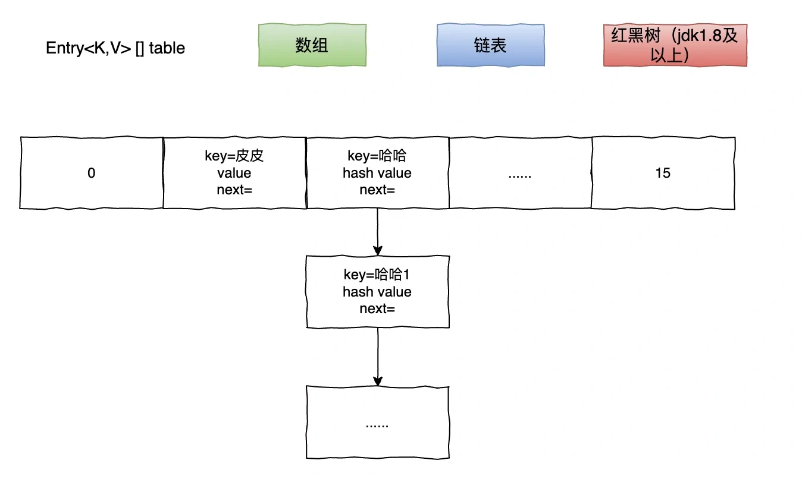
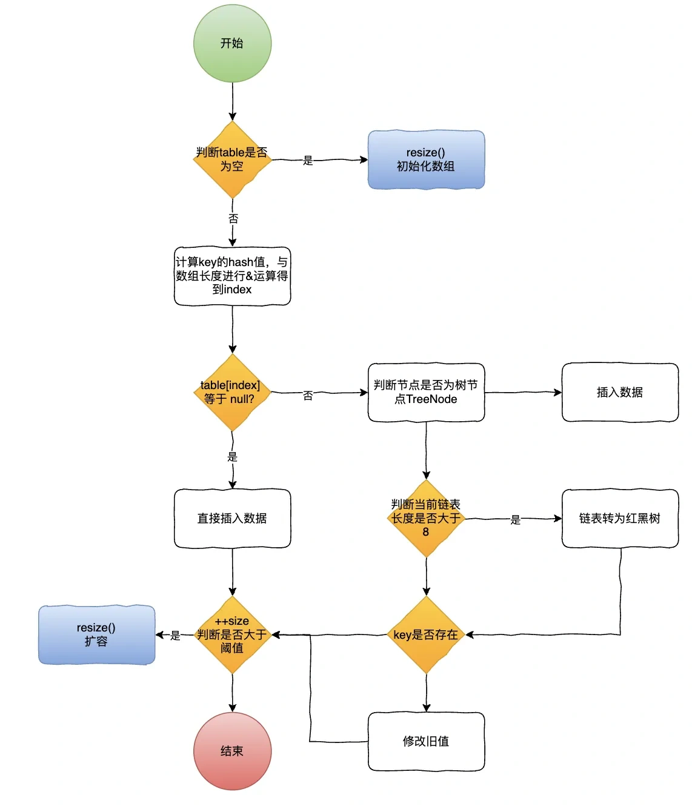
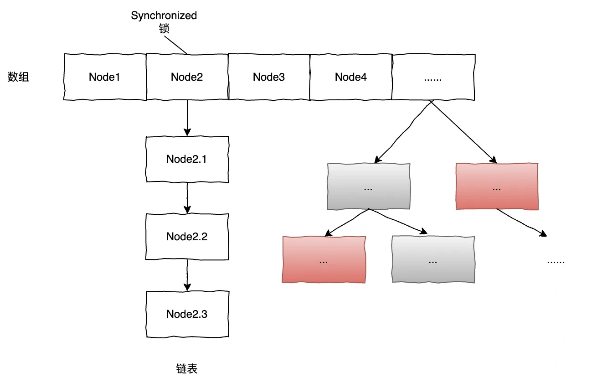
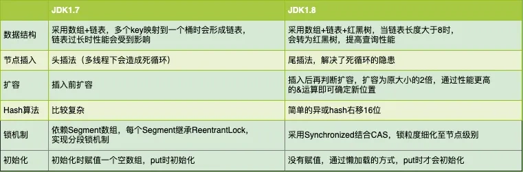

# 01 | 面试高频出镜的 HashMap、ConcurrentHashMap 你了解多少？

## **<font style="color:rgb(34, 34, 34);background-color:rgb(248, 246, 244);">HashMap的基本结构</font>**
<font style="color:rgb(51, 51, 51);background-color:rgb(248, 246, 244);">首先，我们先来看下HashMap的基本数据结构。在jdk1.8以前，HashMap内部数据结构采用数组+链表进行存储，jdk1.8以后HashMap采用数组+链表+红黑树进行存储。</font>

<font style="color:rgb(51, 51, 51);background-color:rgb(248, 246, 244);">因为链表的时间复杂度为O(n)，而为了提高链表长度过长时的查询效率，链表长度超过一定阈值（默认8）时会转为红黑树（时间复杂度O(logn)）。</font>



# **<font style="color:rgb(34, 34, 34);background-color:rgb(248, 246, 244);">HashMap的put方法流程是怎样的呢？</font>**
<font style="color:rgb(51, 51, 51);background-color:rgb(248, 246, 244);">以jdk1.8为例，HashMap 对于哈希冲突的处理方式有所改进，引入了红黑树（TreeBin）来优化链表过长的情况：</font>

1. <font style="color:rgb(51, 51, 51);background-color:rgb(248, 246, 244);">计算键的哈希值。</font>
2. <font style="color:rgb(51, 51, 51);background-color:rgb(248, 246, 244);">根据哈希值计算数组索引。</font>
3. <font style="color:rgb(51, 51, 51);background-color:rgb(248, 246, 244);">如果索引处为空，则直接存储键值对。</font>
4. <font style="color:rgb(51, 51, 51);background-color:rgb(248, 246, 244);">如果索引处有元素，则进行以下操作：</font>
    1. <font style="color:rgb(51, 51, 51);background-color:rgb(248, 246, 244);">如果是链表，则将键值对添加到链表的末尾。</font>
    2. <font style="color:rgb(51, 51, 51);background-color:rgb(248, 246, 244);">如果链表长度超过阈值（TREEIFY_THRESHOLD，默认为 8），将链表转换为红黑树（TreeBin）。</font>
    3. <font style="color:rgb(51, 51, 51);background-color:rgb(248, 246, 244);">如果已经是红黑树，则通过红黑树的插入操作添加键值对。</font>
5. <font style="color:rgb(51, 51, 51);background-color:rgb(248, 246, 244);">同样需要检查是否需要扩容，扩容时会将链表和红黑树中的元素重新计算位置并复制到新的数组中。</font>



<font style="color:rgb(100, 100, 100);background-color:rgb(248, 246, 244);">了解完基本的Put方法流程后，我再问一个问题：如果并发的场景下，使用HashMap存在线程安全问题吗？</font>

<font style="color:rgb(51, 51, 51);background-color:rgb(248, 246, 244);">答案是肯定的，那么如何避免呢，下面先来了解下ConcurrentHashMap。</font>

## **<font style="color:rgb(34, 34, 34);background-color:rgb(248, 246, 244);">ConcurrentHashMap 并发安全原理</font>**
<font style="color:rgb(51, 51, 51);background-color:rgb(248, 246, 244);">ConcurrentHashMap 是 JDK 提供的线程安全的哈希表实现，在JDK1.7中它通过分段锁（Segment）来实现并发访问的线程安全性，1.7版本的ConcurrentHashMap采用分段锁机制，把整个Map分成多个分段Segment，Segment继承于ReemtrantLock，Segment包含HashEntry数组，每个HashEntry是一个链表结构。</font>


<font style="color:rgb(51, 51, 51);background-color:rgb(248, 246, 244);">JDK 1.8 中，ConcurrentHashMap 的实现发生了较大的变化，取消了分段锁机制，而采用了 CAS 操作和 synchronized 来保证并发安全性。因为基于Node粒度控制锁，在并发度上性能更优于1.7。</font>



## **<font style="color:rgb(34, 34, 34);background-color:rgb(248, 246, 244);">put源码分析</font>**
<font style="color:rgb(51, 51, 51);background-color:rgb(248, 246, 244);">Java8源码put核心方法分析：</font>

```plain
final V putVal(K key, V value, boolean onlyIfAbsent) {
    if (key == null || value == null) throw new NullPointerException();
    int hash = spread(key.hashCode());//计算hashcode
    int binCount = 0;
    for (Node<K,V>[] tab = table;;) {
        Node<K,V> f; int n, i, fh;
        if (tab == null || (n = tab.length) == 0)
            tab = initTable();//懒加载方式，这里才初始化map，提升创建效率
        else if ((f = tabAt(tab, i = (n - 1) & hash)) == null) {
            if (casTabAt(tab, i, null,
                         new Node<K,V>(hash, key, value, null)))
                break;                   // 先通过cas的方式判断是否有值，如果为空不需要加锁，尽量避免加锁操作
        }
        else if ((fh = f.hash) == MOVED)
            tab = helpTransfer(tab, f);//如果当前节点hash为MOVED，开始协助扩容
        else {
            V oldVal = null;
            synchronized (f) {…}//加锁，更新值
            if (binCount != 0) {
                if (binCount >= TREEIFY_THRESHOLD)
                    treeifyBin(tab, i);//链表大于等于8，链表转为红黑树
                if (oldVal != null)
                    return oldVal;
                break;
            }
        }
    }
    addCount(1L, binCount);
    return null;
}
```

## **<font style="color:rgb(34, 34, 34);background-color:rgb(248, 246, 244);">细说这里的加锁技巧？</font>**
<font style="color:rgb(100, 100, 100);background-color:rgb(248, 246, 244);">为什么在1.8中，要使用Synchronized实现加锁，而不使用ReentranLock呢？ReentranLock也可以能实现一样的效果吧？</font>

<font style="color:rgb(51, 51, 51);background-color:rgb(248, 246, 244);">用ReentranLock也可以做到Node节点粒度的加锁，但是因为Synchronized锁升级的机制，多个线程并发争抢下，只有线程在一定自旋次数内拿到锁，就不会升级为重量级锁，也就减少了线程上下文切换的开销。</font>

<font style="color:rgb(51, 51, 51);background-color:rgb(248, 246, 244);">而ReentranLock在没有抢到锁时，线程会被挂起，这样就多了挂起和唤醒的开销，所以在这种情况下，Synchronized反而比Reentranlock效率更高。</font>

<font style="color:rgb(100, 100, 100);background-color:rgb(248, 246, 244);">ConcurrentHashMap的读操作需要加锁吗？</font>

<font style="color:rgb(51, 51, 51);background-color:rgb(248, 246, 244);">不需要的，为了提高读写并发性能，ConcurrentHashMap的get方法主要采用了Volatile关键字来保证可见性。</font>

<font style="color:rgb(51, 51, 51);background-color:rgb(248, 246, 244);">Java对声明了Volatile的变量进行写操作时，会向处理器发送一条指令，把这个变量所在缓存行的数据刷到主内存，其他CPU在读取该变量时发现该缓存无效，重新从主内存加载数据。</font>

## **<font style="color:rgb(34, 34, 34);background-color:rgb(248, 246, 244);">ConcurrentHashMap一定能保证线程安全吗？</font>**
<font style="color:rgb(100, 100, 100);background-color:rgb(248, 246, 244);">有这么一个场景，使用Map来统计Key出现次数的场景？</font>

<font style="color:rgb(51, 51, 51);background-color:rgb(248, 246, 244);">使用ConcurrentHashMap来统计，判断key是否存在，不存在对应值初始化1，存在的话value+1，循环操作1000次，每次操作累加随机的key。</font>

```plain
public static Long count(){
        Integer total = 100;
        ConcurrentHashMap<Integer, Long> initMap = new ConcurrentHashMap<>(total);
        ForkJoinPool forkJoinPool = new ForkJoinPool(16);
        forkJoinPool.execute(() -> {
            IntStream.rangeClosed(1, 1000).parallel().forEach(i -> {
                int key = ThreadLocalRandom.current().nextInt(10);
                if (initMap.size() <= 100) {
                    if (initMap.containsKey(key)) {
                        initMap.put(key, initMap.get(key) + 1);
                    } else {
                        initMap.put(key, 1L);
                    }
                }
            });
        });
        forkJoinPool.shutdown();
        forkJoinPool.awaitQuiescence(1, TimeUnit.MINUTES);
        return initMap.values().stream().reduce((a, b) -> a + b).get();
    }

结果：
统计key，结果=895
```

<font style="color:rgb(100, 100, 100);background-color:rgb(248, 246, 244);">发现得出如上结果，key出现的总次数不等于1000，难道ConcurrentHashMap不是线程安全的吗？</font>

<font style="color:rgb(51, 51, 51);background-color:rgb(248, 246, 244);">ConcurrentHashMap只是提供原子性读写方法是线程安全，但是不保证所有的复合操作都是原子性的，比如size这种聚合方法在并发情况下只是反映ConcurrentHashMap的中间状态，并不能用于严格流程控制计算。</font>

<font style="color:rgb(51, 51, 51);background-color:rgb(248, 246, 244);">如果要保证这类操作的原子性，那可以对这段逻辑加锁，但这样就发挥不了它自身的性能了，还可以通过它本身有提供的一些特性，比如putIfAbsent，computeIfAbsent这类方法可以保证原子性。</font>

```plain
public static Long countSafe(){
        Integer total = 100;
        ConcurrentHashMap<Integer, LongAdder> initMap = new ConcurrentHashMap<>(total);
        ForkJoinPool forkJoinPool = new ForkJoinPool(16);
        forkJoinPool.execute(() -> {
            IntStream.rangeClosed(1, 1000).parallel().forEach(i -> {
                int key = ThreadLocalRandom.current().nextInt(10);
                initMap.computeIfAbsent(key, k -> new LongAdder()).increment();
            });
        });
        forkJoinPool.shutdown();
        forkJoinPool.awaitQuiescence(1, TimeUnit.MINUTES);
        return initMap.entrySet().stream()
                .collect(Collectors.toMap(e -> e.getKey(), e -> e.getValue().longValue())).values()
                .stream().reduce((a, b) -> a + b).get();
    }

结果：
统计key，结果=1000
```

## **<font style="color:rgb(34, 34, 34);background-color:rgb(248, 246, 244);">HashMap1.7和1.8的总结对比</font>**
<font style="color:rgb(100, 100, 100);background-color:rgb(248, 246, 244);">最后我们再来总结下在JDK1.7和1.8中，HashMap有哪些不一样的地方吧。</font>



<font style="color:rgb(51, 51, 51);background-color:rgb(248, 246, 244);">扩展1：HashMap计算索引的时候为啥右移16位？</font>

<font style="color:rgb(51, 51, 51);background-color:rgb(248, 246, 244);">扩展2：HashMap的扩容过程？</font>


> 更新: 2024-10-08 11:20:23  
> 原文: <https://www.yuque.com/yuqueyonghue6cvnv/cxhfwd/kxo32g7mf6ggimkd>