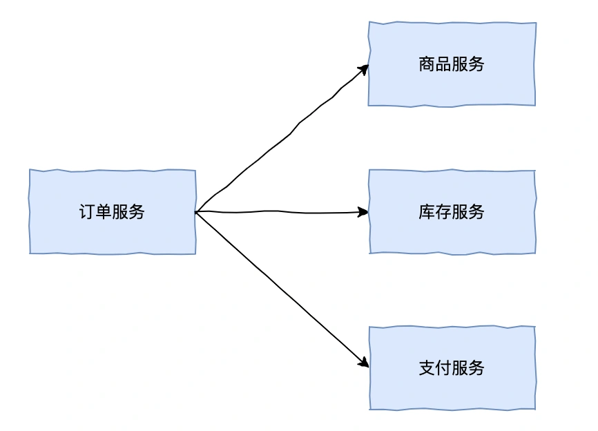
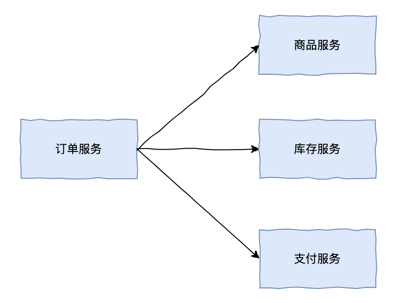
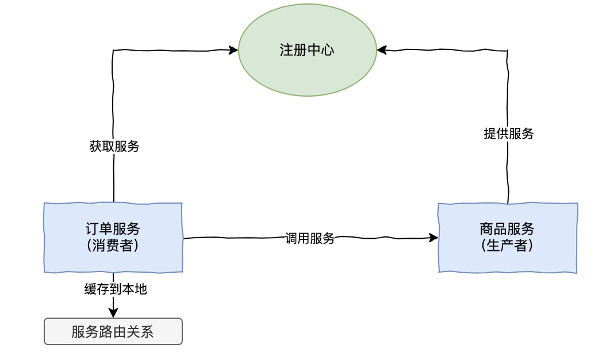
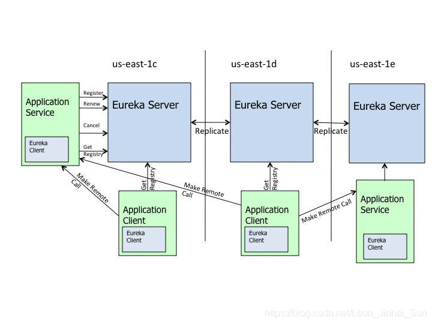
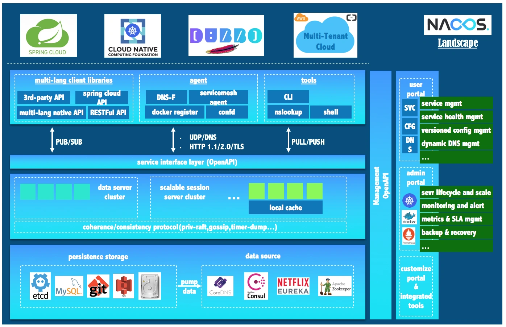
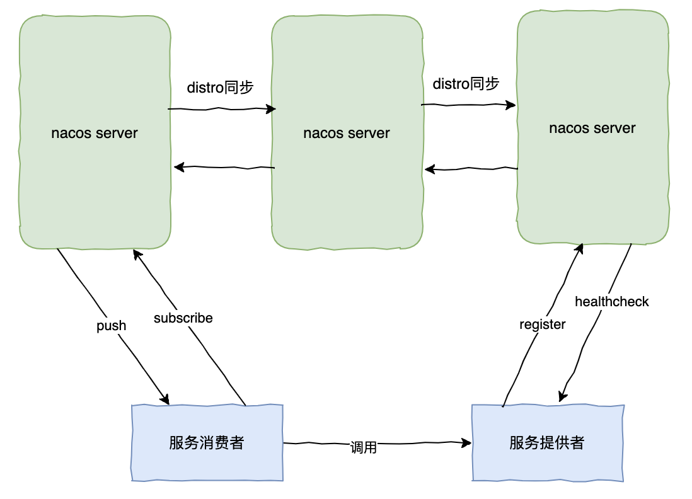
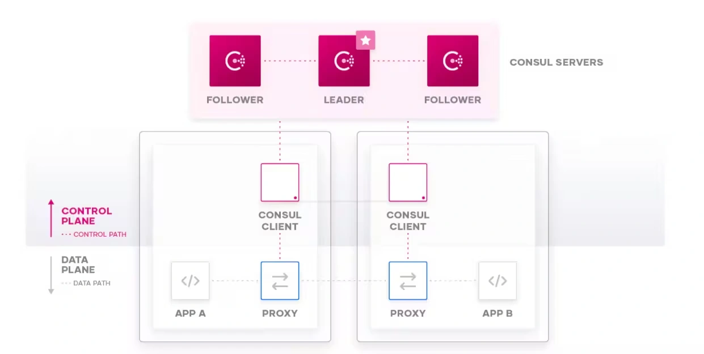
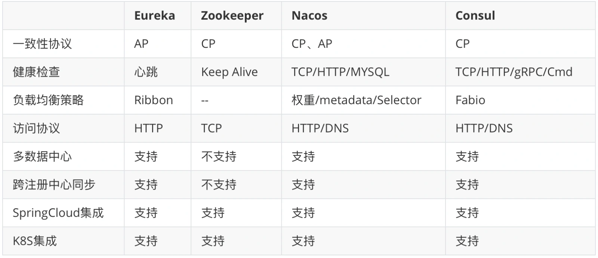

# 020 | 微服务架构中的服务注册与发现该如何选择？实现原理是什么？

<font style="color:rgb(100, 100, 100);background-color:rgb(248, 246, 244);">我是码哥，《Redis 高手心法》作者，公众号「码哥跳动」作者。</font>


<font style="color:rgb(51, 51, 51);background-color:rgb(248, 246, 244);">随着单体应用的拆分，我们面临的首要问题就是采用哪种方式实现服务间的调用，像之前单体应用可能直接在配置或数据库保存调用方的域名 IP 信息等，但拆分后服务实例信息众多，且随着服务动态扩缩容，服务运行时信息一直变化，那么我们就需引入注册中心帮助我们解决这类问题了。</font>



<font style="color:rgb(51, 51, 51);background-color:rgb(248, 246, 244);">今天我们来聊一聊微服务架构中的服务注册与发现有哪些？Zookeeper、Eureka、Nacos、Consul都有什么区别，他们的实现原理是什么？</font>



**<font style="color:rgb(34, 34, 34);background-color:rgb(248, 246, 244);">引入注册中心后</font>**



<font style="color:rgb(51, 51, 51);background-color:rgb(248, 246, 244);">在微服务架构中，服务注册与发现是一个至关重要的功能。它确保了分布式系统中各个微服务之间能够动态地相互定位和通信。常见的服务注册中心有 Eureka、Zookeeper、Consul 和 Nacos。</font>


<font style="color:rgb(51, 51, 51);background-color:rgb(248, 246, 244);">我们来看下实际项目中要如何选择合适的注册中心呢？</font>

## **<font style="color:rgb(34, 34, 34);background-color:rgb(248, 246, 244);">Eureka</font>**
<font style="color:rgb(51, 51, 51);background-color:rgb(248, 246, 244);">Eureka 是由 Netflix 提供的服务注册与发现框架，通常用于大规模的微服务系统。它的架构分为两部分：Eureka Server 和 Eureka Client，这是 Eureka 的架构图。</font>



+ <font style="color:rgb(51, 51, 51);background-color:rgb(248, 246, 244);">Eureka Server：负责提供注册中心的服务，所有微服务实例都注册到 Eureka Server 中，其他微服务通过 Eureka Client 来发现服务。</font>
+ <font style="color:rgb(51, 51, 51);background-color:rgb(248, 246, 244);">Eureka Client：微服务实例作为客户端，定期向 Eureka Server 注册自己并更新健康状态。这里包含了 Application Service（服务提供者）和 Application Client（服务消费者）。</font>

<font style="color:rgb(100, 100, 100);background-color:rgb(248, 246, 244);">那么，Eureka 是如何保证 AP 的呢？</font>

+ <font style="color:rgb(51, 51, 51);background-color:rgb(248, 246, 244);">集群：由上图可看出 Eureka Server 多个实例之间都是对等的，每个都是其它节点的副本，是一种去中心化的架构。</font>
+ <font style="color:rgb(51, 51, 51);background-color:rgb(248, 246, 244);">心跳：Client 通过发送心跳到 Server 以维持和更新注册表中服务实例元数据的有效性。当在一定时长内（默认 90s），Server 没有收到 Client 的心跳信息，会把服务实例的信息从注册表中删除。</font>
+ <font style="color:rgb(51, 51, 51);background-color:rgb(248, 246, 244);">自我保护机制：当 Eureka Server 节点在短时间内丢失过多的心跳时（15 分钟超过 85%节点没有正常返回心跳），那么这个节点就会进入自我保护模式。</font>

<font style="color:rgb(100, 100, 100);background-color:rgb(248, 246, 244);">什么是 Eureka 的自我保护机制？</font>

+ <font style="color:rgb(51, 51, 51);background-color:rgb(248, 246, 244);">Eureka 不再剔除没有正常返回心跳的服务。</font>
+ <font style="color:rgb(51, 51, 51);background-color:rgb(248, 246, 244);">Eureka 仍可以接受新服务注册请求，但是不会同步到其它 Server 节点。</font>
+ <font style="color:rgb(51, 51, 51);background-color:rgb(248, 246, 244);">当网络恢复稳定时，之前新注册的信息会再次同步到其它节点上。</font>

<font style="color:rgb(51, 51, 51);background-color:rgb(248, 246, 244);">所以 Eureka 遵循的是 AP（Availability + Partition tolerance）。它牺牲了数据一致性，尤其是在网络分区发生时。Eureka 实现了 "最终一致性" 的策略，允许系统在出现故障时继续提供可用的服务。</font>

## **<font style="color:rgb(34, 34, 34);background-color:rgb(248, 246, 244);">Zookeeper</font>**
<font style="color:rgb(100, 100, 100);background-color:rgb(248, 246, 244);">Zookeeper 是如何实现注册中心的呢？</font>

<font style="color:rgb(51, 51, 51);background-color:rgb(248, 246, 244);">Zookeeper 的数据模型基于一种叫做 ZNode（Zookeeper 节点）的概念，在 Zookeeper 中，服务注册和发现的核心思想是利用临时节点来存储服务实例的信息。具体过程如下：</font>

+ <font style="color:rgb(51, 51, 51);background-color:rgb(248, 246, 244);">创建临时节点：当一个服务启动时，它会向 Zookeeper 注册自己。通常，服务会在某个目录（如 /services）下创建一个临时节点。每个服务实例会被注册为一个独特的临时节点。</font>

<font style="color:rgb(51, 51, 51);background-color:rgb(248, 246, 244);">存储路径示例：</font>

```plain
/services/payment-service/instance-1
/services/payment-service/instance-2

//payment-service：支付服务名称
//instance-1：实例唯一标识符，Ip端口信息。
```

+ <font style="color:rgb(51, 51, 51);background-color:rgb(248, 246, 244);">watch 机制：Zookeeper 支持客户端对节点的监视机制（Watch）。当服务上线时，Zookeeper 会通知客户端，客户端会更新可用服务列表。当某个服务实例断开与 Zookeeper 的连接时，Zookeeper 会删除该临时节点，并通知客户端，客户端可以去掉失效的服务实例。</font>

<font style="color:rgb(51, 51, 51);background-color:rgb(248, 246, 244);">ZooKeeper 是基于 CP 来设计的，即任何时刻对 ZooKeeper 的访问请求能得到一致的数据结果，同时系统对网络分割具备容错性，但是它不能保证每次服务请求的可用性。</font>

<font style="color:rgb(51, 51, 51);background-color:rgb(248, 246, 244);">从实际情况来分析，在使用 ZooKeeper 获取服务列表时，如果 zookeeper 正在选主，或者 ZooKeeper 集群中半数以上机器不可用，那么将无法获得数据。所以说，ZooKeeper 不能保证服务可用性。</font>

## **<font style="color:rgb(34, 34, 34);background-color:rgb(248, 246, 244);">Nacos</font>**
**<font style="color:rgb(34, 34, 34);background-color:rgb(248, 246, 244);">Nacos 的关键特性</font>**<font style="color:rgb(51, 51, 51);background-color:rgb(248, 246, 244);">：</font>

+ <font style="color:rgb(51, 51, 51);background-color:rgb(248, 246, 244);">服务发现和服务健康监测：Nacos 支持基于 DNS 和基于 RPC 的服务发现。提供对服务的实时的健康检查，支持传输层(PING 或 TCP)和应用层 (如 HTTP、MySQL、用户自定义）的健康检查。</font>
+ <font style="color:rgb(51, 51, 51);background-color:rgb(248, 246, 244);">动态配置服务：Nacos 支持的动态配置，提供了配置版本跟踪、金丝雀发布、一键回滚配置以及客户端配置更新状态跟踪在内的一系列开箱即用的配置管理特性。</font>
+ <font style="color:rgb(51, 51, 51);background-color:rgb(248, 246, 244);">动态 DNS 服务：Nacos 提供了动态 DNS 服务，支持权重路由，使得中间层负载均衡、更灵活的路由策略、流量控制以及数据中心内网的简单 DNS 解析服务。</font>
+ <font style="color:rgb(51, 51, 51);background-color:rgb(248, 246, 244);">服务及其元数据管理：Nacos 可以帮助微服务平台建设的视角管理数据中心的所有服务及元数据。</font>

**<font style="color:rgb(34, 34, 34);background-color:rgb(248, 246, 244);">Nacos 生态图</font>**



<font style="color:rgb(51, 51, 51);background-color:rgb(248, 246, 244);">如 Nacos 全景图所示，Nacos 无缝支持一些主流的开源生态。</font>

<font style="color:rgb(51, 51, 51);background-color:rgb(248, 246, 244);">Nacos 作为注册中心架构图</font>



<font style="color:rgb(51, 51, 51);background-color:rgb(248, 246, 244);">Nacos 作为注册中心，它是支持户根据需求选择 一致性优先（CP） 或 可用性优先（AP） 模式的。</font>

+ <font style="color:rgb(51, 51, 51);background-color:rgb(248, 246, 244);">CP 模式：Nacos 集群通过使用 Raft 协议确保一致性，通过 Raft 协议确保集群内的大部分节点在某一时刻保持一致的数据副保持本。如果发生网络分区时，为了保证数据一致性，Nacos 可能会将某些请求拒绝。</font>
+ <font style="color:rgb(51, 51, 51);background-color:rgb(248, 246, 244);">AP 模式：Nacos 集群可以容忍部分节点的失效或者网络分区，并继续提供服务。AP 模式下，Client 会从不同节点获取到不同的数据副本，这种模式主要为了提供系统的可用性。</font>

<font style="color:rgb(51, 51, 51);background-color:rgb(248, 246, 244);">可以通过更改 Nacos 的配置文件 conf/application.properties 切换 AP 或 CP 模式：</font>

```plain
nacos.core.protocol.distro.data.sync.mode
Raft表示CP模式，Async表示AP模式
```

<font style="color:rgb(51, 51, 51);background-color:rgb(248, 246, 244);">默认情况下，Nacos 会采用 AP 模式，因为大多情况下作为注册中心，微服务架构更看重它对服务注册发现高可用的要求。</font>

## **<font style="color:rgb(34, 34, 34);background-color:rgb(248, 246, 244);">Consul</font>**
<font style="color:rgb(51, 51, 51);background-color:rgb(248, 246, 244);">Consul 是 HashiCorp 公司推出的开源工具，Consul 由 Go 语言开发，部署起来非常容易，只需要极少的可执行程序和配置文件，具有绿色、轻量级的特点。</font>

<font style="color:rgb(51, 51, 51);background-color:rgb(248, 246, 244);">Consul 的特点：</font>

+ <font style="color:rgb(51, 51, 51);background-color:rgb(248, 246, 244);">服务发现:Consul 提供了 HTTP 或 DNS 的方式来注册、发现服务。</font>
+ <font style="color:rgb(51, 51, 51);background-color:rgb(248, 246, 244);">健康检查：Consul Client 可以提供任意数量的健康检查，可以根据返回结果比如“200”或者与本地负载(“内存占用是否低于 90%”)，来判断服务是否处于健康状态。</font>
+ <font style="color:rgb(51, 51, 51);background-color:rgb(248, 246, 244);">key/Value 存储：Consul 数据采用 key/value 结构存储，非常灵活方便。</font>
+ <font style="color:rgb(51, 51, 51);background-color:rgb(248, 246, 244);">安全服务通信：Consul 可以为服务生成和分发 TLS 证书，以建立相互的 TLS 连接。</font>
+ <font style="color:rgb(51, 51, 51);background-color:rgb(248, 246, 244);">多数据中心：Consul 天然支持多数据中心。</font>

**<font style="color:rgb(34, 34, 34);background-color:rgb(248, 246, 244);">Consul 架构图</font>**



<font style="color:rgb(51, 51, 51);background-color:rgb(248, 246, 244);">由上图可看出，Consul 分为 Client 和 Server 两种节点（所有的节点也被称为 Agent）：</font>

+ <font style="color:rgb(51, 51, 51);background-color:rgb(248, 246, 244);">Server 节点保存数据，Server 节点有一个 Leader 和多个 Follower，Leader 节点会将数据同步到 Follower，Server 的数量推荐是 3 个或者 5 个，在 Leader 挂掉的时候会启动选举机制产生一个新的 Leader。</font>
+ <font style="color:rgb(51, 51, 51);background-color:rgb(248, 246, 244);">Client 负责健康检查及转发数据请求到 Server。</font>

<font style="color:rgb(51, 51, 51);background-color:rgb(248, 246, 244);">Consul 采用的 Raft 协议来保证集群内多个节点的数据一致性，所以是采用的 CP 模式。</font>

## **<font style="color:rgb(34, 34, 34);background-color:rgb(248, 246, 244);">最后</font>**
<font style="color:rgb(51, 51, 51);background-color:rgb(248, 246, 244);">最后，我们来看下各注册中心的对比：</font>

  
 


> 更新: 2025-05-15 21:32:49  
> 原文: <https://www.yuque.com/yuqueyonghue6cvnv/cxhfwd/bbytbhu07ig197x9>