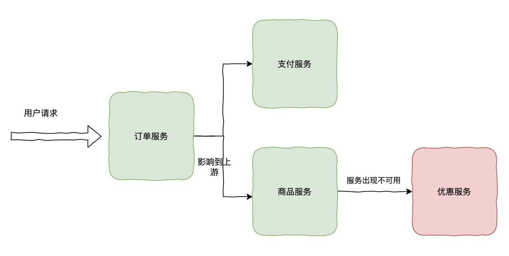
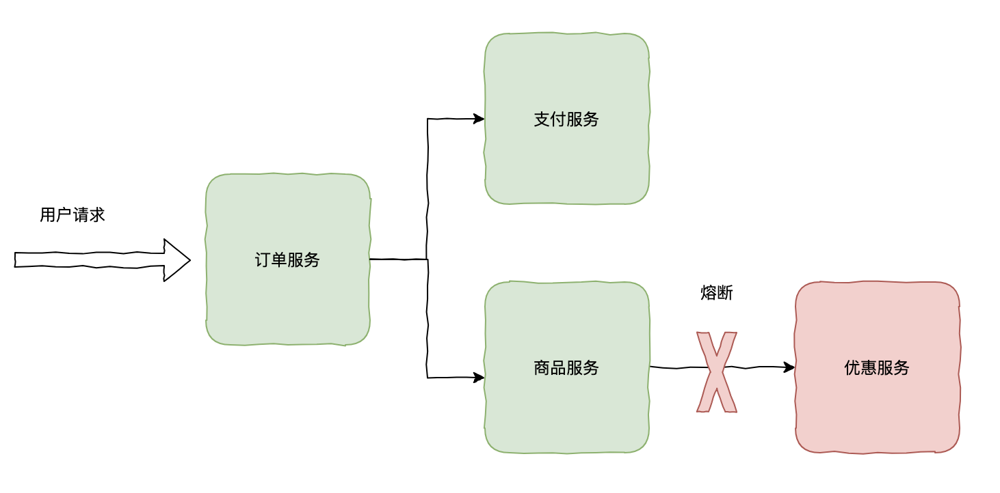
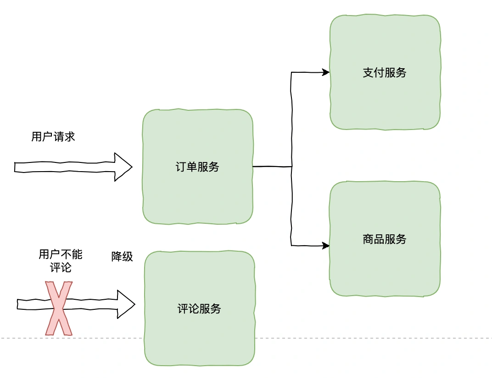
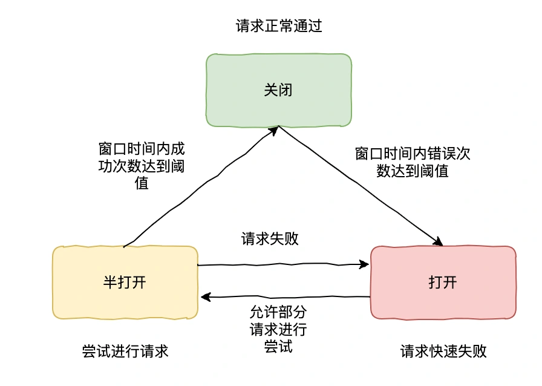

# 021 | 微服务高可用性设计有哪些方式？什么是熔断、降级？

大家好，我是码哥，可以叫我靓仔，《Redis 高手心法》作者，目前担任公司架构师职责。

今天，我们来聊一聊在微服务架构中如何实现服务容错，服务容错是确保系统稳定性和可用性的关键因素之一。

本文探讨服务容错的概念、重要性以及如何在微服务环境中有效地实施它。

分布式系统中，服务之间存在调用依赖关系，如果下游服务 A 响应时间突然变长，影响到上游服务 B，然后再影响到服务 B 的上游 C......，因为某个服务出现问题产生连锁反应，导致最终影响整个链路上的服务，应该怎么办？

**服务雪崩**

## **熔断和降级**
要解决上面问题，当然就不得不提分布式系统保证服务高可用的利器：熔断和降级。

**“**

什么是熔断和降级呢？两者又有什么区别？

### **熔断**
熔断：指当某个**服务调用的失败次数以及异常比例达到一定的阈值之后，关闭对于该服务的一切调用，通过快速失败的方式，避免影响其他服务的正常运行**。熔断一段时间内不发起任何关于该服务的调用，直到服务恢复正常或者达到最大等待时间才进行恢复。

**“**

不熔断会有什么问题呢？

这个问题问得好，熔断机制的核心目标是在系统压力过载或下游依赖出现异常时，快速响应，防止局部故障扩散成全局问题。如果系统没有熔断机制，可能会导致以下严重问题：

+ 雪崩效应：局部故障导致系统瘫痪，当下游服务响应缓慢或不可用时，上游调用会不断积压请求，最终导致线程池耗尽、数据库连接池耗尽，甚至宕机。
+ 延迟放大：耗尽宝贵资源，无熔断机制时，调用会按照默认超时时间等待响应。所有请求都堆积在线程池或队列中，耗尽了资源，延迟进一步增加。

### **降级**
降级：**指某个服务不可用或者响应比较缓慢的时候，通过备用的处理逻辑，比如返回默认值、缓存值、错误提示等，保证系统核心功能的正常运行，从而提高服务的可用性以及容错性**。

比如电商交易系统在抢购活动时，因为请求量比较大，我们可能不会选择某些不重要的场景关闭掉，比如抢购时间不允许用户评论，物流功能、一天后才能发起退货等。

优先让服务资源往核心功能倾斜，保证核心功能不受影响。

**“**

如果没有降级机制，会带来什么问题呢？

系统无降级机制时，当部分非核心功能异常或压力过大，会拖累整个系统甚至导致核心功能崩溃。

当非关键功能或依赖接口不可用时，没有降级会导致用户界面加载缓慢甚至无响应，而非提供替代方案或友好的错误提示。

**“**

你能用一个场景来说一下吗？

比如支付系统中优惠券服务不可用，未降级时支付流程无限卡住，用户无法完成付款。  
社交媒体无法加载好友动态，未降级时持续超时，用户直接放弃使用。

在系统超载或不可用时，降级机制能帮助系统维持一定的核心功能，避免“全盘崩溃”的情况。

**“**

你的系统降级策略如何设计呢？

**非核心服务优先降级**：

如个性化推荐、优惠信息、日志统计等功能可以优先禁用，确保核心功能（支付、下单）运行正常。

**返回默认值或兜底数据**：

在 API 服务无法响应时，返回简化数据，如固定推荐商品列表或临时禁用推荐功能。

**简化页面展示**：

去除复杂模块和耗费资源的动画效果，让用户快速完成操作而非耗费资源渲染。

通过降级机制，可以保证核心功能的用户体验，维持整体系统的高可用性，成为应对极端场景下的重要防线。

在实际应用中，熔断和降级通常结合使用：

+ 当某个服务不可用时，熔断机制阻止进一步的请求流向该服务，同时触发降级策略返回默认值或备用方案。
+ 在高并发场景下，系统可以通过降级减少资源消耗，同时通过熔断保护关键服务的稳定性

**“**

熔断一般如何实现呢？

## **Hystrix 和 Sentinel**
比较常见的解决方案有：

+ Hystrix：Hystrix 的关注点在于以隔离和熔断为主的容错机制，超时或被熔断的调用将会快速失败，并可以提供 fallback 机制。
+ Sentinel：Sentinel 更侧重于多样化的流量控制、熔断降级、系统负载保护和拥有较丰富功能的控制台等。

**SentinelHystrix**隔离策略信号量隔离线程池/信号量隔离熔断策略基于响应时间或失败占比基于失败占比实现方式滑动窗口滑动窗口使用支持注解支持注解限流基于 QPS，支持基于调用关系的限流支持比较有限系统负载保护支持不支持规则配置控制台功能丰富不够完善生态集成Servlet、SpringCloud、Dubbo、gRPCServlet、SpringCloud Netflix

## **熔断实现原理**
以 Sentinel 为例子说明熔断的基本实现原理，以下是几个核心概念：

+ 熔断指标：超时请求数或占比；请求失败占比/数量
+ 熔断器状态：断开表示请求不能通过；半开表示定时放行部分请求，用来测试服务是否恢复正常；关闭表示请求可以正常通过。

熔断器一般有以下几个状态：

+ 关闭：熔断器默认状态，服务能够正常通过请求，如果请求失败或超时达到阈值会进入打开状态。
+ 打开：熔断器处于打开状态下，服务请求直接失败，如果配置了 fallback 则会调用 fallback 方法返回默认结果。
+ 半打开：熔断器进入打开状态后，当达到超时时间后，会再次处于半打开状态，这时服务会允许一部分请求尝试请求，如果请求正常则认为服务已经恢复成功，那么熔断器会进入关闭状态。如果请求失败则再次进入打开状态。半打开的机制主要为了可以实现服务自我恢复。

> 更新: 2025-05-15 21:33:02  
> 原文: <https://www.yuque.com/yuqueyonghue6cvnv/cxhfwd/ulh9btv5nxxk6fgm>