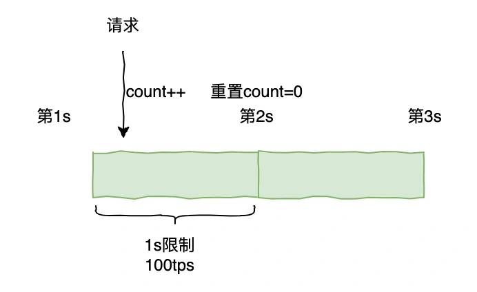
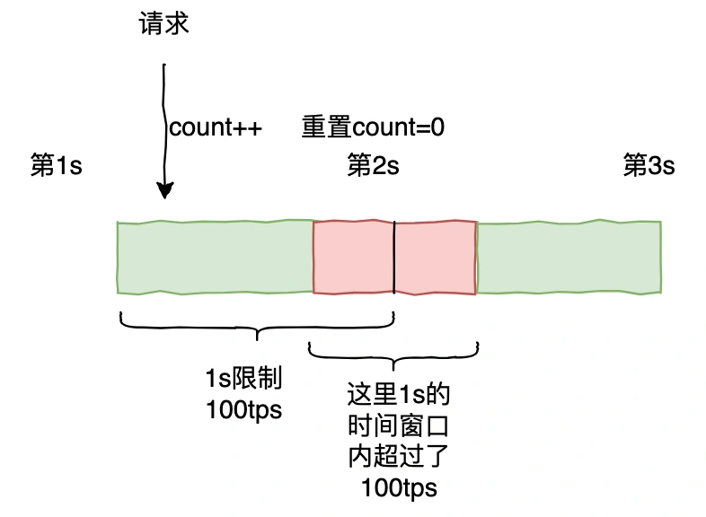
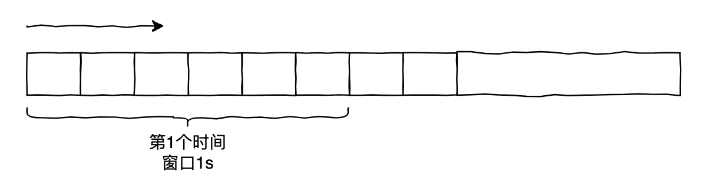
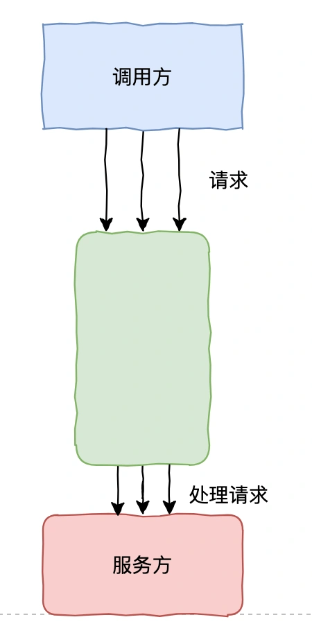
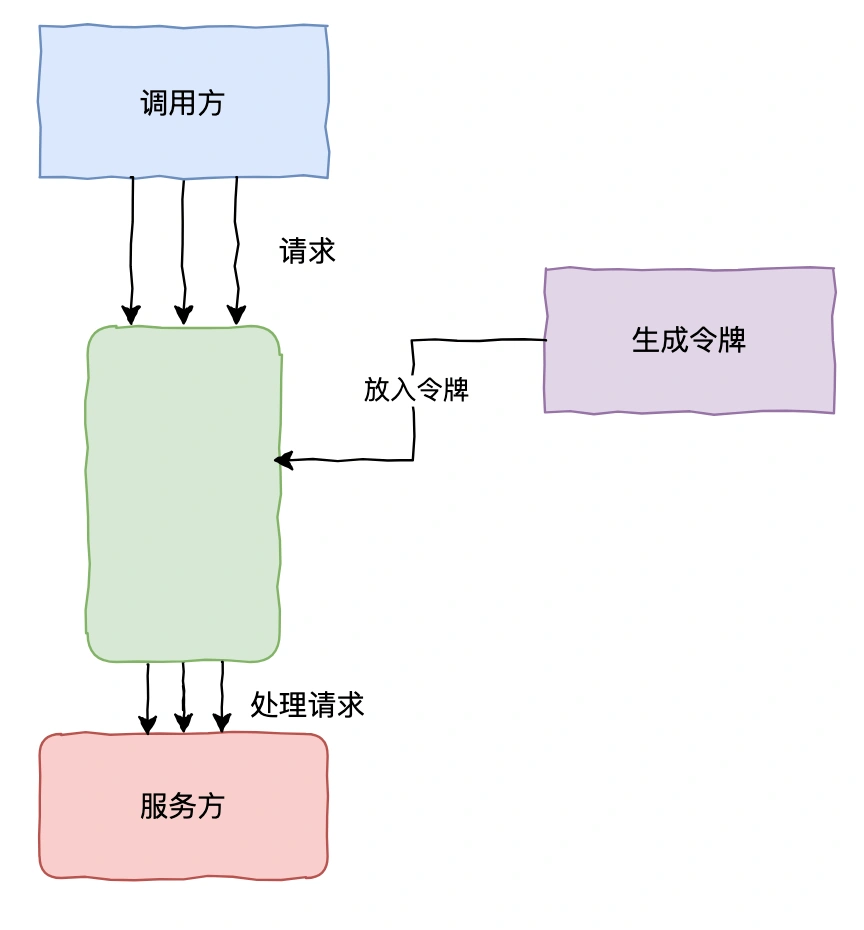

# 022 | 服务高可用之限流：计数器、滑动窗口、漏桶、令牌桶

<font style="color:rgb(100, 100, 100);background-color:rgb(248, 246, 244);">大家好，我是码哥，可以叫我靓仔，畅销书《Redis 高手心法》、公众号「码哥跳动」作者，目前担任公司架构师职责。</font>


<font style="color:rgb(51, 51, 51);background-color:rgb(248, 246, 244);">今天我们来聊一聊分布式系统中，特别在高并发场景下，保证服务高可用的手段除了熔断，还有限流。</font>

<font style="color:rgb(100, 100, 100);background-color:rgb(248, 246, 244);">Chaya：限流都有哪些实现算法？哪种算法最强大？</font>

## **<font style="color:rgb(34, 34, 34);background-color:rgb(248, 246, 244);">计数器</font>**
<font style="color:rgb(100, 100, 100);background-color:rgb(248, 246, 244);">计数器： 在一段时间间隔内，对请求进行统计计数，与设定的限流值比较，如果达到了阈值则将请求限流，当到了时间临界点后会将计数器重置。</font>



<font style="color:rgb(51, 51, 51);background-color:rgb(248, 246, 244);">它的优点就是实现非常简单，只需要简单的设置一个阈值和维护一个计数器即可，但是计数器算法通常以固定的时间窗口来控制不了流量，但这种统计方式</font>**<font style="color:rgb(34, 34, 34);background-color:rgb(248, 246, 244);">不够精确，会导致如果在时间段内的起始和末尾的会超出限流阈值</font>**<font style="color:rgb(51, 51, 51);background-color:rgb(248, 246, 244);">，如下</font>



<font style="color:rgb(51, 51, 51);background-color:rgb(248, 246, 244);">系统承接了预期内的流量可能会导致系统出现问题，且这种方式也无法应对突发流量。</font>

## **<font style="color:rgb(34, 34, 34);background-color:rgb(248, 246, 244);">滑动窗口</font>**
<font style="color:rgb(100, 100, 100);background-color:rgb(248, 246, 244);">滑动窗口：将时间窗口划分多个更小的时间槽，随着时间流逝，窗口像幻灯片一样向前滑动。每个时间槽独立计数，通过统计窗口内全部时间槽的请求总数来判断是否需要限流。</font>

<font style="color:rgb(51, 51, 51);background-color:rgb(248, 246, 244);">比如 1s，划分 5 个槽，每个时间槽就是 200ms</font>



<font style="color:rgb(51, 51, 51);background-color:rgb(248, 246, 244);">它和计数器的区别在于，它的算法更加精细，时间窗口划分粒度更小，能应对一定突发流量。</font>

<font style="color:rgb(51, 51, 51);background-color:rgb(248, 246, 244);">但还是存在时间分片的概念，</font>**<font style="color:rgb(34, 34, 34);background-color:rgb(248, 246, 244);">无法从根本上解决时间临界点的问题</font>**<font style="color:rgb(51, 51, 51);background-color:rgb(248, 246, 244);">。</font>

## **<font style="color:rgb(34, 34, 34);background-color:rgb(248, 246, 244);">漏桶算法</font>**
<font style="color:rgb(100, 100, 100);background-color:rgb(248, 246, 244);">漏桶算法：以一个固定容量的“桶”（队列），请求以任意速率流入桶内，桶底有个恒定速率的出水口流出请求。当桶满时，新请求会被丢弃或等待。通过控制流出水（处理请求）速度，实现对流量的控制。</font>



<font style="color:rgb(51, 51, 51);background-color:rgb(248, 246, 244);">漏桶算法的特点在于，能够平滑输出流量，可以有效控制数据传输速率，适用于对流量稳定性要求高、需严格控制速率的场景，但对于突发流量处理能力一般。</font>

<font style="color:rgb(51, 51, 51);background-color:rgb(248, 246, 244);">漏桶算法一般可以用消息队列实现。</font>

## **<font style="color:rgb(34, 34, 34);background-color:rgb(248, 246, 244);">令牌桶算法</font>**
<font style="color:rgb(100, 100, 100);background-color:rgb(248, 246, 244);">令牌桶算法：系统以固定速率产生令牌放入桶中，桶有固定容量，满时新产生的令牌会被丢弃。请求到达时，需从桶中获取令牌，若有足够令牌则请求被处理，否则被拒绝。</font>



<font style="color:rgb(51, 51, 51);background-color:rgb(248, 246, 244);">令牌桶算法的特点在于，在令牌充足的情况下能够处理突发流量，通过令牌的生成速率和桶的容量可以比较灵活的进行流量控制，可以平滑的处理请求，适用于需要控制流量速率和突发处理的场景。</font>

<font style="color:rgb(51, 51, 51);background-color:rgb(248, 246, 244);">令牌桶算法可以用 Guava 的 RateLimiter 来实现。</font>

```plain
import com.google.common.util.concurrent.RateLimiter;

public class TokenBucketRateLimiter {
    private final RateLimiter rateLimiter;

    public TokenBucketRateLimiter(double permitsPerSecond) {
        this.rateLimiter = RateLimiter.create(permitsPerSecond);
    }

    public boolean tryAcquire() {
        return rateLimiter.tryAcquire();
    }
}
```

<font style="color:rgb(51, 51, 51);background-color:rgb(248, 246, 244);">使用 Guava 库的方式只能对单节点限流，仅能保护自身节点。</font>

<font style="color:rgb(100, 100, 100);background-color:rgb(248, 246, 244);">Chaya：那在分布式系统中，我要如何对集群维度实现限流呢？</font>

<font style="color:rgb(51, 51, 51);background-color:rgb(248, 246, 244);">可以使用 Redis+Lua 脚本实现，确保在多个节点可以共享令牌桶状态。</font>

```lua
local key = KEYS[1]
local rate = tonumber(ARGV[1])
local capacity = tonumber(ARGV[2])
local now = tonumber(ARGV[3])
local requestedTokens = tonumber(ARGV[4])

-- 获取当前令牌数和最后更新时间
local function getTokensAndTime(key)
    local data = redis.call('HMGET', key, 'tokens', 'last_refill')
    local tokens = tonumber(data[1])
    local last_refill = tonumber(data[2])
    return tokens, last_refill
end

local tokens, last_refill = getTokensAndTime(key)

-- 计算应该添加多少令牌
local delta = now - last_refill
local newTokens = math.min(capacity, tokens + delta * rate)

-- 检查是否有足够的令牌
if newTokens >= requestedTokens then
    newTokens = newTokens - requestedTokens
    redis.call('HMSET', key, 'tokens', newTokens, 'last_refill', now)
    return 1
else
    return 0
end
```

## **<font style="color:rgb(34, 34, 34);background-color:rgb(248, 246, 244);">流控效果</font>**
<font style="color:rgb(100, 100, 100);background-color:rgb(248, 246, 244);">Chaya：一般当我们的系统达到限流后要怎么处理呢？</font>

### **<font style="color:rgb(34, 34, 34);background-color:rgb(248, 246, 244);">快速失败</font>**
<font style="color:rgb(51, 51, 51);background-color:rgb(248, 246, 244);">达到阈值后，新的请求会被立即拒绝并抛出 FlowException 异常。</font>

### **<font style="color:rgb(34, 34, 34);background-color:rgb(248, 246, 244);">Warm Up（预热）</font>**
<font style="color:rgb(51, 51, 51);background-color:rgb(248, 246, 244);">对超出阈值的请求同样是拒绝并抛出异常。但这种模式阈值会动态变化，从一个较小值逐渐增加到最大阈值。</font>

<font style="color:rgb(51, 51, 51);background-color:rgb(248, 246, 244);">通过这种方式，在一定时间内逐渐增加到阈值上限，给冷系统一个预热的时间，避免冷系统被压垮。</font>

### **<font style="color:rgb(34, 34, 34);background-color:rgb(248, 246, 244);">匀速排队</font>**
<font style="color:rgb(51, 51, 51);background-color:rgb(248, 246, 244);">让所有的请求按照先后次序排队执行，两个请求的间隔不能小于指定时长，主要用于处理间隔性突发的流量。</font>


> 更新: 2025-05-15 21:33:15  
> 原文: <https://www.yuque.com/yuqueyonghue6cvnv/cxhfwd/nhlg9envesc0bgii>