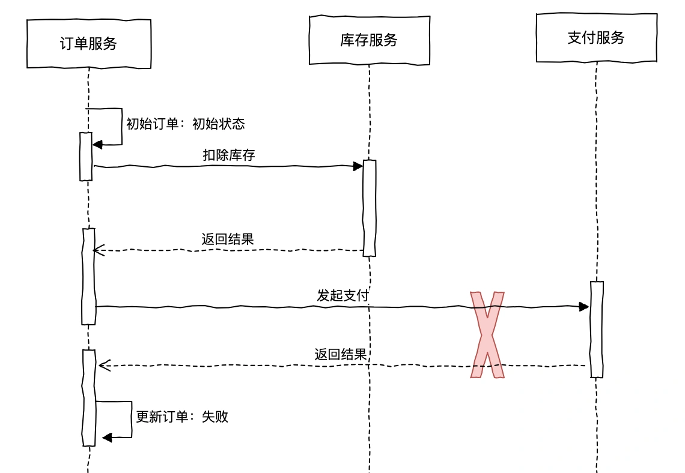
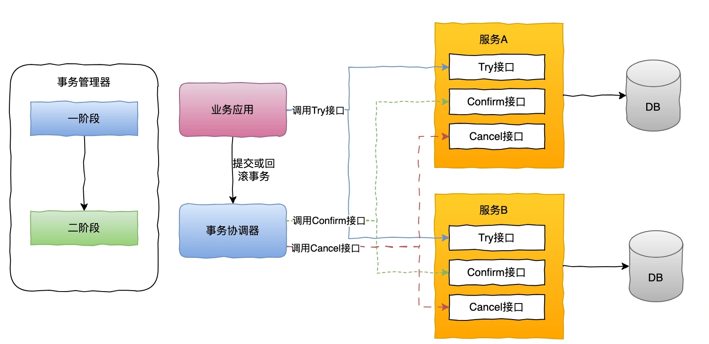
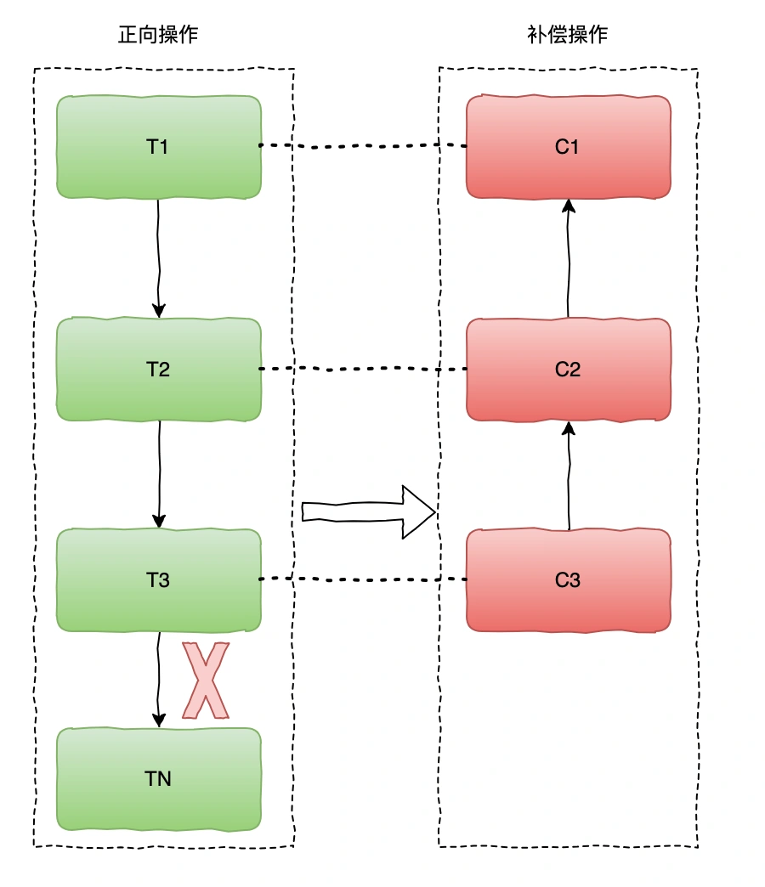
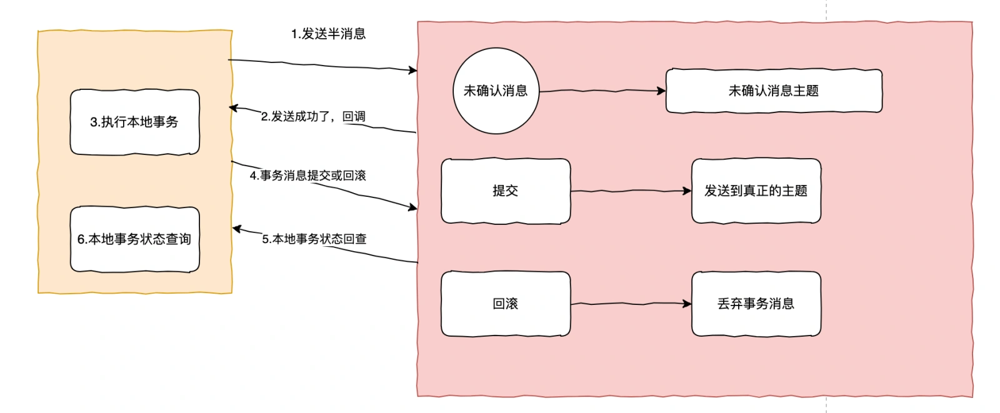

# 023|分布式数据一致性是什么？分布式事务解决方案有哪些，实现原理是什么？

大家好，我是码哥，可以叫我靓仔，畅销书《Redis 高手心法》、公众号「码哥跳动」作者，目前担任公司架构师职责。

今天我们来聊一聊分布式系统中，分布式微服务架构下的数据库一致性解决方案。

本文将带你了解为什么会出现数据不一致，分布式事务算法有哪些？他的实现原理是什么？

## **数据一致性**
什么情况下会产生数据不一致性呢？

1. 分布式系统中，在下单业务操作涉及到多个服务订单、库存、交易，比如订单服务调用库存服务扣减库存、订单服务调用支付发起支付时，就有可能扣减库存成功了，调用支付的时候却失败了，那么对于需要保证一致性的系统来说，这是不可接受的。
2. 我们的数据（数据库、MQ 中间件等）存储一般为了高可用会采用多个副本，当主副本宕机了，从副本可以随时当选主副本，来保证系统的高可用。那么当主副本同步数据到多个副本时，也会存在部分节点成功，部分节点失败的情况。

上面是数据不一致性产生的两个典型场景。

一般业界都有哪些手段来解决数据不一致性的问题呢？

先来看下分布式系统中，数据一致性的基础理论。

+ 强一致性：在分布式系统中，所有节点始终保持一致的状态，即在任何时间，系统中的所有客户端看到的数据都是相同的。
+ 弱一致性：弱一致性则没有严格要求所有节点数据的一致性，可能允许不同的节点在一段时间内保持不一致的状态。
+ 最终一致性：系统允许在短时间内存在数据的不一致状态，但最终会通过异步/同步机制将所有副本的数据达到一致。

我们应用中更多是对于第一种场景而言，这种场景下通常有以下几种常见的解决方案：

## **2PC 或 3PC**
2PC，二阶段提交包括两个阶段：准备阶段和提交阶段。

+ 准备阶段：参与者在准备阶段通知协调者是否可以正常提交。
+ 提交阶段：如果参与者都能正常提交，那么在提交阶段都提交事务。这时如果存在一个参与者无法正常提交，那所有参与者都需要回滚。

二阶段提交存在什么问题呢？

二阶段存在比较明显的问题就是，协调者如果挂了会阻塞参与者；参与者长时间锁住资源，性能受到影响；参与者与协调者发生网络分区问题时，参与者无法收到提交或回滚的指令，存在不一致情况。

二阶段提交和三阶段提交区别是什么？

三阶段为了解决二阶段的阻塞问题，增加了一个阶段：

+ 询问阶段：协调者向所有参与者发送“是否可以提交”请求，询问它们是否准备好提交事务。
+ 准备阶段：如果所有参与者在询问阶段都答复“是”，协调者向所有参与者发送“准备提交”请求。
+ 提交阶段：如果所有参与者在准备阶段都可以提交，协调者向所有参与者发送“提交”请求，正式提交事务。如果否则回滚。

但三阶段仍然存在网络分区问题，以及新增一个阶段带来更多的复杂性和开销。

## **TCC 模式**
什么是 TCC？

TCC 把分布事务拆分成三个操作：

+ Try（尝试操作）：服务将尝试执行实际的业务操作，同时确保相关的资源（如数据库记录、库存、订单等）处于可操作的状态。
+ Confirm（确认操作）：如果所有参与的服务的 Try 操作成功执行，那么 Confirm 阶段将提交参与方的操作。
+ Cancel（取消操作）：回滚参与方的操作，并且释放锁定的资源。

TCC 通过 Try/Confirm/Cancel 三个步骤来确保数据一致性，在出现失败时回滚之前的操作。

TCC 有什么优势？

它的优势在于避免了阻塞，TCC 的设计允许各个服务在执行“Try”时占用资源，而不需要等待其他节点的反馈。但是对于代码有一定的侵入性，TCC 模式需要为每个操作实现对应补偿逻辑，并且要保证每个操作的幂等性。

这里有两个关键问题需要注意：空回滚和防悬挂。

+ 空回滚：在分布式系统中，因为网络波动，有可能回滚的请求会先到达目标服务，那么当某个节点在执行回滚操作时，这时没有资源锁定或事务状态已经回到初始状态，这个回滚操作没有做出实际变更，就成了空回滚。
+ 防悬挂：在分布式系统中因为节点故障或网络问题，导致事务无法提交或回滚，一直处于“悬挂”状态。

解决空回滚，在设计回滚方法时通过检查状态或记录日志操作来判断是否需要回滚。

解决防悬挂，引入超时机制，通过设置超时机制来防止事务长时间处于等待状态。

TCC 模式对代码有倾入性，有没有别的实现呢？

## **AT 模式**
AT 模式是基于 XA 事务演化而来，是一种无侵入的分布式事务解决方案。

在 AT 模式下，用户只需要关注自己的业务 SQL，Seata 框架会自动基于用户 SQL 生成二阶段的提交或回滚操作。

+ 一阶段：业务数据和回滚日志记录在同一个本地事务中提交，释放本地锁和连接资源。
+ 二阶段：提交异步化，快速地完成，回滚通过一阶段的回滚日志进行反向补偿。

AT 模式存在什么缺点呢？

+ AT 二阶段之间属于软状态，数据可能出现不一致的情况，不属于强一致性。
+ AT 模式强依赖数据库，性能方面不算特别好。

## **Saga 模式**
Saga 是一种基于事件驱动的事务管理模式，分布式事务内有多个参与者，每一个参与者都是一个冲正补偿服务，需要用户根据业务场景来实现正向操作和反向补偿操作。

执行过程中，依次执行参与者的正向操作，如果所有参与者正向操作都执行成功，那么提交分布式事务，如果其中一个失败了，那么会回退执行前面执行过的各个参与者的反向回滚操作，使分布式事务回到初始状态。

SAGA 也存在软状态问题，虽然性能比 AT 模式好，但因为没有全局锁，没有事务隔离，会导致出现脏写。

除了以上几种还有哪些实现呢？

## **RocketMQ 事务消息**
Rocketmq 实现事务消息的原理？

先来看下整体的流程原理图：

简单而言，就是利用 RocketMQ 的半消息机制，RocketMQ 的事务消息是保证本地事务和发送消息的一致性，至于消费是否成功由消费者重试保证，所以这属于最终一致性。

什么是半消息呢？

就是 RocketMQ 的一种特殊的事务消息，首先我们创建事务消息生产者 TransactionMQProducer，当调用它的发送消息方法时，消息不会直接发送到真正的主题，而是发到它专门存放 half 消息的内部主题【RMQ_SYS_TRANS_OP_HALF_TOPIC】。

当你执行本地事务成功后提交 Commit，这时消息才会从内部主题转发到真正要发送主题。

如果本地事务执行失败了提交 Rollback，那么之前的 half 消息会被丢弃，相当于事务回滚了。

那么问题来了，如果本地执行超时了或者提交状态超时了怎么办？

莫慌，它还提供了一个回查机制，就是 RocketMQ 看你半天不提交，就会主动过来问下你啥情况了，调用查询方法看下本地这笔流水状态是成功还是失败了，成功就继续提交，失败则回滚。

所以到这里你就怎么使用 RocketMQ 的事务消息了吧，就是自定义一个事务监听器，实现两个方法：

+ 本地事务执行，返回本地事务的执行状态。
+ 查询本地事务状态，查询本地操作记录来返回事务状态。

事务消息有啥特点呢？

特点很明显就是性能会相对好一些，使用消息队列也更有助于服务的解耦，如果你不需要保证强一致性，这是不错的选择。

> 更新: 2025-05-15 21:33:27  
> 原文: <https://www.yuque.com/yuqueyonghue6cvnv/cxhfwd/aopl6n5yr3lulxwq>