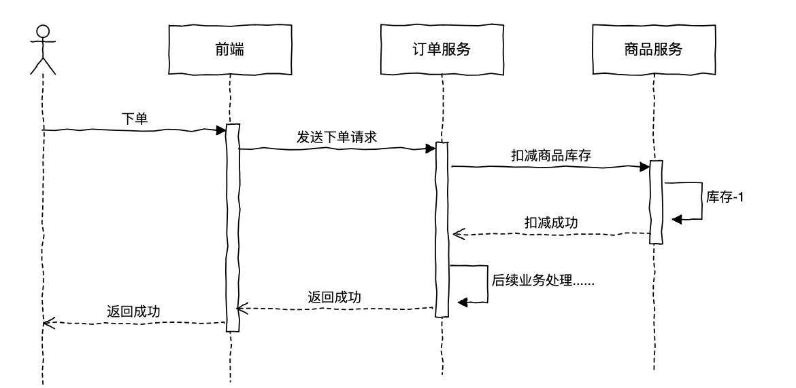
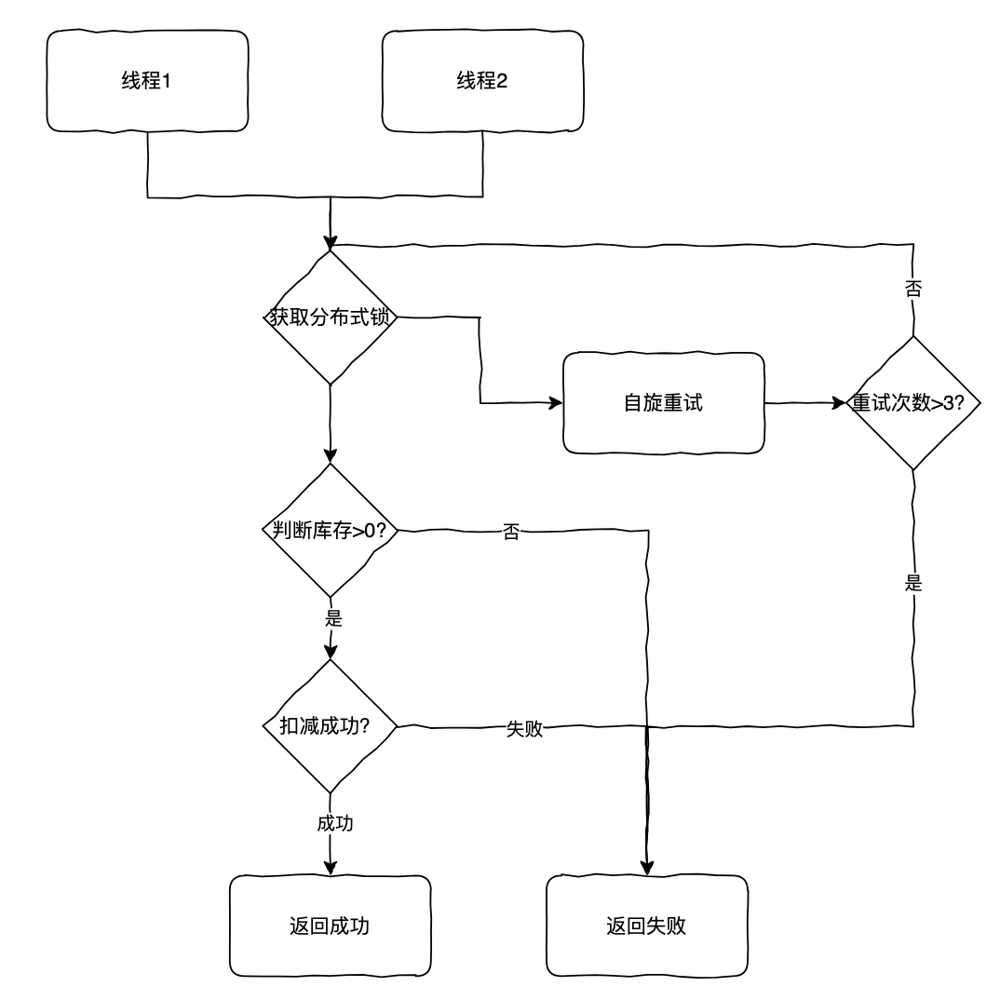
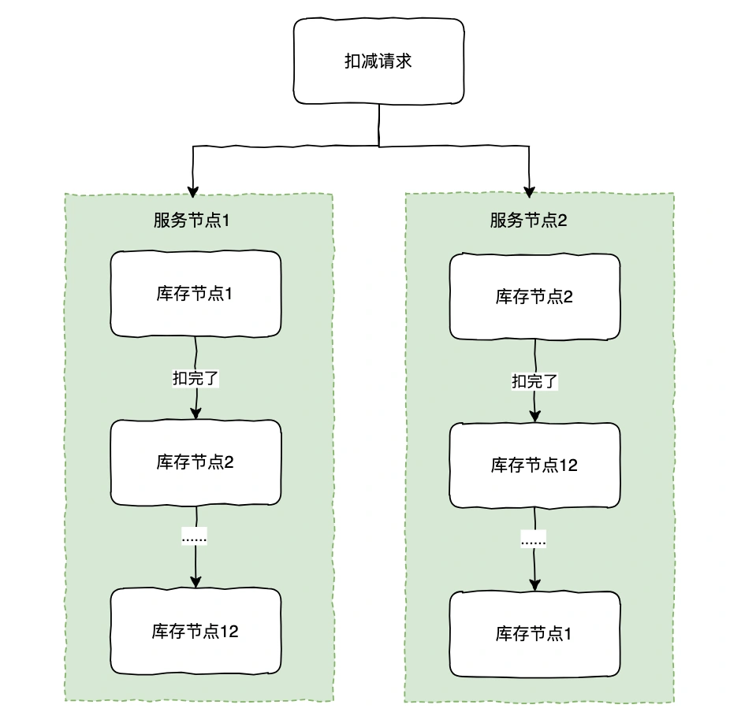

# 024｜高并发场景如何扣减商品库存，防止超卖？

<font style="color:rgb(51, 51, 51);background-color:rgb(248, 246, 244);">相信大家都参与过某某电商的抢购活动，那么大家有没有思考过，在高并发场景下，如何防止商品超卖？这里需要注意哪些问题？</font>

<font style="color:rgb(51, 51, 51);background-color:rgb(248, 246, 244);">下面，让我们来一步步看下。</font>

<font style="color:rgb(51, 51, 51);background-color:rgb(248, 246, 244);">首先，我们先看下正常的下单流程（简易版）。</font>



<font style="color:rgb(100, 100, 100);background-color:rgb(248, 246, 244);">那么，针对库存扣减的场景，要如何实现呢？</font>

## **<font style="color:rgb(34, 34, 34);background-color:rgb(248, 246, 244);">数据库扣减</font>**
<font style="color:rgb(51, 51, 51);background-color:rgb(248, 246, 244);">我们先来看下通过数据库方式去实现。</font>

<font style="color:rgb(51, 51, 51);background-color:rgb(248, 246, 244);">因为要防止它超卖，所以要先把库存锁住，避免库存还剩最后一个时，多个线程同时去扣减成负数了。</font>


<font style="color:rgb(51, 51, 51);background-color:rgb(248, 246, 244);">但是这种方式显而易见效率非常低下，因为这里加的悲观锁，读请求也被阻塞了，我们知道大部分场景下都是读多写少，所以如何优化呢？</font>

<font style="color:rgb(51, 51, 51);background-color:rgb(248, 246, 244);">很快小白想到了，可以通过乐观锁的方式实现。</font>

<font style="color:rgb(100, 100, 100);background-color:rgb(248, 246, 244);">乐观锁：事务不会在读取数据时加锁，而是继续执行后续操作，只有在提交数据时才会检查数据是否已经被其他事务修改，通常通过</font><font style="color:rgb(100, 100, 100);background-color:rgb(248, 246, 244);"> </font>**<font style="color:rgb(34, 34, 34);background-color:rgb(248, 246, 244);">版本号或时间戳</font>**<font style="color:rgb(100, 100, 100);background-color:rgb(248, 246, 244);">来实现。</font>

<font style="color:rgb(51, 51, 51);background-color:rgb(248, 246, 244);">我们可以给库存这条记录加一个版本号字段 version，在更新库存时判断版本号是否一致，这样也不会阻塞读请求。</font>

```plain
UPDATE product_inventory
SET stock = stock - :quantity,
    version = version + 1
WHERE product_id = :productId
  AND version = :version;
```

<font style="color:rgb(51, 51, 51);background-color:rgb(248, 246, 244);">这种方式能满足一般场景，但是假设在高并发的抢购活动下，当你压测时发现 TPS 怎么也提不上来。</font>

<font style="color:rgb(51, 51, 51);background-color:rgb(248, 246, 244);">高并发场景下使用乐观锁，一是其他请求拿不到版本号导致线程一直自旋等待中，甚至会降低系统的性能。二是数据库的性能瓶颈。</font>

<font style="color:rgb(100, 100, 100);background-color:rgb(248, 246, 244);">这时，你在想有没有其他更好的方式呢？</font>

## **<font style="color:rgb(34, 34, 34);background-color:rgb(248, 246, 244);">Redis 扣减</font>**
<font style="color:rgb(51, 51, 51);background-color:rgb(248, 246, 244);">既然数据库无法满足高并发性能，我们知道 Redis 单节点理论能支持几万级 TPS，而且我们还可以部署集群多节点，这样肯定能满足了吧。</font>

<font style="color:rgb(100, 100, 100);background-color:rgb(248, 246, 244);">Redis 如何实现库存扣减呢？</font>

<font style="color:rgb(51, 51, 51);background-color:rgb(248, 246, 244);">很快，你想到了，Redis 不是有一个 INCRBY 的命令吗？可以通过这个实现呀。</font>

```plain
INCRBY product:1001:stock -10
```

<font style="color:rgb(51, 51, 51);background-color:rgb(248, 246, 244);">但很快，测试时你又发现了问题，在场景下，这个库存会被扣成负数，这显然是不能接受的。</font>

<font style="color:rgb(51, 51, 51);background-color:rgb(248, 246, 244);">那再加上锁不就好了吗，因为是是节点操作，我们想到通过加分布式锁的方式。</font>



<font style="color:rgb(51, 51, 51);background-color:rgb(248, 246, 244);">同一时刻只有一个线程能获取到锁去执行扣减，这样肯定不会超卖了，但这种方式因为只有一个线程能去扣减这个商品的库存，显然并发性能还有待提升。</font>

<font style="color:rgb(100, 100, 100);background-color:rgb(248, 246, 244);">我们可以不加锁吗？但判断库存是否大于 0 和扣减库存是两个指令，如何保证一致性呢？</font>

## **<font style="color:rgb(34, 34, 34);background-color:rgb(248, 246, 244);">Redis Lua 扣减</font>**
<font style="color:rgb(100, 100, 100);background-color:rgb(248, 246, 244);">Lua：Redis 支持在服务器端执行 Lua 脚本时，脚本的所有操作都是原子执行的，即脚本中的所有命令要么全部成功，要么全部失败。</font>

<font style="color:rgb(51, 51, 51);background-color:rgb(248, 246, 244);">我们可以通过 Lua 的原子性来实现，避免加锁。</font>

<font style="color:rgb(51, 51, 51);background-color:rgb(248, 246, 244);">先获取当前库存，判断是否足够，如果足够再进行扣减。</font>

```lua
local stock = redis.call('get', KEYS[1])  -- 获取当前库存
if not stock then
    return nil  -- 如果没有找到库存，返回nil
end

if tonumber(stock) >= tonumber(ARGV[1]) then  -- 如果库存足够
    redis.call('decrby', KEYS[1], ARGV[1])  -- 扣减库存
    return tonumber(stock) - tonumber(ARGV[1])  -- 返回扣减后的库存
else
    return nil  -- 库存不足，返回nil
end
```

<font style="color:rgb(100, 100, 100);background-color:rgb(248, 246, 244);">如果这时老板看商品卖的很好，要后台调增库存怎么办？</font>

<font style="color:rgb(51, 51, 51);background-color:rgb(248, 246, 244);">如果要调增库存，为了防止多个线程同时调整库存出现并发问题，这里要加分布式锁，可以通过 SETNX 实现。</font>

```java
/**
     * 增加库存，使用分布式锁确保并发安全
     * @param productId 商品ID
     * @param quantity 增加的数量
     * @param lockValue 锁的值，用于解锁时进行验证
     * @param lockTimeout 锁的超时时间
     * @return 是否成功增加库存
     */
    public boolean increaseInventoryWithLock(String productId, int quantity, String lockValue, int lockTimeout) {
        try (Jedis jedis = jedisPool.getResource()) {
            // 获取分布式锁
            String lockKey = "product_lock:" + productId;
            boolean lockAcquired = acquireLock(jedis, lockKey, lockValue, lockTimeout);
            if (lockAcquired) {
                try {
                    // 增加库存
                    jedis.incrBy("product:" + productId + ":stock", quantity);
                    return true;
                } finally {
                    // 释放锁
                    releaseLock(jedis, lockKey, lockValue);
                }
            } else {
                // 如果获取不到锁，可以返回 false 或进行重试等操作
                return false;
            }
        }
    }
```

<font style="color:rgb(51, 51, 51);background-color:rgb(248, 246, 244);">这样，你想应该就万无一失了吧。</font>

<font style="color:rgb(100, 100, 100);background-color:rgb(248, 246, 244);">但是，如果你的商品卖得非常好，Redis 单节点也扛不住了，针对这种热点商品怎么办呢？</font>

## **<font style="color:rgb(34, 34, 34);background-color:rgb(248, 246, 244);">Redis 库存分片</font>**
<font style="color:rgb(51, 51, 51);background-color:rgb(248, 246, 244);">莫慌，别忘了我们 Redis 是多节点集群部署的，我们如果把这个热点商品库存拆分到每个节点上不就解决了吗。</font>

<font style="color:rgb(100, 100, 100);background-color:rgb(248, 246, 244);">怎么拆分呢？</font>

<font style="color:rgb(51, 51, 51);background-color:rgb(248, 246, 244);">假设我们 Redis 有 12 个节点，我们可以把商品库存缓存 Key 再加个后缀 0，1，2....12 分布到每一个节点上，扣减时如果发现当前节点没库存了，再扣除下个缓存 key。</font>

<font style="color:rgb(51, 51, 51);background-color:rgb(248, 246, 244);">当然，如果每次都从节点 1 开始，热点问题并没有解决，我们可以设置一个随机数组把顺讯打散，比如[1，2，......，12]，[2,12......,1]。</font>



<font style="color:rgb(51, 51, 51);background-color:rgb(248, 246, 244);">这样避免了该热点商品的所有请求都打到同一个节点上的问题了。</font>


> 更新: 2025-05-15 21:33:33  
> 原文: <https://www.yuque.com/yuqueyonghue6cvnv/cxhfwd/ozto6k5ri96daxny>