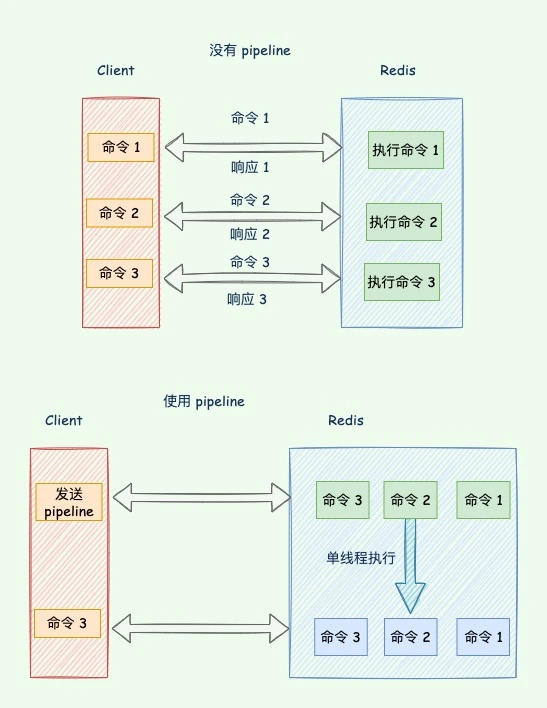
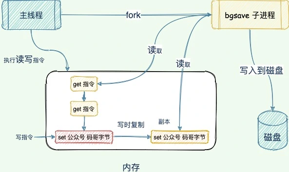

# 026｜Redis突然变慢了怎么办？

Redis 作为高性能的键值存储中间件，很多场景下我们都会用到，比如缓存、分布式锁、排行榜等，尤其在很多对于读写有着高性能要求的场景，我们更是特别依赖它。

那么，一旦某天 Redis 请求延迟变高了，就会引发系统发生一些灾难性问题，最后导致雪崩。

比如在缓存场景下，一般我们会查询 Redis，如果数据不存在再去查下数据库，把查到的数据更新到 Redis，最后返回数据到前端。

你对于这一套业界流行的方案很是放心，直到某天，正当你开开心心地吃着火锅唱着歌，突然，一个告警电话就打给了你，告诉你系统接口出现突然很多报错，你查询日志发现， 服务连接 Redis 时 报 Could not get a resource from the pool。

大量的请求直接打到了 MySQL，最后数据库也宕了，于是各种更改最大连接数、连接等待数，虽然报错信息频率有所缓解，但还是持续报错。

后来经过线下测试，发现存放 Redis 中的字符数据很大，平均 1s 返回数据。

可以发现，一旦 Redis 延迟过高，会引发各种问题。

那么，我们来看下 Redis 变慢都哪些原因呢？

## **如何解决 Redis 变慢？**
我们都知道，Redis 的数据读写由单线程执行，如果主线程执行的操作时间太长，就会导致主线程阻塞。

一起分析下都有哪些操作会阻塞主线程，我们又该如何解决？

## **1. 乱用慢指令**
当我们对 Redis 使用一些时间复杂度较高的操作时，），会长时间占用 Redis 仅有的线程资源，导致其他请求一直在等待。

常见的慢指令都有哪些呢？

+ KEYS: 遍历 Redis 中的所有键，时间复杂度 O(N)。
+ SORT：对列表排序，如果列表的元素数据量特别大，排序操作会非常慢，时间复杂度 O(N logN)。

我们尽可能使用高效的命令代替，使用增量迭代的方式，避免一次查询大量数据，具体请查看 SCAN、SSCAN、HSCAN 和 ZSCAN 命令。

## **2. 循环操作**
某些场景下，我们会循环中对 Redis 发送多条命令，这样每次命令都需要等待 Redis 返回结果后才能发送下一条命令，而且每次发送都占用了网络开销，效率非常低下

我们可以用 pipeline 来解决这个问题，Redis pipeline 将多个命令连接在一起来减少网络响应往返次数：

## **3. Fork 生成 RDB 导致的延迟**
生成 RDB 快照，Redis 必须 fork 后台进程。fork 操作（在主线程中运行）本身会导致延迟。

Redis 使用操作系统的多进程写时复制技术 COW(Copy On Write) 来实现快照持久化，减少内存占用。

但 fork 会涉及到复制大量链接对象，一个 24 GB 的大型 Redis 实例需要 24 GB / 4 kB * 8 = 48 MB 的页表。

执行 bgsave 时，这将涉及分配和复制 48 MB 内存。

此外，从库加载 RDB 期间无法提供读写服务，所以主库的数据量大小控制在 2~4G 左右，让从库快速的加载完成。

## **4. 数据同时过期**
Redis 有两种方式淘汰过期数据：

+ 惰性删除：当接收请求的时候发现 key 已经过期，才执行删除；
+ 定时删除：每 100 毫秒删除一些过期的 key。

如果有大量的键在同一时间过期，Redis 会在下次过期键的检查时进行大量删除操作，导致 Redis 服务器 CPU 使用率飙升，从而影响整体性能。

怎么解决呢？

可以在设置过期时间参数时，加上一个一定大小范围内的随机数，这样，既保证了 key 在一个邻近时间范围内被删除，又避免了同时过期造成的压力。

## **5. 大 key**
大 key 怎么产生的？

通常我们会将含有较大数据或含有大量成员、列表数的 Key 称之为大 Key。

比如一个 value 非常大的 STRING 类型 Key，超过 5MB，一个 LIST 或者 ZSET 类型包含了上万个或以上的数量。

大 key 带来问题如下：

+ Redis 内存不断变大引发 OOM，或者达到 maxmemory 设 置值引发写阻塞或重要 Key 被逐出；
+ Redis Cluster 中的某个 node 内存远超其余 node，但因 Redis Cluster 的数据迁移最小粒度为 Key 而无法将 node 上的内存均衡化；
+ bigkey 的读请求占用过大带宽，自身变慢的同时影响到该服务器上的其它服务；
+ 删除一个 bigkey 造成主库较长时间的阻塞并引发同步中断或主从切换；

我们可以对大 key 进行拆分，讲一个 key 拆分成多个 key，比如每个 key 加一个后缀，把数据均匀地分散到每个 key 上。

> 更新: 2025-05-15 21:33:58  
> 原文: <https://www.yuque.com/yuqueyonghue6cvnv/cxhfwd/ywr18vcdgxp6f3xz>