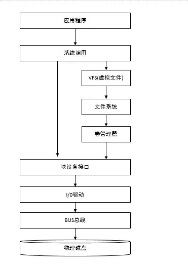
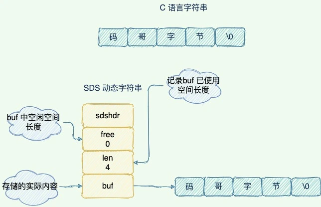
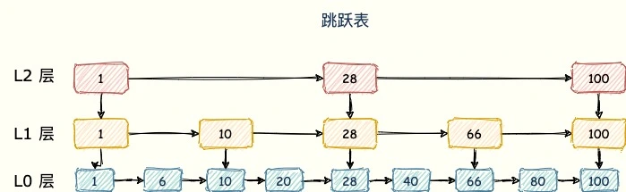

# 027｜Redis为什么这么快？

大家都知道使用 Redis 优化接口性能，可以使接口响应变快，但是为什么快呢？

因为它是基于内存实现和单线程模型？

答案是对的，但如果面试回答得这么简单，又怎能打动面试官的心呢。

很多人仅仅只是知道基于内存实现，其他核心的原因模凌两可，今天让我们一一剖析吧。

# **1.基于内存实现**
Redis 直接将数据存储在内存中，避免了传统磁盘数据库的 I/O 瓶颈。内存的读写速度比磁盘（尤其是机械硬盘）快几个数量级（如内存访问延迟约 100 纳秒，磁盘访问延迟约 10 毫秒）。

我们来看下基于内存或数据库的差别。

+ 磁盘调用栈图

+ 内存操作

内存直接由 CPU 控制，也就是 CPU 内部集成的内存控制器，所以说内存是直接与 CPU 对接，享受与 CPU 通信的最优带宽。

# **2.高效的数据结构**
Redis 中，常用的 5 种数据类型和应用场景如下：

+ String： 缓存、计数器、分布式锁等。
+ List： 链表、队列、微博关注人时间轴列表等。
+ Hash： 用户信息、Hash 表等。
+ Set： 去重、赞、踩、共同好友等。
+ Zset： 访问量排行榜、点击量排行榜等。

而这几种数据类型的底层又是采用哪种数据结构来实现的呢？

下面来看下 Redis 如何实现高性能读写的数据结构。

## **简单动态字符串（SDS）**

SDS 和 C 字符串的区别：

+ O(1)时间复杂度获取字符串长度。
+ 空间预分配

SDS 被修改后，程序不仅会为 SDS 分配所需要的必须空间，还会分配额外的未使用空间。

分配规则如下：如果对 SDS 修改后，len 的长度小于 1M，那么程序将分配和 len 相同长度的未使用空间。举个例子，如果 len=10，重新分配后，buf 的实际长度会变为 10(已使用空间)+10(额外空间)+1(空字符)=21。如果对 SDS 修改后 len 长度大于 1M，那么程序将分配 1M 的未使用空间。

+ 惰性空间释放

当对 SDS 进行缩短操作时，程序并不会回收多余的内存空间，而是使用 free 字段将这些字节数量记录下来不释放，后面如果需要 append 操作，则直接使用 free 中未使用的空间，减少了内存的分配。

+ 二进制安全

相对于 C 字符串，SDS 可以保存一些特殊的字符如 '\0'。

## **哈希表（Hash Table）**
关键特性：

+ 平均时间复杂度 O(1)

Redis 整体就是一个 哈希表来保存所有的键值对，无论数据类型是 5 种的任意一种。

而哈希表的时间复杂度是 O(1)，只需要计算每个键的哈希值，便知道对应的哈希桶位置，定位桶里面的 entry 找到对应数据，这个也是 Redis 快的原因之一

+ 通过渐进式 Rehash 避免阻塞。

当 Redis 数据越来越多需要扩容，会进行 rehash 操作。而 Redis 使用渐进式 rehash，每次处理请求时将一部分数据复制到新 hash 表中。

## **跳表（Skip List）**
sorted set 类型的排序功能便是通过「跳跃列表」数据结构来实现。

跳跃表（skiplist）是一种有序数据结构，它通过在每个节点中维持多个指向其他节点的指针，从而达到快速访问节点的目的。

跳跃表支持平均 O（logN）、最坏 O（N）复杂度的节点查找，还可以通过顺序性操作来批量处理节点。

## **压缩列表（ZipList）**
压缩列表是 List 、hash、 sorted Set 三种数据类型底层实现之一。

当一个列表只有少量数据的时候，并且每个列表项要么就是小整数值，要么就是长度比较短的字符串，那么 Redis 就会使用压缩列表来做列表键的底层实现。

ziplist 是由一系列特殊编码的连续内存块组成的顺序型的数据结构，ziplist 中可以包含多个 entry 节点，每个节点可以存放整数或者字符串。

## **紧凑数据结构**
比如 HyperLogLog（基数统计）、Bitmap（位操作）等，直接操作二进制数据。

# **3. 单线程模型+I/O 多路复用**
## **单线程模型**
Redis 6.0 之前，核心命令处理是单线程的，避免了多线程的上下文切换、锁竞争等问题，简化了实现，Redis 的单线程指的是 Redis 的网络 IO 以及键值对指令读写是由一个线程来执行的。

单线程的好处:

+ 减少创建线程的开销；
+ 避免上下文切换的开销；
+ 避免多线程之间的并发安全问题等。

而 Redis 的瓶颈其实主要在于网络和内存大小，所以也没有必要引入多线程。

## **I/O 多路复用**
Redis 采用 I/O 多路复用技术，并发处理连接。采用了 epoll + 自己实现的简单的事件框架。epoll 中的读、写、关闭、连接都转化成了事件，然后利用 epoll 的多路复用特性，绝不在 IO 上浪费一点时间。

多路指的是多个 socket 连接，复用指的是复用一个线程。多路复用主要有三种技术：select，poll，epoll。epoll 是最新的也是目前最好的多路复用技术。

Redis 单线程情况下，内核会一直监听 socket 上的连接请求或者数据请求，一旦有请求到达就交给 Redis 线程处理，这就实现了一个 Redis 线程处理多个 IO 流的效果。正因为此，Redis 可以同时和多个客户端连接并处理请求，从而提升并发性。

## **Redis 6.0+ 多线程优化**
上面说到，在极端高并发场景下，网络 IO 最有可能成为 Redis 的性能瓶颈。

所以在 Redis6.0 引入多线程处理网络 I/O（命令执行仍为单线程），多个 I/O 线程并行处理不同客户端的 数据读写和协议解析，减少主线程在 I/O 上的耗时。

启用方式：在 redis.conf 中设置 io-threads N（N 为线程数，建议为 CPU 核心数的 70%~80%）。

在高并发连接和大响应数据的场景，多线程网络 I/O 模式可显著提升性能。

> 更新: 2025-05-15 21:34:47  
> 原文: <https://www.yuque.com/yuqueyonghue6cvnv/cxhfwd/sg7gng85g35apuc3>