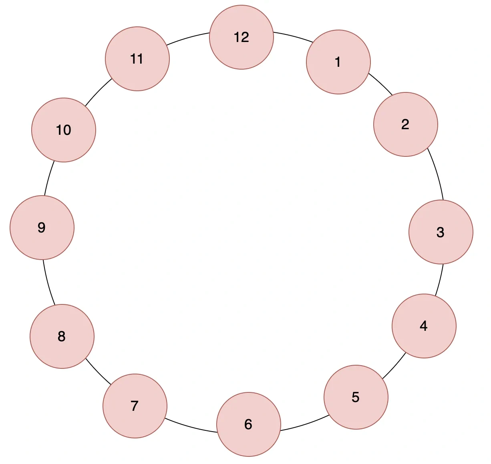
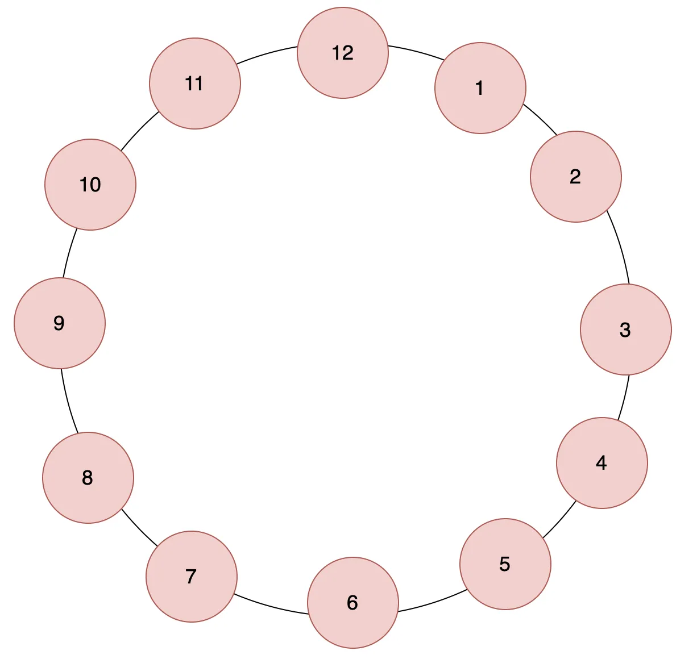
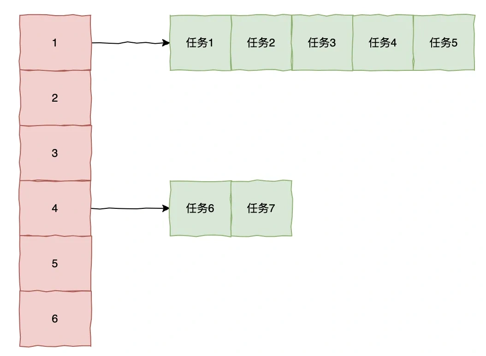
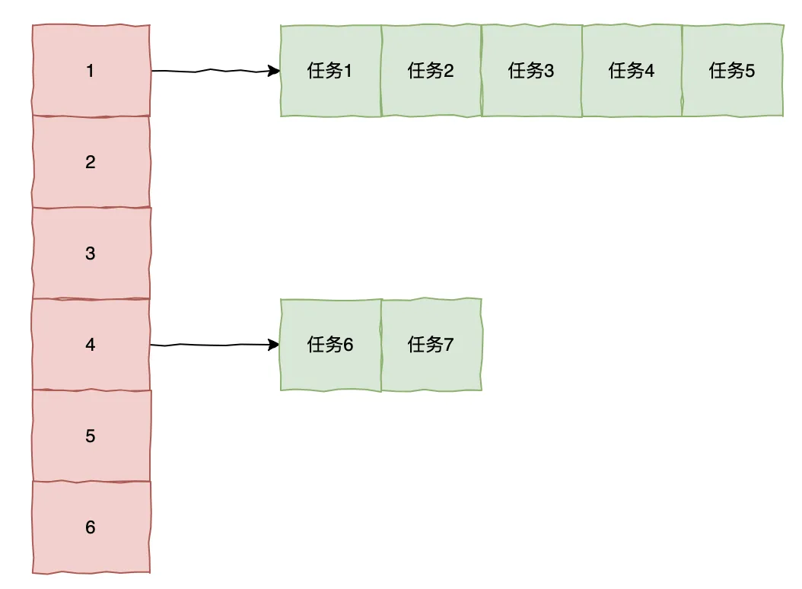

# 028｜如何优雅实现订单超时关闭？

<font style="color:rgb(51, 51, 51);background-color:rgb(248, 246, 244);">在电商场景中，订单超时未支付自动关闭是一个很常见的场景，那么大家知道要如何实现这个功能吗？</font>

**<font style="color:rgb(34, 34, 34);background-color:rgb(248, 246, 244);">下面，一起来看下都有哪些方式来实现。</font>**

# **<font style="color:rgb(34, 34, 34);background-color:rgb(248, 246, 244);">延时队列实现</font>**
<font style="color:rgb(51, 51, 51);background-color:rgb(248, 246, 244);">Java 中的 DelayQueue 便可以很方便地实现这个场景，它是一个阻塞队列，基于优先级队列（PriorityQueue），元素需实现 Delayed 接口。</font>

```plain
DelayQueue<DelayedTask> delayQueue = new DelayQueue<>();

// 添加延迟任务（30秒后执行）
delayQueue.put(new DelayedTask("task1", 30_000));

// 消费线程
new Thread(() -> {
    while (true) {
        try {
            DelayedTask task = delayQueue.take(); // 阻塞直到有到期任务
            System.out.println("执行任务: " + task.taskId);
        } catch (InterruptedException e) {
            Thread.currentThread().interrupt();
            break;
        }
    }
}).start();
```

# **<font style="color:rgb(34, 34, 34);background-color:rgb(248, 246, 244);">数据库轮询</font>**
<font style="color:rgb(51, 51, 51);background-color:rgb(248, 246, 244);">通过定时任务定时轮询数据库，将超时未支付的订单状态更改为“已关闭”。</font>

```java
@Autowired
    private OrderRepository orderRepository;

    @Scheduled(fixedRate = 5 * 60 * 1000) // 每5分钟执行一次
    @Transactional
    public void closeExpiredOrders() {
        // 分页查询待支付且过期的订单（避免全表扫描）
        Page<Order> expiredOrders = orderRepository.findByStatusAndExpireTimeBefore(
            0,
            LocalDateTime.now(),
            PageRequest.of(0, 100) // 每次处理100条
        );

        expiredOrders.getContent().forEach(order -> {
            order.setStatus(2); // 关闭订单
            orderRepository.save(order);
            releaseInventory(order); // 释放库存等资源
        });
    }
```

<font style="color:rgb(51, 51, 51);background-color:rgb(248, 246, 244);">优点：</font>

+ <font style="color:rgb(51, 51, 51);background-color:rgb(248, 246, 244);">实现简单，无需额外中间件依赖。</font>
+ <font style="color:rgb(51, 51, 51);background-color:rgb(248, 246, 244);">适合中小型系统，数据量可控的场景。</font>

<font style="color:rgb(51, 51, 51);background-color:rgb(248, 246, 244);">缺点：</font>

+ <font style="color:rgb(51, 51, 51);background-color:rgb(248, 246, 244);">延迟高：依赖定时任务频率（如 5 分钟一次），实时性不够。</font>
+ <font style="color:rgb(51, 51, 51);background-color:rgb(248, 246, 244);">数据库压力大：频繁全表扫描可能影响性能。</font>

# **<font style="color:rgb(34, 34, 34);background-color:rgb(248, 246, 244);">Redis</font>**
<font style="color:rgb(51, 51, 51);background-color:rgb(248, 246, 244);">基于 Redis 有两种方式。</font>

1. <font style="color:rgb(51, 51, 51);background-color:rgb(248, 246, 244);">Redis 本身的有序队列 SortedSet</font>

<font style="color:rgb(51, 51, 51);background-color:rgb(248, 246, 244);">将订单 ID 和超时时间戳（作为分数）存入 Redis 有序集合，定时查下小于当前时间的数据，批量拉出处理，并且通过分布式锁保证并发安全性。</font>

```typescript
public void consumeExpiredOrders() {
        // 获取当前时间戳
        long now = System.currentTimeMillis();

        // 分布式锁Key（防止多实例并发消费）
        String lockKey = "order:delay:lock";

        // 尝试获取锁（锁有效期15秒）
        Boolean locked = redisTemplate.opsForValue().setIfAbsent(lockKey, "locked", 15, TimeUnit.SECONDS);

        if (locked != null && locked) {
            try {
                // 从 Sorted Set 中获取已超时的订单（时间戳 <= now）
                Set<String> orderIds = redisTemplate.opsForZSet().rangeByScore(
                    "order:delay:queue", 0, now,
                    0, // 起始偏移量
                    100 // 每次最多取100条（防堆积）
                );
                // 批量处理订单关闭
            } finally {
                // 释放锁
                redisTemplate.delete(lockKey);
            }
        }
    }
```

<font style="color:rgb(51, 51, 51);background-color:rgb(248, 246, 244);">这种方式和数据库相比，性能较高，但 Redis 数据都存在内存中，本身容量有限，且数据极端情况下可能会丢失。</font>

1. <font style="color:rgb(51, 51, 51);background-color:rgb(248, 246, 244);">Redis 过期 key 监听</font>

<font style="color:rgb(51, 51, 51);background-color:rgb(248, 246, 244);">Redis 提供了 key 过期监听的功能，基于事件监听机制，在 key 过期后可以触发订单关闭的逻辑。</font>

```plain
public void createOrder(Order order) {
        orderRepository.save(order);
        // 设置30分钟过期
        redisTemplate.opsForValue().set(
            "order:expire:" + order.getOrderId(),
            "pending",
            30, TimeUnit.MINUTES
        );
    }
```

<font style="color:rgb(51, 51, 51);background-color:rgb(248, 246, 244);">这种方式实现较简单，且基于 Redis 操作，性能和实时性较好。但还是会存在数据丢失和事件丢失的问题。</font>

# **<font style="color:rgb(34, 34, 34);background-color:rgb(248, 246, 244);">消息队列</font>**
<font style="color:rgb(51, 51, 51);background-color:rgb(248, 246, 244);">可以通过消息队列比如 Rabbitmq 实现，在创建订单的时候便发送延迟消息到延迟队列，到过期时候后，延迟消息会下发到真正的主题，消费者判断是否支付，如未支付便进行关单操作。</font>

```typescript
/ 1. 配置延迟交换机（需安装 rabbitmq_delayed_message_exchange 插件）
@Configuration
public class RabbitMQConfig {
    @Bean
    public CustomExchange delayExchange() {
        Map<String, Object> args = new HashMap<>();
        args.put("x-delayed-type", "direct");
        return new CustomExchange("order.delay.exchange", "x-delayed-message", true, false, args);
    }

    @Bean
    public Queue orderCloseQueue() {
        return new Queue("order.close.queue");
    }

    @Bean
    public Binding delayBinding() {
        return BindingBuilder.bind(orderCloseQueue())
            .to(delayExchange()).with("order.close").noargs();
    }
}

// 2. 订单创建时发送延迟消息
@Service
public class OrderService {
    @Autowired
    private RabbitTemplate rabbitTemplate;

    public void createOrder(Order order) {
        // 保存订单到数据库
        orderRepository.save(order);

        // 发送30分钟延迟消息
        rabbitTemplate.convertAndSend(
            "order.delay.exchange",
            "order.close",
            order.getOrderId(),
            message -> {
                message.getMessageProperties().setDelay(30 * 60 * 1000); // 30分钟
                return message;
            }
        );
    }
}
```

<font style="color:rgb(51, 51, 51);background-color:rgb(248, 246, 244);">这种方式精准控制超时时间，天然支持分布式系统场景，但是需要维护 MQ 和插件，增大了系统的复杂性，适用于一开始就有使用 MQ 的系统。</font>

# **<font style="color:rgb(34, 34, 34);background-color:rgb(248, 246, 244);">时间轮算法</font>**
**<font style="color:rgb(34, 34, 34);background-color:rgb(248, 246, 244);">时间论算法：是一种高效管理定时任务的调度机制，尤其适合处理海量短时延迟任务（如心跳检测、订单超时）。其核心思想是将时间分割为固定间隔的“格子”，通过轮状结构循环遍历这些格子来触发任务执行。</font>**

<font style="color:rgb(51, 51, 51);background-color:rgb(248, 246, 244);">时间轮，其实就是一种环型的数据结构，可以把它想象成一个时钟，分成了许多格子，每个格子代表一定时间刻度比如 1s。</font>

<font style="color:rgb(51, 51, 51);background-color:rgb(248, 246, 244);">在这个格子上用一个链表来保存要执行的超时任务，随着指针的转动，走到那个格子时就执行格子对应的延迟任务。</font>

<font style="color:rgb(51, 51, 51);background-color:rgb(248, 246, 244);">时间轮结构示意图：</font>



<font style="color:rgb(51, 51, 51);background-color:rgb(248, 246, 244);">将时间划分为多个固定间隔的格子（如 1 秒/格）</font>



<font style="color:rgb(51, 51, 51);background-color:rgb(248, 246, 244);">每个时间格挂载一个链表，存储在该时间点需要执行的任务</font>



+ <font style="color:rgb(51, 51, 51);background-color:rgb(248, 246, 244);">当添加任务时，比如任务 A 需要在 10s 后执行，那么索引位置=10%12=10（10s）。任务 B 要在 20s 后执行，显然会超过一轮，索引位置=(20-12)%12=8（1 圈 8s）。</font>
+ <font style="color:rgb(51, 51, 51);background-color:rgb(248, 246, 244);">当任务触发时，如果有剩余圈数，把圈数-1，直到圈数为 0 时便会触发该任务。</font>

<font style="color:rgb(51, 51, 51);background-color:rgb(248, 246, 244);">但是如果你的场景都是任务周期比较久的话，比如一小时或者一天，单层时间轮的格子数会特别多，可以用多层时间轮，一个层级代表一个刻度，比如第一层 1s/格，第二层 1 分钟/格，......。</font>

<font style="color:rgb(51, 51, 51);background-color:rgb(248, 246, 244);">时间轮这种实现方式非常高效，添加任务和触发任务的的时间复杂度都是 O(1)，适用于单机高并发场景，很多开源中间件都有用到这个算法，比如 Netty、Kafka 等，当然它们的具体实现方式多少会有些出入。</font>


> 更新: 2025-06-16 11:01:58  
> 原文: <https://www.yuque.com/yuqueyonghue6cvnv/cxhfwd/qbv7vpd78er6beuw>