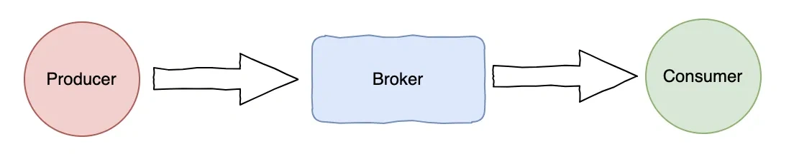
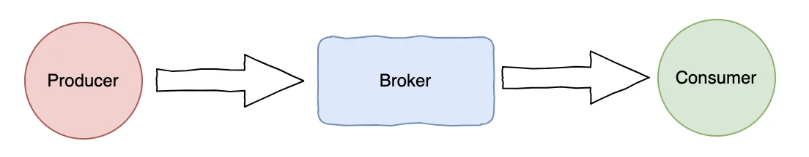
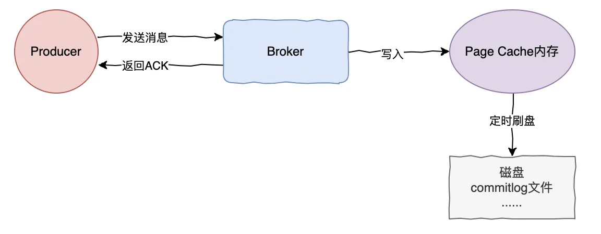

# 029｜RocketMQ如何保证消息不丢失？

<font style="color:rgb(51, 51, 51);background-color:rgb(248, 246, 244);">你好，我是码哥，可以叫我靓仔</font>

<font style="color:rgb(51, 51, 51);background-color:rgb(248, 246, 244);">大家都用过消息队列比如 RocketMQ、Kafka，消息队列一般用在以下场景：</font>

+ <font style="color:rgb(51, 51, 51);background-color:rgb(248, 246, 244);">系统解耦：通过将消息生产者和消费者分离，双方仅依赖队列而非彼此，降低耦合度。</font>
+ <font style="color:rgb(51, 51, 51);background-color:rgb(248, 246, 244);">异步处理：在一些高并发场景下，我们可以把请求发送到消息队列做削峰处理，提升系统吞吐量。</font>
+ <font style="color:rgb(51, 51, 51);background-color:rgb(248, 246, 244);">定制场景：比如定时关闭订单可以通过延迟消息实现，分布式事务可以通过事务消息。</font>

<font style="color:rgb(51, 51, 51);background-color:rgb(248, 246, 244);">那么，在使用 RocketMQ 的时候，大家有没想过万一消息丢了呢？</font>

<font style="color:rgb(51, 51, 51);background-color:rgb(248, 246, 244);">下面我们来看下 RocketMQ 什么场景消息会丢，如何保证消息不丢失。</font>

<font style="color:rgb(51, 51, 51);background-color:rgb(248, 246, 244);">先来看下消息发送的简单流程：</font>

1. <font style="color:rgb(51, 51, 51);background-color:rgb(248, 246, 244);">应用调用 Producer API 发送消息到 Broker。</font>
2. <font style="color:rgb(51, 51, 51);background-color:rgb(248, 246, 244);">Broker 接收消息，持久化到磁盘。</font>
3. <font style="color:rgb(51, 51, 51);background-color:rgb(248, 246, 244);">消费者从 Broker 拉取消息消费并提交。</font>



<font style="color:rgb(51, 51, 51);background-color:rgb(248, 246, 244);">消息的流转涉及这三个模块，下面逐一来看下每个模块。</font>

**<font style="color:rgb(34, 34, 34);background-color:rgb(248, 246, 244);">发送消息消息时，什么情况下会丢？</font>**

# **<font style="color:rgb(34, 34, 34);background-color:rgb(248, 246, 244);">发送端</font>**
<font style="color:rgb(51, 51, 51);background-color:rgb(248, 246, 244);">RocketMQ 发送有以下几种模式：</font>

+ <font style="color:rgb(51, 51, 51);background-color:rgb(248, 246, 244);">同步发送：产者发送消息后阻塞等待 Broker 的响应（ACK），确认消息成功存储到 Broker 后再继续后续逻辑。</font>
+ <font style="color:rgb(51, 51, 51);background-color:rgb(248, 246, 244);">异步发送（Async Send）：生产者发送消息后立即返回，通过回调函数异步处理 Broker 的响应结果。</font>
+ <font style="color:rgb(51, 51, 51);background-color:rgb(248, 246, 244);">单向发送（Oneway Send）：生产者发送消息后不等待响应，也不处理结果，仅保证消息发出。</font>

<font style="color:rgb(51, 51, 51);background-color:rgb(248, 246, 244);">从上面来看第一种同步发送保证消息一定发送成功再响应；第二种虽然是异步发送，但如果发送失败时也可以通过自定义回调方法实现响应处理逻辑，发送失败也不影响；第三种单向发送相当于发送过去就不管了，消息可能成功也可能失败。</font>

<font style="color:rgb(51, 51, 51);background-color:rgb(248, 246, 244);">所以如果要保证消息不丢失，第一二种都可以使用。</font>

**<font style="color:rgb(34, 34, 34);background-color:rgb(248, 246, 244);">消息发送到 Broker 就一定不会丢失了吗？</font>**

# **<font style="color:rgb(34, 34, 34);background-color:rgb(248, 246, 244);">Broker</font>**
<font style="color:rgb(51, 51, 51);background-color:rgb(248, 246, 244);">在讲到 Broker 如何保存消息之前，先来看下什么叫 Linux 磁盘回写（Writeback）。</font>

**<font style="color:rgb(34, 34, 34);background-color:rgb(248, 246, 244);">Linux 磁盘回写（Writeback）是一种磁盘缓存机制，它允许系统将数据先写入缓存（通常是内存中的 Page Cache），然后再异步地将数据写回到磁盘。这种机制可以提高系统的写入性能，因为直接写入磁盘的速度通常比写入内存慢得多。</font>**

<font style="color:rgb(51, 51, 51);background-color:rgb(248, 246, 244);">当然很多中间件或数据库都会使用这种方式提高写入性能，比如 RocketMQ、Kafka、Mysql。</font>

<font style="color:rgb(51, 51, 51);background-color:rgb(248, 246, 244);">RocketMQ 作为一个支持高并发读写的消息中间件，Broker 接收到消息会先写入 Page Cache，再定期或当 PageCache 写满时再同步到磁盘。</font>



<font style="color:rgb(51, 51, 51);background-color:rgb(248, 246, 244);">那么，当消息未写入磁盘时，如果 Broker 节点宕掉了，那么消息不就丢了吗？</font>

<font style="color:rgb(51, 51, 51);background-color:rgb(248, 246, 244);">是的，所以 RocketMQ 提供了同步刷盘机制，在 RocketMQ 的 Broker 配置文件（broker.conf）中设置以下参数：</font>

```plain
# 启用同步刷盘
flushDiskType = SYNC_FLUSH
```

# **<font style="color:rgb(34, 34, 34);background-color:rgb(248, 246, 244);">可选：调整刷盘超时时间（默认5秒）</font>**
<font style="color:rgb(51, 51, 51);background-color:rgb(248, 246, 244);">syncFlushTimeout = 5000  
</font>

**<font style="color:rgb(34, 34, 34);background-color:rgb(248, 246, 244);">使用同步刷盘必然会降低性能，那如果不想使用同步刷盘方法影响了本身性能，怎么办呢？</font>**

<font style="color:rgb(51, 51, 51);background-color:rgb(248, 246, 244);">再看下 RocketMQ 有哪些集群部署模式？</font>

1. <font style="color:rgb(51, 51, 51);background-color:rgb(248, 246, 244);">单 Master 模式：只有一个 Master 节点，没有 Slave 节点。这种方式没有容错，无法保证高可用。</font>
2. <font style="color:rgb(51, 51, 51);background-color:rgb(248, 246, 244);">多 Master 模式：部署多个 Master 节点，无单点问题，但是当某个 Broker 节点挂了，该节点的消息就无法丢了，还是无法保证高可用。</font>
3. <font style="color:rgb(51, 51, 51);background-color:rgb(248, 246, 244);">多 Master 多 Salve 模式（异步复制）：每个 Master 节点配置 多个 Slave 节点。Master 异步同步数据到 Slave，如果 Master 节点挂了可切换到 Slave，但 Slave 数据可能会存在滞后。</font>
4. <font style="color:rgb(51, 51, 51);background-color:rgb(248, 246, 244);">多 Master 多 Salve 模式（同步复制）：类似异步复制模式，但 Master 需等待 Slave 写入成功 后才返回响应。可靠性强，主从数据完全一致，但会增加写入延迟。</font>
5. <font style="color:rgb(51, 51, 51);background-color:rgb(248, 246, 244);">Dledger 模式：使用 Dledger 技术（基于 Raft 协议）实现多节点数据一致性和自动选主，每个节点既是 Master 也是 Slave，通过选举机制保障 Leader 节点。可靠性高，可自动切换，只需要超过一半节点写入即可。</font>

<font style="color:rgb(51, 51, 51);background-color:rgb(248, 246, 244);">可通过集群部署的方式比如 Dledger 模式保证 Broker 的高可用，这样即使当 Master 节点的数据还没得及写入到磁盘就挂掉了，再选举其他从节点切换到主节点即可。</font>

**<font style="color:rgb(34, 34, 34);background-color:rgb(248, 246, 244);">是不是 Broker 消息写入成功了，就万无一失了呢？</font>**

<font style="color:rgb(51, 51, 51);background-color:rgb(248, 246, 244);">当然不是，毕竟消息最后还是要消费的，如果消费逻辑处理不当，那么消费没成功不就相当于丢了。</font>

# **<font style="color:rgb(34, 34, 34);background-color:rgb(248, 246, 244);">消费端</font>**
## **<font style="color:rgb(34, 34, 34);background-color:rgb(248, 246, 244);">消费端确认机制</font>**
<font style="color:rgb(51, 51, 51);background-color:rgb(248, 246, 244);">消费者需在处理完消息后手动返回消费成功状态（CONSUME_SUCCESS），确保消息处理完成后再提交位点，避免自动提交，不然拉取到消息就提交了，如果消费处理失败就丢了。</font>

```kotlin
consumer.registerMessageListener((MessageListenerConcurrently) (msgs, context) -> {
    for (MessageExt msg : msgs) {
        try {
            // 业务处理逻辑
            processMessage(msg);
            return ConsumeConcurrentlyStatus.CONSUME_SUCCESS; // 手动ACK
        } catch (Exception e) {
            // 记录日志，返回稍后重试
            return ConsumeConcurrentlyStatus.RECONSUME_LATER;
        }
    }
    return ConsumeConcurrentlyStatus.CONSUME_SUCCESS;
});
```

<font style="color:rgb(51, 51, 51);background-color:rgb(248, 246, 244);">当消息处理失败返回失败状态时，会进入重试队列，RocketMQ 会自动重试，最多重试 16 次，重试间隔逐步增加（1s, 5s, 10s...2h），当然也可以自定义重试策略。</font>

```plain
consumer.setConsumeMessageMaxTimes(3); // 设置最大重试次数为3次
consumer.setMaxReconsumeTimes(16); // 设置消息最大重试次数（与上面的略有不同，取决于你的版本和具体需求）
```

<font style="color:rgb(51, 51, 51);background-color:rgb(248, 246, 244);">或者使用 ReconsumeLater 自定义延迟</font>

```plain
throw new MQClientException("需要立即重试", ResponseCode.RECONSUME_LATER, true, 5000); // 5秒后重试
```

<font style="color:rgb(51, 51, 51);background-color:rgb(248, 246, 244);">最后超过最大重试次数的消息会被转移到死信队列。</font>


> 更新: 2025-06-16 11:02:18  
> 原文: <https://www.yuque.com/yuqueyonghue6cvnv/cxhfwd/ch17usigs04b7gau>