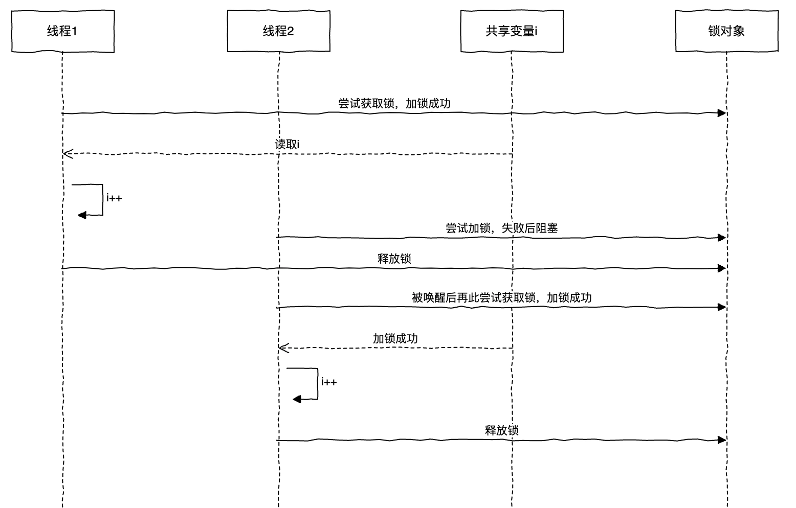
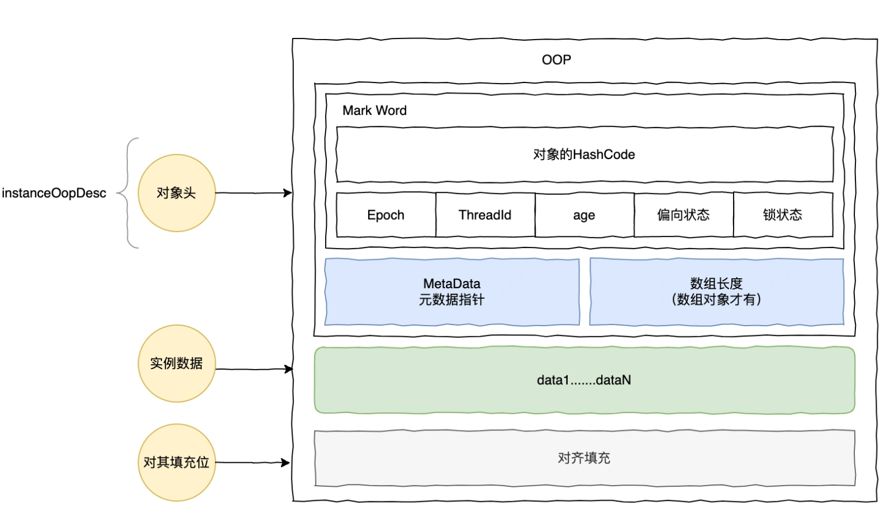
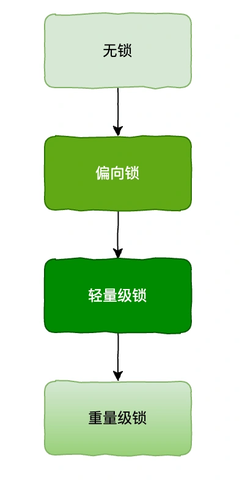
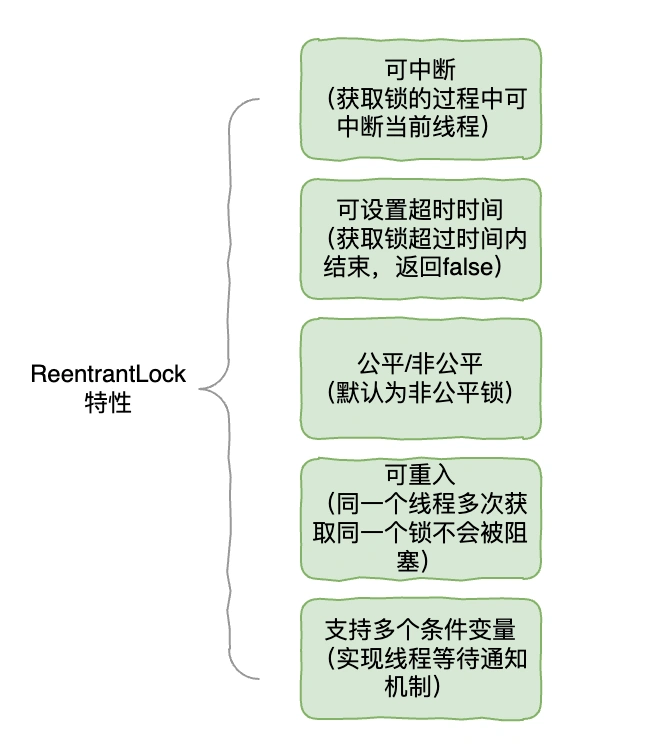
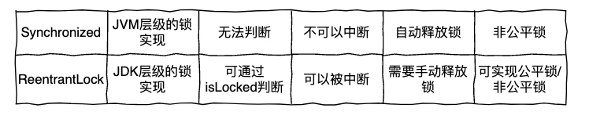
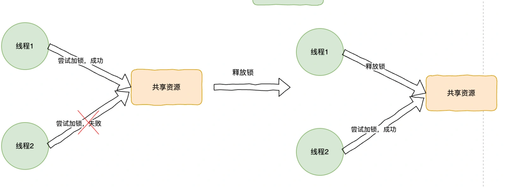
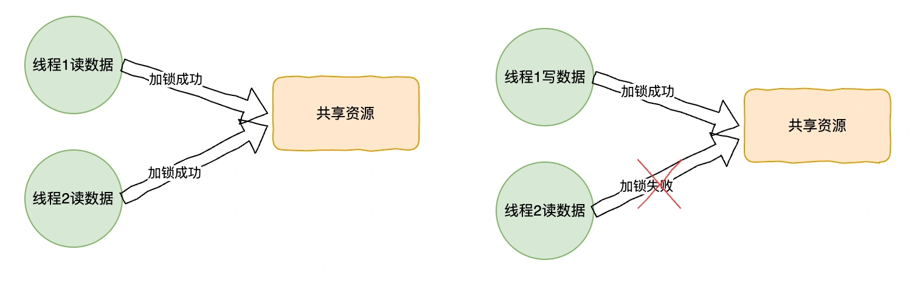
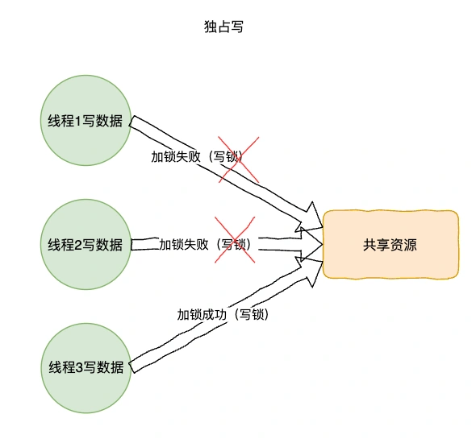
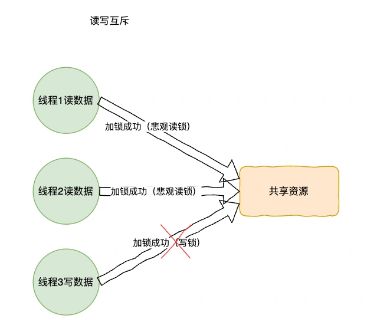
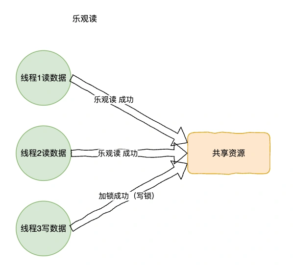

# 02 | Java中一共有 N 种实现锁的方式，你知道都有哪些吗？

<font style="color:rgb(51, 51, 51);background-color:rgb(248, 246, 244);">首先，我们先来看下线程安全性的定义，为什么需要锁?</font>

<font style="color:rgb(51, 51, 51);background-color:rgb(248, 246, 244);">线程安全，即在多线程编程中，一个程序或者代码段在并发访问时，能够正确地保持其预期的行为和状态，而不会出现意外的错误或者不一致的结果。</font>

<font style="color:rgb(51, 51, 51);background-color:rgb(248, 246, 244);">而解决线程安全问题，主要分为两大类：1、无锁；2、有锁。</font>

**<font style="color:rgb(34, 34, 34);background-color:rgb(248, 246, 244);">无锁的方式有：</font>**

1. <font style="color:rgb(51, 51, 51);background-color:rgb(248, 246, 244);">局部变量；</font>
2. <font style="color:rgb(51, 51, 51);background-color:rgb(248, 246, 244);">对象加final为不可变对象；</font>
3. <font style="color:rgb(51, 51, 51);background-color:rgb(248, 246, 244);">使用ThreadLocal作为线程副本对象；</font>
4. <font style="color:rgb(51, 51, 51);background-color:rgb(248, 246, 244);">CAS，Compare-And-Swap即比较并交换，是Java十分常见的无锁实现方式。</font>

<font style="color:rgb(100, 100, 100);background-color:rgb(248, 246, 244);">小白：那有锁的方式呢，怎么通过加锁保证线程安全呢？</font>

<font style="color:rgb(51, 51, 51);background-color:rgb(248, 246, 244);">别急哈，下面听我给你一一道来。</font>

# <font style="color:rgb(0, 0, 0);background-color:rgb(248, 246, 244);">Java有哪些锁？</font>
<font style="color:rgb(51, 51, 51);background-color:rgb(248, 246, 244);">从加锁的策略看，分为隐式锁和显示锁。隐式锁通过Synchronized实现，显示锁通过Lock实现。</font>

+ <font style="color:rgb(51, 51, 51);background-color:rgb(248, 246, 244);">乐观锁：顾名思义，它是一种基于乐观的思想，认为读取的数据一般不会冲突，不会对其加锁，而是在最后提交数据更新时判断数据是否被更新，如果冲突，则更新不成功。</font>
+ <font style="color:rgb(51, 51, 51);background-color:rgb(248, 246, 244);">悲观锁：它总是假设最坏的情况，每次读取数据都认为别人会更新，所以每次读取数据的时候都会加锁，这样别人就得阻塞等待它处理完释放锁后才能去读取。</font>

<font style="color:rgb(51, 51, 51);background-color:rgb(248, 246, 244);">乐观锁实现：CAS，比较并交换，通常指的是这样一种原子操作：针对一个变量，首先比较它的内存值与某个期望值是否相同，如果相同，就给它赋一个新值。</font>

<font style="color:rgb(51, 51, 51);background-color:rgb(248, 246, 244);">但是，这一篇我们主要来看下悲观锁的一些常用实现。</font>

# <font style="color:rgb(0, 0, 0);background-color:rgb(248, 246, 244);">syncroized是什么？</font>
<font style="color:rgb(51, 51, 51);background-color:rgb(248, 246, 244);">syncronized是Java中的一个关键字，用于控制对共享资源的并发访问，从而防止多个线程同时访问某个特定资源，这被称为同步。这个关键字可以用来修饰方法或代码块。</font>

<font style="color:rgb(51, 51, 51);background-color:rgb(248, 246, 244);">syncronized使用对象锁保证临界区内代码的原子性。</font>



<font style="color:rgb(100, 100, 100);background-color:rgb(248, 246, 244);">小白：synchronized的底层原理是什么呀，怎么自己就完成加锁释放锁操作了？</font>

<font style="color:rgb(51, 51, 51);background-color:rgb(248, 246, 244);">其实synchronized的原理也不难，主要有以下两个关键点。</font>

+ <font style="color:rgb(51, 51, 51);background-color:rgb(248, 246, 244);">synchronized又被称为监视器锁，基于Monitor机制实现的，主要依赖底层操作系统的互斥原语Mutex（互斥量）。Monitor类比加了锁的房间，一次只能有一个线程进入，进入房间即持有Monitor，退出后就释放Monitor。</font>
+ <font style="color:rgb(51, 51, 51);background-color:rgb(248, 246, 244);">另一个关键点是Java对象头，在JVM虚拟机中，对象在内存中的存储结构有三部分：对象头；实例数据；对齐填充。</font>

<font style="color:rgb(51, 51, 51);background-color:rgb(248, 246, 244);">对象头主要包括标记字段Mark World，元数据指针，如果是数组对象的话，对象头还必须存储数组长度。</font>



<font style="color:rgb(51, 51, 51);background-color:rgb(248, 246, 244);">synchronized也是基于此，通过锁对象的monitor获取和monitor释放来实现，对象头标记为存储具体锁状态，ThreadId记录持有偏向锁的线程ID。</font>

<font style="color:rgb(51, 51, 51);background-color:rgb(248, 246, 244);">这里，又引申另外出一个问题：你知道什么是偏向锁呢？</font>

<font style="color:rgb(100, 100, 100);background-color:rgb(248, 246, 244);">小白：不知道，啥玩意？</font>

**<font style="color:rgb(34, 34, 34);background-color:rgb(248, 246, 244);">synchronized锁升级过程</font>**

<font style="color:rgb(51, 51, 51);background-color:rgb(248, 246, 244);">说到这里，那就不得不提及synchronized的锁升级机制了，因为synchronized的加锁释放锁操作会使得CPU在内核态和户态之间发生切换，有一定性能开销。在JDK1.5版本以后，对synchronized做了锁升级的优化，主要利用轻量级锁、偏向锁、自适应锁等减少锁操作带来的开销，对其性能做了很大提升。</font>



1. <font style="color:rgb(51, 51, 51);background-color:rgb(248, 246, 244);">无锁：没有对资源进行加锁</font>
2. <font style="color:rgb(51, 51, 51);background-color:rgb(248, 246, 244);">偏向锁：在大部分情况下，只有一个线程访问修改资源，该线程自动获取锁，降低了锁操作的代价，这里就通过对象头的ThreadId记录线程ID。</font>
3. <font style="color:rgb(51, 51, 51);background-color:rgb(248, 246, 244);">轻量级锁：当前持有偏向锁，当有另外的线程来访问后，偏向锁会升级为轻量级锁，别的线程通过自旋形式尝试获取锁，不会阻塞，以提高性能。</font>
4. <font style="color:rgb(51, 51, 51);background-color:rgb(248, 246, 244);">重量级锁：在自旋次数或时间超过一定阈值时，最后会升级为重量级锁。</font>

<font style="color:rgb(100, 100, 100);background-color:rgb(248, 246, 244);">小白：哦哦原来如此，那刚刚你说了Java除了隐式锁之外，还有显示锁呢？</font>

# <font style="color:rgb(0, 0, 0);background-color:rgb(248, 246, 244);">ReentrantLock简介</font>
<font style="color:rgb(51, 51, 51);background-color:rgb(248, 246, 244);">在Java中，除了对象锁，还有显示的加锁的方式，比如Lock接口，用得比较多的就是ReentrantLock。它的特性如下：</font>



<font style="color:rgb(51, 51, 51);background-color:rgb(248, 246, 244);">下面我们再来对比看下ReentrantLock和synchronized的区别。</font>



<font style="color:rgb(51, 51, 51);background-color:rgb(248, 246, 244);">从这些对比就能看出ReentrantLock使用更加的灵活，特性更加丰富。</font>

<font style="color:rgb(51, 51, 51);background-color:rgb(248, 246, 244);">ReentrantLock是一个悲观锁，即是同一个时刻，只允许一个线程访问代码块，这一点synchronized其实也一样。</font>



<font style="color:rgb(100, 100, 100);background-color:rgb(248, 246, 244);">小白：这个是挺好用的，但是我们有一些读多写少的场景中比如缓存，大部分时间都是读操作，这里每个操作都要加锁，读性能不是很差吗，有没有更好的方案实现这种场景呀？</font>

<font style="color:rgb(51, 51, 51);background-color:rgb(248, 246, 244);">当然有的，比如ReentrantReadWriteLock，读写锁。</font>

# <font style="color:rgb(0, 0, 0);background-color:rgb(248, 246, 244);">ReentrantReadWriteLock介绍</font>
<font style="color:rgb(51, 51, 51);background-color:rgb(248, 246, 244);">针对上述场景，Java提供了读写锁ReentrantReadWriteLock，它的内部维护了一对相关的锁，一个用于只读操作，称为读锁；一个用于写入操作，称为写锁。</font>

```perl
/** Inner class providing readlock */
    private final ReentrantReadWriteLock.ReadLock readerLock;
    /** Inner class providing writelock */
    private final ReentrantReadWriteLock.WriteLock writerLock;
    /** Performs all synchronization mechanics */
    final Sync sync;
```

<font style="color:rgb(51, 51, 51);background-color:rgb(248, 246, 244);">使用核心代码如下</font>

```plain
public class LocalCacheService {

    static Map<String, Object> localCache = new HashMap<>();
    static ReentrantReadWriteLock lock = new ReentrantReadWriteLock();
    static Lock readL = lock.readLock();
    static Lock writeL = lock.writeLock();

    public static Object read(String key) {
        readL.lock();
        try {
            return localCache.get(key);
        } finally {
            readL.unlock();
        }
    }

    public static Object save(String key, String value) {
        writeL.lock();
        try {
            return localCache.put(key, value);
        } finally {
            writeL.unlock();
        }
    }
}
```

<font style="color:rgb(51, 51, 51);background-color:rgb(248, 246, 244);">在ReentrantReadWriteLock中，多个线程可以同时读取一个共享资源。</font>

<font style="color:rgb(51, 51, 51);background-color:rgb(248, 246, 244);">当有其他线程的写锁时，读线程会被阻塞，反之一样。</font>



**<font style="color:rgb(34, 34, 34);background-color:rgb(248, 246, 244);">读写锁设计思路</font>**

<font style="color:rgb(51, 51, 51);background-color:rgb(248, 246, 244);">这里有一个关键点，就是在ReentrantLock中，使用AQS的state表示同步状态，表示锁被一个线程重复获取的次数。但是在读写锁ReentrantReadWriteLock中，如何用一个变量维护这两个状态呢？</font>

<font style="color:rgb(51, 51, 51);background-color:rgb(248, 246, 244);">实际ReentrantReadWriteLock采用“高低位切割”的方式来维护，将state切分为两部分：高16位表示读；低16位表示写。</font>

<font style="color:rgb(51, 51, 51);background-color:rgb(248, 246, 244);">分割之后，通过位运算，假设当前状态为S，那么：</font>

+ <font style="color:rgb(51, 51, 51);background-color:rgb(248, 246, 244);">写状态=S&0x0000FFFF（将高16位全部移除），当写状态需要加1，S+1再运算即可。</font>

<font style="color:rgb(51, 51, 51);background-color:rgb(248, 246, 244);">读状态=S>>>16（无符号补0右移16位），当读状态需要加1，计算S+（1<<16）。</font>

+ 

<font style="color:rgb(100, 100, 100);background-color:rgb(248, 246, 244);">这时，我们再来思考下，如果有线程正在读，写线程需要等待读线程释放锁才能获取锁，也就是读的时候不允许写，那么有没有更好的方式改进呢？</font>

<font style="color:rgb(100, 100, 100);background-color:rgb(248, 246, 244);">小白：emm，这个真的难倒我了。。。。。。</font>

# <font style="color:rgb(0, 0, 0);background-color:rgb(248, 246, 244);">什么是StampedLock？</font>
<font style="color:rgb(51, 51, 51);background-color:rgb(248, 246, 244);">哈哈莫慌，Java8已经引入了新的读写锁，StampedLock。它和ReentrantReadWriteLock相比，区别在于读过程允许获取写锁写入，在原来读写锁的基础上加了一种乐观锁机制，该模式不会阻塞写锁，只是最后会对比原来的值，有着更高的并发性能。</font>

<font style="color:rgb(51, 51, 51);background-color:rgb(248, 246, 244);">StampedLock三种模式如下：</font>

<font style="color:rgb(51, 51, 51);background-color:rgb(248, 246, 244);">独占锁：和ReentrantReadWriteLock一样，同一时刻只能有一个写线程获取资源。</font>

+ 
+ <font style="color:rgb(51, 51, 51);background-color:rgb(248, 246, 244);">悲观读锁：允许多个线程获取读锁，但是读写互斥。</font>



<font style="color:rgb(51, 51, 51);background-color:rgb(248, 246, 244);">乐观读：没有加锁，允许多个线程获取乐观读和读锁，同时允许一个写线程获取写锁。</font>

+ 

<font style="color:rgb(100, 100, 100);background-color:rgb(248, 246, 244);">小白：那这里可以允许多个读操作和也给写线程同时进入共享资源操作，那读取的数据被改了怎么办啊？？</font>

<font style="color:rgb(51, 51, 51);background-color:rgb(248, 246, 244);">别担心，乐观读不能保证读到的数据是最新的，所以当把数据读取到局部变量的时候需要通过lock.validate方法来校验是否被修改过，如果是改过了那么就加上悲观读锁，再重新读取数据到局部变量。</font>


> 更新: 2024-10-08 11:20:54  
> 原文: <https://www.yuque.com/yuqueyonghue6cvnv/cxhfwd/qq2qgwgyv4bwt9pi>