# 030| Redis核心架构、发布订阅机制、9大数据类型底层原理、RDB和AOF 持久化、高可用架构、性能问题排查和调优

<font style="color:rgb(51, 51, 51);background-color:rgb(248, 246, 244);">大家好，我是码哥，《Redis 高手心法》畅销书作者。</font>

<font style="color:rgb(51, 51, 51);background-color:rgb(248, 246, 244);">今天我们从全局视角开始，带着问题去寻找答案，梳理 Redis 核心知识点与架构设计：总架构、数据类型、发布订阅、高可用架构、事务、内存管理、分布式锁、性能优化。（</font>**<font style="color:rgb(34, 34, 34);background-color:rgb(248, 246, 244);">ps：文章内容摘选自我的新书《Redis 高手心法》</font>**<font style="color:rgb(51, 51, 51);background-color:rgb(248, 246, 244);">）</font>

<font style="color:rgb(51, 51, 51);background-color:rgb(248, 246, 244);">现在就让我们从 Redis 的视角去了解 核心知识点与架构设计……</font>

## <font style="color:rgb(0, 0, 0);background-color:rgb(248, 246, 244);">核心架构</font>
<font style="color:rgb(51, 51, 51);background-color:rgb(248, 246, 244);">当你熟悉我的整体架构和每个模块，遇到问题才能直击本源，直捣黄龙，一笑破苍穹。</font>

<font style="color:rgb(51, 51, 51);background-color:rgb(248, 246, 244);">我的核心模块如图 1-10。</font>

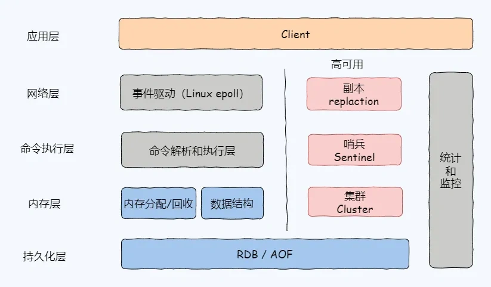

<font style="color:rgb(51, 51, 51);background-color:rgb(248, 246, 244);">图 1-10</font>

+ <font style="color:rgb(51, 51, 51);background-color:rgb(248, 246, 244);">Client 客户端，官方提供了 C 语言开发的客户端，可以发送命令，性能分析和测试等。</font>
+ <font style="color:rgb(51, 51, 51);background-color:rgb(248, 246, 244);">网络层事件驱动模型，基于 I/O 多路复用，封装了一个短小精悍的高性能 ae 库，全称是 a simple event-driven programming library。</font>
+ <font style="color:rgb(51, 51, 51);background-color:rgb(248, 246, 244);">在 ae 这个库里面，我通过 aeApiState 结构体对 epoll、select、kqueue、evport四种 I/O 多路复用的实现进行适配，让上层调用方感知不到在不同操作系统实现 I/O 多路复用的差异。</font>
+ <font style="color:rgb(51, 51, 51);background-color:rgb(248, 246, 244);">Redis 中的事件可以分两大类：一类是网络连接、读、写事件；另一类是时间事件，比如定时执行 rehash 、RDB 内存快照生成，过期键值对清理操作。</font>
+ <font style="color:rgb(51, 51, 51);background-color:rgb(248, 246, 244);">命令解析和执行层，负责执行客户端的各种命令，比如 SET、DEL、GET等。</font>
+ <font style="color:rgb(51, 51, 51);background-color:rgb(248, 246, 244);">内存分配和回收，为数据分配内存，提供不同的数据结构保存数据。</font>
+ <font style="color:rgb(51, 51, 51);background-color:rgb(248, 246, 244);">持久化层，提供了 RDB 内存快照文件 和 AOF 两种持久化策略，实现数据可靠性。</font>
+ <font style="color:rgb(51, 51, 51);background-color:rgb(248, 246, 244);">高可用模块，提供了副本、哨兵、集群实现高可用。</font>
+ <font style="color:rgb(51, 51, 51);background-color:rgb(248, 246, 244);">监控与统计，提供了一些监控工具和性能分析工具，比如监控内存使用、基准测试、内存碎片、bigkey 统计、慢指令查询等。</font>

### <font style="color:rgb(0, 0, 0);background-color:rgb(248, 246, 244);">数据存储原理</font>
<font style="color:rgb(51, 51, 51);background-color:rgb(248, 246, 244);">在掌握存储原理之前，先看一下全局架构图，后边慢慢分析他们的作用。</font>

<font style="color:rgb(51, 51, 51);background-color:rgb(248, 246, 244);">如图 1-11 是由 redisDb、dict、dictEntry、redisObejct 关系图：</font>

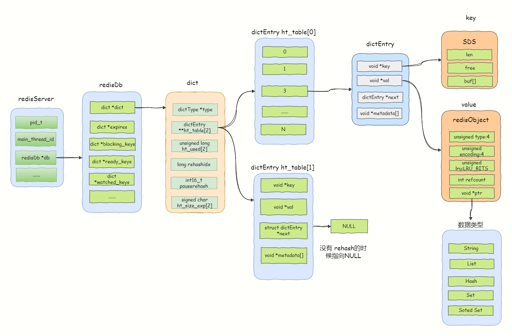

<font style="color:rgb(51, 51, 51);background-color:rgb(248, 246, 244);">图 1-11</font>

<font style="color:rgb(51, 51, 51);background-color:rgb(248, 246, 244);">redisServer</font>

<font style="color:rgb(51, 51, 51);background-color:rgb(248, 246, 244);">每个被启动的服务我都会抽象成一个 redisServer，源码定在server.h 的redisServer 结构体。结构体字段很多，不再一一列举，部分核心字段如下。</font>

```plain
truct redisServer {
    pid_t pid;  /* 主进程 pid. */
    pthread_t main_thread_id; /* 主线程 id */
    char *configfile;  /*redis.conf 文件绝对路径*/
    redisDb *db; /* 存储键值对数据的 redisDb 实例 */
      int dbnum;  /* DB 个数 */
    dict *commands; /* 当前实例能处理的命令表，key 是命令名，value 是执行命令的入口 */
    aeEventLoop *el;/* 事件循环处理 */
    int sentinel_mode;  /* true 则表示作为哨兵实例启动 */

      /* 网络相关 */
    int port;/* TCP 监听端口 */
    list *clients; /* 连接当前实例的客户端列表 */
    list *clients_to_close; /* 待关闭的客户端列表 */

    client *current_client; /* 当前执行命令的客户端*/
};
```

<font style="color:rgb(51, 51, 51);background-color:rgb(248, 246, 244);">这个结构体包含了存储键值对的数据库实例、redis.conf 文件路径、命令列表、加载的 Modules、网络监听、客户端列表、RDB AOF 加载信息、配置信息、RDB 持久化、主从复制、客户端缓存、数据结构压缩、pub/sub、Cluster、哨兵等一些列 Redis 实例运行的必要信息。</font>

<font style="color:rgb(51, 51, 51);background-color:rgb(248, 246, 244);">接下来我们分别看下他们之间的关系和作用。</font>

<font style="color:rgb(51, 51, 51);background-color:rgb(248, 246, 244);">redisDb</font>

<font style="color:rgb(51, 51, 51);background-color:rgb(248, 246, 244);">其中redisDb *db指针非常重要，它指向了一个长度为 dbnum（默认 16）的 redisDb 数组，它是整个存储的核心，我就是用这玩意来存储键值对。</font>

```plain
typedef struct redisDb {
    dict *dict;
    dict *expires;
    dict *blocking_keys;
    dict *ready_keys;
    dict *watched_keys;
    int id;
    long long avg_ttl;
    unsigned long expires_cursor;
    list *defrag_later;
    clusterSlotToKeyMapping *slots_to_keys;
} redisDb;
```

**<font style="color:rgb(34, 34, 34);background-color:rgb(248, 246, 244);">dict 和 expires</font>**

+ <font style="color:rgb(51, 51, 51);background-color:rgb(248, 246, 244);">dict 和 expires 是最重要的两个属性，底层数据结构是字典，分别用于存储键值对数据和 key 的过期时间。</font>
+ <font style="color:rgb(51, 51, 51);background-color:rgb(248, 246, 244);">expires，底层数据结构是 dict 字典，存储每个 key 的过期时间。</font>

<font style="color:rgb(51, 51, 51);background-color:rgb(248, 246, 244);">dict</font>

<font style="color:rgb(51, 51, 51);background-color:rgb(248, 246, 244);">Redis 使用 dict 结构来保存所有的键值对（key-value）数据，这是一个散列表，所以 key 查询时间复杂度是 O(1) 。</font>

```plain
struct dict {
    dictType *type;

    dictEntry **ht_table[2];
    unsigned long ht_used[2];

    long rehashidx;

    int16_t pauserehash;
    signed char ht_size_exp[2];
};
```

<font style="color:rgb(51, 51, 51);background-color:rgb(248, 246, 244);">dict 的结构体里，有 dictType *type，**ht_table[2]，long rehashidx 三个很重要的结构。</font>

+ <font style="color:rgb(51, 51, 51);background-color:rgb(248, 246, 244);">type 存储了 hash 函数，key 和 value 的复制等函数；</font>
+ <font style="color:rgb(51, 51, 51);background-color:rgb(248, 246, 244);">ht_table[2]，长度为 2 的数组，默认使用 ht_table[0] 存储键值对数据。我会使用 ht_table[1] 来配合实现渐进式 reahsh 操作。</font>
+ <font style="color:rgb(51, 51, 51);background-color:rgb(248, 246, 244);">rehashidx 是一个整数值，用于标记是否正在执行 rehash 操作，-1 表示没有进行 rehash。如果正在执行 rehash，那么其值表示当前 rehash 操作执行的 ht_table[1] 中的 dictEntry 数组的索引。</font>

**<font style="color:rgb(34, 34, 34);background-color:rgb(248, 246, 244);">重点关注 ht_table 数组，数组每个位置叫做哈希桶，就是这玩意保存了所有键值对，每个哈希桶的类型是 dictEntry。</font>**

<font style="color:rgb(51, 51, 51);background-color:rgb(248, 246, 244);">**</font>

<font style="color:rgb(51, 51, 51);background-color:rgb(248, 246, 244);">MySQL：“Redis 支持那么多的数据类型，哈希桶咋保存？”</font>

<font style="color:rgb(51, 51, 51);background-color:rgb(248, 246, 244);">他的玄机就在 dictEntry 中，每个 dict 有两个 ht_table，用于存储键值对数据和实现渐进式 rehash。</font>

<font style="color:rgb(51, 51, 51);background-color:rgb(248, 246, 244);">dictEntry 结构如下。</font>

```cpp
typedef struct dictEntry {
    void *key;
    union {
       // 指向实际 value 的指针
        void *val;
        uint64_t u64;
        int64_t s64;
        double d;
    } v;
    // 散列表冲突生成的链表
    struct dictEntry *next;
    void *metadata[];
} dictEntry;
```

+ <font style="color:rgb(51, 51, 51);background-color:rgb(248, 246, 244);">*key 指向键值对的键的指针，指向一个 sds 对象，key 都是 string 类型。</font>
+ <font style="color:rgb(51, 51, 51);background-color:rgb(248, 246, 244);">v 是键值对的 value 值，是个 union（联合体），当它的值是 uint64_t、int64_t 或 double 数字类型时，就不再需要额外的存储，这有利于减少内存碎片。（为了节省内存操碎了心）当值为非数字类型，就是用 val 指针存储。</font>
+ <font style="color:rgb(51, 51, 51);background-color:rgb(248, 246, 244);">*next指向另一个 dictEntry 结构， 多个 dictEntry 可以通过 next 指针串连成链表， 从这里可以看出， ht_table 使用链地址法来处理键碰撞：</font><font style="color:rgb(51, 51, 51);background-color:rgb(248, 246, 244);"> </font>**<font style="color:rgb(34, 34, 34);background-color:rgb(248, 246, 244);">当多个不同的键拥有相同的哈希值时，哈希表用一个链表将这些键连接起来。</font>**

<font style="color:rgb(51, 51, 51);background-color:rgb(248, 246, 244);">redisObject</font>

<font style="color:rgb(51, 51, 51);background-color:rgb(248, 246, 244);">dictEntry 的 *val 指针指向的值实际上是一个 redisObject 结构体，这是一个非常重要的结构体。</font>

<font style="color:rgb(51, 51, 51);background-color:rgb(248, 246, 244);">我的 key 是字符串类型，而 value 可以是 String、Lists、Set、Sorted Set、Hashes 等数据类型。</font>

<font style="color:rgb(51, 51, 51);background-color:rgb(248, 246, 244);">键值对的值都被包装成 redisObject 对象， redisObject 在 server.h 中定义。</font>

```verilog
typedef struct redisObject {
    unsigned type:4;
    unsigned encoding:4;
    unsigned lru:LRU_BITS;
    int refcount;
    void *ptr;
} robj;
```

+ **<font style="color:rgb(34, 34, 34);background-color:rgb(248, 246, 244);">type</font>**<font style="color:rgb(51, 51, 51);background-color:rgb(248, 246, 244);">： 记录了对象的类型，string、set、hash 、Lis、Sorted Set 等，根据该类型来确定是哪种数据类型，这样我才知道该使用什么指令执行嘛。</font>
+ **<font style="color:rgb(34, 34, 34);background-color:rgb(248, 246, 244);">encoding</font>**<font style="color:rgb(51, 51, 51);background-color:rgb(248, 246, 244);">：编码方式，</font>**<font style="color:rgb(34, 34, 34);background-color:rgb(248, 246, 244);">表示 ptr 指向的数据类型具体数据结构，即这个对象使用了什么数据结构作为底层实现</font>**<font style="color:rgb(51, 51, 51);background-color:rgb(248, 246, 244);">保存数据。</font>**<font style="color:rgb(34, 34, 34);background-color:rgb(248, 246, 244);">同一个对象使用不同编码内存占用存在明显差异，节省内存，这玩意功不可没。</font>**
+ **<font style="color:rgb(34, 34, 34);background-color:rgb(248, 246, 244);">lru:LRU_BITS</font>**<font style="color:rgb(51, 51, 51);background-color:rgb(248, 246, 244);">：LRU 策略下对象最后一次被访问的时间，如果是 LFU 策略，那么低 8 位表示访问频率，高 16 位表示访问时间。</font>
+ **<font style="color:rgb(34, 34, 34);background-color:rgb(248, 246, 244);">refcount</font>**<font style="color:rgb(51, 51, 51);background-color:rgb(248, 246, 244);"> </font><font style="color:rgb(51, 51, 51);background-color:rgb(248, 246, 244);">：表示引用计数，由于 C 语言并不具备内存回收功能，所以 Redis 在自己的对象系统中添加了这个属性，当一个对象的引用计数为 0 时，则表示该对象已经不被任何对象引用，则可以进行垃圾回收了。</font>
+ **<font style="color:rgb(34, 34, 34);background-color:rgb(248, 246, 244);">ptr 指针</font>**<font style="color:rgb(51, 51, 51);background-color:rgb(248, 246, 244);">：指向</font>**<font style="color:rgb(34, 34, 34);background-color:rgb(248, 246, 244);">值的指针</font>**<font style="color:rgb(51, 51, 51);background-color:rgb(248, 246, 244);">，对象的底层实现数据结构。</font>

## <font style="color:rgb(0, 0, 0);background-color:rgb(248, 246, 244);">数据类型底层数据结构</font>
<font style="color:rgb(51, 51, 51);background-color:rgb(248, 246, 244);">我是 Redis，给开发者提供了 String（字符串）、Hashes（散列表）、Lists（列表）、Sets（无序集合）、Sorted Sets（可根据范围查询的排序集合）、Bitmap（位图）、HyperLogLog、Geospatial （地理空间）和 Stream（流）等数据类型。</font>

**<font style="color:rgb(34, 34, 34);background-color:rgb(248, 246, 244);">数据类型的使用技法和以及每种数据类型底层实现原理是你核心筑基必经之路，好好修炼。</font>**

<font style="color:rgb(51, 51, 51);background-color:rgb(248, 246, 244);">五种基本数据类型 String、List、Set、Zset、Hash。数据类型与底层数据结构的关系如下所示。</font>

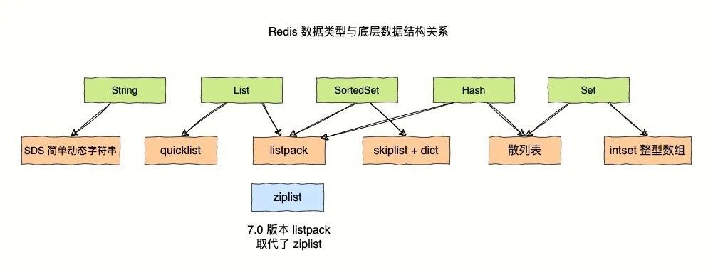

### <font style="color:rgb(0, 0, 0);background-color:rgb(248, 246, 244);">String 字符串</font>
<font style="color:rgb(51, 51, 51);background-color:rgb(248, 246, 244);">我并没有直接使用 C 语言的字符串，而是自己搞了一个 SDS 结构体来表示字符串。SDS 的全称是 Simple Dynamic String，中文叫做“简单动态字符串”。</font>

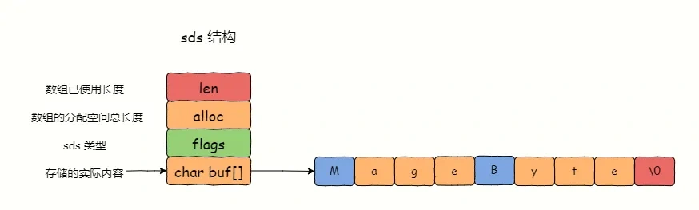

**<font style="color:rgb(34, 34, 34);background-color:rgb(248, 246, 244);">O(1) 时间复杂度获取字符串长度</font>**

<font style="color:rgb(51, 51, 51);background-color:rgb(248, 246, 244);">SDS 中 len 保存了字符串的长度，实现了**O(1) 时间复杂度获取字符串长度。</font>

**<font style="color:rgb(34, 34, 34);background-color:rgb(248, 246, 244);">二进制安全</font>**

<font style="color:rgb(51, 51, 51);background-color:rgb(248, 246, 244);">SDS 不仅可以存储 String 类型数据，还能存储二进制数据。SDS 并不是通过“\0” 来判断字符串结束，用的是 len 标志结束，所以可以直接将二进制数据存储。</font>

**<font style="color:rgb(34, 34, 34);background-color:rgb(248, 246, 244);">空间预分配</font>**

<font style="color:rgb(51, 51, 51);background-color:rgb(248, 246, 244);">在需要对 SDS 的空间进行扩容时，不仅仅分配所需的空间，还会分配额外的未使用空间。</font>

**<font style="color:rgb(34, 34, 34);background-color:rgb(248, 246, 244);">通过预分配策略，减少了执行字符串增长所需的内存重新分配次数，降低由于字符串增加操作的性能损耗。</font>**

**<font style="color:rgb(34, 34, 34);background-color:rgb(248, 246, 244);">惰性空间释放</font>**

<font style="color:rgb(51, 51, 51);background-color:rgb(248, 246, 244);">当对 SDS 进行缩短操作时，程序并不会回收多余的内存空间，如果后面需要 append 追加操作，则直接使用 buf 数组 alloc - len中未使用的空间。</font>

**<font style="color:rgb(34, 34, 34);background-color:rgb(248, 246, 244);">通过惰性空间释放策略，避免了减小字符串所需的内存重新分配操作，为未来增长操作提供了优化。</font>**

### <font style="color:rgb(0, 0, 0);background-color:rgb(248, 246, 244);">Lists（列表）</font>
<font style="color:rgb(51, 51, 51);background-color:rgb(248, 246, 244);">在 C 语言中，并没有现成的链表结构，所以 antirez 为我专门设计了一套实现方式。</font>

<font style="color:rgb(51, 51, 51);background-color:rgb(248, 246, 244);">关于 List 类型的底层数据结构，可谓英雄辈出，antirez 大佬一直在优化，创造了多种数据结构来保存。</font>

<font style="color:rgb(51, 51, 51);background-color:rgb(248, 246, 244);">从一开始早期版本使用 **linkedlist（双端列表）**和 **ziplist（压缩列表）**作为 List 的底层实现，到 Redis 3.2 引入了由 linkedlist + ziplist 组成的</font><font style="color:rgb(51, 51, 51);background-color:rgb(248, 246, 244);"> </font>**<font style="color:rgb(34, 34, 34);background-color:rgb(248, 246, 244);">quicklist</font>**<font style="color:rgb(51, 51, 51);background-color:rgb(248, 246, 244);">，再到 7.0 版本的时候使用</font><font style="color:rgb(51, 51, 51);background-color:rgb(248, 246, 244);"> </font>**<font style="color:rgb(34, 34, 34);background-color:rgb(248, 246, 244);">listpack</font>**<font style="color:rgb(51, 51, 51);background-color:rgb(248, 246, 244);"> </font><font style="color:rgb(51, 51, 51);background-color:rgb(248, 246, 244);">取代</font><font style="color:rgb(51, 51, 51);background-color:rgb(248, 246, 244);"> </font>**<font style="color:rgb(34, 34, 34);background-color:rgb(248, 246, 244);">ziplist</font>**<font style="color:rgb(51, 51, 51);background-color:rgb(248, 246, 244);">。</font>

<font style="color:rgb(51, 51, 51);background-color:rgb(248, 246, 244);">linkedlist</font>

<font style="color:rgb(51, 51, 51);background-color:rgb(248, 246, 244);">在 Redis 3.2 版本之前，List 的底层数据结构由 linkedlist 或者 ziplist 实现，优先使用 ziplist 存储。</font>

**<font style="color:rgb(34, 34, 34);background-color:rgb(248, 246, 244);">当列表对象满足以下两个条件的时候，List 将使用 ziplist 存储，否则使用 linkedlist。</font>**

+ **<font style="color:rgb(34, 34, 34);background-color:rgb(248, 246, 244);">List 的每个元素的占用的字节小于 64 字节。</font>**
+ **<font style="color:rgb(34, 34, 34);background-color:rgb(248, 246, 244);">List 的元素数量小于 512 个。</font>**

<font style="color:rgb(51, 51, 51);background-color:rgb(248, 246, 244);">linkedlist 的结构如图 2-5 所示。</font>

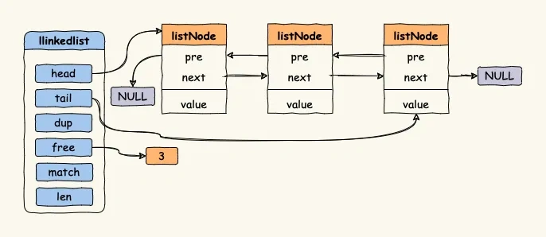

<font style="color:rgb(51, 51, 51);background-color:rgb(248, 246, 244);">Redis 的链表实现的特性总结如下。</font>

+ <font style="color:rgb(51, 51, 51);background-color:rgb(248, 246, 244);">双端：链表节点带有 prev 和 next 指针，获取某个节点的前置节点和后继节点的复杂度都是 O(1)。</font>
+ <font style="color:rgb(51, 51, 51);background-color:rgb(248, 246, 244);">无环：表头节点的 prev 指针和尾节点的 next 指针都指向 NULL，对链表的访问以 NULL 为结束。</font>
+ <font style="color:rgb(51, 51, 51);background-color:rgb(248, 246, 244);">带表头指针和表尾指针：通过 list 结构的 head 指针和 tail 指针，程序获取链表的头节点和尾节点的复杂度为 O(1)。</font>
+ <font style="color:rgb(51, 51, 51);background-color:rgb(248, 246, 244);">使用 list 结构的 len 属性来对记录节点数量，获取链表中节点数量的复杂度为 O(1)。</font>

<font style="color:rgb(51, 51, 51);background-color:rgb(248, 246, 244);">ziplist（压缩列表）</font>

<font style="color:rgb(51, 51, 51);background-color:rgb(248, 246, 244);">MySQL：为啥还设计了 ziplist 呢？</font>

+ <font style="color:rgb(51, 51, 51);background-color:rgb(248, 246, 244);">普通的 linkedlist 有 prev、next 两个指针，</font>**<font style="color:rgb(34, 34, 34);background-color:rgb(248, 246, 244);">当存储数据很小的情况下，指针占用的空间会超过数据占用的空间</font>**<font style="color:rgb(51, 51, 51);background-color:rgb(248, 246, 244);">，这就离谱了，是可忍孰不可忍。</font>
+ <font style="color:rgb(51, 51, 51);background-color:rgb(248, 246, 244);">linkedlist 是链表结构，在内存中不是连续的，遍历的效率低下。</font>

<font style="color:rgb(51, 51, 51);background-color:rgb(248, 246, 244);">为了解决上面两个问题，antirez 创造了 ziplist 压缩列表，是一种内存紧凑的数据结构，占用一块连续的内存空间，提升内存使用率。</font>

**<font style="color:rgb(34, 34, 34);background-color:rgb(248, 246, 244);">当一个列表只有少量数据的时候，并且每个列表项要么是小整数值，要么就是长度比较短的字符串，那么我就会使用 ziplist 来做 List 的底层实现。</font>**

<font style="color:rgb(51, 51, 51);background-color:rgb(248, 246, 244);">ziplist 中可以包含多个 entry 节点，每个</font>**<font style="color:rgb(34, 34, 34);background-color:rgb(248, 246, 244);">节点可以存放整数或者字符串</font>**<font style="color:rgb(51, 51, 51);background-color:rgb(248, 246, 244);">，结构如图 2-6 所示。</font>

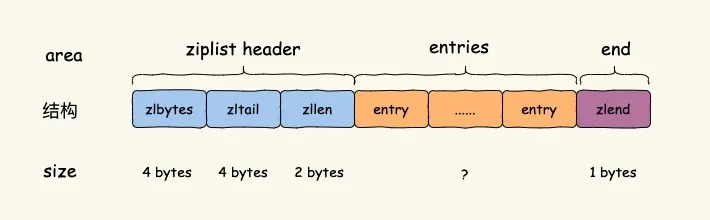

<font style="color:rgb(51, 51, 51);background-color:rgb(248, 246, 244);">图 2-6</font>

+ <font style="color:rgb(51, 51, 51);background-color:rgb(248, 246, 244);">zlbytes，占用 4 个字节，记录了整个 ziplist 占用的总字节数。</font>
+ <font style="color:rgb(51, 51, 51);background-color:rgb(248, 246, 244);">zltail，占用 4 个字节，指向最后一个 entry 偏移量，用于快速定位最后一个 entry。</font>
+ <font style="color:rgb(51, 51, 51);background-color:rgb(248, 246, 244);">zllen，占用 2 字节，记录 entry 总数。</font>
+ <font style="color:rgb(51, 51, 51);background-color:rgb(248, 246, 244);">entry，列表元素。</font>
+ <font style="color:rgb(51, 51, 51);background-color:rgb(248, 246, 244);">zlend，ziplist 结束标志，占用 1 字节，值等于 255。</font>

**<font style="color:rgb(34, 34, 34);background-color:rgb(248, 246, 244);">连锁更新</font>**

<font style="color:rgb(51, 51, 51);background-color:rgb(248, 246, 244);">每个 entry 都用 prevlen 记录了上一个 entry 的长度，从当前 entry B 前面插入一个新的 entry A 时，会导致 B 的 prevlen 改变，也会导致 entry B 大小发生变化。entry B 后一个 entry C 的 prevlen 也需要改变。以此类推，就可能造成了连锁更新。</font>

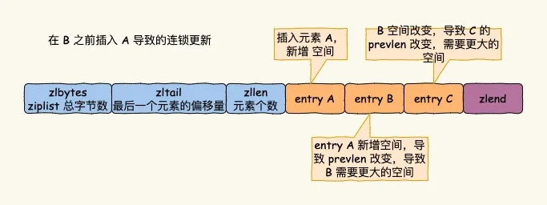

<font style="color:rgb(51, 51, 51);background-color:rgb(248, 246, 244);">图 2-8</font>

<font style="color:rgb(51, 51, 51);background-color:rgb(248, 246, 244);">连锁更新会导致 ziplist 的内存空间需要多次重新分配，直接影响 ziplist 的查询性能。于是乎在 Redis 3.2 版本引入了 quicklist。</font>

<font style="color:rgb(51, 51, 51);background-color:rgb(248, 246, 244);">quicklist</font>

<font style="color:rgb(51, 51, 51);background-color:rgb(248, 246, 244);">quicklist 是综合考虑了时间效率与空间效率引入的新型数据结构。</font>**<font style="color:rgb(34, 34, 34);background-color:rgb(248, 246, 244);">结合了原先 linkedlist 与 ziplist 各自的优势，本质还是一个链表，只不过链表的每个节点是一个 ziplist。</font>**

<font style="color:rgb(51, 51, 51);background-color:rgb(248, 246, 244);">结合 quicklist 和 quicklistNode定义，quicklist 链表结构如下图所示。</font>

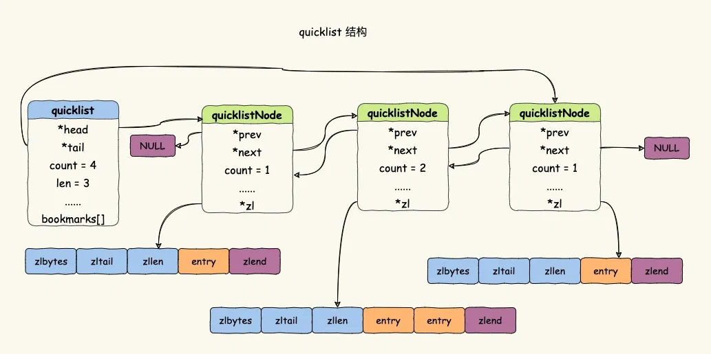

<font style="color:rgb(51, 51, 51);background-color:rgb(248, 246, 244);">MySQL：“搞了半天还是没能解决连锁更新的问题嘛”</font>

<font style="color:rgb(51, 51, 51);background-color:rgb(248, 246, 244);">别急，饭要一口口吃，路要一步步走，步子迈大了容易扯着蛋。</font>

<font style="color:rgb(51, 51, 51);background-color:rgb(248, 246, 244);">毕竟还是使用了 ziplist，本质上无法避免连锁更新的问题，于是乎在 5.0 版本设计出另一个内存紧凑型数据结构 listpack，于 7.0 版本替换掉 ziplist。</font>

<font style="color:rgb(51, 51, 51);background-color:rgb(248, 246, 244);">listpack</font>

<font style="color:rgb(51, 51, 51);background-color:rgb(248, 246, 244);">MySQL：“listpack 是啥？”</font>

**<font style="color:rgb(34, 34, 34);background-color:rgb(248, 246, 244);">listpack 也是一种紧凑型数据结构，用一块连续的内存空间来保存数据，并且使用多种编码方式来表示不同长度的数据来节省内存空间。</font>**

<font style="color:rgb(51, 51, 51);background-color:rgb(248, 246, 244);">先看 listpack 的整体结构。</font>

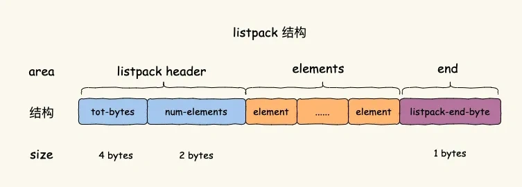

<font style="color:rgb(51, 51, 51);background-color:rgb(248, 246, 244);">图 2-10</font>

<font style="color:rgb(51, 51, 51);background-color:rgb(248, 246, 244);">一共四部分组成，tot-bytes、num-elements、elements、listpack-end-byte。</font>

+ <font style="color:rgb(51, 51, 51);background-color:rgb(248, 246, 244);">tot-bytes，也就是 total bytes，占用 4 字节，记录 listpack 占用的总字节数。</font>
+ <font style="color:rgb(51, 51, 51);background-color:rgb(248, 246, 244);">num-elements，占用 2 字节，记录 listpack elements 元素个数。</font>
+ <font style="color:rgb(51, 51, 51);background-color:rgb(248, 246, 244);">elements，listpack 元素，保存数据的部分。</font>
+ <font style="color:rgb(51, 51, 51);background-color:rgb(248, 246, 244);">listpack-end-byte，结束标志，占用 1 字节，值固定为 255。</font>

<font style="color:rgb(51, 51, 51);background-color:rgb(248, 246, 244);">MySQL：“好家伙，这跟 ziplist 有啥区别？别以为换了个名字，换个马甲我就不认识了”</font>

<font style="color:rgb(51, 51, 51);background-color:rgb(248, 246, 244);">听我说完！确实有点像，listpack 也是由元数据和数据自身组成。最大的区别是 elements 部分，为了解决 ziplist 连锁更新的问题，element</font><font style="color:rgb(51, 51, 51);background-color:rgb(248, 246, 244);"> </font>**<font style="color:rgb(34, 34, 34);background-color:rgb(248, 246, 244);">不再像 ziplist 的 entry 保存前一项的长度</font>**<font style="color:rgb(51, 51, 51);background-color:rgb(248, 246, 244);">。</font>

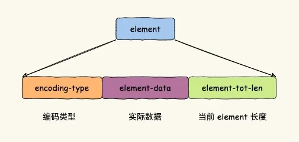

### <font style="color:rgb(0, 0, 0);background-color:rgb(248, 246, 244);">Sets（无序集合）</font>
<font style="color:rgb(51, 51, 51);background-color:rgb(248, 246, 244);">Sets 是 String 类型的无序集合，集合中的元素是唯一的，集合中</font>**<font style="color:rgb(34, 34, 34);background-color:rgb(248, 246, 244);">不会出现重复的数据</font>**<font style="color:rgb(51, 51, 51);background-color:rgb(248, 246, 244);">。</font>

<font style="color:rgb(51, 51, 51);background-color:rgb(248, 246, 244);">Java 的 HashSet 底层是用 HashMap 实现，Sets 的底层数据结构也是用 Hashtable（散列表）实现，散列表的 key 存的是 Sets 集合元素的 value，散列表的 value 则指向 NULL。。</font>

<font style="color:rgb(51, 51, 51);background-color:rgb(248, 246, 244);">不同的是，当元素内容都是 64 位以内的十进制整数的时候，并且元素个数不超过 set-max-intset-entries 配置的值（默认 512）的时候，会使用更加省内存的 intset（整形数组）来存储。</font>

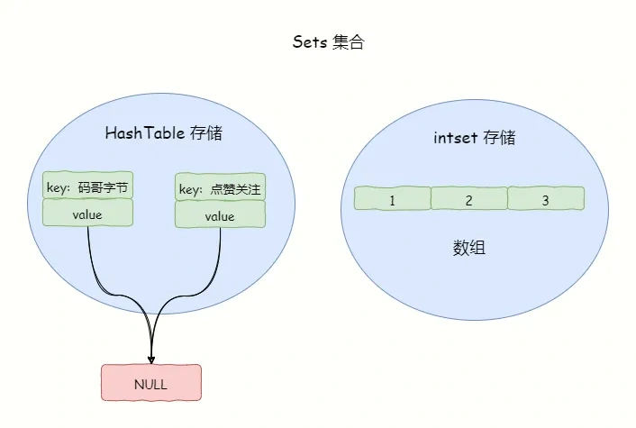

<font style="color:rgb(51, 51, 51);background-color:rgb(248, 246, 244);">图 2-15</font>

<font style="color:rgb(51, 51, 51);background-color:rgb(248, 246, 244);">关于散列表结构我会在专门的章节介绍，先看 intset 结构，结构体定义在源码 intset.h中。</font>

```plain
typedef struct intset {
    uint32_t encoding;
    uint32_t length;
    int8_t contents[];
} intset;
```

+ <font style="color:rgb(51, 51, 51);background-color:rgb(248, 246, 244);">length，记录整数集合存储的元素个数，其实就是 contents 数组的长度。</font>
+ <font style="color:rgb(51, 51, 51);background-color:rgb(248, 246, 244);">contents，真正存储整数集合的数组，是一块连续内存区域。每个元素都是数组的一个数组元素，数组中的元素会按照值的大小从小到大有序排列存储，并且不会有重复元素。</font>
+ <font style="color:rgb(51, 51, 51);background-color:rgb(248, 246, 244);">encoding，编码格式，决定数组类型，一共有三种不同的值。</font>

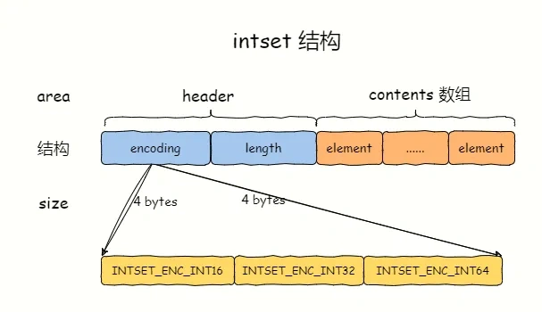

### <font style="color:rgb(0, 0, 0);background-color:rgb(248, 246, 244);">Hash（散列表）</font>
<font style="color:rgb(51, 51, 51);background-color:rgb(248, 246, 244);">Redis Hash（散列表）是一种 field-value pairs（键值对）集合类型，类似于 Python 中的字典、Java 中的 HashMap。</font>

<font style="color:rgb(51, 51, 51);background-color:rgb(248, 246, 244);">Redis 的散列表 dict 由</font>**<font style="color:rgb(34, 34, 34);background-color:rgb(248, 246, 244);">数组 + 链表</font>**<font style="color:rgb(51, 51, 51);background-color:rgb(248, 246, 244);">构成，数组的每个元素占用的槽位叫做</font>**<font style="color:rgb(34, 34, 34);background-color:rgb(248, 246, 244);">哈希桶</font>**<font style="color:rgb(51, 51, 51);background-color:rgb(248, 246, 244);">，当出现散列冲突的时候就会在这个桶下挂一个链表，用“</font>**<font style="color:rgb(34, 34, 34);background-color:rgb(248, 246, 244);">拉链法”解决散列冲突的问题</font>**<font style="color:rgb(51, 51, 51);background-color:rgb(248, 246, 244);">。</font>

<font style="color:rgb(51, 51, 51);background-color:rgb(248, 246, 244);">简单地说就是将一个 key 经过散列计算均匀的映射到散列表上。</font>

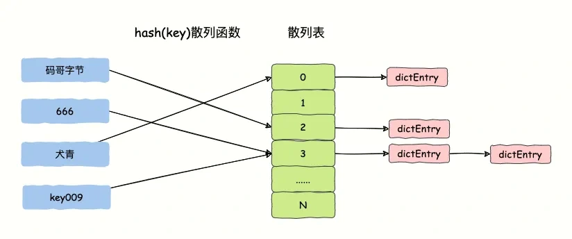

<font style="color:rgb(51, 51, 51);background-color:rgb(248, 246, 244);">图 2-18</font>

<font style="color:rgb(51, 51, 51);background-color:rgb(248, 246, 244);">Hashes 数据类型底层存储数据结构实际上有两种。</font>

1. <font style="color:rgb(51, 51, 51);background-color:rgb(248, 246, 244);">dict 结构。</font>
2. <font style="color:rgb(51, 51, 51);background-color:rgb(248, 246, 244);">在 7.0 版本之前使用 ziplist，之后被 listpack 代替。</font>

<font style="color:rgb(51, 51, 51);background-color:rgb(248, 246, 244);">listpack 数据结构在之前的已经介绍过， 接下来带你揭秘 dict 到底长啥样。</font>

**<font style="color:rgb(34, 34, 34);background-color:rgb(248, 246, 244);">Redis 数据库就是一个全局散列表</font>**<font style="color:rgb(51, 51, 51);background-color:rgb(248, 246, 244);">。正常情况下，我只会使用 ht_table[0]散列表，图 2-20 是一个没有进行 rehash 状态下的字典。</font>

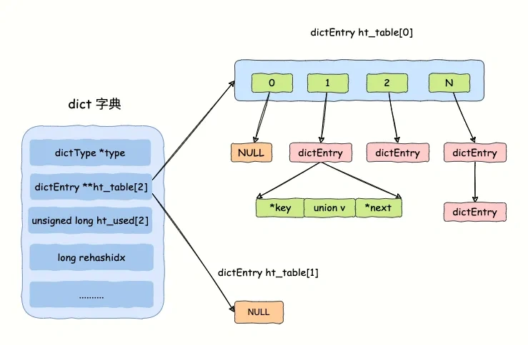

<font style="color:rgb(51, 51, 51);background-color:rgb(248, 246, 244);">图 2-20</font>

+ <font style="color:rgb(51, 51, 51);background-color:rgb(248, 246, 244);">dictType *type，存放函数的结构体，定义了一些函数指针，可以通过设置自定义函数，实现 dict 的 key 和 value 存放任何类型的数据。</font>
+ <font style="color:rgb(51, 51, 51);background-color:rgb(248, 246, 244);">重点看 dictEntry **ht_table[2]，存放了两个 dictEntry 的二级指针，指针分别指向了一个 dictEntry 指针的数组。</font>
+ <font style="color:rgb(51, 51, 51);background-color:rgb(248, 246, 244);">ht_used[2]，记录每个散列表使用了多少槽位（比如数组长度 32，使用了 12）。</font>
+ <font style="color:rgb(51, 51, 51);background-color:rgb(248, 246, 244);">rehashidx，用于标记是否正在执行 rehash 操作，-1 表示没有进行 rehash。如果正在执行 rehash，那么其值表示当前 rehash 操作执行的 ht_table[0] 散列表 dictEntry 数组的索引。</font>
+ <font style="color:rgb(51, 51, 51);background-color:rgb(248, 246, 244);">pauserehash 表示 rehash 的状态，大于 0 时表示 rehash 暂停了，小于 0 表示出错了。</font>

### <font style="color:rgb(0, 0, 0);background-color:rgb(248, 246, 244);">Sorted Sets（有序集合）</font>
<font style="color:rgb(51, 51, 51);background-color:rgb(248, 246, 244);">Sorted Sets 与 Sets 类似，是一种集合类型，集合中</font>**<font style="color:rgb(34, 34, 34);background-color:rgb(248, 246, 244);">不会出现重复的数据（member）</font>**<font style="color:rgb(51, 51, 51);background-color:rgb(248, 246, 244);">。区别在于 Sorted Sets 元素由两部分组成，分别是 member 和 score。member 会关联一个 double 类型的分数（score），sorted sets 默认会根据这个 score 对 member 进行从小到大的排序，如果 member 关联的分数 score 相同，则按照字符串的字典顺序排序。</font>

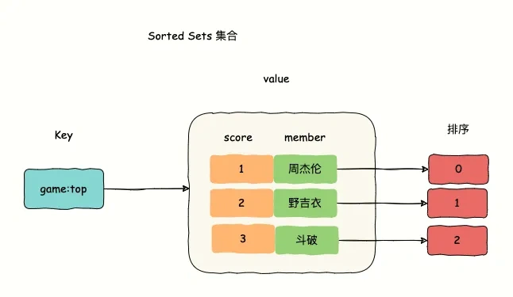

<font style="color:rgb(51, 51, 51);background-color:rgb(248, 246, 244);">图 2-24</font>

<font style="color:rgb(51, 51, 51);background-color:rgb(248, 246, 244);">常见的使用场景：</font>

+ <font style="color:rgb(51, 51, 51);background-color:rgb(248, 246, 244);">排行榜，比如维护大型在线游戏中根据分数排名的 Top 10 有序列表。</font>
+ <font style="color:rgb(51, 51, 51);background-color:rgb(248, 246, 244);">速率限流器，根据排序集合构建滑动窗口速率限制器。</font>
+ <font style="color:rgb(51, 51, 51);background-color:rgb(248, 246, 244);">延迟队列，score 存储过期时间，从小到大排序，最靠前的就是最先到期的数据。</font>

<font style="color:rgb(51, 51, 51);background-color:rgb(248, 246, 244);">Sorted Sets 底层有两种方式来存储数据。</font>

+ <font style="color:rgb(51, 51, 51);background-color:rgb(248, 246, 244);">在 7.0 版本之前是 ziplist，之后被 listpack 代替，使用条件是集合元素个数小于等于 zset-max-listpack-entries 配置值（默认 128），且 member 占用字节大小小于 zset-max-listpack-value 配置值（默认 64）时使用 listpack 存储，member 和 score 紧凑排列作为 listpack 的一个元素进行存储。</font>
+ <font style="color:rgb(51, 51, 51);background-color:rgb(248, 246, 244);">不满足上述条件，使用 skiplist + dict（散列表） 组合方式存储，数据会插入 skiplist 的同时也会向 dict（散列表）中插入数据 ，是一种用空间换时间的思路。散列表的 key 存放的是元素的 member，value 存储的是 member 关联的 score。</font>

<font style="color:rgb(51, 51, 51);background-color:rgb(248, 246, 244);">skiplist + dict</font>

<font style="color:rgb(51, 51, 51);background-color:rgb(248, 246, 244);">MySQL：“说说什么是跳表吧”</font>

<font style="color:rgb(51, 51, 51);background-color:rgb(248, 246, 244);">实质就是</font>**<font style="color:rgb(34, 34, 34);background-color:rgb(248, 246, 244);">一种可以进行二分查找的有序链表</font>**<font style="color:rgb(51, 51, 51);background-color:rgb(248, 246, 244);">。跳表在原有的有序链表上面增加了多级索引，通过索引来实现快速查找。</font>

<font style="color:rgb(51, 51, 51);background-color:rgb(248, 246, 244);">查找数据总是从最高层开始比较，如果节点保存的值比待查数据小，跳表就继续访问该层的下一个节点；</font>

<font style="color:rgb(51, 51, 51);background-color:rgb(248, 246, 244);">如果碰到比待查数据值大的节点时，那就跳到当前节点的下一层的链表继续查找。</font>

<font style="color:rgb(51, 51, 51);background-color:rgb(248, 246, 244);">比如现在想查找 17，查找的路径如下图红色指向的方向进行。</font>

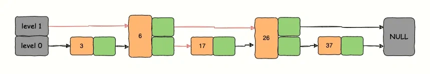

<font style="color:rgb(51, 51, 51);background-color:rgb(248, 246, 244);">图 2-27</font>

+ <font style="color:rgb(51, 51, 51);background-color:rgb(248, 246, 244);">从 level 1 开始，17 与 6 比较，值大于节点，继续与下一个节点比较。</font>
+ <font style="color:rgb(51, 51, 51);background-color:rgb(248, 246, 244);">与 26 比较，17 < 26，回到原节点，跳到当前节点的 level 0 层链表，与下一个节点比较，找到目标 17。</font>

<font style="color:rgb(51, 51, 51);background-color:rgb(248, 246, 244);">MySQL：采用 listpack 存储数据的 Sorted Sets 怎么实现呢？</font>

<font style="color:rgb(51, 51, 51);background-color:rgb(248, 246, 244);">我们知道，listpack 是一块由多个数据项组成的连续内存。而 sorted set 每一项元素是由 member 和 score 两部分组成。</font>

<font style="color:rgb(51, 51, 51);background-color:rgb(248, 246, 244);">采用 listpack 存储插入一个（member、score）数据对的时候，每个 member/score 数据对紧凑排列存储。</font>

<font style="color:rgb(51, 51, 51);background-color:rgb(248, 246, 244);">listpack 最大的优势就是节省内存，查找元素的话只能按顺序查找，时间复杂度是 O(n)。</font>

<font style="color:rgb(51, 51, 51);background-color:rgb(248, 246, 244);">正是如此，在少量数据的情况下，才能做到既能节省内存，又不会影响性能。</font>

<font style="color:rgb(51, 51, 51);background-color:rgb(248, 246, 244);">每一步查找前进两个数据项，也就是跨越一个 member/score 数据对。</font>


<font style="color:rgb(51, 51, 51);background-color:rgb(248, 246, 244);">图 2-30</font>

### <font style="color:rgb(0, 0, 0);background-color:rgb(248, 246, 244);">streams（流）</font>
<font style="color:rgb(51, 51, 51);background-color:rgb(248, 246, 244);">Stream 是 Redis 5.0 版本专门为消息队列设计的数据类型，</font>**<font style="color:rgb(34, 34, 34);background-color:rgb(248, 246, 244);">借鉴了 Kafka 的 Consume Group 设计思路，提供了消费组概念</font>**<font style="color:rgb(51, 51, 51);background-color:rgb(248, 246, 244);">。</font>

**<font style="color:rgb(34, 34, 34);background-color:rgb(248, 246, 244);">同时提供了消息的持久化和主从复制机制，客户端可以访问任何时刻的数据，并且能记住每一个客户端的访问位置，从而保证消息不丢失。</font>**

<font style="color:rgb(51, 51, 51);background-color:rgb(248, 246, 244);">以下几个是 Stream 类型的主要特性。</font>

+ <font style="color:rgb(51, 51, 51);background-color:rgb(248, 246, 244);">使用</font><font style="color:rgb(51, 51, 51);background-color:rgb(248, 246, 244);"> </font>**<font style="color:rgb(34, 34, 34);background-color:rgb(248, 246, 244);">Radix Tree 和 listpack</font>**<font style="color:rgb(51, 51, 51);background-color:rgb(248, 246, 244);"> </font><font style="color:rgb(51, 51, 51);background-color:rgb(248, 246, 244);">结构来存储消息。</font>
+ <font style="color:rgb(51, 51, 51);background-color:rgb(248, 246, 244);">消息 ID 序列化生成。</font>
+ <font style="color:rgb(51, 51, 51);background-color:rgb(248, 246, 244);">借鉴 Kafka Consume Group 的概念，多个消费者划分到不同的 Consume Group 中，消费同一个 Streams，同一个 Consume Group 的多个消费者可以一起并行但不重复消费，提升消费能力。</font>
+ <font style="color:rgb(51, 51, 51);background-color:rgb(248, 246, 244);">支持多播（多对多），阻塞和非阻塞读取。</font>
+ <font style="color:rgb(51, 51, 51);background-color:rgb(248, 246, 244);">ACK 确认机制，保证了消息至少被消费一次。</font>
+ <font style="color:rgb(51, 51, 51);background-color:rgb(248, 246, 244);">可设置消息保存上限阈值，我会把历史消息丢弃，防止内存占用过大。</font>

**<font style="color:rgb(34, 34, 34);background-color:rgb(248, 246, 244);">Stream 流就像是一个仅追加内容的消息链表，把消息一个个串起来，每个消息都有一个唯一的 ID 和消息内容，消息内容则由多个 field/value 键值对组成</font>**<font style="color:rgb(51, 51, 51);background-color:rgb(248, 246, 244);">。底层使用 Radix Tree 和 listpack 数据结构存储数据。</font>

<font style="color:rgb(51, 51, 51);background-color:rgb(248, 246, 244);">为了便于理解，我画了一张图，并对 Radix Tree 的存储数据做了下变形，使用列表来体现 Stream 中消息的逻辑有序性。</font>

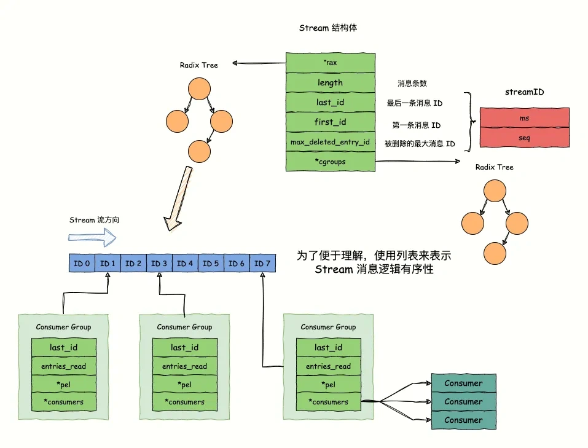

### <font style="color:rgb(0, 0, 0);background-color:rgb(248, 246, 244);">Geo（地理空间）</font>
<font style="color:rgb(51, 51, 51);background-color:rgb(248, 246, 244);">Redis 老兄，产品经理跟我说，他有一个 idea，想为广大少男少女提供一个连接彼此的机会。</font>

<font style="color:rgb(51, 51, 51);background-color:rgb(248, 246, 244);">所谓花有重开日，人无再少年，为了让处于这美好年龄的少男少女，能在以每一个十二时辰里邂逅那个 ta”。想开发一款 APP，用户登录登录后，基于地理位置发现附近的那个 Ta 链接彼此。</font>

<font style="color:rgb(51, 51, 51);background-color:rgb(248, 246, 244);">Sorted Sets 集合中，每个元素由两部分组成，分别是 member 和 score。可以根据权重分数对 member 排序，这样看起来就满足我的需求了。比如，member 存储 “女神 ID”，score 是该女神的经纬度信息。</font>

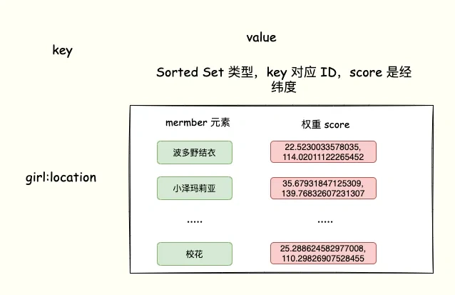

<font style="color:rgb(51, 51, 51);background-color:rgb(248, 246, 244);">图 2-40</font>

<font style="color:rgb(51, 51, 51);background-color:rgb(248, 246, 244);">还有一个问题，Sorted Set 元素的权重值是一个浮点数，经纬度是经度、纬度两个值，咋办呢？如何将经纬度转换成一个浮点数呢？</font>

<font style="color:rgb(51, 51, 51);background-color:rgb(248, 246, 244);">思路对了，为了实现对经纬度比较，Redis 采用业界广泛使用的 GeoHash 编码，分别对经度和纬度编码，最后再把经纬度各自的编码组合成一个最终编码。</font>

<font style="color:rgb(51, 51, 51);background-color:rgb(248, 246, 244);">这样就实现了将经纬度转换成一个值，而</font><font style="color:rgb(51, 51, 51);background-color:rgb(248, 246, 244);"> </font>**<font style="color:rgb(34, 34, 34);background-color:rgb(248, 246, 244);">Redis 的 GEO 类型的底层数据结构用的就是</font>****<font style="color:rgb(34, 34, 34);background-color:rgb(248, 246, 244);"> </font>**<font style="color:rgb(51, 51, 51);background-color:rgb(248, 246, 244);">Sorted Set</font>**<font style="color:rgb(34, 34, 34);background-color:rgb(248, 246, 244);">来实现</font>**<font style="color:rgb(51, 51, 51);background-color:rgb(248, 246, 244);">。</font>

<font style="color:rgb(51, 51, 51);background-color:rgb(248, 246, 244);">Geohash 算法就是将经纬度编码，将二维变一维，给地址位置分区的一种算法，核心思想是区间二分：将地球编码看成一个二维平面，然后将这个平面递归均分为更小的子块。</font>

<font style="color:rgb(51, 51, 51);background-color:rgb(248, 246, 244);">一共可以分为三步。</font>

1. <font style="color:rgb(51, 51, 51);background-color:rgb(248, 246, 244);">将经纬度变成一个 N 位二进制。</font>
2. <font style="color:rgb(51, 51, 51);background-color:rgb(248, 246, 244);">将经纬度的二进制合并。</font>
3. <font style="color:rgb(51, 51, 51);background-color:rgb(248, 246, 244);">按照 Base32 进行编码。</font>

### <font style="color:rgb(0, 0, 0);background-color:rgb(248, 246, 244);">Bitmap（位图）</font>
<font style="color:rgb(51, 51, 51);background-color:rgb(248, 246, 244);">Redis Bitmap（位图）是 Redis 提供的一种特殊的数据结构，用于处理位级别的数据。</font>

<font style="color:rgb(51, 51, 51);background-color:rgb(248, 246, 244);">实际上是在 String 类型上定义的面向 bit 位的操作，将位图存储在字符串中，每个字符代表 8 位二进制，是一个由二进制位（bit）组成的数组，其中的每一位只能是 0 或 1。</font>

<font style="color:rgb(51, 51, 51);background-color:rgb(248, 246, 244);">String 数据类型最大容量是 512MB，所以一个 Bitmap 最多可设置 2^32 个不同位。</font>

<font style="color:rgb(51, 51, 51);background-color:rgb(248, 246, 244);">Bitmap 的底层数据结构用的是 String 类型的 SDS 数据结构来保存位数组，Redis 把每个字节数组的 8 个 bit 位利用起来，每个 bit 位 表示一个元素的二值状态（不是 0 就是 1）。</font>

<font style="color:rgb(51, 51, 51);background-color:rgb(248, 246, 244);">可以将 Bitmap 看成是一个 bit 为单位的数组，数组的每个单元只能存储 0 或者 1，数组的每个 bit 位下标在 Bitmap 中叫做 offset 偏移量。</font>

<font style="color:rgb(51, 51, 51);background-color:rgb(248, 246, 244);">为了直观展示，我们可以理解成 buf 数组的每个槽位中的字节用一行表示，每一行有 8 个 bit 位，8 个格子分别表示这个字节中的 8 个 bit 位，如下图所示：</font>

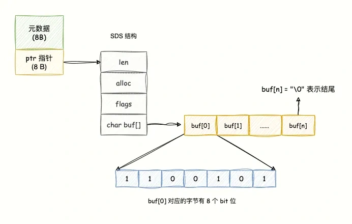

**<font style="color:rgb(34, 34, 34);background-color:rgb(248, 246, 244);">8 个 bit 组成一个 Byte，所以 Bitmap 会极大地节省存储空间。</font>**<font style="color:rgb(51, 51, 51);background-color:rgb(248, 246, 244);"> </font><font style="color:rgb(51, 51, 51);background-color:rgb(248, 246, 244);">这就是 Bitmap 的优势。</font>

### <font style="color:rgb(0, 0, 0);background-color:rgb(248, 246, 244);">HyperlogLogs（ 基数统计）</font>
<font style="color:rgb(51, 51, 51);background-color:rgb(248, 246, 244);">在移动互联网的业务场景中，</font>**<font style="color:rgb(34, 34, 34);background-color:rgb(248, 246, 244);">数据量很大</font>**<font style="color:rgb(51, 51, 51);background-color:rgb(248, 246, 244);">，系统需要保存这样的信息：一个 key 关联了一个数据集合，同时对这个数据集合做统计做一个报表给运营人员看。</font>

<font style="color:rgb(51, 51, 51);background-color:rgb(248, 246, 244);">比如。</font>

+ <font style="color:rgb(51, 51, 51);background-color:rgb(248, 246, 244);">统计一个 APP 的日活、月活数。</font>
+ <font style="color:rgb(51, 51, 51);background-color:rgb(248, 246, 244);">统计一个页面的每天被多少个不同账户访问量（Unique Visitor，UV）。</font>
+ <font style="color:rgb(51, 51, 51);background-color:rgb(248, 246, 244);">统计用户每天搜索不同词条的个数。</font>
+ <font style="color:rgb(51, 51, 51);background-color:rgb(248, 246, 244);">统计注册 IP 数。</font>

<font style="color:rgb(51, 51, 51);background-color:rgb(248, 246, 244);">通常情况下，系统面临的用户数量以及访问量都是巨大的，比如</font>**<font style="color:rgb(34, 34, 34);background-color:rgb(248, 246, 244);">百万、千万级别的用户数量，或者千万级别、甚至亿级别</font>**<font style="color:rgb(51, 51, 51);background-color:rgb(248, 246, 244);">的访问信息，咋办呢？</font>

<font style="color:rgb(51, 51, 51);background-color:rgb(248, 246, 244);">Redis：“这些就是典型的基数统计应用场景，基数统计：统计一个集合中不重复元素，这被称为基数。”</font>

<font style="color:rgb(51, 51, 51);background-color:rgb(248, 246, 244);">HyperLogLog 是一种概率数据结构，用于估计集合的基数。每个 HyperLogLog 最多只需要花费 12KB 内存，在标准误差 0.81%的前提下，就可以计算 2 的 64 次方个元素的基数。</font>

<font style="color:rgb(51, 51, 51);background-color:rgb(248, 246, 244);">HyperLogLog 的优点在于</font>**<font style="color:rgb(34, 34, 34);background-color:rgb(248, 246, 244);">它所需的内存并不会因为集合的大小而改变，无论集合包含的元素有多少个，HyperLogLog 进行计算所需的内存总是固定的，并且是非常少的</font>**<font style="color:rgb(51, 51, 51);background-color:rgb(248, 246, 244);">。</font>

<font style="color:rgb(51, 51, 51);background-color:rgb(248, 246, 244);">Redis 内部使用字符串位图来存储 HyperLogLog 所有桶的计数值，一共分了 2^14 个桶，也就是 16384 个桶。每个桶中是一个 6 bit 的数组。</font>

<font style="color:rgb(51, 51, 51);background-color:rgb(248, 246, 244);">这段代码描述了 Redis HyperLogLog 数据结构的头部定义（hyperLogLog.c 中的 hllhdr 结构体）。以下是关于这个数据结构的各个字段的解释。</font>

```plain
struct hllhdr {
    char magic[4];
    uint8_t encoding;
    uint8_t notused[3];
    uint8_t card[8];
    uint8_t registers[];
};
```

1. **<font style="color:rgb(34, 34, 34);background-color:rgb(248, 246, 244);">magic[4]</font>**<font style="color:rgb(51, 51, 51);background-color:rgb(248, 246, 244);">：这个字段是一个 4 字节的字符数组，用来表示数据结构的标识符。在 HyperLogLog 中，它的值始终为"HYLL"，用来标识这是一个 HyperLogLog 数据结构。</font>
2. **<font style="color:rgb(34, 34, 34);background-color:rgb(248, 246, 244);">encoding</font>**<font style="color:rgb(51, 51, 51);background-color:rgb(248, 246, 244);">：这是一个 1 字节的字段，用来表示 HyperLogLog 的编码方式。它可以取两个值之一：</font>
+ <font style="color:rgb(51, 51, 51);background-color:rgb(248, 246, 244);">HLL_DENSE：表示使用稠密表示方式。</font>
+ <font style="color:rgb(51, 51, 51);background-color:rgb(248, 246, 244);">HLL_SPARSE：表示使用稀疏表示方式。</font>
1. **<font style="color:rgb(34, 34, 34);background-color:rgb(248, 246, 244);">notused[3]</font>**<font style="color:rgb(51, 51, 51);background-color:rgb(248, 246, 244);">：这是一个 3 字节的字段，目前保留用于未来的扩展，要求这些字节的值必须为零。</font>
2. **<font style="color:rgb(34, 34, 34);background-color:rgb(248, 246, 244);">card[8]</font>**<font style="color:rgb(51, 51, 51);background-color:rgb(248, 246, 244);">：这是一个 8 字节的字段，用来存储缓存的基数（基数估计的值）。</font>
3. **<font style="color:rgb(34, 34, 34);background-color:rgb(248, 246, 244);">egisters[]</font>**<font style="color:rgb(51, 51, 51);background-color:rgb(248, 246, 244);">：这个字段是一个可变长度的字节数组，用来存储 HyperLogLog 的数据。</font>

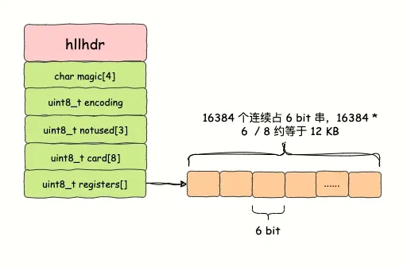

<font style="color:rgb(51, 51, 51);background-color:rgb(248, 246, 244);">图 2-45</font>

<font style="color:rgb(51, 51, 51);background-color:rgb(248, 246, 244);">Redis 对 HyperLogLog 的存储进行了优化，在计数比较小的时候，存储空间采用系数矩阵，占用空间很小。</font>

<font style="color:rgb(51, 51, 51);background-color:rgb(248, 246, 244);">只有在计数很大，稀疏矩阵占用的空间超过了阈值才会转变成稠密矩阵，占用 12KB 空间。</font>

### <font style="color:rgb(0, 0, 0);background-color:rgb(248, 246, 244);">Bloom Filter（布隆过滤器）</font>
<font style="color:rgb(51, 51, 51);background-color:rgb(248, 246, 244);">当你</font>**<font style="color:rgb(34, 34, 34);background-color:rgb(248, 246, 244);">遇到数据量大，又需要去重的时候就可以考虑布隆过滤器</font>**<font style="color:rgb(51, 51, 51);background-color:rgb(248, 246, 244);">，如下场景：</font>

+ <font style="color:rgb(51, 51, 51);background-color:rgb(248, 246, 244);">解决 Redis 缓存穿透问题。</font>
+ <font style="color:rgb(51, 51, 51);background-color:rgb(248, 246, 244);">邮件过滤，使用布隆过滤器实现邮件黑名单过滤。</font>
+ <font style="color:rgb(51, 51, 51);background-color:rgb(248, 246, 244);">爬虫爬过的网站过滤，爬过的网站不再爬取。</font>
+ <font style="color:rgb(51, 51, 51);background-color:rgb(248, 246, 244);">推荐过的新闻不再推荐。</font>

<font style="color:rgb(51, 51, 51);background-color:rgb(248, 246, 244);">布隆过滤器 (Bloom Filter)是由 Burton Howard Bloom 于 1970 年提出，</font>**<font style="color:rgb(34, 34, 34);background-color:rgb(248, 246, 244);">它是一种 space efficient 的概率型数据结构，用于判断一个元素是否在集合中</font>**<font style="color:rgb(51, 51, 51);background-color:rgb(248, 246, 244);">。</font>

<font style="color:rgb(51, 51, 51);background-color:rgb(248, 246, 244);">是一种空间效率高、时间复杂度低的数据结构，用于检查一个元素是否存在于一个集合中。它通常用于快速判断某个元素是否可能存在于一个大型数据集中，而无需实际存储整个数据集。</font>

**<font style="color:rgb(34, 34, 34);background-color:rgb(248, 246, 244);">布隆过滤器客户以保证某个数据不存在时，那么这个数据一定不存在；当给出的响应是存在，这个数可能不存在。</font>**

<font style="color:rgb(51, 51, 51);background-color:rgb(248, 246, 244);">Redis 的 Bloom Filter 实现基于一个位数组（bit array）和一组不同的哈希函数。</font>

1. <font style="color:rgb(51, 51, 51);background-color:rgb(248, 246, 244);">首先分配一块内存空间做 bit 数组，这个位数组的长度是固定的，通常由用户指定，决定了 Bloom Filter 的容量。每个位都初始为 0。</font>
2. <font style="color:rgb(51, 51, 51);background-color:rgb(248, 246, 244);">添加元素时，采用 k 个相互独立的 Hash 函数对这个 key 计算，这些哈希函数应该是独立的，均匀分布的，以减小冲突的可能性，然后将元素 Hash 值所映射的 K 个位置全部设置为 1。</font>
3. <font style="color:rgb(51, 51, 51);background-color:rgb(248, 246, 244);">检测 key 是否存在，仍然用这 k 个 Hash 函数对 key 计算出 k 哈希值，哈希值映射的 k 个 位置，如果位置全部为 1，则表明 key 可能存在，否则不存在。</font>


<font style="color:rgb(51, 51, 51);background-color:rgb(248, 246, 244);">图 2-46</font>

## <font style="color:rgb(0, 0, 0);background-color:rgb(248, 246, 244);">高可用架构</font>
<font style="color:rgb(51, 51, 51);background-color:rgb(248, 246, 244);">我是一个基于内存的数据库，名字叫 Redis。我对数据读写操作的速度快到令人发指，很多程序员把我当做缓存使用系统，用于提高系统读取响应性能。</font>

<font style="color:rgb(51, 51, 51);background-color:rgb(248, 246, 244);">然而，快是需要付出代价的：内存无法持久化，一旦断电或者宕机，我保存在内存中的数据将全部丢失。</font>

<font style="color:rgb(51, 51, 51);background-color:rgb(248, 246, 244);">我有两大杀手锏，实现了数据持久化，做到宕机快速恢复，不丢数据稳如狗，避免从数据库中慢慢恢复数据，他们分别是 RDB 快照和 AOF（Append Only File）。</font>

### <font style="color:rgb(0, 0, 0);background-color:rgb(248, 246, 244);">RDB 快照</font>
<font style="color:rgb(51, 51, 51);background-color:rgb(248, 246, 244);">RDB 内存快照，指的就是 Redis 内存中的某一刻的数据。</font>

<font style="color:rgb(51, 51, 51);background-color:rgb(248, 246, 244);">好比时间定格在某一刻，当我们拍照时，把某一刻的瞬间画面定格记录下来。</font>

<font style="color:rgb(51, 51, 51);background-color:rgb(248, 246, 244);">我跟这个类似，就是把某一刻的数据以文件的形式“拍”下来，写到磁盘上。这个文件叫做 RDB 文件，是 Redis Database 的缩写。</font>

<font style="color:rgb(51, 51, 51);background-color:rgb(248, 246, 244);">我只需要定时执行 RDB 内存快照，就不必每次执行写指令都写磁盘，既实现了快，还实现了持久化。</font>

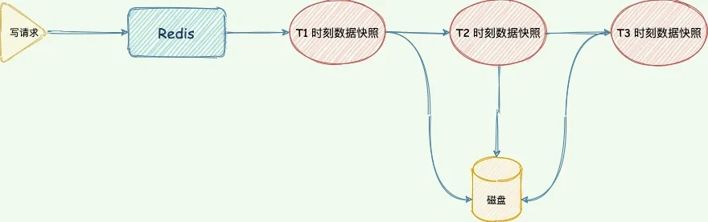

<font style="color:rgb(51, 51, 51);background-color:rgb(248, 246, 244);">图 3-1</font>

<font style="color:rgb(51, 51, 51);background-color:rgb(248, 246, 244);">当在进行宕机后重启数据恢复时，直接将磁盘的 RDB 文件读入内存即可。</font>

<font style="color:rgb(51, 51, 51);background-color:rgb(248, 246, 244);">MySQL：“实际生产环境中，程序员通常给你配置 6GB 的内存，将这么大的内存数据生成 RDB 快照文件落到磁盘的过程会持续比较长的时间。</font>

<font style="color:rgb(51, 51, 51);background-color:rgb(248, 246, 244);">你如何做到继续处理写指令请求，又保证 RDB 与内存中的数据的一致性呢？”</font>

<font style="color:rgb(51, 51, 51);background-color:rgb(248, 246, 244);">作为唯快不破的 NoSQL 数据库扛把子，我在对内存数据做快照的时候，并不会暂停写操作（读操作不会造成数据的不一致）。</font>

<font style="color:rgb(51, 51, 51);background-color:rgb(248, 246, 244);">我使用了操作系统的多进程</font>**<font style="color:rgb(34, 34, 34);background-color:rgb(248, 246, 244);">写时复制技术 COW(Copy On Write)</font>**<font style="color:rgb(51, 51, 51);background-color:rgb(248, 246, 244);"> </font><font style="color:rgb(51, 51, 51);background-color:rgb(248, 246, 244);">来实现快照持久化。</font>

<font style="color:rgb(51, 51, 51);background-color:rgb(248, 246, 244);">在持久化时我会调用操作系统 glibc 函数fork产生一个子进程，</font>**<font style="color:rgb(34, 34, 34);background-color:rgb(248, 246, 244);">快照持久化完全交给子进程来处理，主进程继续处理客户端请求。</font>**

<font style="color:rgb(51, 51, 51);background-color:rgb(248, 246, 244);">子进程刚刚产生时，它和父进程共享内存里面的代码段和数据段，你可以将父子进程想像成一个连体婴儿，共享身体。</font>

<font style="color:rgb(51, 51, 51);background-color:rgb(248, 246, 244);">这是 Linux 操作系统的机制，为了节约内存资源，所以尽可能让它们共享起来。在进程分离的一瞬间，内存的增长几乎没有明显变化。</font>

<font style="color:rgb(51, 51, 51);background-color:rgb(248, 246, 244);">bgsave 子进程可以共享主线程的所有内存数据，所以能读取主线程的数据并写入 RDB 文件。</font>

<font style="color:rgb(51, 51, 51);background-color:rgb(248, 246, 244);">如果主线程对这些数据是读操作，那么主线程和 bgsave子进程互不影响。</font>

<font style="color:rgb(51, 51, 51);background-color:rgb(248, 246, 244);">当主线程要修改某个键值对时，这个数据会把发生变化的数据复制一份，生成副本。</font>

<font style="color:rgb(51, 51, 51);background-color:rgb(248, 246, 244);">接着，bgsave 子进程会把这个副本数据写到 RDB 文件，从而保证了数据一致性。</font>


<font style="color:rgb(51, 51, 51);background-color:rgb(248, 246, 244);">图 3-2</font>

<font style="color:rgb(51, 51, 51);background-color:rgb(248, 246, 244);">AOF</font>

<font style="color:rgb(51, 51, 51);background-color:rgb(248, 246, 244);">针对 RDB 不适合实时持久化等问题，我提供 AOF 持久化方式来破解。</font>

<font style="color:rgb(51, 51, 51);background-color:rgb(248, 246, 244);">AOF （Append Only File）持久化记录的是服务器接收的每个写操作，在服务器启动执行重放还原数据集。</font>

<font style="color:rgb(51, 51, 51);background-color:rgb(248, 246, 244);">AOF 采用的是写后日志模式，即</font>**<font style="color:rgb(34, 34, 34);background-color:rgb(248, 246, 244);">先写内存，后写日志</font>**<font style="color:rgb(51, 51, 51);background-color:rgb(248, 246, 244);">。</font>

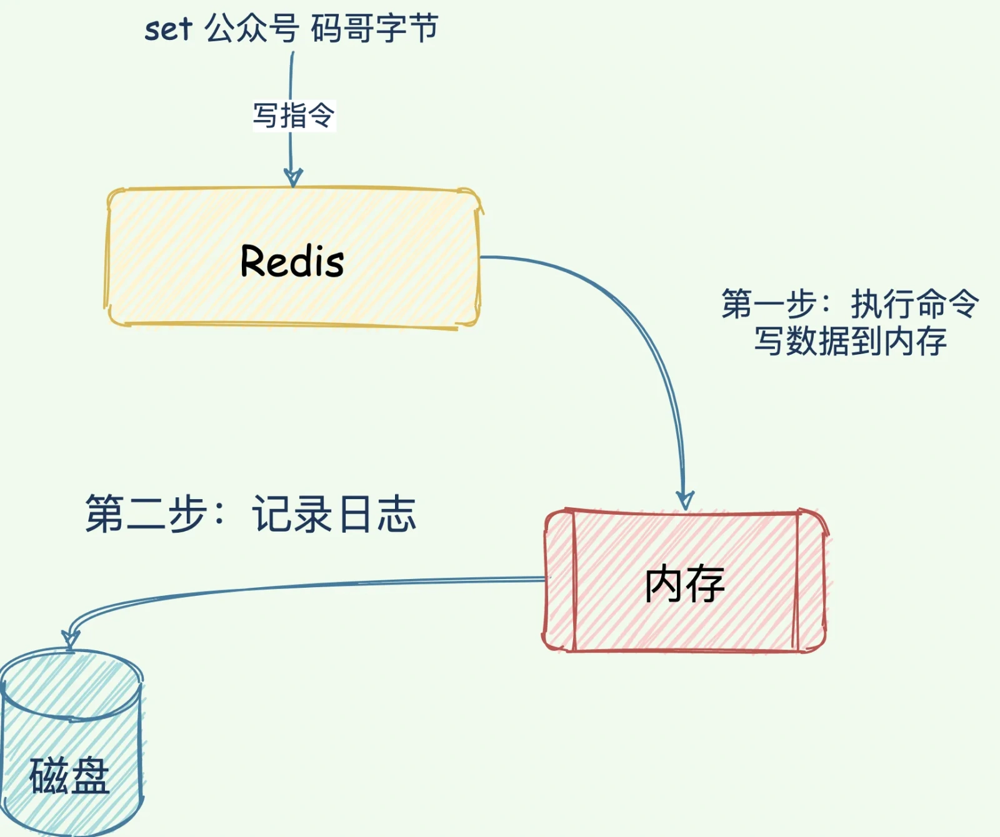

<font style="color:rgb(51, 51, 51);background-color:rgb(248, 246, 244);">当我接收到 set key MageByte 命令将数据写到内存后， 会按照如下格式写入 AOF 文件。</font>

+ <font style="color:rgb(51, 51, 51);background-color:rgb(248, 246, 244);">*3：表示当前指令分为三个部分，每个部分都是 $ + 数字开头，紧跟后面是该部分具体的指令、键、值。</font>
+ <font style="color:rgb(51, 51, 51);background-color:rgb(248, 246, 244);">数字：表示这部分的命令、键、值多占用的字节大小。比如 $3表示这部分包含 3 个字节，也就是 SET 指令。</font>

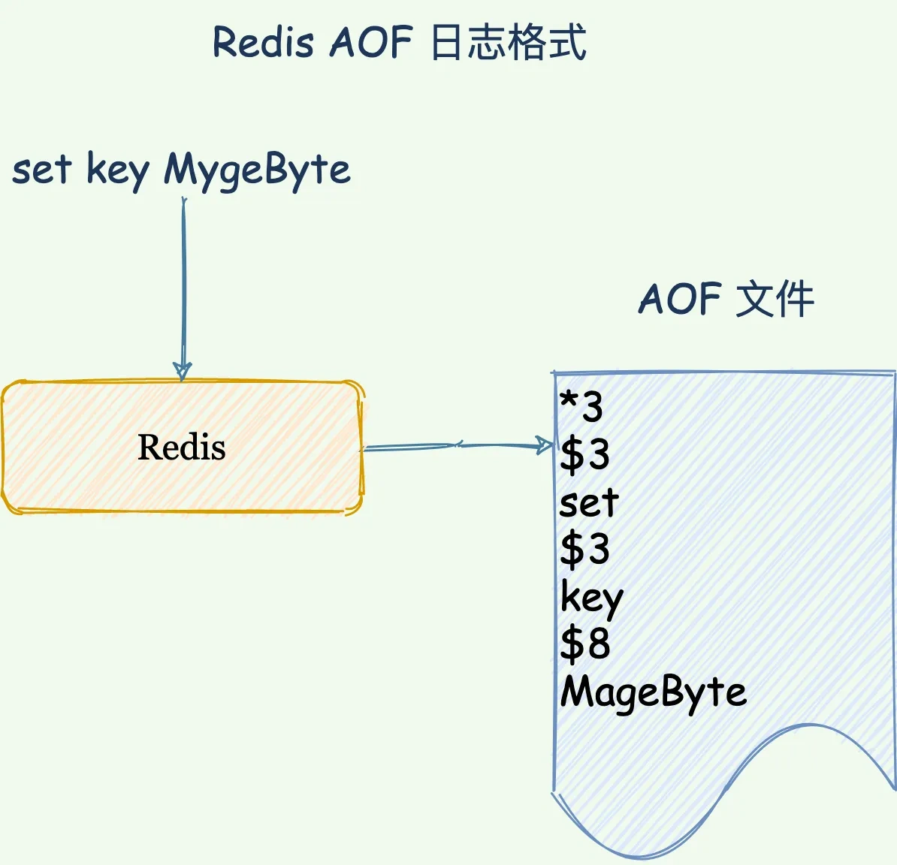

<font style="color:rgb(51, 51, 51);background-color:rgb(248, 246, 244);">图 3-4</font>

<font style="color:rgb(51, 51, 51);background-color:rgb(248, 246, 244);">为了解决 AOF 文件体积膨胀的问题，创造我的 antirez 老哥设计了一个杀手锏——AOF 重写机制，对文件进行瘦身。</font>

<font style="color:rgb(51, 51, 51);background-color:rgb(248, 246, 244);">例如，使用 INCR counter 实现一个自增计数器，初始值 1，递增 1000 次的最终目标是 1000，在 AOF 中保存着 1000 次指令。</font>

<font style="color:rgb(51, 51, 51);background-color:rgb(248, 246, 244);">在重写的时候并不需要其中的 999 个写操作，重写机制有</font>**<font style="color:rgb(34, 34, 34);background-color:rgb(248, 246, 244);">多变一</font>**<font style="color:rgb(51, 51, 51);background-color:rgb(248, 246, 244);">功能，将旧日志中的多条指令，重写后就变成了一条指令。</font>

**<font style="color:rgb(34, 34, 34);background-color:rgb(248, 246, 244);">其原理就是开辟一个子进程将内存中的数据转换成一系列 Redis 的写操作指令，写到一个新的 AOF 日志文件中。再将操作期间发生的增量 AOF 日志追加到这个新的 AOF 日志文件中，追加完毕后就立即替代旧的 AOF 日志文件了，瘦身工作就完成了。</font>**

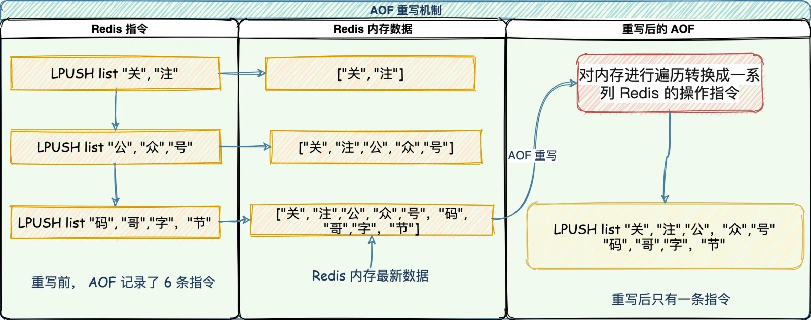

<font style="color:rgb(51, 51, 51);background-color:rgb(248, 246, 244);">图 3-5</font>

<font style="color:rgb(51, 51, 51);background-color:rgb(248, 246, 244);">每次 AOF 重写时，Redis 会先执行一个内存拷贝，让 bgrewriteaof 子进程拥有此时的 Redis 内存快照，子进程遍历 Redis 中的全部键值对，生成重写记录。</font>

<font style="color:rgb(51, 51, 51);background-color:rgb(248, 246, 244);">使用两个日志保证在重写过程中，新写入的数据不会丢失，并且保持数据一致性。</font>

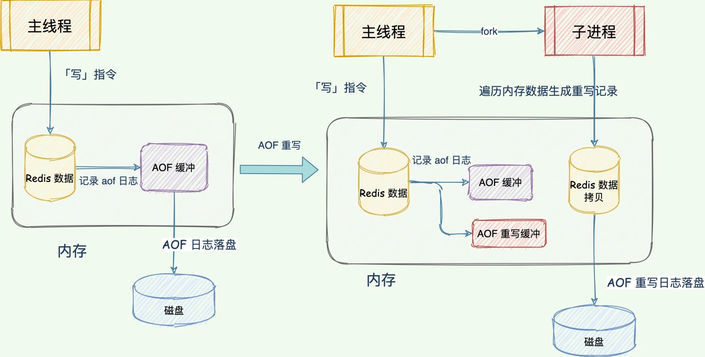

<font style="color:rgb(51, 51, 51);background-color:rgb(248, 246, 244);">图 3-6</font>

<font style="color:rgb(51, 51, 51);background-color:rgb(248, 246, 244);">antirez 在 4.0 版本中给我提供了一个</font>**<font style="color:rgb(34, 34, 34);background-color:rgb(248, 246, 244);">混合使用 AOF 日志和 RDB 内存快照</font>**<font style="color:rgb(51, 51, 51);background-color:rgb(248, 246, 244);">的方法。简单来说，</font>**<font style="color:rgb(34, 34, 34);background-color:rgb(248, 246, 244);">RDB 内存快照以一定的频率执行，在两次快照之间，使用 AOF 日志记录这期间的所有写操作。</font>**

<font style="color:rgb(51, 51, 51);background-color:rgb(248, 246, 244);">如此一来，快照就不需要频繁执行，避免了 fork 对主线程的性能影响，AOF 不再是全量日志，而是生成 RDB 快照时间的增量 AOF 日志，这个日志就会很小，都不需要重写了。</font>

<font style="color:rgb(51, 51, 51);background-color:rgb(248, 246, 244);">等到，第二次做 RDB 全量快照，就可以清空旧的 AOF 日志，恢复数据的时候就不需要使用 AOF 日志了。</font>

### <font style="color:rgb(0, 0, 0);background-color:rgb(248, 246, 244);">主从复制</font>
<font style="color:rgb(51, 51, 51);background-color:rgb(248, 246, 244);">Chaya：“李老师，有了 RDB 内存快照和 AOF 再也不怕宕机丢失数据了，但是 Redis 实例宕机了办？如何实现高可用呢？“</font>

<font style="color:rgb(51, 51, 51);background-color:rgb(248, 246, 244);">李老师愣了一会儿，又赶紧补充道：“依然记得那晚我和我的恋人 Chaya 鸳语轻传，香风急促，朱唇紧贴。香肌如雪，罗裳慢解春光泄。含香玉体说温存，多少风和月。今宵鱼水和谐，抖颤颤，春潮难歇。千声呢喃，百声喘吁，数番愉悦。”</font>

<font style="color:rgb(51, 51, 51);background-color:rgb(248, 246, 244);">可是这时候 Redis 忽然宕机了，无法对外提供服务，电话连环 call，岂不是折煞人也。</font>

<font style="color:rgb(51, 51, 51);background-color:rgb(248, 246, 244);">Redis：“你还念上诗歌了，莫怕，为了你们的幸福。我提供了主从模式，通过主从复制，将数据冗余一份复制到其他 Redis 服务器，实现高可用。你们放心的说温存，说风月。”</font>

<font style="color:rgb(51, 51, 51);background-color:rgb(248, 246, 244);">既然一台宕机了无法提供服务，那多台呢？是不是就可以解决了。</font>

<font style="color:rgb(51, 51, 51);background-color:rgb(248, 246, 244);">前者称为 mater (master)，后者称为 slave (slave)，数据的复制是单向的，只能由 mater 到 slave。</font>

<font style="color:rgb(51, 51, 51);background-color:rgb(248, 246, 244);">默认情况下，每台 Redis 服务器都是 mater；且一个 mater 可以有多个 slave (或没有 slave)，但一个 slave 只能有一个 mater。</font>

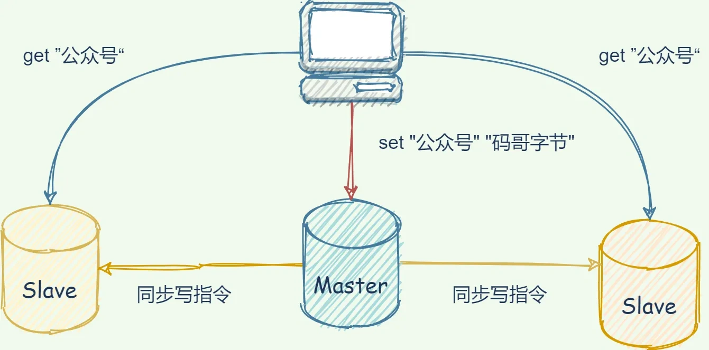

**<font style="color:rgb(34, 34, 34);background-color:rgb(248, 246, 244);">主从库第一次复制过程大体可以分为 3 个阶段：连接建立阶段（即准备阶段）、mater 同步数据到 slave 阶段、发送同步期间接受到的新写命令到 slave 阶段</font>**<font style="color:rgb(51, 51, 51);background-color:rgb(248, 246, 244);">。</font>

<font style="color:rgb(51, 51, 51);background-color:rgb(248, 246, 244);">直接上图，从整体上有一个全局观的感知，后面具体介绍。</font>

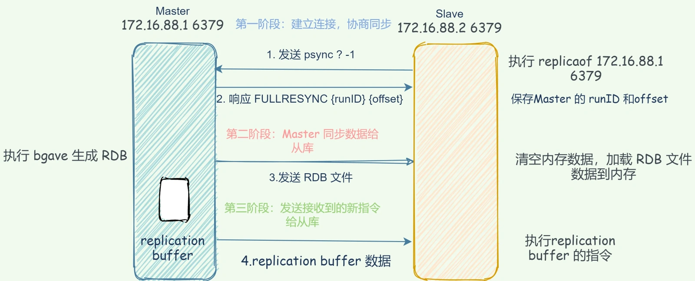

<font style="color:rgb(51, 51, 51);background-color:rgb(248, 246, 244);">图 3-9</font>

### <font style="color:rgb(0, 0, 0);background-color:rgb(248, 246, 244);">哨兵集群</font>
<font style="color:rgb(51, 51, 51);background-color:rgb(248, 246, 244);">主从复制架构面临一个严峻问题，</font>**<font style="color:rgb(34, 34, 34);background-color:rgb(248, 246, 244);">master 挂了，无法执行写操作，无法自动选择一个 Slave 切换为 Master</font>**<font style="color:rgb(51, 51, 51);background-color:rgb(248, 246, 244);">，也就是无法</font>**<font style="color:rgb(34, 34, 34);background-color:rgb(248, 246, 244);">故障自动切换</font>**<font style="color:rgb(51, 51, 51);background-color:rgb(248, 246, 244);">。</font>

<font style="color:rgb(51, 51, 51);background-color:rgb(248, 246, 244);">李老师：“还记得那晚与我女友 Chaya 约会，眼前是橡树的绿叶，白色的竹篱笆。好想告诉我的她，这里像幅画。一起手牵手么么哒……（此处省略 10000 字）。</font>

<font style="color:rgb(51, 51, 51);background-color:rgb(248, 246, 244);">Redis 忽然宕机，我总不能推开 Chaya，停止甜蜜，然后打开电脑手工进行主从切换，再通知其他程序员把地址重新改成新 Master 信息上线？”。</font>

<font style="color:rgb(51, 51, 51);background-color:rgb(248, 246, 244);">Redis：“如此一折腾恐怕李老师已被 Chaya 切换成前男友了，心里的雨倾盆的下，万万使不得。所以必须有一个高可用的方案，为此，我提供一个高可用方案——</font>**<font style="color:rgb(34, 34, 34);background-color:rgb(248, 246, 244);">哨兵（Sentinel）</font>**<font style="color:rgb(51, 51, 51);background-color:rgb(248, 246, 244);">“。</font>

<font style="color:rgb(51, 51, 51);background-color:rgb(248, 246, 244);">先来看看哨兵是什么？搭建哨兵集群的方法我就不细说了，假设三个哨兵组成一个哨兵集群，三个数据节点构成一个一主两从的 Redis 主从架构。</font>

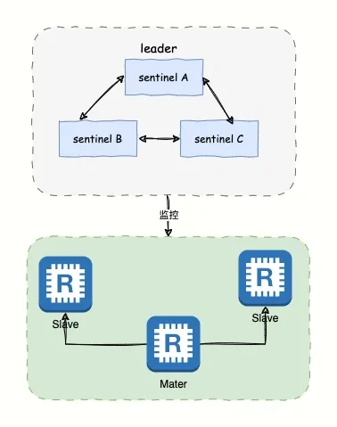

<font style="color:rgb(51, 51, 51);background-color:rgb(248, 246, 244);">图 3-17</font>

<font style="color:rgb(51, 51, 51);background-color:rgb(248, 246, 244);">Redis 哨兵集群高可用方法，有三种角色，分别是 master，slave，sentinel。</font>

+ <font style="color:rgb(51, 51, 51);background-color:rgb(248, 246, 244);">setinel 节点之间互相通信，组成一个集群视线哨兵高可用，选举出一个 leader 执行故障转移。</font>
+ <font style="color:rgb(51, 51, 51);background-color:rgb(248, 246, 244);">master 与 slave 之间通信，组成主从复制架构。</font>
+ <font style="color:rgb(51, 51, 51);background-color:rgb(248, 246, 244);">sentinel 与 master/ slave 通信，是为了对该主从复制架构进行管理：</font>**<font style="color:rgb(34, 34, 34);background-color:rgb(248, 246, 244);">监视（Monitoring）</font>**<font style="color:rgb(51, 51, 51);background-color:rgb(248, 246, 244);">、</font>**<font style="color:rgb(34, 34, 34);background-color:rgb(248, 246, 244);">通知（Notification）</font>**<font style="color:rgb(51, 51, 51);background-color:rgb(248, 246, 244);">、</font>**<font style="color:rgb(34, 34, 34);background-color:rgb(248, 246, 244);">自动故障切换（Automatic Failover）</font>**<font style="color:rgb(51, 51, 51);background-color:rgb(248, 246, 244);">、</font>**<font style="color:rgb(34, 34, 34);background-color:rgb(248, 246, 244);">配置提供者（Configuration Provider）</font>**<font style="color:rgb(51, 51, 51);background-color:rgb(248, 246, 244);">。</font>

### <font style="color:rgb(0, 0, 0);background-color:rgb(248, 246, 244);">Redis Cluster</font>
**<font style="color:rgb(34, 34, 34);background-color:rgb(248, 246, 244);">使用 Redis Cluster 集群，主要解决了大数据量存储导致的各种慢问题，同时也便于横向拓展。</font>**

<font style="color:rgb(51, 51, 51);background-color:rgb(248, 246, 244);">两种方案对应着 Redis 数据增多的两种拓展方案：</font>**<font style="color:rgb(34, 34, 34);background-color:rgb(248, 246, 244);">垂直扩展（scale up）、水平扩展（scale out）。</font>**

1. <font style="color:rgb(51, 51, 51);background-color:rgb(248, 246, 244);">垂直拓展：升级单个 Redis 的硬件配置，比如增加内存容量、磁盘容量、使用更强大的 CPU。</font>
2. <font style="color:rgb(51, 51, 51);background-color:rgb(248, 246, 244);">水平拓展：横向增加 Redis 实例个数，每个节点负责一部分数据。</font>

<font style="color:rgb(51, 51, 51);background-color:rgb(248, 246, 244);">比如需要一个内存 24 GB 磁盘 150 GB 的服务器资源，有以下两种方案。</font>

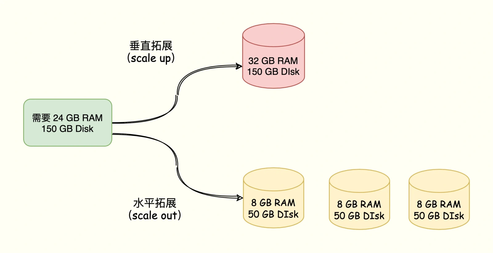

<font style="color:rgb(51, 51, 51);background-color:rgb(248, 246, 244);">图 3-24</font>

**<font style="color:rgb(34, 34, 34);background-color:rgb(248, 246, 244);">在面向百万、千万级别的用户规模时，横向扩展的 Redis 切片集群会是一个非常好的选择。</font>**

<font style="color:rgb(51, 51, 51);background-color:rgb(248, 246, 244);">Redis Cluster 在 Redis 3.0 及以上版本提供，是一种分布式数据库方案，通过分片（sharding）来进行数据管理（分治思想的一种实践），并提供复制和故障转移功能。</font>

<font style="color:rgb(51, 51, 51);background-color:rgb(248, 246, 244);">Redis Cluster 并没有使用一致性哈希算法，而是将数据划分为 16384 的 slots ，每个节点负责一部分 slots，slot 的信息存储在每个节点中。</font>

<font style="color:rgb(51, 51, 51);background-color:rgb(248, 246, 244);">它是去中心化的，如图 3-25 所示，该集群有三个 Redis mater 节点组成（省略每个 master 对应的的 slave 节点），每个节点负责整个集群的一部分数据，每个节点负责的数据多少可以不一样。</font>

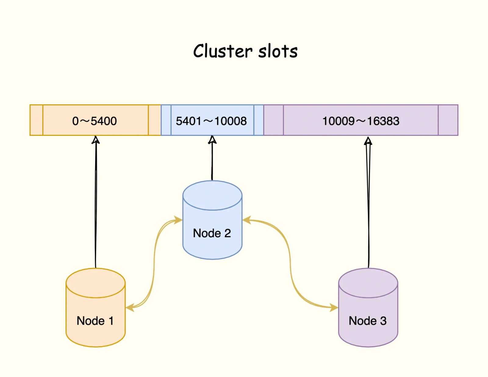

<font style="color:rgb(51, 51, 51);background-color:rgb(248, 246, 244);">图 3-25</font>

<font style="color:rgb(51, 51, 51);background-color:rgb(248, 246, 244);">三个节点相互连接组成一个对等的集群，它们之间通过 Gossip协议相互交互集群信息，最后每个节点都保存着其他节点的 slots 分配情况。</font>

<font style="color:rgb(51, 51, 51);background-color:rgb(248, 246, 244);">Chaya：“Redis Cluster 如何实现自动故障转移呢？”</font>

<font style="color:rgb(51, 51, 51);background-color:rgb(248, 246, 244);">简而概之的说，Redis Cluster 会经历以下三个步骤实现自动故障转移实现高可用。</font>

1. **<font style="color:rgb(34, 34, 34);background-color:rgb(248, 246, 244);">故障检测</font>**<font style="color:rgb(51, 51, 51);background-color:rgb(248, 246, 244);">：集群中每个节点都会定期通过 Gossip 协议向其他节点发送 PING 消息，检测各个节点的状态（</font>**<font style="color:rgb(34, 34, 34);background-color:rgb(248, 246, 244);">在线状态</font>**<font style="color:rgb(51, 51, 51);background-color:rgb(248, 246, 244);">、</font>**<font style="color:rgb(34, 34, 34);background-color:rgb(248, 246, 244);">疑似下线状态 PFAIL</font>**<font style="color:rgb(51, 51, 51);background-color:rgb(248, 246, 244);">、</font>**<font style="color:rgb(34, 34, 34);background-color:rgb(248, 246, 244);">已下线状态 FAIL</font>**<font style="color:rgb(51, 51, 51);background-color:rgb(248, 246, 244);">）。并通过 Gossip 协议来广播自己的状态以及自己对整个集群认知的改变。</font>
2. **<font style="color:rgb(34, 34, 34);background-color:rgb(248, 246, 244);">master 选举</font>**<font style="color:rgb(51, 51, 51);background-color:rgb(248, 246, 244);">：使用从当前故障 master 的所有 slave 选举一个提升为 master。</font>
3. **<font style="color:rgb(34, 34, 34);background-color:rgb(248, 246, 244);">故障转移</font>**<font style="color:rgb(51, 51, 51);background-color:rgb(248, 246, 244);">：取消与旧 master 的主从复制关系，将旧 master 负责的槽位信息指派到当前 master，更新 Cluster 状态并写入数据文件，通过 gossip 协议向集群广播发送 CLUSTERMSG_TYPE_PONG消息，把最新的信息传播给其他节点，其他节点收到该消息后更新自身的状态信息或与新 master 建立主从复制关系。</font>

## <font style="color:rgb(0, 0, 0);background-color:rgb(248, 246, 244);">发布订阅</font>
<font style="color:rgb(51, 51, 51);background-color:rgb(248, 246, 244);">Redis 发布订阅（Pus/Sub）是一种消息通信模式：发送者通过 PUBLISH发布消息，订阅者通过 SUBSCRIBE 订阅或通过UNSUBSCRIBE 取消订阅。</font>

<font style="color:rgb(51, 51, 51);background-color:rgb(248, 246, 244);">发布到订阅模式主要包含三个部分组成。</font>

+ <font style="color:rgb(51, 51, 51);background-color:rgb(248, 246, 244);">发布者（Publisher），发送消息到频道中，每次只能往一个频道发送一条消息。</font>
+ <font style="color:rgb(51, 51, 51);background-color:rgb(248, 246, 244);">订阅者（Subscriber），可以同时订阅多个频道。</font>
+ <font style="color:rgb(51, 51, 51);background-color:rgb(248, 246, 244);">频道（Channel），将发布者发布的消息转发给</font>**<font style="color:rgb(34, 34, 34);background-color:rgb(248, 246, 244);">当前</font>**<font style="color:rgb(51, 51, 51);background-color:rgb(248, 246, 244);">订阅此频道的订阅者。</font>

<font style="color:rgb(51, 51, 51);background-color:rgb(248, 246, 244);">码哥写好了一篇技术文章则通过 “ChannelA” 发布消息，消息的订阅者就会收到“关注码哥字节，提升技术”的消息。</font>

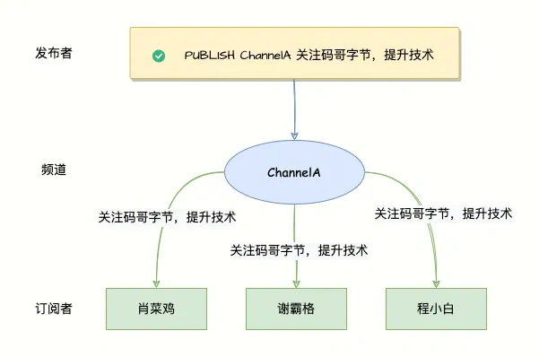

<font style="color:rgb(51, 51, 51);background-color:rgb(248, 246, 244);">图 4-13</font>

<font style="color:rgb(51, 51, 51);background-color:rgb(248, 246, 244);">Chaya：“说了这么多，Redis 发布订阅能在什么场景发挥作用呢？”</font>

**<font style="color:rgb(34, 34, 34);background-color:rgb(248, 246, 244);">哨兵间通信</font>**

<font style="color:rgb(51, 51, 51);background-color:rgb(248, 246, 244);">哨兵集群中，每个哨兵节点利用 Pub/Sub 发布订阅实现哨兵之间的相互发现彼此和找到 Slave。</font>

<font style="color:rgb(51, 51, 51);background-color:rgb(248, 246, 244);">哨兵与 Master 建立通信后，利用 master 提供发布/订阅机制在__sentinel__:hello发布自己的信息，比如 IP、端口……，同时订阅这个频道来获取其他哨兵的信息，就这样实现哨兵间通信。</font>

**<font style="color:rgb(34, 34, 34);background-color:rgb(248, 246, 244);">消息队列</font>**

<font style="color:rgb(51, 51, 51);background-color:rgb(248, 246, 244);">之前码哥跟大家分享过如何利用 Redis List 与 Stream 实现消息队列。我们也可以利用 Redis 发布/订阅机制实现</font>**<font style="color:rgb(34, 34, 34);background-color:rgb(248, 246, 244);">轻量级简单的 MQ 功能</font>**<font style="color:rgb(51, 51, 51);background-color:rgb(248, 246, 244);">，实现上下游解耦，</font>**<font style="color:rgb(34, 34, 34);background-color:rgb(248, 246, 244);">需要注意点是 Redis 发布订阅的消息不会被持久化，所以新订阅的客户端将收不到历史消息。</font>**

## <font style="color:rgb(0, 0, 0);background-color:rgb(248, 246, 244);">Redis I/O 多线程模型</font>
<font style="color:rgb(51, 51, 51);background-color:rgb(248, 246, 244);">Redis 官方在 2020 年 5 月正式推出 6.0 版本，引入了 I/O 多线程模型。</font>

<font style="color:rgb(51, 51, 51);background-color:rgb(248, 246, 244);">谢霸哥：“为什么之前是单线程模型？为什么 6.0 引入了 I/O 多线程模型？主要解决了什么问题？”</font>

<font style="color:rgb(51, 51, 51);background-color:rgb(248, 246, 244);">今天，咱们就详细的聊下 I/O 多线程模型带来的效果到底是黛玉骑鬼火，该强强，该弱弱；还是犹如光明顶身怀绝技的的张无忌，招招都是必杀技。</font>

<font style="color:rgb(51, 51, 51);background-color:rgb(248, 246, 244);">命令执行阶段，每一条命令并不会立马被执行，而是进入一个一个 socket 队列，当 socket 事件就绪则交给事件分发器分发到对应的事件处理器处理，单线程模型的命令处理如下图所示。</font>

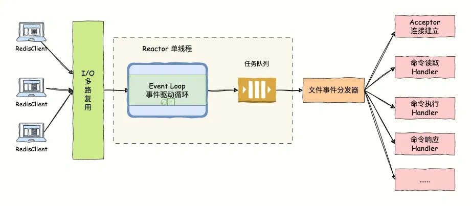

<font style="color:rgb(51, 51, 51);background-color:rgb(248, 246, 244);">图 4-23</font>

<font style="color:rgb(51, 51, 51);background-color:rgb(248, 246, 244);">谢霸哥：“为什么 Redis6.0 之前是单线程模型？”</font>

<font style="color:rgb(51, 51, 51);background-color:rgb(248, 246, 244);">以下是官方关于为什么 6.0 之前一直使用单线程模型的回答。</font>

+ <font style="color:rgb(51, 51, 51);background-color:rgb(248, 246, 244);">Redis 的性能瓶颈主要在于内存和网络 I/O，CPU 不会是性能瓶颈所在。</font>
+ <font style="color:rgb(51, 51, 51);background-color:rgb(248, 246, 244);">Redis 通过使用 pipelining 每秒可以处理 100 万个请求，应用程序的所时候用的大多数命令时间复杂度主要使用 O(N) 或 O(log(N)) 的，它几乎不会占用太多 CPU。</font>
+ <font style="color:rgb(51, 51, 51);background-color:rgb(248, 246, 244);">单线程模型的代码可维护性高。多线程模型虽然在某些方面表现优异，但是它却引入了程序执行顺序的不确定性，带来了并发读写的一系列问题，增加了系统复杂度、同时可能存在线程切换、甚至加锁解锁、死锁造成的性能损耗。</font>

**<font style="color:rgb(34, 34, 34);background-color:rgb(248, 246, 244);">需要注意的是，Redis 多 IO 线程模型只用来处理网络读写请求，对于 Redis 的读写命令，依然是单线程处理</font>**<font style="color:rgb(51, 51, 51);background-color:rgb(248, 246, 244);">。</font>

<font style="color:rgb(51, 51, 51);background-color:rgb(248, 246, 244);">这是因为，</font>**<font style="color:rgb(34, 34, 34);background-color:rgb(248, 246, 244);">网络 I/O 读写是瓶颈，可通过多线程并行处理可提高性能。而继续使用单线程执行读写命令，不需要为了保证 Lua 脚本、事务、等开发多线程安全机制，实现更简单。</font>**

<font style="color:rgb(51, 51, 51);background-color:rgb(248, 246, 244);">谢霸哥：“码哥，你真是斑马的脑袋，说的头头是道。”</font>

<font style="color:rgb(51, 51, 51);background-color:rgb(248, 246, 244);">我谢谢您嘞，主线程与 I/O 多线程共同协作处理命令的架构图如下所示。</font>

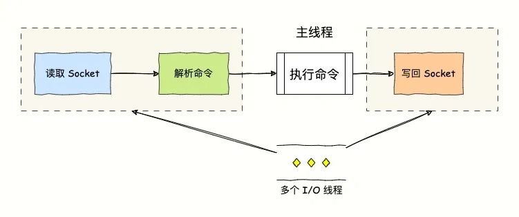

## <font style="color:rgb(0, 0, 0);background-color:rgb(248, 246, 244);">性能排查和优化</font>
<font style="color:rgb(51, 51, 51);background-color:rgb(248, 246, 244);">Redis 通常是我们业务系统中一个重要的组件，比如：缓存、账号登录信息、排行榜等。一旦 Redis 请求延迟增加，可能就会导致业务系统“雪崩”。</font>

<font style="color:rgb(51, 51, 51);background-color:rgb(248, 246, 244);">今天码哥跟大家一起来分析下 Redis 突然变慢了我们该怎么办？如何确定 Redis 性能出问题了，出现问题要如何调优解决。</font>

### <font style="color:rgb(0, 0, 0);background-color:rgb(248, 246, 244);">性能基线测量</font>
<font style="color:rgb(51, 51, 51);background-color:rgb(248, 246, 244);">张无剑：“那么，我们如何判定 Redis 真的变慢呢？”</font>

<font style="color:rgb(51, 51, 51);background-color:rgb(248, 246, 244);">因此，我们需要对当前环境下的</font>**<font style="color:rgb(34, 34, 34);background-color:rgb(248, 246, 244);">Redis 基线性能</font>**<font style="color:rgb(51, 51, 51);background-color:rgb(248, 246, 244);">进行测量，即在系统低压力、无干扰的条件下，获取其基本性能水平。</font>

**<font style="color:rgb(34, 34, 34);background-color:rgb(248, 246, 244);">当你观察到 Redis 运行时延迟超过基线性能的两倍以上时，可以明确判定 Redis 性能已经下降。</font>**

<font style="color:rgb(51, 51, 51);background-color:rgb(248, 246, 244);">redis-cli 可执行脚本提供了 –intrinsic-latency 选项，用来监测和统计测试期间内的最大延迟（以毫秒为单位），这个延迟可以作为 Redis 的基线性能。</font>

**<font style="color:rgb(34, 34, 34);background-color:rgb(248, 246, 244);">需要注意的是，你需要在运行 Redis 的服务器上执行，而不是在客户端中执行。</font>**

```plain
./redis-cli --intrinsic-latency 100
Max latency so far: 4 microseconds.
Max latency so far: 18 microseconds.
Max latency so far: 41 microseconds.
Max latency so far: 57 microseconds.
Max latency so far: 78 microseconds.
Max latency so far: 170 microseconds.
Max latency so far: 342 microseconds.
Max latency so far: 3079 microseconds.

45026981 total runs (avg latency: 2.2209 microseconds / 2220.89 nanoseconds per run).
Worst run took 1386x longer than the average latency.
```

<font style="color:rgb(51, 51, 51);background-color:rgb(248, 246, 244);">注意：参数100是测试将执行的秒数。我们运行测试的时间越长，我们就越有可能发现延迟峰值。</font>

<font style="color:rgb(51, 51, 51);background-color:rgb(248, 246, 244);">通常运行 100 秒通常是合适的，足以发现延迟问题了，当然我们可以选择不同时间运行几次，避免误差。</font>

<font style="color:rgb(51, 51, 51);background-color:rgb(248, 246, 244);">我运行的最大延迟是 3079 微秒，所以基线性能是 3079 （3 毫秒）微秒。</font>

<font style="color:rgb(51, 51, 51);background-color:rgb(248, 246, 244);">需要注意的是，我们要在 Redis 的服务端运行，而不是客户端。这样，可以</font>**<font style="color:rgb(34, 34, 34);background-color:rgb(248, 246, 244);">避免网络对基线性能的影响</font>**<font style="color:rgb(51, 51, 51);background-color:rgb(248, 246, 244);">。</font>

### <font style="color:rgb(0, 0, 0);background-color:rgb(248, 246, 244);">慢指令监控</font>
<font style="color:rgb(51, 51, 51);background-color:rgb(248, 246, 244);">Chaya：“知道了性能基线后，有什么监控手段知道有慢指令呢？”</font>

<font style="color:rgb(51, 51, 51);background-color:rgb(248, 246, 244);">我们要避免使用时间复杂度为 O(n)的指令，尽可能使用O(1)和O(logN)的指令。</font>

<font style="color:rgb(51, 51, 51);background-color:rgb(248, 246, 244);">涉及到集合操作的复杂度一般为O(N)，比如集合</font>**<font style="color:rgb(34, 34, 34);background-color:rgb(248, 246, 244);">全量查询</font>**<font style="color:rgb(51, 51, 51);background-color:rgb(248, 246, 244);">HGETALL、SMEMBERS，以及集合的</font>**<font style="color:rgb(34, 34, 34);background-color:rgb(248, 246, 244);">聚合操作</font>**<font style="color:rgb(51, 51, 51);background-color:rgb(248, 246, 244);"> </font><font style="color:rgb(51, 51, 51);background-color:rgb(248, 246, 244);">SORT、LREM、 SUNION 等。</font>

<font style="color:rgb(51, 51, 51);background-color:rgb(248, 246, 244);">Chaya：“代码不是我写的，不知道有没有人用了慢指令，有没有监控呢？”</font>

<font style="color:rgb(51, 51, 51);background-color:rgb(248, 246, 244);">有两种方式可以排查到。</font>

+ <font style="color:rgb(51, 51, 51);background-color:rgb(248, 246, 244);">使用 Redis 慢日志功能查出慢命令。</font>
+ <font style="color:rgb(51, 51, 51);background-color:rgb(248, 246, 244);">latency-monitor（延迟监控）工具。</font>

### <font style="color:rgb(0, 0, 0);background-color:rgb(248, 246, 244);">性能问题排查清单</font>
<font style="color:rgb(51, 51, 51);background-color:rgb(248, 246, 244);">Redis 的指令由单线程执行，如果主线程执行的操作时间太长，就会导致主线程阻塞。一起分析下都有哪些情况会导致 Redis 性能问题，我们又该如何解决。</font>

<font style="color:rgb(51, 51, 51);background-color:rgb(248, 246, 244);">1. 网络通信导致的延迟</font>

<font style="color:rgb(51, 51, 51);background-color:rgb(248, 246, 244);">客户端使用 TCP/IP 连接或 Unix 域连接连接到 Redis。1 Gbit/s 网络的典型延迟约为 200 us。</font>

<font style="color:rgb(51, 51, 51);background-color:rgb(248, 246, 244);">redis 客户端执行一条命令分 4 个过程：</font>

<font style="color:rgb(51, 51, 51);background-color:rgb(248, 246, 244);">发送命令－〉 命令排队 －〉 命令执行－〉 返回结果</font>

<font style="color:rgb(51, 51, 51);background-color:rgb(248, 246, 244);">这个过程称为 Round trip time(简称 RTT, 往返时间)，mget mset 有效节约了 RTT，但大部分命令（如 hgetall，并没有 mhgetall）不支持批量操作，需要消耗 N 次 RTT ，这个时候需要 pipeline 来解决这个问题。</font>

**<font style="color:rgb(34, 34, 34);background-color:rgb(248, 246, 244);">解决方案</font>**

<font style="color:rgb(51, 51, 51);background-color:rgb(248, 246, 244);">Redis pipeline 将多个命令连接在一起来减少网络响应往返次数。</font>

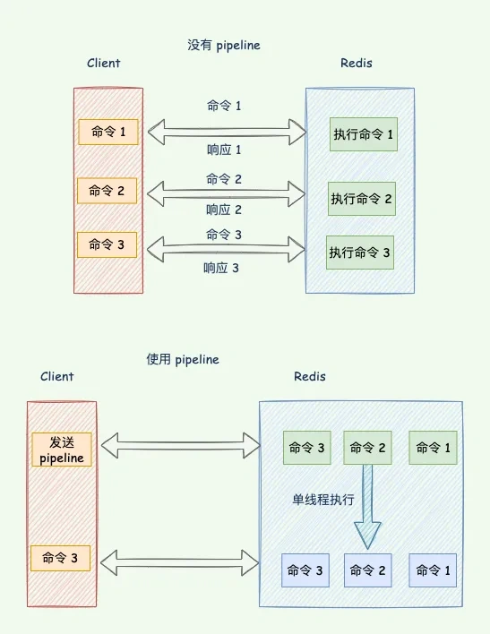

<font style="color:rgb(51, 51, 51);background-color:rgb(248, 246, 244);">图 5-1</font>

<font style="color:rgb(51, 51, 51);background-color:rgb(248, 246, 244);">2. 慢指令</font>

<font style="color:rgb(51, 51, 51);background-color:rgb(248, 246, 244);">根据上文的慢指令监控到慢查询的指令。可以通过以下两种方式解决。</font>

+ <font style="color:rgb(51, 51, 51);background-color:rgb(248, 246, 244);">在 Cluster 集群中，将聚合运算等 O(N) 时间复杂度操作放到 slave 上运行或者在客户端完成。</font>
+ <font style="color:rgb(51, 51, 51);background-color:rgb(248, 246, 244);">使用更高效的命令代替。比如使用增量迭代的方式，避免一次查询大量数据，具体请查看 SCAN、SSCAN、HSCAN、ZSCAN命令。</font>

<font style="color:rgb(51, 51, 51);background-color:rgb(248, 246, 244);">除此之外，生产中禁用 KEYS 命令，因为它会遍历所有的键值对，所以操作延时高，只适用于调试。</font>

<font style="color:rgb(51, 51, 51);background-color:rgb(248, 246, 244);">3. 开启透明大页（Transparent HugePages）</font>

<font style="color:rgb(51, 51, 51);background-color:rgb(248, 246, 244);">常规的内存页是按照 4 KB 来分配，Linux 内核从 2.6.38 开始支持内存大页机制，该机制支持 2MB 大小的内存页分配。</font>

<font style="color:rgb(51, 51, 51);background-color:rgb(248, 246, 244);">Redis 使用 fork 生成 RDB 快照的过程中，Redis 采用</font>**<font style="color:rgb(34, 34, 34);background-color:rgb(248, 246, 244);">写时复制</font>**<font style="color:rgb(51, 51, 51);background-color:rgb(248, 246, 244);">技术使得主线程依然可以接收客户端的写请求。</font>

<font style="color:rgb(51, 51, 51);background-color:rgb(248, 246, 244);">也就是当数据被修改的时候，Redis 会复制一份这个数据，再进行修改。</font>

<font style="color:rgb(51, 51, 51);background-color:rgb(248, 246, 244);">采用了内存大页，生成 RDB 期间即使客户端修改的数据只有 50B 的数据，Redis 可能需要复制 2MB 的大页。当写的指令比较多的时候就会导致大量的拷贝，导致性能变慢。</font>

**<font style="color:rgb(34, 34, 34);background-color:rgb(248, 246, 244);">使用以下指令禁用 Linux 内存大页即可解决。</font>**

```plain
echo never > /sys/kernel/mm/transparent_hugepage/enabled
```

<font style="color:rgb(51, 51, 51);background-color:rgb(248, 246, 244);">4. swap 交换区</font>

<font style="color:rgb(51, 51, 51);background-color:rgb(248, 246, 244);">谢霸哥：“什么是 swap 交换区？”</font>

<font style="color:rgb(51, 51, 51);background-color:rgb(248, 246, 244);">当物理内存不够用的时候，操作系统会将部分内存上的数据交换到 swap 空间上，防止程序因为内存不够用而导致 oom 或者更致命的情况出现。</font>

<font style="color:rgb(51, 51, 51);background-color:rgb(248, 246, 244);">当应用进程向操作系统请求内存发现不足时，操作系统会把内存中暂时不用的数据交换放在 SWAP 分区中，这个过程称为 SWAP OUT。</font>

<font style="color:rgb(51, 51, 51);background-color:rgb(248, 246, 244);">当该进程又需要这些数据且操作系统发现还有空闲物理内存时，就会把 SWAP 分区中的数据交换回物理内存中，这个过程称为 SWAP IN。</font>

**<font style="color:rgb(34, 34, 34);background-color:rgb(248, 246, 244);">内存 swap 是操作系统里将内存数据在内存和磁盘间来回换入和换出的机制，涉及到磁盘的读写。</font>**

<font style="color:rgb(51, 51, 51);background-color:rgb(248, 246, 244);">谢霸哥：“触发 swap 的情况有哪些呢？”</font>

<font style="color:rgb(51, 51, 51);background-color:rgb(248, 246, 244);">对于 Redis 而言，有两种常见的情况。</font>

+ <font style="color:rgb(51, 51, 51);background-color:rgb(248, 246, 244);">Redis 使用了比可用内存更多的内存。</font>
+ <font style="color:rgb(51, 51, 51);background-color:rgb(248, 246, 244);">与 Redis 在同一机器运行的其他进程在执行大量的文件读写 I/O 操作（包括生成大文件的 RDB 文件和 AOF 后台线程），文件读写占用内存，导致 Redis 获得的内存减少，触发了 swap。</font>

<font style="color:rgb(51, 51, 51);background-color:rgb(248, 246, 244);">谢霸哥：“我要如何排查因为 swap 导致的性能变慢呢？”</font>

<font style="color:rgb(51, 51, 51);background-color:rgb(248, 246, 244);">Linux 提供了很好的工具来排查这个问题，当你怀疑由于交换导致的延迟时，只需按照以下步骤排查。</font>

**<font style="color:rgb(34, 34, 34);background-color:rgb(248, 246, 244);">获取 Redis pid</font>**

<font style="color:rgb(51, 51, 51);background-color:rgb(248, 246, 244);">我省略部分指令响应的信息，重点关注 process_id。</font>

```plain
127.0.0.1:6379> INFO Server
# Server
redis_version:7.0.14
process_id:2847
process_supervised:no
run_id:8923cc83412b223823a1dcf00251eb025acab271
tcp_port:6379
```

**<font style="color:rgb(34, 34, 34);background-color:rgb(248, 246, 244);">查找内存布局</font>**

<font style="color:rgb(51, 51, 51);background-color:rgb(248, 246, 244);">进入 Redis 所在的服务器的 /proc 文件系统目录。</font>

```bash
cd /proc/2847
```

<font style="color:rgb(51, 51, 51);background-color:rgb(248, 246, 244);">在这里有一个 smaps 的文件，该文件描述了 Redis 进程的内存布局，用 grep 查找所有文件中的 Swap 字段。</font>

```plain
$ cat smaps | egrep '^(Swap|Size)'
Size:                316 kB
Swap:                  0 kB
Size:                  4 kB
Swap:                  0 kB
Size:                  8 kB
Swap:                  0 kB
Size:                 40 kB
Swap:                  0 kB
Size:                132 kB
Swap:                  0 kB
Size:             720896 kB
Swap:                 12 kB
```

**<font style="color:rgb(34, 34, 34);background-color:rgb(248, 246, 244);">每行 Size 表示 Redis 实例所用的一块内存大小，和 Size 下方的 Swap 对应这块 Size 大小的内存区域有多少数据已经被换出到磁盘上了，如果 Size == Swap 则说明数据被完全换出了。</font>**

<font style="color:rgb(51, 51, 51);background-color:rgb(248, 246, 244);">可以看到有一个 720896 kB 的内存大小有 12 kb 被换出到了磁盘上（仅交换了 12 kB），这就没什么问题。</font>

<font style="color:rgb(51, 51, 51);background-color:rgb(248, 246, 244);">Redis 本身会使用很多大小不一的内存块，所以，你可以看到有很多 Size 行，有的很小，就是 4KB，而有的很大，例如 720896KB。不同内存块被换出到磁盘上的大小也不一样。</font>

**<font style="color:rgb(34, 34, 34);background-color:rgb(248, 246, 244);">敲重点了</font>**

**<font style="color:rgb(34, 34, 34);background-color:rgb(248, 246, 244);">如果 Swap 一切都是 0 kb，或者零星的 4k ，那么一切正常。</font>**

**<font style="color:rgb(34, 34, 34);background-color:rgb(248, 246, 244);">当出现百 MB，甚至 GB 级别的 swap 大小时，就表明，此时，Redis 实例的内存压力很大，很有可能会变慢。</font>**

**<font style="color:rgb(34, 34, 34);background-color:rgb(248, 246, 244);">解决方案</font>**

1. <font style="color:rgb(51, 51, 51);background-color:rgb(248, 246, 244);">增加机器内存。</font>
2. <font style="color:rgb(51, 51, 51);background-color:rgb(248, 246, 244);">将 Redis 放在单独的机器上运行，避免在同一机器上运行需要大量内存的进程，从而满足 Redis 的内存需求。</font>
3. <font style="color:rgb(51, 51, 51);background-color:rgb(248, 246, 244);">增加 Cluster 集群的数量分担数据量，减少每个实例所需的内存。</font>

<font style="color:rgb(51, 51, 51);background-color:rgb(248, 246, 244);">5. AOF 和磁盘 I/O 导致的延迟</font>

<font style="color:rgb(51, 51, 51);background-color:rgb(248, 246, 244);">在不死之身高可用章节我们知道 Redis 为了保证数据可靠性，你可以使用 AOF 和 RDB 内存快照实现宕机快速恢复和持久化。</font>

<font style="color:rgb(51, 51, 51);background-color:rgb(248, 246, 244);">**可以使用 appendfsync **配置将 AOF 配置为以三种不同的方式在磁盘上执行 write 或者 fsync （可以在运行时使用</font><font style="color:rgb(51, 51, 51);background-color:rgb(248, 246, 244);"> </font>**<font style="color:rgb(34, 34, 34);background-color:rgb(248, 246, 244);">CONFIG SET</font>**<font style="color:rgb(51, 51, 51);background-color:rgb(248, 246, 244);">命令修改此设置，比如：redis-cli CONFIG SET appendfsync no）。</font>

+ **<font style="color:rgb(34, 34, 34);background-color:rgb(248, 246, 244);">no</font>**<font style="color:rgb(51, 51, 51);background-color:rgb(248, 246, 244);">：Redis 不执行 fsync，唯一的延迟来自于 write 调用，write 只需要把日志记录写到内核缓冲区就可以返回。</font>
+ **<font style="color:rgb(34, 34, 34);background-color:rgb(248, 246, 244);">everysec</font>**<font style="color:rgb(51, 51, 51);background-color:rgb(248, 246, 244);">：Redis 每秒执行一次 fsync，使用后台子线程异步完成 fsync 操作。最多丢失 1s 的数据。</font>
+ **<font style="color:rgb(34, 34, 34);background-color:rgb(248, 246, 244);">always</font>**<font style="color:rgb(51, 51, 51);background-color:rgb(248, 246, 244);">：每次写入操作都会执行 fsync，然后用 OK 代码回复客户端（实际上 Redis 会尝试将同时执行的许多命令聚集到单个 fsync 中），没有数据丢失。在这种模式下，性能通常非常低，强烈建议使用 SSD 和可以在短时间内执行 fsync 的文件系统实现。</font>

**<font style="color:rgb(34, 34, 34);background-color:rgb(248, 246, 244);">我们通常只是将 Redis 用于缓存，数据未命中从数据获取，并不需要很高的数据可靠性，建议设置成 no 或者 everysec。</font>**

<font style="color:rgb(51, 51, 51);background-color:rgb(248, 246, 244);">除此之外，避免 AOF 文件过大 Redis 会进行 AOF 重写缩小的 AOF 文件大小。</font>

<font style="color:rgb(51, 51, 51);background-color:rgb(248, 246, 244);">你可以把配置项 no-appendfsync-on-rewrite设置为 yes，表示在 AOF 重写时不进行 fsync 操作。</font>

<font style="color:rgb(51, 51, 51);background-color:rgb(248, 246, 244);">也就是说，Redis 实例把写命令写到内存后，不调用后台线程进行 fsync 操作，就直接向客户端返回了。</font>

<font style="color:rgb(51, 51, 51);background-color:rgb(248, 246, 244);">6. fork 生成 RDB 导致的延迟</font>

<font style="color:rgb(51, 51, 51);background-color:rgb(248, 246, 244);">Redis 必须 fork 后台进程才能生成 RDB 内存快照文件，fork 操作（在主线程中运行）本身会导致延迟。</font>

<font style="color:rgb(51, 51, 51);background-color:rgb(248, 246, 244);">Redis 使用操作系统的多进程</font>**<font style="color:rgb(34, 34, 34);background-color:rgb(248, 246, 244);">写时复制技术 COW(Copy On Write)</font>**<font style="color:rgb(51, 51, 51);background-color:rgb(248, 246, 244);"> </font><font style="color:rgb(51, 51, 51);background-color:rgb(248, 246, 244);">来实现快照持久化，减少内存占用。</font>

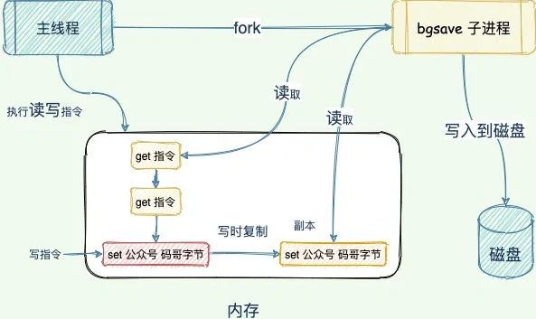

<font style="color:rgb(51, 51, 51);background-color:rgb(248, 246, 244);">图 5-2</font>

<font style="color:rgb(51, 51, 51);background-color:rgb(248, 246, 244);">但 fork 会涉及到复制大量链接对象，一个 24 GB 的大型 Redis 实例执行 bgsave生成 RDB 内存快照文件 需要复制 24 GB / 4 kB * 8 = 48 MB 的页表。</font>

<font style="color:rgb(51, 51, 51);background-color:rgb(248, 246, 244);">此外，</font>**<font style="color:rgb(34, 34, 34);background-color:rgb(248, 246, 244);">slave 在加载 RDB 期间无法提供读写服务，所以主库的数据量大小控制在 2~4G 左右，让从库快速的加载完成</font>**<font style="color:rgb(51, 51, 51);background-color:rgb(248, 246, 244);">。</font>

<font style="color:rgb(51, 51, 51);background-color:rgb(248, 246, 244);">6. 键值对数据集中过期淘汰</font>

<font style="color:rgb(51, 51, 51);background-color:rgb(248, 246, 244);">Redis 有两种方式淘汰过期数据。</font>

+ <font style="color:rgb(51, 51, 51);background-color:rgb(248, 246, 244);">惰性删除：当接收请求的时候检测 key 已经过期，才执行删除。</font>
+ <font style="color:rgb(51, 51, 51);background-color:rgb(248, 246, 244);">定时删除：按照每 100 毫秒的频率删除一些过期的 key。</font>

<font style="color:rgb(51, 51, 51);background-color:rgb(248, 246, 244);">定时删除的算法如下。</font>

1. <font style="color:rgb(51, 51, 51);background-color:rgb(248, 246, 244);">随机采样 CTIVE_EXPIRE_CYCLE_LOOKUPS_PER_LOOP（默认设置为 20）`个数的 key，删除所有过期的 key。</font>
2. <font style="color:rgb(51, 51, 51);background-color:rgb(248, 246, 244);">执行之后，如果发现还有超过 25% 的 key 已过期未被删除，则继续执行步骤一。</font>

<font style="color:rgb(51, 51, 51);background-color:rgb(248, 246, 244);">每秒执行 10 次，一次删除 200 个 key 没啥性能影响。如果触发了第二条，就会导致 Redis 一致在删除过期数据取释放内存。</font>

<font style="color:rgb(51, 51, 51);background-color:rgb(248, 246, 244);">谢霸哥：“码哥，触发条件是什么呀？”</font>

<font style="color:rgb(51, 51, 51);background-color:rgb(248, 246, 244);">大量的 key 设置了相同的时间参数，同一秒内大量 key 过期，需要重复删除多次才能降低到 25% 以下。</font>

**<font style="color:rgb(34, 34, 34);background-color:rgb(248, 246, 244);">简而言之：大量同时到期的 key 可能会导致性能波动。</font>**

**<font style="color:rgb(34, 34, 34);background-color:rgb(248, 246, 244);">解决方案</font>**

<font style="color:rgb(51, 51, 51);background-color:rgb(248, 246, 244);">如果一批 key 的确是同时过期，可以在 EXPIREAT 和 EXPIRE 的过期时间参数上，</font>**<font style="color:rgb(34, 34, 34);background-color:rgb(248, 246, 244);">加上一个一定大小范围内的随机数</font>**<font style="color:rgb(51, 51, 51);background-color:rgb(248, 246, 244);">，这样，既保证了 key 在一个邻近时间范围内被删除，又避免了同时过期造成的压力。</font>

<font style="color:rgb(51, 51, 51);background-color:rgb(248, 246, 244);">7. bigkey</font>

<font style="color:rgb(51, 51, 51);background-color:rgb(248, 246, 244);">谢霸哥：“什么是 Bigkey？key 很大么？”</font>

<font style="color:rgb(51, 51, 51);background-color:rgb(248, 246, 244);">“大”确实是关键字，但是这里的“大”指的是 Redis 中那些存有较大量元素的集合或列表、大对象的字符串占用较大内存空间的键值对数据称为 Bigkey。用几个实际例子来说。</font>

+ <font style="color:rgb(51, 51, 51);background-color:rgb(248, 246, 244);">一个 String 类型的 Key，它的 value 为 5MB（数据过大）。</font>
+ <font style="color:rgb(51, 51, 51);background-color:rgb(248, 246, 244);">一个 List 类型的 Key，它的列表数量为 10000 个（列表数量过多）。</font>
+ <font style="color:rgb(51, 51, 51);background-color:rgb(248, 246, 244);">一个 Zset 类型的 Key，它的成员数量为 10000 个（成员数量过多）。</font>
+ <font style="color:rgb(51, 51, 51);background-color:rgb(248, 246, 244);">一个 Hash 格式的 Key，它的成员数量虽然只有 1000 个但这些成员的 value 总大小为 10MB（成员体积过大）。</font>

<font style="color:rgb(51, 51, 51);background-color:rgb(248, 246, 244);">Bigkey 的存在可能会引发以下问题。</font>

+ **<font style="color:rgb(34, 34, 34);background-color:rgb(248, 246, 244);">内存压力增大：</font>**<font style="color:rgb(51, 51, 51);background-color:rgb(248, 246, 244);"> </font><font style="color:rgb(51, 51, 51);background-color:rgb(248, 246, 244);">大键会占用大量的内存，可能导致 Redis 实例的内存使用率过高，Redis 内存不断变大引发 OOM，或者达到 maxmemory 设置值引发写阻塞或重要 Key 被淘汰。</font>
+ **<font style="color:rgb(34, 34, 34);background-color:rgb(248, 246, 244);">持久化延迟：</font>**<font style="color:rgb(51, 51, 51);background-color:rgb(248, 246, 244);"> </font><font style="color:rgb(51, 51, 51);background-color:rgb(248, 246, 244);">在进行持久化操作（如 RDB 快照、AOF 日志）时，处理 bigkey 可能导致持久化操作的延迟。</font>
+ **<font style="color:rgb(34, 34, 34);background-color:rgb(248, 246, 244);">网络传输压力：</font>**<font style="color:rgb(51, 51, 51);background-color:rgb(248, 246, 244);"> </font><font style="color:rgb(51, 51, 51);background-color:rgb(248, 246, 244);">在主从复制中，如果有 bigkey 的存在，可能导致网络传输的压力增大。</font>
+ <font style="color:rgb(51, 51, 51);background-color:rgb(248, 246, 244);">bigkey 的读请求占用过大带宽，自身变慢的同时影响到该服务器上的其它服务。</font>

<font style="color:rgb(51, 51, 51);background-color:rgb(248, 246, 244);">谢霸哥：“如何解决 Bigkey 问题呢？”</font>

+ **<font style="color:rgb(34, 34, 34);background-color:rgb(248, 246, 244);">定期检测：</font>**<font style="color:rgb(51, 51, 51);background-color:rgb(248, 246, 244);"> </font><font style="color:rgb(51, 51, 51);background-color:rgb(248, 246, 244);">使用工具如 redis-cli 的 --bigkeys 参数进行定期扫描和检测。</font>
+ **<font style="color:rgb(34, 34, 34);background-color:rgb(248, 246, 244);">优化数据结构：</font>**<font style="color:rgb(51, 51, 51);background-color:rgb(248, 246, 244);"> </font><font style="color:rgb(51, 51, 51);background-color:rgb(248, 246, 244);">根据实际业务需求，优化使用的数据结构，例如使用 HyperLogLog 替代 Set。</font>
+ **<font style="color:rgb(34, 34, 34);background-color:rgb(248, 246, 244);">清理不必要的数据：</font>**<font style="color:rgb(51, 51, 51);background-color:rgb(248, 246, 244);"> </font><font style="color:rgb(51, 51, 51);background-color:rgb(248, 246, 244);">Redis 自 4.0 起提供了 UNLINK 命令，该命令能够以非阻塞的方式缓慢逐步的清理传入的 Key，通过 UNLINK，你可以安全的删除大 Key 甚至特大 Key。</font>
+ <font style="color:rgb(51, 51, 51);background-color:rgb(248, 246, 244);">**对大 key 拆分：**如将一个含有数万成员的 HASH Key 拆分为多个 HASH Key，并确保每个 Key 的成员数量在合理范围，在 Redis Cluster 集群中，大 Key 的拆分对 node 间的内存平衡能够起到显著作用。</font>


> 更新: 2025-06-16 11:02:38  
> 原文: <https://www.yuque.com/yuqueyonghue6cvnv/cxhfwd/ue6cfi0wk9wo9xhp>