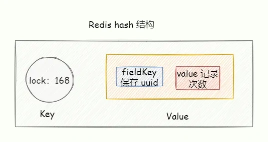
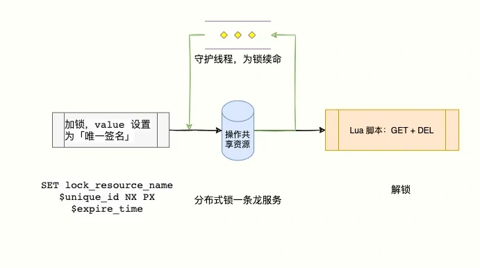

# 032|Redis 可重入分布式锁实现原理

<font style="color:rgb(51, 51, 51);background-color:rgb(248, 246, 244);">我是码哥，可以叫我靓仔。</font>

<font style="color:rgb(51, 51, 51);background-color:rgb(248, 246, 244);">书接上回，码哥上一篇分享了分布式锁如何从错误到残缺，再到青铜版本的高性能 Redis 分布式锁代码实战，让你一飞冲天。</font>

<font style="color:rgb(51, 51, 51);background-color:rgb(248, 246, 244);">这是我们最常用的分布式锁方案，今天码哥给你来一个进阶。</font>

**<font style="color:rgb(34, 34, 34);background-color:rgb(248, 246, 244);">Chaya：「码哥，上次的分布式锁版本虽然好，但是不支持可重入获取锁，还差一点点意思。」</font>**

<font style="color:rgb(51, 51, 51);background-color:rgb(248, 246, 244);">Chaya 别急，今日码哥给你带来一个高性能可重入 Redis 分布式锁解决方案，直捣黄龙，一笑破苍穹。</font>

## **<font style="color:rgb(34, 34, 34);background-color:rgb(248, 246, 244);">什么是可重入锁</font>**
<font style="color:rgb(51, 51, 51);background-color:rgb(248, 246, 244);">当一个线程执行一段代码成功获取锁之后，继续执行时，又遇到加锁的代码，可重入性就就保证线程能继续执行，而不可重入就是需要等待锁释放之后，再次获取锁成功，才能继续往下执行。</font>

```cpp
public synchronized void a() {
    b();
}
public synchronized void b() {
    // doWork
}
```

<font style="color:rgb(51, 51, 51);background-color:rgb(248, 246, 244);">假设 X 线程在 a 方法获取锁之后，继续执行 b 方法，如果此时</font>**<font style="color:rgb(34, 34, 34);background-color:rgb(248, 246, 244);">不可重入</font>**<font style="color:rgb(51, 51, 51);background-color:rgb(248, 246, 244);">，线程就必须等待锁释放，再次争抢锁。</font>

<font style="color:rgb(51, 51, 51);background-color:rgb(248, 246, 244);">锁明明是被 X 线程拥有，却还需要等待自己释放锁，然后再去抢锁，这看起来就很奇怪，我释放我自己~</font>

## **<font style="color:rgb(34, 34, 34);background-color:rgb(248, 246, 244);">可重入锁实现原理</font>**
**<font style="color:rgb(34, 34, 34);background-color:rgb(248, 246, 244);">Chaya：「Redis String 数据结构无法满足可重入锁，key 表示锁定的资源，value 是客户端唯一标识，可重入没地方放了。」</font>**

<font style="color:rgb(51, 51, 51);background-color:rgb(248, 246, 244);">我们可以使用 Redis hash 结构实现，key 表示被锁的共享资源， hash 结构的 fieldKey 存储客户端唯一标识，fieldKey 的 value 则保存加锁的次数。</font>



<font style="color:rgb(51, 51, 51);background-color:rgb(248, 246, 244);">图 5-26</font>

### **<font style="color:rgb(34, 34, 34);background-color:rgb(248, 246, 244);">加锁原理</font>**
<font style="color:rgb(51, 51, 51);background-color:rgb(248, 246, 244);">可重入锁加锁的过程中有以下场景需要考虑。</font>

1. <font style="color:rgb(51, 51, 51);background-color:rgb(248, 246, 244);">锁已经被 A 客户端获取，客户端 B 获取锁失败。</font>
2. <font style="color:rgb(51, 51, 51);background-color:rgb(248, 246, 244);">锁已经被客户端 A 获取，客户端 A 多次执行获取锁操作。</font>
3. <font style="color:rgb(51, 51, 51);background-color:rgb(248, 246, 244);">锁没有被其他客户端获取，那么此刻获取锁的客户端可以获取成功。</font>

<font style="color:rgb(51, 51, 51);background-color:rgb(248, 246, 244);">按照之前的经验，多个操作的原子性可以用 lua 脚本实现。可重入锁加锁 lua 脚本如下。</font>

```plain
if ((redis.call('exists', KEYS[1]) == 0) or
   (redis.call('hexists', KEYS[1], ARGV[2]) == 1)) then
    redis.call('hincrby', KEYS[1], ARGV[2], 1);
    redis.call('pexpire', KEYS[1], ARGV[1]);
  return nil;
end;
return redis.call('pttl', KEYS[1]);
```

+ <font style="color:rgb(51, 51, 51);background-color:rgb(248, 246, 244);">KEYS[1]是 lockKey 表示获取的锁资源，比如 lock:168。</font>
+ <font style="color:rgb(51, 51, 51);background-color:rgb(248, 246, 244);">ARGV[1] 表示表示锁的有效时间（单位毫秒）。</font>
+ <font style="color:rgb(51, 51, 51);background-color:rgb(248, 246, 244);">ARGV[2] 表示客户端唯一标识，在 Redisson 中使用 UUID:ThreadID。</font>

<font style="color:rgb(51, 51, 51);background-color:rgb(248, 246, 244);">下面我来接下是这段脚本的逻辑。</font>

1. <font style="color:rgb(51, 51, 51);background-color:rgb(248, 246, 244);">锁不存在或者锁存在且值与客户端唯一标识匹配，则执行 'hincrby' 和 pexpire指令，接着 return nil。表示的含义就是锁不存在就设置锁并设置锁重入计数值为 1，设置过期时间；锁存在且唯一标识匹配表明当前加锁请求是锁重入请求，锁从如计数 +1，重新锁超时时间。</font>
    - <font style="color:rgb(51, 51, 51);background-color:rgb(248, 246, 244);">redis.call('exists', KEYS[1]) == 0判断锁是否存在，0 表示不存在。</font>
    - <font style="color:rgb(51, 51, 51);background-color:rgb(248, 246, 244);">redis.call('hexists', KEYS[1], ARGV[2]) == 1)锁存在的话，判断 hash 结构中 fieldKey 与客户端的唯一标识是否相等。相等表示当前加锁请求是锁重入。</font>
    - <font style="color:rgb(51, 51, 51);background-color:rgb(248, 246, 244);">redis.call('hincrby', KEYS[1], ARGV[2], 1)将存储在 hash 结构的 ARGV[2] 的值 +1，不存在则支持成 1。</font>
    - <font style="color:rgb(51, 51, 51);background-color:rgb(248, 246, 244);">redis.call('pexpire', KEYS[1], ARGV[1])对 KEYS[1] 设置超时时间。</font>
2. <font style="color:rgb(51, 51, 51);background-color:rgb(248, 246, 244);">锁存在，但是唯一标识不匹配，表明锁被其他线程持有，调用 pttl返回锁剩余的过期时间。</font>

**<font style="color:rgb(34, 34, 34);background-color:rgb(248, 246, 244);">Chaya：「“脚本执行结果返回 nil、锁剩余过期时间有什么目的？”」</font>**

<font style="color:rgb(51, 51, 51);background-color:rgb(248, 246, 244);">当且仅当返回 nil才表示加锁成功；客户端需要感知锁是否成功的结果。</font>

### **<font style="color:rgb(34, 34, 34);background-color:rgb(248, 246, 244);">解锁原理</font>**
<font style="color:rgb(51, 51, 51);background-color:rgb(248, 246, 244);">解锁逻辑复杂一些，不仅要保证不能删除别人的锁。还要确保，重入次数为 0 才能解锁。</font>

<font style="color:rgb(51, 51, 51);background-color:rgb(248, 246, 244);">解锁代码执行方式与加锁类似，三个返回值含义如下。</font>

+ <font style="color:rgb(51, 51, 51);background-color:rgb(248, 246, 244);">1 代表解锁成功，锁被释放。</font>
+ <font style="color:rgb(51, 51, 51);background-color:rgb(248, 246, 244);">0 代表可重入次数被减 1。</font>
+ <font style="color:rgb(51, 51, 51);background-color:rgb(248, 246, 244);">nil 代表其他线程尝试解锁，解锁失败。</font>

```plain
if (redis.call('hexists', KEYS[1], ARGV[2]) == 0) then
    return nil;
end;
local counter = redis.call('hincrby', KEYS[1], ARGV[2], -1);
if (counter > 0) then
    redis.call('pexpire', KEYS[1], ARGV[1]);
    return 0;
else
    redis.call('del', KEYS[1]);
    return 1;
end;
return nil;
```

+ <font style="color:rgb(51, 51, 51);background-color:rgb(248, 246, 244);">KEYS[1]是 lockKey，表示锁的资源，比如 lock:order:pay。</font>
+ <font style="color:rgb(51, 51, 51);background-color:rgb(248, 246, 244);">ARGV[1]，锁的超时时间。</font>
+ <font style="color:rgb(51, 51, 51);background-color:rgb(248, 246, 244);">ARGV[2]，Hash 表的 FieldKey。</font>

<font style="color:rgb(51, 51, 51);background-color:rgb(248, 246, 244);">首先使用 hexists 判断 Redis 的 Hash 表是否存在 fileKey，如果不存在则直接返回 nil解锁失败。</font>

<font style="color:rgb(51, 51, 51);background-color:rgb(248, 246, 244);">若存在的情况下，且唯一标识匹配，使用 hincrby 对 fileKey 的值 -1，然后判断计算之后可重入次数。当前值 > 0 表示持有的锁存在重入情况，重新设置超时时间，返回值 1；</font>

<font style="color:rgb(51, 51, 51);background-color:rgb(248, 246, 244);">若值小于等于 0，表明锁释放了，执行 del释放锁。</font>

**<font style="color:rgb(34, 34, 34);background-color:rgb(248, 246, 244);">Chaya：“可重入锁很好，依然存在的一个问题是：加锁后，业务逻辑执行耗时超过了 lockKey 的过期时间，lockKey 会被 Reids 删除。”</font>**

<font style="color:rgb(51, 51, 51);background-color:rgb(248, 246, 244);">这个时间不能瞎写，一般要根据在测试环境多次测试，然后压测多轮之后，比如计算出接口平均执行时间 200 ms。那么锁的</font>**<font style="color:rgb(34, 34, 34);background-color:rgb(248, 246, 244);">超时时间就放大为平均执行时间的 3~5 倍。</font>**

**<font style="color:rgb(34, 34, 34);background-color:rgb(248, 246, 244);">Chaya：“锁的超时时间怎么计算合适呢？”</font>**

<font style="color:rgb(51, 51, 51);background-color:rgb(248, 246, 244);">这个时间不能瞎写，一般要根据在测试环境多次测试，然后压测多轮之后，比如计算出接口平均执行时间 200 ms。那么锁的</font>**<font style="color:rgb(34, 34, 34);background-color:rgb(248, 246, 244);">超时时间就放大为平均执行时间的 3~5 倍。</font>**

**<font style="color:rgb(34, 34, 34);background-color:rgb(248, 246, 244);">Chaya：“为啥要放大呢？”</font>**

<font style="color:rgb(51, 51, 51);background-color:rgb(248, 246, 244);">因为如果锁的操作逻辑中有网络 IO 操作、JVM FullGC 等，线上的网络不会总一帆风顺，我们要给网络抖动留有缓冲时间。</font>

**<font style="color:rgb(34, 34, 34);background-color:rgb(248, 246, 244);">Chaya：“有没有完美的方案呢？不管时间怎么设置都不大合适。”</font>**

<font style="color:rgb(51, 51, 51);background-color:rgb(248, 246, 244);">我们可以让获得锁的线程开启一个</font>**<font style="color:rgb(34, 34, 34);background-color:rgb(248, 246, 244);">守护线程</font>**<font style="color:rgb(51, 51, 51);background-color:rgb(248, 246, 244);">，用来给当前客户端快要过期的锁续航，续命的前提是，得判断是不是当前进程持有的锁，如果不是就不进行续。</font>

**<font style="color:rgb(34, 34, 34);background-color:rgb(248, 246, 244);">如果快要过期，但是业务逻辑还没执行完成，自动对这个锁进行续期，重新设置过期时间。</font>**



<font style="color:rgb(51, 51, 51);background-color:rgb(248, 246, 244);">图 5-27</font>

<font style="color:rgb(51, 51, 51);background-color:rgb(248, 246, 244);">这就是下一篇我要说的超神方案，加入看门狗机制实现锁自动续期。不过锁自动续期比较复杂，今天的 Redis 可重入分布式锁王者方案已经可以让你称霸武林，接下来上实战。</font>

## **<font style="color:rgb(34, 34, 34);background-color:rgb(248, 246, 244);">Rerdis 可重入分布式锁 SpringBoot 实战</font>**
<font style="color:rgb(51, 51, 51);background-color:rgb(248, 246, 244);">关于 Spring Boot 的环境搭建以及普通分布式锁实战详见上一篇</font>[<font style="color:rgb(177, 75, 67);background-color:rgb(248, 246, 244);">《纠正误区：这才是 SpringBoot Redis 分布式锁的正确实现方式》</font>](https://mp.weixin.qq.com/s?__biz=MzkzMDI1NjcyOQ==&mid=2247502863&idx=1&sn=f86c54409720da32704eb7215daf6f1c&chksm=c27f8e39f508072febfa318240ba8fb869ddb43a46603809c8cc4718ada8873aacc339bc8758&token=1881791023&lang=zh_CN#rd)<font style="color:rgb(51, 51, 51);background-color:rgb(248, 246, 244);">。今天直接上可重入锁核心代码。</font>

### **<font style="color:rgb(34, 34, 34);background-color:rgb(248, 246, 244);">ReentrantDistributedLock</font>**
<font style="color:rgb(51, 51, 51);background-color:rgb(248, 246, 244);">可重入锁由ReentrantDistributedLock标识，它实现 Lock接口，构造方法实现 resourceName 和 StringRedisTemplate 的属性设置。</font>

<font style="color:rgb(51, 51, 51);background-color:rgb(248, 246, 244);">客户端唯一标识使用uuid:threadId 组成。</font>

```plain
public class ReentrantDistributedLock implements Lock {

    /**
     * 锁超时时间，默认 30 秒
     */
    protected long internalLockLeaseTime = 30000;

    /**
     * 标识 id
     */
    private final String id = UUID.randomUUID().toString();

    /**
     * 资源名称
     */
    private final String resourceName;

    private final List<String> keys = new ArrayList<>(1);


    /**
     * Redis 客户端
     */
    private final StringRedisTemplate redisTemplate;

    public ReentrantDistributedLock(String resourceName, StringRedisTemplate redisTemplate) {
        this.resourceName = resourceName;
        this.redisTemplate = redisTemplate;
        keys.add(resourceName);
    }
}
```

### **<font style="color:rgb(34, 34, 34);background-color:rgb(248, 246, 244);">加锁 tryLock、lock</font>**
<font style="color:rgb(51, 51, 51);background-color:rgb(248, 246, 244);">tryLock 以阻塞等待 waitTime 时间的方式来尝试获取锁。获取成功则返回 true，反之 false。</font>

<font style="color:rgb(51, 51, 51);background-color:rgb(248, 246, 244);">与 tryLock不同的是， lock 一直尝试自旋阻塞等待获取分布式锁，直到获取成功为止。而 tryLock 只会阻塞等待 waitTime 时间。</font>

```java
@Override
public boolean tryLock(long waitTime, long leaseTime, TimeUnit unit) throws InterruptedException {
    long time = unit.toMillis(waitTime);
    long current = System.currentTimeMillis();
    long threadId = Thread.currentThread().getId();
    // lua 脚本获取锁
    Long ttl = tryAcquire(leaseTime, unit, threadId);
    // lock acquired
    if (ttl == null) {
        return true;
    }

    time -= System.currentTimeMillis() - current;
    // 等待时间用完，获取锁失败
    if (time <= 0) {
        return false;
    }
    // 自旋获取锁
    while (true) {
        long currentTime = System.currentTimeMillis();
        ttl = tryAcquire(leaseTime, unit, threadId);
        // lock acquired
        if (ttl == null) {
            return true;
        }

        time -= System.currentTimeMillis() - currentTime;
        if (time <= 0) {
            return false;
        }
    }
}

@Override
public void lock(long leaseTime, TimeUnit unit) {
    long threadId = Thread.currentThread().getId();
    Long ttl = tryAcquire(leaseTime, unit, threadId);
    // lock acquired
    if (ttl == null) {
        return;
    }
    do {
        ttl = tryAcquire(leaseTime, unit, threadId);
        // lock acquired
    } while (ttl != null);
}

private Long tryAcquire(long leaseTime, TimeUnit unit, long threadId) {
    // 执行 lua 脚本
    DefaultRedisScript<Long> redisScript = new DefaultRedisScript<>(LuaScript.reentrantLockScript(), Long.class);
    return redisTemplate.execute(redisScript, keys, String.valueOf(unit.toMillis(leaseTime)), getRequestId(threadId));
}

private String getRequestId(long threadId) {
    return id + ":" + threadId;
}
```

### **<font style="color:rgb(34, 34, 34);background-color:rgb(248, 246, 244);">解锁 unlock</font>**
```plain
public void unlock() {
        long threadId = Thread.currentThread().getId();

        // 执行 lua 脚本
        DefaultRedisScript<Long> redisScript = new DefaultRedisScript<>(LuaScript.reentrantUnlockScript(), Long.class);
        Long opStatus = redisTemplate.execute(redisScript, keys, String.valueOf(internalLockLeaseTime), getRequestId(threadId));

        if (opStatus == null) {
            throw new IllegalMonitorStateException("attempt to unlock lock, not locked by current thread by node id: "
                    + id + " thread-id: " + threadId);
        }


    }
```

### **<font style="color:rgb(34, 34, 34);background-color:rgb(248, 246, 244);">LuaScript</font>**
<font style="color:rgb(51, 51, 51);background-color:rgb(248, 246, 244);">这个脚本就是在讲解可重入分布式锁原理具体逻辑已经解释过，这里就不再重复分析。</font>

```csharp
public class LuaScript {

    private LuaScript() {

    }

    /**
     * 可重入分布式锁加锁脚本
     *
     * @return 当且仅当返回 `nil`才表示加锁成功；返回锁剩余过期时间是让客户端感知锁是否成功。
     */
    public static String reentrantLockScript() {
        return "if ((redis.call('exists', KEYS[1]) == 0) " +
                "or (redis.call('hexists', KEYS[1], ARGV[2]) == 1)) then " +
                "redis.call('hincrby', KEYS[1], ARGV[2], 1); " +
                "redis.call('pexpire', KEYS[1], ARGV[1]); " +
                "return nil; " +
                "end; " +
                "return redis.call('pttl', KEYS[1]);";
    }

    /**
     * 可重入分布式锁解锁脚本
     *
     * @return 当且仅当返回 `nil`才表示解锁成功；
     */
    public static String reentrantUnlockScript() {
        return "if (redis.call('hexists', KEYS[1], ARGV[2]) == 0) then " +
                "return nil;" +
                "end; " +
                "local counter = redis.call('hincrby', KEYS[1], ARGV[2], -1); " +
                "if (counter > 0) then " +
                "redis.call('pexpire', KEYS[1], ARGV[1]); " +
                "return 0; " +
                "else " +
                "redis.call('del', KEYS[1]); " +
                "return 1; " +
                "end; " +
                "return nil;";
    }
}
```

### **<font style="color:rgb(34, 34, 34);background-color:rgb(248, 246, 244);">RedisLockClient</font>**
<font style="color:rgb(51, 51, 51);background-color:rgb(248, 246, 244);">最后，还需要提供一个客户端给方便使用。</font>

```typescript
@Component
public class RedisLockClient {

    @Autowired
    private StringRedisTemplate redisTemplate;

    /**
     * 获取可重入分布式锁
     * @param name
     * @return
     */
    public Lock getReentrantLock(String name) {
        return new ReentrantDistributedLock(name, redisTemplate);
    }

}
```

<font style="color:rgb(51, 51, 51);background-color:rgb(248, 246, 244);">单元测试走一个，验证下分布式锁是否支持可重入。</font>

```java
@Slf4j
@SpringBootTest(classes = RedisApplication.class)
public class RedisLockTest {

    @Autowired
    private RedisLockClient redisLockClient;

    @Test
    public void testTryReentrantLockSuccess() throws InterruptedException {
        Lock lock = redisLockClient.getReentrantLock("order:pay");
        try {
            boolean isLock = lock.tryLock(10, 30, TimeUnit.SECONDS);
            if (!isLock) {
                log.warn("加锁失败");
                return;
            }
            // 重复加锁
            reentrant(lock);

            log.info("业务逻辑执行完成");
        } finally {
            lock.unlock();
        }

    }

    private void reentrant(Lock lock) throws InterruptedException {
        try {
            boolean isLock = lock.tryLock(10, 30, TimeUnit.SECONDS);
            if (!isLock) {
                log.warn("加锁失败");
                return;
            }

            log.info("业务逻辑执行完成");
        } finally {
            lock.unlock();
        }
    }

}
```

<font style="color:rgb(51, 51, 51);background-color:rgb(248, 246, 244);">有两个点需要注意。</font>

1. <font style="color:rgb(51, 51, 51);background-color:rgb(248, 246, 244);">释放锁的代码一定要放在 finally{} 块中。否则一旦执行业务逻辑过程中抛出异常，程序就无法执行释放锁的流程。只能干等着锁超时释放。</font>
2. <font style="color:rgb(51, 51, 51);background-color:rgb(248, 246, 244);">加锁的代码应该写在 try {} 代码中，放在 try 外面的话，如果执行加锁异常（客户端网络连接超时），但是实际指令已经发送到服务端并执行，就会导致没有机会执行解锁的代码。</font>

**<font style="color:rgb(34, 34, 34);background-color:rgb(248, 246, 244);">CHaya：“码哥，这个方案确实很王者，大开眼界，接下来的超神版可以实现看门狗自动续期么？”</font>**

<font style="color:rgb(51, 51, 51);background-color:rgb(248, 246, 244);">鉴于篇幅有限，今天就跟大家介绍 Redis 可重入分布式锁王者方案，关注我，下一篇给你分享、超神版分布式锁解决方案。</font>


> 更新: 2025-06-16 11:03:10  
> 原文: <https://www.yuque.com/yuqueyonghue6cvnv/cxhfwd/cddrel8iv09og67r>