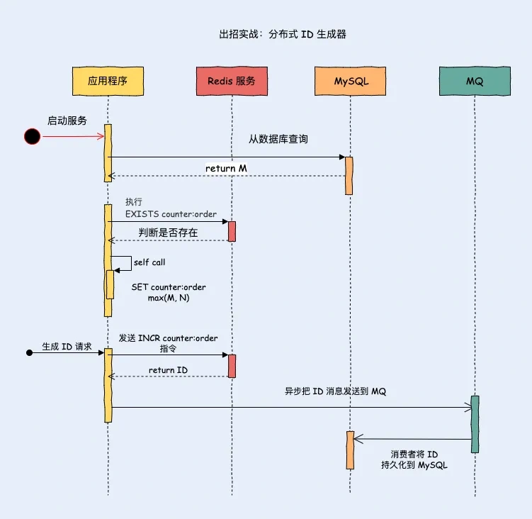

# 033|Redis 实现分布式 ID 生成器

<font style="color:rgb(51, 51, 51);background-color:rgb(248, 246, 244);">我相信你会经常遇到要生成唯一 ID 的场景，比如标识每次请求、生成一个订单编号、创建用户需要创建一个用户 ID。</font>

**<font style="color:rgb(34, 34, 34);background-color:rgb(248, 246, 244);">谢霸戈：这还不简单，用UUID不就行了。</font>**

<font style="color:rgb(51, 51, 51);background-color:rgb(248, 246, 244);">UUID确实是个好东西，生成的ID全球唯一，但是有两个致命缺陷。</font>

+ <font style="color:rgb(51, 51, 51);background-color:rgb(248, 246, 244);">不是递增的。MySQL 中索引的数据结构是 B+Tree，这种数据结构的特点是索引树上的节点的数据是有序的，而如果使用 UUID 作为主键，那么每次插入数据时，因为无法保证每次产生的 UUID 有序，所以就会出现新的 UUID 需要插入到索引树的中间去，这样可能会频繁地导致页分裂，使性能下降。</font>
+ <font style="color:rgb(51, 51, 51);background-color:rgb(248, 246, 244);">太占用内存。每个 UUID 由 36 个字符组成，在字符串进行比较时，需要从前往后比较，字符串越长，性能越差。另外字符串越长，占用的内存越大，由于页的大小是固定的，这样一个页上能存放的关键字数量就会越少，这样最终就会导致索引树的高度越大，在索引搜索的时候，发生的磁盘 IO 次数越多，性能越差。</font>

**<font style="color:rgb(34, 34, 34);background-color:rgb(248, 246, 244);">谢霸戈：那咋办呢？</font>**

<font style="color:rgb(51, 51, 51);background-color:rgb(248, 246, 244);">别急，今天我就给大家带来一个神器级的解决方案——Redis分布式ID生成器！配合SpringBoot3.0，让你的ID生成变得既简单又高效。</font>

## **<font style="color:rgb(34, 34, 34);background-color:rgb(248, 246, 244);">分布式 ID 要满足什么要求</font>**
**<font style="color:rgb(34, 34, 34);background-color:rgb(248, 246, 244);">在进入正文前，先介绍下分布式 ID 应该满足哪些特性。</font>**

<font style="color:rgb(51, 51, 51);background-color:rgb(248, 246, 244);">分布式 ID 生成器需要满足以下特性。</font>

1. <font style="color:rgb(51, 51, 51);background-color:rgb(248, 246, 244);">有序性之单调递增，想要分而治之、二分法查找就必须实现。另外，MySQL 是你们用的最多的数据库，B+ 树为了维护 ID 的有序性，就会频繁的在索引的中间位置插入而挪动后面节点的位置，甚至导致频繁的页分裂，这对于性能的影响是极大的。</font>
2. <font style="color:rgb(51, 51, 51);background-color:rgb(248, 246, 244);">全局唯一性，ID 不唯一就会出现主键冲突。</font>
3. <font style="color:rgb(51, 51, 51);background-color:rgb(248, 246, 244);">高性能，生成 ID 是高频操作，如果性能缓慢，系统的整体性能都会受到限制。</font>
4. <font style="color:rgb(51, 51, 51);background-color:rgb(248, 246, 244);">高可用，也就是在给定的时间间隔内，一个系统总的可用时间占的比例。</font>
5. <font style="color:rgb(51, 51, 51);background-color:rgb(248, 246, 244);">存储空间小，用 MySQL 的 InnoDB B+树来说，普通索引（非聚集索引）会存储主键值，主键越大，每个 Page 页可以存储的数据就越少，访问磁盘 I/O 的次数就会增加。</font>

## **<font style="color:rgb(34, 34, 34);background-color:rgb(248, 246, 244);">Redis String 实现分布式 ID</font>**
<font style="color:rgb(51, 51, 51);background-color:rgb(248, 246, 244);">Redis 集群能保证高可用和高性能，为了节省内存，ID 可以使用数字的形式，并且通过递增的方式来创建新的 ID。</font>

<font style="color:rgb(51, 51, 51);background-color:rgb(248, 246, 244);">防止重启数据丢失，你还需要把 Redis AOF 持久化开启。</font>

**<font style="color:rgb(34, 34, 34);background-color:rgb(248, 246, 244);">MySQL：“开启 AOF 持久，为了性能设置成 everysec 策略还是有可能丢失一秒的数据，所以你还可以使用一个异步机制将生成的最大 ID 持久化到一个 MySQL。”</font>**

<font style="color:rgb(51, 51, 51);background-color:rgb(248, 246, 244);">好主意，在生成 ID 之后发送一条消息到 MQ 消息队列中，把值持久化到 MySQL 中。</font>

<font style="color:rgb(51, 51, 51);background-color:rgb(248, 246, 244);">我们可以使用 Redis String 数据类型来实现，key 用于区分不同业务场景的 ID 生成器，value 存储 ID。</font>

<font style="color:rgb(51, 51, 51);background-color:rgb(248, 246, 244);">String 数据类型提供了 INCR 指令，它能把 key 中存储的数字加 1 并返回客户端。如果 key 不存在，那么 key 的 value 先被初始化成 0，再执行加 1 操作并返回给客户端。</font>

<font style="color:rgb(51, 51, 51);background-color:rgb(248, 246, 244);">Redis，作为一个高性能的内存数据库，天生就适合处理高并发的场景。它的“单线程”模型更是让它在处理ID生成时如鱼得水。</font>

<font style="color:rgb(51, 51, 51);background-color:rgb(248, 246, 244);">Redis的操作是原子性的，这就意味着在整个过程中，不会有任何的并发问题出现，从而确保了ID的唯一性。</font>

### **<font style="color:rgb(34, 34, 34);background-color:rgb(248, 246, 244);">设计思路</font>**
<font style="color:rgb(51, 51, 51);background-color:rgb(248, 246, 244);">设计思路如下图所示。</font>



<font style="color:rgb(51, 51, 51);background-color:rgb(248, 246, 244);">图 2-4</font>

1. <font style="color:rgb(51, 51, 51);background-color:rgb(248, 246, 244);">假设订单 ID 生成器的 key 是“counter:order”，当应用服务启动的时候先从数据库中查询出最大值 M。执行 EXISTS counter:order 判断是否存在 key。</font>
    - <font style="color:rgb(51, 51, 51);background-color:rgb(248, 246, 244);">Redis 中不存在 key “counter:order”，执行 SET counter:order M 将 M 值作写入 Redis。</font>
    - <font style="color:rgb(51, 51, 51);background-color:rgb(248, 246, 244);">Redis 中存在 key “counter:order”，值为 K，那么就比较 M 和 K 的值，执行 SET counter:order max(M, N)将最大值写入 Redis，相等的话就不操作。</font>
2. <font style="color:rgb(51, 51, 51);background-color:rgb(248, 246, 244);">应用服务启动完成后，每次需要生成 ID 的时候，应用程序就向 Redis 服务器发送 INCR counter:order指令。</font>
3. <font style="color:rgb(51, 51, 51);background-color:rgb(248, 246, 244);">应用程序将获取到的 ID 值发送到 MQ 消息队列，消费者监听队列把值更新到 MySQL。</font>

## **<font style="color:rgb(34, 34, 34);background-color:rgb(248, 246, 244);">SpringBoot 代码实现</font>**
<font style="color:rgb(51, 51, 51);background-color:rgb(248, 246, 244);">接下来，我们结合SpringBoot3.0来打造一个强大且易用的Redis分布式ID生成器。</font>

<font style="color:rgb(51, 51, 51);background-color:rgb(248, 246, 244);">首先，我们需要在SpringBoot项目中引入redis的依赖。在pom.xml文件中添上这行代码：</font>

```xml
<dependency>
   <groupId>org.springframework.boot</groupId>
   <artifactId>spring-boot-starter-data-redis</artifactId>
</dependency>
```

<font style="color:rgb(51, 51, 51);background-color:rgb(248, 246, 244);">搞定依赖后，我们得告诉SpringBoot怎么连接到Redis。打开application.yml文件，填上Redis的服务地址和端口：</font>

```plain
spring:
  application:
    name: redis
  redis:
    host: 127.0.0.1
    port: 6379
    password: magebyte
    timeout: 6000
```

<font style="color:rgb(51, 51, 51);background-color:rgb(248, 246, 244);">万事俱备，只欠东风！接下来，我们编写一个ID生成器工具类。这个工具类负责与Redis交互，生成唯一的ID。这里我们使用Redis的INCR命令，它能让ID自增，确保每次获取的ID都是唯一的。</font>

```java
@Component
public class OrderIdGenerator implements InitializingBean {

    private final StringRedisTemplate redisTemplate;

    /**
     * 操作数据库 dao
     */
    private final IdGeneratorMapper idGeneratorMapper;

    private static final String KEY = "counter:order";

    /**
     * 数据库中的 ID 值
     */
    private String dbId;

    @Autowired
    public OrderIdGenerator(StringRedisTemplate redisTemplate, IdGeneratorMapper idGeneratorMapper) {
        this.redisTemplate = redisTemplate;
        this.idGeneratorMapper = idGeneratorMapper;
    }

    public Long generateId(String key) {
        return redisTemplate.opsForValue().increment(key, 1);
    }

    @Override
    public void afterPropertiesSet() throws Exception {
        // 从数据库查询最大 ID
        this.dbId = idGeneratorMapper.getMaxID(KEY);

        Boolean hasKey = redisTemplate.hasKey(KEY);
        if (Boolean.TRUE.equals(hasKey)) {
            // key 存在，比较 dbId 与 redisValue，取出最大值
            String redisValue = redisTemplate.opsForValue().get(KEY);
            String targetValue = max(this.dbId, redisValue);
        } else {
```

### **<font style="color:rgb(34, 34, 34);background-color:rgb(248, 246, 244);">自定义 ID 规则</font>**
<font style="color:rgb(51, 51, 51);background-color:rgb(248, 246, 244);">不过呢，光有唯一的ID还不够，我们还得让它更符合业务的实际需求。比如订单编号吧，我们可能希望它的格式是ORD-20240528-0001，其中ORD是业务标识，20240528是日期，0001是当天的序号。</font>

```plain
public String generateCustomId(String key, String prefix, String datePattern) {
    long sequence = redisTemplate.opsForValue().increment(key, 1);
    return String.format("%s-%s-%04d", prefix, new SimpleDateFormat(datePattern).format(new Date()), sequence);
}
```

<font style="color:rgb(51, 51, 51);background-color:rgb(248, 246, 244);">那具体怎么用呢？让我们在业务代码中一探究竟！想象一下，在一个电商系统中，当一个新的订单如流星般划过天际，我们迫不及待地想要一个独一无二的ID来标记它时——很简单，只需调用我们的generateCustomId方法，传入订单相关的参数即可。</font>

```java
@Service
public class OrderService {
    private final RedisIdGenerator idGenerator;

    @Autowired
    public OrderService(RedisIdGenerator idGenerator) {
        this.idGenerator = idativeIdGenerator;
    }

    public Order createOrder(OrderRequest request) {
        String orderId = idGenerator.generateCustomId("order:id", "ORD", "yyyyMMdd");
        Order order = new Order();
        order.setId(orderId);
        // 其他业务逻辑...
        return order;
    }
}
```


> 更新: 2025-06-16 11:03:26  
> 原文: <https://www.yuque.com/yuqueyonghue6cvnv/cxhfwd/egn8a7qz02qqczp3>