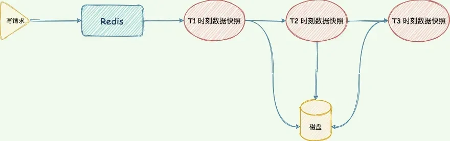
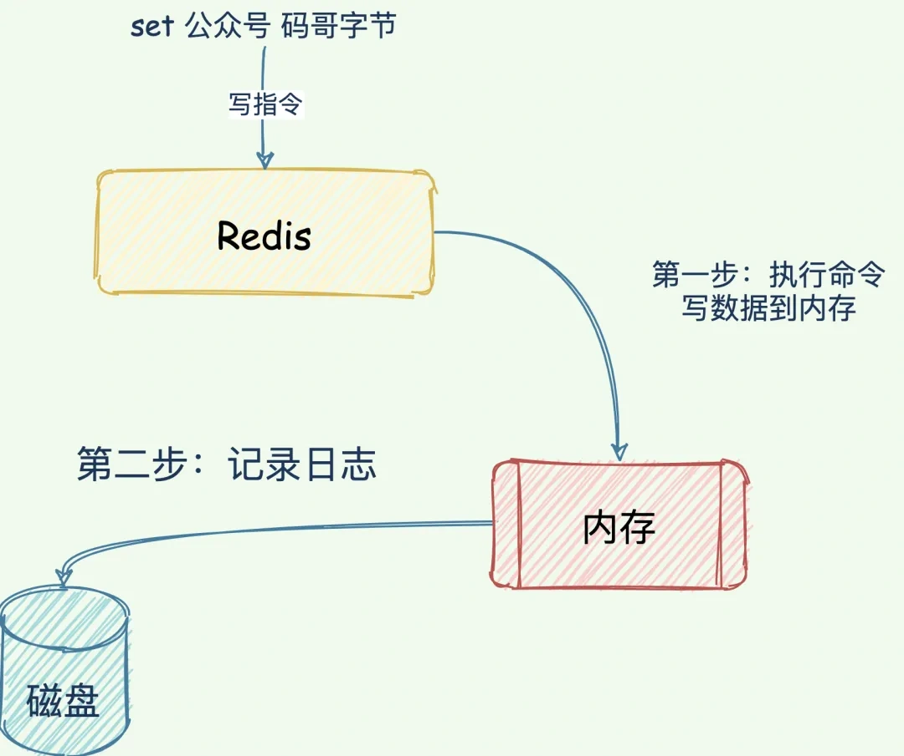
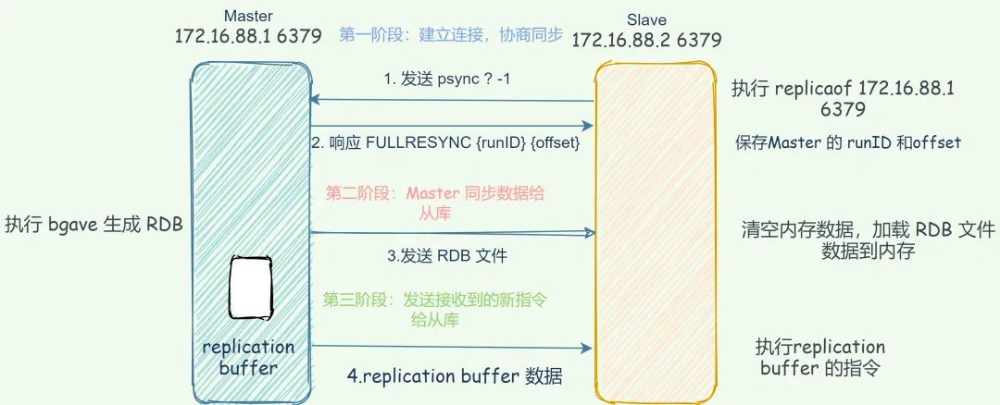
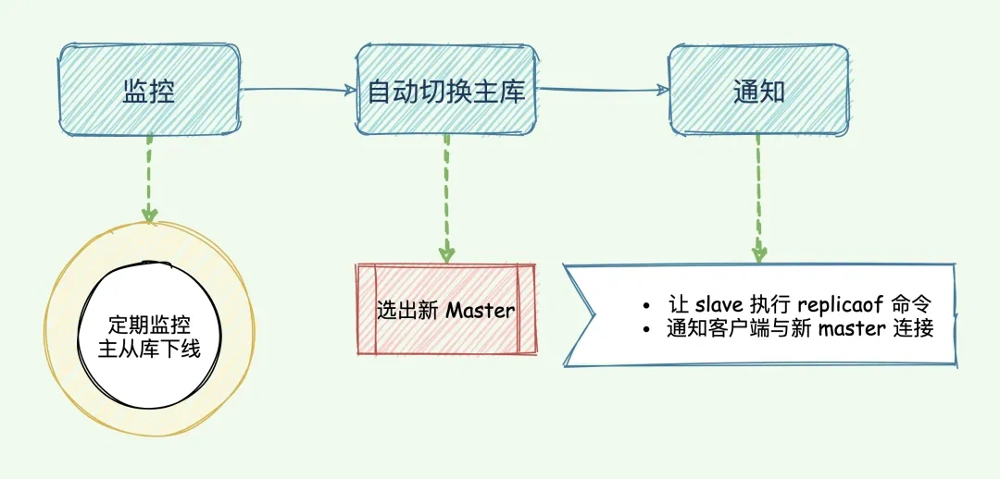
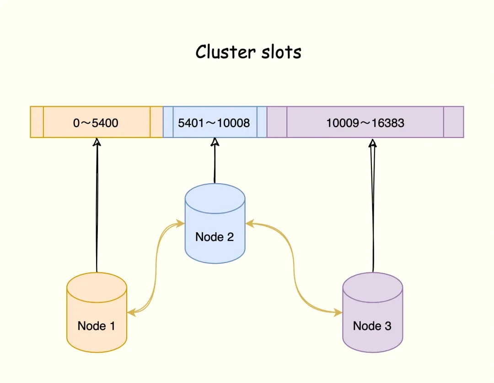
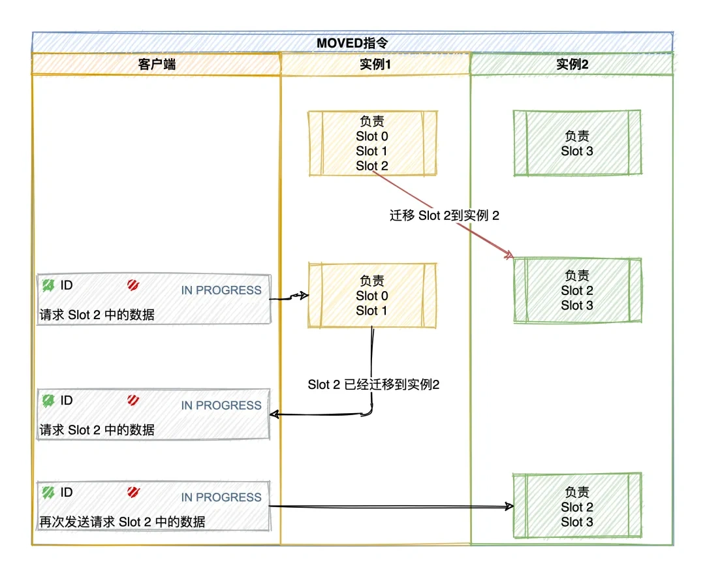

# 035|Redis 高可用篇章中面试最常见的 6 个问题！

<font style="color:rgb(51, 51, 51);background-color:rgb(248, 246, 244);">大家好，我是码哥，今天跟大家分享几个 Redis 高可用篇章中面试最常见的 6 个问题。</font>

1. <font style="color:rgb(51, 51, 51);background-color:rgb(248, 246, 244);">Redis 如何实现持久化？</font>
2. <font style="color:rgb(51, 51, 51);background-color:rgb(248, 246, 244);">Redis 高可用方案有哪些？</font>
3. <font style="color:rgb(51, 51, 51);background-color:rgb(248, 246, 244);">主从异步复制同步实现原理？</font>
4. <font style="color:rgb(51, 51, 51);background-color:rgb(248, 246, 244);">sentinel 哨兵集群？</font>
5. <font style="color:rgb(51, 51, 51);background-color:rgb(248, 246, 244);">Redis Cluster 是什么？</font>
6. <font style="color:rgb(51, 51, 51);background-color:rgb(248, 246, 244);">为什么集群的 slots 是 16384？</font>

## **<font style="color:rgb(34, 34, 34);background-color:rgb(248, 246, 244);">Reds 如何实现持久化？</font>**
<font style="color:rgb(51, 51, 51);background-color:rgb(248, 246, 244);">Chaya 转行做程序员，去大厂面试被面试官问到：“Redis 如何实现持久化？”</font>

<font style="color:rgb(51, 51, 51);background-color:rgb(248, 246, 244);">Chaya 心想：“好家伙，我学了码哥的 Redis 高手心法，这不要起飞么，是时候展示真正的技术了。”</font>

<font style="color:rgb(51, 51, 51);background-color:rgb(248, 246, 244);">Redis 有两个方式实现了数据持久化，他们分别是 RDB 快照和 AOF（Append Only File）。RDB 内存快照是全量持久化，AOF 做增量持久化。</font>

### **<font style="color:rgb(34, 34, 34);background-color:rgb(248, 246, 244);">RDB 内存快照</font>**


<font style="color:rgb(51, 51, 51);background-color:rgb(248, 246, 244);">RDB内存快照</font>

<font style="color:rgb(51, 51, 51);background-color:rgb(248, 246, 244);">bgsave 指令会调用 glibc 的函数fork产生一个子进程用于写入临时 RDB 文件，快照持久化完全交给子进程来处理，完成后自动结束，</font>**<font style="color:rgb(34, 34, 34);background-color:rgb(248, 246, 244);">父进程可以继续处理客户端请求</font>**<font style="color:rgb(51, 51, 51);background-color:rgb(248, 246, 244);">，阻塞只发生在 fork 阶段，时间很短，当子进程写完新的 RDB 文件后，它会替换旧的 RDB 文件。</font>

<font style="color:rgb(51, 51, 51);background-color:rgb(248, 246, 244);">RDB 文件实时性不够，宕机的时候可能会导致大量数据丢失。此外，fork 子进程属于重量级操作，执行成本比较高，频繁生成 RDB 文件，磁盘压力也会过大。</font>

### **<font style="color:rgb(34, 34, 34);background-color:rgb(248, 246, 244);">AOF</font>**
<font style="color:rgb(51, 51, 51);background-color:rgb(248, 246, 244);">AOF （Append Only File）持久化记录的是服务器接收的每个写操作，在服务器启动执行重放还原数据集。由于 AOF 记录的是一个个指令内容，故障恢复的时候需要执行每一个指令，如果日志文件太大，整个恢复过程就会非常缓慢。</font>



<font style="color:rgb(51, 51, 51);background-color:rgb(248, 246, 244);">AOF写后日志</font>

<font style="color:rgb(51, 51, 51);background-color:rgb(248, 246, 244);">所以，还需配合 AOF 来使用。简单来说，</font>**<font style="color:rgb(34, 34, 34);background-color:rgb(248, 246, 244);">RDB 内存快照以一定的频率执行，在两次快照之间，使用 AOF 日志记录这期间的所有写操作。</font>**

<font style="color:rgb(51, 51, 51);background-color:rgb(248, 246, 244);">如此一来，快照就不需要频繁执行，避免了 fork 对主线程的性能影响，AOF 不再是全量日志，而是生成 RDB 快照时间的增量 AOF 日志</font>

**<font style="color:rgb(34, 34, 34);background-color:rgb(248, 246, 244);">面试官：“如果机器突然掉电会怎样？”</font>**

<font style="color:rgb(51, 51, 51);background-color:rgb(248, 246, 244);">Chaya 假装思考一下，说道：“取决于 AOF 配置项appendfsync写回策略。always同步写回可以做到数据不丢失，但是每个写指令都需要写入磁盘，性能最差。</font>

<font style="color:rgb(51, 51, 51);background-color:rgb(248, 246, 244);">everysec每秒写回，避免了同步写回的性能开销，发生宕机可能有一秒位写入磁盘的数据丢失，在性能和可靠性之间做了折中。”</font>

<font style="color:rgb(51, 51, 51);background-color:rgb(248, 246, 244);">这时候，面试官心想这候选人，有点东西。</font>

<font style="color:rgb(51, 51, 51);background-color:rgb(248, 246, 244);">Chaya 继续补充道：“为了避免 AOF 文件体积膨胀的问题，还有一个 AOF 重写机制对文件瘦身。在 7.0 版本还做了优化，提出了 Multi-Part AOF 机制，因为在 7.0 之前的版本中 AOF Rewrite 过程中，主进程除了把写指令写到 AOF 缓冲区以外，还要写到 AOF 重写缓冲区中。一份数据要写两个缓冲区，还要写到两个 AOF 文件，产生两次磁盘 I/O ，太浪费了。”</font>

## **<font style="color:rgb(34, 34, 34);background-color:rgb(248, 246, 244);">Redis 高可用方案有哪些？</font>**
**<font style="color:rgb(34, 34, 34);background-color:rgb(248, 246, 244);">高可用有两个含义：一是数据尽量不丢失，二是服务尽可能提供服务。</font>**<font style="color:rgb(51, 51, 51);background-color:rgb(248, 246, 244);"> Redis 高可用方案严格意义上来说有 3 种。</font>

1. <font style="color:rgb(51, 51, 51);background-color:rgb(248, 246, 244);">主从复制架构，这是后两个方案的基石。</font>
2. <font style="color:rgb(51, 51, 51);background-color:rgb(248, 246, 244);">sentinel 哨兵集群。</font>
3. <font style="color:rgb(51, 51, 51);background-color:rgb(248, 246, 244);">Redis Cluster 集群，极力推荐该方式。</font>

### **<font style="color:rgb(34, 34, 34);background-color:rgb(248, 246, 244);">1. 主从异步复制同步</font>**
<font style="color:rgb(51, 51, 51);background-color:rgb(248, 246, 244);">主从异步复制架构是高可用的基石，主要分为 RDB 内存快照文件全量同步和增量同步。</font>

**<font style="color:rgb(34, 34, 34);background-color:rgb(248, 246, 244);">全量同步</font>**

<font style="color:rgb(51, 51, 51);background-color:rgb(248, 246, 244);">Redis master 执行 bgsave 命令生成 RDB 内存快照文件，slave 收到 RDB 内存快照文件保存到磁盘，并清空当前数据库的数据，再加载 RDB 文件数据到内存中。最后，master 再把发送生成 RDB 文件至同步 slave 加载 RDB 期间接受到的新写命令同步到到 slave。</font>



<font style="color:rgb(51, 51, 51);background-color:rgb(248, 246, 244);">Redis全量同步</font>

**<font style="color:rgb(34, 34, 34);background-color:rgb(248, 246, 244);">增量同步</font>**

<font style="color:rgb(51, 51, 51);background-color:rgb(248, 246, 244);">只要主从连接不中断，就会持续进行基于长连接的命令传播复制。在 Redis 2.8 之前，如果主从复制在命令传播时出现了网络闪断，那么，slave 就会和 mater 重新进行一次全量复制，开销非常大。</font>

<font style="color:rgb(51, 51, 51);background-color:rgb(248, 246, 244);">从 Redis 2.8 开始，网络断了重连之后，slave 会尝试采用增量复制的方式继续同步。</font>

<font style="color:rgb(51, 51, 51);background-color:rgb(248, 246, 244);">增量复制：</font>**<font style="color:rgb(34, 34, 34);background-color:rgb(248, 246, 244);">用于网络中断等情况后的复制，只将中断期间 mater 执行的写命令发送给 slave，与全量复制相比更加高效</font>**<font style="color:rgb(51, 51, 51);background-color:rgb(248, 246, 244);">。</font>


<font style="color:rgb(51, 51, 51);background-color:rgb(248, 246, 244);">图 3-4</font>

<font style="color:rgb(51, 51, 51);background-color:rgb(248, 246, 244);">其中还涉及到 replication buffer 和 repl_backlog 的缓冲区的作用，说到这一块就已经让你脱颖而出了。</font>

<font style="color:rgb(51, 51, 51);background-color:rgb(248, 246, 244);">接着，你再补充在 Redis 7.0 之后，采用了</font>**<font style="color:rgb(34, 34, 34);background-color:rgb(248, 246, 244);">共享缓冲区</font>**<font style="color:rgb(51, 51, 51);background-color:rgb(248, 246, 244);">的设计。</font>

<font style="color:rgb(51, 51, 51);background-color:rgb(248, 246, 244);">Chaya 自信的补充说：“因为不管是全量复制还是增量复制，当写请求到达 master 时，指令会分别写入所有 slave 的 replication buffer 以及 repl_backlog_buffer。重复保存，太浪费内存了。</font>

<font style="color:rgb(51, 51, 51);background-color:rgb(248, 246, 244);">既然存储内容是一样，直接的做法就是主从复制在命令传播时，</font>**<font style="color:rgb(34, 34, 34);background-color:rgb(248, 246, 244);">将这些写命令放在一个全局的复制缓冲区中，多个 slave 共享这份数据，不同 slave 引用缓冲区的不同内容，这就是共享缓冲区的核心思想。</font>**<font style="color:rgb(51, 51, 51);background-color:rgb(248, 246, 244);">”</font>

### **<font style="color:rgb(34, 34, 34);background-color:rgb(248, 246, 244);">2. sentinel 集群</font>**
<font style="color:rgb(51, 51, 51);background-color:rgb(248, 246, 244);">Sentinel 是 Redis 的一种运行模式，它专注于</font>**<font style="color:rgb(34, 34, 34);background-color:rgb(248, 246, 244);">对 Redis 实例（主节点、从节点）运行状态的监控，并能够在主节点发生故障时通过一系列的机制实现选主及主从切换，实现自动故障转移，确保整个 Redis 系统的可用性</font>**<font style="color:rgb(51, 51, 51);background-color:rgb(248, 246, 244);">。</font>

<font style="color:rgb(51, 51, 51);background-color:rgb(248, 246, 244);">sentinel 主要做四件事情。</font>



<font style="color:rgb(51, 51, 51);background-color:rgb(248, 246, 244);">3-18</font>

1. <font style="color:rgb(51, 51, 51);background-color:rgb(248, 246, 244);">监控 master 和 slave 状态，判断是否下线。</font>
    1. <font style="color:rgb(51, 51, 51);background-color:rgb(248, 246, 244);">每秒一次的频率向 master 和 slave 以及其他 sentinel 发送 PING 命令，如果该节点距离最后一次响应 PING 的时间超过 down-after-milliseconds 选项所指定的值， 则这个实例会被 Sentinel 标记为主观下线，当 master 被标记主观下线。</font>
    2. <font style="color:rgb(51, 51, 51);background-color:rgb(248, 246, 244);">其他正在监视这个 master 的所有 sentinel 会按照每秒一次的频率确认 master 是否主观下线。</font>
    3. <font style="color:rgb(51, 51, 51);background-color:rgb(248, 246, 244);">当足够多的 sentinel 丢认为 master 主观下线，则标记这个 master 客观下线。</font>
2. <font style="color:rgb(51, 51, 51);background-color:rgb(248, 246, 244);">选举新 master，如果 master 出现故障，sentine 需要选举一个 slave 晋升为新 master。晋升为新 master 的 slave 是有条件的，先过滤不满足条件的，再打分排优先级。筛选打分</font>
    1. <font style="color:rgb(51, 51, 51);background-color:rgb(248, 246, 244);">slave 优先级，通过 replica-priority 100 配置，值越低，优先级越高。</font>
    2. <font style="color:rgb(51, 51, 51);background-color:rgb(248, 246, 244);">复制偏移量（processed replication offset），已复制的数据量越多越好，slave_repl_offset与 master_repl_offset 差值越小。</font>
    3. <font style="color:rgb(51, 51, 51);background-color:rgb(248, 246, 244);">slave runID，在优先级和复制进度都相同的情况下，runID 最小的 slave 得分最高，会被选为新主库。</font>
    4. <font style="color:rgb(51, 51, 51);background-color:rgb(248, 246, 244);">过滤掉下线、网络异常的 slave。</font>
    5. <font style="color:rgb(51, 51, 51);background-color:rgb(248, 246, 244);">过滤掉经常与 master 断开的 slave。</font>
3. <font style="color:rgb(51, 51, 51);background-color:rgb(248, 246, 244);">执行主从切换，从 sentinel 集群中选举一个 leader 执行故障自动切换。</font>
    1. <font style="color:rgb(51, 51, 51);background-color:rgb(248, 246, 244);">成为 leader 的条件是收到的赞成票大于等于 `quorum 的值且赞半数以上。</font>
    2. <font style="color:rgb(51, 51, 51);background-color:rgb(248, 246, 244);">第一个判定 master 主观下线的 sentinel 收到其他 sentinel 节点的回复并确定 master 客观下线后，就会给其他 sentinel 节点发送命令申请成为 leader。</font>
4. <font style="color:rgb(51, 51, 51);background-color:rgb(248, 246, 244);">通知，通知其他 slave 执行 replicaof 与新的 master 同步数据，并通知客户端与新 master 建立连接。</font>


+ <font style="color:rgb(51, 51, 51);background-color:rgb(248, 246, 244);">3-17</font>

### **<font style="color:rgb(34, 34, 34);background-color:rgb(248, 246, 244);">3. Redis Cluster</font>**
<font style="color:rgb(51, 51, 51);background-color:rgb(248, 246, 244);">Redis Cluster 在 Redis 3.0 及以上版本提供，是一种分布式数据库方案，通过分片（sharding）来进行数据管理（分治思想的一种实践），并提供复制和故障转移功能。</font>

<font style="color:rgb(51, 51, 51);background-color:rgb(248, 246, 244);">Redis Cluster 并没有使用一致性哈希算法，而是将数据划分为 16384 的 slots ，每个节点负责一部分 slots，slot 的信息存储在每个节点中。</font>



<font style="color:rgb(51, 51, 51);background-color:rgb(248, 246, 244);">图 3-25</font>

<font style="color:rgb(51, 51, 51);background-color:rgb(248, 246, 244);">集群 mater 节点最大上限是 16384（官方建议最大节点数为 1000 个），数据库的每个 key 会映射到这 16384 个槽中的其中一个，每个节点可以处理 1 个或者最多 16384 个槽。</font>

**<font style="color:rgb(34, 34, 34);background-color:rgb(248, 246, 244);">面试官：“集群各个节点之间是如何通信呢？”</font>**

<font style="color:rgb(51, 51, 51);background-color:rgb(248, 246, 244);">通过 Gossip 协议进行通信，节点之间不断交换信息，交换的信息包括节点出现故障、新节点加入、主从节点变更， slots 信息变更等。常用的 Gossip 消息分为 4 种，分别是：ping、pong、meet、fail。</font>

+ <font style="color:rgb(51, 51, 51);background-color:rgb(248, 246, 244);">meet 消息：通知新节点加入。消息发送者通知接受者加入当前集群。</font>
+ <font style="color:rgb(51, 51, 51);background-color:rgb(248, 246, 244);">ping消息：每个节点每秒向其他节点发送 ping 消息，用于检测节点在线和交换刺激状态信息。</font>
+ <font style="color:rgb(51, 51, 51);background-color:rgb(248, 246, 244);">pong消息：节点接受到 ping 消息后，作为响应消息回复发送方确认正常，同时 pong 还包含了自身的状态数据，想集群广播 pong 消息来通知集群自身状态进行更新。</font>
+ <font style="color:rgb(51, 51, 51);background-color:rgb(248, 246, 244);">fail消息：节点 ping 不通谋节点后，则向集群所有节点广播该节点挂掉的消息。</font>

**<font style="color:rgb(34, 34, 34);background-color:rgb(248, 246, 244);">面试官：“Redis Cluster 如何实现自动故障转移呢？”</font>**

1. <font style="color:rgb(51, 51, 51);background-color:rgb(248, 246, 244);">故障检测：集群中每个节点都会定期通过 Gossip 协议向其他节点发送 PING 消息，检测各个节点的状态（在线状态、疑似下线状态 PFAIL、已下线状态 FAIL）。并通过 Gossip 协议来广播自己的状态以及自己对整个集群认知的改变。</font>
2. <font style="color:rgb(51, 51, 51);background-color:rgb(248, 246, 244);">master 选举：使用从当前故障 master 的所有 slave 选举一个提升为 master。</font>
3. <font style="color:rgb(51, 51, 51);background-color:rgb(248, 246, 244);">故障转移：取消与旧 master 的主从复制关系，将旧 master 负责的槽位信息指派到当前 master，更新 Cluster 状态并写入数据文件，通过 gossip 协议向集群广播发送 CLUSTERMSG_TYPE_PONG消息，把最新的信息传播给其他节点，其他节点收到该消息后更新自身的状态信息或与新 master 建立主从复制关系。</font>

**<font style="color:rgb(34, 34, 34);background-color:rgb(248, 246, 244);">面试官：“新增节点或者重新分配 slots 导致 slots 与节点之间的映射关系改变了，客户端如何知道把请求发到哪里？”</font>**

<font style="color:rgb(51, 51, 51);background-color:rgb(248, 246, 244);">Redis Cluster 提供了</font>**<font style="color:rgb(34, 34, 34);background-color:rgb(248, 246, 244);">请求重定向机制</font>**<font style="color:rgb(51, 51, 51);background-color:rgb(248, 246, 244);">解决：</font>**<font style="color:rgb(34, 34, 34);background-color:rgb(248, 246, 244);">客户端将请求发送到某个节点上，这个节点没有相应的数据，该 Redis 节点会告诉客户端将请求发送到其他的节点</font>**<font style="color:rgb(51, 51, 51);background-color:rgb(248, 246, 244);">。</font>

**<font style="color:rgb(34, 34, 34);background-color:rgb(248, 246, 244);">MOVED 重定向</font>**

<font style="color:rgb(51, 51, 51);background-color:rgb(248, 246, 244);">当重新分配或者负载均衡，slots 数据</font>**<font style="color:rgb(34, 34, 34);background-color:rgb(248, 246, 244);">已经迁移</font>**<font style="color:rgb(51, 51, 51);background-color:rgb(248, 246, 244);">到其他节点，节点会响应一个 MOVED 错误指引客户端重定向到正确的节点，并且客户端会更新本地 slots 与节点映射关系，以便下次可以正确访问。</font>

```plain
GET 公众号:码哥字节-MOVED 16330 172.17.18.2:6379
```

<font style="color:rgb(51, 51, 51);background-color:rgb(248, 246, 244);">Plain text</font>

<font style="color:rgb(51, 51, 51);background-color:rgb(248, 246, 244);">Copy</font>

<font style="color:rgb(51, 51, 51);background-color:rgb(248, 246, 244);">该响应的含义是客户端请求的键值对所在的 slot 16300 已经迁移到了 172.17.18.2 这个节点上，端口是 6379。</font>

<font style="color:rgb(51, 51, 51);background-color:rgb(248, 246, 244);">同时，</font>**<font style="color:rgb(34, 34, 34);background-color:rgb(248, 246, 244);">客户端还会更新本地缓存，将该 slot 与 Redis 实例对应关系更新正确</font>**<font style="color:rgb(51, 51, 51);background-color:rgb(248, 246, 244);">。</font>



<font style="color:rgb(51, 51, 51);background-color:rgb(248, 246, 244);">3-30</font>

**<font style="color:rgb(34, 34, 34);background-color:rgb(248, 246, 244);">ASK 重定向</font>**

<font style="color:rgb(51, 51, 51);background-color:rgb(248, 246, 244);">如果某个 slot 的数据</font>**<font style="color:rgb(34, 34, 34);background-color:rgb(248, 246, 244);">只有部分迁移</font>**<font style="color:rgb(51, 51, 51);background-color:rgb(248, 246, 244);">过去，没有迁移完成，节点收到客户端请求如果能根据 key -> slot -> node 映射关系定位到的节点存在该 key，则直接执行命令，否则就向客户端响应 ASK 错误，表示该 key 所在的 slot 正在迁移到其他节点，客户端先给目标节点发送 ASKING 命令询问节点是否可以处理，接着才会发送操作指令。</font>

<font style="color:rgb(51, 51, 51);background-color:rgb(248, 246, 244);">比如客户端请求定位到 key = “公众号:码哥字节” 的 slot 是 16330 由实例 172.17.18.1 负责，节点 1 如果找得到就直接执行命令，否则响应 ASK 错误信息，指引客户端转向正在迁移的目标节点 172.17.18.2，端口是 6379。</font>

```plain
GET 公众号:码哥字节-ASK 16330 172.17.18.2:6379

3-31
```

<font style="color:rgb(51, 51, 51);background-color:rgb(248, 246, 244);">Plain text</font>

<font style="color:rgb(51, 51, 51);background-color:rgb(248, 246, 244);">Copy</font>

<font style="color:rgb(51, 51, 51);background-color:rgb(248, 246, 244);">注意：</font>**<font style="color:rgb(34, 34, 34);background-color:rgb(248, 246, 244);">ASK 错误指令并不会更新客户端缓存的 slot 分配信息</font>**<font style="color:rgb(51, 51, 51);background-color:rgb(248, 246, 244);">。</font>

## **<font style="color:rgb(34, 34, 34);background-color:rgb(248, 246, 244);">为什么集群的 slots 是 16384？</font>**
**<font style="color:rgb(34, 34, 34);background-color:rgb(248, 246, 244);">面试官：“CRC16 算法，产生的 hash 值有 16 bit 位，可以产生 65536(2^16)个值 ，也就是说值分布在 0 ~ 65535 之间。”</font>**

+ <font style="color:rgb(51, 51, 51);background-color:rgb(248, 246, 244);">正常的 ping 数据包携带节点的完整配置，用的是一个 bitmap 数据结构，它能以幂等方式来更新配置。如果采用 16384 个插槽，占空间 2KB (16384/8)；如果采用 65536 个插槽，占空间 8KB (65536/8)。</font>
+ <font style="color:rgb(51, 51, 51);background-color:rgb(248, 246, 244);">Redis Cluster 不太可能扩展到超过 1000 个主节点，太多可能导致网络拥堵。</font>
+ <font style="color:rgb(51, 51, 51);background-color:rgb(248, 246, 244);">16384 个 slot 范围比较合适，当集群扩展到 1000 个节点时，也能确保每个 master 节点有足够的 slot。</font>

<font style="color:rgb(51, 51, 51);background-color:rgb(248, 246, 244);">8KB 的心跳包看似不大，但是这个是心跳包每秒都要将本节点的信息同步给集群其他节点。比起 16384 个 slot ，header 大小增加了 4 倍，ping 消息的消息头太大了，浪费带宽。</font>


> 更新: 2025-06-16 11:05:13  
> 原文: <https://www.yuque.com/yuqueyonghue6cvnv/cxhfwd/nk7ir70chefwny3y>