# 036 | Redis 知识点全面击破，懒人总结版，面试必看

你好，我是码哥，可以叫我靓仔

Redis 现在应该是各大厂标配了，不过可能很多人只懂得怎么用，但对其原理不甚了解，今天我们就用图解的形式来深入了解 Redis 高性能，高可用的秘密

**什么是 Redis？**

Redis（REmote DIctionary Service）是一个开源的键值对数据库服务器。

Redis 更准确的描述是一个数据结构服务器。Redis 的这种特殊性质让它在开发人员中很受欢迎。

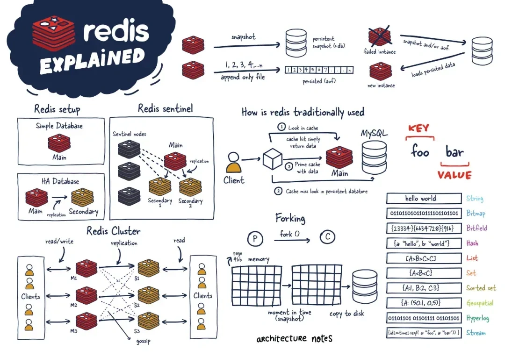

Redis不是通过迭代或者排序方式处理数据，而是一开始就按照数据结构方式组织。早期，它的使用很像 Memcached，但随着 Redis 的改进，它在许多其他用例中变得可行，包括发布-订阅机制、流（streaming）和队列。

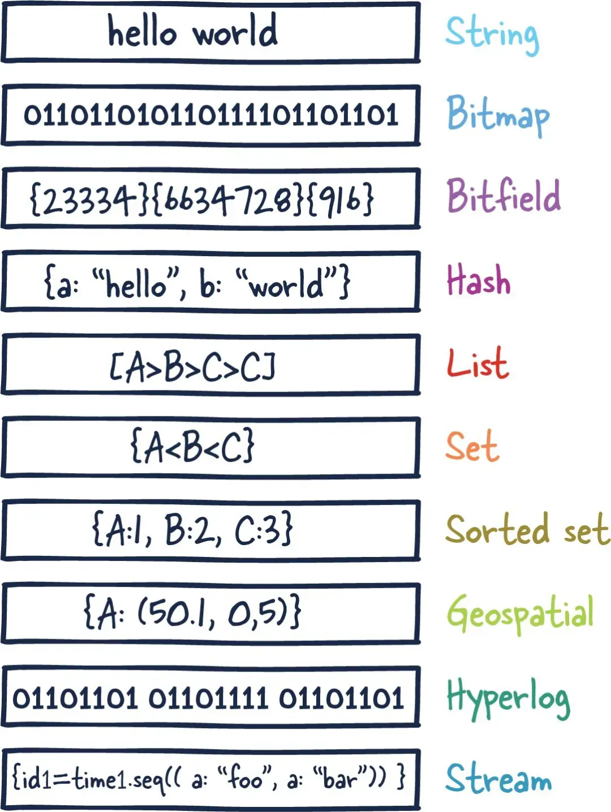

主要来说，Redis 是一个内存数据库，用作另一个“真实”数据库（如 MySQL 或 PostgreSQL）前面的缓存，以帮助提高应用程序性能。它通过利用内存的高速访问速度，从而减轻核心应用程序数据库的负载，例如：

+ 不经常更改且经常被请求的数据
+ 任务关键性较低且经常变动的数据

上述数据的示例可以包括会话或数据缓存以及仪表板的排行榜或汇总分析。

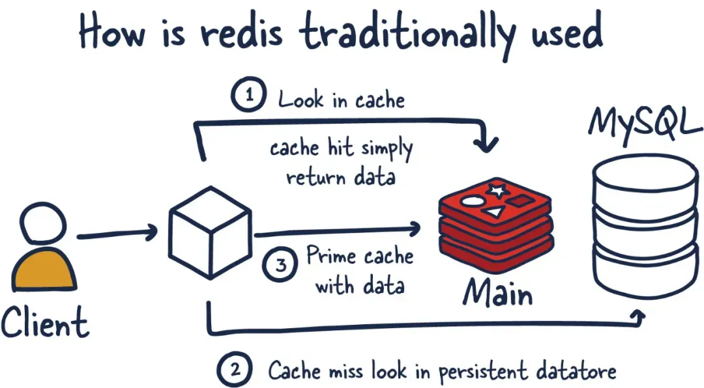

但是，对于许多用例场景，Redis 都可以提供足够的保证，可以将其用作成熟的主数据库。再加上 Redis 插件及其各种高可用性（HA）设置，Redis 作为数据库对于某些场景和工作负载变得非常有用。

另一个重要方面是 Redis 模糊了缓存和数据存储之间的界限。这里要理解的重要一点是，相比于使用 SSD 或 HDD 作为存储的传统数据库，读取和操作内存中数据的速度要快得多。

最初，Redis 最常被比作 Memcached，后者当时缺乏任何非易失性持久化。

这是当前两个缓存之间的功能细分。

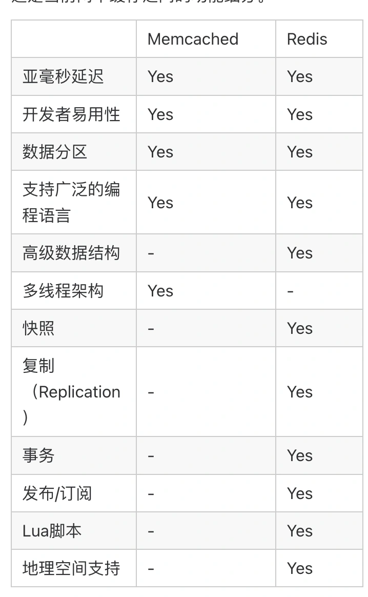

虽然现在拥有多种配置方式将数据持久化到磁盘，但当时首次引入持久化时，Redis 是使用快照方式，通过异步拷贝内存中的数据方式来做持久化。不幸的是，这种机制的缺点是可能会在快照之间丢失数据。

Redis 自 2009 年成立到现在已经变的很成熟。我们将介绍它的大部分架构和拓扑，以便你可以将 Redis 添加到你的数据存储系统库中。

**Redis 架构**

在开始讨论 Redis 内部结构之前，让我们先讨论一下各种 Redis 部署及其权衡取舍。

我们将主要关注以下这些设置：

+ 单个 Redis 实例
+ Redis 高可用性
+ Redis 哨兵
+ Redis 集群

根据你的用例和规模，决定使用哪一种设置。

**单个 Redis 实例**

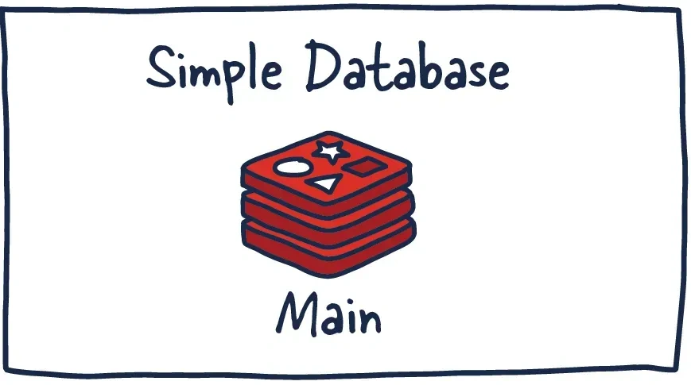

单个 Redis 实例是最直接的 Redis 部署方式。它允许用户设置和运行小型实例，从而帮助他们快速发展和加速服务。但是，这种部署并非没有缺点。例如，如果此实例失败或不可用，则所有客户端对 Redis 的调用都将失败，从而降低系统的整体性能和速度。

如果有足够的内存和服务器资源，这个实例可以很强大。主要用于缓存的场景可能会以最少的设置获得显著的性能提升。给定足够的系统资源，你可以在应用程序运行的同一机器上部署此 Redis 服务。

在管理系统内的数据方面，了解一些 Redis 概念是必不可少的。发送到 Redis 的命令首先在内存中处理。然后，如果在这些实例上设置了持久性，则在某个时间间隔上会有一个fork进程，来生成数据持久化 RDB（Redis 数据的非常紧凑的时间点表示）快照或 AOF（仅附加文件）。

这两个流程可以让 Redis 拥有长期存储，支持各种复制策略，并启用更复杂的拓扑。如果 Redis 未设置为持久化数据，则在重新启动或故障转移时数据会丢失。如果在重启时启用了持久化，它会将 RDB 快照或 AOF 中的所有数据加载回内存，然后实例可以支持新的客户端请求。

话虽如此，让我们看看你可能会用到的更多分布式 Redis 设置。

**Redis 高可用性**

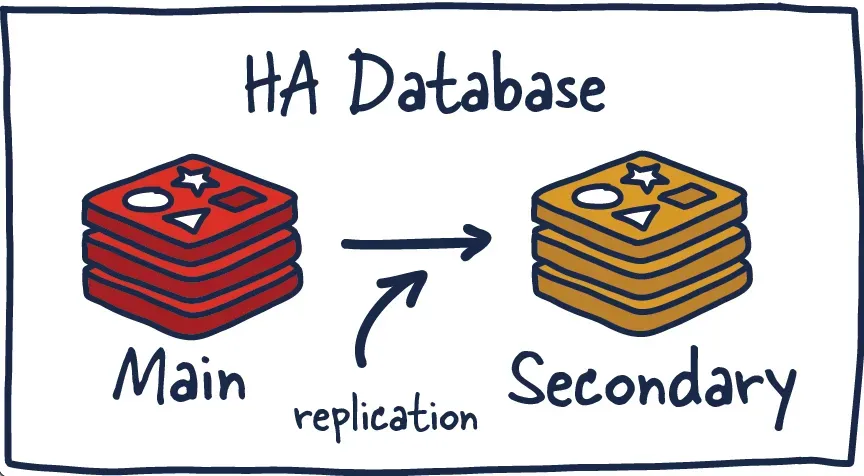

Redis 的另一个流行设置是主从部署方式，从部署保持与主部署之间数据同步。当数据写入主实例时，它会将这些命令的副本发送到从部署客户端输出缓冲区，从而达到数据同步的效果。从部署可以有一个或多个实例。这些实例可以帮助扩展 Redis 的读取操作或提供故障转移，以防 main 丢失。

我们现在已经进入了一个分布式系统，因此需要在此拓扑中考虑许多新事物。以前简单的事情现在变得复杂了。

**Redis 复制**

Redis 的每个主实例都有一个复制 ID 和一个偏移量。这两条数据对于确定副本可以继续其复制过程的时间点或确定它是否需要进行完整同步至关重要。对于主 Redis 部署上发生的每个操作，此偏移量都会增加。

更明确地说，当 Redis 副本实例仅落后于主实例几个偏移量时，它会从主实例接收剩余的命令，然后在其数据集上重放，直到同步完成。如果两个实例无法就复制 ID 达成一致，或者主实例不知道偏移量，则副本将请求全量同步。这时主实例会创建一个新的 RDB 快照并将其发送到副本。

在此传输之间，主实例会缓冲快照截止和当前偏移之间的所有中间更新指令，这样在快照同步完后，再将这些指令发送到副本实例。这样完成后，复制就可以正常继续。

如果一个实例具有相同的复制 ID 和偏移量，则它们具有完全相同的数据。现在你可能想知道为什么需要复制 ID。当 Redis 实例被提升为主实例或作为主实例从头开始重新启动时，它会被赋予一个新的复制 ID。

这用于推断此新提升的副本实例是从先前哪个主实例复制出来的。这允许它能够执行部分同步（与其他副本节点），因为新的主实例会记住其旧的复制 ID。

例如，两个实例（主实例和从实例）具有相同的复制 ID，但偏移量相差几百个命令，这意味着如果在实例上重放这些偏移量后面的命令，它们将具有相同的数据集。现在，如果复制 ID 完全不同，并且我们不知道新降级（或重新加入）从节点的先前复制 ID（没有共同祖先）。我们将需要执行昂贵的全量同步。

相反，如果我们知道以前的复制 ID，我们就可以推断如何使数据同步，因为我们能够推断出它们共享的共同祖先，并且偏移量对于部分同步再次有意义。

**Redis 哨兵（Sentinel）**

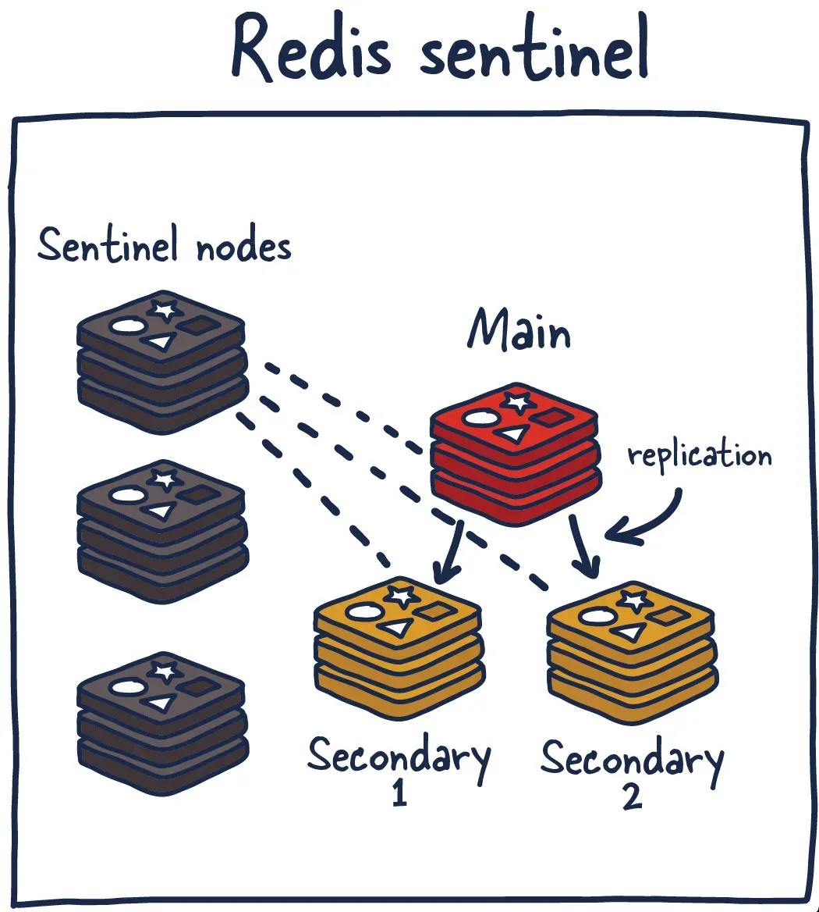

Sentinel 是一个分布式系统。与所有分布式系统一样，Sentinel 有几个优点和缺点。Sentinel 的设计方式是，一组哨兵进程协同工作以协调状态，从而为 Redis 提供高可用性。毕竟，你不希望保护你免受故障影响的系统有自己的单点故障。

Sentinel 负责一些事情。首先，它确保当前的主实例和从实例正常运行并做出响应。这是必要的，因为哨兵（与其他哨兵进程）可以在主节点和/或从节点丢失的情况下发出警报并采取行动。其次，它在服务发现中发挥作用，就像其他系统中的 Zookeeper 和 Consul 一样。所以当一个新的客户端尝试向 Redis 写东西时，Sentinel 会告诉客户端当前的主实例是什么。

因此，哨兵不断监控可用性并将该信息发送给客户端，以便他们能够在他们确实进行故障转移时对其做出反应。

以下是它的职责：

+ 监控——确保主从实例按预期工作。
+ 通知——通知系统管理员 Redis 实例中的事件。
+ 故障转移管理——如果主实例不可用并且足够多的（法定数量）节点同意这是真的，Sentinel 节点可以启动故障转移。
+ 配置管理——Sentinel 节点还充当当前主 Redis 实例的发现服务。

以这种方式使用 Redis Sentinel 可以进行故障检测。此检测涉及多个哨兵进程同意当前主实例不再可用。这个协议过程称为 Quorum。这可以提高鲁棒性并防止一台机器行为异常导致无法访问主 Redis 节点。

此设置并非没有缺点，因此我们将在使用 Redis Sentinel 时介绍一些建议和最佳实践。

你可以通过多种方式部署 Redis Sentinel。老实说，要提出任何明智的建议，我需要有关你的系统的更多背景信息。作为一般指导，我建议在每个应用程序服务器旁边运行一个哨兵节点（如果可能的话），这样你也不需要考虑哨兵节点和实际使用 Redis 的客户端之间的网络可达性差异。

你可以将 Sentinel 与 Redis 实例一起运行，甚至可以在独立节点上运行，只不过它会按照别的方式处理，从而会让事情变得更复杂。我建议至少运行三个节点，并且至少具有两个法定人数（quorum）。这是一个简单的图表，分解了集群中的服务器数量以及相关的法定人数和可容忍的可持续故障。

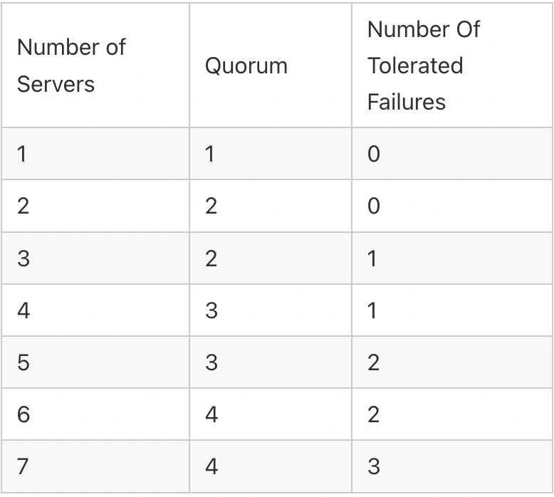

这会因系统而异，但总体思路是不变的。

让我们花点时间思考一下这样的设置会出现什么问题。如果你运行这个系统足够长的时间，你会遇到所有这些。

1. 如果哨兵节点超出法定人数怎么办？
2. 如果网络分裂将旧的主实例置于少数群体中怎么办？这些写入会发生什么？（剧透：当系统完全恢复时它们会丢失）
3. 如果哨兵节点和客户端节点（应用程序节点）的网络拓扑错位会发生什么？

没有持久性保证，特别是持久化到磁盘的操作（见下文）是异步的。还有一个麻烦的问题，当客户发现新的 primary 时，我们失去了多少写给一个不知道的 primary？Redis 建议在建立新连接时查询新的主节点。根据系统配置，这可能意味着大量数据丢失。

如果你强制主实例将写入复制到至少一个副本实例，有几种方法可以减轻损失程度。请记住，所有 Redis 复制都是异步的，这是有其权衡的考虑。因此，它需要独立跟踪确认，如果至少有一个副本实例没有确认它们，主实例将停止接受写入。

**Redis 集群**

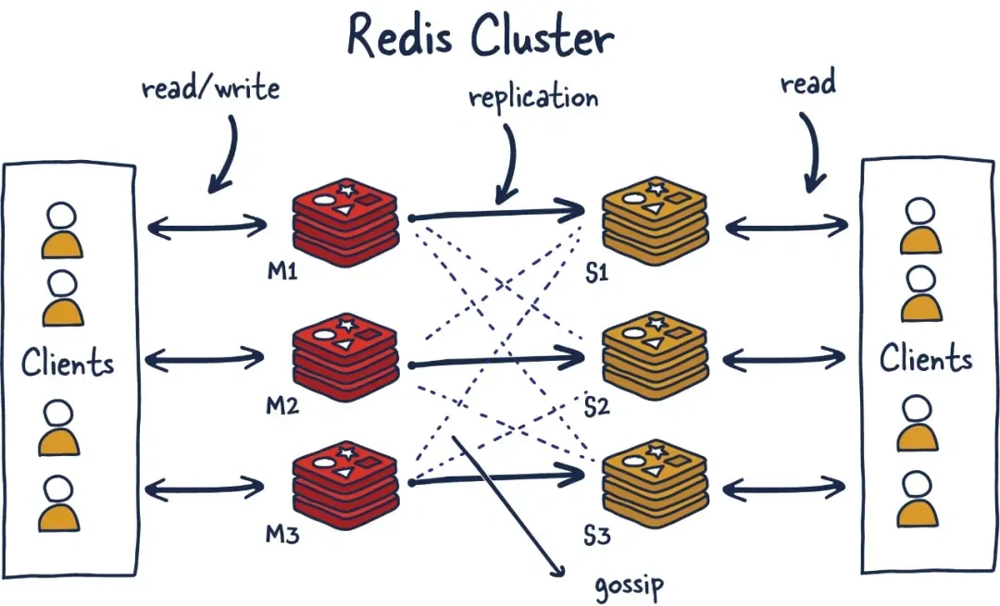

我相信很多人都想过当你无法将所有数据存储在一台机器上的内存中时会发生什么。目前，单个服务器中可用的最大 RAM 为 24TIB，这是目前 AWS 线上列出来的。当然，这很多，但对于某些系统来说，这还不够，即使对于缓存层也是如此。

Redis Cluster 允许 Redis 的水平扩展。

首先，让我们摆脱一些术语约束；一旦我们决定使用 Redis 集群，我们就决定将我们存储的数据分散到多台机器上，这称为分片。所以集群中的每个 Redis 实例都被认为是整个数据的一个分片。

这带来了一个新的问题。如果我们向集群推送一个key，我们如何知道哪个 Redis 实例（分片）保存了该数据？有几种方法可以做到这一点，但 Redis Cluster 使用算法分片。

为了找到给定 key 的分片，我们对 key 进行哈希处理，并通过对总分片数量取模。然后，使用确定性哈希函数，这意味着给定的 key 将始终映射到同一个分片，我们可以推断将来读取特定 key 的位置。

当我们之后想在系统中添加一个新的分片时会发生什么？这个过程称为重新分片。

假设键 'foo' 之前映射到分片 0， 在引入新分片后它可能会映射到分片 5。但是，如果我们需要快速扩展系统，移动数据来达到新的分片映射，这将是缓慢且不切实际的。它还对 Redis 集群的可用性产生不利影响。

Redis Cluster 为这个问题设计了一种解决方案，称为 Hashslot，所有数据都映射到它。有 16K 哈希槽。这为我们提供了一种在集群中传播数据的合理方式，当我们添加新的分片时，我们只需在系统之间移动哈希槽。通过这样做，我们只需要将 hashlot 从一个分片移动到另一个分片，并简化将新的主实例添加到集群中的过程。

这可以在没有任何停机时间和最小的性能影响的情况下实现。让我们通过一个例子来谈谈。

+ M1 包含从 0 到 8191 的哈希槽。
+ M2 包含从 8192 到 16383 的哈希槽。

因此，为了映射 “foo”，我们采用一个确定性的键（foo）散列，并通过散列槽的数量（16K）对其进行修改，从而得到 M2 的映射。现在假设我们添加了一个新实例 M3。新的映射将是：

+ M1 包含从 0 到 5460 的哈希槽。
+ M2 包含从 5461 到 10922 的哈希槽。
+ M3 包含从 10923 到 16383 的哈希槽。

现在映射到 M2 的 M1 中映射哈希槽的所有键都需要移动。但是散列槽的各个键的散列不需要移动，因为它们已经被划分到散列槽中。因此，这一级别的误导（misdirection）解决了算法分片的重新分片问题。

**Gossiping 协议**

Redis Cluster 使用 gossiping 来确定整个集群的健康状况。在上图中，我们有 3 个 M 个节点和 3 个 S 节点。所有这些节点不断地进行通信以了解哪些分片可用并准备好为请求提供服务。

如果足够多的分片同意 M1 没有响应，他们可以决定将 M1 的副本 S1 提升为主节点以保持集群健康。触发此操作所需的节点数量是可配置的，并且必须正确执行此操作。如果操作不当并且在分区的两边相等时无法打破平局，则可能会导致集群被拆分。这种现象称为裂脑。作为一般规则，必须拥有奇数个主节点和两个副本，以实现最稳健的设置。

**Redis 持久化模型**

如果我们要使用 Redis 存储任何类型的数据同时要求安全保存，了解 Redis 是如何做到这一点很重要。在许多用例中，如果你丢失了 Redis 存储的数据，这并不是世界末日。将其用作缓存或在其支持实时分析的情况下，如果发生数据丢失，则并非世界末日。

在其他场景中，我们希望围绕数据持久性和恢复有一些保证。

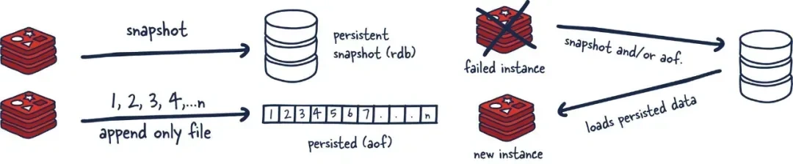

**无持久化**

无持久化：如果你愿意，可以完全禁用持久化。这是运行 Redis 的最快方式，并且没有持久性保证。

**RDB文件**

RDB（Redis 数据库）：RDB 持久化以指定的时间间隔执行数据集的时间点快照。

这种机制的主要缺点是快照之间的数据会丢失。此外，这种存储机制还依赖于主进程的 fork，在更大的数据集中，这可能会导致服务请求的瞬间延迟。话虽如此，RDB 文件在内存中的加载速度要比 AOF 快得多。

**AOF**

AOF（Append Only File）：AOF 持久化记录服务器接收到的每个写入操作，这些操作将在服务器启动时再次被执行，重建原始数据集。

这种持久性的方法能够确保比 RDB 快照更持久，因为它是一个仅附加文件。随着操作的发生，我们将它们缓冲到日志中，但它们还没有被持久化。该日志与我们运行的实际命令一致，以便在需要时进行重放。

然后，如果可能，我们使用 fsync 将其刷新到磁盘（当此运行可配置时），它将被持久化。缺点是格式不紧凑，并且比 RDB 文件使用更多的磁盘。

**为什么不兼得？**

RDB + AOF：可以将 AOF 和 RDB 组合在同一个 Redis 实例中。如果你愿意的话，可以以速度换取持久化是一种折衷方法。我认为这是设置 Redis 的一种可接受的方式。在重启的情况下，请记住如果两者都启用，Redis 将使用 AOF 来重建数据，因为它是最完整的。

**Forking**

现在我们了解了持久化的类型，让我们讨论一下我们如何在像 Redis 这样的单线程应用程序中实际执行它。

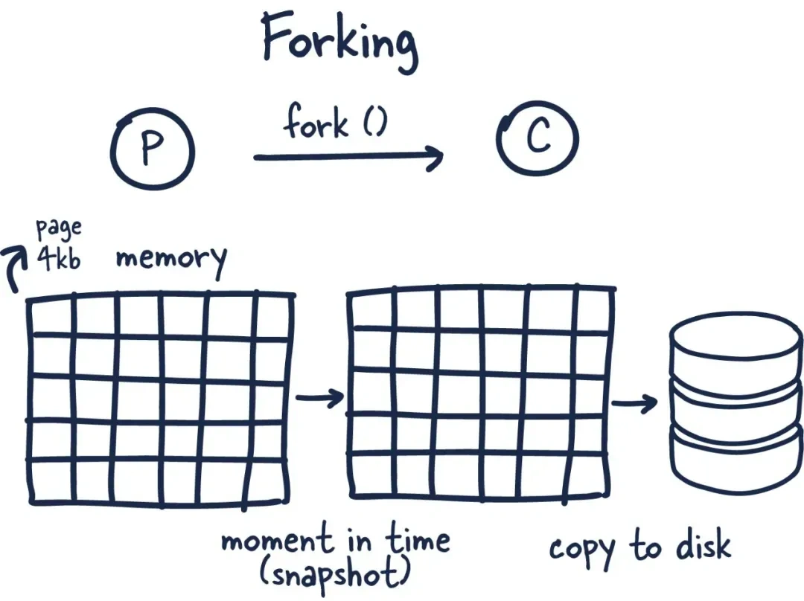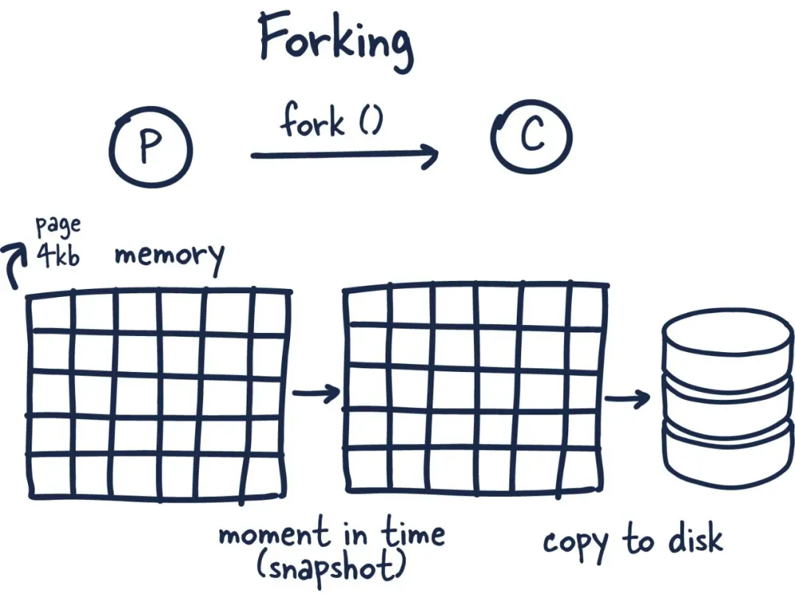

在我看来，Redis 最酷的部分是它如何利用 forking 和写时复制来高效地促进数据持久化。

Forking 是操作系统通过创建自身副本来创建新进程的一种方式。这样，你将获得一个新的进程 ID 和一些其他信息和句柄，因此新 forking 的进程（子进程）可以与原始进程父进程通信。

现在事情变得有趣了。Redis 是一个分配了大量内存的进程，那么它如何在不耗尽内存的情况下进行复制呢？

当你 fork 一个进程时，父进程和子进程共享内存，并且在该子进程中 Redis 开始快照（Redis）进程。这是通过一种称为写时复制的内存共享技术实现的——该技术在创建分叉时传递对内存的引用。如果在子进程持久化到磁盘时没有发生任何更改，则不会进行新的分配。

在发生更改的情况下，内核会跟踪对每个页面的引用，如果某个页面有多个更改，则将更改写入新页面。子进程完全不知道更改以及具有一致的内存快照的事情。因此，在只使用了一小部分内存的情况下，我们能够非常快速有效地获得潜在千兆字节内存的时间点快照！

> 更新: 2025-06-16 11:06:12  
> 原文: <https://www.yuque.com/yuqueyonghue6cvnv/cxhfwd/hym7s9lk1z3emxxp>