# 037|Java 线程、死锁、syncconized、 AQS、ReentrantLock 实现原理

<font style="color:rgb(51, 51, 51);background-color:rgb(248, 246, 244);">大家好，我是码哥，《Redis 高手心法》畅销书作者，公众号「码哥跳动」作者，在平安银行担任过架构师、目前在一家做国际旅游的港企 klook 担任技术专家。</font>

<font style="color:rgb(51, 51, 51);background-color:rgb(248, 246, 244);">从本章开始，我们正式进入 Java 多线程系列的学习，透彻理解 Java 并发编程。</font>

<font style="color:rgb(51, 51, 51);background-color:rgb(248, 246, 244);">本篇主要内容如下：</font>

1. <font style="color:rgb(51, 51, 51);background-color:rgb(248, 246, 244);">多线程挑战与难点</font>
    1. <font style="color:rgb(51, 51, 51);background-color:rgb(248, 246, 244);">上下文切换</font>
    2. <font style="color:rgb(51, 51, 51);background-color:rgb(248, 246, 244);">死锁</font>
    3. <font style="color:rgb(51, 51, 51);background-color:rgb(248, 246, 244);">资源限制的挑战</font>
    4. <font style="color:rgb(51, 51, 51);background-color:rgb(248, 246, 244);">什么是线程</font>
    5. <font style="color:rgb(51, 51, 51);background-color:rgb(248, 246, 244);">线程的状态</font>
    6. <font style="color:rgb(51, 51, 51);background-color:rgb(248, 246, 244);">线程间的通信</font>
2. <font style="color:rgb(51, 51, 51);background-color:rgb(248, 246, 244);">Java 各种各样的锁使用和原理</font>
    1. <font style="color:rgb(51, 51, 51);background-color:rgb(248, 246, 244);">syncconized 的使用和原理</font>
    2. <font style="color:rgb(51, 51, 51);background-color:rgb(248, 246, 244);">AQS 实现原理</font>
    3. <font style="color:rgb(51, 51, 51);background-color:rgb(248, 246, 244);">ReentrantLock 的使用和原理</font>
    4. <font style="color:rgb(51, 51, 51);background-color:rgb(248, 246, 244);">ReentrantReadWriteLock 读写锁使用和原理</font>
    5. <font style="color:rgb(51, 51, 51);background-color:rgb(248, 246, 244);">Condition 的使用和原理</font>

<font style="color:rgb(51, 51, 51);background-color:rgb(248, 246, 244);">多线程这块知识的学习，真正的难点不在于多线程程序的逻辑有多复杂，而在于理清 J.U.C 包中各个多线程工具类之间的关系、特点及其使用场景（从整体到局部、高屋建瓴，这对学习任何知识都至关重要）。</font>

<font style="color:rgb(100, 100, 100);background-color:rgb(248, 246, 244);">Chaya：彻底掌握必须深入源码级别了解底层细节吗？</font>

<font style="color:rgb(51, 51, 51);background-color:rgb(248, 246, 244);">真正掌握 Java 多线程，必须要弄懂 J.U.C，并不是说必须是源码级别的，这里有几个关键点需要注意下。</font>

1. <font style="color:rgb(51, 51, 51);background-color:rgb(248, 246, 244);">真正掌握 Java 多线程，必须要弄懂 J.U.C，并不是说必须是源码级别的，深入源码确实能够让你彻底掌握底层原理。但死扣细节往往造成“当局者迷”。</font>
2. <font style="color:rgb(51, 51, 51);background-color:rgb(248, 246, 244);">我们要从全局视角去理解各个模块的特点和用法，然后抽丝剥茧，深入每个工具类的底层实现。</font>
3. <font style="color:rgb(51, 51, 51);background-color:rgb(248, 246, 244);">掌握每个组件的设计思想和设计原则。而不是去背源码实现细节。</font>

## **<font style="color:rgb(34, 34, 34);background-color:rgb(248, 246, 244);">多线程挑战与难点</font>**
<font style="color:rgb(51, 51, 51);background-color:rgb(248, 246, 244);">在进行并发编程时，如果希望通过多线程执行任务让程序运行得更快，会 面临非常多的挑战。</font>

+ <font style="color:rgb(51, 51, 51);background-color:rgb(248, 246, 244);">上下文切换问题。</font>
+ <font style="color:rgb(51, 51, 51);background-color:rgb(248, 246, 244);">死锁问题。</font>
+ <font style="color:rgb(51, 51, 51);background-color:rgb(248, 246, 244);">硬件和硬件资源限制。</font>

<font style="color:rgb(100, 100, 100);background-color:rgb(248, 246, 244);">多线程难在哪里？</font>

<font style="color:rgb(51, 51, 51);background-color:rgb(248, 246, 244);">单线程只有一条执行线，过程容易理解，可以在大脑中清晰的勾勒出代码的执行流程</font>

<font style="color:rgb(51, 51, 51);background-color:rgb(248, 246, 244);">多线程却是多条线，而且一般多条线之间有交互，多条线之间需要通信，一般难点有以下几点</font>

1. <font style="color:rgb(51, 51, 51);background-color:rgb(248, 246, 244);">多线程的执行结果不确定,受到 cpu 调度的影响。</font>
2. <font style="color:rgb(51, 51, 51);background-color:rgb(248, 246, 244);">多线程的安全问题。</font>
3. <font style="color:rgb(51, 51, 51);background-color:rgb(248, 246, 244);">线程资源宝贵，依赖线程池操作线程，线程池的参数设置问题。</font>
4. <font style="color:rgb(51, 51, 51);background-color:rgb(248, 246, 244);">多线程执行是动态的，同时难以追踪过程。</font>
5. <font style="color:rgb(51, 51, 51);background-color:rgb(248, 246, 244);">多线程的底层是操作系统层面的，源码难度大。</font>

### **<font style="color:rgb(34, 34, 34);background-color:rgb(248, 246, 244);">上下文切换</font>**
<font style="color:rgb(100, 100, 100);background-color:rgb(248, 246, 244);">单核处理器也支持多线程执行代码吗？</font>

<font style="color:rgb(51, 51, 51);background-color:rgb(248, 246, 244);">是的，CPU 通过给每个线程分配 CPU 时间片来实现 这个机制。时间片是 CPU 分配给各个线程的时间，因为时间片非常短。</font>

<font style="color:rgb(51, 51, 51);background-color:rgb(248, 246, 244);">所以 CPU 通过不停地切 换线程执行，让我们感觉多个线程是同时执行的，时间片一般是几十毫秒（ms）。</font>

**<font style="color:rgb(34, 34, 34);background-color:rgb(248, 246, 244);">在切换前会保存上一个任务的状态，以便下次切换回这个任务时，可以再加载这 个任务的状态。所以任务从保存到再加载的过程就是一次上下文切换。</font>**

<font style="color:rgb(51, 51, 51);background-color:rgb(248, 246, 244);">这就像我们同时读两本书，当我们在读一本英文的技术书时，发现某个单词不认识，于是 便打开中英文字典，但是在放下英文技术书之前，大脑必须先记住这本书读到了多少页的第 多少行，等查完单词之后，能够继续读这本书。</font>

**<font style="color:rgb(34, 34, 34);background-color:rgb(248, 246, 244);">上下文切换的开销</font>**

<font style="color:rgb(51, 51, 51);background-color:rgb(248, 246, 244);">线程上下文切换是有成本的，主要体现在以下几个方面：</font>

+ <font style="color:rgb(51, 51, 51);background-color:rgb(248, 246, 244);">CPU 开销：保存和恢复线程状态需要 CPU 执行额外的指令</font>
+ <font style="color:rgb(51, 51, 51);background-color:rgb(248, 246, 244);">缓存失效：上下文切换可能导致 CPU 缓存、TLB（Translation Lookaside Buffer）和分支预测器的失效，从而增加内存访问延迟。</font>
+ <font style="color:rgb(51, 51, 51);background-color:rgb(248, 246, 244);">内核态开销：上下文切换通常涉及从用户态切换到内核态的操作，这进一步增加了开销。</font>

<font style="color:rgb(51, 51, 51);background-color:rgb(248, 246, 244);">如下图所示，保存上下文和恢复上下文的过程并不是“免费”的，需要内核在 CPU 上运行才能完成。</font>


**<font style="color:rgb(34, 34, 34);background-color:rgb(248, 246, 244);">减少上下文切换的方法</font>**

+ **<font style="color:rgb(34, 34, 34);background-color:rgb(248, 246, 244);">减少线程数量</font>**<font style="color:rgb(51, 51, 51);background-color:rgb(248, 246, 244);">：使用合理数量的线程，避免线程过多导致频繁切换。</font>
+ **<font style="color:rgb(34, 34, 34);background-color:rgb(248, 246, 244);">无锁编程</font>**<font style="color:rgb(51, 51, 51);background-color:rgb(248, 246, 244);">：减少线程之间的锁竞争，降低阻塞几率，如将数据的 ID 按照 Hash 算法取模分段，不同的线程处理不同段的数据。</font>
+ **<font style="color:rgb(34, 34, 34);background-color:rgb(248, 246, 244);">使用适当的线程池</font>**<font style="color:rgb(51, 51, 51);background-color:rgb(248, 246, 244);">：利用线程池复用线程，避免频繁的线程创建和销毁。</font>
+ **<font style="color:rgb(34, 34, 34);background-color:rgb(248, 246, 244);">CAS 算法</font>**<font style="color:rgb(51, 51, 51);background-color:rgb(248, 246, 244);">：Java 的 Atomic 包使用 CAS 算法来更新数据，而不需要加锁。</font>
+ **<font style="color:rgb(34, 34, 34);background-color:rgb(248, 246, 244);">线程池复用</font>**<font style="color:rgb(51, 51, 51);background-color:rgb(248, 246, 244);">：选择合适的调度策略，减少不必要的上下文切换。</font>

**<font style="color:rgb(34, 34, 34);background-color:rgb(248, 246, 244);">减少上下文切换实战</font>**

**<font style="color:rgb(34, 34, 34);background-color:rgb(248, 246, 244);">第一步</font>**<font style="color:rgb(51, 51, 51);background-color:rgb(248, 246, 244);">：用 jstack 命令 dump 线程信息，看看 pid 为 3117 的进程里的线程都在做什么。</font>

```plain
sudo -u admin /opt/magebyte/java/bin/jstack 31177 > /home/magebyte/dump17
```

**<font style="color:rgb(34, 34, 34);background-color:rgb(248, 246, 244);">第二步</font>**<font style="color:rgb(51, 51, 51);background-color:rgb(248, 246, 244);">：统计所有线程分别处于什么状态，发现 300 多个线程处于 WAITING（onobjectmonitor）状态。</font>

```plain
grep java.lang.Thread.State dump17 | awk '{print $2$3$4$5}'
| sort | uniq -c
39 RUNNABLE
21 TIMED_WAITING(onobjectmonitor)
6 TIMED_WAITING(parking)
51 TIMED_WAITING(sleeping)
305 WAITING(onobjectmonitor)
3 WAITING(parking)
```

**<font style="color:rgb(34, 34, 34);background-color:rgb(248, 246, 244);">第三步</font>**<font style="color:rgb(51, 51, 51);background-color:rgb(248, 246, 244);">：打开 dump 文件查看处于 WAITING（onobjectmonitor）的线程在做什么。发现这些线 程基本全是 Tomcat 的工作线程，在 await。</font>

<font style="color:rgb(51, 51, 51);background-color:rgb(248, 246, 244);">说明 JBOSS 线程池里线程接收到的任务太少，大量线 程都闲着。</font>

```plain
"http-0.0.0.0-7001-97" daemon prio=10 tid=0x000000004f6a8000 nid=0x555e in
Object.wait() [0x0000000052423000]
java.lang.Thread.State: WAITING (on object monitor)
at java.lang.Object.wait(Native Method)
- waiting on <0x00000007969b2280> (a org.apache.tomcat.util.net.AprEndpoint$Worker)
at java.lang.Object.wait(Object.java:485)
at org.apache.tomcat.util.net.AprEndpoint$Worker.await(AprEndpoint.java:1464)
- locked <0x00000007969b2280> (a org.apache.tomcat.util.net.AprEndpoint$Worker)
at org.apache.tomcat.util.net.AprEndpoint$Worker.run(AprEndpoint.java:1489)
at java.lang.Thread.run(Thread.java:662)
```

**<font style="color:rgb(34, 34, 34);background-color:rgb(248, 246, 244);">第四步</font>**<font style="color:rgb(51, 51, 51);background-color:rgb(248, 246, 244);">：减少 Tomcat 的工作线程数，找到 Tomcat 的线程池配置信息，将 maxThreads 降到 200。</font>

```plain
# 最大工作线程数，默认200。
server.tomcat.max-threads=200
```

<font style="color:rgb(51, 51, 51);background-color:rgb(248, 246, 244);">在这里给大家分享一个生产级别 Tomcat 配置推荐。</font>

```yaml
server:
  port: 9000
  tomcat:
    uri-encoding: UTF-8
    max-threads: 800 #最大工作线程数量
    min-spare-threads: 20 #最小工作线程数量
    max-connections: 10000 #一瞬间最大支持的并发的连接数
    accept-count: 200 #等待队列长度
```

**<font style="color:rgb(34, 34, 34);background-color:rgb(248, 246, 244);">参数解释</font>**

+ <font style="color:rgb(51, 51, 51);background-color:rgb(248, 246, 244);">线程数的经验值为：4 核 8G 内存， 线程数经验值 800。 （4 核 8G 内存单进程调度线程数 800-1000，超过这个并发数之后，将会花费巨大的时间在 CPU 调度上）</font>
+ <font style="color:rgb(51, 51, 51);background-color:rgb(248, 246, 244);">等待队列长度：队列做缓冲池用，但也不能无限长，消耗内存，出入队列也耗 CPU。</font>
+ <font style="color:rgb(51, 51, 51);background-color:rgb(248, 246, 244);">maxThreads 规定的是最大的线程数目，并不是实际 running 的 CPU 数量；实际上，maxThreads 的大小比 CPU 核心数量要大得多。</font>**<font style="color:rgb(34, 34, 34);background-color:rgb(248, 246, 244);">这是因为，处理请求的线程真正用于计算的时间可能很少，大多数时间可能在阻塞，如等待数据库返回数据、等待硬盘读写数据等</font>**<font style="color:rgb(51, 51, 51);background-color:rgb(248, 246, 244);">。因此，在某一时刻，只有少数的线程真正的在使用物理 CPU，大多数线程都在等待；因此线程数远大于物理核心数才是合理的。也就是说，</font>**<font style="color:rgb(34, 34, 34);background-color:rgb(248, 246, 244);">Tomcat 通过使用比 CPU 核心数量多得多的线程数，可以使 CPU 忙碌起来，大大提高 CPU 的利用率。</font>**

### **<font style="color:rgb(34, 34, 34);background-color:rgb(248, 246, 244);">死锁</font>**
<font style="color:rgb(51, 51, 51);background-color:rgb(248, 246, 244);">使用多线程提高性能，在并发读写共享资源的时候，不恰当的使用会导致死锁问题。一旦产生死锁，就会造成系统功能不可 用。</font>

**<font style="color:rgb(34, 34, 34);background-color:rgb(248, 246, 244);">什么是死锁？</font>**

<font style="color:rgb(51, 51, 51);background-color:rgb(248, 246, 244);">在 Java 中，死锁（Deadlock）情况是指：</font>**<font style="color:rgb(34, 34, 34);background-color:rgb(248, 246, 244);">两个或两个以上的线程持有不同系统资源的锁，线程彼此都等待获取对方的锁来完成自己的任务，但是没有让出自己持有的锁，线程就会无休止等待下去。</font>**

**<font style="color:rgb(34, 34, 34);background-color:rgb(248, 246, 244);">线程竞争的资源可以是：锁、网络连接、通知事件，磁盘、带宽，以及一切可以被称作“资源”的东西。</font>**

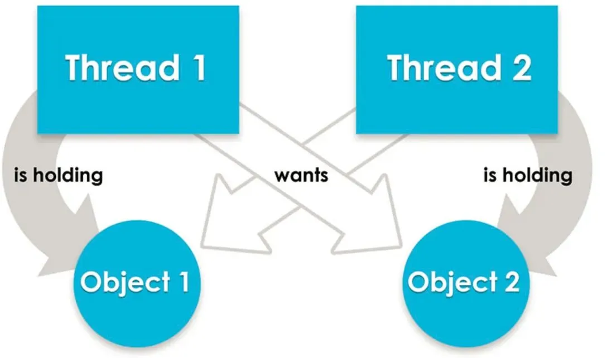

<font style="color:rgb(51, 51, 51);background-color:rgb(248, 246, 244);">如上图所示，Thread-1持有资源Object1但是需要资源Object2完成自身任务，同样的，Thread-2持有资源Object2但需要Object1，双方都在等待对方手中的资源但都不释放自己手中的资源，从而进入死锁。</font>

<font style="color:rgb(51, 51, 51);background-color:rgb(248, 246, 244);">如下死锁代码：</font>

```typescript
public class DeadLockExample {
    public Object resourceA = new Object();
    public Object resourceB = new Object();
    public static void main(String[] args) {
        DeadLockExample deadLockExample = new DeadLockExample();
        Runnable runnableA = new Runnable() {
            @Override
            public void run() {
                synchronized(deadLockExample.resourceA) {
                    System.out.printf(
                        "[INFO]: %s get resourceA" + System.lineSeparator(),
                        Thread.currentThread().getName()
                    );
                    try {
                        Thread.sleep(1000);
                    } catch (InterruptedException e) {
                        e.printStackTrace();
                    }
                    System.out.printf(
                        "[INFO]: %s trying to get resourceB" + System.lineSeparator(),
                        Thread.currentThread().getName()
                    );
                    synchronized(deadLockExample.resourceB) {
                        System.out.printf(
                            "[INFO]: %s get resourceB" + System.lineSeparator(),
                            Thread.currentThread().getName()
                        );
                    }
                    System.out.printf(
                        "[INFO]: %s has done" + System.lineSeparator(),
                        Thread.currentThread().getName()
                    );
                }
            }
        };
        Runnable runnableB = new Runnable() {
            @Override
            public void run() {
                synchronized(deadLockExample.resourceB) {
                    System.out.printf(
                        "[INFO]: %s get resourceB" + System.lineSeparator(),
                        Thread.currentThread().getName()
                    );
                    try {
                        Thread.sleep(1000);
                    } catch (InterruptedException e) {
                        e.printStackTrace();
                    }
                    System.out.printf(
                        "[INFO]: %s trying to get resourceA" + System.lineSeparator(),
                        Thread.currentThread().getName()
                    );
                    synchronized(deadLockExample.resourceA) {
                        System.out.printf(
                            "[INFO]: %s get resourceA" + System.lineSeparator(),
                            Thread.currentThread().getName()
                        );
                    }
                    System.out.printf(
                        "[INFO]: %s has done" + System.lineSeparator(),
                        Thread.currentThread().getName()
                    );
                }
            }
        };
        new Thread(runnableA).start();
        new Thread(runnableB).start();
    }
}
```

<font style="color:rgb(51, 51, 51);background-color:rgb(248, 246, 244);">程序输出：</font>

```plain
[INFO]: Thread-0 get resourceA
[INFO]: Thread-1 get resourceB
[INFO]: Thread-0 trying to get resourceB
[INFO]: Thread-1 trying to get resourceA
```

**<font style="color:rgb(34, 34, 34);background-color:rgb(248, 246, 244);">如何检测死锁</font>**

<font style="color:rgb(51, 51, 51);background-color:rgb(248, 246, 244);">JDK自带了一些简单好用的工具，可以帮助我们检测死锁（如：jstack）。使用jstack侦测目标 JVM 进程.</font>

```plain
$ jstack $(jps -l | grep 'DeadLockExample' | cut -f1 -d ' ')
```

<font style="color:rgb(51, 51, 51);background-color:rgb(248, 246, 244);">输出如下。</font>

```plain
...
Java stack information for the threads listed above:
===================================================
"Thread-1":
    at DeadLockExample$2.run(DeadLockExample.java:58)
    - waiting to lock <0x000000076ab660a0> (a java.lang.Object)
    - locked <0x000000076ab660b0> (a java.lang.Object)
    at java.lang.Thread.run(Thread.java:748)
"Thread-0":
    at DeadLockExample$1.run(DeadLockExample.java:28)
    - waiting to lock <0x000000076ab660b0> (a java.lang.Object)
    - locked <0x000000076ab660a0> (a java.lang.Object)
    at java.lang.Thread.run(Thread.java:748)

Found 1 deadlock.
```

**<font style="color:rgb(34, 34, 34);background-color:rgb(248, 246, 244);">如何避免死锁</font>**

+ <font style="color:rgb(51, 51, 51);background-color:rgb(248, 246, 244);">避免一个线程同时获取多个锁。</font>
+ <font style="color:rgb(51, 51, 51);background-color:rgb(248, 246, 244);">避免一个线程在锁内同时占用多个资源，尽量保证每个锁只占用一个资源。</font>
+ <font style="color:rgb(51, 51, 51);background-color:rgb(248, 246, 244);">尝试使用定时锁，使用 lock.tryLock（timeout）来替代使用内部锁机制。</font>
+ <font style="color:rgb(51, 51, 51);background-color:rgb(248, 246, 244);">对于数据库锁，加锁和解锁必须在一个数据库连接里，否则会出现解锁失败的情况。</font>

### **<font style="color:rgb(34, 34, 34);background-color:rgb(248, 246, 244);">资源限制的挑战</font>**
<font style="color:rgb(100, 100, 100);background-color:rgb(248, 246, 244);">什么是资源限制？</font>

<font style="color:rgb(51, 51, 51);background-color:rgb(248, 246, 244);">资源限制是指在进行并发编程时，程序的执行速度受限于计算机硬件资源或软件资源。</font>

<font style="color:rgb(51, 51, 51);background-color:rgb(248, 246, 244);">例如，服务器的带宽只有 2Mb/s，某个资源的下载速度是 1Mb/s 每秒，系统启动 10 个线程下载资 源，下载速度不会变成 10Mb/s，所以在进行并发编程时，要考虑这些资源的限制。</font>

<font style="color:rgb(51, 51, 51);background-color:rgb(248, 246, 244);">硬件资源限 制有带宽的上传/下载速度、硬盘读写速度和 CPU 的处理速度。</font>

<font style="color:rgb(51, 51, 51);background-color:rgb(248, 246, 244);">软件资源限制有数据库的连接数和 socket 连接数等。</font>

<font style="color:rgb(100, 100, 100);background-color:rgb(248, 246, 244);">资源限制会引发什么问题？</font>

<font style="color:rgb(51, 51, 51);background-color:rgb(248, 246, 244);">是如果将某段串行的代码并发执行，因为受限于资源，仍然在串行执行，这时候程序不仅不 会加快执行，反而会更慢，因为增加了上下文切换和资源调度的时间。</font>

<font style="color:rgb(51, 51, 51);background-color:rgb(248, 246, 244);">例如，之前看到一段程 序使用多线程在办公网并发地下载和处理数据时，导致 CPU 利用率达到 100%，几个小时都不 能运行完成任务，后来修改成单线程，一个小时就执行完成了。</font>

<font style="color:rgb(100, 100, 100);background-color:rgb(248, 246, 244);">如何在资源限制的情况下进行并发编程呢？</font>

+ <font style="color:rgb(51, 51, 51);background-color:rgb(248, 246, 244);">根据不同的资源限制调整 程序的并发度，比如下载文件程序依赖于两个资源——带宽和硬盘读写速度。</font>
+ <font style="color:rgb(51, 51, 51);background-color:rgb(248, 246, 244);">有数据库操作 时，涉及数据库连接数，如果 SQL 语句执行非常快，而线程的数量比数据库连接数大很多，则 某些线程会被阻塞，等待数据库连接。</font>

### **<font style="color:rgb(34, 34, 34);background-color:rgb(248, 246, 244);">什么是线程</font>**
<font style="color:rgb(51, 51, 51);background-color:rgb(248, 246, 244);">现代操作系统在运行一个程序时，会为其创建一个进程。例如，启动一个 Java 程序，操作 系统就会创建一个 Java 进程。</font>

<font style="color:rgb(51, 51, 51);background-color:rgb(248, 246, 244);">现代操作系统调度的最小单元是线程，也叫轻量级进程（Light Weight Process），在一个进程里可以创建多个线程，</font>**<font style="color:rgb(34, 34, 34);background-color:rgb(248, 246, 244);">这些线程都拥有各自的计数器、堆栈和局 部变量等属性，并且能够访问共享的内存变量。</font>**

<font style="color:rgb(51, 51, 51);background-color:rgb(248, 246, 244);">处理器在这些线程上高速切换，让使用者感觉 到这些线程在同时执行。</font>

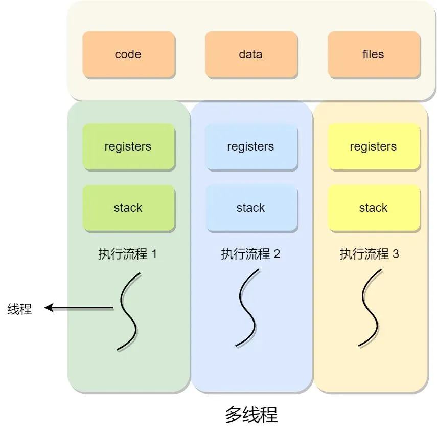

### **<font style="color:rgb(34, 34, 34);background-color:rgb(248, 246, 244);">线程的状态</font>**
<font style="color:rgb(51, 51, 51);background-color:rgb(248, 246, 244);">在 Java 程序中，一个线程对象只能调用一次start()方法启动新线程，并在新线程中执行run()方法。</font>

<font style="color:rgb(51, 51, 51);background-color:rgb(248, 246, 244);">一旦run()方法执行完毕，线程就结束了。因此，Java 线程的状态有以下几种：</font>

+ <font style="color:rgb(51, 51, 51);background-color:rgb(248, 246, 244);">New：新创建的线程，尚未执行；</font>
+ <font style="color:rgb(51, 51, 51);background-color:rgb(248, 246, 244);">Runnable：运行中的线程，正在执行run()方法的 Java 代码；</font>
+ <font style="color:rgb(51, 51, 51);background-color:rgb(248, 246, 244);">Blocked：运行中的线程，因为某些操作被阻塞而挂起；</font>
+ <font style="color:rgb(51, 51, 51);background-color:rgb(248, 246, 244);">Waiting：运行中的线程，因为某些操作在等待中；</font>
+ <font style="color:rgb(51, 51, 51);background-color:rgb(248, 246, 244);">Timed Waiting：运行中的线程，因为执行sleep()方法正在计时等待；</font>
+ <font style="color:rgb(51, 51, 51);background-color:rgb(248, 246, 244);">Terminated：线程已终止，因为run()方法执行完毕。</font>

<font style="color:rgb(51, 51, 51);background-color:rgb(248, 246, 244);">下图源自《Java 并发编程艺术》图 4-1</font>

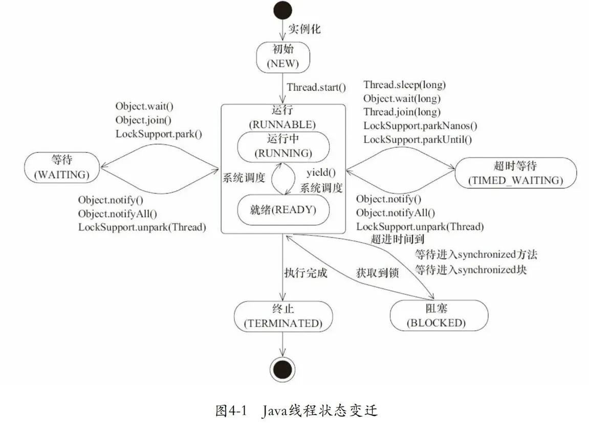

+ <font style="color:rgb(51, 51, 51);background-color:rgb(248, 246, 244);">新建：用</font>**<font style="color:rgb(34, 34, 34);background-color:rgb(248, 246, 244);">new 关键字</font>**<font style="color:rgb(51, 51, 51);background-color:rgb(248, 246, 244);">新建一个线程，这个线程就处于</font>**<font style="color:rgb(34, 34, 34);background-color:rgb(248, 246, 244);">新建状态</font>**<font style="color:rgb(51, 51, 51);background-color:rgb(248, 246, 244);">。</font>
+ <font style="color:rgb(51, 51, 51);background-color:rgb(248, 246, 244);">运行：操作系统中的就绪和运行两种状态，在 Java 中统称为 RUNNABLE。</font>
    - <font style="color:rgb(51, 51, 51);background-color:rgb(248, 246, 244);">就绪：当线程对象调用了start()方法之后，线程处于</font>**<font style="color:rgb(34, 34, 34);background-color:rgb(248, 246, 244);">就绪状态</font>**<font style="color:rgb(51, 51, 51);background-color:rgb(248, 246, 244);">，就绪意味着该线程</font>**<font style="color:rgb(34, 34, 34);background-color:rgb(248, 246, 244);">可以执行</font>**<font style="color:rgb(51, 51, 51);background-color:rgb(248, 246, 244);">，但具体啥时候执行将取决于 JVM 里线程调度器的调度。</font>
    - <font style="color:rgb(51, 51, 51);background-color:rgb(248, 246, 244);">运行中：处于就绪状态的线程获得了 CPU 之后，</font>**<font style="color:rgb(34, 34, 34);background-color:rgb(248, 246, 244);">真正开始执行 run()方法的线程执行体时</font>**<font style="color:rgb(51, 51, 51);background-color:rgb(248, 246, 244);">，意味着该线程就已经处于</font>**<font style="color:rgb(34, 34, 34);background-color:rgb(248, 246, 244);">运行状态</font>**<font style="color:rgb(51, 51, 51);background-color:rgb(248, 246, 244);">。需要注意的是，</font>**<font style="color:rgb(34, 34, 34);background-color:rgb(248, 246, 244);">对于单处理器，一个时刻只能有一个线程处于运行状态。</font>**
+ <font style="color:rgb(51, 51, 51);background-color:rgb(248, 246, 244);">阻塞：阻塞状态表示线程</font>**<font style="color:rgb(34, 34, 34);background-color:rgb(248, 246, 244);">正等待监视器锁</font>**<font style="color:rgb(51, 51, 51);background-color:rgb(248, 246, 244);">，而陷入的状态。进入阻塞的场景：</font>
    - <font style="color:rgb(51, 51, 51);background-color:rgb(248, 246, 244);">线程等待进入 synchronized 同步方法。</font>
    - <font style="color:rgb(51, 51, 51);background-color:rgb(248, 246, 244);">线程等待进入 synchronized 同步代码块。</font>
+ <font style="color:rgb(51, 51, 51);background-color:rgb(248, 246, 244);">等待：进入该状态表示</font>**<font style="color:rgb(34, 34, 34);background-color:rgb(248, 246, 244);">当前线程需要等待其他线程做出一些的特定的动作</font>**<font style="color:rgb(51, 51, 51);background-color:rgb(248, 246, 244);">（通知或中断）。</font>
+ <font style="color:rgb(51, 51, 51);background-color:rgb(248, 246, 244);">超时等待：区别于WAITING，它可以在</font>**<font style="color:rgb(34, 34, 34);background-color:rgb(248, 246, 244);">指定的时间</font>**<font style="color:rgb(51, 51, 51);background-color:rgb(248, 246, 244);">自行返回。</font>

### **<font style="color:rgb(34, 34, 34);background-color:rgb(248, 246, 244);">线程通信</font>**
<font style="color:rgb(51, 51, 51);background-color:rgb(248, 246, 244);">线程开始运行，拥有自己的栈空间，就如同一个脚本一样，按照既定的代码一步一步地执 行，直到终止。</font>

<font style="color:rgb(100, 100, 100);background-color:rgb(248, 246, 244);">Chaya：如何让线程间实现通信，让多个线程能够相互配合完成工作？</font>

<font style="color:rgb(51, 51, 51);background-color:rgb(248, 246, 244);">java 线程之间的通信方式总共有 8 种，分别是 volatile、synchronized、interrupt、wait、notify、notifyAll、join、管道输入/输出。</font>

**<font style="color:rgb(34, 34, 34);background-color:rgb(248, 246, 244);">volatile</font>**

<font style="color:rgb(51, 51, 51);background-color:rgb(248, 246, 244);">Java 支持多个线程同时访问一个对象或者对象的成员变量，由于每个线程可以拥有这个 变量的副本（虽然对象以及成员变量分配的内存是在共享内存中的，但是每个执行的线程还是可以拥有一份副本，这样做的目的是加速程序的执行，这是现代多核处理器的一个显著特 性）</font>

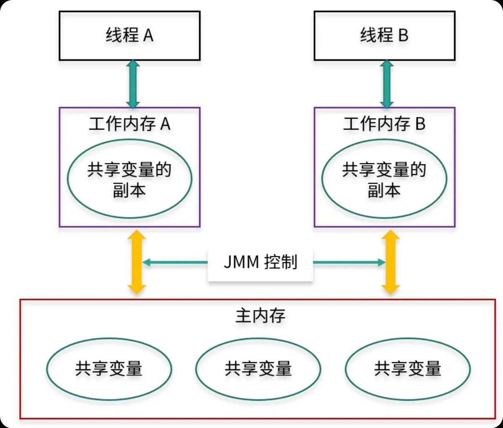

<font style="color:rgb(51, 51, 51);background-color:rgb(248, 246, 244);">线程会将内存中的数据，拷贝到各自的本地内存中( 这里的本地内存指的是 cpu cache ( 比如 CPU 的一级缓存、二级缓存等 )，寄存器)。</font>

<font style="color:rgb(51, 51, 51);background-color:rgb(248, 246, 244);">当某个变量被 volatile 修饰并且发生改变时，volatile 变量底层会通过 lock 前缀的指令，将该变量写会主存，同时利用 缓存一致性协议，促使其他线程的本地变量的数据无效，从而再次直接从主存读取数据。</font>

<font style="color:rgb(51, 51, 51);background-color:rgb(248, 246, 244);">代码案例，通过 标志位 来终止线程。</font>

```csharp
private static class Runner implements Runnable{
        private long i;
        private volatile boolean running =true;
        @Override
        public void run() {
            System.out.println("current Thread Name:"+Thread.currentThread().getName());
            while (running ){
                i++;
                try {
                    TimeUnit.SECONDS.sleep(10);
                } catch (InterruptedException e) {
                }
            }
            System.out.println("Count i= "+i);
            System.out.println("current Thread Name:"+Thread.currentThread().getName());

        }
        public void cancel(){
            running =false;
            System.out.println("running=false");
        }
    }
```

**<font style="color:rgb(34, 34, 34);background-color:rgb(248, 246, 244);">synchronized</font>**

<font style="color:rgb(51, 51, 51);background-color:rgb(248, 246, 244);">关键字 synchronized 可以修饰方法或者以同步块的形式来进行使用，它主要确保多个线程 在同一个时刻，只能有一个线程处于方法或者同步块中，它保证了线程对变量访问的可见性 和排他性。</font>

<font style="color:rgb(51, 51, 51);background-color:rgb(248, 246, 244);">同步就好像在公司上班，厕所只有一个，现在一帮人同时想去「带薪拉屎」占用厕所，为了保证厕所同一时刻只能一个员工使用，通过排队互斥实现。</font>

<font style="color:rgb(51, 51, 51);background-color:rgb(248, 246, 244);">synchronized 的实现原理是对一 个对象的监视器（monitor）进行获取，而这个获取过程是排他的，也就是同一时刻只能有一个 线程获取到由 synchronized 所保护对象的监视器。</font>

<font style="color:rgb(51, 51, 51);background-color:rgb(248, 246, 244);">监视器锁（Monitor 另一个名字叫管程）本质是依赖于底层的操作系统的 Mutex Lock（互斥锁）来实现的。</font>

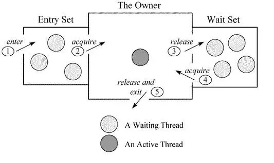

<font style="color:rgb(51, 51, 51);background-color:rgb(248, 246, 244);">在 Java 虚拟机 (HotSpot) 中，Monitor 是基于 C++ 实现的，由 ObjectMonitor 实现的, 几个关键属性：</font>

+ <font style="color:rgb(51, 51, 51);background-color:rgb(248, 246, 244);">_owner：指向持有 ObjectMonitor 对象的线程</font>
+ <font style="color:rgb(51, 51, 51);background-color:rgb(248, 246, 244);">_WaitSet：存放处于 wait 状态的线程队列</font>
+ <font style="color:rgb(51, 51, 51);background-color:rgb(248, 246, 244);">_EntryList：存放处于等待锁 block 状态的线程队列</font>
+ <font style="color:rgb(51, 51, 51);background-color:rgb(248, 246, 244);">_recursions：锁的重入次数</font>
+ <font style="color:rgb(51, 51, 51);background-color:rgb(248, 246, 244);">count：用来记录该线程获取锁的次数</font>

<font style="color:rgb(51, 51, 51);background-color:rgb(248, 246, 244);">ObjectMonitor 中有两个队列，WaitSet 和 _EntryList，用来保存 ObjectWaiter 对象列表( 每个等待锁的线程都会被封装成 ObjectWaiter 对象)，owner 指向持有 ObjectMonitor 对象的线程，当多个线程同时访问一段同步代码时，首先会进入 _EntryList 集合，当线程获取到对象的 monitor 后进入 _Owner 区域并把 monitor 中的 owner 变量设置为当前线程同时 monitor 中的计数器 count 加 1。</font>

<font style="color:rgb(51, 51, 51);background-color:rgb(248, 246, 244);">若线程调用 wait() 方法，将释放当前持有的 monitor，owner 变量恢复为 null，count 自减 1，同时该线程进入 WaitSet 集合中等待被唤醒。</font>

**<font style="color:rgb(34, 34, 34);background-color:rgb(248, 246, 244);">等待/通知机制</font>**

<font style="color:rgb(51, 51, 51);background-color:rgb(248, 246, 244);">一个线程修改了一个对象的值，而另一个线程感知到了变化，然后进行相应的操作。</font>

<font style="color:rgb(51, 51, 51);background-color:rgb(248, 246, 244);">Java 多线程的等待/通知机制是基于Object类的wait()方法和notify(), notifyAll()方法来实现的。</font>

<font style="color:rgb(51, 51, 51);background-color:rgb(248, 246, 244);">等待/通知机制，是指一个线程 A 调用了对象 O 的 wait()方法进入等待状态，而另一个线程 B 调用了对象 O 的 notify()或者 notifyAll()方法，线程 A 收到通知后从对象 O 的 wait()方法返回，进而 执行后续操作上。</font>

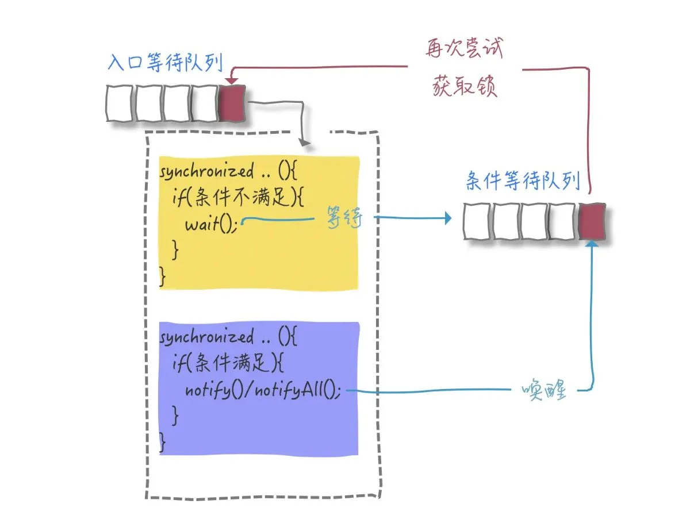

```plain
public class TestSync {
    public static void main(String[] args) {
        // 定义一个锁对象
        Object lock = new Object();
        List<String>  list = new ArrayList<>();
        // 实现线程A
        Thread threadA = new Thread(() -> {
            synchronized (lock) {
                for (int i = 1; i <= 10; i++) {
                    list.add("abc");
                    System.out.println("线程A向list中添加一个元素，此时list中的元素个数为：" + list.size());
                    try {
                        Thread.sleep(500);
                    } catch (InterruptedException e) {
                        e.printStackTrace();
                    }
                    if (list.size() == 5)
                        lock.notify();// 唤醒B线程
                }
            }
        });
        // 实现线程B
        Thread threadB = new Thread(() -> {
            while (true) {
                synchronized (lock) {
                    if (list.size() != 5) {
                        try {
                            lock.wait();
                        } catch (InterruptedException e) {
                            e.printStackTrace();
                        }
                    }
                    System.out.println("线程B收到通知，开始执行自己的业务...");
                }
            }
        });
        // 需要先启动线程B
        threadB.start();
        try {
            Thread.sleep(1000);
        } catch (InterruptedException e) {
            e.printStackTrace();
        }
        // 再启动线程A
        threadA.start();
    }
}
```

**<font style="color:rgb(34, 34, 34);background-color:rgb(248, 246, 244);">等待方</font>**<font style="color:rgb(51, 51, 51);background-color:rgb(248, 246, 244);">遵循如下原则。</font>

1. <font style="color:rgb(51, 51, 51);background-color:rgb(248, 246, 244);">获取对象的锁。</font>
2. <font style="color:rgb(51, 51, 51);background-color:rgb(248, 246, 244);">如果条件不满足，那么调用对象的 wait()方法，被通知后仍要检查条件。</font>
3. <font style="color:rgb(51, 51, 51);background-color:rgb(248, 246, 244);">条件满足则执行对应的逻辑。</font>

<font style="color:rgb(51, 51, 51);background-color:rgb(248, 246, 244);">对应的伪代码如下。</font>

```plain
synchronized(对象) {
  while(条件不满足) {
   对象.wait();
  }

   满足条件对应的处理逻辑
}
```

**<font style="color:rgb(34, 34, 34);background-color:rgb(248, 246, 244);">通知方规范</font>**

<font style="color:rgb(51, 51, 51);background-color:rgb(248, 246, 244);">通知方遵循如下原则。</font>

1. <font style="color:rgb(51, 51, 51);background-color:rgb(248, 246, 244);">获得对象的锁。</font>
2. <font style="color:rgb(51, 51, 51);background-color:rgb(248, 246, 244);">改变条件。</font>
3. <font style="color:rgb(51, 51, 51);background-color:rgb(248, 246, 244);">通知所有等待在对象上的线程。</font>

<font style="color:rgb(51, 51, 51);background-color:rgb(248, 246, 244);">对应的伪代码如下。</font>

```plain
synchronized(对象) {
  改变条件
  对象.notifyAll();
}
```

**<font style="color:rgb(34, 34, 34);background-color:rgb(248, 246, 244);">ThreadLocal 的使用</font>**

<font style="color:rgb(51, 51, 51);background-color:rgb(248, 246, 244);">ThreadLocal 是 Java 并发包（java.lang）中的一个类，</font>**<font style="color:rgb(34, 34, 34);background-color:rgb(248, 246, 244);">用于为每个线程创建独立的变量副本</font>**<font style="color:rgb(51, 51, 51);background-color:rgb(248, 246, 244);">，实现线程间的数据隔离。</font>

<font style="color:rgb(51, 51, 51);background-color:rgb(248, 246, 244);">它通过空间换时间的方式，避免多线程共享变量时的同步开销，适用于需要线程私有数据的场景。</font>

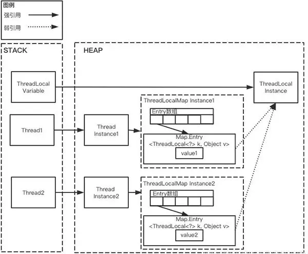

<font style="color:rgb(51, 51, 51);background-color:rgb(248, 246, 244);">在 Web 应用中通过 ThreadLocal 传递用户身份信息是典型的生产级场景。</font>

**<font style="color:rgb(34, 34, 34);background-color:rgb(248, 246, 244);">定义用户上下文类</font>**

```csharp
public class UserContext {
    // 使用静态内部类实现懒加载，保证线程安全
    private static final ThreadLocal<UserInfo> currentUser = new ThreadLocal<>();

    public static void set(UserInfo user) {
        currentUser.set(user);
    }

    public static UserInfo get() {
        UserInfo user = currentUser.get();
        if (user == null) {
            throw new IllegalStateException("User not found in current thread context");
        }
        return user;
    }

    public static void clear() {
        currentUser.remove(); // 必须显式清理防止内存泄漏
    }
}
```

**<font style="color:rgb(34, 34, 34);background-color:rgb(248, 246, 244);">拦截器处理上下文</font>**

```typescript
@Component
public class AuthInterceptor implements HandlerInterceptor {
    @Autowired
    private JwtTokenService jwtTokenService; // 自定义的JWT解析服务

    @Override
    public boolean preHandle(HttpServletRequest request, HttpServletResponse response, Object handler) {
        // 从请求头获取Token
        String token = request.getHeader("Authorization");
        if (token != null && token.startsWith("Bearer ")) {
            token = token.substring(7);
            UserInfo user = jwtTokenService.parseToken(token); // 解析用户信息
            UserContext.set(user); // 存储到ThreadLocal
        }
        return true;
    }

    @Override
    public void afterCompletion(HttpServletRequest request, HttpServletResponse response,
                               Object handler, Exception ex) {
        UserContext.clear(); // 请求结束时必须清理ThreadLocal
    }
}
```

**<font style="color:rgb(34, 34, 34);background-color:rgb(248, 246, 244);">注册拦截器到 Spring MVC</font>**

```typescript
@Configuration
public class WebConfig implements WebMvcConfigurer {
    @Autowired
    private AuthInterceptor authInterceptor;

    @Override
    public void addInterceptors(InterceptorRegistry registry) {
        registry.addInterceptor(authInterceptor)
                .addPathPatterns("/api/**") // 拦截API请求
                .excludePathPatterns("/api/public/**"); // 排除公共接口
    }
}
```

**<font style="color:rgb(34, 34, 34);background-color:rgb(248, 246, 244);">Controller 直接使用</font>**

```kotlin
@RestController
@RequestMapping("/api")
public class OrderController {
    @GetMapping("/orders")
    public ResponseEntity<List<Order>> getOrders() {
        UserInfo currentUser = UserContext.get(); // 无需参数传递
        return orderService.findByUserId(currentUser.getUserId());
    }
}
```

## **<font style="color:rgb(34, 34, 34);background-color:rgb(248, 246, 244);">Java 各种各样的锁使用和原理</font>**
### **<font style="color:rgb(34, 34, 34);background-color:rgb(248, 246, 244);">Syncronized 的使用和原理</font>**
**<font style="color:rgb(34, 34, 34);background-color:rgb(248, 246, 244);">Java 多线程的锁都是基于对象的</font>**<font style="color:rgb(51, 51, 51);background-color:rgb(248, 246, 244);">，Java 中的每一个对象都可以作为一个锁。</font>

<font style="color:rgb(51, 51, 51);background-color:rgb(248, 246, 244);">需要注意的是</font>**<font style="color:rgb(34, 34, 34);background-color:rgb(248, 246, 244);">类锁</font>**<font style="color:rgb(51, 51, 51);background-color:rgb(248, 246, 244);">其实也是对象锁。</font>

<font style="color:rgb(51, 51, 51);background-color:rgb(248, 246, 244);">Java 类只有一个 Class 对象（可以有多个实例对象，多个实例共享这个 Class 对象），而 Class 对象也是特殊的 Java 对象。所以我们常说的类锁，其实就是 Class 对象的锁。</font>

<font style="color:rgb(51, 51, 51);background-color:rgb(248, 246, 244);">我们通常使用synchronized关键字来给一段代码或一个方法上锁。它通常有以下三种形式。</font>

```typescript
// 关键字在实例方法上，锁为当前实例
public synchronized void instanceLock() {
    // code
}

// 关键字在静态方法上，锁为当前Class对象
public static synchronized void classLock() {
    // code
}

// 关键字在代码块上，锁为括号里面的对象
public void blockLock() {
    Object o = new Object();
    synchronized (o) {
        // code
    }
}
```

<font style="color:rgb(51, 51, 51);background-color:rgb(248, 246, 244);">这里介绍一下“临界区”的概念。所谓“临界区”，指的是某一块代码区域，它同一时刻只能由一个线程执行。</font>

+ **<font style="color:rgb(34, 34, 34);background-color:rgb(248, 246, 244);">修饰普通函数，监视器锁（monitor）便是对象实例（this）</font>**
+ **<font style="color:rgb(34, 34, 34);background-color:rgb(248, 246, 244);">修饰静态静态函数，视器锁（monitor）便是对象的Class实例（每个对象只有一个Class实例）</font>**
+ **<font style="color:rgb(34, 34, 34);background-color:rgb(248, 246, 244);">修饰代码块，监视器锁（monitor）是指定对象实例</font>**

<font style="color:rgb(51, 51, 51);background-color:rgb(248, 246, 244);">底层实现原理是通过monitorenter与monitorexit指令（</font>**<font style="color:rgb(34, 34, 34);background-color:rgb(248, 246, 244);">获取锁、释放锁</font>**<font style="color:rgb(51, 51, 51);background-color:rgb(248, 246, 244);">）。</font>

<font style="color:rgb(51, 51, 51);background-color:rgb(248, 246, 244);">monitorenter指令插入到同步代码块的开始位置，monitorexit指令插入到同步代码块的结束位置，J V M需要保证每一个 monitorenter都有monitorexit与之对应。</font>

**<font style="color:rgb(34, 34, 34);background-color:rgb(248, 246, 244);">任何对象</font>**<font style="color:rgb(51, 51, 51);background-color:rgb(248, 246, 244);">都有一个监视器锁（monitor）关联，线程执行monitorenter指令时尝试获取monitor的所有权。</font>

+ **<font style="color:rgb(34, 34, 34);background-color:rgb(248, 246, 244);">如果monitor的进入数为0，则该线程进入monitor，然后将进入数设置为1，该线程为monitor的所有者</font>**
+ **<font style="color:rgb(34, 34, 34);background-color:rgb(248, 246, 244);">如果线程已经占有该monitor，重新进入，则monitor的进入数加1</font>**
+ **<font style="color:rgb(34, 34, 34);background-color:rgb(248, 246, 244);">线程执行monitorexit，monitor的进入数-1，执行过多少次monitorenter，最终要执行对应次数的monitorexit</font>**
+ **<font style="color:rgb(34, 34, 34);background-color:rgb(248, 246, 244);">如果其他线程已经占用monitor，则该线程进入阻塞状态，直到monitor的进入数为 0，再重新尝试获取monitor的所有权</font>**

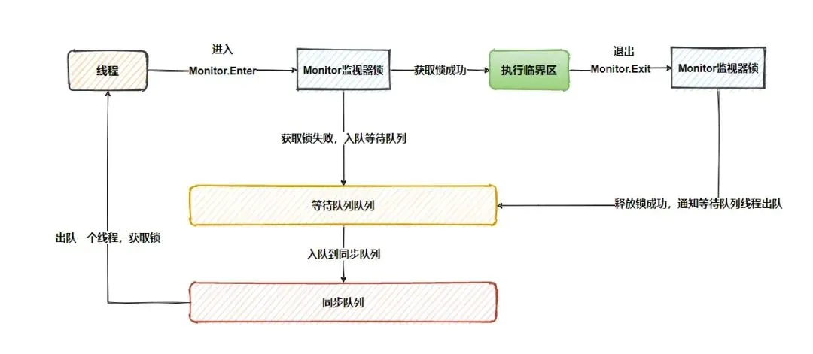

<font style="color:rgb(51, 51, 51);background-color:rgb(248, 246, 244);">Java 6 为了减少获得锁和释放锁带来的性能消耗，引入了“偏向锁”和“轻量级锁“。在 Java 6 以前，所有的锁都是”重量级“锁。</font>

<font style="color:rgb(51, 51, 51);background-color:rgb(248, 246, 244);">所以在 Java 6 及其以后，一个对象其实有四种锁状态，它们级别由低到高依次是：</font>

1. <font style="color:rgb(51, 51, 51);background-color:rgb(248, 246, 244);">无锁状态</font>
2. <font style="color:rgb(51, 51, 51);background-color:rgb(248, 246, 244);">偏向锁状态</font>
3. <font style="color:rgb(51, 51, 51);background-color:rgb(248, 246, 244);">轻量级锁状态</font>
4. <font style="color:rgb(51, 51, 51);background-color:rgb(248, 246, 244);">重量级锁状态</font>

<font style="color:rgb(51, 51, 51);background-color:rgb(248, 246, 244);">Synchronized 机制及锁膨胀流程详见：</font>[<font style="color:rgb(177, 75, 67);background-color:rgb(248, 246, 244);">https://www.processon.com/view/62c005a10e3e746592070665</font>](https://www.processon.com/view/62c005a10e3e746592070665)

<font style="color:rgb(51, 51, 51);background-color:rgb(248, 246, 244);">Java中每个对象都拥有对象头，对象头由Mark World 、指向类的指针、以及数组长度三部分组成，本文，我们只需要关心Mark World 即可，Mark World 记录了对象的HashCode、分代年龄和锁标志位信息。</font>

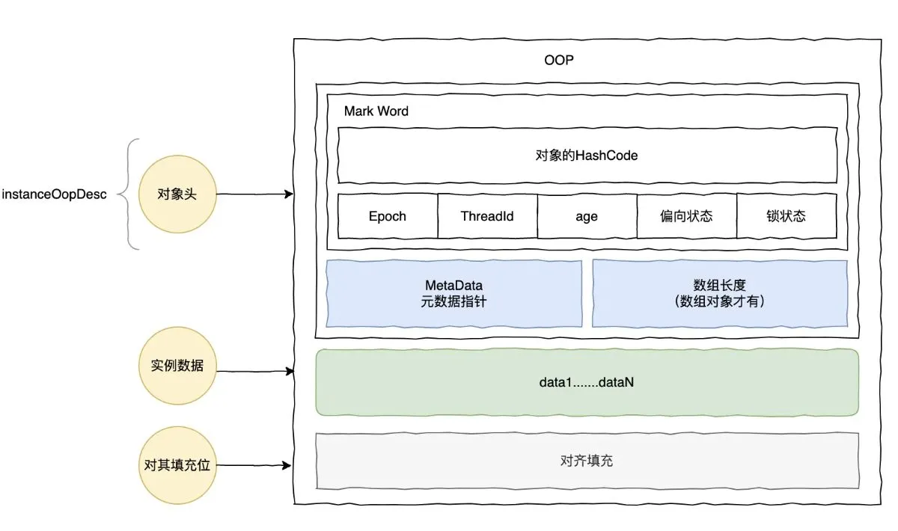

**<font style="color:rgb(34, 34, 34);background-color:rgb(248, 246, 244);">Mark World 简化结构</font>**

**<font style="color:rgb(34, 34, 34);background-color:rgb(248, 246, 244);">锁状态存储内容锁标记</font>**<font style="color:rgb(51, 51, 51);background-color:rgb(248, 246, 244);">无锁对象的 hashCode、对象分代年龄、是否是偏向锁（0）01偏向锁偏向线程 ID、偏向时间戳、对象分代年龄、是否是偏向锁（1）01轻量级锁指向栈中锁记录的指针00重量级锁指向互斥量（重量级锁）的指针10</font>

<font style="color:rgb(51, 51, 51);background-color:rgb(248, 246, 244);">读者们只需知道，锁的升级变化，体现在锁对象的对象头Mark World部分，也就是说Mark World的内容会随着锁升级而改变。</font>

<font style="color:rgb(51, 51, 51);background-color:rgb(248, 246, 244);">Java1.5以后为了减少获取锁和释放锁带来的性能消耗，引入了</font>**<font style="color:rgb(34, 34, 34);background-color:rgb(248, 246, 244);">偏向锁</font>**<font style="color:rgb(51, 51, 51);background-color:rgb(248, 246, 244);">和</font>**<font style="color:rgb(34, 34, 34);background-color:rgb(248, 246, 244);">轻量级锁</font>**<font style="color:rgb(51, 51, 51);background-color:rgb(248, 246, 244);">，Synchronized的升级顺序是 「</font>**<font style="color:rgb(34, 34, 34);background-color:rgb(248, 246, 244);">无锁-->偏向锁-->轻量级锁-->重量级锁，只会升级不会降级</font>**<font style="color:rgb(51, 51, 51);background-color:rgb(248, 246, 244);">」</font>

**<font style="color:rgb(34, 34, 34);background-color:rgb(248, 246, 244);">偏向锁</font>**

<font style="color:rgb(51, 51, 51);background-color:rgb(248, 246, 244);">偏向锁是 JDK6 中的重要引进，因为 HotSpot 作者经过研究实践发现，在大多数情况下，锁不仅不存在多线程竞争，而且总是由同一线程多次获得，为了让线程获得锁的代价更低，引进了偏向锁。</font>

<font style="color:rgb(51, 51, 51);background-color:rgb(248, 246, 244);">线程执行同步代码或方法前，线程只需要判断对象头的Mark Word中线程ID与当前线程ID是否一致，如果一致直接执行同步代码或方法，具体流程如下。</font>

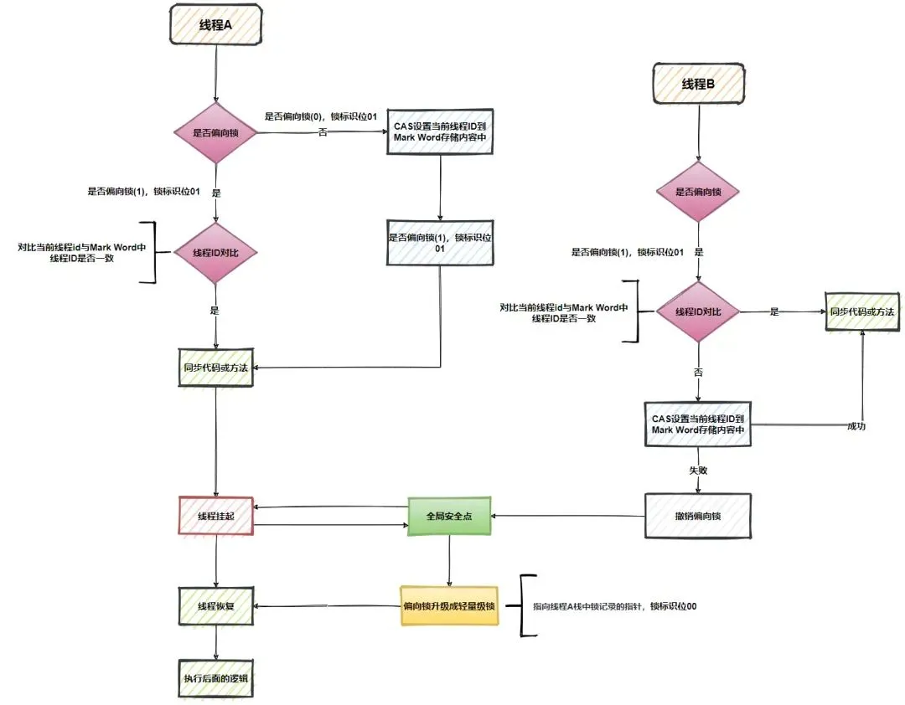

<font style="color:rgb(51, 51, 51);background-color:rgb(248, 246, 244);">引入偏向锁主要目的是：为了在没有多线程竞争的情况下尽量减少不必要的轻量级锁执行路径。</font>

**<font style="color:rgb(34, 34, 34);background-color:rgb(248, 246, 244);">轻量级锁</font>**

<font style="color:rgb(51, 51, 51);background-color:rgb(248, 246, 244);">引入轻量级锁的主要目的是 在没有多线程竞争的前提下，减少传统的重量级锁使用操作系统互斥量产生的性能消耗。</font>

<font style="color:rgb(51, 51, 51);background-color:rgb(248, 246, 244);">在线程进入同步块时，如果同步对象锁状态为无锁状态（锁标志位为“01”状态，是否为偏向锁为“0”），虚拟机首先将在当前线程的栈帧中建立一个名为锁记录（Lock Record）的空间，用于存储锁对象目前的 Mark Word 的拷贝，官方称之为 Displaced Mark Word。</font>

<font style="color:rgb(51, 51, 51);background-color:rgb(248, 246, 244);">此时线程堆栈与对象头的状态如下图所示：</font>

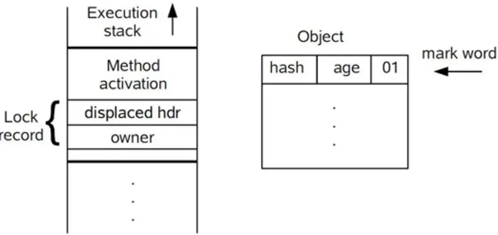

<font style="color:rgb(51, 51, 51);background-color:rgb(248, 246, 244);">若一个线程获得锁时发现是轻量级锁，它会将对象的 Mark Word 复制到栈帧中的锁记录 Lock Record 中（Displaced Mark Word 里面）。</font>

<font style="color:rgb(51, 51, 51);background-color:rgb(248, 246, 244);">线程尝试利用 CAS 操作将对象的 Mark Word 更新为指向 Lock Record 的指针，如果成功表示当前线程竞争到锁，则将锁标志位变成 00，执行同步操作；</font>

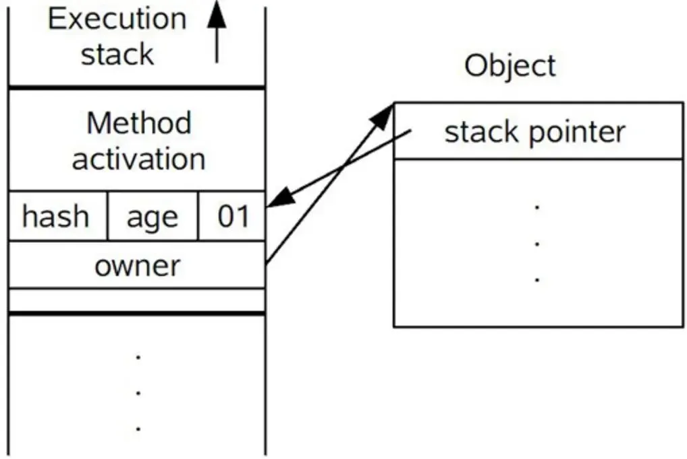

<font style="color:rgb(51, 51, 51);background-color:rgb(248, 246, 244);">img</font>

<font style="color:rgb(51, 51, 51);background-color:rgb(248, 246, 244);">如果失败，表示 MarkWord 已经被替换成了其他线程的锁记录，说明在与其他线程抢占竞争锁，当前线程就尝试使用自旋来获取锁，若自旋结束时仍未获得锁，轻量级锁就要膨胀为重量级锁。</font>

**<font style="color:rgb(34, 34, 34);background-color:rgb(248, 246, 244);">轻量级锁解锁和升级重量级锁</font>**

<font style="color:rgb(51, 51, 51);background-color:rgb(248, 246, 244);">轻量级锁的释放也是通过 CAS 操作来进行的，当前线程使用 CAS 操作将 Displaced Mark Word 的内存复制回锁对象的 MarkWord 中，如果 CAS 操作替换成功，则说明释放锁成功；</font>

<font style="color:rgb(51, 51, 51);background-color:rgb(248, 246, 244);">如果 CAS 自旋多次还是替换失败的话，说明有其他线程尝试获取该锁，则需要将轻量级锁膨胀升级为重量级锁；</font>

<font style="color:rgb(51, 51, 51);background-color:rgb(248, 246, 244);">轻量级锁升级为重量级锁的流程</font>

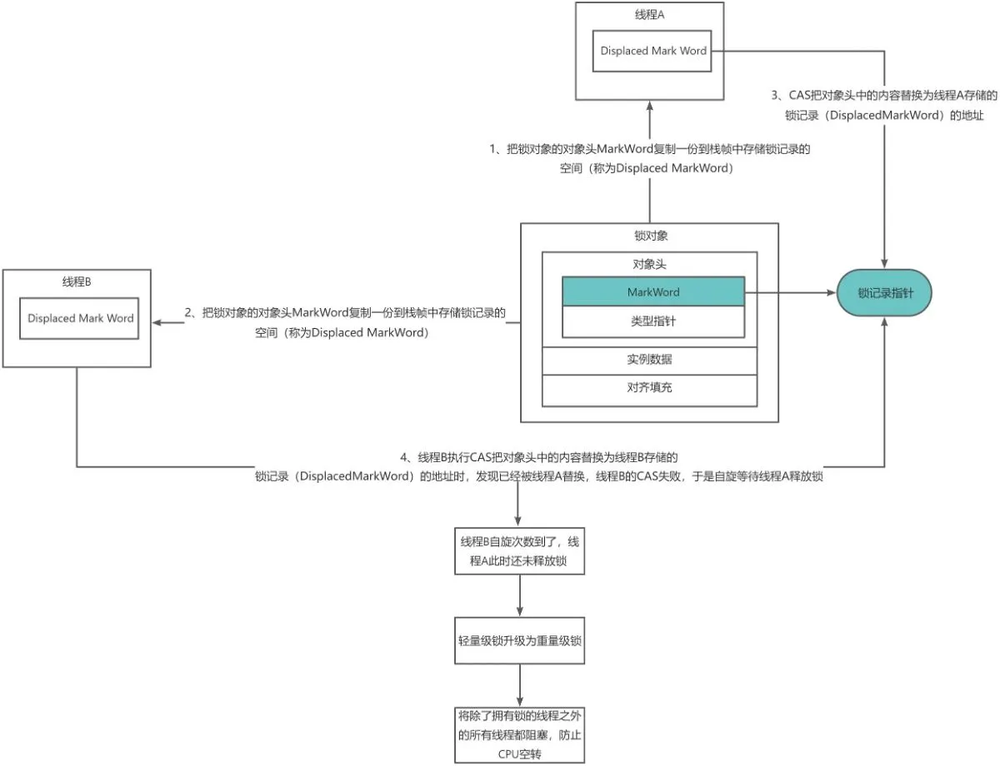

### **<font style="color:rgb(34, 34, 34);background-color:rgb(248, 246, 244);">Lock 接口</font>**
<font style="color:rgb(51, 51, 51);background-color:rgb(248, 246, 244);">在 Java1.5 版本以前，我们开发多线程程序只能通过关键字 synchronized 进行共享资源的同步、临界值的控制。</font>

<font style="color:rgb(51, 51, 51);background-color:rgb(248, 246, 244);">随着版本的不断升级，JDK 对 synchronized 关键字的性能优化工作一直在继续，但是 synchronized 在使用的过程中还是存在着比较多的缺陷和不足，因此在 1.5 版本以后 JDK 增加了对显式锁的支持。</font>

<font style="color:rgb(51, 51, 51);background-color:rgb(248, 246, 244);">锁 Lock 除了能够完成关键字 synchronized 的语义和功能之外，它还提供了很多灵活方便的方法：</font>

+ <font style="color:rgb(51, 51, 51);background-color:rgb(248, 246, 244);">通过显式锁对象提供的方法查看有哪些线程被阻塞。</font>
+ <font style="color:rgb(51, 51, 51);background-color:rgb(248, 246, 244);">可以创建 Condition 对象进行线程间的通信。</font>
+ <font style="color:rgb(51, 51, 51);background-color:rgb(248, 246, 244);">中断由于获取锁而被阻塞的线程</font>
+ <font style="color:rgb(51, 51, 51);background-color:rgb(248, 246, 244);">读写锁控制</font>
+ <font style="color:rgb(51, 51, 51);background-color:rgb(248, 246, 244);">……</font>

<font style="color:rgb(51, 51, 51);background-color:rgb(248, 246, 244);">Lock 是一个接口，它定义了锁获取和释放的基本操作。</font>

+ <font style="color:rgb(51, 51, 51);background-color:rgb(248, 246, 244);">lock()方法：尝试获取锁，如果此刻该锁未被其他线程持有，则会立即返回，并且设置锁的 hold 计数为 1；如果当前线程已经持有该锁则会再次尝试申请，hold 计数将会增加一个，并且立即返回；如果该锁当前被另外一个线程持有，那么当前线程会进入阻塞，直到获取该锁，由于调用 lock 方法而进入阻塞状态的线程同样不会被中断，这一点与进入 synchronized 同步方法或者代码块被阻塞类似。</font>
+ <font style="color:rgb(51, 51, 51);background-color:rgb(248, 246, 244);">lockInterruptibly()方法：该方法的作用与前者类似，但是使用该方法试图获取锁而进入阻塞操作的线程则是可被中断的，也就说线程可以获得中断信号。</font>
+ <font style="color:rgb(51, 51, 51);background-color:rgb(248, 246, 244);">tryLock()方法：调用该方法获取锁，无论成功与否都会立即返回，线程不会进入阻塞状态，若成功获取锁则返回 true，若获取锁失败则返回 false。使用该方法时请务必注意进行结果的判断，否则会出现获取锁失败却仍旧操作共享资源而导致数据不一致等问题的出现。</font>
+ <font style="color:rgb(51, 51, 51);background-color:rgb(248, 246, 244);">tryLock(long time, TimeUnit unit)方法：该方法与 tryLock()方法类似，只不过多了单位时间设置，如果在单位时间内未获取到锁，则返回结果为 false，如果在单位时间内获取到了锁，则返回结果为 true，同样 hold 计数也会被设置为 1。</font>
+ <font style="color:rgb(51, 51, 51);background-color:rgb(248, 246, 244);">unlock()方法：当某个线程对锁的使用结束之后，应该确保对锁资源的释放，以便其他线程能够继续争抢，unlock()方法的作用正在于此。</font>
+ <font style="color:rgb(51, 51, 51);background-color:rgb(248, 246, 244);">newCondition()方法：创建一个与该 lock 相关联的 Condition 对象</font>

<font style="color:rgb(51, 51, 51);background-color:rgb(248, 246, 244);">AbstractQueuedSynchronizer 以及常用 Lock 接口的实现 ReentrantLock。</font>

<font style="color:rgb(51, 51, 51);background-color:rgb(248, 246, 244);">Lock 接口的实现基本都是通过聚合了一个同步器的子类来完成线程访问控制的。</font>

<font style="color:rgb(51, 51, 51);background-color:rgb(248, 246, 244);">Lock 的使用也很简单，代码如下。</font>

```plain
Lock lock = new ReentrantLock();
lock.lock();
try {

} finally {
 lock.unlock();
}
```

<font style="color:rgb(51, 51, 51);background-color:rgb(248, 246, 244);">在 finally 块中释放锁，目的是保证在获取到锁之后，最终能够被释放。</font>

<font style="color:rgb(51, 51, 51);background-color:rgb(248, 246, 244);">注意：不要将获取锁的过程写在 try 块中，因为如果在获取锁（自定义锁的实现）时发生了异常，会导致锁无故释放。</font>

### **<font style="color:rgb(34, 34, 34);background-color:rgb(248, 246, 244);">AQS 实现原理</font>**
<font style="color:rgb(51, 51, 51);background-color:rgb(248, 246, 244);">队列同步器 AbstractQueuedSynchronizer（以下简称同步器），是用来构建锁或者其他同步组件的基础框架，</font>**<font style="color:rgb(34, 34, 34);background-color:rgb(248, 246, 244);">它使用了一个 int 成员变量表示同步状态，通过内置的 FIFO 队列来完成资源获 取线程的排队工作</font>**<font style="color:rgb(51, 51, 51);background-color:rgb(248, 246, 244);">。</font>

<font style="color:rgb(51, 51, 51);background-color:rgb(248, 246, 244);">我们可以理解 AQS 将整个加锁的算法逻辑进行封装，在加锁过程中，免不了要对同步状态进行更改，这时就需要使用同步器提供的 3 个方法getState()、setState(int newState)和compareAndSetState(int expect,int update)来进行操 作.</font>

<font style="color:rgb(51, 51, 51);background-color:rgb(248, 246, 244);">如果获取锁成功，直接扣减 AQS 的 State 值，不会涉及到 AQS。但如果当前线程获取锁失败，那么剩下的包括阻塞唤醒线程、重新发起获取锁之类的操作全都都会扔给 AQS 。</font>

<font style="color:rgb(51, 51, 51);background-color:rgb(248, 246, 244);">简单来说就是 AQS 包揽了同步机制的各种工作。</font>

**<font style="color:rgb(34, 34, 34);background-color:rgb(248, 246, 244);">AQS 获取锁流程</font>**

<font style="color:rgb(51, 51, 51);background-color:rgb(248, 246, 244);">下图就是线程获取锁的大致流程：</font>

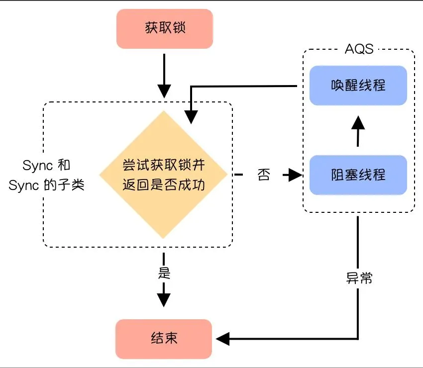

**<font style="color:rgb(34, 34, 34);background-color:rgb(248, 246, 244);">这其实是一个模板方法模式来实现的，将加锁与解锁的变化与不变点隔离，不同类型的锁交给子类实现，同步器面向的是锁的实现者， 它简化了锁的实现方式，屏蔽了同步状态管理、线程的排队、等待与唤醒等底层操作。</font>**

<font style="color:rgb(51, 51, 51);background-color:rgb(248, 246, 244);">A Q S采用了模板方法设计模式，提供了两类模板，一类是独占式模板，另一类是共享形模式，对应的模板函数如下</font>

+ **<font style="color:rgb(34, 34, 34);background-color:rgb(248, 246, 244);">独占式</font>**
    - **<font style="color:rgb(34, 34, 34);background-color:rgb(248, 246, 244);">acquire获取资源</font>**
    - **<font style="color:rgb(34, 34, 34);background-color:rgb(248, 246, 244);">release释放资源</font>**
+ **<font style="color:rgb(34, 34, 34);background-color:rgb(248, 246, 244);">共享式</font>**
    - **<font style="color:rgb(34, 34, 34);background-color:rgb(248, 246, 244);">acquireShared获取资源</font>**
    - **<font style="color:rgb(34, 34, 34);background-color:rgb(248, 246, 244);">releaseShared释放资源</font>**

<font style="color:rgb(51, 51, 51);background-color:rgb(248, 246, 244);">下面就是使用 AQS 实现的最简单的独占锁，从代码也可以看出 AQS 大大降低了开发锁的难度：</font>

```plain
class Mutex {

    private static class Sync extends AbstractQueuedSynchronizer {
        @Override
        protected boolean tryAcquire(int arg) {
            return compareAndSetState(0, 1);
        }

        @Override
        protected boolean tryRelease(int arg) {
            setState(0);
            return true;
        }

        @Override
        protected boolean isHeldExclusively() {
            return getState() == 1;
        }
    }

    private final Sync sync = new Sync();

    public void lock() {
        sync.tryAcquire(1);
    }

    public void unlock() {
        sync.tryRelease(1);
    }

    public boolean isLocked() {
        return sync.isHeldExclusively();
    }

}
```

**<font style="color:rgb(34, 34, 34);background-color:rgb(248, 246, 244);">AQS 架构设计</font>**

<font style="color:rgb(51, 51, 51);background-color:rgb(248, 246, 244);">AQS 的继承关系如下图所示：</font>

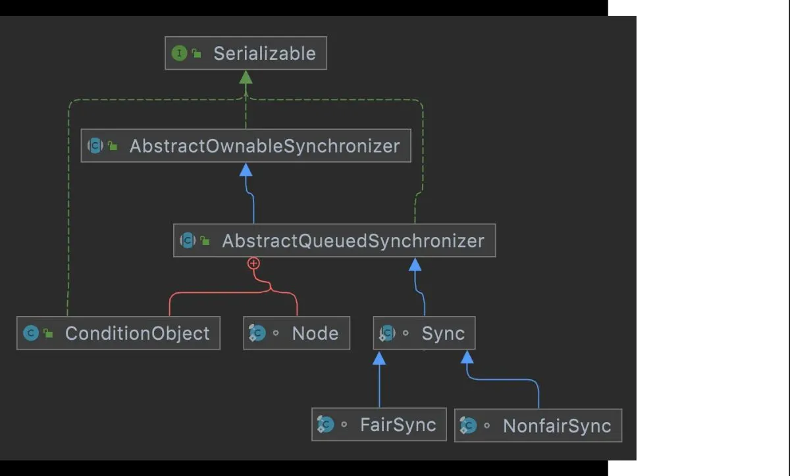

<font style="color:rgb(51, 51, 51);background-color:rgb(248, 246, 244);">AQS 继承了另外一个抽象类 AbstractOwnableSynchronizer，这个类的功能其实就是持有一个不能被序列化的属性 exclusiveOwnerThread ，它代表独占线程。</font>

<font style="color:rgb(51, 51, 51);background-color:rgb(248, 246, 244);">在属性中记录持有独占锁的线程的目的就是为了实现可重入功能，当下一次获取这个锁的线程与当前持有锁的线程相同时，就可以获取到锁，同时 AQS 的 state 值会加 1。</font>

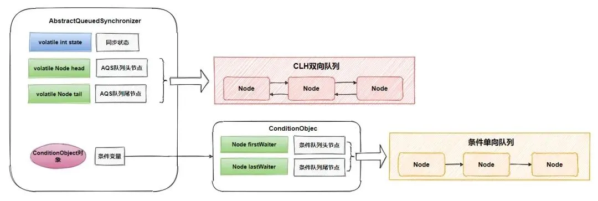

+ <font style="color:rgb(51, 51, 51);background-color:rgb(248, 246, 244);">state同步状态</font>
+ <font style="color:rgb(51, 51, 51);background-color:rgb(248, 246, 244);">Node组成的CLH队列</font>
+ <font style="color:rgb(51, 51, 51);background-color:rgb(248, 246, 244);">ConditionObject条件变量（</font>**<font style="color:rgb(34, 34, 34);background-color:rgb(248, 246, 244);">包含Node组成的条件单向队列</font>**<font style="color:rgb(51, 51, 51);background-color:rgb(248, 246, 244);">），下面会分别对这三部分做介绍。</font>

**<font style="color:rgb(34, 34, 34);background-color:rgb(248, 246, 244);">同步状态</font>**

<font style="color:rgb(51, 51, 51);background-color:rgb(248, 246, 244);">在A Q S中维护了一个同步状态变量state，getState函数获取同步状态，setState、compareAndSetState函数修改同步状态。</font>

<font style="color:rgb(51, 51, 51);background-color:rgb(248, 246, 244);">对于A Q S来说，线程同步的关键是对state的操作，可以说获取、释放资源是否成功都是由state决定的，比如state>0代表可获取资源，否则无法获取。</font>

<font style="color:rgb(51, 51, 51);background-color:rgb(248, 246, 244);">所以state的具体语义由实现者去定义，现有的ReentrantLock、ReentrantReadWriteLock、Semaphore、CountDownLatch定义的state语义都不一样。</font>

+ **<font style="color:rgb(34, 34, 34);background-color:rgb(248, 246, 244);">ReentrantLock的state用来表示是否有锁资源</font>**
+ **<font style="color:rgb(34, 34, 34);background-color:rgb(248, 246, 244);">ReentrantReadWriteLock的state高16位代表读锁状态，低16位代表写锁状态</font>**
+ **<font style="color:rgb(34, 34, 34);background-color:rgb(248, 246, 244);">Semaphore的state用来表示可用信号的个数</font>**
+ **<font style="color:rgb(34, 34, 34);background-color:rgb(248, 246, 244);">CountDownLatch的state用来表示计数器的值</font>**

**<font style="color:rgb(34, 34, 34);background-color:rgb(248, 246, 244);">Node</font>**

<font style="color:rgb(51, 51, 51);background-color:rgb(248, 246, 244);">Node 就是 AQS 实现各种队列的基本组成单元。它有以下几个属性：</font>

+ **<font style="color:rgb(34, 34, 34);background-color:rgb(248, 246, 244);">waitStatus：</font>**<font style="color:rgb(51, 51, 51);background-color:rgb(248, 246, 244);">代表节点状态：CANCELLED(1)、SIGNAL(-1)、CONDITION(-2)、PROPAGATE(-3)、0（初始状态）</font>
+ **<font style="color:rgb(34, 34, 34);background-color:rgb(248, 246, 244);">prev：</font>**<font style="color:rgb(51, 51, 51);background-color:rgb(248, 246, 244);">代表同步队列的上一个节点</font>
+ **<font style="color:rgb(34, 34, 34);background-color:rgb(248, 246, 244);">next：</font>**<font style="color:rgb(51, 51, 51);background-color:rgb(248, 246, 244);">代表同步队列的下一个节点</font>
+ **<font style="color:rgb(34, 34, 34);background-color:rgb(248, 246, 244);">thread：</font>**<font style="color:rgb(51, 51, 51);background-color:rgb(248, 246, 244);">节点对应的线程</font>
+ **<font style="color:rgb(34, 34, 34);background-color:rgb(248, 246, 244);">nextWaiter：</font>**<font style="color:rgb(51, 51, 51);background-color:rgb(248, 246, 244);">在同步队列里用来标识节点是独占锁节点还是共享锁节点，在条件队列里代表条件条件队列的下一个节点。</font>

**<font style="color:rgb(34, 34, 34);background-color:rgb(248, 246, 244);">队列</font>**

<font style="color:rgb(51, 51, 51);background-color:rgb(248, 246, 244);">AQS 总共有两种队列，一种是同步队列，代表的是正常获取锁释放锁的队列，一种是条件队列，代表的是每个 ConditionObject 对应的队列，这两种队列都是</font><font style="color:rgb(51, 51, 51);background-color:rgb(248, 246, 244);"> </font>**<font style="color:rgb(34, 34, 34);background-color:rgb(248, 246, 244);">FIFO</font>**<font style="color:rgb(51, 51, 51);background-color:rgb(248, 246, 244);"> </font><font style="color:rgb(51, 51, 51);background-color:rgb(248, 246, 244);">队列，也就是先进先出队列。</font>

**<font style="color:rgb(34, 34, 34);background-color:rgb(248, 246, 244);">同步队列</font>**

<font style="color:rgb(51, 51, 51);background-color:rgb(248, 246, 244);">而同步队列的节点分为两种，一种是独占锁的节点，一种是共享锁的节点，它们唯一的区别就是 nextWaiter 这个指针的值。</font>

<font style="color:rgb(51, 51, 51);background-color:rgb(248, 246, 244);">如果是独占锁的节点，nextWaiter 的值是 null，如果是共享锁的节点，nextWaiter 会指向一个静态变量 SHARED 节点。</font>

<font style="color:rgb(51, 51, 51);background-color:rgb(248, 246, 244);">独占锁队列和共享锁队列如下图所示：</font>

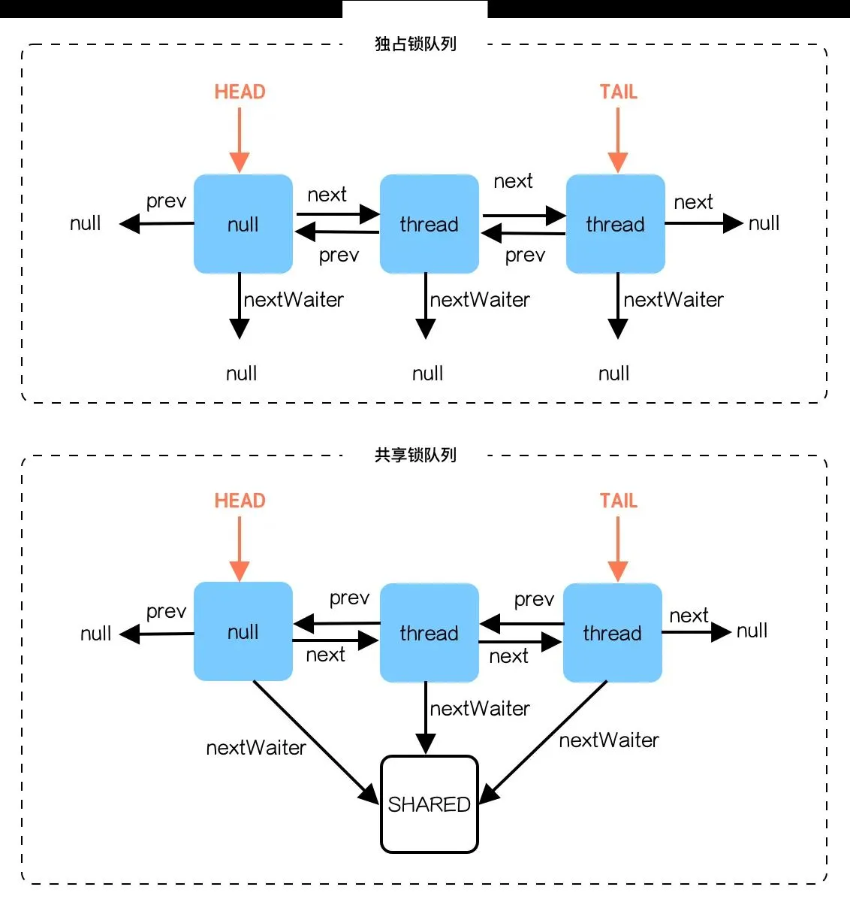

**<font style="color:rgb(34, 34, 34);background-color:rgb(248, 246, 244);">条件队列</font>**

<font style="color:rgb(51, 51, 51);background-color:rgb(248, 246, 244);">条件队列是单链，它没有空的头节点，每个节点都有对应的线程。条件队列头节点和尾节点的指针分别是 firstWaiter 和 lastWaiter ，如下图所示：</font>

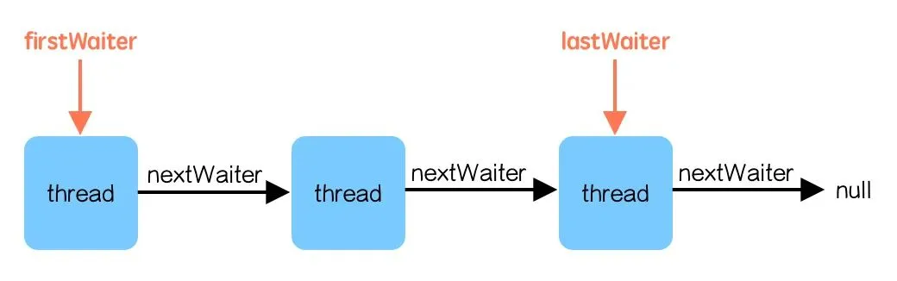

<font style="color:rgb(51, 51, 51);background-color:rgb(248, 246, 244);">当某个线程执行了ConditionObject的await函数，阻塞当前线程，线程会被封装成Node节点添加到条件队列的末端，其他线程执行ConditionObject的signal函数，会将条件队列头部线程节点转移到C H L队列参与竞争资源，具体流程如下图。</font>

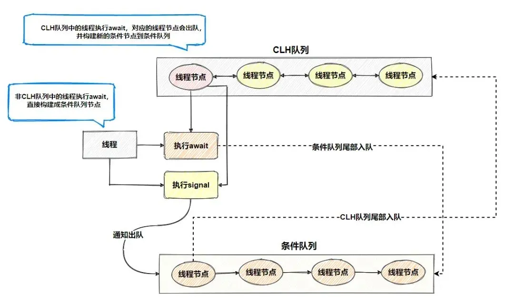

**<font style="color:rgb(34, 34, 34);background-color:rgb(248, 246, 244);">流程概述</font>**

<font style="color:rgb(51, 51, 51);background-color:rgb(248, 246, 244);">线程获取资源失败，封装成Node节点从C L H队列尾部入队并阻塞线程，某线程释放资源时会把C L H队列首部Node节点关联的线程唤醒（</font>**<font style="color:rgb(34, 34, 34);background-color:rgb(248, 246, 244);">此处的首部是指第二个节点</font>**<font style="color:rgb(51, 51, 51);background-color:rgb(248, 246, 244);">），再次获取资源。</font>

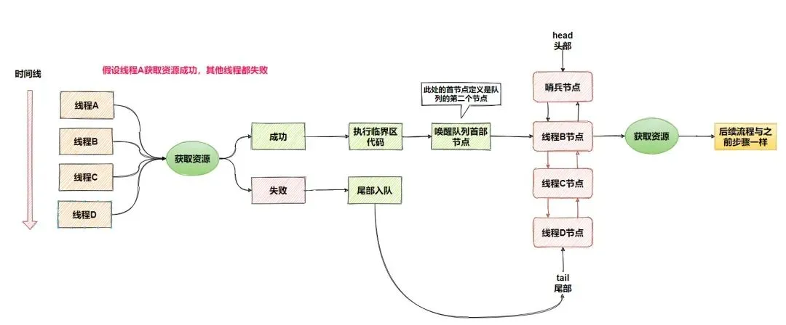

**<font style="color:rgb(34, 34, 34);background-color:rgb(248, 246, 244);">独占加锁</font>**

<font style="color:rgb(51, 51, 51);background-color:rgb(248, 246, 244);">获取锁的模板方法如下，定义了整个加锁流程算法。</font>

```plain
public final void acquire(int arg) {
 if (!tryAcquire(arg) &&
   acquireQueued(addWaiter(Node.EXCLUSIVE), arg)) // 这里 Node.EXCLUSIVE 的值是 null
   selfInterrupt();
}
```

<font style="color:rgb(51, 51, 51);background-color:rgb(248, 246, 244);">tryAcquire(arg)方法需要具体的锁来实现的，这是模板方法这个方法主要是尝试获取锁，获取成功就不会再执行其他代码了，这个方法结束。</font>

<font style="color:rgb(51, 51, 51);background-color:rgb(248, 246, 244);">以非公平锁为例。</font>


**<font style="color:rgb(34, 34, 34);background-color:rgb(248, 246, 244);">独占解锁</font>**

<font style="color:rgb(51, 51, 51);background-color:rgb(248, 246, 244);">有获取资源，自然就少不了释放资源，AQS中提供了release模板方法来释放资源。</font>

```java
public final boolean release(int arg) {
 if (tryRelease(arg)) { // 尝试释放锁，如果成功则唤醒后继节点的线程
  Node h = head;
  if (h != null && h.waitStatus != 0)
      //唤醒CHL队列第二个线程节点
   unparkSuccessor(h);
  return true;
 }
 return false;
}
```

+ <font style="color:rgb(51, 51, 51);background-color:rgb(248, 246, 244);">比如 ReentrantLock 的解锁方法 Unlock 进行解锁。</font>
+ <font style="color:rgb(51, 51, 51);background-color:rgb(248, 246, 244);">Unlock 会调用内部类 Sync 的 Release 方法，该方法继承于 AQS。</font>
+ <font style="color:rgb(51, 51, 51);background-color:rgb(248, 246, 244);">Release 中会调用 tryRelease 方法，tryRelease 需要自定义同步器实现，tryRelease 只在 ReentrantLock 中的 Sync 实现，因此可以看出，释放锁的过程，并不区分是否为公平锁。</font>
+ <font style="color:rgb(51, 51, 51);background-color:rgb(248, 246, 244);">释放成功后，所有处理由 AQS 框架完成，与自定义同步器无关。</font>

<font style="color:rgb(51, 51, 51);background-color:rgb(248, 246, 244);">release逻辑非常简单，流程图如下。</font>

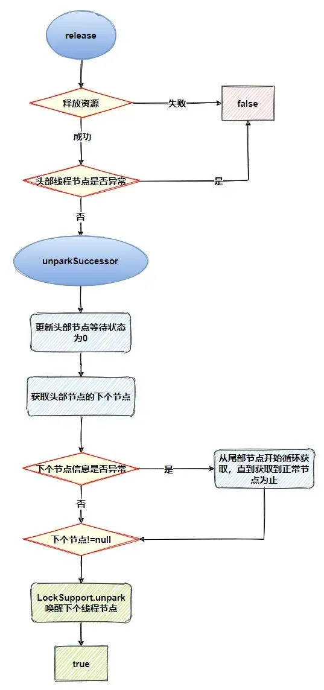

**<font style="color:rgb(34, 34, 34);background-color:rgb(248, 246, 244);">AQS 加锁/解锁核心流程</font>**


### **<font style="color:rgb(34, 34, 34);background-color:rgb(248, 246, 244);">ReentrantLock 的使用和原理</font>**
<font style="color:rgb(51, 51, 51);background-color:rgb(248, 246, 244);">重入锁 ReentrantLock，顾名思义，就是支持重进入的锁，它表示该锁能够支持一个线程对 资源的重复加锁。除此之外，该锁的还支持获取锁时的公平和非公平性选择。</font>

<font style="color:rgb(51, 51, 51);background-color:rgb(248, 246, 244);">重进入是指任意线程在获取到锁之后能够再次获取该锁而不会被锁所阻塞，该特性的实 现需要解决以下两个问题。</font>

1. <font style="color:rgb(51, 51, 51);background-color:rgb(248, 246, 244);">线程再次获取锁。锁需要去识别获取锁的线程是否为当前占据锁的线程，如果是，则再 次成功获取。</font>
2. <font style="color:rgb(51, 51, 51);background-color:rgb(248, 246, 244);">锁的最终释放。线程重复 n 次获取了锁，随后在第 n 次释放该锁后，其他线程能够获取到 该锁。锁的最终释放要求锁对于获取进行计数自增，计数表示当前锁被重复获取的次数，而锁 被释放时，计数自减，当计数等于 0 时表示锁已经成功释放。</font>

**<font style="color:rgb(34, 34, 34);background-color:rgb(248, 246, 244);">可重入锁使用</font>**

<font style="color:rgb(51, 51, 51);background-color:rgb(248, 246, 244);">再说原理之前，先看下怎么使用。</font>

```csharp
private final Lock lock = new ReentrantLock();
public void foo() {
    // 获取锁
    lock.lock();
    try{
        // 程序执行逻辑
    } finally{
        // finally语句块可以确保lock被正确释放
        lock.unlock();
    }
}
```

<font style="color:rgb(51, 51, 51);background-color:rgb(248, 246, 244);">我们将 lock()方法写在 try...finally 语句块中的目的是为了防止获取锁的过程中出现异常导致锁被意外。</font>

**<font style="color:rgb(34, 34, 34);background-color:rgb(248, 246, 244);">重入锁实现原理</font>**

<font style="color:rgb(51, 51, 51);background-color:rgb(248, 246, 244);">先来看下整体结构。</font>

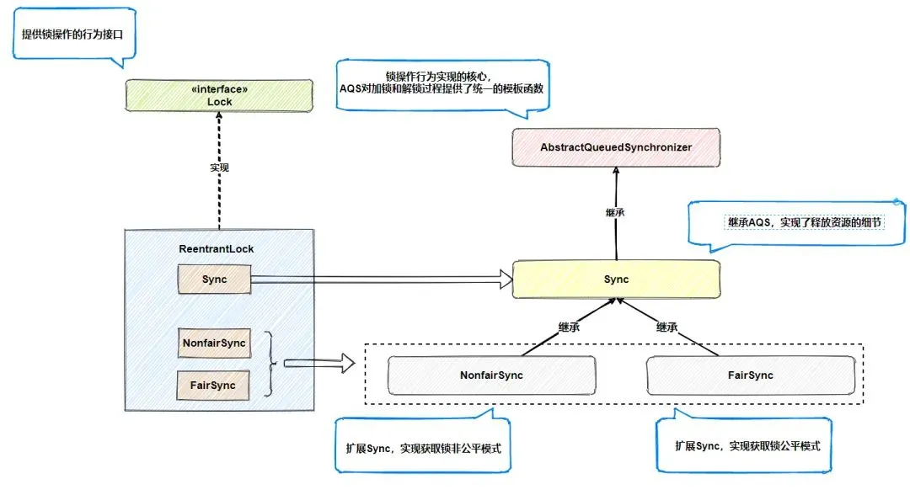

<font style="color:rgb(51, 51, 51);background-color:rgb(248, 246, 244);">ReentrantLock底层基于AbstractQueuedSynchronizer实现，它实现了Lock 接口，ReentrantLock内部定义了专门的组件Sync， Sync继承AbstractQueuedSynchronizer提供释放资源的实现，NonfairSync和FairSync是基于Sync扩展的子类，即ReentrantLock的非公平策略与公平策略，它们作为Lock接口功能的基本实现。</font>

**<font style="color:rgb(34, 34, 34);background-color:rgb(248, 246, 244);">公平策略：</font>**<font style="color:rgb(51, 51, 51);background-color:rgb(248, 246, 244);">在多个线程争用锁的情况下，公平策略倾向于将访问权授予等待时间最长的线程。也就是说，相当于有一个线程等待队列，先进入等待队列的线程后续会先获得锁，这样按照“先来后到”的原则，对于每一个等待线程都是公平的。</font>

**<font style="color:rgb(34, 34, 34);background-color:rgb(248, 246, 244);">非公平策略：</font>**<font style="color:rgb(51, 51, 51);background-color:rgb(248, 246, 244);">在多个线程争用锁的情况下，能够最终获得锁的线程是随机的（由底层 OS 调度）。</font>

**<font style="color:rgb(34, 34, 34);background-color:rgb(248, 246, 244);">Sync</font>**

<font style="color:rgb(51, 51, 51);background-color:rgb(248, 246, 244);">Sync 承了AbstractQueuedSynchronizer，是ReentrantLock的核心，后面的NonfairSync与FairSync都是基于Sync扩展出来的子类。</font>

```java
abstract static class Sync extends AbstractQueuedSynchronizer {
        private static final long serialVersionUID = -5179523762034025860L;

        /**
         * 非公平锁获取资源
         */
        @ReservedStackAccess
        final boolean nonfairTryAcquire(int acquires) {
            // 获取当前线程
            final Thread current = Thread.currentThread();
            //获取当前状态
            int c = getState();
            // state==0 代表资源可获取
            if (c == 0) {
              //cas设置state为acquires，acquires传入的是1
                if (compareAndSetState(0, acquires)) {
                   // cas成功，将当前线程设置持有锁的线程
                    setExclusiveOwnerThread(current);
                  // 返回成功
                    return true;
                }
            }
          //如果state!=0,但是当前线程是持有锁线程，直接重入
            else if (current == getExclusiveOwnerThread()) {
               //state状态+1
                int nextc = c + acquires;
                if (nextc < 0) // overflow
                    throw new Error("Maximum lock count exceeded");
              //设置state状态，此处不需要cas，因为持有锁的线程只有一个
                setState(nextc);
                return true;
            }
          // 获取锁失败
            return false;
        }

     /**
     * 释放资源
     */
        @ReservedStackAccess
        protected final boolean tryRelease(int releases) {
          //state状态-releases，releases传入的是1
            int c = getState() - releases;
           //如果当前线程不是持有锁线程，抛出异常
            if (Thread.currentThread() != getExclusiveOwnerThread())
                throw new IllegalMonitorStateException();
            boolean free = false;
          //state-1后，如果c==0代表释放资源成功
            if (c == 0) {
              //返回状态设置为true
                free = true;
              //清空持有锁线程
                setExclusiveOwnerThread(null);
            }
          //如果state-1后，state还是>0，
          //代表当前线程有锁重入操作，需要做相应的释放次数，设置state值
            setState(c);
            return free;
        }

        ....省略其他代码
    }
```

<font style="color:rgb(51, 51, 51);background-color:rgb(248, 246, 244);">Sync 默认提供了非公平锁的加锁方式，解锁方式tryRelease 非公平锁和公平锁都会用到，tryRelease 流程图就提前上菜。</font>

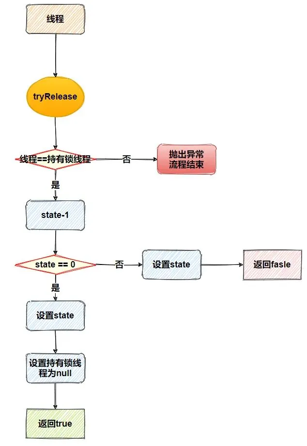

**<font style="color:rgb(34, 34, 34);background-color:rgb(248, 246, 244);">NonfairSync</font>**

<font style="color:rgb(51, 51, 51);background-color:rgb(248, 246, 244);">NonfairSync就是非公平策略。在说非公平锁之前，回顾下 AQS 定义的获取锁算法流程。</font>

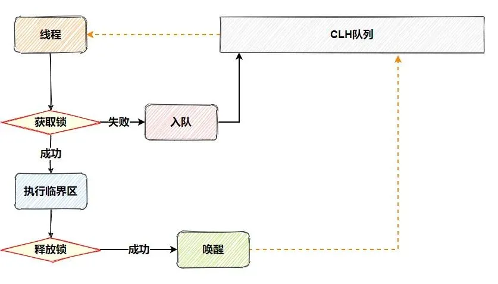

<font style="color:rgb(51, 51, 51);background-color:rgb(248, 246, 244);">线程释放锁时，会唤醒CLH队列阻塞的线程，重新竞争锁，要注意，此时可能还有非CLH队列的线程参与竞争，所以非公平就体现在这里，非CLH队列线程与CLH队列线程竞争，各凭本事，不会因为你是CLH队列的线程，排了很久的队，就把锁让给你。</font>

<font style="color:rgb(51, 51, 51);background-color:rgb(248, 246, 244);">NonfairSync继承 Sync，并实现了 AQS 定义的 tryAcquire 方法。实现方式是 之前 Sync 提供的 nonfairTryAcquire 方法。</font>

```scala
static final class NonfairSync extends Sync {
        private static final long serialVersionUID = 7316153563782823691L;
        protected final boolean tryAcquire(int acquires) {
            return nonfairTryAcquire(acquires);
        }
 }
```

<font style="color:rgb(51, 51, 51);background-color:rgb(248, 246, 244);">对应的解锁资源则使用 Sync提供的 java.util.concurrent.locks.ReentrantLock.Sync#tryRelease方法。</font>

**<font style="color:rgb(34, 34, 34);background-color:rgb(248, 246, 244);">FairSync</font>**

<font style="color:rgb(51, 51, 51);background-color:rgb(248, 246, 244);">nonfairTryAcquire(int acquires)方法，对于非公平锁，只要 CAS 设置 同步状态成功，则表示当前线程获取了锁，而公平锁则不同，如代码清单。</font>

```scala
static final class FairSync extends Sync {
    private static final long serialVersionUID = -3000897897090466540L;
    /**
     * 公平策略获取锁
     */
    @ReservedStackAccess
    protected final boolean tryAcquire(int acquires) {
        //获取当前线程
        final Thread current = Thread.currentThread();
        //获取state状态
        int c = getState();
      // state==0 代表资源可获取
        if (c == 0) {
          //1.hasQueuedPredecessors判断当前线程是不是CLH队列被唤醒的线程，如果是执行下一个步骤
          //2.cas设置state为acquires，acquires传入的是1
            if (!hasQueuedPredecessors() &&
                compareAndSetState(0, acquires)) {
               //cas成功，设置当前持有锁的线程
                setExclusiveOwnerThread(current);
              //返回成功
                return true;
            }
        }
      //如果state!=0,但是当前线程是持有锁线程，直接重入
        else if (current == getExclusiveOwnerThread()) {
            int nextc = c + acquires;
            if (nextc < 0)
                throw new Error("Maximum lock count exceeded");
            setState(nextc);
            return true;
        }
        return false;
    }
}
```

<font style="color:rgb(51, 51, 51);background-color:rgb(248, 246, 244);">该方法与nonfairTryAcquire(int acquires)比较，唯一不同的位置为判断条件多了 hasQueuedPredecessors()方法，即加入了同步队列中当前节点是否有前驱节点的判断，如果该 方法返回 true，则表示</font>**<font style="color:rgb(34, 34, 34);background-color:rgb(248, 246, 244);">有线程比当前线程更早地请求获取锁，因此需要等待前驱线程获取并释 放锁之后才能继续获取锁</font>**<font style="color:rgb(51, 51, 51);background-color:rgb(248, 246, 244);">。</font>

### **<font style="color:rgb(34, 34, 34);background-color:rgb(248, 246, 244);">ReentrantReadWriteLock 读写锁的使用和原理</font>**
<font style="color:rgb(51, 51, 51);background-color:rgb(248, 246, 244);">之前提到锁（如 Mutex 和 ReentrantLock）基本都是排他锁，这些锁在同一时刻只允许一个线 程进行访问，而读写锁在同一时刻可以允许多个读线程访问，但是在写线程访问时，所有的读 线程和其他写线程均被阻塞。</font>

<font style="color:rgb(51, 51, 51);background-color:rgb(248, 246, 244);">读写锁维护了一对锁，一个读锁和一个写锁，通过分离读锁和写 锁，使得并发性相比一般的排他锁有了很大提升。</font>

<font style="color:rgb(51, 51, 51);background-color:rgb(248, 246, 244);">面向接口编程，声明了ReadWriteLock接口，作为读写锁的基本规范。</font>

```csharp
public interface ReadWriteLock {
    /**
     * 获取读锁
     */
    Lock readLock();

    /**
     * 获取写锁
     */
    Lock writeLock();
}
```

<font style="color:rgb(51, 51, 51);background-color:rgb(248, 246, 244);">Java 并发包提供读写锁的实现是 ReentrantReadWriteLock。</font>

**<font style="color:rgb(34, 34, 34);background-color:rgb(248, 246, 244);">读写锁使用</font>**

<font style="color:rgb(51, 51, 51);background-color:rgb(248, 246, 244);">废话少说，先上一个读写锁的使用方式。与 ReentrantLock 一样，ReentrantReadWriteLock 的使用方法也是非常简单的，只不过在使用的过程中需要分别派生出“读锁”和“写锁”，在进行共享资源读取操作时，需要使用读锁进行数据同步，在对共享资源进行写操作时，需要使用写锁进行数据一致性的保护.</font>

```plain
public class RWDictionary {
    // 共享数据
    private final Map<String, Data> m = new TreeMap<>();
    // 定义读写锁
    private final ReentrantReadWriteLock rwl = new ReentrantReadWriteLock();
    // 定义读锁
    private final Lock r = rwl.readLock();
    // 定义写锁
    private final Lock w = rwl.writeLock();

    public Data get(String key) {
        r.lock();
        try {
            return m.get(key);
        } finally {
            r.unlock();
        }
    }

    public List<String> allKeys() {
        r.lock();
        try {
            return new ArrayList<>(m.keySet());
        } finally {
            r.unlock();
        }
    }

    public Data put(String key, Data value) {
        w.lock();
        try {
            return m.put(key, value);
        } finally {
            w.unlock();
        }
    }

    public void clear() {
        w.lock();
        try {
            m.clear();
        } finally {
            w.unlock();
        }
    }
}
```

**<font style="color:rgb(34, 34, 34);background-color:rgb(248, 246, 244);">实现原理</font>**

<font style="color:rgb(51, 51, 51);background-color:rgb(248, 246, 244);">ReentrantReadWriteLock 类有两个内部嵌套类ReadLock和WriteLock，这两个内部类的实例会在 ReentrantReadWriteLock 类的构造器中创建，并通过 ReentrantReadWriteLock 类的readLock()和writeLock()方法访问。</font>

```plain
public class ReentrantReadWriteLock
        implements ReadWriteLock, java.io.Serializable {
    private static final long serialVersionUID = -6992448646407690164L;
    /** 内部类，读锁 */
    private final ReentrantReadWriteLock.ReadLock readerLock;
    /** 内部类，写锁 */
    private final ReentrantReadWriteLock.WriteLock writerLock;
    /** 内部类，继承 AQS */
    final Sync sync;

    /**
     * 默认非公平策略获取读写锁
     */
    public ReentrantReadWriteLock() {
        this(false);
    }

    /**
     * 公平策略获取读写锁
     */
    public ReentrantReadWriteLock(boolean fair) {
        sync = fair ? new FairSync() : new NonfairSync();
        readerLock = new ReadLock(this);
        writerLock = new WriteLock(this);
    }
  ...省略部分代码
}
```

<font style="color:rgb(51, 51, 51);background-color:rgb(248, 246, 244);">内部类 Sync 继承 AQS 实现了如下的核心抽象函数。</font>

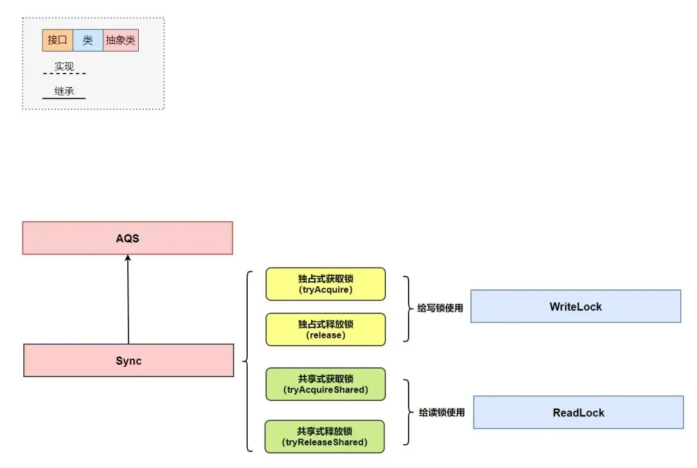

<font style="color:rgb(51, 51, 51);background-color:rgb(248, 246, 244);">其中 tryAcquire、release 是为WriteLock写锁准备的。</font>

<font style="color:rgb(51, 51, 51);background-color:rgb(248, 246, 244);">tryAcquireShared、tryReleaseShared 是为ReadLock读锁准备</font>

<font style="color:rgb(51, 51, 51);background-color:rgb(248, 246, 244);">我们都知道AQS中维护了一个state状态变量，正常来说，维护读锁与写锁状态需要两个变量，但是为了节约资源，使用高低位切割实现state状态变量维护两种状态，即高16位表示读状态，低16位表示写状态。</font>

<font style="color:rgb(51, 51, 51);background-color:rgb(248, 246, 244);">为了支持公平与非公平策略，Sync 扩展了FairSync、NonfairSync子类，两个子类实现了 readerShouldBlock、writerShouldBlock 函数，</font>**<font style="color:rgb(34, 34, 34);background-color:rgb(248, 246, 244);">即读锁与写锁是否阻塞</font>**<font style="color:rgb(51, 51, 51);background-color:rgb(248, 246, 244);">。</font>

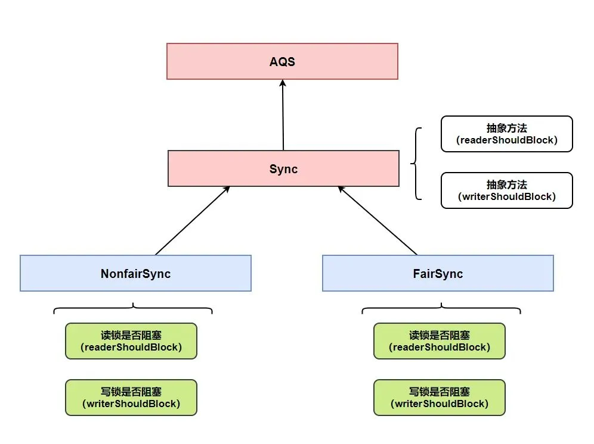

<font style="color:rgb(51, 51, 51);background-color:rgb(248, 246, 244);">ReentrantReadWriteLock 全局图如下，后面只分析非公平锁的加锁和解锁。</font>

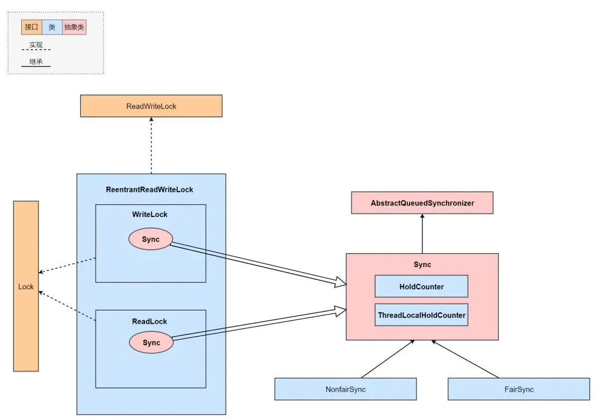

**<font style="color:rgb(34, 34, 34);background-color:rgb(248, 246, 244);">写锁的获取和释放</font>**

<font style="color:rgb(51, 51, 51);background-color:rgb(248, 246, 244);">写锁是一个支持重进入的排它锁。如果当前线程已经获取了写锁，则增加写状态。</font>

<font style="color:rgb(51, 51, 51);background-color:rgb(248, 246, 244);">如果当 前线程在获取写锁时，读锁已经被获取（读状态不为 0）或者该线程不是已经获取写锁的线程， 则当前线程进入等待状态。</font>

<font style="color:rgb(51, 51, 51);background-color:rgb(248, 246, 244);">java.util.concurrent.locks.ReentrantReadWriteLock.Sync#tryAcquire 获取写锁。</font>

```java
protected final boolean tryAcquire(int acquires) {
      // 当前线程
      Thread current = Thread.currentThread();
      int c = getState();
   // 计算写锁数量
      int w = exclusiveCount(c);
      if (c != 0) {
          /// 存在读锁或者当前获取线程不是已经获取写锁的线程
          if (w == 0 || current != getExclusiveOwnerThread())
              return false;
        // 超过最大范围
          if (w + exclusiveCount(acquires) > MAX_COUNT)
              throw new Error("Maximum lock count exceeded");
          // Reentrant acquire
          setState(c + acquires);
          return true;
      }
   // 写锁是否阻塞或者状态设置失败，返回 false
      if (writerShouldBlock() ||
          !compareAndSetState(c, c + acquires))
          return false;
      setExclusiveOwnerThread(current);
      return true;
  }
```

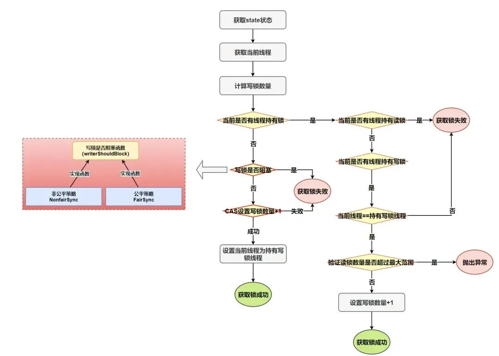

<font style="color:rgb(51, 51, 51);background-color:rgb(248, 246, 244);">为了易于理解，把它转成流程图，通过流程图，我们发现了一些要点。</font>

+ **<font style="color:rgb(34, 34, 34);background-color:rgb(248, 246, 244);">读写互斥</font>**
+ **<font style="color:rgb(34, 34, 34);background-color:rgb(248, 246, 244);">写写互斥</font>**
+ **<font style="color:rgb(34, 34, 34);background-color:rgb(248, 246, 244);">写锁支持同一个线程重入</font>**
+ **<font style="color:rgb(34, 34, 34);background-color:rgb(248, 246, 244);">writerShouldBlock 写锁是否阻塞实现取决公平与非公平的策略（FairSync 和 NonfairSync）</font>**

<font style="color:rgb(51, 51, 51);background-color:rgb(248, 246, 244);">获取到写锁，临界区执行完，要记得释放写锁（</font>**<font style="color:rgb(34, 34, 34);background-color:rgb(248, 246, 244);">如果重入多次要释放对应的次数</font>**<font style="color:rgb(51, 51, 51);background-color:rgb(248, 246, 244);">），不然会阻塞其他线程的读写操作，调用unlock函数释放写锁（</font>**<font style="color:rgb(34, 34, 34);background-color:rgb(248, 246, 244);">Lock 接口规范</font>**<font style="color:rgb(51, 51, 51);background-color:rgb(248, 246, 244);">）。</font>

<font style="color:rgb(51, 51, 51);background-color:rgb(248, 246, 244);">java.util.concurrent.locks.ReentrantReadWriteLock.Sync#tryRelease 释放写锁。</font>

<font style="color:rgb(51, 51, 51);background-color:rgb(248, 246, 244);">写锁的释放与 ReentrantLock 的释放过程基本类似，每次释放均减少写状态，当写状态为 0 时表示写锁已被释放，从而等待的读写线程能够继续访问读写锁，同时前次写线程的修改对 后续读写线程可见。</font>

```plain
@ReservedStackAccess
protected final boolean tryRelease(int releases) {
    if (!isHeldExclusively())
        throw new IllegalMonitorStateException();
    int nextc = getState() - releases;
    boolean free = exclusiveCount(nextc) == 0;
    if (free)
        setExclusiveOwnerThread(null);
    setState(nextc);
    return free;
}
```

<font style="color:rgb(51, 51, 51);background-color:rgb(248, 246, 244);">为了易于理解，把它转成流程图。</font>

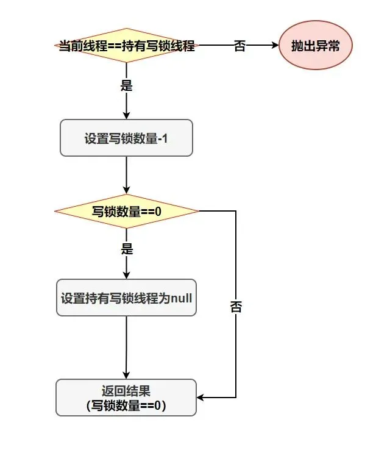

### **<font style="color:rgb(34, 34, 34);background-color:rgb(248, 246, 244);">Condition 的使用和原理</font>**
<font style="color:rgb(51, 51, 51);background-color:rgb(248, 246, 244);">任意一个 Java 对象，都拥有一组监视器方法（定义在 java.lang.Object 上），主要包括 wait()、 wait(long timeout)、notify()以及 notifyAll()方法，这些方法与 synchronized 同步关键字配合，可以 实现等待/通知模式。</font>

<font style="color:rgb(51, 51, 51);background-color:rgb(248, 246, 244);">Condition 接口也提供了类似 Object 的监视器方法，与 Lock 配合可以实现等 待/通知模式。</font>

<font style="color:rgb(51, 51, 51);background-color:rgb(248, 246, 244);">Condition 定义了等待/通知两种类型的方法，当前线程调用这些方法时，需要提前获取到 Condition 对象关联的锁。</font>

<font style="color:rgb(51, 51, 51);background-color:rgb(248, 246, 244);">Condition 对象是由 Lock 对象（调用 Lock 对象的 newCondition()方法）创 建出来的，换句话说，Condition 是依赖 Lock 对象的。</font>

**<font style="color:rgb(34, 34, 34);background-color:rgb(248, 246, 244);">基本使用</font>**

```csharp
class BoundedBuffer {

    final Lock lock = new ReentrantLock();
    // condition 实例依赖于 lock 实例
    final Condition notFull = lock.newCondition();
    final Condition notEmpty = lock.newCondition();

    final Object[] items = new Object[100];

    int putPtr, takePtr, count;

    public void put(Object x) throws InterruptedException {
        lock.lock();
        try {
            //  put 时判断是否已经满了
            // 则线程在 notFull 条件上排队阻塞
            while (count == items.length) {
                notFull.await();
            }
            items[putPtr] = x;
            if (++putPtr == items.length) {
                putPtr = 0;
            }
            ++count;
            // put 成功之后，队列中有元素
            // 唤醒在 notEmpty 条件上排队阻塞的线程
            notEmpty.signal();
        } finally {
            lock.unlock();
        }
    }

    public Object take() throws InterruptedException {
        lock.lock();
        try {
            // take 时，发现为空
            // 则线程在 notEmpty 的条件上排队阻塞
            while (count == 0) {
                notEmpty.await();
            }
            Object x = items[takePtr];
            if (++takePtr == items.length) {
                takePtr = 0;
            }
            --count;
            // take 成功，队列不可能是满的
            // 唤醒在 notFull 条件上排队阻塞的线程
            notFull.signal();
            return x;
        } finally {
            lock.unlock();
        }
    }
}
```

<font style="color:rgb(51, 51, 51);background-color:rgb(248, 246, 244);">上面是官方文档的一个例子，实现了一个简单的 BlockingQueue ，看懂这里，会发现在</font>**<font style="color:rgb(34, 34, 34);background-color:rgb(248, 246, 244);">同步队列</font>**<font style="color:rgb(51, 51, 51);background-color:rgb(248, 246, 244);">中很多地方都是用的这个逻辑。</font>

**<font style="color:rgb(34, 34, 34);background-color:rgb(248, 246, 244);">实现原理</font>**

<font style="color:rgb(51, 51, 51);background-color:rgb(248, 246, 244);">在 Object 的监视器模型上，一个对象拥有一个同步队列和等待队列，而并发包中的 Lock（更确切地说是同步器）拥有一个同步队列和多个 Condition 等待队列。</font>

<font style="color:rgb(51, 51, 51);background-color:rgb(248, 246, 244);">Condition 条件队列是单链，它没有空的头节点，每个节点都有对应的线程。条件队列头节点和尾节点的指针分别是 firstWaiter 和 lastWaiter ，如下图所示：</font>


<font style="color:rgb(51, 51, 51);background-color:rgb(248, 246, 244);">当某个线程执行了ConditionObject的await函数，阻塞当前线程，线程会被封装成Node节点添加到条件队列的末端，其他线程执行ConditionObject的signal函数，会将条件队列头部线程节点转移到C H L队列参与竞争资源，具体流程如下图。</font>


<font style="color:rgb(51, 51, 51);background-color:rgb(248, 246, 244);">调用 Condition 的 await()方法（或者以 await 开头的方法），会使当前线程进入条件队列并释 放锁，同时线程状态变为等待状态。当从 await()方法返回时，当前线程一定获取了 Condition 相 关联的锁。</font>

<font style="color:rgb(51, 51, 51);background-color:rgb(248, 246, 244);">调用 Condition 的 signal()方法，将会唤醒在条件队列中等待时间最长的节点（首节点），在 唤醒节点之前，会将节点移到 CLH 同步队列中。</font>

<font style="color:rgb(51, 51, 51);background-color:rgb(248, 246, 244);">Condition 的 signalAll()方法，相当于对条件队列中的每个节点均执行一次 signal()方法，效 果就是将条件队列中所有节点全部移动到 CLH 同步队列中，并唤醒每个节点的线程。</font>


> 更新: 2025-09-01 11:38:59  
> 原文: <https://www.yuque.com/yuqueyonghue6cvnv/cxhfwd/bzvx2utlqpq6bdy5>