# 038|线程池架构、任务如何调度？从全局视角说下线程池的运行机制，以及实现原理

**<font style="color:rgb(34, 34, 34);background-color:rgb(248, 246, 244);">“</font>**

<font style="color:rgb(100, 100, 100);background-color:rgb(248, 246, 244);">本章基于 JDK 1.8 的源码来分析 Java 线程池的核心设计与实现</font>

<font style="color:rgb(51, 51, 51);background-color:rgb(248, 246, 244);">J.U.C 提供的线程池：ThreadPoolExecutor 类，帮助开发人员管理线程并方便地执行并行任务。</font>

<font style="color:rgb(51, 51, 51);background-color:rgb(248, 246, 244);">了解并合理使用线程池，是一个开发人员必修的基本功。</font>

<font style="color:rgb(51, 51, 51);background-color:rgb(248, 246, 244);">本文会围绕以下几点展开：</font>

+ <font style="color:rgb(51, 51, 51);background-color:rgb(248, 246, 244);">什么是线程池？</font>
+ <font style="color:rgb(51, 51, 51);background-color:rgb(248, 246, 244);">如何使用线程池？</font>
+ <font style="color:rgb(51, 51, 51);background-color:rgb(248, 246, 244);">线程池实现原理：  
</font>
    - <font style="color:rgb(51, 51, 51);background-color:rgb(248, 246, 244);">ThreadPoolExecutor</font>
    - <font style="color:rgb(51, 51, 51);background-color:rgb(248, 246, 244);">ScheduledThreadPoolExecutor</font>
    - <font style="color:rgb(51, 51, 51);background-color:rgb(248, 246, 244);">ForkJoinPool</font>

## **<font style="color:rgb(34, 34, 34);background-color:rgb(248, 246, 244);">线程池是什么？</font>**
<font style="color:rgb(51, 51, 51);background-color:rgb(248, 246, 244);">线程池（Thread Pool）是一种基于池化思想管理线程的工具，经常出现在多线程服务器中，如 MySQL。</font>

<font style="color:rgb(51, 51, 51);background-color:rgb(248, 246, 244);">线程过多会带来额外的开销，其中包括</font>**<font style="color:rgb(34, 34, 34);background-color:rgb(248, 246, 244);">创建销毁线程的开销、调度线程的开销</font>**<font style="color:rgb(51, 51, 51);background-color:rgb(248, 246, 244);">等等，同时也降低了计算机的整体性能。</font>

<font style="color:rgb(51, 51, 51);background-color:rgb(248, 246, 244);">线程池维护多个线程，等待监督管理者分配可并发执行的任务。</font>

<font style="color:rgb(51, 51, 51);background-color:rgb(248, 246, 244);">这种做法，一方面</font>**<font style="color:rgb(34, 34, 34);background-color:rgb(248, 246, 244);">避免了处理任务时创建销毁线程开销的代价，另一方面避免了线程数量膨胀导致的过分调度问题，保证了对内核的充分利用。</font>**

**<font style="color:rgb(34, 34, 34);background-color:rgb(248, 246, 244);">“</font>**

<font style="color:rgb(100, 100, 100);background-color:rgb(248, 246, 244);">Chaya：“线程池有什么好处呢？”</font>

<font style="color:rgb(51, 51, 51);background-color:rgb(248, 246, 244);">通过使用线程池，可以带来了许多好处：</font>

+ **<font style="color:rgb(34, 34, 34);background-color:rgb(248, 246, 244);">资源管理：</font>**<font style="color:rgb(51, 51, 51);background-color:rgb(248, 246, 244);"> </font><font style="color:rgb(51, 51, 51);background-color:rgb(248, 246, 244);">线程池能够有效地管理系统资源，通过限制并发任务的数量和重用线程，减少了线程创建和销毁的开销，提高了系统资源利用率。</font>
+ **<font style="color:rgb(34, 34, 34);background-color:rgb(248, 246, 244);">性能提升：</font>**<font style="color:rgb(51, 51, 51);background-color:rgb(248, 246, 244);"> </font><font style="color:rgb(51, 51, 51);background-color:rgb(248, 246, 244);">通过合理地配置线程池大小和任务队列，可以优化任务执行流程，降低了线程的上下文切换成本，提高了任务的执行效率和系统的吞吐量。</font>
+ **<font style="color:rgb(34, 34, 34);background-color:rgb(248, 246, 244);">避免资源耗尽：</font>**<font style="color:rgb(51, 51, 51);background-color:rgb(248, 246, 244);"> </font><font style="color:rgb(51, 51, 51);background-color:rgb(248, 246, 244);">线程池可以控制并发任务的数量，防止系统因创建过多线程而导致资源耗尽，从而提高了系统的稳定性和可靠性。</font>
+ **<font style="color:rgb(34, 34, 34);background-color:rgb(248, 246, 244);">任务排队：</font>**<font style="color:rgb(51, 51, 51);background-color:rgb(248, 246, 244);"> </font><font style="color:rgb(51, 51, 51);background-color:rgb(248, 246, 244);">线程池通过任务队列来暂存尚未执行的任务，保证了任务的顺序执行，并且能够灵活地处理突发任务量，避免了系统的过载。</font>
+ **<font style="color:rgb(34, 34, 34);background-color:rgb(248, 246, 244);">简化并发编程：</font>**<font style="color:rgb(51, 51, 51);background-color:rgb(248, 246, 244);"> </font><font style="color:rgb(51, 51, 51);background-color:rgb(248, 246, 244);">使用线程池可以简化并发编程的复杂性，开发人员无需手动管理线程的生命周期和任务的调度，只需将任务提交给线程池即可，从而降低了编程的复杂度和出错的可能性。</font>

## **<font style="color:rgb(34, 34, 34);background-color:rgb(248, 246, 244);">使用场景</font>**
<font style="color:rgb(51, 51, 51);background-color:rgb(248, 246, 244);">不聊原理，先说下如何使用。</font>

### **<font style="color:rgb(34, 34, 34);background-color:rgb(248, 246, 244);">Web 应用的并发请求处理</font>**
<font style="color:rgb(51, 51, 51);background-color:rgb(248, 246, 244);">Web 应用通常需要同时处理多个用户的请求。为了不每个请求都创建一个新线程，可以使用线程池来复用一定数量的线程：</font>

```java
public class WebServer {
    // 创建固定大小的线程池¡¡以处理用户请求
    private static final ExecutorService executor = Executors.newFixedThreadPool(100);

    public static void handleRequest(HttpRequest request) {

        CompletableFuture.runAsync(() -> {
            // 处理请求
            processRequest(request);
        }, executor);

    }

    private static void processRequest(HttpRequest request) {
        // 处理请求的实现
    }
}
```

### **<font style="color:rgb(34, 34, 34);background-color:rgb(248, 246, 244);">后台任务和定时任务</font>**
<font style="color:rgb(51, 51, 51);background-color:rgb(248, 246, 244);">应用程序可能需要定期执行一些后台任务，如数据库的清理工作。</font>

<font style="color:rgb(51, 51, 51);background-color:rgb(248, 246, 244);">可以使用</font>**<font style="color:rgb(34, 34, 34);background-color:rgb(248, 246, 244);">ScheduledThreadPoolExecutor</font>**<font style="color:rgb(51, 51, 51);background-color:rgb(248, 246, 244);">来安排这些任务：</font>

```java
public class BackgroundJobScheduler {
    private static final ScheduledExecutorService scheduler = Executors.newScheduledThreadPool(5);

    public static void startCleanupJob() {
        // 这里执行清理任务
        scheduler.scheduleAtFixedRate(BackgroundJobScheduler::performCleanup
                , 0, 1, TimeUnit.HOURS);
    }

    private static void performCleanup() {
        // 清理工作的实现
    }
}
```

### **<font style="color:rgb(34, 34, 34);background-color:rgb(248, 246, 244);">异步操作</font>**
<font style="color:rgb(51, 51, 51);background-color:rgb(248, 246, 244);">用户下单后可能需要进行一系列后台操作，比如发送确认邮件、通知仓库出货等。</font>

```plain
public class ECommerceApplication {
    private static final ExecutorService pool = Executors.newCachedThreadPool();

    public static void completeOrder(Order order) {
        // 异步发送确认邮件
        pool.execute(() -> sendConfirmationEmail(order));

        // 异步通知仓库
        pool.execute(() -> notifyWarehouse(order));
    }

    private static void sendConfirmationEmail(Order order) {
        // 邮件发送逻辑
    }

    private static void notifyWarehouse(Order order) {
        // 仓库通知逻辑
    }
}
```

### **<font style="color:rgb(34, 34, 34);background-color:rgb(248, 246, 244);">Executor 线程池核心设计</font>**
<font style="color:rgb(51, 51, 51);background-color:rgb(248, 246, 244);">线程池的顶层接口是 Executor，它提供了一种思想，将任务提交和任务执行进行解耦。</font>

**<font style="color:rgb(34, 34, 34);background-color:rgb(248, 246, 244);">用户无需关注如何创建线程，如何调度线程来执行任务，用户只需提供 Runnable 对象，将任务的运行逻辑提交到执行器(Executor)中，由 Executor 框架完成线程的调配和任务的执行部分。</font>**

```plain
public interface Executor {
    void execute(Runnable command);
}
```

<font style="color:rgb(51, 51, 51);background-color:rgb(248, 246, 244);">我们首先来看一下 ThreadPoolExecutor、ScheduledThreadPoolExecutor、FutureTask、ForkJoinPool的 UML 类图，全局上了解下线程池的继承关系。</font>

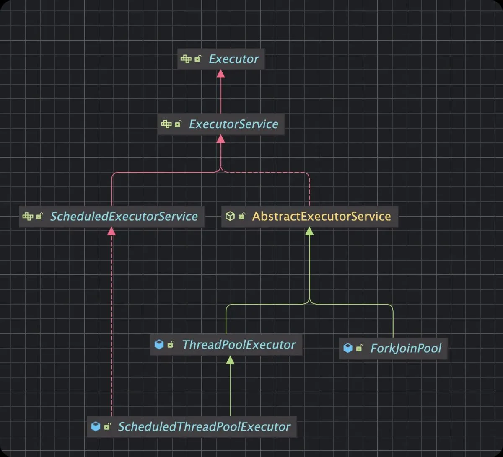

<font style="color:rgb(51, 51, 51);background-color:rgb(248, 246, 244);">ExecutorService接口增加了一些能力：</font>

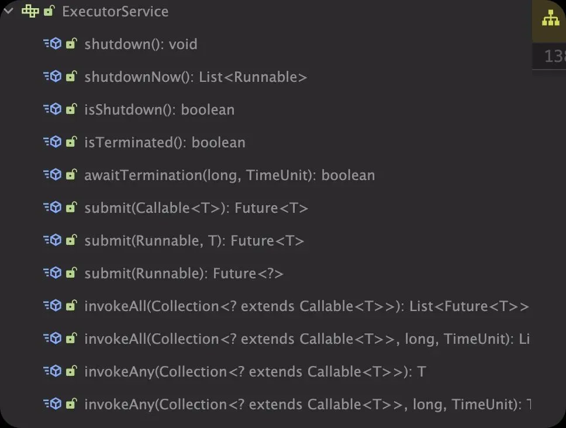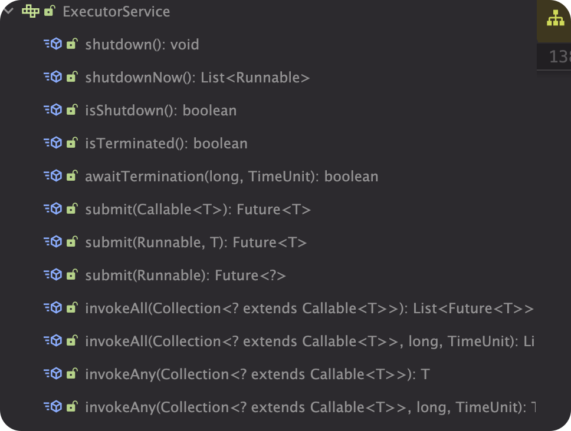

+ <font style="color:rgb(51, 51, 51);background-color:rgb(248, 246, 244);">扩充执行任务的能力：可以为一个或一批异步任务生成 Future 的方法；</font>
+ <font style="color:rgb(51, 51, 51);background-color:rgb(248, 246, 244);">提供了管控线程池的方法，比如停止线程池的运行。</font>

<font style="color:rgb(51, 51, 51);background-color:rgb(248, 246, 244);">AbstractExecutorService则是上层的抽象类，实现了 ExecutorService，模板方法模式的运用，将执行任务的流程串联了起来，由子类继承，将变化点交给子类实现，保证下层的实现只需关注一个执行任务的方法即可。</font>

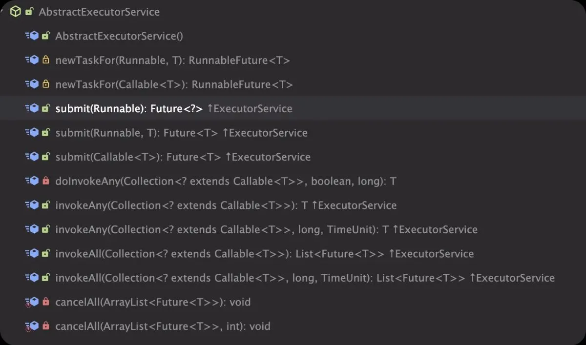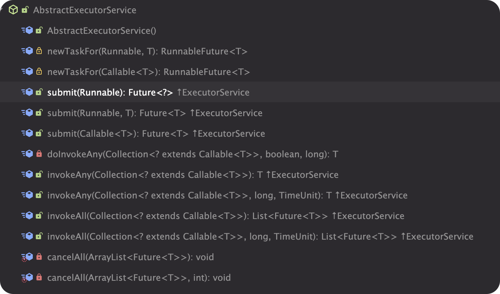

<font style="color:rgb(51, 51, 51);background-color:rgb(248, 246, 244);">ScheduledThreadPoolExecutor 线程池的特性是定时调度，专门设计了一个接口 ScheduledExecutorService 并继承接口 ExecutorService，这就是单一职责的体现了，家人们！</font>

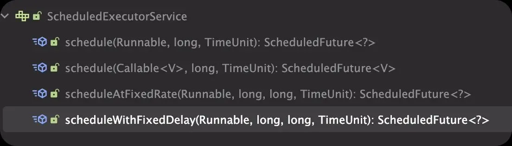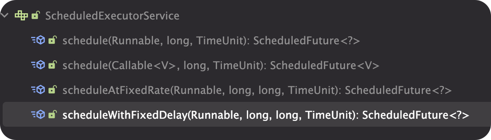

<font style="color:rgb(51, 51, 51);background-color:rgb(248, 246, 244);">该接口主要定义了定时调度的方法。</font>

<font style="color:rgb(51, 51, 51);background-color:rgb(248, 246, 244);">最下层就分别有 ThreadPoolExecutor、ScheduledThreadPoolExecutor、ForkJoinPool。</font>

## **<font style="color:rgb(34, 34, 34);background-color:rgb(248, 246, 244);">ThreadPoolExecutor 原理</font>**
**<font style="color:rgb(34, 34, 34);background-color:rgb(248, 246, 244);">“</font>**

<font style="color:rgb(100, 100, 100);background-color:rgb(248, 246, 244);">Chaya：ThreadPoolExecutor 运行机制是什么？如何同时维护线程状态和执行任务的呢？</font>

<font style="color:rgb(51, 51, 51);background-color:rgb(248, 246, 244);">核心组件关系如下图所示：</font>

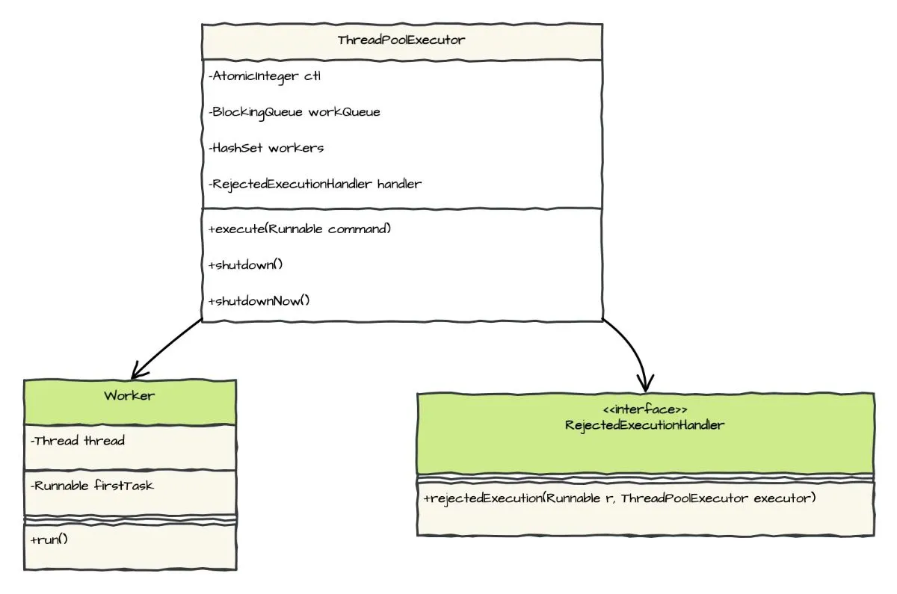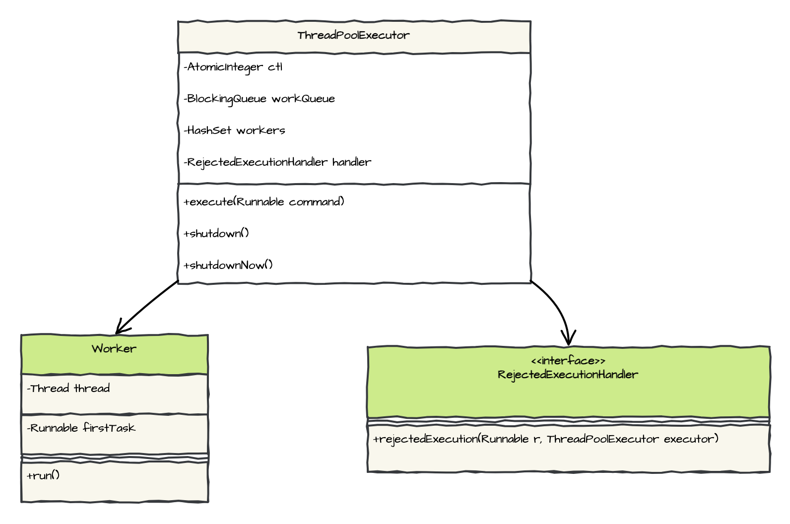

+ <font style="color:rgb(51, 51, 51);background-color:rgb(248, 246, 244);">Worker：对线程的抽象。</font>
+ <font style="color:rgb(51, 51, 51);background-color:rgb(248, 246, 244);">RejectedExecutionHandler：当线程池的任务缓存队列已满，并且线程池中的线程数目达到 maximumPoolSize 时，就需要拒绝掉该任务，采取任务拒绝策略，保护线程池。</font>
+ <font style="color:rgb(51, 51, 51);background-color:rgb(248, 246, 244);">HashSet workers：持有线程的引用，这样可以通过添加引用、移除引用这样的操作来控制线程的生命周期。</font>
+ <font style="color:rgb(51, 51, 51);background-color:rgb(248, 246, 244);">WorkQueue：阻塞队列。</font>

### **<font style="color:rgb(34, 34, 34);background-color:rgb(248, 246, 244);">任务运行机制</font>**
**<font style="color:rgb(34, 34, 34);background-color:rgb(248, 246, 244);">“</font>**

<font style="color:rgb(100, 100, 100);background-color:rgb(248, 246, 244);">Chaya：“从全局视角说下线程池的运行机制把。”</font>

<font style="color:rgb(51, 51, 51);background-color:rgb(248, 246, 244);">线程池的工作机制可以看作是一种</font>**<font style="color:rgb(34, 34, 34);background-color:rgb(248, 246, 244);">生产者-消费者</font>**<font style="color:rgb(51, 51, 51);background-color:rgb(248, 246, 244);">模型的应用，将线程和任务两者解耦，并不直接关联，从而良好的缓冲任务，复用线程。</font>

<font style="color:rgb(51, 51, 51);background-color:rgb(248, 246, 244);">在这个模型中，</font>**<font style="color:rgb(34, 34, 34);background-color:rgb(248, 246, 244);">任务（生产者）被提交到线程池，然后线程池中的线程（消费者）从任务队列中取出任务并执行，当线程执行完任务后则会继续获取新的任务去执行，最终当线程获取不到任务的时候，线程就会被回收。</font>**

<font style="color:rgb(51, 51, 51);background-color:rgb(248, 246, 244);">其运行机制如下图所示：</font>

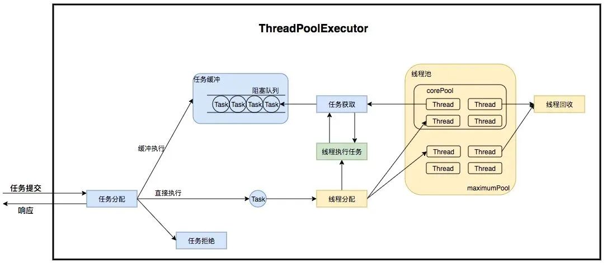

+ <font style="color:rgb(51, 51, 51);background-color:rgb(248, 246, 244);">开发人员使用 ThreadPoolExecutor 的 submit() 方法提交任务。</font>
+ <font style="color:rgb(51, 51, 51);background-color:rgb(248, 246, 244);">检测线程池运行状态，如果不是 RUNNING，则直接拒绝，线程池要保证在 RUNNING 的状态下执行任务</font>
+ <font style="color:rgb(51, 51, 51);background-color:rgb(248, 246, 244);">提交的任务（通常实现了 Callable 或 Runnable 接口）会被封装成一个 FutureTask 对象，该对象实现了 Future 接口，允许获取任务执行的结果。</font>
+ <font style="color:rgb(51, 51, 51);background-color:rgb(248, 246, 244);">如果线程池中的核心线程数小于核心线程池大小（corePoolSize），则尝试创建新的核心线程来执行任务。</font>
+ <font style="color:rgb(51, 51, 51);background-color:rgb(248, 246, 244);">如果当前核心线程数已经达到 corePoolSize，则将任务放入任务队列中，等待工作线程获取任务执行。</font>
+ <font style="color:rgb(51, 51, 51);background-color:rgb(248, 246, 244);">如果队列已满，而且当前线程池中的线程数量小于最大线程池大小（maximumPoolSize），则尝试创建新的非核心线程来执行任务。</font>
+ <font style="color:rgb(51, 51, 51);background-color:rgb(248, 246, 244);">如果当前线程池中的线程数量已经达到最大线程池大小，则根据拒绝策略进行处理。</font>
+ <font style="color:rgb(51, 51, 51);background-color:rgb(248, 246, 244);">任务执行完成后，线程池将返回一个 Future 对象，通过这个对象可以获取任务执行的结果。</font>

<font style="color:rgb(51, 51, 51);background-color:rgb(248, 246, 244);">流程图如下：</font>

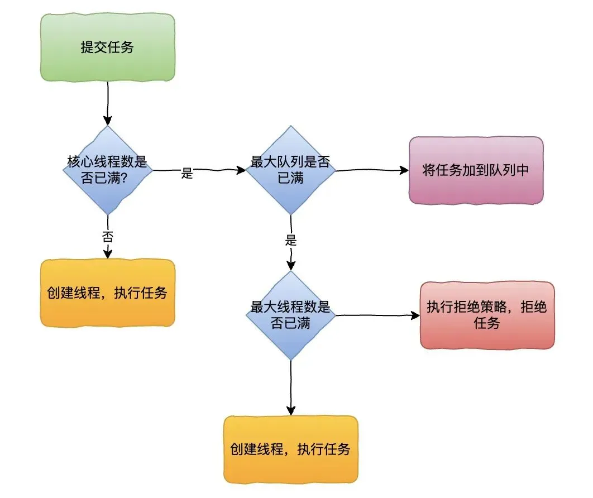

<font style="color:rgb(51, 51, 51);background-color:rgb(248, 246, 244);">为了让你更容易理解，再画一个时序图。</font>

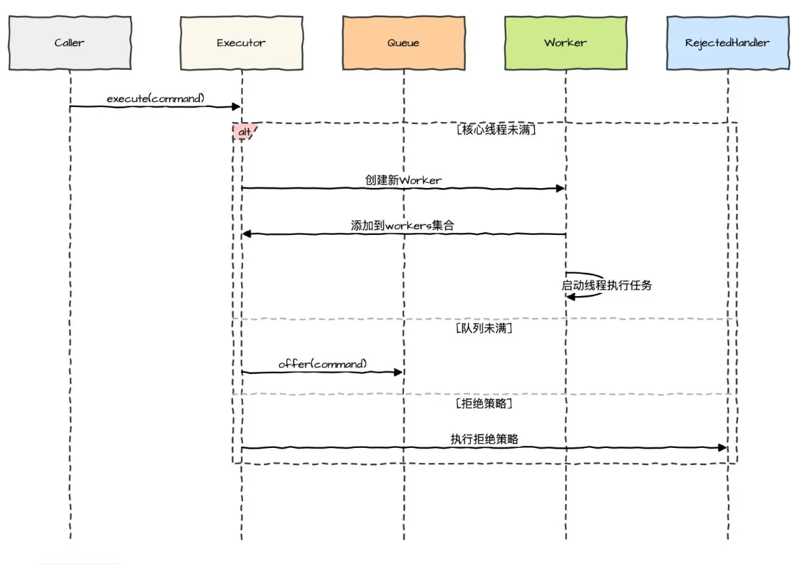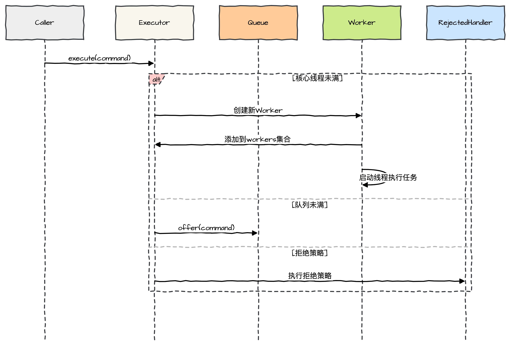

+ <font style="color:rgb(51, 51, 51);background-color:rgb(248, 246, 244);">Executor：线程池任务调度入口；</font>
+ <font style="color:rgb(51, 51, 51);background-color:rgb(248, 246, 244);">Queue：阻塞队列</font>
+ <font style="color:rgb(51, 51, 51);background-color:rgb(248, 246, 244);">Worker：实现 Runnable 并继承 AbstractQueuedSynchronizer，线程池中的任务线程抽象。</font>
+ <font style="color:rgb(51, 51, 51);background-color:rgb(248, 246, 244);">RejectedHandler：拒绝策略。</font>

<font style="color:rgb(51, 51, 51);background-color:rgb(248, 246, 244);">接下来我们分别分析线程池核心组件的作用和实现原理。</font>

### **<font style="color:rgb(34, 34, 34);background-color:rgb(248, 246, 244);">状态控制（ctl 变量）</font>**
**<font style="color:rgb(34, 34, 34);background-color:rgb(248, 246, 244);">“</font>**

<font style="color:rgb(100, 100, 100);background-color:rgb(248, 246, 244);">如何维护线程池运行状态和工作线程呢？</font>

<font style="color:rgb(51, 51, 51);background-color:rgb(248, 246, 244);">使用 32 位整型 AtomicInteger 同时维护线程池的运行状态和工作线程：</font>

+ <font style="color:rgb(51, 51, 51);background-color:rgb(248, 246, 244);">高 3 位：线程池状态（RUNNING, SHUTDOWN, STOP 等）</font>
+ <font style="color:rgb(51, 51, 51);background-color:rgb(248, 246, 244);">低 29 位：工作线程数量</font>
+ 

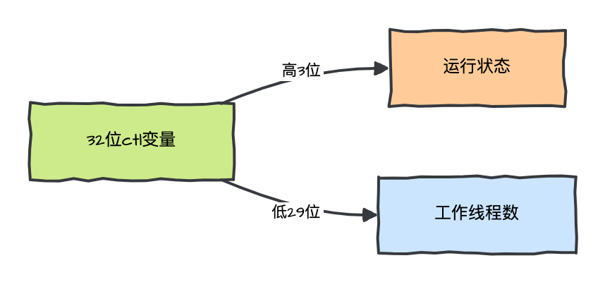

<font style="color:rgb(51, 51, 51);background-color:rgb(248, 246, 244);">Java 中的线程池具有不同的状态，这些状态反映了线程池在其生命周期中的不同阶段和行为。主要的线程池状态有以下几种：</font>

**<font style="color:rgb(34, 34, 34);background-color:rgb(248, 246, 244);">状态描述</font>**<font style="color:rgb(51, 51, 51);background-color:rgb(248, 246, 244);">RUNNING（运行中）表示线程池正在正常运行，并且可以接受新的任务提交。在这种状态下，线程池可以执行任务，并且可以创建新的线程来处理任务。SHUTDOWN（关闭中）表示线程池正在关闭中。</font>

<font style="color:rgb(51, 51, 51);background-color:rgb(248, 246, 244);">在这种状态下，线程池不再接受新的任务提交，但会继续执行已提交的任务，直到所有任务执行完成。STOP（停止）表示线程池已经停止，不再接受新的任务提交，并且尝试中断正在执行的任务。TERMINATED（终止）表示线程池已经终止，不再接受新的任务提交，并且所有任务已经执行完成。在这种状态下，线程池中的所有线程都已经被销毁。</font>

<font style="color:rgb(51, 51, 51);background-color:rgb(248, 246, 244);">通过 ctl 字段，ThreadPoolExecutor 类能够高效地维护线程池的状态和线程数量信息，从而实现了对线程池的有效管理和控制。</font>

**<font style="color:rgb(34, 34, 34);background-color:rgb(248, 246, 244);">“</font>**

<font style="color:rgb(100, 100, 100);background-color:rgb(248, 246, 244);">Chaya：“爱一个人会变，线程池状态又如何变化呢？”</font>

<font style="color:rgb(51, 51, 51);background-color:rgb(248, 246, 244);">线程池的状态不是直接设置的，而是通过调用 shutdown()、shutdownNow() 等方法触发状态的转换。</font>

<font style="color:rgb(51, 51, 51);background-color:rgb(248, 246, 244);">例如，调用 shutdown() 方法会将线程池的状态从 RUNNING 转换为 SHUTDOWN。</font>

<font style="color:rgb(51, 51, 51);background-color:rgb(248, 246, 244);">其生命周期转换如下入所示：</font>

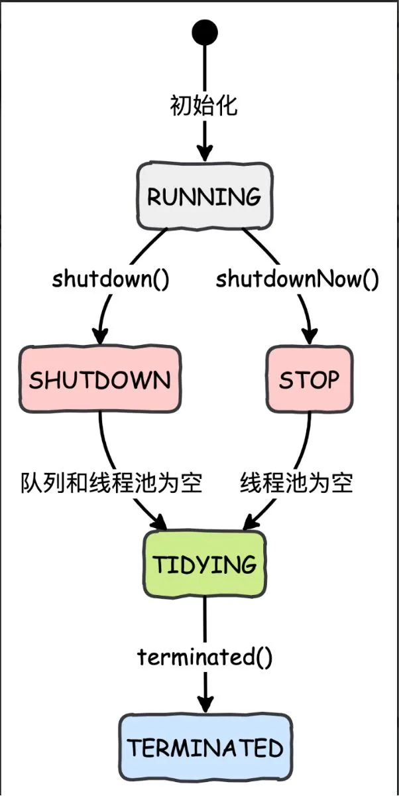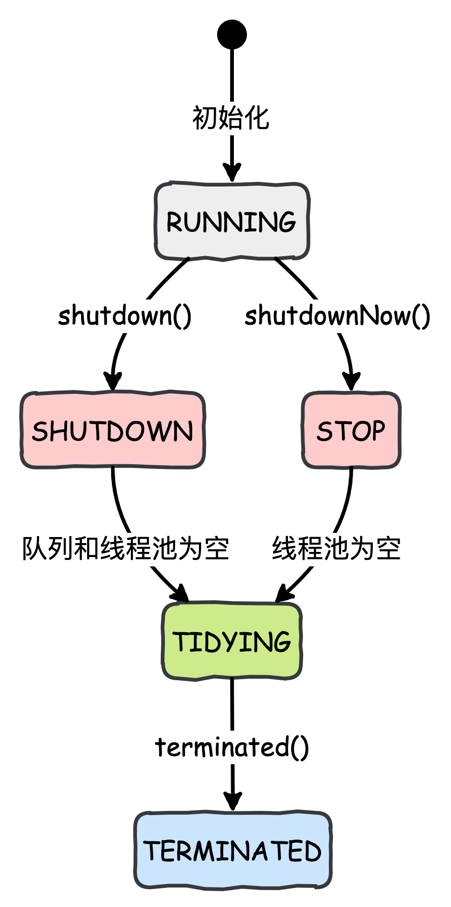

### **<font style="color:rgb(34, 34, 34);background-color:rgb(248, 246, 244);">阻塞队列——任务缓冲</font>**
<font style="color:rgb(51, 51, 51);background-color:rgb(248, 246, 244);">线程池中是通过阻塞队列实现</font>**<font style="color:rgb(34, 34, 34);background-color:rgb(248, 246, 244);">生产者-消费者</font>**<font style="color:rgb(51, 51, 51);background-color:rgb(248, 246, 244);">模式。阻塞队列缓存任务，工作线程从阻塞队列中获取任务。</font>

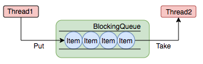

<font style="color:rgb(51, 51, 51);background-color:rgb(248, 246, 244);">使用不同的队列可以实现不一样的任务存取策略。Java 并发编程中不同阻塞队列的特点和实现原理详见之前的文章</font>[<font style="color:rgb(177, 75, 67);background-color:rgb(248, 246, 244);">《1.8w 字图解 Java 并发容器： CHM、ConcurrentLinkedQueue、7 种阻塞队列的使用场景和原理》</font>](https://mp.weixin.qq.com/s/hpwgCR9cr087dvEDdjRdYQ)<font style="color:rgb(51, 51, 51);background-color:rgb(248, 246, 244);">。</font>


### **<font style="color:rgb(34, 34, 34);background-color:rgb(248, 246, 244);">拒绝策略</font>**
**<font style="color:rgb(34, 34, 34);background-color:rgb(248, 246, 244);">“</font>**

<font style="color:rgb(100, 100, 100);background-color:rgb(248, 246, 244);">Chaya：“李老师，如果无止尽的海量任务丢给线程池，线程池处理不过来了？”</font>

<font style="color:rgb(51, 51, 51);background-color:rgb(248, 246, 244);">这时候就要设计一个拒绝策略了，线程池有一个最大的容量，当线程池的任务缓存队列已满，并且线程池中的线程数目达到 maximumPoolSize 时，就需要拒绝掉该任务，采取任务拒绝策略，保护线程池。</font>

<font style="color:rgb(51, 51, 51);background-color:rgb(248, 246, 244);">ThreadPoolExecutor 内部有实现 4 个拒绝策略：</font>

1. <font style="color:rgb(51, 51, 51);background-color:rgb(248, 246, 244);">CallerRunsPolicy，由调用 execute 方法提交任务的线程来执行这个任务。</font>
2. <font style="color:rgb(51, 51, 51);background-color:rgb(248, 246, 244);">AbortPolicy，抛出异常 RejectedExecutionException 拒绝提交任务。</font>
3. <font style="color:rgb(51, 51, 51);background-color:rgb(248, 246, 244);">DiscardPolicy，直接抛弃任务，不做任何处理。</font>
4. <font style="color:rgb(51, 51, 51);background-color:rgb(248, 246, 244);">DiscardOldestPolicy，去除任务队列中的第一个任务（最旧的），重新提。</font>

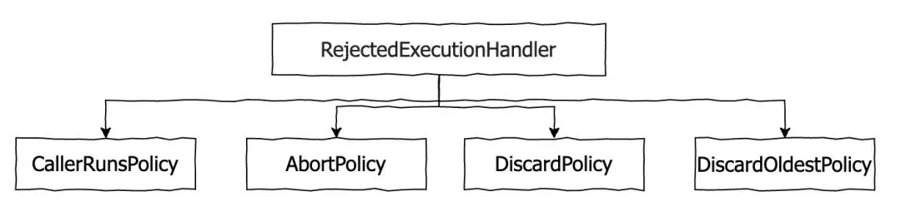

<font style="color:rgb(51, 51, 51);background-color:rgb(248, 246, 244);">除了上述标准拒绝策略之外，您还可以实现 RejectedExecutionHandler 接口来定义自定义的拒绝策略。</font>

<font style="color:rgb(51, 51, 51);background-color:rgb(248, 246, 244);">这样你就可以根据应用程序的需求实现更复杂的拒绝逻辑。</font>

<font style="color:rgb(51, 51, 51);background-color:rgb(248, 246, 244);">RejectedExecutionHandler 接口：</font>

```plain
public interface RejectedExecutionHandler {
    void rejectedExecution(Runnable r, ThreadPoolExecutor executor);
}
```

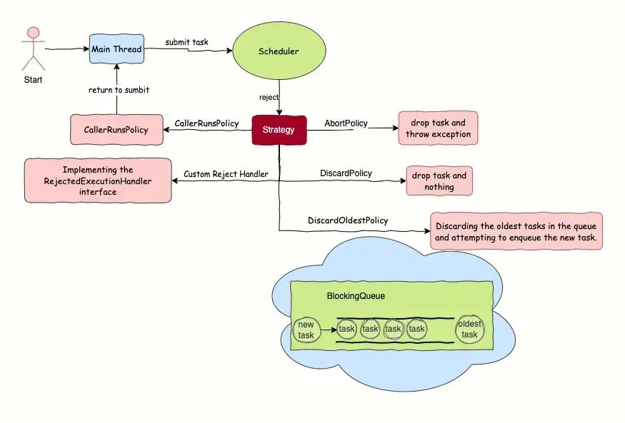

### **<font style="color:rgb(34, 34, 34);background-color:rgb(248, 246, 244);">Worker 线程管理</font>**
**<font style="color:rgb(34, 34, 34);background-color:rgb(248, 246, 244);">“</font>**

<font style="color:rgb(100, 100, 100);background-color:rgb(248, 246, 244);">Chaya：“线程池如何管理线程的状态和生命周期呢？”</font>

<font style="color:rgb(51, 51, 51);background-color:rgb(248, 246, 244);">设计了一个工作线程 Worker 来管理。</font>

```plain
private final class Worker
    extends AbstractQueuedSynchronizer
    implements Runnable {

    final Thread thread;
    Runnable firstTask;

    Worker(Runnable firstTask) {
        setState(-1); // 禁止中断直到runWorker
        this.firstTask = firstTask;
        this.thread = getThreadFactory().newThread(this);
    }

    public void run() {
        runWorker(this);
    }

    // 省略AQS方法实现...
}
```

<font style="color:rgb(51, 51, 51);background-color:rgb(248, 246, 244);">Worker 这个工作线程，实现了 Runnable 接口，并持有一个线程 thread、一个初始化的任务 firstTask。</font>

+ <font style="color:rgb(51, 51, 51);background-color:rgb(248, 246, 244);">thread 是在调用构造方法时通过 ThreadFactory 来创建的线程，可以用来执行任务；</font>
+ <font style="color:rgb(51, 51, 51);background-color:rgb(248, 246, 244);">firstTask 用它来保存传入的第一个任务，这个任务可以有也可以为 null。  
</font>
    - <font style="color:rgb(51, 51, 51);background-color:rgb(248, 246, 244);">如果这个值是非空的，那么线程就会在启动初期立即执行这个任务，也就对应核心线程创建时的情况；</font>
    - <font style="color:rgb(51, 51, 51);background-color:rgb(248, 246, 244);">如果这个值是 null，那么就需要创建一个线程去执行任务列表（workQueue）中的任务，也就是非核心线程的创建。</font>

<font style="color:rgb(51, 51, 51);background-color:rgb(248, 246, 244);">Worker 执行任务的模型如下图所示：</font>

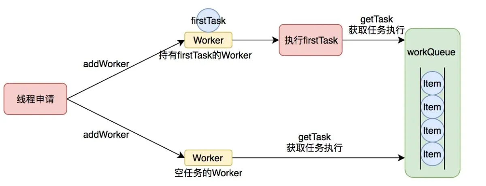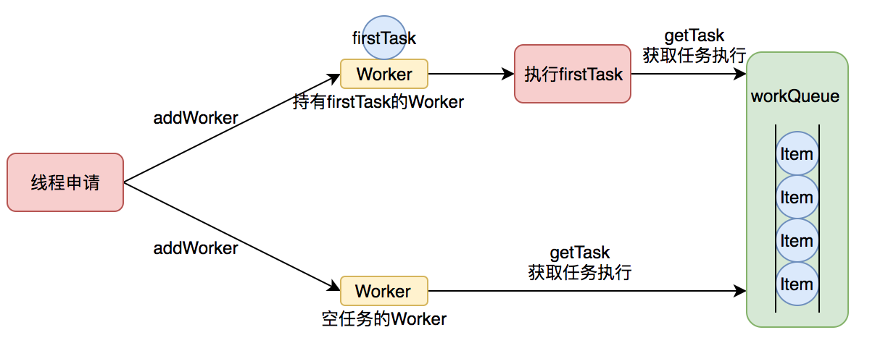

**<font style="color:rgb(34, 34, 34);background-color:rgb(248, 246, 244);">“</font>**

<font style="color:rgb(100, 100, 100);background-color:rgb(248, 246, 244);">线程池如何管理线程生命周期？</font>

<font style="color:rgb(51, 51, 51);background-color:rgb(248, 246, 244);">线程池使用一张 HashSet 表去持有线程的引用，这样可以通过添加引用、移除引用这样的操作来控制线程的生命周期。</font>

**<font style="color:rgb(34, 34, 34);background-color:rgb(248, 246, 244);">Worker 线程复用</font>**

<font style="color:rgb(51, 51, 51);background-color:rgb(248, 246, 244);">通过继承 AQS，使用 AQS 来实现独占锁 Worker 线程的复用功能。</font>

1. <font style="color:rgb(51, 51, 51);background-color:rgb(248, 246, 244);">lock 方法一旦获取了独占锁，表示当前线程正在执行任务中。</font>
2. <font style="color:rgb(51, 51, 51);background-color:rgb(248, 246, 244);">如果正在执行任务，则不应该中断线程。</font>
3. <font style="color:rgb(51, 51, 51);background-color:rgb(248, 246, 244);">如果该线程现在不是独占锁的状态，也就是空闲的状态，说明它没有在处理任务，这时可以对该线程进行中断回收。</font>
4. <font style="color:rgb(51, 51, 51);background-color:rgb(248, 246, 244);">线程池在执行 shutdown 方法或 tryTerminate 方法时会调用 interruptIdleWorkers 方法来中断空闲的线程，interruptIdleWorkers 方法会使用 tryLock 方法来判断线程池中的线程是否是空闲状态；如果线程是空闲状态则可以安全回收。</font>

<font style="color:rgb(51, 51, 51);background-color:rgb(248, 246, 244);">线程池线程回收复用过程如图所示：</font>

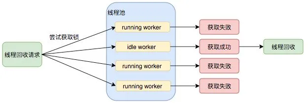

**<font style="color:rgb(34, 34, 34);background-color:rgb(248, 246, 244);">Worker 线程增加</font>**

<font style="color:rgb(51, 51, 51);background-color:rgb(248, 246, 244);">增加线程是通过线程池中的 addWorker 方法，addWorker 方法有两个参数：firstTask、core。</font>

+ <font style="color:rgb(51, 51, 51);background-color:rgb(248, 246, 244);">firstTask 参数用于指定新增的线程执行的第一个任务，该参数可以为空；</font>
+ <font style="color:rgb(51, 51, 51);background-color:rgb(248, 246, 244);">core 参数为 true 表示在新增线程时会判断当前活动线程数是否少于 corePoolSize，false 表示新增线程前需要判断当前活动线程数是否少于 maximumPoolSize。</font>

<font style="color:rgb(51, 51, 51);background-color:rgb(248, 246, 244);">执行流程如下图所示：</font>

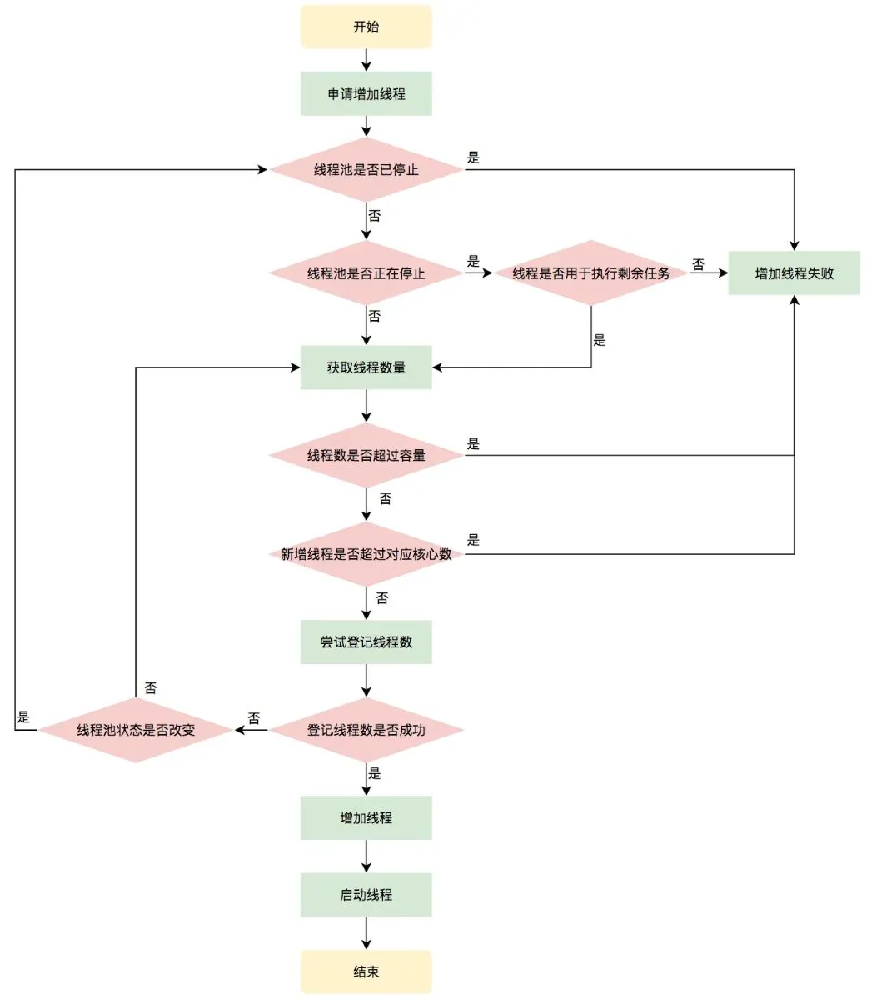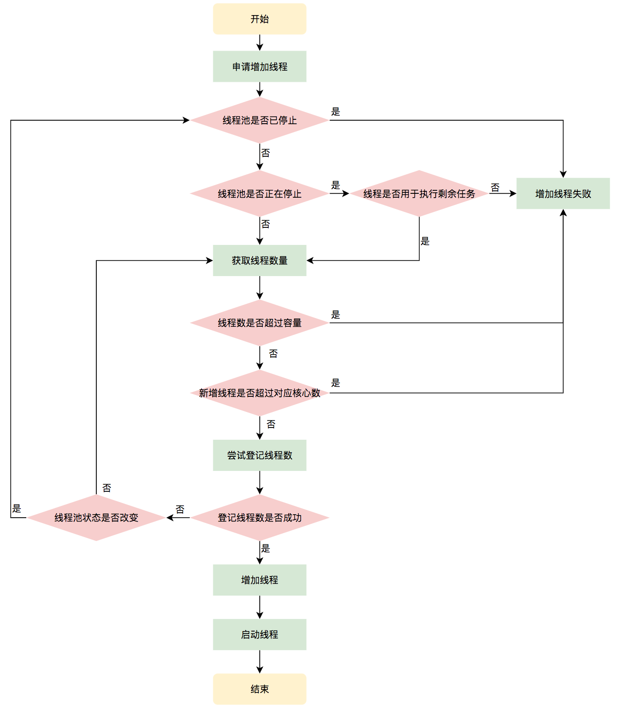

**<font style="color:rgb(34, 34, 34);background-color:rgb(248, 246, 244);">Worker 线程垃圾回收</font>**

<font style="color:rgb(51, 51, 51);background-color:rgb(248, 246, 244);">线程池中线程的销毁依赖 JVM 自动的回收，线程池做的工作是根据当前线程池的状态维护一定数量的线程引用，防止这部分线程被 JVM 回收，当线程池决定哪些线程需要回收时，只需要将其引用消除即可。</font>

<font style="color:rgb(51, 51, 51);background-color:rgb(248, 246, 244);">Worker 被创建出来后，就会不断地进行轮询，然后获取任务去执行，核心线程可以无限等待获取任务，非核心线程要限时获取任务。</font>

<font style="color:rgb(51, 51, 51);background-color:rgb(248, 246, 244);">当 Worker 无法获取到任务，也就是获取的任务为空时，循环会结束，Worker 会主动消除自身在线程池内的引用。</font>


<font style="color:rgb(51, 51, 51);background-color:rgb(248, 246, 244);">图10 线程销毁流程</font>

<font style="color:rgb(51, 51, 51);background-color:rgb(248, 246, 244);">线程回收的工作是在 processWorkerExit 方法完成的。</font>

```plain
private void processWorkerExit(Worker w, boolean completedAbruptly) {
    if (completedAbruptly) // 异常终止才需要补偿
        decrementWorkerCount();

    final ReentrantLock mainLock = this.mainLock;
    mainLock.lock();
    try {
        completedTaskCount += w.completedTasks;
        workers.remove(w); // 从集合中移除
    } finally {
        mainLock.unlock();
    }

    tryTerminate(); // 尝试终止线程池

    int c = ctl.get();
    if (runStateLessThan(c, STOP)) {
        if (!completedAbruptly) {
            // 计算最小保留线程数
            int min = allowCoreThreadTimeOut ? 0 : corePoolSize;
            if (min == 0 && ! workQueue.isEmpty())
                min = 1;
            if (workerCountOf(c) >= min)
                return;
        }
        addWorker(null, false); // 补充新Worker
    }
}
```

<font style="color:rgb(51, 51, 51);background-color:rgb(248, 246, 244);">回收场景对比表：</font>

**<font style="color:rgb(34, 34, 34);background-color:rgb(248, 246, 244);">场景类型触发条件处理方式</font>**<font style="color:rgb(51, 51, 51);background-color:rgb(248, 246, 244);">正常退出getTask()返回 null检查是否需要补充新 Worker异常退出任务执行抛出未捕获异常立即补充新 Worker配置变更核心线程数调整动态调整存活 Worker 数量线程池关闭shutdown/shutdownNow 调用中断所有 Worker 并清空队列</font>

**<font style="color:rgb(34, 34, 34);background-color:rgb(248, 246, 244);">Worker 线程执行任务</font>**

<font style="color:rgb(51, 51, 51);background-color:rgb(248, 246, 244);">Worker 类中的 run 方法调用了 runWorker 方法来执行任务，runWorker 方法的执行过程如下：</font>

1. <font style="color:rgb(51, 51, 51);background-color:rgb(248, 246, 244);">while 循环不断地通过 getTask()方法获取任务。</font>
2. <font style="color:rgb(51, 51, 51);background-color:rgb(248, 246, 244);">getTask()方法从阻塞队列中取任务。</font>
3. <font style="color:rgb(51, 51, 51);background-color:rgb(248, 246, 244);">如果线程池正在停止，那么要保证当前线程是中断状态，否则要保证当前线程不是中断状态。</font>
4. <font style="color:rgb(51, 51, 51);background-color:rgb(248, 246, 244);">执行任务。</font>
5. <font style="color:rgb(51, 51, 51);background-color:rgb(248, 246, 244);">如果 getTask 结果为 null 则跳出循环，执行 processWorkerExit()方法，销毁线程。</font>

<font style="color:rgb(51, 51, 51);background-color:rgb(248, 246, 244);">任务执行主流程如下：</font>

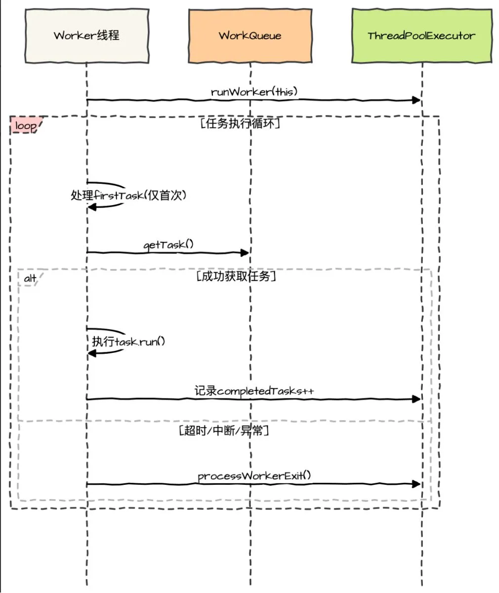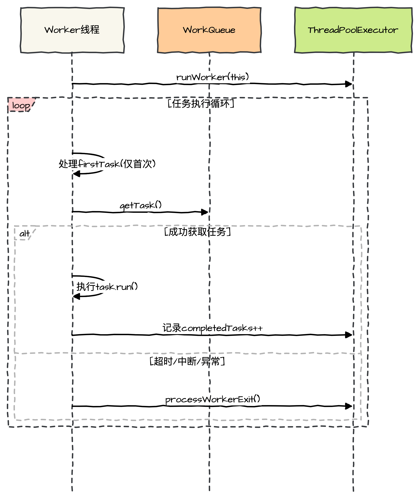

<font style="color:rgb(51, 51, 51);background-color:rgb(248, 246, 244);">源码分析：</font>

```plain
final void runWorker(Worker w) {
    Thread wt = Thread.currentThread();
    Runnable task = w.firstTask;
    w.firstTask = null;
    w.unlock();
    boolean completedAbruptly = true;
    try {
        while (task != null || (task = getTask()) != null) {
            w.lock(); // 获取Worker锁
            // 检查线程池状态
            if ((runStateAtLeast(ctl.get(), STOP) ||
                 (Thread.interrupted() &&
                  runStateAtLeast(ctl.get(), STOP))) &&
                !wt.isInterrupted())
                wt.interrupt();
            try {
                beforeExecute(wt, task);
                Throwable thrown = null;
                try {
                    task.run(); // 实际执行任务
                } catch (Throwable x) {
                    thrown = x;
                    throw x;
                } finally {
                    afterExecute(task, thrown);
                }
            } finally {
                task = null;
                w.completedTasks++;
                w.unlock();
            }
        }
        completedAbruptly = false;
    } finally {
        processWorkerExit(w, completedAbruptly);
    }
}
```

### **<font style="color:rgb(34, 34, 34);background-color:rgb(248, 246, 244);">设计亮点分析</font>**
1. **<font style="color:rgb(34, 34, 34);background-color:rgb(248, 246, 244);">无锁化设计</font>**<font style="color:rgb(51, 51, 51);background-color:rgb(248, 246, 244);">：通过 CAS 操作修改 ctl 状态，避免全局锁竞争</font>
2. **<font style="color:rgb(34, 34, 34);background-color:rgb(248, 246, 244);">线程复用</font>**<font style="color:rgb(51, 51, 51);background-color:rgb(248, 246, 244);">：Worker 循环从队列获取任务，减少线程创建开销</font>
3. **<font style="color:rgb(34, 34, 34);background-color:rgb(248, 246, 244);">弹性扩容</font>**<font style="color:rgb(51, 51, 51);background-color:rgb(248, 246, 244);">：corePoolSize 维持常驻线程，maximumPoolSize 应对突发流量</font>
4. **<font style="color:rgb(34, 34, 34);background-color:rgb(248, 246, 244);">优雅降级</font>**<font style="color:rgb(51, 51, 51);background-color:rgb(248, 246, 244);">：队列缓冲+拒绝策略防止资源耗尽</font>

## **<font style="color:rgb(34, 34, 34);background-color:rgb(248, 246, 244);">ScheduledThreadPoolExecutor</font>**
<font style="color:rgb(51, 51, 51);background-color:rgb(248, 246, 244);">有了前文的线程池实现原理做铺垫，掌握 ScheduledThreadPoolExecutor 就轻松多了。</font>

**<font style="color:rgb(34, 34, 34);background-color:rgb(248, 246, 244);">“</font>**

<font style="color:rgb(100, 100, 100);background-color:rgb(248, 246, 244);">Chaya：“ScheduledThreadPoolExecutor 是什么？”</font>

<font style="color:rgb(51, 51, 51);background-color:rgb(248, 246, 244);">ScheduledThreadPoolExecutor 继承自 ThreadPoolExecutor，为任务提供延迟或周期执行，属于线程池的一种。和 ThreadPoolExecutor 相比，它还具有以下几种特性:</font>

+ <font style="color:rgb(51, 51, 51);background-color:rgb(248, 246, 244);">使用专门的任务类型—ScheduledFutureTask 来执行周期任务，也可以接收不需要时间调度的任务(这些任务通过 ExecutorService 来执行)。</font>
+ <font style="color:rgb(51, 51, 51);background-color:rgb(248, 246, 244);">使用专门的存储队列—DelayedWorkQueue 来存储任务，DelayedWorkQueue 是无界延迟队列 DelayQueue 的一种。相比 ThreadPoolExecutor 也简化了执行机制(delayedExecute 方法，后面单独分析)。</font>
+ <font style="color:rgb(51, 51, 51);background-color:rgb(248, 246, 244);">支持可选的 run-after-shutdown参数，在池被关闭(shutdown)之后支持可选的逻辑来决定是否继续运行周期或延迟任务。并且当任务(重新)提交操作与 shutdown 操作重叠时，复查逻辑也不相同。</font>

### **<font style="color:rgb(34, 34, 34);background-color:rgb(248, 246, 244);">使用场景</font>**
<font style="color:rgb(51, 51, 51);background-color:rgb(248, 246, 244);">光说不练假把式，想要学习一个框架的原理，第一步先要理解使用场景，并把它跑起来。</font>

**<font style="color:rgb(34, 34, 34);background-color:rgb(248, 246, 244);">1. 定时任务调度</font>**

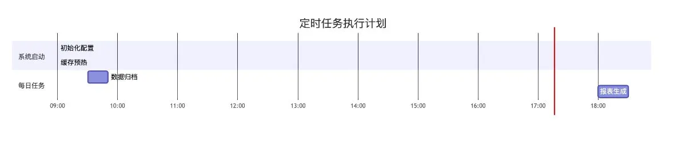

<font style="color:rgb(51, 51, 51);background-color:rgb(248, 246, 244);">image-20250426171745139</font>

<font style="color:rgb(51, 51, 51);background-color:rgb(248, 246, 244);">代码案例如下：</font>

```plain
ScheduledExecutorService scheduler = Executors.newScheduledThreadPool(3);

// 系统启动后5秒执行初始化
scheduler.schedule(() -> initConfig(), 5, TimeUnit.SECONDS);

// 每天9:30执行数据归档（需计算初始延迟）
long initialDelay = calculateDelay(9, 30);
scheduler.scheduleAtFixedRate(() -> archiveData(),
    initialDelay, 24 * 60 * 60, TimeUnit.SECONDS);
```

**<font style="color:rgb(34, 34, 34);background-color:rgb(248, 246, 244);">2. 心跳监测机制</font>**

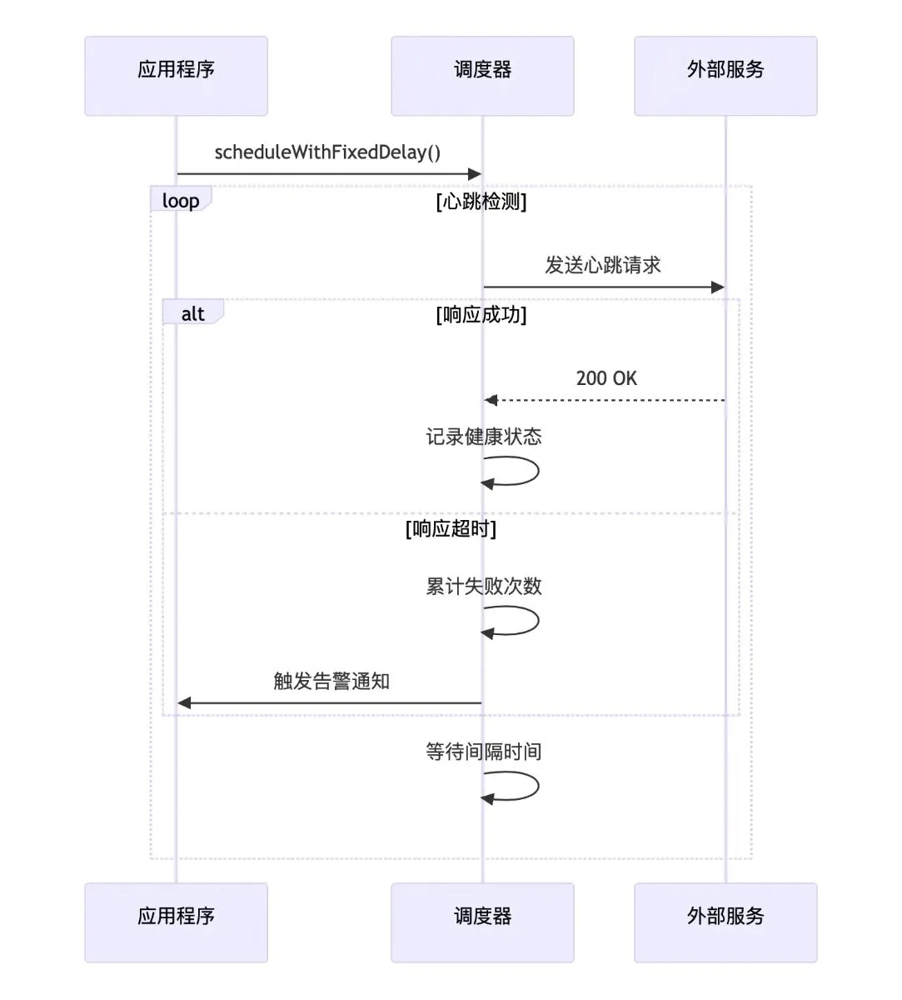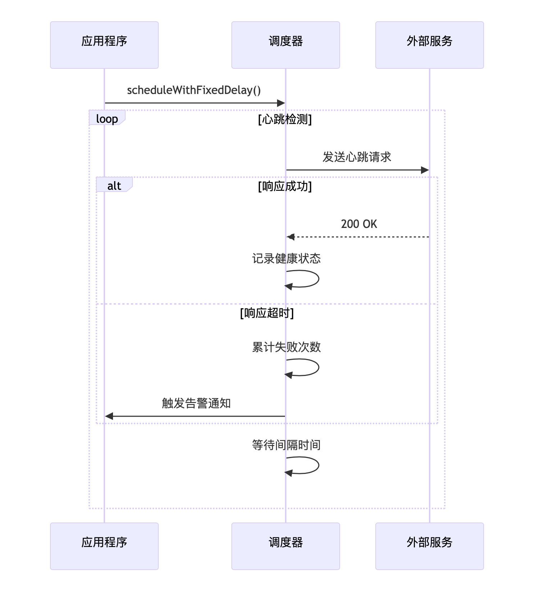

```plain
scheduler.scheduleWithFixedDelay(() -> {
    try {
        HeartbeatResponse res = httpClient.checkHealth();
        if (res.isHealthy()) {
            resetFailureCount();
        }
    } catch (TimeoutException e) {
        if (incrementAndGetFailureCount() > 3) {
            alertSystem.sendCriticalAlert();
        }
    }
}, 0, 30, TimeUnit.SECONDS); // 立即开始，间隔30秒
```

**<font style="color:rgb(34, 34, 34);background-color:rgb(248, 246, 244);">最佳防御式编程示例</font>**

```plain
scheduler.scheduleAtFixedRate(() -> {
    try {
        // 业务代码
        processBusinessLogic();

        // 添加健康检查点
        if (!systemStatus.isHealthy()) {
            throw new ServiceUnavailableException();
        }
    } catch (BusinessException e) {
        // 业务可恢复异常
        logger.warn("业务处理警告", e);
    } catch (Throwable t) {
        // 不可恢复异常处理
        logger.error("致命错误触发任务终止", t);
        emergencyRepair();
    }
}, 0, 1, TimeUnit.MINUTES);
```

**<font style="color:rgb(34, 34, 34);background-color:rgb(248, 246, 244);">优雅关闭</font>**

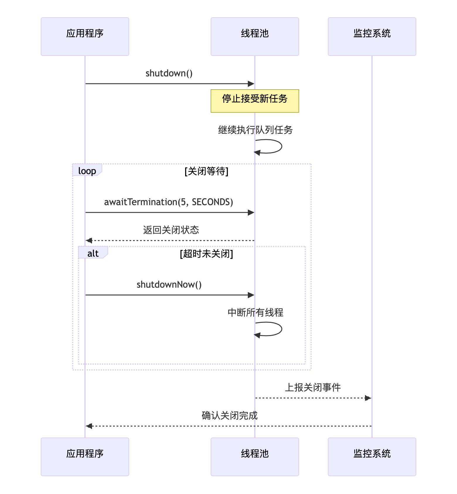

```typescript
public void gracefulShutdown(ScheduledThreadPoolExecutor executor) {
    executor.shutdown(); // 禁止新任务提交
    try {
        if (!executor.awaitTermination(60, TimeUnit.SECONDS)) {
            List<Runnable> dropped = executor.shutdownNow();
            logger.warn("强制关闭，丢弃{}个任务", dropped.size());
            if (!executor.awaitTermination(60, TimeUnit.SECONDS)) {
                logger.error("线程池未完全关闭");
            }
        }
    } catch (InterruptedException e) {
        Thread.currentThread().interrupt();
        executor.shutdownNow();
    }
}
```

### **<font style="color:rgb(34, 34, 34);background-color:rgb(248, 246, 244);">实现原理</font>**
<font style="color:rgb(51, 51, 51);background-color:rgb(248, 246, 244);">看下类图，可以发现 ScheduledThreadPoolExecutor 继承 ThreadPoolExecutor，并实现了 ScheduledExecutorService接口。</font>

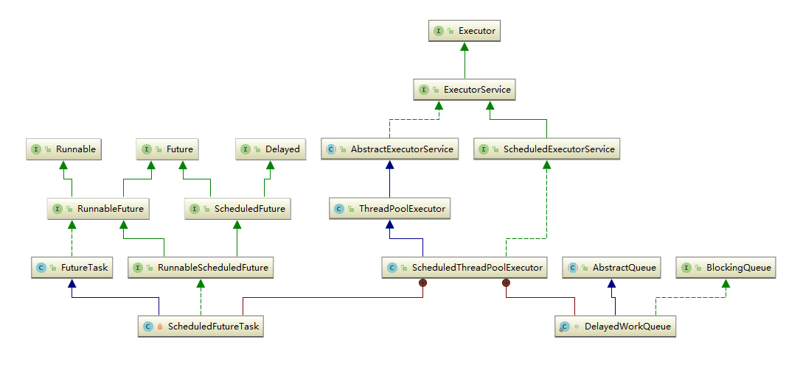

<font style="color:rgb(51, 51, 51);background-color:rgb(248, 246, 244);">ScheduledThreadPoolExecutor 内部构造了两个内部类 ScheduledFutureTask 和 DelayedWorkQueue:</font>

+ <font style="color:rgb(51, 51, 51);background-color:rgb(248, 246, 244);">ScheduledFutureTask: 继承了 FutureTask，说明是一个异步运算任务；最上层分别实现了 Runnable、Future、Delayed 接口，说明它是一个可以延迟执行的异步运算任务。</font>
+ <font style="color:rgb(51, 51, 51);background-color:rgb(248, 246, 244);">DelayedWorkQueue: 这是 ScheduledThreadPoolExecutor 为存储周期或延迟任务专门定义的一个延迟队列，继承了 AbstractQueue，为了契合 ThreadPoolExecutor 也实现了 BlockingQueue 接口。它内部只允许存储 RunnableScheduledFuture 类型的任务。</font>

<font style="color:rgb(51, 51, 51);background-color:rgb(248, 246, 244);">与 DelayQueue 的不同之处就是它只允许存放 RunnableScheduledFuture 对象，并且自己实现了二叉堆(DelayQueue 是利用了 PriorityQueue 的二叉堆结构)。</font>

<font style="color:rgb(51, 51, 51);background-color:rgb(248, 246, 244);">线程池 ThreadPoolExecutor 在之前介绍过了，相信大家都还有印象，接下来我们来看看 ScheduledExecutorService 接口。</font>

```plain
public interface ScheduledExecutorService extends ExecutorService {

    /**
     * 安排一个Runnable任务在给定的延迟后执行。
     *
     * @param command 需要执行的任务
     * @param delay 延迟时间
     * @param unit 时间单位
     * @return 可用于提取结果或取消的ScheduledFuture
     */
    public ScheduledFuture<?> schedule(Runnable command, long delay, TimeUnit unit);

    /**
     * 安排一个Callable任务在给定的延迟后执行。
     *
     * @param callable 需要执行的任务
     * @param delay 延迟时间
     * @param unit 时间单位
     * @return 可用于提取结果或取消的ScheduledFuture
     */
    public <V> ScheduledFuture<V> schedule(Callable<V> callable, long delay, TimeUnit unit);

    /**
     * 安排一个Runnable任务在给定的初始延迟后首次执行，随后每个period时间间隔执行一次。
     *
     * @param command 需要执行的任务
     * @param initialDelay 首次执行的初始延迟
     * @param period 连续执行之间的时间间隔
     * @param unit 时间单位
     * @return 可用于提取结果或取消的ScheduledFuture
     */
    public ScheduledFuture<?> scheduleAtFixedRate(Runnable command,
                                                  long initialDelay,
                                                  long period,
                                                  TimeUnit unit);

    /**
     * 安排一个Runnable任务在给定的初始延迟后首次执行，随后每次完成任务后等待指定的延迟再次执行。
     *
     * @param command 需要执行的任务
     * @param initialDelay 首次执行的初始延迟
     * @param delay 每次执行结束后的延迟时间
     * @param unit 时间单位
     * @return 可用于提取结果或取消的ScheduledFuture
     */
    public ScheduledFuture<?> scheduleWithFixedDelay(Runnable command,
                                                     long initialDelay,
                                                     long delay,
                                                     TimeUnit unit);
}
```

<font style="color:rgb(51, 51, 51);background-color:rgb(248, 246, 244);">ScheduledExecutorService 接口继承了 ExecutorService 接口，并增加了几个定时相关的接口方法。前两个方法用于单次调度执行任务，区别是有没有返回值。</font>

**<font style="color:rgb(34, 34, 34);background-color:rgb(248, 246, 244);">核心结构</font>**

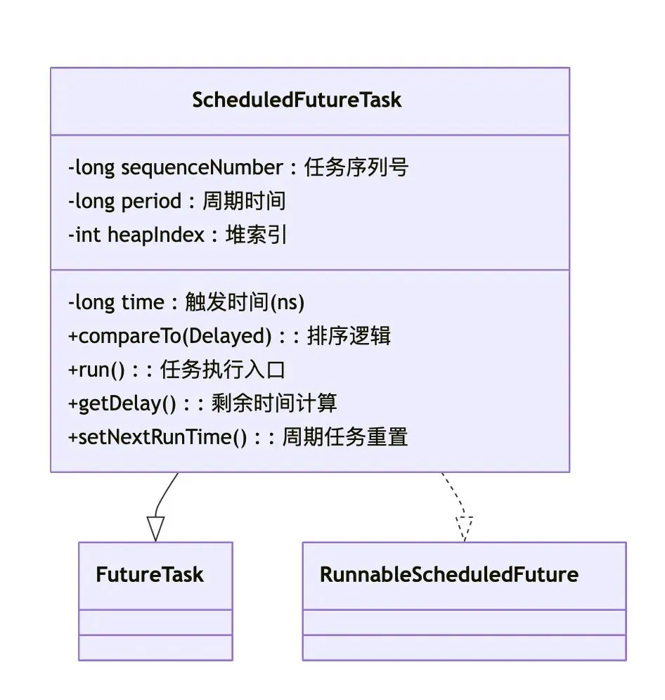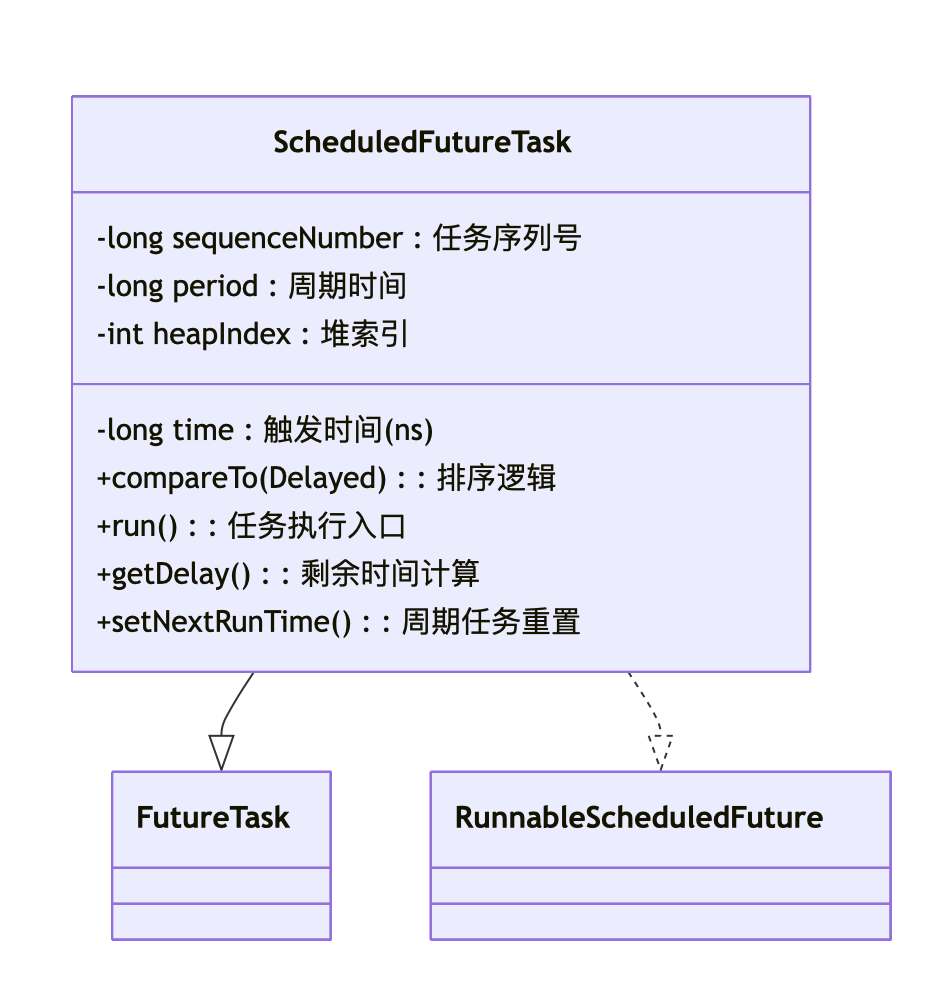

**<font style="color:rgb(34, 34, 34);background-color:rgb(248, 246, 244);">关键字段说明：</font>**

+ <font style="color:rgb(51, 51, 51);background-color:rgb(248, 246, 244);">sequenceNumber：原子递增序列，解决相同触发时间的任务排序问题。</font>
+ <font style="color:rgb(51, 51, 51);background-color:rgb(248, 246, 244);">time：基于System.nanoTime()的绝对时间戳。</font>
+ <font style="color:rgb(51, 51, 51);background-color:rgb(248, 246, 244);">period：  
</font>
    - <font style="color:rgb(51, 51, 51);background-color:rgb(248, 246, 244);"><0：固定延迟（scheduleWithFixedDelay）。</font>
    - <font style="color:rgb(51, 51, 51);background-color:rgb(248, 246, 244);">0：固定速率（scheduleAtFixedRate）。</font>

**<font style="color:rgb(34, 34, 34);background-color:rgb(248, 246, 244);">“</font>**

<font style="color:rgb(100, 100, 100);background-color:rgb(248, 246, 244);">Chaya：如何保存时间最小的任务调度执行呢？</font>

<font style="color:rgb(51, 51, 51);background-color:rgb(248, 246, 244);">ScheduledThreadPoolExecutor使用了DelayedWorkQueue 来保存等待的任务。</font>

<font style="color:rgb(51, 51, 51);background-color:rgb(248, 246, 244);">该等待队列的队首应该保存的是</font>**<font style="color:rgb(34, 34, 34);background-color:rgb(248, 246, 244);">最近将要执行的任务</font>**<font style="color:rgb(51, 51, 51);background-color:rgb(248, 246, 244);">，所以worker只关心队首任务，如果队首任务的开始执行时间还未到，worker 也应该继续等待。</font>

<font style="color:rgb(51, 51, 51);background-color:rgb(248, 246, 244);">DelayedWorkQueue 是一个无界优先队列，使用数组存储，底层使用堆结构来实现优先队列的功能。</font>

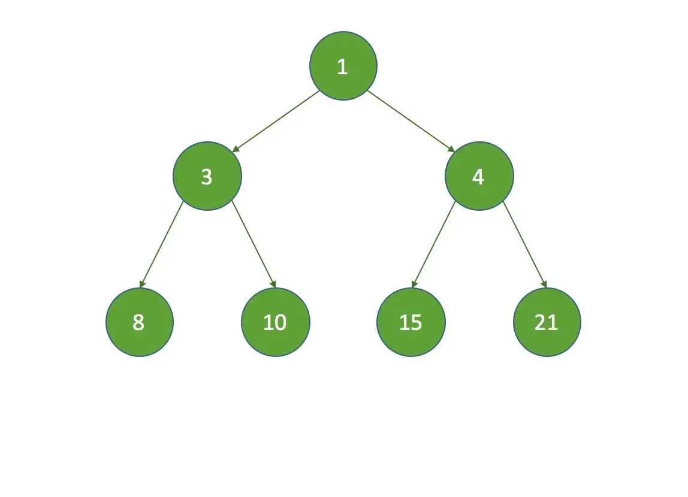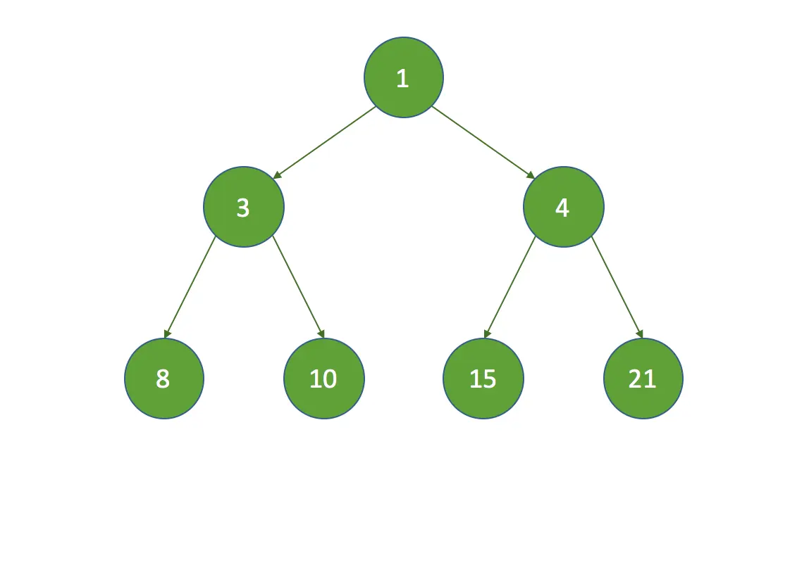

<font style="color:rgb(51, 51, 51);background-color:rgb(248, 246, 244);">可以转换成如下的数组：</font>


<font style="color:rgb(51, 51, 51);background-color:rgb(248, 246, 244);">在这种结构中，可以发现有如下特性。假设，索引值从 0 开始，子节点的索引值为 k，父节点的索引值为 p，则：</font>

+ <font style="color:rgb(51, 51, 51);background-color:rgb(248, 246, 244);">一个节点的左子节点的索引为：k = p * 2 + 1；</font>
+ <font style="color:rgb(51, 51, 51);background-color:rgb(248, 246, 244);">一个节点的右子节点的索引为：k = (p + 1) * 2；</font>
+ <font style="color:rgb(51, 51, 51);background-color:rgb(248, 246, 244);">一个节点的父节点的索引为：p = (k - 1) / 2。</font>
+ 

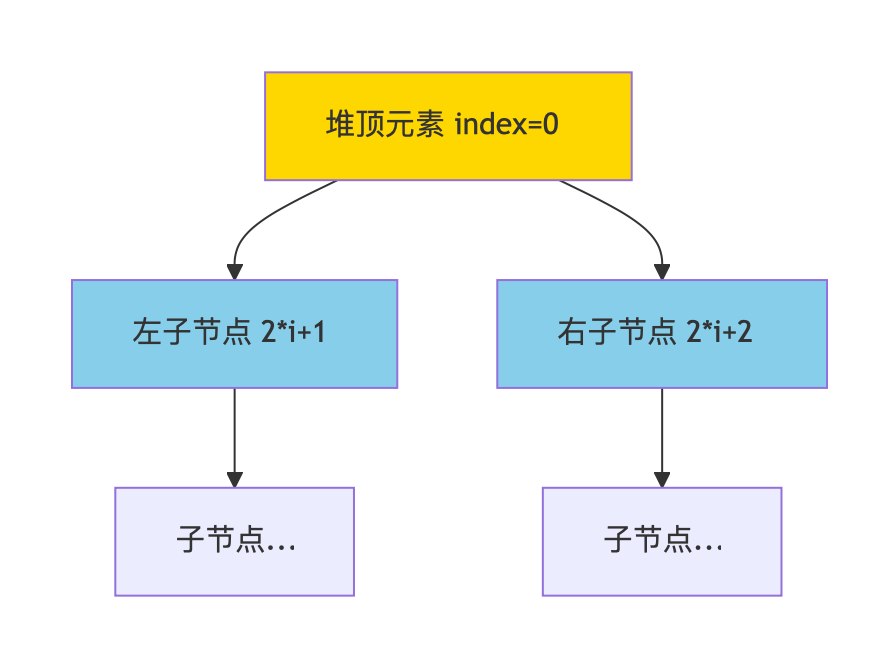

<font style="color:rgb(51, 51, 51);background-color:rgb(248, 246, 244);">任务调度执行全流程。</font>

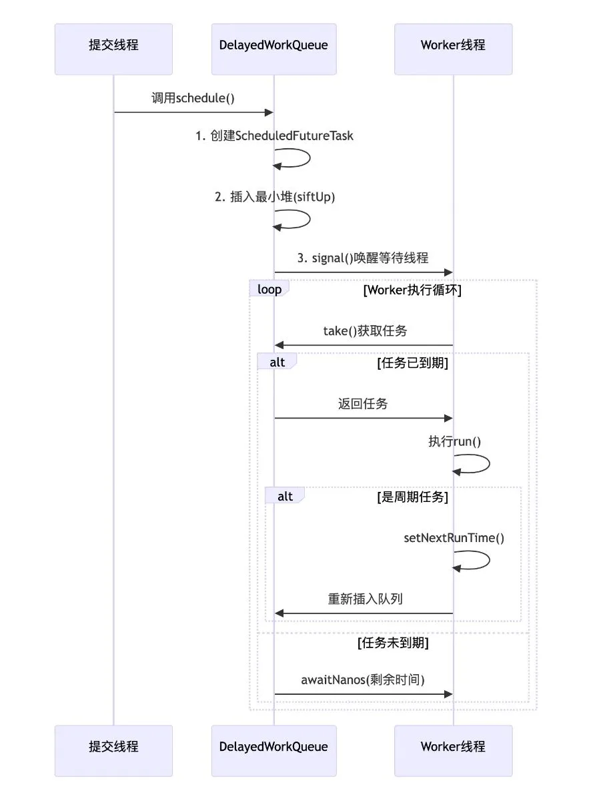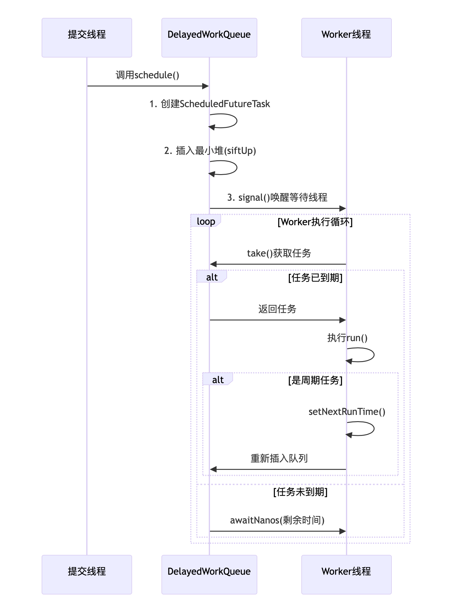

<font style="color:rgb(51, 51, 51);background-color:rgb(248, 246, 244);">我们先来看下 ScheduledThreadPoolExecutor 的构造方法，其实在 executors 框架概述中讲 Executors 时已经接触过了。</font>

<font style="color:rgb(51, 51, 51);background-color:rgb(248, 246, 244);">Executors 使用 newScheduledThreadPool 工厂方法创建 ScheduledThreadPoolExecutor：</font>

```cpp
public static ScheduledExecutorService newScheduledThreadPool(int corePoolSize) {
    return new ScheduledThreadPoolExecutor(corePoolSize);
}

public static ScheduledExecutorService newScheduledThreadPool(int corePoolSize, ThreadFactory threadFactory) {
    return new ScheduledThreadPoolExecutor(corePoolSize, threadFactory);
}
```

<font style="color:rgb(51, 51, 51);background-color:rgb(248, 246, 244);">我们来看下 ScheduledThreadPoolExecutor 的构造器，内部其实都是调用了父类 ThreadPoolExecutor 的构造器，这里最需要注意的就是任务队列的选择——DelayedWorkQueue.</font>

```plain
public ScheduledThreadPoolExecutor(int corePoolSize) {
        super(corePoolSize, Integer.MAX_VALUE,
              DEFAULT_KEEPALIVE_MILLIS, MILLISECONDS,
              new DelayedWorkQueue());
    }


    public ScheduledThreadPoolExecutor(int corePoolSize,
                                       ThreadFactory threadFactory) {
        super(corePoolSize, Integer.MAX_VALUE,
              DEFAULT_KEEPALIVE_MILLIS, MILLISECONDS,
              new DelayedWorkQueue(), threadFactory);
    }

    public ScheduledThreadPoolExecutor(int corePoolSize,
                                       RejectedExecutionHandler handler) {
        super(corePoolSize, Integer.MAX_VALUE,
              DEFAULT_KEEPALIVE_MILLIS, MILLISECONDS,
              new DelayedWorkQueue(), handler);
    }


    public ScheduledThreadPoolExecutor(int corePoolSize,
                                       ThreadFactory threadFactory,
                                       RejectedExecutionHandler handler) {
        super(corePoolSize, Integer.MAX_VALUE,
              DEFAULT_KEEPALIVE_MILLIS, MILLISECONDS,
              new DelayedWorkQueue(), threadFactory, handler);
    }
```

**<font style="color:rgb(34, 34, 34);background-color:rgb(248, 246, 244);">执行过程</font>**

<font style="color:rgb(51, 51, 51);background-color:rgb(248, 246, 244);">ScheduledThreadPoolExecutor 的核心调度方法是 schedule、scheduleAtFixedRate、scheduleWithFixedDelay，我们通过 schedule 方法来看下整个调度流程：</font>

```plain
// delay时长后执行任务command，该任务只执行一次
public ScheduledFuture<?> schedule(Runnable command, long delay, TimeUnit unit) {
    if (command == null || unit == null)
        throw new NullPointerException();
    // 这里的decorateTask方法仅仅返回第二个参数
    RunnableScheduledFuture<?> t = decorateTask(command,
                                     new ScheduledFutureTask<Void>(command, null, triggerTime(delay,unit)));
    // 延时或者周期执行任务的主要方法,稍后统一说明
    delayedExecute(t);
    return t;
}
```

<font style="color:rgb(51, 51, 51);background-color:rgb(248, 246, 244);">上述的 decorateTask 方法把 Runnable 任务包装成 ScheduledFutureTask，用户可以根据自己的需要覆写该方法。</font>

```plain
private class ScheduledFutureTask<V> extends FutureTask<V> implements RunnableScheduledFuture<V> {

    /**
     * 任务序号, 自增唯一
     */
    private final long sequenceNumber;

    /**
     * 首次执行的时间点
     */
    private long time;

    /**
     * 0: 非周期任务
     * >0: fixed-rate任务
     * <0: fixed-delay任务
     */
    private final long period;

    /**
     * 在堆中的索引
     */
    int heapIndex;

    ScheduledFutureTask(Runnable r, V result, long ns) {
        super(r, result);
        this.time = ns;
        this.period = 0;
        this.sequenceNumber = sequencer.getAndIncrement();
    }

    // ...
}
```

<font style="color:rgb(51, 51, 51);background-color:rgb(248, 246, 244);">ScheduledThreadPoolExecutor 中的任务队列——DelayedWorkQueue，保存的元素就是 ScheduledFutureTask。DelayedWorkQueue 是一种堆结构，time 最小的任务会排在堆顶（表示最早过期），每次出队都是取堆顶元素，这样最快到期的任务就会被先执行。</font>

<font style="color:rgb(51, 51, 51);background-color:rgb(248, 246, 244);">如果两个 ScheduledFutureTask 的 time 相同，就比较它们的序号——sequenceNumber，序号小的代表先被提交，所以就会先执行。</font>

<font style="color:rgb(51, 51, 51);background-color:rgb(248, 246, 244);">schedule 的核心是其中的 delayedExecute 方法：</font>

```plain
private void delayedExecute(RunnableScheduledFuture<?> task) {
    if (isShutdown())   // 线程池已关闭
        reject(task);   // 任务拒绝策略
    else {
        super.getQueue().add(task);                 // 将任务入队

        // 如果线程池已关闭且该任务是非周期任务, 则将其从队列移除
        if (isShutdown() && !canRunInCurrentRunState(task.isPeriodic()) && remove(task))
            task.cancel(false);  // 取消任务
        else
            ensurePrestart();   // 添加一个工作线程
    }
}
```

<font style="color:rgb(51, 51, 51);background-color:rgb(248, 246, 244);">ScheduledThreadPoolExecutor 的整个任务调度流程大致如下图：</font>

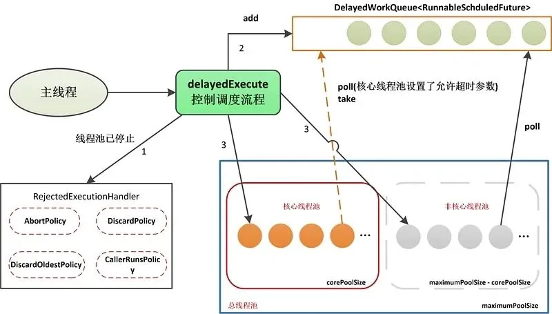

<font style="color:rgb(51, 51, 51);background-color:rgb(248, 246, 244);">我们来分析这个过程：</font>

1. <font style="color:rgb(51, 51, 51);background-color:rgb(248, 246, 244);">首先，任务被提交到线程池后，会判断线程池的状态，如果不是 RUNNING 状态会执行拒绝策略。</font>
2. <font style="color:rgb(51, 51, 51);background-color:rgb(248, 246, 244);">然后，将任务添加到阻塞队列中。（注意，由于 DelayedWorkQueue 是无界队列，所以一定会 add 成功）</font>
3. <font style="color:rgb(51, 51, 51);background-color:rgb(248, 246, 244);">然后，会创建一个工作线程，加入到核心线程池或者非核心线程池：</font>

```csharp
void ensurePrestart() {
    int wc = workerCountOf(ctl.get());
    if (wc < corePoolSize)
        addWorker(null, true);
    else if (wc == 0)
        addWorker(null, false);
}
```

<font style="color:rgb(51, 51, 51);background-color:rgb(248, 246, 244);">通过 ensurePrestart 可以看到，如果核心线程池未满，则新建的工作线程会被放到核心线程池中。如果核心线程池已经满了，ScheduledThreadPoolExecutor 不会像 ThreadPoolExecutor 那样再去创建归属于非核心线程池的工作线程，而是直接返回。也就是说，在 ScheduledThreadPoolExecutor 中，一旦核心线程池满了，就不会再去创建工作线程。</font>

<font style="color:rgb(51, 51, 51);background-color:rgb(248, 246, 244);">最后，线程池中的工作线程会去任务队列获取任务并执行，当任务被执行完成后，如果该任务是周期任务，则会重置 time 字段，并重新插入队列中，等待下次执行。这里注意从队列中获取元素的方法：</font>

+ <font style="color:rgb(51, 51, 51);background-color:rgb(248, 246, 244);">对于核心线程池中的工作线程来说，如果没有超时设置（allowCoreThreadTimeOut == false），则会使用阻塞方法 take 获取任务（因为没有超时限制，所以会一直等待直到队列中有任务）；如果设置了超时，则会使用 poll 方法（方法入参需要超时时间），超时还没拿到任务的话，该工作线程就会被回收。</font>
+ <font style="color:rgb(51, 51, 51);background-color:rgb(248, 246, 244);">对于非工作线程来说，都是调用 poll 获取队列元素，超时取不到任务就会被回收。</font>

<font style="color:rgb(51, 51, 51);background-color:rgb(248, 246, 244);">上述就是 ScheduledThreadPoolExecutor 的核心调度流程，通过我们的分析可以看出，相比 ThreadPoolExecutor，ScheduledThreadPoolExecutor 主要有以下几点不同：</font>

1. <font style="color:rgb(51, 51, 51);background-color:rgb(248, 246, 244);">总体的调度控制流程略有区别；</font>
2. <font style="color:rgb(51, 51, 51);background-color:rgb(248, 246, 244);">任务的执行方式有所区别；</font>
3. <font style="color:rgb(51, 51, 51);background-color:rgb(248, 246, 244);">任务队列的选择不同。</font>

## **<font style="color:rgb(34, 34, 34);background-color:rgb(248, 246, 244);">ForkJoinPool</font>**
<font style="color:rgb(51, 51, 51);background-color:rgb(248, 246, 244);">ForkJoinPool是自Java7开始，提供的一个用于并行执行的任务框架。广泛用在java8的parallelStream和CompletableFuture中。</font>

<font style="color:rgb(51, 51, 51);background-color:rgb(248, 246, 244);">其主旨是</font>**<font style="color:rgb(34, 34, 34);background-color:rgb(248, 246, 244);">将大任务分成若干小任务，之后再并行对这些小任务进行计算，最终汇总这些任务的结果，得到最终的结果</font>**<font style="color:rgb(51, 51, 51);background-color:rgb(248, 246, 244);">。</font>

<font style="color:rgb(51, 51, 51);background-color:rgb(248, 246, 244);">这个描述实际上比较接近于单机版的map-reduce，都是采用了分治算法。区别就在于ForkJoin机制可能只能在单个jvm上运行，而map-reduce则是在集群上执行。</font>

<font style="color:rgb(51, 51, 51);background-color:rgb(248, 246, 244);">此外，ForkJoinPool采取</font>**<font style="color:rgb(34, 34, 34);background-color:rgb(248, 246, 244);">工作窃取算法</font>**<font style="color:rgb(51, 51, 51);background-color:rgb(248, 246, 244);">，以避免工作线程由于拆分了任务之后的join等待过程。</font>

<font style="color:rgb(51, 51, 51);background-color:rgb(248, 246, 244);">这样处于空闲的工作线程将从其他工作线程的队列中主动去窃取任务来执行。</font>

<font style="color:rgb(51, 51, 51);background-color:rgb(248, 246, 244);">这里涉及到的两个基本知识点是</font>**<font style="color:rgb(34, 34, 34);background-color:rgb(248, 246, 244);">分治法和工作窃取</font>**<font style="color:rgb(51, 51, 51);background-color:rgb(248, 246, 244);">。</font>

### **<font style="color:rgb(34, 34, 34);background-color:rgb(248, 246, 244);">分治任务模型</font>**
<font style="color:rgb(51, 51, 51);background-color:rgb(248, 246, 244);">分治任务模型可分为两个阶段：</font>

+ <font style="color:rgb(51, 51, 51);background-color:rgb(248, 246, 244);">一个阶段是</font><font style="color:rgb(51, 51, 51);background-color:rgb(248, 246, 244);"> </font>**<font style="color:rgb(34, 34, 34);background-color:rgb(248, 246, 244);">任务分解</font>**<font style="color:rgb(51, 51, 51);background-color:rgb(248, 246, 244);">，就是迭代地将任务分解为子任务，直到子任务可以直接计算出结果；</font>
+ <font style="color:rgb(51, 51, 51);background-color:rgb(248, 246, 244);">另一个阶段是</font><font style="color:rgb(51, 51, 51);background-color:rgb(248, 246, 244);"> </font>**<font style="color:rgb(34, 34, 34);background-color:rgb(248, 246, 244);">结果合并</font>**<font style="color:rgb(51, 51, 51);background-color:rgb(248, 246, 244);">，即逐层合并子任务的执行结果，直到获得最终结果。</font>

<font style="color:rgb(51, 51, 51);background-color:rgb(248, 246, 244);">下图是一个简化的分治任务模型图，你可以对照着理解。</font>

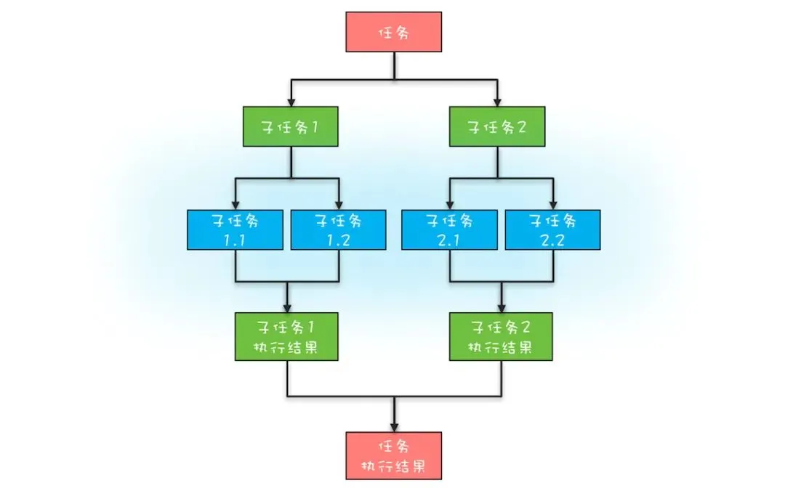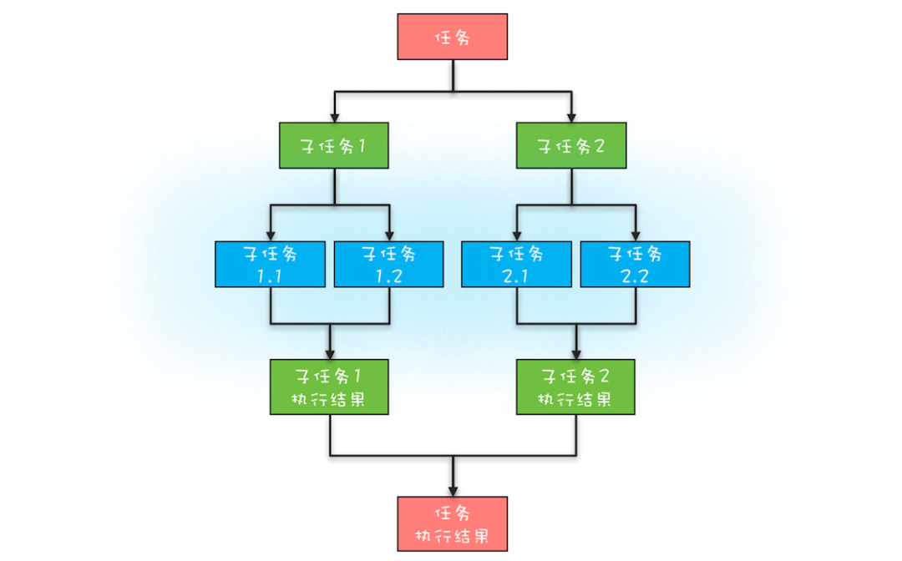

<font style="color:rgb(51, 51, 51);background-color:rgb(248, 246, 244);">在这个分治任务模型里，任务和分解后的子任务具有相似性，这种相似性往往体现在任务和子任务的算法是相同的，但是计算的数据规模是不同的。</font>

<font style="color:rgb(51, 51, 51);background-color:rgb(248, 246, 244);">分治是一种解决复杂问题的思维方法和模式；</font>

<font style="color:rgb(51, 51, 51);background-color:rgb(248, 246, 244);">具体而言，它</font>**<font style="color:rgb(34, 34, 34);background-color:rgb(248, 246, 244);">将一个复杂的问题分解成多个相似的子问题，然后再将这些子问题进一步分解成更小的子问题，直到每个子问题变得足够简单从而可以直接求解。</font>**

<font style="color:rgb(51, 51, 51);background-color:rgb(248, 246, 244);">例如，在算法领域，我们经常使用分治算法来解决问题（如归并排序和快速排序都属于分治算法，二分查找也是一种分治算法）。</font>

<font style="color:rgb(51, 51, 51);background-color:rgb(248, 246, 244);">在大数据领域，MapReduce 计算框架背后的思想也是基于分治。</font>

<font style="color:rgb(51, 51, 51);background-color:rgb(248, 246, 244);">这只是一个简化版本的Fork-Join，实际上我们在日常工作中的应用可能比这要复杂很多。但是基本原理类似。</font>

<font style="color:rgb(51, 51, 51);background-color:rgb(248, 246, 244);">这样就将一个大的任务，通过fork方法不断拆解，直到能够计算为止，之后，再将这些结果用join合并。</font>

<font style="color:rgb(51, 51, 51);background-color:rgb(248, 246, 244);">这样逐次递归，就得到了我们想要的结果。这就是再ForkJoinPool中的分治法。</font>

### **<font style="color:rgb(34, 34, 34);background-color:rgb(248, 246, 244);">工作窃取</font>**
<font style="color:rgb(51, 51, 51);background-color:rgb(248, 246, 244);">从上述Fork/Join 框架的描述可以看出，我们需要一些线程来执行 Fork 出的任务，在实际中，如果每次都创建新的线程执行任务，对系统资源的开销会很大，所以 Fork/Join框架利用了线程池来调度任务。</font>

<font style="color:rgb(51, 51, 51);background-color:rgb(248, 246, 244);">既然由线程池调度，根据我们之前学习线程池的经验，必然存在两个要素：</font>

+ <font style="color:rgb(51, 51, 51);background-color:rgb(248, 246, 244);">工作线程</font>
+ <font style="color:rgb(51, 51, 51);background-color:rgb(248, 246, 244);">任务队列</font>

<font style="color:rgb(51, 51, 51);background-color:rgb(248, 246, 244);">一般的线程池只有一个任务队列，但是对于 Fork/Join 框架来说，由于 Fork 出的各个子任务其实是平行关系，为了提高效率，减少线程竞争，应该将这些平行的任务放到不同的队列中去。</font>

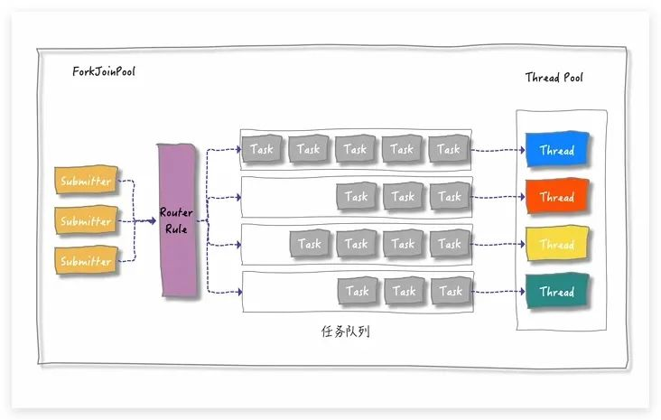

**<font style="color:rgb(34, 34, 34);background-color:rgb(248, 246, 244);">“</font>**

<font style="color:rgb(100, 100, 100);background-color:rgb(248, 246, 244);">Chaya：有的线程执行比较快，如何提高效率让闲着去抢任务呢？</font>

<font style="color:rgb(51, 51, 51);background-color:rgb(248, 246, 244);">由于线程处理不同任务的速度不同，这样就可能存在某个线程先执行完了自己队列中的任务的情况，这时为了提升效率，我们可以让该线程去“窃取”其它任务队列中的任务，这就是所谓的</font>**<font style="color:rgb(34, 34, 34);background-color:rgb(248, 246, 244);">工作窃取算法</font>**<font style="color:rgb(51, 51, 51);background-color:rgb(248, 246, 244);">。</font>

<font style="color:rgb(51, 51, 51);background-color:rgb(248, 246, 244);">当工作线程空闲时，它可以从其他工作线程的任务队列中"窃取"任务。</font>

<font style="color:rgb(51, 51, 51);background-color:rgb(248, 246, 244);">以充分利用工作线程的计算能力，减少线程由于获取不到任务而造成的空闲浪费。</font>

<font style="color:rgb(51, 51, 51);background-color:rgb(248, 246, 244);">在ForkJoinPool中，工作任务的队列都采用双端队列Deque容器。</font>

<font style="color:rgb(51, 51, 51);background-color:rgb(248, 246, 244);">在通常使用队列的过程中，我们都在队尾插入，而在队头消费以实现FIFO。</font>

<font style="color:rgb(51, 51, 51);background-color:rgb(248, 246, 244);">而为了实现工作窃取。一般我们会改成工作线程在工作队列上LIFO，而窃取其他线程的任务的时候，从队列头部取获取。示意图如下：</font>

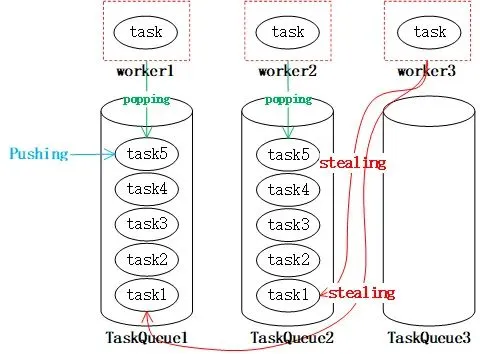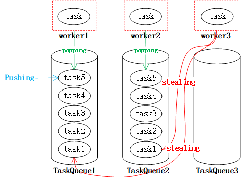

<font style="color:rgb(51, 51, 51);background-color:rgb(248, 246, 244);">工作线程worker1、worker2以及worker3都从taskQueue的尾部popping获取task，而任务也从尾部Pushing，当worker3队列中没有任务的时候，就会从其他线程的队列中取stealing，这样就使得worker3不会由于没有任务而空闲。</font>

<font style="color:rgb(51, 51, 51);background-color:rgb(248, 246, 244);">时序图如下：</font>

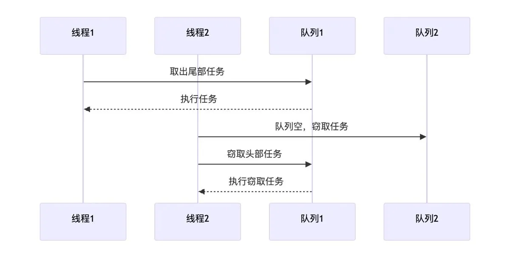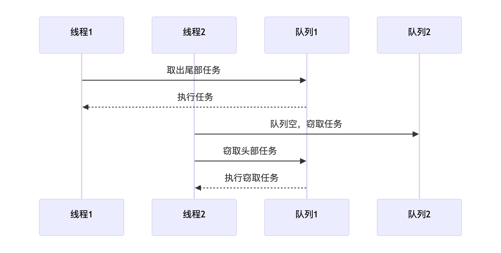

### **<font style="color:rgb(34, 34, 34);background-color:rgb(248, 246, 244);">案例</font>**
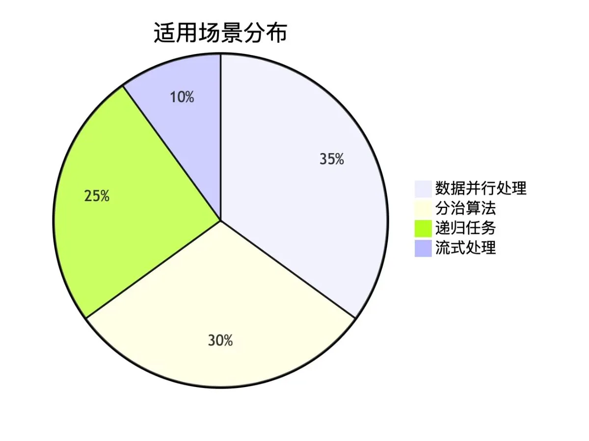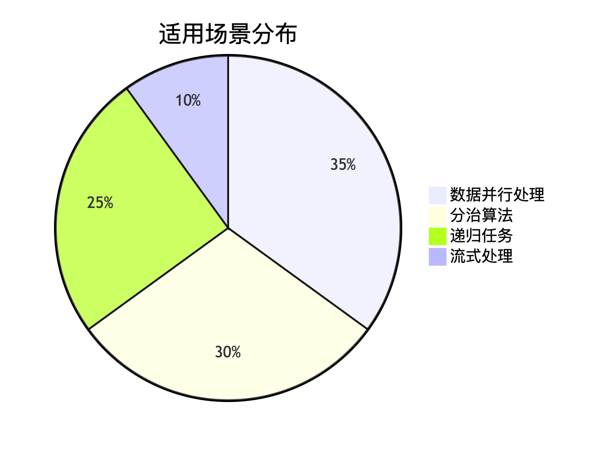

+ **<font style="color:rgb(34, 34, 34);background-color:rgb(248, 246, 244);">大数据处理</font>**<font style="color:rgb(51, 51, 51);background-color:rgb(248, 246, 244);">：数组排序、矩阵运算（参考案例：百万级数据求和效率提升 3 倍）</font>
+ **<font style="color:rgb(34, 34, 34);background-color:rgb(248, 246, 244);">分治算法</font>**<font style="color:rgb(51, 51, 51);background-color:rgb(248, 246, 244);">：快速排序、归并排序、斐波那契数列计算。</font>
+ **<font style="color:rgb(34, 34, 34);background-color:rgb(248, 246, 244);">并行流基础</font>**<font style="color:rgb(51, 51, 51);background-color:rgb(248, 246, 244);">：Java 8 的parallelStream()底层实现。</font>

**<font style="color:rgb(34, 34, 34);background-color:rgb(248, 246, 244);">大数据集并行处理</font>**

<font style="color:rgb(51, 51, 51);background-color:rgb(248, 246, 244);">处理百万级数据聚合、矩阵运算等可拆分任务。</font>

<font style="color:rgb(51, 51, 51);background-color:rgb(248, 246, 244);">假设：我们要计算 1 到 1 亿的和，为了加快计算的速度，我们自然想到算法中的分治原理，将 1 亿个数字分成 1 万个任务，每个任务计算 1 万个数值的综合，利用 CPU 的并发计算性能缩短计算时间。</font>

<font style="color:rgb(51, 51, 51);background-color:rgb(248, 246, 244);">定义一个 Calculator 接口，表示计算数字总和这个动作，如下所示。</font>

```java
public interface Calculator {
     /**
      * 把传进来的所有numbers 做求和处理
      *
      * @param numbers
      * @return 总和
      */
     long sumUp(long[] numbers);
 }
```

<font style="color:rgb(51, 51, 51);background-color:rgb(248, 246, 244);">ForkJoinCalculator 实现 Calculator 接口，内部类 SumTask 继承 RecursiveTask 抽象类，并在 compute 方法中定义拆分逻辑及计算。</font>

<font style="color:rgb(51, 51, 51);background-color:rgb(248, 246, 244);">最后在 sumUp 方法中调用 pool 方法进行计算。</font>

```csharp
public class ForkJoinCalculator implements Calculator {

     private ForkJoinPool pool;

     // 1. 定义计算逻辑
     private static class SumTask extends RecursiveTask<Long> {
         private long[] numbers;
         private int from;
         private int to;

         public SumTask(long[] numbers, int from, int to) {
             this.numbers = numbers;
             this.from = from;
             this.to = to;
         }

         //此方法为ForkJoin的核心方法：对任务进行拆分  拆分的好坏决定了效率的高低
         @Override
         protected Long compute() {

             // 当需要计算的数字个数小于6时，直接采用for loop方式计算结果
             if (to - from < 6) {
                 long total = 0;
                 for (int i = from; i <= to; i++) {
                     total += numbers[i];
                 }
                 return total;
             } else {
                 // 否则，把任务一分为二，递归拆分(注意此处有递归)到底拆分成多少分 需要根据具体情况而定
                 int middle = (from + to) / 2;
                 SumTask taskLeft = new SumTask(numbers, from, middle);
                 SumTask taskRight = new SumTask(numbers, middle + 1, to);
                 taskLeft.fork();
                 taskRight.fork();
                 return taskLeft.join() + taskRight.join();
             }
         }
     }

     public ForkJoinCalculator() {
         // 也可以使用公用的线程池 ForkJoinPool.commonPool()：
         // pool = ForkJoinPool.commonPool()
         pool = new ForkJoinPool();
     }

     @Override
     public long sumUp(long[] numbers) {
         Long result = pool.invoke(new SumTask(numbers, 0, numbers.length - 1));
         pool.shutdown();
         return result;
     }
 }
```

### **<font style="color:rgb(34, 34, 34);background-color:rgb(248, 246, 244);">实现原理</font>**
<font style="color:rgb(51, 51, 51);background-color:rgb(248, 246, 244);">ForkJoinPool 作为 Executors 框架的一员，从外部看与其它线程池并没有什么区别，仅仅是 ExecutorService 的一个实现类。</font>

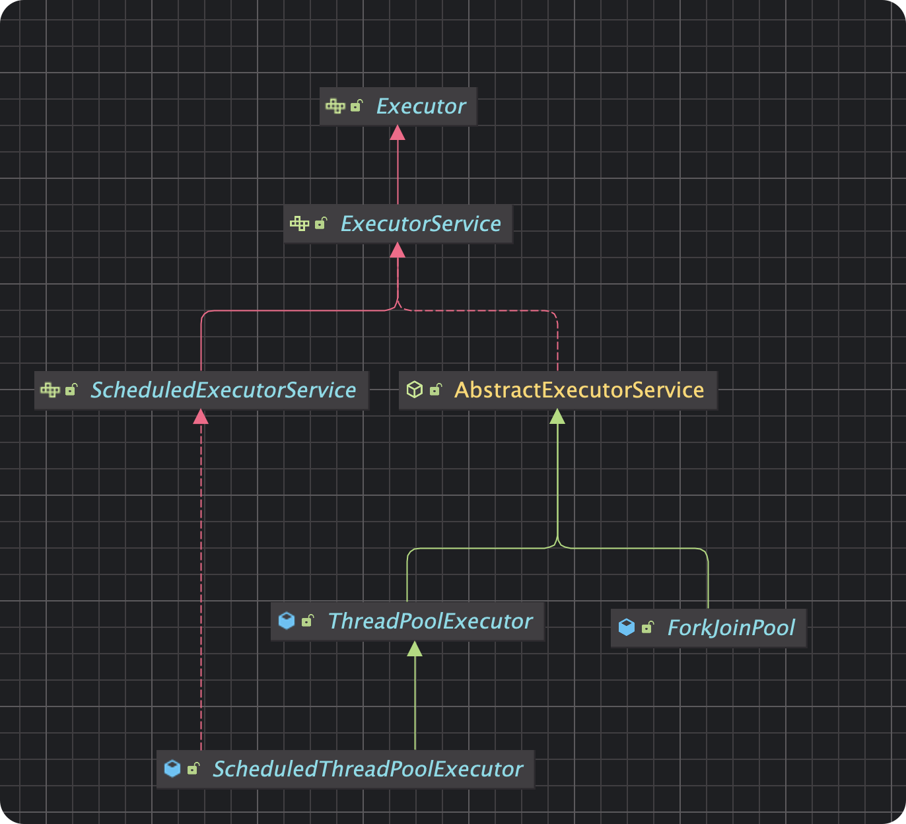

<font style="color:rgb(51, 51, 51);background-color:rgb(248, 246, 244);">在JUC中，实现Fork-join框架有两个类，分别是ForkJoinPool以及提交的任务抽象类ForkJoinTask。</font>

<font style="color:rgb(51, 51, 51);background-color:rgb(248, 246, 244);">通常情况下我们都是直接继承ForkJoinTask的子类，Fork/Join框架提供了两个子类：</font>

+ <font style="color:rgb(51, 51, 51);background-color:rgb(248, 246, 244);">RecursiveAction：一个递归无结果的ForkJoinTask（没有返回值）任务</font>
+ <font style="color:rgb(51, 51, 51);background-color:rgb(248, 246, 244);">RecursiveTask：一个递归有结果的ForkJoinTask（有返回值）任务</font>

<font style="color:rgb(51, 51, 51);background-color:rgb(248, 246, 244);">ForkJoinPool 的主要工作如下：</font>

1. <font style="color:rgb(51, 51, 51);background-color:rgb(248, 246, 244);">接受外部任务的提交（外部调用 ForkJoinPool 的invoke/execute/submit方法提交任务）；</font>
2. <font style="color:rgb(51, 51, 51);background-color:rgb(248, 246, 244);">接受 ForkJoinTask 自身</font>**<font style="color:rgb(34, 34, 34);background-color:rgb(248, 246, 244);">fork</font>**<font style="color:rgb(51, 51, 51);background-color:rgb(248, 246, 244);">出的子任务的提交；</font>
3. <font style="color:rgb(51, 51, 51);background-color:rgb(248, 246, 244);">任务队列数组（WorkQueue[]）的初始化和管理；</font>
4. <font style="color:rgb(51, 51, 51);background-color:rgb(248, 246, 244);">工作线程（Worker）的创建/管理。</font>

<font style="color:rgb(51, 51, 51);background-color:rgb(248, 246, 244);">核心类关系图。</font>

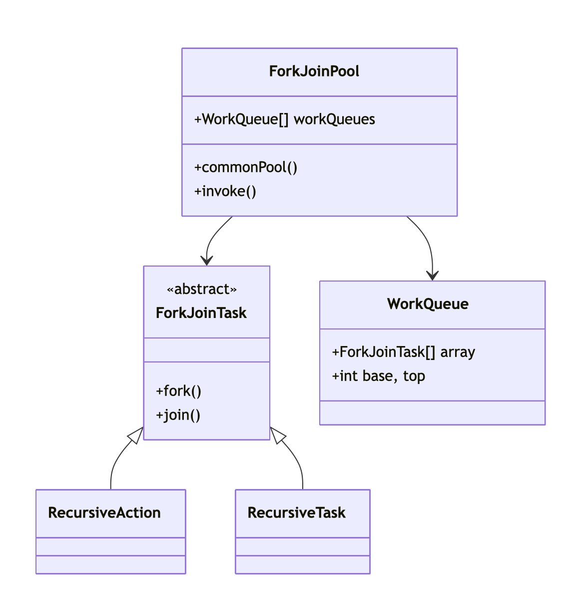

+ **<font style="color:rgb(34, 34, 34);background-color:rgb(248, 246, 244);">ForkJoinPool</font>**<font style="color:rgb(51, 51, 51);background-color:rgb(248, 246, 244);">：ExecutorService 的实现类，负责工作线程的管理、任务队列的维护，以及控制整个任务调度流程；</font>
+ **<font style="color:rgb(34, 34, 34);background-color:rgb(248, 246, 244);">ForkJoinTask</font>**<font style="color:rgb(51, 51, 51);background-color:rgb(248, 246, 244);">：Future 接口的实现类，fork 是其核心方法，用于分解任务并异步执行；而 join 方法在任务结果计算完毕之后才会运行，用来合并或返回计算结果；</font>
+ **<font style="color:rgb(34, 34, 34);background-color:rgb(248, 246, 244);">ForkJoinWorkerThread</font>**<font style="color:rgb(51, 51, 51);background-color:rgb(248, 246, 244);">：Thread 的子类，作为线程池中的工作线程（Worker）执行任务；</font>
+ **<font style="color:rgb(34, 34, 34);background-color:rgb(248, 246, 244);">WorkQueue</font>**<font style="color:rgb(51, 51, 51);background-color:rgb(248, 246, 244);">：任务队列，用于保存任务；</font>

**<font style="color:rgb(34, 34, 34);background-color:rgb(248, 246, 244);">“</font>**

<font style="color:rgb(100, 100, 100);background-color:rgb(248, 246, 244);">ForkJoinPool 提供了 3 类外部提交任务的方法：</font>**<font style="color:rgb(34, 34, 34);background-color:rgb(248, 246, 244);">invoke</font>**<font style="color:rgb(100, 100, 100);background-color:rgb(248, 246, 244);">、</font>**<font style="color:rgb(34, 34, 34);background-color:rgb(248, 246, 244);">execute</font>**<font style="color:rgb(100, 100, 100);background-color:rgb(248, 246, 244);">、</font>**<font style="color:rgb(34, 34, 34);background-color:rgb(248, 246, 244);">submit</font>**<font style="color:rgb(100, 100, 100);background-color:rgb(248, 246, 244);">，它们的主要区别在于任务的执行方式上。</font>

+ <font style="color:rgb(51, 51, 51);background-color:rgb(248, 246, 244);">通过</font>**<font style="color:rgb(34, 34, 34);background-color:rgb(248, 246, 244);">invoke</font>**<font style="color:rgb(51, 51, 51);background-color:rgb(248, 246, 244);">方法提交的任务，调用线程直到任务执行完成才会返回，也就是说这是一个</font>**<font style="color:rgb(34, 34, 34);background-color:rgb(248, 246, 244);">同步</font>**<font style="color:rgb(51, 51, 51);background-color:rgb(248, 246, 244);">方法，且</font>**<font style="color:rgb(34, 34, 34);background-color:rgb(248, 246, 244);">有返回结果</font>**<font style="color:rgb(51, 51, 51);background-color:rgb(248, 246, 244);">；</font>
+ <font style="color:rgb(51, 51, 51);background-color:rgb(248, 246, 244);">通过</font>**<font style="color:rgb(34, 34, 34);background-color:rgb(248, 246, 244);">execute</font>**<font style="color:rgb(51, 51, 51);background-color:rgb(248, 246, 244);">方法提交的任务，调用线程会立即返回，也就是说这是一个</font>**<font style="color:rgb(34, 34, 34);background-color:rgb(248, 246, 244);">异步</font>**<font style="color:rgb(51, 51, 51);background-color:rgb(248, 246, 244);">方法，且</font>**<font style="color:rgb(34, 34, 34);background-color:rgb(248, 246, 244);">没有返回结果</font>**<font style="color:rgb(51, 51, 51);background-color:rgb(248, 246, 244);">；</font>
+ <font style="color:rgb(51, 51, 51);background-color:rgb(248, 246, 244);">通过</font>**<font style="color:rgb(34, 34, 34);background-color:rgb(248, 246, 244);">submit</font>**<font style="color:rgb(51, 51, 51);background-color:rgb(248, 246, 244);">方法提交的任务，调用线程会立即返回，也就是说这是一个</font>**<font style="color:rgb(34, 34, 34);background-color:rgb(248, 246, 244);">异步</font>**<font style="color:rgb(51, 51, 51);background-color:rgb(248, 246, 244);">方法，且</font>**<font style="color:rgb(34, 34, 34);background-color:rgb(248, 246, 244);">有返回结果</font>**<font style="color:rgb(51, 51, 51);background-color:rgb(248, 246, 244);">（返回 Future 实现类，可以通过 get 获取结果）。</font>

<font style="color:rgb(51, 51, 51);background-color:rgb(248, 246, 244);">ForkJoinPool 对象的构建有两种方式：</font>

1. <font style="color:rgb(51, 51, 51);background-color:rgb(248, 246, 244);">通过 3 种构造器的任意一种进行构造；</font>
2. <font style="color:rgb(51, 51, 51);background-color:rgb(248, 246, 244);">通过ForkJoinPool.commonPool()静态方法构造。</font>

**<font style="color:rgb(34, 34, 34);background-color:rgb(248, 246, 244);">“</font>**

<font style="color:rgb(100, 100, 100);background-color:rgb(248, 246, 244);">JDK8 以后，ForkJoinPool 又提供了一个静态方法 commonPool()，这个方法返回一个 ForkJoinPool 内部声明的静态 ForkJoinPool 实例，主要是为了简化线程池的构建，这个 ForkJoinPool 实例可以满足大多数的使用场景。</font>

```csharp
public static ForkJoinPool commonPool() {
     // assert common != null : "static init error";
     return common;
 }
```

**<font style="color:rgb(34, 34, 34);background-color:rgb(248, 246, 244);">ForkJoinTask</font>**

<font style="color:rgb(51, 51, 51);background-color:rgb(248, 246, 244);">从 Fork/Join 框架的描述上来看，“任务”必须要满足一定的条件：</font>

1. <font style="color:rgb(51, 51, 51);background-color:rgb(248, 246, 244);">支持 Fork，即任务自身的分解</font>
2. <font style="color:rgb(51, 51, 51);background-color:rgb(248, 246, 244);">支持 Join，即任务结果的合并</font>

<font style="color:rgb(51, 51, 51);background-color:rgb(248, 246, 244);">因此，J.U.C 提供了一个抽象类——</font>**<font style="color:rgb(34, 34, 34);background-color:rgb(248, 246, 244);">ForkJoinTask</font>**<font style="color:rgb(51, 51, 51);background-color:rgb(248, 246, 244);">，来作为该类 Fork/Join 任务的抽象定义：</font>

```plain
public abstract class ForkJoinTask<V> implements Future<V>, Serializable {
}
```

<font style="color:rgb(51, 51, 51);background-color:rgb(248, 246, 244);">ForkJoinTask 实现了 Future 接口，是一个异步任务，我们在使用 Fork/Join 框架时，一般需要使用线程池来调度任务，线程池内部调度的其实都是 ForkJoinTask 任务（即使提交的是一个 Runnable 或 Callable 任务，也会被适配成 ForkJoinTask）。</font>

<font style="color:rgb(51, 51, 51);background-color:rgb(248, 246, 244);">除了 ForkJoinTask，Fork/Join 框架还提供了两个它的抽象实现，我们在自定义 ForkJoin 任务时，一般继承这两个类：</font>

+ **<font style="color:rgb(34, 34, 34);background-color:rgb(248, 246, 244);">RecursiveAction</font>**<font style="color:rgb(51, 51, 51);background-color:rgb(248, 246, 244);">：表示具有返回结果的 ForkJoin 任务</font>
+ **<font style="color:rgb(34, 34, 34);background-color:rgb(248, 246, 244);">RecursiveTask</font>**<font style="color:rgb(51, 51, 51);background-color:rgb(248, 246, 244);">：表示没有返回结果的 ForkJoin 任务</font>

```csharp
public abstract class RecursiveAction extends ForkJoinTask<Void> {
    /**
     * 该任务的执行,子类覆写该方法
     */
    protected abstract void compute();

    public final Void getRawResult() { return null; }

    protected final void setRawResult(Void mustBeNull) { }

    protected final boolean exec() {
        compute();
        return true;
    }
}
```

```csharp
public abstract class RecursiveTask<V> extends ForkJoinTask<V> {

    /**
     * 该任务的执行结果.
     */
    V result;

    /**
     * 该任务的执行,子类覆写该方法
     */
    protected abstract V compute();

    public final V getRawResult() {
        return result;
    }

    protected final void setRawResult(V value) {
        result = value;
    }

    protected final boolean exec() {
        result = compute();
        return true;
    }

}
```

**<font style="color:rgb(34, 34, 34);background-color:rgb(248, 246, 244);">ForkJoinWorkerThread</font>**

<font style="color:rgb(51, 51, 51);background-color:rgb(248, 246, 244);">Fork/Join 框架中，每个工作线程（Worker）都有一个自己的任务队列（WorkerQueue）， 所以需要对一般的 Thread 做些特性化处理，J.U.C 提供了</font>**<font style="color:rgb(34, 34, 34);background-color:rgb(248, 246, 244);">ForkJoinWorkerThread</font>**<font style="color:rgb(51, 51, 51);background-color:rgb(248, 246, 244);">类作为 ForkJoinPool 中的工作线程：</font>

```kotlin
public class ForkJoinWorkerThread extends Thread {

    final ForkJoinPool pool;                    // 该工作线程归属的线程池
    final ForkJoinPool.WorkQueue workQueue;     // 对应的任务队列

    protected ForkJoinWorkerThread(ForkJoinPool pool) {
        super("aForkJoinWorkerThread");         // 指定工作线程名称
        this.pool = pool;
        this.workQueue = pool.registerWorker(this);
    }

    // ...
}
```

<font style="color:rgb(51, 51, 51);background-color:rgb(248, 246, 244);">ForkJoinWorkerThread 在构造过程中，会保存</font>**<font style="color:rgb(34, 34, 34);background-color:rgb(248, 246, 244);">所属线程池</font>**<font style="color:rgb(51, 51, 51);background-color:rgb(248, 246, 244);">信息和与自己</font>**<font style="color:rgb(34, 34, 34);background-color:rgb(248, 246, 244);">绑定的任务队列</font>**<font style="color:rgb(51, 51, 51);background-color:rgb(248, 246, 244);">信息。同时，它会通过 ForkJoinPool 的registerWorker方法将自己注册到线程池中。</font>

<font style="color:rgb(51, 51, 51);background-color:rgb(248, 246, 244);">线程池中的每个工作线程（ForkJoinWorkerThread）都有一个自己的任务队列（WorkQueue），工作线程优先处理自身队列中的任务（LIFO 或 FIFO 顺序，由线程池构造时的参数 mode 决定），自身队列为空时，以 FIFO 的顺序随机窃取其它队列中的任务。</font>

**<font style="color:rgb(34, 34, 34);background-color:rgb(248, 246, 244);">WorkQueue</font>**

<font style="color:rgb(51, 51, 51);background-color:rgb(248, 246, 244);">任务队列（</font>**<font style="color:rgb(34, 34, 34);background-color:rgb(248, 246, 244);">WorkQueue</font>**<font style="color:rgb(51, 51, 51);background-color:rgb(248, 246, 244);">）是 ForkJoinPool 与其它线程池区别最大的地方，在 ForkJoinPool 内部，维护着一个WorkQueue[]数组.</font>

**<font style="color:rgb(34, 34, 34);background-color:rgb(248, 246, 244);">WorkQueue</font>**<font style="color:rgb(51, 51, 51);background-color:rgb(248, 246, 244);">作为 ForkJoinPool 的内部类，表示一个</font>**<font style="color:rgb(34, 34, 34);background-color:rgb(248, 246, 244);">双端队列</font>**<font style="color:rgb(51, 51, 51);background-color:rgb(248, 246, 244);">。双端队列既可以作为</font>**<font style="color:rgb(34, 34, 34);background-color:rgb(248, 246, 244);">栈</font>**<font style="color:rgb(51, 51, 51);background-color:rgb(248, 246, 244);">使用(LIFO)，也可以作为</font>**<font style="color:rgb(34, 34, 34);background-color:rgb(248, 246, 244);">队列</font>**<font style="color:rgb(51, 51, 51);background-color:rgb(248, 246, 244);">使用(FIFO)。</font>

<font style="color:rgb(51, 51, 51);background-color:rgb(248, 246, 244);">ForkJoinPool 的“工作窃取”正是利用了这个特点，当工作线程从自己的队列中获取任务时，</font>**<font style="color:rgb(34, 34, 34);background-color:rgb(248, 246, 244);">默认</font>**<font style="color:rgb(51, 51, 51);background-color:rgb(248, 246, 244);">总是以栈操作（LIFO）的方式从栈顶取任务；当工作线程尝试窃取其它任务队列中的任务时，则是 FIFO 的方式。</font>

### **<font style="color:rgb(34, 34, 34);background-color:rgb(248, 246, 244);">任务调度流程</font>**
**<font style="color:rgb(34, 34, 34);background-color:rgb(248, 246, 244);">“</font>**

<font style="color:rgb(100, 100, 100);background-color:rgb(248, 246, 244);">Fork/Join 框架的任务调度流程是什么样的?</font>

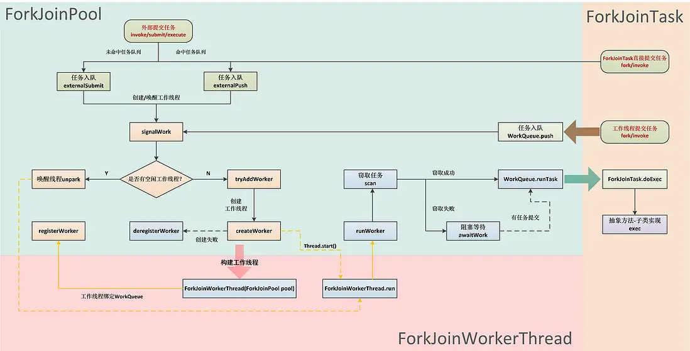

**<font style="color:rgb(34, 34, 34);background-color:rgb(248, 246, 244);">任务提交</font>**

<font style="color:rgb(51, 51, 51);background-color:rgb(248, 246, 244);">任务提交是整个调度流程的第一步，有两种：</font>

+ <font style="color:rgb(51, 51, 51);background-color:rgb(248, 246, 244);">外部提交：通过</font>**<font style="color:rgb(34, 34, 34);background-color:rgb(248, 246, 244);">ForkJoinPool</font>**<font style="color:rgb(51, 51, 51);background-color:rgb(248, 246, 244);">的execute/submit/invoke方法提交的任务，或者非工作线程（</font>**<font style="color:rgb(34, 34, 34);background-color:rgb(248, 246, 244);">ForkJoinWorkerThread</font>**<font style="color:rgb(51, 51, 51);background-color:rgb(248, 246, 244);">）直接调用</font>**<font style="color:rgb(34, 34, 34);background-color:rgb(248, 246, 244);">ForkJoinTask</font>**<font style="color:rgb(51, 51, 51);background-color:rgb(248, 246, 244);">的fork/invoke方法提交的任务。</font>
+ <font style="color:rgb(51, 51, 51);background-color:rgb(248, 246, 244);">工作线程 fork 任务：由 ForkJoinPool 所维护的工作线程（ForkJoinWorkerThread）从自身任务队列中获取任务（或从其它任务队列窃取），然后执行任务。</font>

**<font style="color:rgb(34, 34, 34);background-color:rgb(248, 246, 244);">创建工作线程</font>**

<font style="color:rgb(51, 51, 51);background-color:rgb(248, 246, 244);">任务提交完成后，ForkJoinPool 会根据情况创建或唤醒工作线程，以便执行任务。</font>

<font style="color:rgb(51, 51, 51);background-color:rgb(248, 246, 244);">ForkJoinPool 并不会为每个任务都创建工作线程，而是根据实际情况（构造线程池时的参数）确定是唤醒已有空闲工作线程，还是新建工作线程。</font>

<font style="color:rgb(51, 51, 51);background-color:rgb(248, 246, 244);">个过程还是涉及任务队列的绑定、工作线程的注销等过程：</font>

+ <font style="color:rgb(51, 51, 51);background-color:rgb(248, 246, 244);">ForkJoinPool.signalWork</font>
+ <font style="color:rgb(51, 51, 51);background-color:rgb(248, 246, 244);">ForkJoinPool.tryAddWorker</font>
+ <font style="color:rgb(51, 51, 51);background-color:rgb(248, 246, 244);">ForkJoinPool.createWorker</font>
+ <font style="color:rgb(51, 51, 51);background-color:rgb(248, 246, 244);">ForkJoinWorkerThread.registerWorker</font>
+ <font style="color:rgb(51, 51, 51);background-color:rgb(248, 246, 244);">ForkJoinPool.deregisterWorker</font>

**<font style="color:rgb(34, 34, 34);background-color:rgb(248, 246, 244);">任务执行</font>**

<font style="color:rgb(51, 51, 51);background-color:rgb(248, 246, 244);">任务入队后，由工作线程开始执行，这个过程涉及任务窃取、工作线程等待等过程：</font>

+ <font style="color:rgb(51, 51, 51);background-color:rgb(248, 246, 244);">ForkJoinWorkerThread.run</font>
+ <font style="color:rgb(51, 51, 51);background-color:rgb(248, 246, 244);">ForkJoinPool.runWorker</font>
+ <font style="color:rgb(51, 51, 51);background-color:rgb(248, 246, 244);">ForkJoinPool.scan</font>
+ <font style="color:rgb(51, 51, 51);background-color:rgb(248, 246, 244);">ForkJoinPool.runTask</font>
+ <font style="color:rgb(51, 51, 51);background-color:rgb(248, 246, 244);">ForkJoinTask.doExec</font>
+ <font style="color:rgb(51, 51, 51);background-color:rgb(248, 246, 244);">ForkJoinPool.execLocalTasks</font>
+ <font style="color:rgb(51, 51, 51);background-color:rgb(248, 246, 244);">ForkJoinPool.awaitWork</font>

**<font style="color:rgb(34, 34, 34);background-color:rgb(248, 246, 244);">任务结果获取</font>**

<font style="color:rgb(51, 51, 51);background-color:rgb(248, 246, 244);">任务结果一般通过</font>**<font style="color:rgb(34, 34, 34);background-color:rgb(248, 246, 244);">ForkJoinTask</font>**<font style="color:rgb(51, 51, 51);background-color:rgb(248, 246, 244);">的join方法获得，其主要流程如下图：</font>

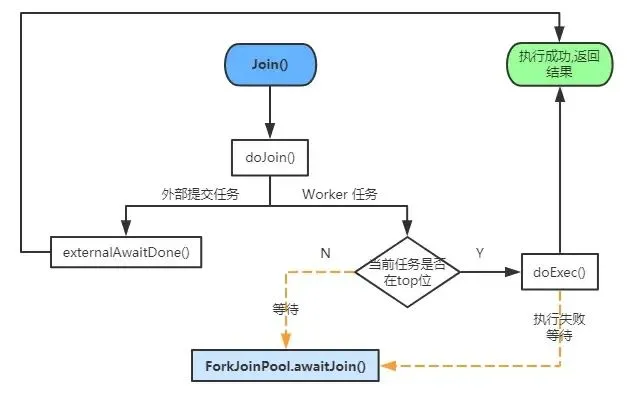

<font style="color:rgb(51, 51, 51);background-color:rgb(248, 246, 244);">任务结果获取的核心涉及两点：</font>

+ <font style="color:rgb(51, 51, 51);background-color:rgb(248, 246, 244);">互助窃取：ForkJoinPool.helpStealer</font>
+ <font style="color:rgb(51, 51, 51);background-color:rgb(248, 246, 244);">算力补偿：ForkJoinPool.tryCompensate</font>

<font style="color:rgb(51, 51, 51);background-color:rgb(248, 246, 244);">可以总结为以下几点：</font>

1. <font style="color:rgb(51, 51, 51);background-color:rgb(248, 246, 244);">每个 Worker 线程利用它自己的任务队列维护可执行任务；</font>
2. <font style="color:rgb(51, 51, 51);background-color:rgb(248, 246, 244);">任务队列是一种双端队列，支持 LIFO 的</font>**<font style="color:rgb(34, 34, 34);background-color:rgb(248, 246, 244);">push</font>**<font style="color:rgb(51, 51, 51);background-color:rgb(248, 246, 244);">和</font>**<font style="color:rgb(34, 34, 34);background-color:rgb(248, 246, 244);">pop</font>**<font style="color:rgb(51, 51, 51);background-color:rgb(248, 246, 244);">操作，也支持 FIFO 的</font>**<font style="color:rgb(34, 34, 34);background-color:rgb(248, 246, 244);">take</font>**<font style="color:rgb(51, 51, 51);background-color:rgb(248, 246, 244);">操作；</font>
3. <font style="color:rgb(51, 51, 51);background-color:rgb(248, 246, 244);">任务 fork 的子任务，只会 push 到它所在线程（调用 fork 方法的线程）的队列；</font>
4. <font style="color:rgb(51, 51, 51);background-color:rgb(248, 246, 244);">工作线程既可以使用 LIFO 通过 pop 处理自己队列中的任务，也可以 FIFO 通过 poll 处理自己队列中的任务，具体取决于构造线程池时的 asyncMode 参数；</font>
5. <font style="color:rgb(51, 51, 51);background-color:rgb(248, 246, 244);">当工作线程自己队列中没有待处理任务时，它尝试去随机读取（窃取）其它任务队列的 base 端的任务；</font>
6. <font style="color:rgb(51, 51, 51);background-color:rgb(248, 246, 244);">当线程进入 join 操作，它也会去处理其它工作线程的队列中的任务（自己的已经处理完了），直到目标任务完成（通过 isDone 方法）；</font>
7. <font style="color:rgb(51, 51, 51);background-color:rgb(248, 246, 244);">当一个工作线程没有任务了，并且尝试从其它队列窃取也失败了，它让出资源（通过使用 yields, sleeps 或者其它优先级调整）并且随后会再次激活，直到所有工作线程都空闲了——此时，它们都阻塞在等待另一个顶层线程的调用。</font>


> 更新: 2025-09-01 11:40:08  
> 原文: <https://www.yuque.com/yuqueyonghue6cvnv/cxhfwd/ligs3ou9nmfydve3>