# 039|Kafka 为何可以支持百万并发？它的架构是怎样的？

<font style="color:rgb(51, 51, 51);background-color:rgb(248, 246, 244);">你好，我是《Redis 高手心法》作者，可以叫我码哥，手拿菜刀砍电线，一路火花带闪电的靓仔。</font>

<font style="color:rgb(51, 51, 51);background-color:rgb(248, 246, 244);">那 Kafka 的架构是怎样的？又是怎么做到其吞吐量动辄几十上百万的呢？</font>

1. <font style="color:rgb(51, 51, 51);background-color:rgb(248, 246, 244);">Kafka I/O 模型拆解；</font>
2. <font style="color:rgb(51, 51, 51);background-color:rgb(248, 246, 244);">零拷贝技术的运用；</font>
3. <font style="color:rgb(51, 51, 51);background-color:rgb(248, 246, 244);">Kakfa 架构设计和负载均衡；  
</font>
    1. <font style="color:rgb(51, 51, 51);background-color:rgb(248, 246, 244);">Kafka 架构</font>
    2. <font style="color:rgb(51, 51, 51);background-color:rgb(248, 246, 244);">Topic 实现原理</font>
    3. <font style="color:rgb(51, 51, 51);background-color:rgb(248, 246, 244);">partition 水平拓展和负载均衡算法</font>
4. <font style="color:rgb(51, 51, 51);background-color:rgb(248, 246, 244);">分段（Segment）存储消息实现原理</font>
5. <font style="color:rgb(51, 51, 51);background-color:rgb(248, 246, 244);">磁盘顺序写、pageCache</font>
6. <font style="color:rgb(51, 51, 51);background-color:rgb(248, 246, 244);">数据压缩。</font>

## **<font style="color:rgb(34, 34, 34);background-color:rgb(248, 246, 244);">Kafka Reactor I/O 网络模型</font>**
[<font style="color:rgb(177, 75, 67);background-color:rgb(248, 246, 244);">Kafka Reactor I/O 网络模型</font>](https://mp.weixin.qq.com/s?__biz=MzkzMDI1NjcyOQ==&mid=2247503469&idx=1&sn=fc6dea24311b1b5b6d2bf0f6b58673f3&chksm=c27f8c5bf508054df0fad0f0cc3a4cc6d169e35e13a6e04dd624bdd33d7aba2fea9645c718b5&scene=178&cur_album_id=3485080895185338375#rd)<font style="color:rgb(51, 51, 51);background-color:rgb(248, 246, 244);">是一种非阻塞 I/O 模型，利用事件驱动机制来处理网络请求。更多细节详见</font>[<font style="color:rgb(177, 75, 67);background-color:rgb(248, 246, 244);">《Kafka 高性能 7 大秘诀之 Reactor 网络 I/O 模型》</font>](https://mp.weixin.qq.com/s?__biz=MzkzMDI1NjcyOQ==&mid=2247503469&idx=1&sn=fc6dea24311b1b5b6d2bf0f6b58673f3&chksm=c27f8c5bf508054df0fad0f0cc3a4cc6d169e35e13a6e04dd624bdd33d7aba2fea9645c718b5&scene=178&cur_album_id=3485080895185338375#rd)

<font style="color:rgb(51, 51, 51);background-color:rgb(248, 246, 244);">该模型通过 Reactor 模式实现，即一个或多个 I/O 多路复用器（如 Java 的 Selector）监听多个通道的事件，当某个通道准备好进行 I/O 操作时，触发相应的事件处理器进行处理。</font>

<font style="color:rgb(51, 51, 51);background-color:rgb(248, 246, 244);">这种模型在高并发场景下具有很高的效率，能够同时处理大量的网络连接请求，而不需要为每个连接创建一个线程，从而节省系统资源。</font>

<font style="color:rgb(51, 51, 51);background-color:rgb(248, 246, 244);">Reactor 线程模型如图 2 所示。</font>

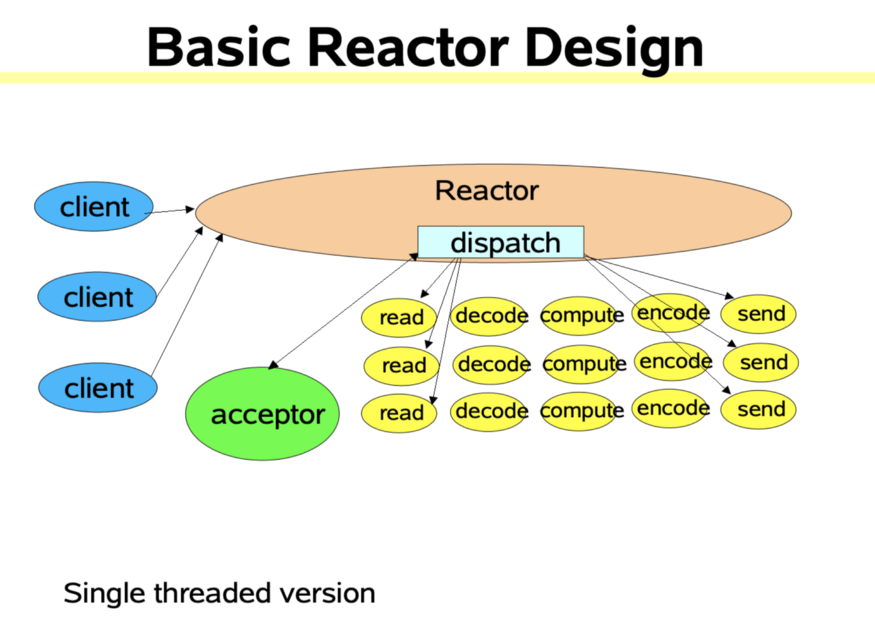

<font style="color:rgb(51, 51, 51);background-color:rgb(248, 246, 244);">图 2</font>

<font style="color:rgb(51, 51, 51);background-color:rgb(248, 246, 244);">Reacotr 模型主要分为三个角色。</font>

+ <font style="color:rgb(51, 51, 51);background-color:rgb(248, 246, 244);">Reactor：把 I/O 事件根据类型分配给分配给对应的 Handler 处理。</font>
+ <font style="color:rgb(51, 51, 51);background-color:rgb(248, 246, 244);">Acceptor：处理客户端连接事件。</font>
+ <font style="color:rgb(51, 51, 51);background-color:rgb(248, 246, 244);">Handler：处理读写等任务。</font>

<font style="color:rgb(51, 51, 51);background-color:rgb(248, 246, 244);">Kafka 基于 Reactor 模型架构如图 3 所示。</font>

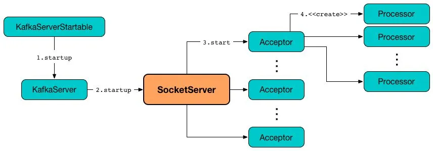

<font style="color:rgb(51, 51, 51);background-color:rgb(248, 246, 244);">图 3</font>

<font style="color:rgb(51, 51, 51);background-color:rgb(248, 246, 244);">Kafka 的网络通信模型基于 NIO（New Input/Output）库，通过 Reactor 模式实现，具体包括以下几个关键组件：</font>

+ **<font style="color:rgb(34, 34, 34);background-color:rgb(248, 246, 244);">SocketServer</font>**<font style="color:rgb(51, 51, 51);background-color:rgb(248, 246, 244);">：管理所有的网络连接，包括初始化 Acceptor 和 Processor 线程。</font>
+ **<font style="color:rgb(34, 34, 34);background-color:rgb(248, 246, 244);">Acceptor</font>**<font style="color:rgb(51, 51, 51);background-color:rgb(248, 246, 244);">：监听客户端的连接请求，并将其分配给 Processor 线程。Acceptor 使用 Java NIO 的 Selector 进行 I/O 多路复用，并注册 OP_ACCEPT 事件来监听新的连接请求。每当有新的连接到达时，Acceptor 会接受连接并创建一个 SocketChannel，然后将其分配给一个 Processor 线程进行处理。</font>
+ **<font style="color:rgb(34, 34, 34);background-color:rgb(248, 246, 244);">Processor</font>**<font style="color:rgb(51, 51, 51);background-color:rgb(248, 246, 244);">：处理具体的 I/O 操作，包括读取客户端请求和写入响应数据。Processor 同样使用 Selector 进行 I/O 多路复用，注册 OP_READ 和 OP_WRITE 事件来处理读写操作。每个 Processor 线程都有一个独立的 Selector，用于管理多个 SocketChannel。</font>
+ **<font style="color:rgb(34, 34, 34);background-color:rgb(248, 246, 244);">RequestChannel</font>**<font style="color:rgb(51, 51, 51);background-color:rgb(248, 246, 244);">：充当 Processor 和请求处理线程之间的缓冲区，存储请求和响应数据。Processor 将读取的请求放入 RequestChannel 的请求队列，而请求处理线程则从该队列中取出请求进行处理。</font>
+ **<font style="color:rgb(34, 34, 34);background-color:rgb(248, 246, 244);">KafkaRequestHandler</font>**<font style="color:rgb(51, 51, 51);background-color:rgb(248, 246, 244);">：请求处理线程，从 RequestChannel 中读取请求，调用 KafkaApis 进行业务逻辑处理，并将响应放回 RequestChannel 的响应队列。KafkaRequestHandler 线程池中的线程数量由配置参数 num.io.threads 决定。</font>

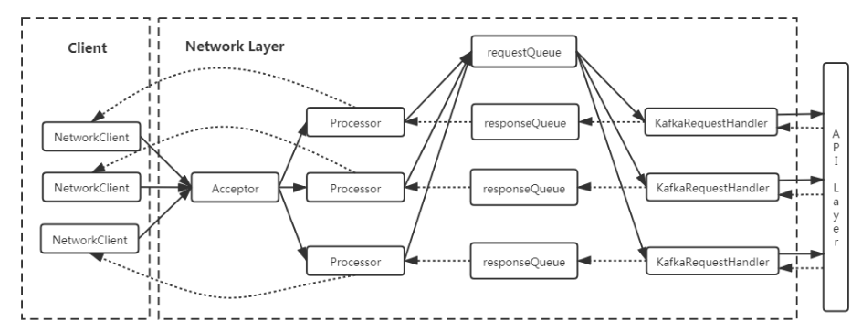

<font style="color:rgb(51, 51, 51);background-color:rgb(248, 246, 244);">图 4</font>

**<font style="color:rgb(34, 34, 34);background-color:rgb(248, 246, 244);">“</font>**

<font style="color:rgb(100, 100, 100);background-color:rgb(248, 246, 244);">Chaya：该模型和如何提高 kafka 的性能和效率？</font>

**<font style="color:rgb(34, 34, 34);background-color:rgb(248, 246, 244);">高并发处理能力</font>**<font style="color:rgb(51, 51, 51);background-color:rgb(248, 246, 244);">：通过 I/O 多路复用机制，Kafka 能够同时处理大量的网络连接请求，而不需要为每个连接创建一个线程，从而节省了系统资源。</font>

**<font style="color:rgb(34, 34, 34);background-color:rgb(248, 246, 244);">低延迟</font>**<font style="color:rgb(51, 51, 51);background-color:rgb(248, 246, 244);">：非阻塞 I/O 操作避免了线程的阻塞等待，使得 I/O 操作能够更快地完成，从而降低了系统的响应延迟。</font>

**<font style="color:rgb(34, 34, 34);background-color:rgb(248, 246, 244);">资源节省</font>**<font style="color:rgb(51, 51, 51);background-color:rgb(248, 246, 244);">：通过减少线程的数量和上下文切换，Kafka 在处理高并发请求时能够更有效地利用 CPU 和内存资源。</font>

**<font style="color:rgb(34, 34, 34);background-color:rgb(248, 246, 244);">扩展性强</font>**<font style="color:rgb(51, 51, 51);background-color:rgb(248, 246, 244);">：Reactor 模式的分层设计使得 Kafka 的网络模块具有很好的扩展性，可以根据需要增加更多的 I/O 线程或调整事件处理器的逻辑。</font>

## **<font style="color:rgb(34, 34, 34);background-color:rgb(248, 246, 244);">零拷贝技术的运用</font>**
<font style="color:rgb(51, 51, 51);background-color:rgb(248, 246, 244);">零拷贝技术是一种计算机操作系统技术，用于在内存和存储设备之间进行数据传输时，避免 CPU 的参与，从而减少 CPU 的负担并提高数据传输效率。详见《</font>[<font style="color:rgb(177, 75, 67);background-color:rgb(248, 246, 244);">Kakfa 高性能架构设计之零拷贝技术的运用</font>](https://mp.weixin.qq.com/s?__biz=MzkzMDI1NjcyOQ==&mid=2247503458&idx=1&sn=c5cf7a30b96abadaf4497a73f27ec219&chksm=c27f8c54f50805420129980d78b5671fc5d0b7fdcfab259d5249598d88aa0bb2224419311e64&scene=178&cur_album_id=3485080895185338375#rd)<font style="color:rgb(51, 51, 51);background-color:rgb(248, 246, 244);">》</font>

<font style="color:rgb(51, 51, 51);background-color:rgb(248, 246, 244);">Kafka 使用零拷贝技术来优化数据传输，特别是在生产者将数据写入 Kafka 和消费者从 Kafka 读取数据的过程中。在 Kafka 中，零拷贝主要通过以下几种方式实现：</font>

+ **<font style="color:rgb(34, 34, 34);background-color:rgb(248, 246, 244);">sendfile() 系统调用</font>**<font style="color:rgb(51, 51, 51);background-color:rgb(248, 246, 244);">：在发送数据时，Kafka 使用操作系统的 sendfile() 系统调用直接将文件从磁盘发送到网络套接字，而无需将数据复制到应用程序的用户空间。这减少了数据复制次数，提高了传输效率。</font>
+ **<font style="color:rgb(34, 34, 34);background-color:rgb(248, 246, 244);">文件内存映射（Memory-Mapped Files）</font>**<font style="color:rgb(51, 51, 51);background-color:rgb(248, 246, 244);">：Kafka 使用文件内存映射技术（mmap），将磁盘上的日志文件映射到内存中，使得读写操作可以在内存中直接进行，无需进行额外的数据复制。</font>

<font style="color:rgb(51, 51, 51);background-color:rgb(248, 246, 244);">比如 Broker 读取磁盘数据并把数据发送给 Consumer 的过程，传统 I/O 经历以下步骤。</font>

1. **<font style="color:rgb(34, 34, 34);background-color:rgb(248, 246, 244);">读取数据</font>**<font style="color:rgb(51, 51, 51);background-color:rgb(248, 246, 244);">：通过read 系统调用将磁盘数据通过 DMA copy 到内核空间缓冲区（Read buffer）。</font>
2. **<font style="color:rgb(34, 34, 34);background-color:rgb(248, 246, 244);">拷贝数据</font>**<font style="color:rgb(51, 51, 51);background-color:rgb(248, 246, 244);">：将数据从内核空间缓冲区（Read buffer） 通过 CPU copy 到用户空间缓冲区（Application buffer）。</font>
3. **<font style="color:rgb(34, 34, 34);background-color:rgb(248, 246, 244);">写入数据</font>**<font style="color:rgb(51, 51, 51);background-color:rgb(248, 246, 244);">：通过write()系统调用将数据从用户空间缓冲区（Application） CPU copy 到内核空间的网络缓冲区（Socket buffer）。</font>
4. **<font style="color:rgb(34, 34, 34);background-color:rgb(248, 246, 244);">发送数据</font>**<font style="color:rgb(51, 51, 51);background-color:rgb(248, 246, 244);">：将内核空间的网络缓冲区（Socket buffer）DMA copy 到网卡目标端口，通过网卡将数据发送到目标主机。</font>

<font style="color:rgb(51, 51, 51);background-color:rgb(248, 246, 244);">这一过程经过的四次 copy 如图 5 所示。</font>

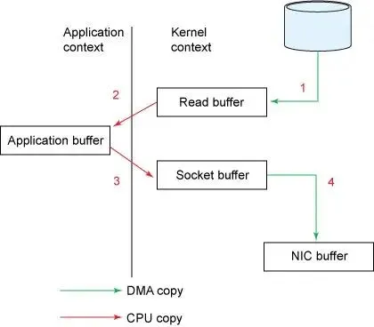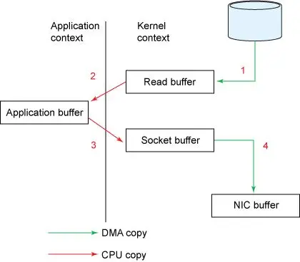

<font style="color:rgb(51, 51, 51);background-color:rgb(248, 246, 244);">图 5</font>

**<font style="color:rgb(34, 34, 34);background-color:rgb(248, 246, 244);">“</font>**

<font style="color:rgb(100, 100, 100);background-color:rgb(248, 246, 244);">Chaya：零拷贝技术如何提高 Kakfa 的性能？</font>

<font style="color:rgb(51, 51, 51);background-color:rgb(248, 246, 244);">零拷贝技术通过减少 CPU 负担和内存带宽消耗，提高了 Kakfa 性能。</font>

+ **<font style="color:rgb(34, 34, 34);background-color:rgb(248, 246, 244);">降低 CPU 使用率</font>**<font style="color:rgb(51, 51, 51);background-color:rgb(248, 246, 244);">：由于数据不需要在内核空间和用户空间之间多次复制，CPU 的参与减少，从而降低了 CPU 使用率，腾出更多的 CPU 资源用于其他任务。</font>
+ **<font style="color:rgb(34, 34, 34);background-color:rgb(248, 246, 244);">提高数据传输速度</font>**<font style="color:rgb(51, 51, 51);background-color:rgb(248, 246, 244);">：直接从磁盘到网络的传输路径减少了中间步骤，使得数据传输更加高效，延迟更低。</font>
+ **<font style="color:rgb(34, 34, 34);background-color:rgb(248, 246, 244);">减少内存带宽消耗</font>**<font style="color:rgb(51, 51, 51);background-color:rgb(248, 246, 244);">：通过减少数据在内存中的复制次数，降低了内存带宽的消耗，使得系统能够处理更多的并发请求。</font>

## **<font style="color:rgb(34, 34, 34);background-color:rgb(248, 246, 244);">Partition 并发和分区负载均衡</font>**
<font style="color:rgb(51, 51, 51);background-color:rgb(248, 246, 244);">在说 Topic patition 分区并发之前，我们先了解下 kafka 架构设计。</font>

### **<font style="color:rgb(34, 34, 34);background-color:rgb(248, 246, 244);">Kafka 架构</font>**
<font style="color:rgb(51, 51, 51);background-color:rgb(248, 246, 244);">一个典型的 Kafka 架构包含以下几个重要组件，如图 6 所示。</font>

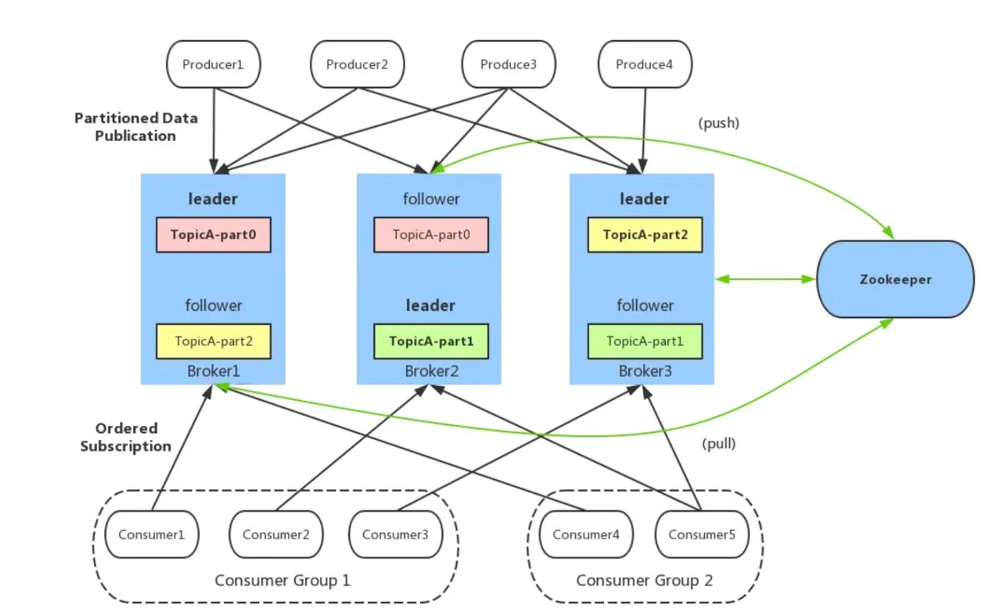

<font style="color:rgb(51, 51, 51);background-color:rgb(248, 246, 244);">图 6</font>

1. **<font style="color:rgb(34, 34, 34);background-color:rgb(248, 246, 244);">Producer（生产者）</font>**<font style="color:rgb(51, 51, 51);background-color:rgb(248, 246, 244);">：发送消息的一方，负责发布消息到 Kafka 主题（Topic）。</font>
2. **<font style="color:rgb(34, 34, 34);background-color:rgb(248, 246, 244);">Consumer（消费者）</font>**<font style="color:rgb(51, 51, 51);background-color:rgb(248, 246, 244);">：接受消息的一方，订阅主题并处理消息。Kafka 有 ConsumerGroup 的概念，每个 Consumer 只能消费所分配到的 Partition 的消息，每一个 Partition 只能被一个 ConsumerGroup 中的一个 Consumer 所消费，所以同一个 ConsumerGroup 中 Consumer 的数量如果超过了 Partiton 的数量，将会出现有些 Consumer 分配不到 partition 消费。</font>
3. **<font style="color:rgb(34, 34, 34);background-color:rgb(248, 246, 244);">Broker（代理）</font>**<font style="color:rgb(51, 51, 51);background-color:rgb(248, 246, 244);">：服务代理节点，Kafka 集群中的一台服务器就是一个 broker，可以水平无限扩展，</font>**<font style="color:rgb(34, 34, 34);background-color:rgb(248, 246, 244);">同一个 Topic 的消息可以分布在多个 broker 中</font>**<font style="color:rgb(51, 51, 51);background-color:rgb(248, 246, 244);">。</font>
4. **<font style="color:rgb(34, 34, 34);background-color:rgb(248, 246, 244);">Topic（主题）与 Partition（分区）</font>**<font style="color:rgb(51, 51, 51);background-color:rgb(248, 246, 244);"> </font><font style="color:rgb(51, 51, 51);background-color:rgb(248, 246, 244);">：Kafka 中的消息以 Topic 为单位进行划分，生产者将消息发送到特定的 Topic，而消费者负责订阅 Topic 的消息并进行消费。图中 TopicA 有三个 Partiton（TopicA-par0、TopicA-par1、TopicA-par2）为了提升整个集群的吞吐量，Topic 在物理上还可以细分多个 Partition，一个 Partition 在磁盘上对应一个文件夹。</font>
5. **<font style="color:rgb(34, 34, 34);background-color:rgb(248, 246, 244);">Replica（副本）</font>**<font style="color:rgb(51, 51, 51);background-color:rgb(248, 246, 244);">：副本，是 Kafka 保证数据高可用的方式，Kafka</font><font style="color:rgb(51, 51, 51);background-color:rgb(248, 246, 244);"> </font>**<font style="color:rgb(34, 34, 34);background-color:rgb(248, 246, 244);">同一 Partition 的数据可以在多 Broker 上存在多个副本</font>**<font style="color:rgb(51, 51, 51);background-color:rgb(248, 246, 244);">，通常只有 leader 副本对外提供读写服务，当 leader 副本所在 broker 崩溃或发生网络一场，Kafka 会在 Controller 的管理下会重新选择新的 Leader 副本对外提供读写服务。</font>
6. **<font style="color:rgb(34, 34, 34);background-color:rgb(248, 246, 244);">ZooKeeper</font>**<font style="color:rgb(51, 51, 51);background-color:rgb(248, 246, 244);">：管理 Kafka 集群的元数据和分布式协调。</font>

### **<font style="color:rgb(34, 34, 34);background-color:rgb(248, 246, 244);">Topic 主题</font>**
<font style="color:rgb(51, 51, 51);background-color:rgb(248, 246, 244);">Topic 是 Kafka 中数据的逻辑分类单元，可以理解成一个队列。Broker 是所有队列部署的机器，Producer 将消息发送到特定的 Topic，而 Consumer 则从特定的 Topic 中消费消息。</font>

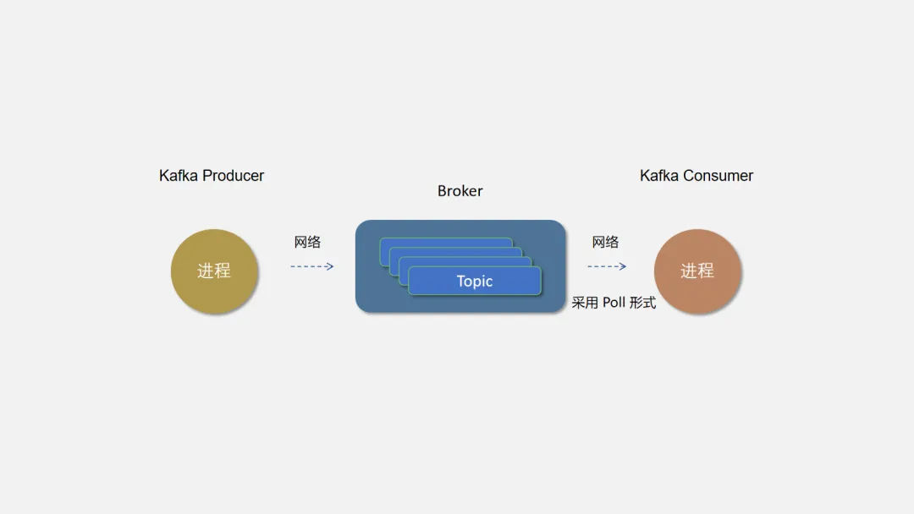

### **<font style="color:rgb(34, 34, 34);background-color:rgb(248, 246, 244);">Partition</font>**
<font style="color:rgb(51, 51, 51);background-color:rgb(248, 246, 244);">为了提高并行处理能力和扩展性，Kafka 将一个 Topic 分为多个 Partition。每个 Partition 是一个有序的消息队列，消息在 Partition 内部是有序的，但在不同的 Partition 之间没有顺序保证。</font>

<font style="color:rgb(51, 51, 51);background-color:rgb(248, 246, 244);">Producer 可以并行地将消息发送到不同的 Partition，Consumer 也可以并行地消费不同的 Partition，从而提升整体处理能力。</font>

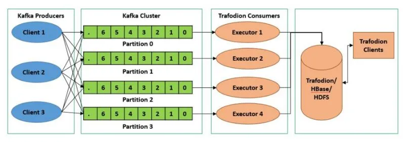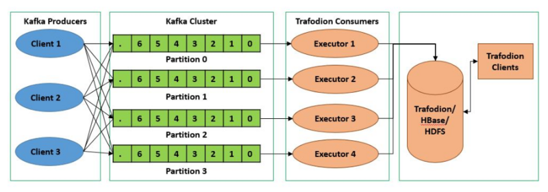

<font style="color:rgb(51, 51, 51);background-color:rgb(248, 246, 244);">因此，可以说，</font>**<font style="color:rgb(34, 34, 34);background-color:rgb(248, 246, 244);">每增加一个 Paritition 就增加了一个消费并发。Partition 的引入不仅提高了系统的可扩展性，还使得数据处理更加灵活。</font>**

### **<font style="color:rgb(34, 34, 34);background-color:rgb(248, 246, 244);">Partition 分区策略</font>**
**<font style="color:rgb(34, 34, 34);background-color:rgb(248, 246, 244);">“</font>**

<font style="color:rgb(100, 100, 100);background-color:rgb(248, 246, 244);">码楼：“生产者将消息发送到哪个分区是如何实现的？不合理的分配会导致消息集中在某些 Broker 上，岂不是完犊子。”</font>

<font style="color:rgb(51, 51, 51);background-color:rgb(248, 246, 244);">主要有以下几种分区策略：</font>

1. **<font style="color:rgb(34, 34, 34);background-color:rgb(248, 246, 244);">轮询策略</font>**<font style="color:rgb(51, 51, 51);background-color:rgb(248, 246, 244);">：也称 Round-robin 策略，即顺序分配。</font>
2. **<font style="color:rgb(34, 34, 34);background-color:rgb(248, 246, 244);">随机策略</font>**<font style="color:rgb(51, 51, 51);background-color:rgb(248, 246, 244);">：也称 Randomness 策略。所谓随机就是我们随意地将消息放置到任意一个分区上。</font>
3. **<font style="color:rgb(34, 34, 34);background-color:rgb(248, 246, 244);">按消息键保序策略</font>**<font style="color:rgb(51, 51, 51);background-color:rgb(248, 246, 244);">。</font>
4. <font style="color:rgb(51, 51, 51);background-color:rgb(248, 246, 244);">基于地理位置分区策略。</font>

**<font style="color:rgb(34, 34, 34);background-color:rgb(248, 246, 244);">轮询策略</font>**

<font style="color:rgb(51, 51, 51);background-color:rgb(248, 246, 244);">比如一个 Topic 下有 3 个分区，那么第一条消息被发送到分区 0，第二条被发送到分区 1，第三条被发送到分区 2，以此类推。</font>

<font style="color:rgb(51, 51, 51);background-color:rgb(248, 246, 244);">当生产第 4 条消息时又会重新开始，即将其分配到分区 0，如图 5 所示。</font>

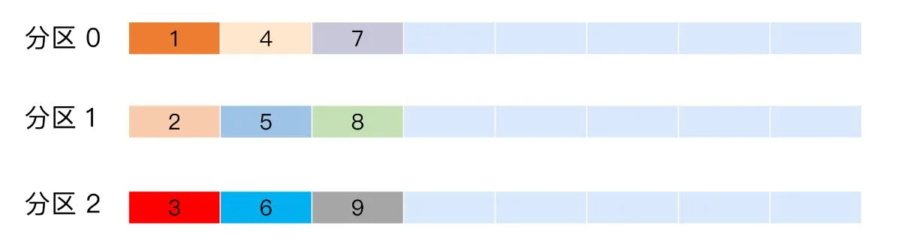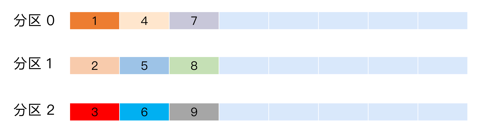

**<font style="color:rgb(34, 34, 34);background-color:rgb(248, 246, 244);">轮询策略有非常优秀的负载均衡表现，它总是能保证消息最大限度地被平均分配到所有分区上，故默认情况下它是最合理的分区策略，也是我们最常用的分区策略之一。</font>**

**<font style="color:rgb(34, 34, 34);background-color:rgb(248, 246, 244);">随机策略</font>**

<font style="color:rgb(51, 51, 51);background-color:rgb(248, 246, 244);">所谓随机就是我们随意地将消息放置到任意一个分区上。如图所示，9 条消息随机分配到不同分区。</font>

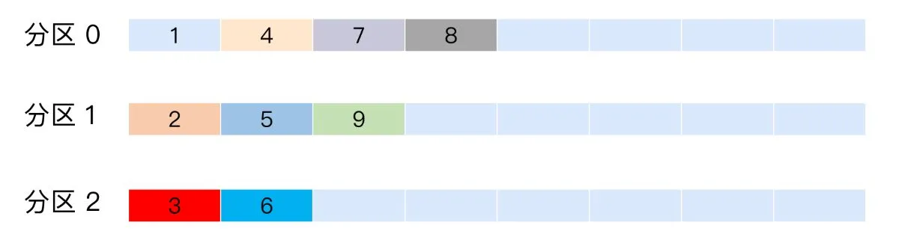

**<font style="color:rgb(34, 34, 34);background-color:rgb(248, 246, 244);">按消息键分配策略</font>**

<font style="color:rgb(51, 51, 51);background-color:rgb(248, 246, 244);">一旦消息被定义了 Key，那么你就可以保证同一个 Key 的所有消息都进入到相同的分区里面，比如订单 ID，那么绑定同一个 订单 ID 的消息都会发布到同一个分区，由于每个分区下的消息处理都是有顺序的，故这个策略被称为按消息键保序策略，如图所示。</font>

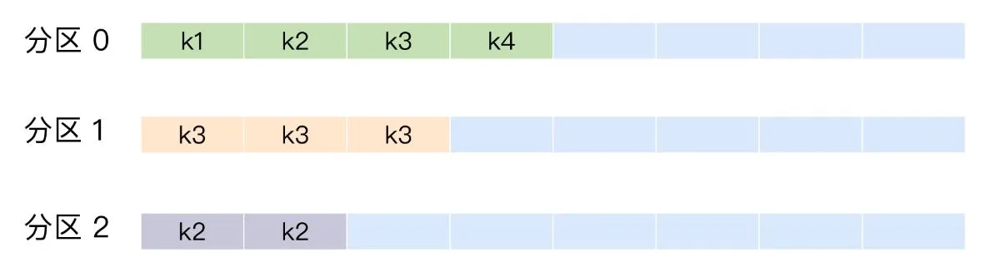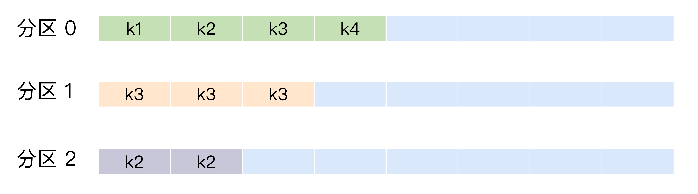

**<font style="color:rgb(34, 34, 34);background-color:rgb(248, 246, 244);">基于地理位置</font>**

<font style="color:rgb(51, 51, 51);background-color:rgb(248, 246, 244);">这种策略一般只针对那些大规模的 Kafka 集群，特别是跨城市、跨国家甚至是跨大洲的集群。</font>

<font style="color:rgb(51, 51, 51);background-color:rgb(248, 246, 244);">我们就可以根据 Broker 所在的 IP 地址实现定制化的分区策略。比如下面这段代码：</font>

```plain
List<PartitionInfo> partitions = cluster.partitionsForTopic(topic);
return partitions.stream()
  .filter(p -> isSouth(p.leader().host()))
  .map(PartitionInfo::partition)
  .findAny()
  .get();
```

<font style="color:rgb(51, 51, 51);background-color:rgb(248, 246, 244);">我们可以从所有分区中找出那些 Leader 副本在南方的所有分区，然后随机挑选一个进行消息发送。</font>

## **<font style="color:rgb(34, 34, 34);background-color:rgb(248, 246, 244);">Segment 日志文件和稀疏索引</font>**
<font style="color:rgb(51, 51, 51);background-color:rgb(248, 246, 244);">前面已经介绍过，</font>**<font style="color:rgb(34, 34, 34);background-color:rgb(248, 246, 244);">Kafka 的 Topic 可以分为多个 Partition，每个 Partition 有多个副本，你可以理解为副本才是存储消息的物理存在。其实每个副本都是以日志（Log）的形式存储。</font>**

**<font style="color:rgb(34, 34, 34);background-color:rgb(248, 246, 244);">“</font>**

<font style="color:rgb(100, 100, 100);background-color:rgb(248, 246, 244);">码楼：“日志文件过大怎么办？”</font>

**<font style="color:rgb(34, 34, 34);background-color:rgb(248, 246, 244);">为了解决单一日志文件过大的问题，kafka 采用了分段（Segment）的形式进行存储</font>**<font style="color:rgb(51, 51, 51);background-color:rgb(248, 246, 244);">。</font>

<font style="color:rgb(51, 51, 51);background-color:rgb(248, 246, 244);">所谓 Segment，就是当一个日志文件大小到达一定条件之后，就新建一个新的 Segment，然后在新的 Segment 写入数据。Topic、Partition、和日志的关系如图 8 所示。</font>

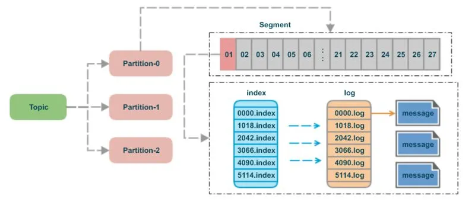

<font style="color:rgb(51, 51, 51);background-color:rgb(248, 246, 244);">图 8</font>

<font style="color:rgb(51, 51, 51);background-color:rgb(248, 246, 244);">一个</font><font style="color:rgb(51, 51, 51);background-color:rgb(248, 246, 244);"> </font>**<font style="color:rgb(34, 34, 34);background-color:rgb(248, 246, 244);">segment</font>**<font style="color:rgb(51, 51, 51);background-color:rgb(248, 246, 244);"> </font><font style="color:rgb(51, 51, 51);background-color:rgb(248, 246, 244);">对应磁盘上多个文件。</font>

+ <font style="color:rgb(51, 51, 51);background-color:rgb(248, 246, 244);">.index : 消息的</font><font style="color:rgb(51, 51, 51);background-color:rgb(248, 246, 244);"> </font>**<font style="color:rgb(34, 34, 34);background-color:rgb(248, 246, 244);">offset</font>**<font style="color:rgb(51, 51, 51);background-color:rgb(248, 246, 244);"> </font><font style="color:rgb(51, 51, 51);background-color:rgb(248, 246, 244);">索引文件。</font>
+ <font style="color:rgb(51, 51, 51);background-color:rgb(248, 246, 244);">.timeindex : 消息的时间索引文件(0.8 版本加入的)。</font>
+ <font style="color:rgb(51, 51, 51);background-color:rgb(248, 246, 244);">.log : 存储实际的消息数据。</font>
+ <font style="color:rgb(51, 51, 51);background-color:rgb(248, 246, 244);">.snapshot : 记录了 producer 的事务信息。</font>
+ <font style="color:rgb(51, 51, 51);background-color:rgb(248, 246, 244);">.swap : 用于</font><font style="color:rgb(51, 51, 51);background-color:rgb(248, 246, 244);"> </font>**<font style="color:rgb(34, 34, 34);background-color:rgb(248, 246, 244);">Segment</font>**<font style="color:rgb(51, 51, 51);background-color:rgb(248, 246, 244);"> </font><font style="color:rgb(51, 51, 51);background-color:rgb(248, 246, 244);">恢复。</font>
+ <font style="color:rgb(51, 51, 51);background-color:rgb(248, 246, 244);">.txnindex 文件，记录了中断的事务信息。</font>

<font style="color:rgb(51, 51, 51);background-color:rgb(248, 246, 244);">.log 文件存储实际的 message，kafka 为每一个日志文件添加了 2 个索引文件 .index以及 .timeindex。</font>

<font style="color:rgb(51, 51, 51);background-color:rgb(248, 246, 244);">segment 文件命名规则：</font>**<font style="color:rgb(34, 34, 34);background-color:rgb(248, 246, 244);">partition 第一个 segment 从 0 开始，后续每个 segment 文件名为上一个 segment 文件最后一条消息的 offset 值。数值最大为 64 位 lo</font>**<font style="color:rgb(51, 51, 51);background-color:rgb(248, 246, 244);">ng 大小，19 位数字字符长度，没有数字用 0 填充。</font>

**<font style="color:rgb(34, 34, 34);background-color:rgb(248, 246, 244);">“</font>**

<font style="color:rgb(100, 100, 100);background-color:rgb(248, 246, 244);">码楼：“为什么要有 .index 文件？”</font>

<font style="color:rgb(51, 51, 51);background-color:rgb(248, 246, 244);">为了提高查找消息的性能。</font>**<font style="color:rgb(34, 34, 34);background-color:rgb(248, 246, 244);">kafka</font>**<font style="color:rgb(51, 51, 51);background-color:rgb(248, 246, 244);"> </font><font style="color:rgb(51, 51, 51);background-color:rgb(248, 246, 244);">为消息数据建了两种</font>**<font style="color:rgb(34, 34, 34);background-color:rgb(248, 246, 244);">稀疏索引</font>**<font style="color:rgb(51, 51, 51);background-color:rgb(248, 246, 244);">，一种是方便</font><font style="color:rgb(51, 51, 51);background-color:rgb(248, 246, 244);"> </font>**<font style="color:rgb(34, 34, 34);background-color:rgb(248, 246, 244);">offset</font>**<font style="color:rgb(51, 51, 51);background-color:rgb(248, 246, 244);"> </font><font style="color:rgb(51, 51, 51);background-color:rgb(248, 246, 244);">查找的</font><font style="color:rgb(51, 51, 51);background-color:rgb(248, 246, 244);"> </font>**<font style="color:rgb(34, 34, 34);background-color:rgb(248, 246, 244);">.index 稀疏索引</font>**<font style="color:rgb(51, 51, 51);background-color:rgb(248, 246, 244);">,还有一种是方便时间查找的</font><font style="color:rgb(51, 51, 51);background-color:rgb(248, 246, 244);"> </font>**<font style="color:rgb(34, 34, 34);background-color:rgb(248, 246, 244);">.timeindex 稀疏索引</font>**<font style="color:rgb(51, 51, 51);background-color:rgb(248, 246, 244);">。</font>

### **<font style="color:rgb(34, 34, 34);background-color:rgb(248, 246, 244);">稀疏索引</font>**
**<font style="color:rgb(34, 34, 34);background-color:rgb(248, 246, 244);">“</font>**

<font style="color:rgb(100, 100, 100);background-color:rgb(248, 246, 244);">Chaya：“为什么不创建一个哈希索引，从 offset 到物理消息日志文件偏移量的映射关系？”</font>

<font style="color:rgb(51, 51, 51);background-color:rgb(248, 246, 244);">万万不可，Kafka 作为海量数据处理的中间件，每秒高达几百万的消息写入，这个哈希索引会把把内存撑爆炸。</font>

<font style="color:rgb(51, 51, 51);background-color:rgb(248, 246, 244);">稀疏索引不会为每个记录都保存索引，而是写入一定的记录之后才会增加一个索引值，具体这个间隔有多大则通过 log.index.interval.bytes 参数进行控制，默认大小为 4 KB，意味着 Kafka 至少写入 4KB 消息数据之后，才会在索引文件中增加一个索引项。</font>

<font style="color:rgb(51, 51, 51);background-color:rgb(248, 246, 244);">哈希稀疏索引把消息划分为多个 block ，只索引每个 block 第一条消息的 offset 即可 。</font>

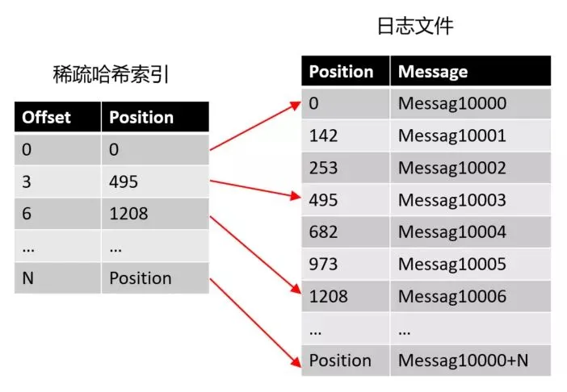

+ <font style="color:rgb(51, 51, 51);background-color:rgb(248, 246, 244);">Offset 偏移量：表示第几个消息。</font>
+ <font style="color:rgb(51, 51, 51);background-color:rgb(248, 246, 244);">position：消息在磁盘的物理位置。</font>

**<font style="color:rgb(34, 34, 34);background-color:rgb(248, 246, 244);">“</font>**

<font style="color:rgb(100, 100, 100);background-color:rgb(248, 246, 244);">Chaya：如果消费者要查找 Offset 为 4 的消息，查找过程是怎样的？</font>

+ <font style="color:rgb(51, 51, 51);background-color:rgb(248, 246, 244);">首先用二分法定位消息在哪个 Segment ，Segment 文件命名是 Partition 第一个 segment 从 0 开始，后续每个 segment 文件名为上一个 segment 文件最后一条消息的 offset 值。</font>
+ <font style="color:rgb(51, 51, 51);background-color:rgb(248, 246, 244);">打开这个 Segment 对应的 index 索引文件，用二分法查找 offset 不大于 4 的索引条目，对应上图第二条条目，也就是 offset = 3 的那个索引。通过索引我们可以知道 offset 为 4 的消息所在的日志文件磁盘物理位置为 495。</font>
+ <font style="color:rgb(51, 51, 51);background-color:rgb(248, 246, 244);">打开日志文件，从 Position 为 495 位置开始开始顺序扫描文件，将扫描过程中每条消息的 offset 与 4 比较，直到找到 offset 为 4 的那条 Message。</font>

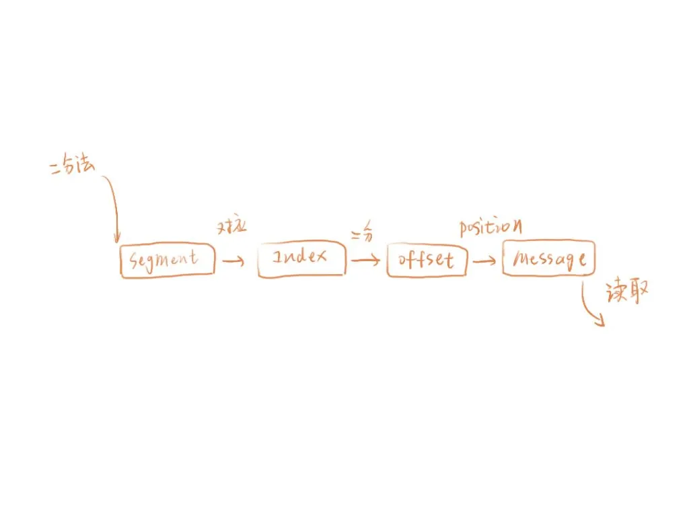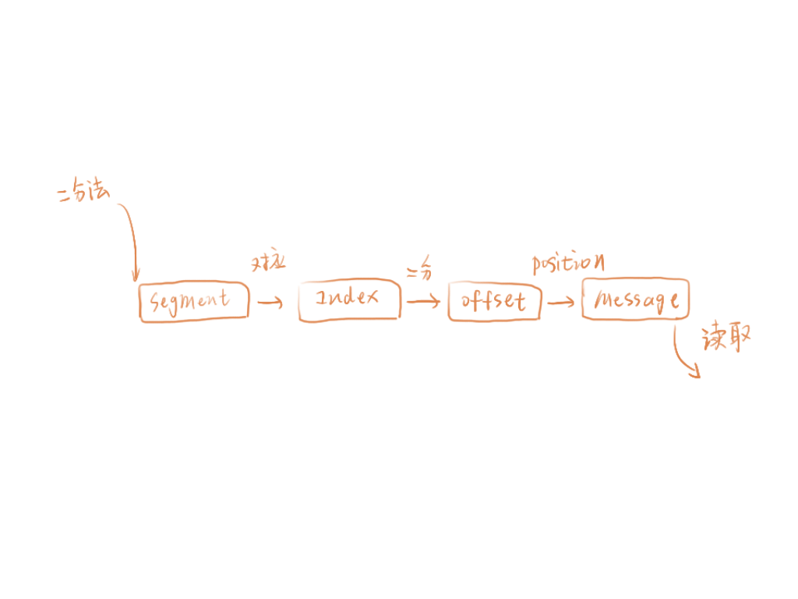

**<font style="color:rgb(34, 34, 34);background-color:rgb(248, 246, 244);">.timeindex</font>**<font style="color:rgb(51, 51, 51);background-color:rgb(248, 246, 244);"> </font><font style="color:rgb(51, 51, 51);background-color:rgb(248, 246, 244);">文件同理，只不过它的查找结果是</font><font style="color:rgb(51, 51, 51);background-color:rgb(248, 246, 244);"> </font>**<font style="color:rgb(34, 34, 34);background-color:rgb(248, 246, 244);">offset</font>**<font style="color:rgb(51, 51, 51);background-color:rgb(248, 246, 244);">，之后还要在走一遍</font><font style="color:rgb(51, 51, 51);background-color:rgb(248, 246, 244);"> </font>**<font style="color:rgb(34, 34, 34);background-color:rgb(248, 246, 244);">.index</font>**<font style="color:rgb(51, 51, 51);background-color:rgb(248, 246, 244);"> </font><font style="color:rgb(51, 51, 51);background-color:rgb(248, 246, 244);">索引查找流程。</font>

<font style="color:rgb(51, 51, 51);background-color:rgb(248, 246, 244);">由于</font><font style="color:rgb(51, 51, 51);background-color:rgb(248, 246, 244);"> </font>**<font style="color:rgb(34, 34, 34);background-color:rgb(248, 246, 244);">kafka</font>**<font style="color:rgb(51, 51, 51);background-color:rgb(248, 246, 244);"> </font><font style="color:rgb(51, 51, 51);background-color:rgb(248, 246, 244);">设计为顺序读写磁盘，因此遍历区间的数据并对速度有太大的影响，而选择</font>**<font style="color:rgb(34, 34, 34);background-color:rgb(248, 246, 244);">稀疏索引</font>**<font style="color:rgb(51, 51, 51);background-color:rgb(248, 246, 244);">还能节约大量的磁盘空间。</font>

### **<font style="color:rgb(34, 34, 34);background-color:rgb(248, 246, 244);">mmap</font>**
<font style="color:rgb(51, 51, 51);background-color:rgb(248, 246, 244);">有了稀疏索引，当给定一个 offset 时，Kafka 采用的是二分查找来扫描索引定位不大于 offset 的物理位移 position，再到日志文件找到目标消息。</font>

<font style="color:rgb(51, 51, 51);background-color:rgb(248, 246, 244);">利用稀疏索引，已经基本解决了高效查询的问题，但是这个过程中仍然有进一步的优化空间，那便是</font>**<font style="color:rgb(34, 34, 34);background-color:rgb(248, 246, 244);">通过 mmap(memory mapped files) 读写上面提到的稀疏索引文件，进一步提高查询消息的速度</font>**<font style="color:rgb(51, 51, 51);background-color:rgb(248, 246, 244);">。</font>

<font style="color:rgb(51, 51, 51);background-color:rgb(248, 246, 244);">就是基于 JDK nio 包下的 MappedByteBuffer 的 map 函数，将磁盘文件映射到内存中。</font>

<font style="color:rgb(51, 51, 51);background-color:rgb(248, 246, 244);">进程通过调用 mmap 系统函数，将文件或物理内存的一部分映射到其虚拟地址空间。这个过程中，操作系统会为映射的内存区域分配一个虚拟地址，并将这个地址与文件或物理内存的实际内容关联起来。</font>

<font style="color:rgb(51, 51, 51);background-color:rgb(248, 246, 244);">一旦内存映射完成，进程就可以通过指针直接访问映射的内存区域。这种访问方式就像访问普通内存一样简单和高效。</font>

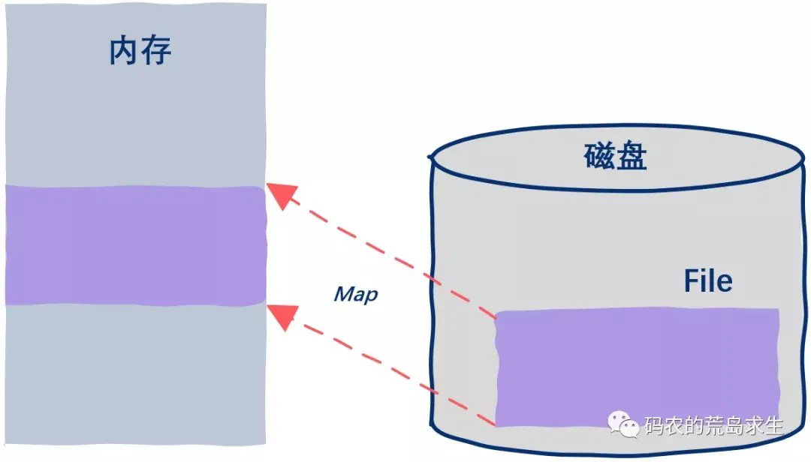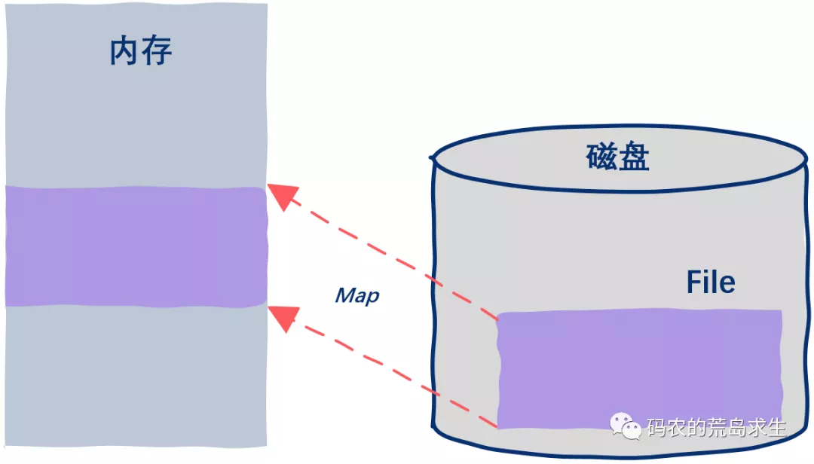

<font style="color:rgb(51, 51, 51);background-color:rgb(248, 246, 244);">图引自《码农的荒岛求生》</font>

## **<font style="color:rgb(34, 34, 34);background-color:rgb(248, 246, 244);">顺序读写磁盘</font>**
**<font style="color:rgb(34, 34, 34);background-color:rgb(248, 246, 244);">“</font>**

<font style="color:rgb(100, 100, 100);background-color:rgb(248, 246, 244);">码楼：“不管如何，Kafka 读写消息都要读写磁盘，如何变快呢？”</font>

<font style="color:rgb(51, 51, 51);background-color:rgb(248, 246, 244);">磁盘就一定很慢么？人们普遍错误地认为硬盘很慢。然而，存储介质的性能，很大程度上依赖于数据被访问的模式。</font>

<font style="color:rgb(51, 51, 51);background-color:rgb(248, 246, 244);">同样在一块普通的 7200 RPM SATA 硬盘上，随机 I/O（random I/O）与顺序 I/O 相比，随机 I/O 的性能要比顺序 I/O 慢 3 到 4 个数量级。</font>

<font style="color:rgb(51, 51, 51);background-color:rgb(248, 246, 244);">合理的方式可以让磁盘写操作更加高效，减少了寻道时间和旋转延迟。</font>

<font style="color:rgb(51, 51, 51);background-color:rgb(248, 246, 244);">码楼，你还留着课本吗？来，翻到讲磁盘的章节，让我们回顾一下磁盘的运行原理。</font>

**<font style="color:rgb(34, 34, 34);background-color:rgb(248, 246, 244);">“</font>**

<font style="color:rgb(100, 100, 100);background-color:rgb(248, 246, 244);">码楼：“鬼还留着哦，课程还没上到一半书就没了。要不是考试俺眼神好，就挂科了。”</font>

<font style="color:rgb(51, 51, 51);background-color:rgb(248, 246, 244);">磁盘的运行原理如图所示。</font>

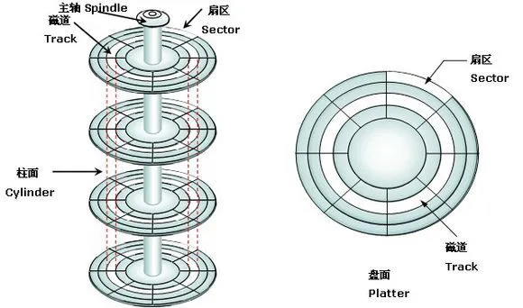

<font style="color:rgb(51, 51, 51);background-color:rgb(248, 246, 244);">硬盘在逻辑上被划分为磁道、柱面以及扇区。硬盘的每个盘片的每个面都有一个读写磁头。</font>

<font style="color:rgb(51, 51, 51);background-color:rgb(248, 246, 244);">完成一次磁盘 I/O ，需要经过寻道、旋转和数据传输三个步骤。</font>

1. **<font style="color:rgb(34, 34, 34);background-color:rgb(248, 246, 244);">寻道</font>**<font style="color:rgb(51, 51, 51);background-color:rgb(248, 246, 244);">：首先必须找到柱面，即磁头需要移动到相应磁道，这个过程叫做寻道，所耗费时间叫做寻道时间。寻道时间越短，I/O 操作越快，目前磁盘的平均寻道时间一般在 3-15ms。</font>
2. **<font style="color:rgb(34, 34, 34);background-color:rgb(248, 246, 244);">旋转</font>**<font style="color:rgb(51, 51, 51);background-color:rgb(248, 246, 244);">：磁盘旋转将</font>**<font style="color:rgb(34, 34, 34);background-color:rgb(248, 246, 244);">目标扇区旋转到磁头下</font>**<font style="color:rgb(51, 51, 51);background-color:rgb(248, 246, 244);">。这个过程耗费的时间叫做旋转时间。旋转延迟取决于磁盘转速，通常用磁盘旋转一周所需时间的 1/2 表示。比如：7200rpm 的磁盘平均旋转延迟大约为 60*1000/7200/2 = 4.17ms，而转速为 15000rpm 的磁盘其平均旋转延迟为 2ms。</font>
3. **<font style="color:rgb(34, 34, 34);background-color:rgb(248, 246, 244);">数据传输</font>**<font style="color:rgb(51, 51, 51);background-color:rgb(248, 246, 244);">：数据在磁盘与内存之间的实际传输。</font>

<font style="color:rgb(51, 51, 51);background-color:rgb(248, 246, 244);">因此，如果在写磁盘的时候省去寻道、旋转可以极大地提高磁盘读写的性能。</font>

<font style="color:rgb(51, 51, 51);background-color:rgb(248, 246, 244);">Kafka 采用顺序写文件的方式来提高磁盘写入性能。顺序写文件，顺序 I/O 的时候，磁头几乎不用换道，或者换道的时间很短。减少了磁盘寻道和旋转的次数。磁头再也不用在磁道上乱舞了，而是一路向前飞速前行。</font>

**<font style="color:rgb(34, 34, 34);background-color:rgb(248, 246, 244);">Kafka 中每个 Partition 是一个有序的，不可变的消息序列，新的消息可以不断追加到 Partition 的末尾，在 Kafka 中 Partition 只是一个逻辑概念，每个 Partition 划分为多个 Segment，每个 Segment 对应一个物理文件，Kafka 对 Segment 文件追加写，这就是顺序写文件。</font>**

<font style="color:rgb(51, 51, 51);background-color:rgb(248, 246, 244);">每条消息在发送前会根据负载均衡策略计算出要发往的目标 Partition 中，broker 收到消息之后把该条消息按照追加的方式顺序写入 Partition 的日志文件中。</font>

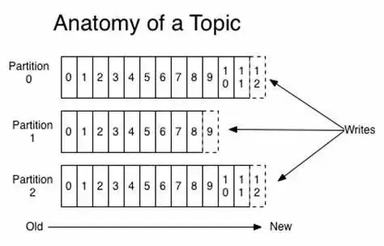

<font style="color:rgb(51, 51, 51);background-color:rgb(248, 246, 244);">如下图所示，可以看到磁盘顺序写的性能远高于磁盘随机写，甚至比内存随机写还快。</font>

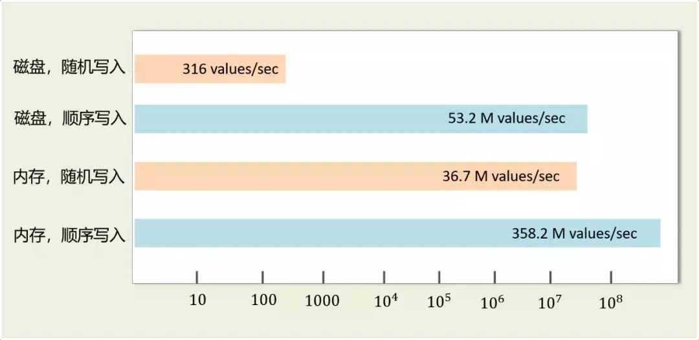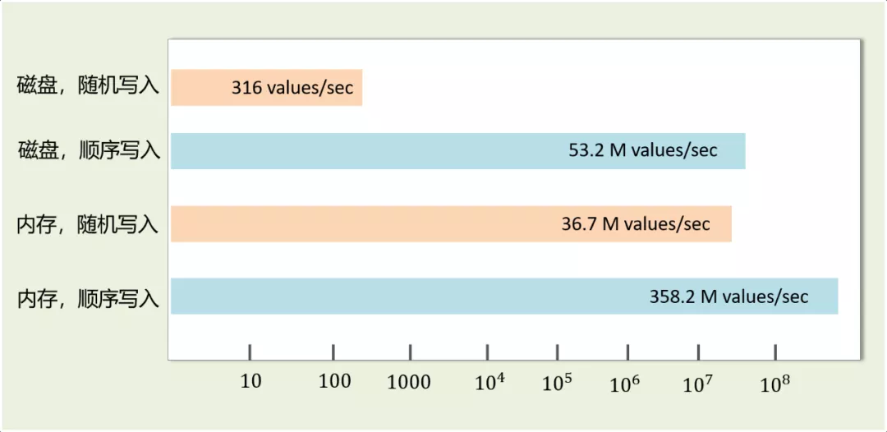

## **<font style="color:rgb(34, 34, 34);background-color:rgb(248, 246, 244);">PageCache</font>**
**<font style="color:rgb(34, 34, 34);background-color:rgb(248, 246, 244);">“</font>**

<font style="color:rgb(100, 100, 100);background-color:rgb(248, 246, 244);">Chaya：“码哥，使用稀疏索引和 mmap 内存映射技术提高读消息的性能；Topic Partition 加磁盘顺序写持久化消息的设计已经很快了，但是与内存顺序写还是慢了，还有优化空间么？”</font>

<font style="color:rgb(51, 51, 51);background-color:rgb(248, 246, 244);">小姑娘，你的想法很好，作为快到令人发指的 Kafka，确实想到了一个方式来提高读写写磁盘文件的性能。这就是接下来的主角 Page Cache 。</font>

<font style="color:rgb(51, 51, 51);background-color:rgb(248, 246, 244);">简而言之：利用操作系统的缓存技术，在读写磁盘日志文件时，操作的是内存，而不是文件，由操作系统决定什么在某个时间将 Page Cache 的数据刷写到磁盘中。</font>

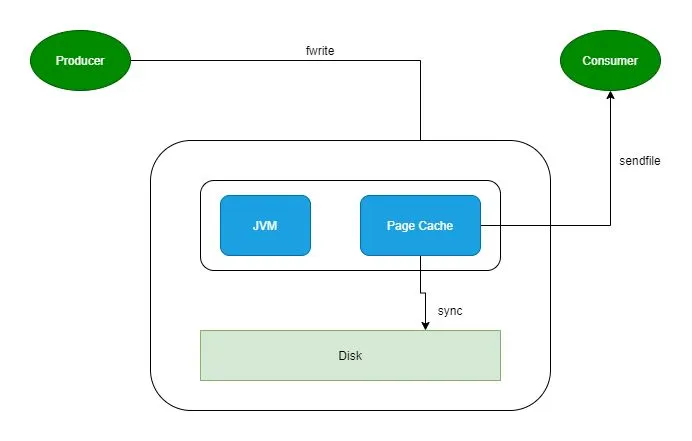

1. <font style="color:rgb(51, 51, 51);background-color:rgb(248, 246, 244);">Producer 发送消息到 Broker 时，Broker 会使用 pwrite() 系统调用写入数据，此时数据都会先写入page cache。</font>
2. <font style="color:rgb(51, 51, 51);background-color:rgb(248, 246, 244);">Consumer 消费消息时，Broker 使用 sendfile() 系统调用函数，通零拷贝技术地将 Page Cache 中的数据传输到 Broker 的 Socket buffer，再通过网络传输到 Consumer。</font>
3. <font style="color:rgb(51, 51, 51);background-color:rgb(248, 246, 244);">leader 与 follower 之间的同步，与上面 consumer 消费数据的过程是同理的。</font>

<font style="color:rgb(51, 51, 51);background-color:rgb(248, 246, 244);">Kafka 重度依赖底层操作系统提供的 PageCache 功能。当上层有写操作时，操作系统只是将数据写入 PageCache，同时标记 Page 属性为 Dirty。</font>

<font style="color:rgb(51, 51, 51);background-color:rgb(248, 246, 244);">当读操作发生时，先从 PageCache 中查找，如果发生缺页才进行磁盘调度，最终返回需要的数据。</font>

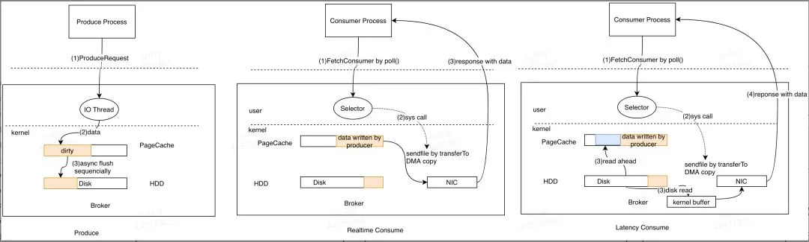

<font style="color:rgb(51, 51, 51);background-color:rgb(248, 246, 244);">于是我们得到一个重要结论：</font>**<font style="color:rgb(34, 34, 34);background-color:rgb(248, 246, 244);">如果 Kafka producer 的生产速率与 consumer 的消费速率相差不大，那么就能几乎只靠对 broker page cache 的读写完成整个生产-消费过程，磁盘访问非常少。</font>**

**<font style="color:rgb(34, 34, 34);background-color:rgb(248, 246, 244);">实际上 PageCache 是把尽可能多的空闲内存都当做了磁盘缓存来使用。</font>**

## **<font style="color:rgb(34, 34, 34);background-color:rgb(248, 246, 244);">数据压缩和批量处理</font>**
<font style="color:rgb(51, 51, 51);background-color:rgb(248, 246, 244);">数据压缩在 Kafka 中有助于减少磁盘空间的使用和网络带宽的消耗，从而提升整体性能。</font>

**<font style="color:rgb(34, 34, 34);background-color:rgb(248, 246, 244);">通过减少消息的大小，压缩可以显著降低生产者和消费者之间的数据传输时间。</font>**

**<font style="color:rgb(34, 34, 34);background-color:rgb(248, 246, 244);">“</font>**

<font style="color:rgb(100, 100, 100);background-color:rgb(248, 246, 244);">Chaya：Kafka 支持的压缩算法有哪些？</font>

<font style="color:rgb(51, 51, 51);background-color:rgb(248, 246, 244);">在 Kafka 2.1.0 版本之前，Kafka 支持 3 种压缩算法：GZIP、Snappy 和 LZ4。从 2.1.0 开始，Kafka 正式支持 Zstandard 算法（简写为 zstd）。</font>

**<font style="color:rgb(34, 34, 34);background-color:rgb(248, 246, 244);">“</font>**

<font style="color:rgb(100, 100, 100);background-color:rgb(248, 246, 244);">Chaya：这么多压缩算法，我如何选择？</font>

<font style="color:rgb(51, 51, 51);background-color:rgb(248, 246, 244);">一个压缩算法的优劣，有两个重要的指标：压缩比，文件压缩前的大小与压缩后的大小之比，比如源文件占用 1000 M 内存，经过压缩后变成了 200 M，压缩比 = 1000 /200 = 5，压缩比越高越高；另一个指标是压缩/解压缩吞吐量，比如每秒能压缩或者解压缩多少 M 数据，吞吐量越高越好。</font>

### **<font style="color:rgb(34, 34, 34);background-color:rgb(248, 246, 244);">生产者压缩</font>**
<font style="color:rgb(51, 51, 51);background-color:rgb(248, 246, 244);">Kafka 的数据压缩主要在生产者端进行。具体步骤如下：</font>

1. **<font style="color:rgb(34, 34, 34);background-color:rgb(248, 246, 244);">生产者配置压缩方式</font>**<font style="color:rgb(51, 51, 51);background-color:rgb(248, 246, 244);">：在 KafkaProducer 配置中设置 compression.type 参数，可以选择 gzip、snappy、lz4 或 zstd。</font>
2. **<font style="color:rgb(34, 34, 34);background-color:rgb(248, 246, 244);">消息压缩</font>**<font style="color:rgb(51, 51, 51);background-color:rgb(248, 246, 244);">：生产者将消息批量收集到一个 batch 中，然后对整个 batch 进行压缩。这种批量压缩方式可以获得更高的压缩率。</font>
3. **<font style="color:rgb(34, 34, 34);background-color:rgb(248, 246, 244);">压缩消息存储</font>**<font style="color:rgb(51, 51, 51);background-color:rgb(248, 246, 244);">：压缩后的 batch 以压缩格式存储在 Kafka 的主题（Topic）分区中。</font>
4. **<font style="color:rgb(34, 34, 34);background-color:rgb(248, 246, 244);">消费者解压缩</font>**<font style="color:rgb(51, 51, 51);background-color:rgb(248, 246, 244);">：消费者从 Kafka 主题中获取消息时，首先对接收到的 batch 进行解压缩，然后处理其中的每一条消息。</font>

### **<font style="color:rgb(34, 34, 34);background-color:rgb(248, 246, 244);">解压缩</font>**
<font style="color:rgb(51, 51, 51);background-color:rgb(248, 246, 244);">有压缩，那必有解压缩。通常情况下，Producer 发送压缩后的消息到 Broker ，原样保存起来。</font>

<font style="color:rgb(51, 51, 51);background-color:rgb(248, 246, 244);">Consumer 消费这些消息的时候，Broker 原样发给 Consumer，由 Consumer 执行解压缩还原出原本的信息。</font>

**<font style="color:rgb(34, 34, 34);background-color:rgb(248, 246, 244);">“</font>**

<font style="color:rgb(100, 100, 100);background-color:rgb(248, 246, 244);">Chaya：Consumer 咋知道用什么压缩算法解压缩？</font>

<font style="color:rgb(51, 51, 51);background-color:rgb(248, 246, 244);">Kafka 会将启用了哪种压缩算法封装进消息集合中，这样当 Consumer 读取到消息集合时，它自然就知道了这些消息使用的是哪种压缩算法。</font>

<font style="color:rgb(51, 51, 51);background-color:rgb(248, 246, 244);">总之一句话：</font>**<font style="color:rgb(34, 34, 34);background-color:rgb(248, 246, 244);">Producer 端压缩、Broker 端保持、Consumer 端解压缩。</font>**

### **<font style="color:rgb(34, 34, 34);background-color:rgb(248, 246, 244);">批量数据处理</font>**
<font style="color:rgb(51, 51, 51);background-color:rgb(248, 246, 244);">Kafka Producer 向 Broker 发送消息不是一条消息一条消息的发送，将多条消息打包成一个批次发送。</font>

<font style="color:rgb(51, 51, 51);background-color:rgb(248, 246, 244);">批量数据处理可以显著提高 Kafka 的吞吐量并减少网络开销。</font>

<font style="color:rgb(51, 51, 51);background-color:rgb(248, 246, 244);">Kafka Producer 的执行流程如下图所示：</font>

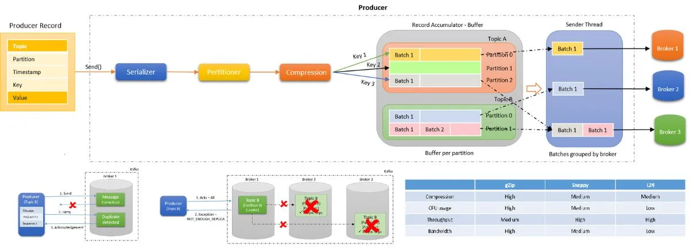

<font style="color:rgb(51, 51, 51);background-color:rgb(248, 246, 244);">发送消息依次经过以下处理器：</font>

+ <font style="color:rgb(51, 51, 51);background-color:rgb(248, 246, 244);">Serialize：键和值都根据传递的序列化器进行序列化。优秀的序列化方式可以提高网络传输的效率。</font>
+ <font style="color:rgb(51, 51, 51);background-color:rgb(248, 246, 244);">Partition：决定将消息写入主题的哪个分区，默认情况下遵循 murmur2 算法。自定义分区程序也可以传递给生产者，以控制应将消息写入哪个分区。</font>
+ <font style="color:rgb(51, 51, 51);background-color:rgb(248, 246, 244);">Compression：默认情况下，在 Kafka 生产者中不启用压缩。Compression 不仅可以更快地从生产者传输到代理，还可以在复制过程中进行更快的传输。压缩有助于提高吞吐量，降低延迟并提高磁盘利用率。</font>
+ <font style="color:rgb(51, 51, 51);background-color:rgb(248, 246, 244);">Record Accumulator：Accumulate顾名思义，就是一个消息累计器。其内部为每个 Partition 维护一个Deque双端队列，队列保存将要发送的 Batch</font>**<font style="color:rgb(34, 34, 34);background-color:rgb(248, 246, 244);">批次数据</font>**<font style="color:rgb(51, 51, 51);background-color:rgb(248, 246, 244);">，Accumulate将数据累计到一定数量，或者在一定过期时间内，便将数据以批次的方式发送出去。记录被累积在主题每个分区的缓冲区中。根据生产者批次大小属性将记录分组。主题中的每个分区都有一个单独的累加器 / 缓冲区。</font>
+ <font style="color:rgb(51, 51, 51);background-color:rgb(248, 246, 244);">Group Send：记录累积器中分区的批次按将它们发送到的代理分组。 批处理中的记录基于 batch.size 和 linger.ms 属性发送到代理。 记录由生产者根据两个条件发送。 当达到定义的批次大小或达到定义的延迟时间时。</font>
+ <font style="color:rgb(51, 51, 51);background-color:rgb(248, 246, 244);">Send Thread：发送线程，从 Accumulator 的队列取出待发送的 Batch 批次消息发送到 Broker。</font>
+ <font style="color:rgb(51, 51, 51);background-color:rgb(248, 246, 244);">Broker 端处理：Kafka Broker 接收到 batch 后，将其存储在对应的主题分区中。</font>
+ **<font style="color:rgb(34, 34, 34);background-color:rgb(248, 246, 244);">消费者端的批量消费</font>**<font style="color:rgb(51, 51, 51);background-color:rgb(248, 246, 244);">：消费者可以配置一次拉取多条消息的数量，通过 fetch.min.bytes 和 fetch.max.wait.ms 参数控制批量大小和等待时间。</font>

## **<font style="color:rgb(34, 34, 34);background-color:rgb(248, 246, 244);">无锁轻量级 offset</font>**
**<font style="color:rgb(34, 34, 34);background-color:rgb(248, 246, 244);">Offset 是 Kafka 中的一个重要概念，用于标识消息在分区中的位置。</font>**

<font style="color:rgb(51, 51, 51);background-color:rgb(248, 246, 244);">每个分区中的消息都有一个唯一的 offset，消费者通过维护自己的 offset 来确保准确消费消息。</font>**<font style="color:rgb(34, 34, 34);background-color:rgb(248, 246, 244);">offset 的高效管理对于 Kafka 的性能至关重要。</font>**


<font style="color:rgb(51, 51, 51);background-color:rgb(248, 246, 244);">offset 是从 0 开始的，每当有新的消息写入分区时，offset 就会加 1。offset 是不可变的，即使消息被删除或过期，offset 也不会改变或重用。</font>

**<font style="color:rgb(34, 34, 34);background-color:rgb(248, 246, 244);">Consumer 需要向 Kafka 汇报自己的位移数据，这个汇报过程被称为提交位移</font>**<font style="color:rgb(51, 51, 51);background-color:rgb(248, 246, 244);">（Committing Offsets）。因为 Consumer 能够同时消费多个 partition 的数据，所以位移的提交实际上是在 partition 粒度上进行的，即</font>**<font style="color:rgb(34, 34, 34);background-color:rgb(248, 246, 244);">Consumer 需要为分配给它的每个 partition 提交各自的位移数据</font>**<font style="color:rgb(51, 51, 51);background-color:rgb(248, 246, 244);">。</font>

<font style="color:rgb(51, 51, 51);background-color:rgb(248, 246, 244);">提交位移主要是为了表征 Consumer 的消费进度，这样当 Consumer 发生故障重启之后，就能够从 Kafka 中读取之前提交的位移值，然后从相应的位移处继续消费。</font>

<font style="color:rgb(51, 51, 51);background-color:rgb(248, 246, 244);">在传统的消息队列系统中，offset 通常需要通过锁机制来保证一致性，但这会带来性能瓶颈。Kafka 的设计哲学是尽量减少锁的使用，以提升并发处理能力和整体性能。</font>

### **<font style="color:rgb(34, 34, 34);background-color:rgb(248, 246, 244);">无锁设计思想</font>**
<font style="color:rgb(51, 51, 51);background-color:rgb(248, 246, 244);">Kafka 在 offset 设计中采用了一系列无锁的技术，使其能够在高并发的环境中保持高效。</font>

+ **<font style="color:rgb(34, 34, 34);background-color:rgb(248, 246, 244);">顺序写入</font>**<font style="color:rgb(51, 51, 51);background-color:rgb(248, 246, 244);">：Kafka 使用顺序写入的方式将消息追加到日志文件的末尾，避免了文件位置的频繁变动，从而减少了锁的使用。</font>
+ **<font style="color:rgb(34, 34, 34);background-color:rgb(248, 246, 244);">MMAP 内存映射文件</font>**<font style="color:rgb(51, 51, 51);background-color:rgb(248, 246, 244);">：Kafka 使用内存映射文件（Memory Mapped File）来访问日志数据和索引文件。这种方式使得文件数据可以直接映射到进程的虚拟地址空间中，从而减少了系统调用的开销，提高了数据访问的效率。</font>
+ **<font style="color:rgb(34, 34, 34);background-color:rgb(248, 246, 244);">零拷贝</font>**<font style="color:rgb(51, 51, 51);background-color:rgb(248, 246, 244);">：Kafka 使用零拷贝（Zero Copy）技术，将数据从磁盘直接传输到网络，绕过了用户态的复制过程，大大提高了数据传输的效率。</font>
+ **<font style="color:rgb(34, 34, 34);background-color:rgb(248, 246, 244);">批量处理</font>**<font style="color:rgb(51, 51, 51);background-color:rgb(248, 246, 244);">：Kafka 支持批量处理消息，在一个批次中同时处理多个消息，减少了网络和 I/O 的开销。</font>

### **<font style="color:rgb(34, 34, 34);background-color:rgb(248, 246, 244);">消费者 Offset 管理流程</font>**
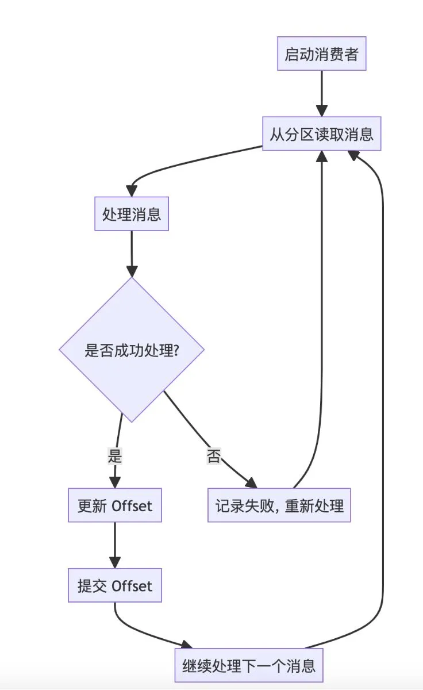

+ **<font style="color:rgb(34, 34, 34);background-color:rgb(248, 246, 244);">启动消费者</font>**<font style="color:rgb(51, 51, 51);background-color:rgb(248, 246, 244);">：消费者启动并订阅 Kafka 主题的某个分区。</font>
+ **<font style="color:rgb(34, 34, 34);background-color:rgb(248, 246, 244);">从分区读取消息</font>**<font style="color:rgb(51, 51, 51);background-color:rgb(248, 246, 244);">：消费者从指定分区中读取消息。</font>
+ **<font style="color:rgb(34, 34, 34);background-color:rgb(248, 246, 244);">处理消息</font>**<font style="color:rgb(51, 51, 51);background-color:rgb(248, 246, 244);">：消费者处理读取到的消息。</font>
+ **<font style="color:rgb(34, 34, 34);background-color:rgb(248, 246, 244);">是否成功处理</font>**<font style="color:rgb(51, 51, 51);background-color:rgb(248, 246, 244);">：判断消息是否成功处理。  
</font>
    - <font style="color:rgb(51, 51, 51);background-color:rgb(248, 246, 244);">如果成功处理，更新 Offset。</font>
    - <font style="color:rgb(51, 51, 51);background-color:rgb(248, 246, 244);">如果处理失败，记录失败原因并准备重新处理。</font>
+ **<font style="color:rgb(34, 34, 34);background-color:rgb(248, 246, 244);">更新 Offset</font>**<font style="color:rgb(51, 51, 51);background-color:rgb(248, 246, 244);">：成功处理消息后，更新 Offset 以记录已处理消息的位置。</font>
+ **<font style="color:rgb(34, 34, 34);background-color:rgb(248, 246, 244);">提交 Offset</font>**<font style="color:rgb(51, 51, 51);background-color:rgb(248, 246, 244);">：将更新后的 Offset 提交到 Kafka，以确保消息处理进度的持久化。</font>
+ **<font style="color:rgb(34, 34, 34);background-color:rgb(248, 246, 244);">继续处理下一个消息</font>**<font style="color:rgb(51, 51, 51);background-color:rgb(248, 246, 244);">：提交 Offset 后，继续读取并处理下一个消息。</font>

<font style="color:rgb(51, 51, 51);background-color:rgb(248, 246, 244);">Kafka 通过无锁轻量级 offset 的设计，实现了高性能、高吞吐和低延时的目标。</font>

## **<font style="color:rgb(34, 34, 34);background-color:rgb(248, 246, 244);">总结</font>**
**<font style="color:rgb(34, 34, 34);background-color:rgb(248, 246, 244);">Kafka 通过无锁轻量级 offset 的设计，实现了高性能、高吞吐和低延时的目标。</font>**

**<font style="color:rgb(34, 34, 34);background-color:rgb(248, 246, 244);">其 Reactor I/O 网络模型、磁盘顺序写入、内存映射文件、零拷贝、数据压缩和批量处理等技术，为 Kafka 提供了强大的数据处理能力和高效的消息队列服务。</font>**

+ **<font style="color:rgb(34, 34, 34);background-color:rgb(248, 246, 244);">Reactor I/O 网络模型</font>**<font style="color:rgb(51, 51, 51);background-color:rgb(248, 246, 244);">：通过 I/O 多路复用机制，Kafka 能够同时处理大量的网络连接请求，而不需要为每个连接创建一个线程，从而节省了系统资源。</font>
+ **<font style="color:rgb(34, 34, 34);background-color:rgb(248, 246, 244);">顺序写入</font>**<font style="color:rgb(51, 51, 51);background-color:rgb(248, 246, 244);">：Kafka 使用顺序写入的方式将消息追加到日志文件的末尾，避免了文件位置的频繁变动，从而减少了锁的使用。</font>
+ **<font style="color:rgb(34, 34, 34);background-color:rgb(248, 246, 244);">MMAP 内存映射文件</font>**<font style="color:rgb(51, 51, 51);background-color:rgb(248, 246, 244);">：Kafka 使用内存映射文件（Memory Mapped File）来访问日志数据和索引文件。这种方式使得文件数据可以直接映射到进程的虚拟地址空间中，从而减少了系统调用的开销，提高了数据访问的效率。</font>
+ **<font style="color:rgb(34, 34, 34);background-color:rgb(248, 246, 244);">零拷贝</font>**<font style="color:rgb(51, 51, 51);background-color:rgb(248, 246, 244);">：Kafka 使用零拷贝（Zero Copy）技术，将数据从磁盘直接传输到网络，绕过了用户态的复制过程，大大提高了数据传输的效率。</font>
+ **<font style="color:rgb(34, 34, 34);background-color:rgb(248, 246, 244);">数据压缩和批量处理</font>**<font style="color:rgb(51, 51, 51);background-color:rgb(248, 246, 244);">：数据压缩在 Kafka 中有助于减少磁盘空间的使用和网络带宽的消耗，从而提升整体性能。；Kafka 支持批量处理消息，在一个批次中同时处理多个消息，减少了网络和 I/O 的开销。</font>


> 更新: 2025-09-01 11:41:03  
> 原文: <https://www.yuque.com/yuqueyonghue6cvnv/cxhfwd/kbbqf0ssrr96d4sl>