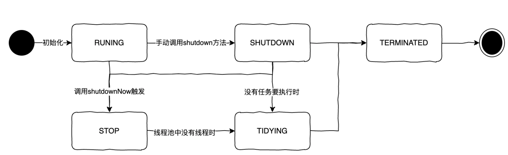
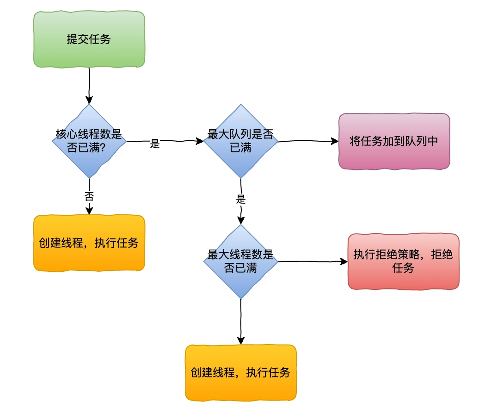
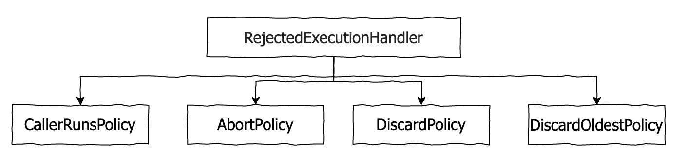
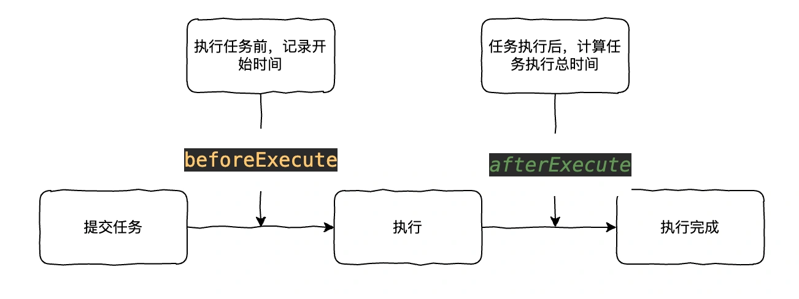
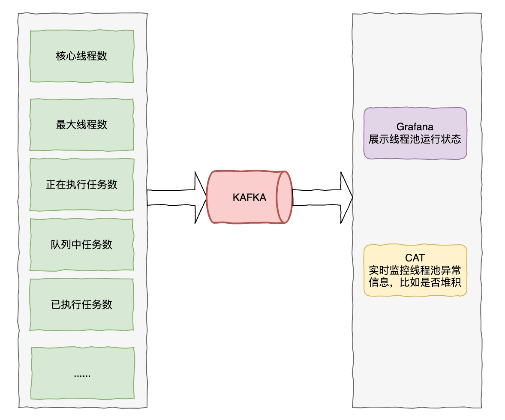

# 03 | 如何监控线程池运行状态，动态修改线程池参数？

<font style="color:rgb(51, 51, 51);background-color:rgb(248, 246, 244);">在回答这个问题之前，首先我们来了解下什么是线程池，它的工作原理是什么。</font>

# <font style="color:rgb(0, 0, 0);background-color:rgb(248, 246, 244);">什么是线程池</font>
<font style="color:rgb(51, 51, 51);background-color:rgb(248, 246, 244);">线程池（Thread Pool）是一种基于池化思想管理线程的工具，它维护多个线程。在线程池中，总有几个活跃线程。当需要使用线程来执行任务时，可以从池子中随便拿一个空闲线程来用，当完成工作时，该线程并不会死亡，而是再次返回线程池中成为空闲状态，等待执行下一个任务。</font>

<font style="color:rgb(51, 51, 51);background-color:rgb(248, 246, 244);">这种做法，一方面避免了处理任务时创建销毁线程开销的代价，另一方面避免了线程数量膨胀导致的过分调度问题，保证了对内核的充分利用。</font>

# <font style="color:rgb(0, 0, 0);background-color:rgb(248, 246, 244);">线程池状态</font>
<font style="color:rgb(51, 51, 51);background-color:rgb(248, 246, 244);">然后，我们来看下线程池有哪些状态呢？</font>

<font style="color:rgb(51, 51, 51);background-color:rgb(248, 246, 244);">线程池有五种状态：这五种状态并不能任意转换，只会有以下几种转换情况：线程池的五种状态是如何流转的？</font>

+ <font style="color:rgb(51, 51, 51);background-color:rgb(248, 246, 244);">RUNNING：会接收新任务并且会处理队列中的任务</font>
+ <font style="color:rgb(51, 51, 51);background-color:rgb(248, 246, 244);">SHUTDOWN：不会接收新任务并且会处理队列中的任务</font>
+ <font style="color:rgb(51, 51, 51);background-color:rgb(248, 246, 244);">STOP：不会接收新任务并且不会处理队列中的任务，并且会中断在处理的任务（注意：一个任务能不能被中断得看任务本身）</font>
+ <font style="color:rgb(51, 51, 51);background-color:rgb(248, 246, 244);">TIDYING：所有任务都终止了，线程池中也没有线程了，这样线程池的状态就会转为 TIDYING，一旦达到此状态，就会调用线程池的 terminated()</font>
+ <font style="color:rgb(51, 51, 51);background-color:rgb(248, 246, 244);">TERMINATED：terminated()执行完之后就会转变为 TERMINATED。</font>



# <font style="color:rgb(0, 0, 0);background-color:rgb(248, 246, 244);">线程池工作原理</font>
<font style="color:rgb(51, 51, 51);background-color:rgb(248, 246, 244);">如何自定义一个线程池？</font>

```csharp
public ThreadPoolExecutor threadPoolExecutor() {
        ThreadPoolExecutor executor = new ThreadPoolExecutor(
                // 核心线程池大小，表示线程池常驻线程数量
                30,
                // 最大线程数，表示线程池最多创建的线程数量
                100,
                // 保活时间，表示一个非核心线程多久没有使用，会被回收
                10,
                TimeUnit.MINUTES,
                // 阻塞队列，表示队列最多缓存多少任务，如果队列满了，将触发 RejectedExecutionHandler
                new ArrayBlockingQueue<>(1000),
                // 线程工厂，创建线程时候用的，可以给线程命名等
                new NamedThreadFactory("cust-task")
        );
        // 拒绝策略，当阻塞队列满了之后，会触发这里的handler
        // 默认是丢弃新任务
        executor.setRejectedExecutionHandler((r, executor1) -> {
            log.warn("thread pool is full");
        });
    }
```

<font style="color:rgb(51, 51, 51);background-color:rgb(248, 246, 244);">线程池执行流程图。</font>



1. <font style="color:rgb(51, 51, 51);background-color:rgb(248, 246, 244);">首先检测线程池运行状态，如果不是 RUNNING，则直接拒绝，线程池要保证在 RUNNING 的状态下执行任务。</font>
2. <font style="color:rgb(51, 51, 51);background-color:rgb(248, 246, 244);">如果当前线程数未超过核心线程数，则创建并启动一个线程来执行新提交的任务。</font>
3. <font style="color:rgb(51, 51, 51);background-color:rgb(248, 246, 244);">如果当前线程数超过核心线程数，且线程池内的阻塞队列未满，则将任务添加到该阻塞队列中。</font>
4. <font style="color:rgb(51, 51, 51);background-color:rgb(248, 246, 244);">如果当前线程数超过核心线程数且 线程池内的阻塞队列已满，且未超过最大线程数，则创建并启动一个线程来执行新提交的任务。</font>
5. <font style="color:rgb(51, 51, 51);background-color:rgb(248, 246, 244);">如果已超过最大线程数，并且线程池内的阻塞队列已满, 则根据拒绝策略来处理该任务, 默认的处理方式是直接抛异常。</font>

<font style="color:rgb(51, 51, 51);background-color:rgb(248, 246, 244);">注意：提交一个 Runnable 时，不管当前线程池中的线程是否空闲，只要数量小于核心线程数就会创建新线程。</font>

# <font style="color:rgb(0, 0, 0);background-color:rgb(248, 246, 244);">线程池的拒绝策略</font>


<font style="color:rgb(51, 51, 51);background-color:rgb(248, 246, 244);">ThreadPoolExecutor 内部有实现 4 个拒绝策略：</font>

1. <font style="color:rgb(51, 51, 51);background-color:rgb(248, 246, 244);">CallerRunsPolicy，由调用 execute 方法提交任务的线程来执行这个任务。</font>
2. <font style="color:rgb(51, 51, 51);background-color:rgb(248, 246, 244);">AbortPolicy，抛出异常 RejectedExecutionException 拒绝提交任务。</font>
3. <font style="color:rgb(51, 51, 51);background-color:rgb(248, 246, 244);">DiscardPolicy，直接抛弃任务，不做任何处理。</font>
4. <font style="color:rgb(51, 51, 51);background-color:rgb(248, 246, 244);">DiscardOldestPolicy，去除任务队列中的第一个任务（最旧的），重新提。</font>

# <font style="color:rgb(0, 0, 0);background-color:rgb(248, 246, 244);">如何监控线程池？</font>
<font style="color:rgb(51, 51, 51);background-color:rgb(248, 246, 244);">好了，言归正传，再回归到这个题目本身，在修改线程池之前，我们要如何监控线程池的信息呢？</font>

<font style="color:rgb(51, 51, 51);background-color:rgb(248, 246, 244);">比如线程池的执行任务前后总时间，当前任务数等信息。</font>

+ <font style="color:rgb(51, 51, 51);background-color:rgb(248, 246, 244);">统计任务执行时间可以通过实现 beforeExecute 和 afterExecute 方法，计算出任务总耗时。</font>



+ <font style="color:rgb(51, 51, 51);background-color:rgb(248, 246, 244);">统计线程池的任务数，线程数等信息，可定时上报到 kafka，展示到可视化的界面上比如 Grafana。</font>



<font style="color:rgb(51, 51, 51);background-color:rgb(248, 246, 244);">监控核心代码</font>

```java
@Slf4j
public class ThreadPoolMonitor {

    private final ThreadPoolExecutor customThreadPool;
    private final String poolName;
    private final ScheduledExecutorService scheduler = Executors.newScheduledThreadPool(1);

    public ThreadPoolMonitor(ThreadPoolExecutor customThreadPool, String poolName) {
        this.customThreadPool = customThreadPool;
        this.poolName = poolName;
    }

    public void startMonitoring(long period, TimeUnit unit) {
        scheduler.scheduleAtFixedRate(this::monitor, 0, period, unit);
    }

    private void monitor() {
        //核心线程数
        int corePoolSize = customThreadPool.getCorePoolSize();
        //最大线程数
        int maximumPoolSize = customThreadPool.getMaximumPoolSize();
        //活跃线程数
        int activeCount = customThreadPool.getActiveCount();
        //队列任务数
        int queueSize = customThreadPool.getQueue().size();
        //已执行完成任务数
        long completedTaskCount = customThreadPool.getCompletedTaskCount();
        //队列任务数峰值
        int largestPoolSize = customThreadPool.getLargestPoolSize();

        //上报监控数据
        sendToKafka(corePoolSize,maximumPoolSize, activeCount, queueSize, completedTaskCount, largestPoolSize);
    }

    private void sendToKafka(int corePoolSize,int maximumPoolSize, int activeCount, int queueSize, long completedTaskCount, int largestPoolSize) {
        // 自定义实现发送kafka逻辑或上报到prometheus逻辑
    }
}
```

# <font style="color:rgb(0, 0, 0);background-color:rgb(248, 246, 244);">如何动态调整线程池？</font>
<font style="color:rgb(51, 51, 51);background-color:rgb(248, 246, 244);">一般我们在设置线程池的线程数时，会参考实际业务场景。比较通用的公式是</font>

+ <font style="color:rgb(51, 51, 51);background-color:rgb(248, 246, 244);">IO 密集型场景：线程数=CPU 核心数*2+1</font>
+ <font style="color:rgb(51, 51, 51);background-color:rgb(248, 246, 244);">CPU 密集型场景线程数=CPU 核心数+1</font>

<font style="color:rgb(51, 51, 51);background-color:rgb(248, 246, 244);">但这只是比较简单粗暴的计算方式，在实际使用过程中，我们还是不可避免的需要调整线程池的一些参数，以达到最佳性能。</font>

<font style="color:rgb(51, 51, 51);background-color:rgb(248, 246, 244);">那么我们通过会比较关注线程池以下的几个参数</font>

**<font style="color:rgb(34, 34, 34);background-color:rgb(248, 246, 244);">线程池参数</font>**<font style="color:rgb(51, 51, 51);background-color:rgb(248, 246, 244);"> </font>**<font style="color:rgb(34, 34, 34);background-color:rgb(248, 246, 244);">说明</font>**<font style="color:rgb(51, 51, 51);background-color:rgb(248, 246, 244);"> </font><font style="color:rgb(51, 51, 51);background-color:rgb(248, 246, 244);">corePoolSize 核心线程数 maximumPoolSize 最大线程数 queueCapacity 等待队列大小 keepAliveTime 空闲时间</font>

1. <font style="color:rgb(51, 51, 51);background-color:rgb(248, 246, 244);">corePoolSize、maximumPoolSize 和 keepAliveTime 可以通过调用 setCorePoolSize、setMaximumPoolSize、setKeepAliveTime 方法修改。</font>
2. <font style="color:rgb(51, 51, 51);background-color:rgb(248, 246, 244);">queueCapacity 虽然不能直接修改，我们可以通过实现自定义一个阻塞队列的方式去实现 setQueueCapacity 方法来修改队列大小的属性。</font>

<font style="color:rgb(51, 51, 51);background-color:rgb(248, 246, 244);">最后可以通过 Apollo、Nacos 配置中心实现动态监听的方法，达到实时更新线程池的效果。</font>

<font style="color:rgb(51, 51, 51);background-color:rgb(248, 246, 244);">扩展 1：线程池核心线程数会被销毁吗？</font>

<font style="color:rgb(51, 51, 51);background-color:rgb(248, 246, 244);">扩展 2：线程发生异常，会被移出线程池吗？</font>


> 更新: 2024-10-08 11:21:08  
> 原文: <https://www.yuque.com/yuqueyonghue6cvnv/cxhfwd/vsaaa621lnrcc66b>