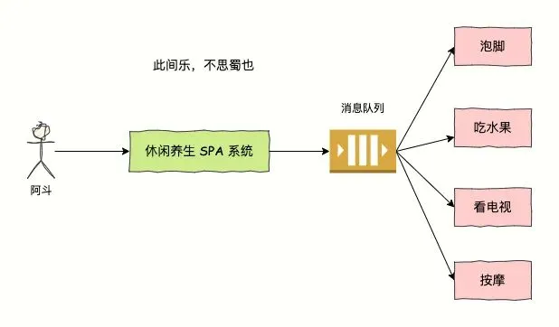
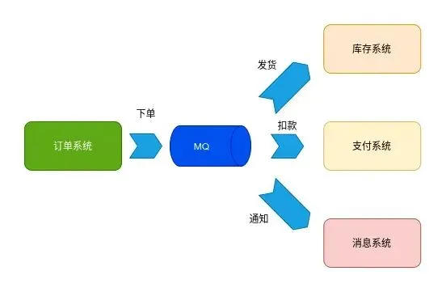
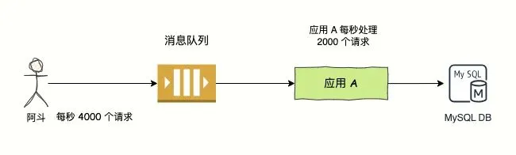
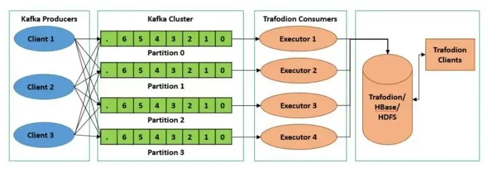
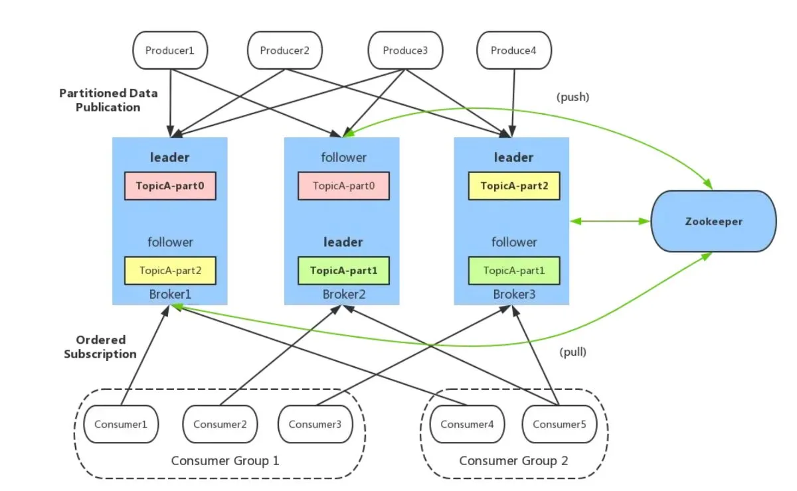
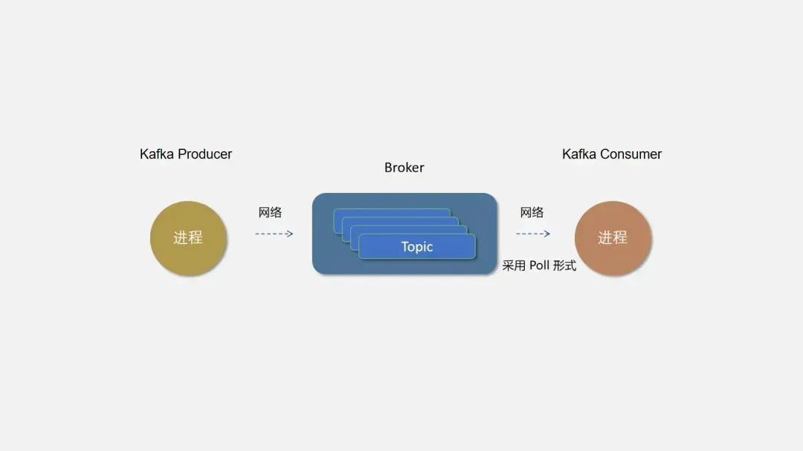
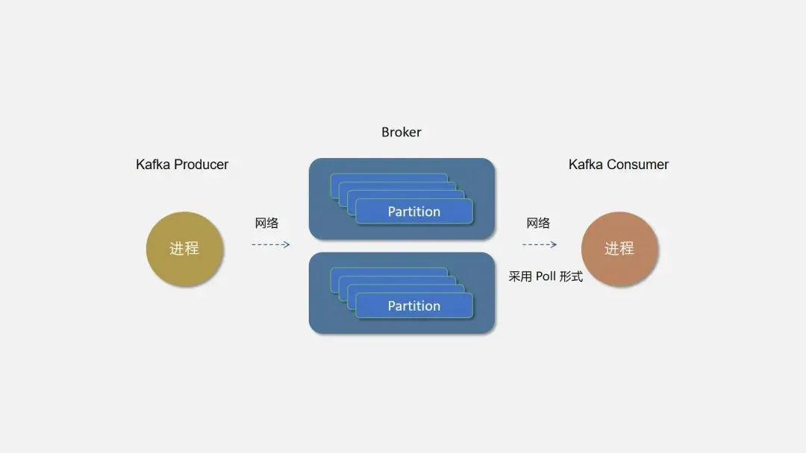
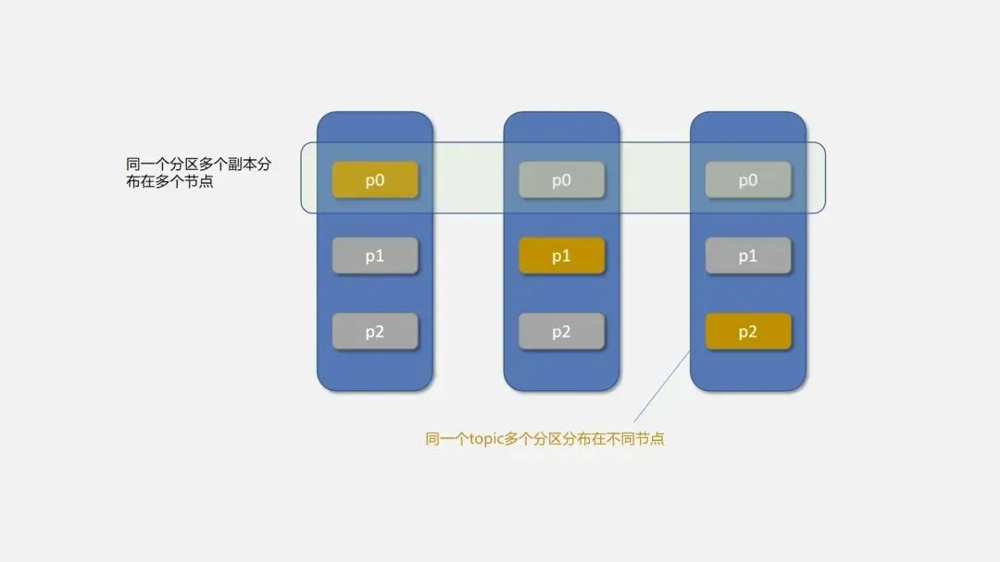
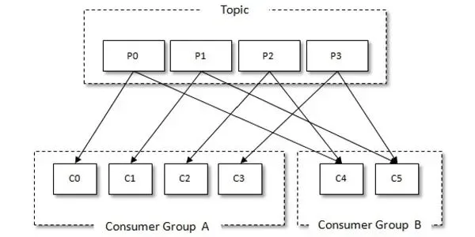
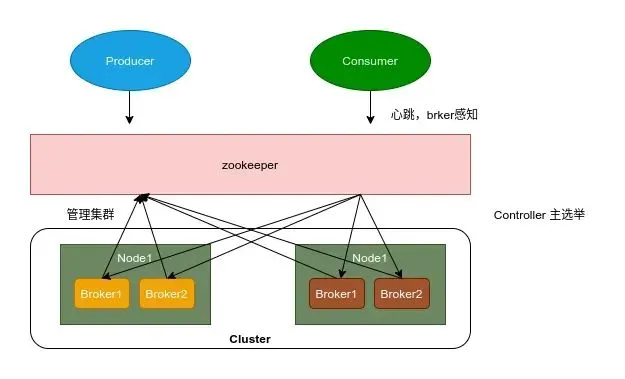

# 040|消息队列的 6 种经典使用场景和 Kafka 架构设计原理详细解析

我是码哥，可以叫我靓仔。今天来聊一聊 Kafka 消息队列的使用场景和核心架构实现原理，帮助你全面了解 Kafka 其内部工作原理和设计理念。。

Apache Kafka 是一个高吞吐量、分布式的流处理平台，广泛应用于实时数据管道和流处理应用中。

Kafka 以其高性能、低延迟、扩展性和可靠性，成为了大数据生态系统中的重要组件。

## **1.消息队列有什么作用**
消息队列是一种进程间通信或者同一个进程中不同线程间的通信方式，主要解决异步处理、应用耦合、流量消峰、负载均衡等问题，实现高性能、高可用、可伸缩和最终一致性架构，是大型分布式系统不可缺少的中间件。

kafka 本质也是一个消息队列，如下图，上游系统将消息发送到消息中间件，下游系统从消息中间件中获取消息消费。

马楼：“上游系统为什么不直接发消息给下游系统，搞个中间商干啥？”

这就要从消息队列的主要作用说起了。

### **异步处理**
消息队列可以实现异步通信，使得发送消息的组件不需要等待接收消息的组件处理完毕，从而提高系统的响应速度和处理效率。

如下图所示，阿斗被邀请去休闲养生 SPA 享受，服务包含泡脚、按摩、吃水果、看电视。

SPA 系统只需要验证啊斗的会员卡有钱就也可以服务了，串行化执行的每个步骤的话，体验太差。可以同时进行，快乐加倍。泡脚、按摩的同时可以同时吃水果看电视，大大提升体验。

### **应用解耦**
如下图所示，采用了消息中间件之后，订单系统将下单消息发送到 MQ 存储，然后各个下游系统从 MQ 中获取消息并执行对应的业务逻辑。

这种异步的方式，减少了服务之间的耦合程度，不然的话，维护订单系统的马楼要哭死，下单后调用多个下游系统，有的系统通过接口调用还必须要求重试机制不能丢失。

有了消息队列后，利用 MQ 本身提供的高可用保证数据不丢失，另外不管你是王启年还是范闲，我就放到消息队列中，你们自己从 MQ 拿，不用再去联系每个系统的维护人员。

### **流量削峰**
在流量高峰期，消息队列可以充当缓冲区，平滑高峰流量，避免系统因瞬时高负载而崩溃。

比如某个接口平时的流量也就 100TPS，特殊时刻会暴增，达到 4000 TPS，一般来说，MySQL 每秒可以处理 2000 个请求，每秒 4000 个请求，可能直接把 MySQL 搞崩溃。

你可以通过消息队列来进行流量削峰，防止把 MySQL 干爆，引入 MQ 后，先将请求存到 MQ 中，MySQL 慢慢处理请求。

### **负载均衡**
Kafka 的 Topic 可以分成多个 Partition，每个 Paritition 类似于一个队列，单个 Paritition 可以保证数据有序。

Kafka 具有优秀的分区分配算法——StickyAssignor，把生产者的消息发送到不同 Paritition，保证 Paritition 的分配尽量地均衡。这样，整个集群的分区尽量地均衡，各个 Broker 和 Consumer 的处理不至于出现太大的倾斜。

同一个 Consumer Group 下的 Consumer 并发消费 Paritition，需要注意的是，**如果 Consumer Group 下的 Consumer 个数超过 Partition 数量，那么会出现空闲 Consumer。**

### **顺序保证**
每个 Kafka 主题（Topic）可以分为多个分区（Partition）。每个分区都是一个有序的、不可变的消息队列。

生产者（Producer）将消息发送到分区时，Kafka 按消息的发送顺序将其追加到分区的末尾。

消费者（Consumer）读取分区中的消息时，也是按照消息的存储顺序逐条读取。

因此，在同一个分区内，消息的顺序是严格保证的。这对于某些业务场景来说非常重要，特别是需要保证消息顺序性的应用，例如金融交易、订单处理等。

针对消息有序的业务需求，还分为全局有序和局部有序。

+ 全局有序：一个 Topic 下的所有消息都需要按照生产顺序消费。
+ 局部有序：一个 Topic 下的消息，只需要满足同一业务字段的要按照生产顺序消费。例如：Topic 消息是订单的流水表，包含订单 orderId，业务要求同一个 orderId 的消息需要按照生产顺序进行消费。

**全局有序**

Kafka 的一个 Topic 可分为多个 Partition，Producer 发送消息的时候，kafka 会使用负载均衡策略将消息发送到其中一个 Partition，会导致顺序是乱的。

**要保证全局有序，那么一个 Topic 只能存在一个 Partition。**而且对应的 Consumer 也要使用单线程或者保证消费顺序的线程模型。

**局部有序**

要满足局部有序，只需要在发消息的时候指定 Partition Key，Kafka 对其进行 Hash 计算，根据计算结果决定放入哪个 Partition。这样 Partition Key 相同的消息会放在同一个 Partition，从而保证有序。

此时，Partition 的数量仍然可以设置多个，提升 Topic 的整体吞吐量。

### **容错性**
Kafka 提供了消息持久化、重试机制和确认机制，确保消息不会丢失或重复处理，增强系统的容错能力。

## **2. Kafka 核心组件**
终于到今天的主角登场，直接上图。

Kafka 的核心架构由以下几个主要组件组成：

1. **Producer（生产者）**：发送消息的一方，负责发布消息到 Kafka 主题（Topic）。
2. **Consumer（消费者）**：接受消息的一方，订阅主题并处理消息。
3. **Broker（代理）**：服务代理节点，Kafka 集群中的一台服务器就是一个 broker，可以水平无限扩展，同一个 Topic 的消息可以分布在多个 broker 中。
4. **Topic（主题）**：Kafka 中的消息以 Topic 为单位进行划分，生产者将消息发送到特定的 Topic，而消费者负责订阅 Topic 的消息并进行消费。
5. **Partition（分区）**：主题的物理分片，提高了并行处理能力。
6. **Replica（副本）**：副本，是 Kafka 保证数据高可用的方式，Kafka 同一 Partition 的数据可以在多 Broker 上存在多个副本，通常只有主副本对外提供读写服务，当主副本所在 broker 崩溃或发生网络一场，Kafka 会在 Controller 的管理下会重新选择新的 Leader 副本对外提供读写服务。
7. **ZooKeeper**：管理 Kafka 集群的元数据和分布式协调。

## **3. Topic 和 Partition**
来看下什么是 Topic 和 Partition。

### **3.1 主题（Topic）**
Topic 是 Kafka 中数据的逻辑分类单元，可以理解成一个队列。Broker 是所有队列部署的机器，Producer 将消息发送到特定的 Topic，而 Consumer 则从特定的 Topic 中消费消息。

### **3.2 分区（Partition）**
为了提高并行处理能力和扩展性，Kafka 将一个 Topic 分为多个 Partition。

每个 Partition 是一个有序的消息队列，消息在 Partition 内部是有序的，但在不同的 Partition 之间没有顺序保证。

Producer 可以并行地将消息发送到不同的 Partition，Consumer 也可以并行地消费不同的 Partition，从而提升整体处理能力。

### **3.3 副本（Replica）**
每个 Partition 可以有多个副本（Replica），分布在不同的 Broker 上。

Kafka 会为分区的多个副本选举一个作为主副本(Leader)，主副本对外提供读写服务，从副本(Follower)实时同步 Leader 的数据。

Kafka 通过副本机制实现高可用性，当一个 Broker 故障时，可以通过副本保证数据不丢失，并继续提供服务。

如下图所示，黄色表示 leader，灰色表示 follower。Topic 分了三个 Patition，副本数是 2。

## **4. Consumer 和 ConsumerGroup**
Kafka 有消费组的概念，每个消费者只能消费所分配到的分区的消息，每一个分区只能被一个消费组中的一个消费者所消费，所以同一个消费组中消费者的数量如果超过了分区的数量，将会出现有些消费者分配不到消费的分区。消费组与消费者关系如下图所示：

## **5. 数据存储机制**
Kafka 的数据存储机制采用了顺序写入磁盘的方式，通过这种方式来提高写入性能。

每个 Partition 的消息被存储在多个 Segment 文件中，每个 Segment 文件由一组连续的消息组成。Segment 文件通过索引和日志文件进行管理，索引文件记录了每条消息在日志文件中的偏移量。

Kafka 的存储机制具备以下几个特点：

1. **顺序写入**：Kafka 通过顺序写入来提高写入速度和磁盘利用率。
2. **Segment 文件**：消息被分段存储，便于管理和清理。
3. **索引机制**：通过索引快速定位消息，提高读取效率。
4. **日志清理策略**：支持基于时间和大小的日志清理策略，确保存储空间的有效利用。

## **6. 高可用性和容错机制**
Kafka 通过以下几种机制来实现高可用性和容错性：

1. **副本机制**：每个 Partition 有多个副本，主副本（Leader）负责读写操作，其它副本（Follower）定期从 Leader 同步数据。当 Leader 发生故障时，会从 Follower 中选举新的 Leader。
2. **ACK 机制**：Producer 发送消息时，可以通过设置 ACK 来确保消息被成功写入 Leader 和 Follower，从而保证数据不丢失。
3. **ISR（In-Sync Replica）机制**：Kafka 维护一个 ISR 列表，记录当前与 Leader 保持同步的副本。只有在 ISR 列表中的副本才会参与 Leader 选举。
4. **ZooKeeper 协调**：Kafka 使用 ZooKeeper 进行分布式协调，管理元数据和集群状态。ZooKeeper 负责管理 Broker 的注册信息、Topic 和 Partition 的元数据以及 Leader 选举等。

## **7. 消息传递保证**
Kafka 提供了三种消息传递保证：

1. **At most once**：消息最多传递一次，可能丢失。
2. **At least once**：消息至少传递一次，可能重复。
3. **Exactly once**：消息准确传递一次，Kafka 在 0.11.0.0 版本引入了事务机制，支持端到端的精确一次语义。

## **8. ZooKeeper 的作用**
Kafka 将 Broker、Topic 和 Partition 的元数据信息存储在 Zookeeper 上。通过在 Zookeeper 上建立相应的数据节点，并监听节点的变化，Kafka 使用 Zookeeper 完成以下功能：

1. **元数据管理**：存储 Kafka 的元数据，包括 Broker 列表、Topic 和 Partition 信息、ISR 列表等。
2. **分布式协调**：负责 Broker 的注册和发现、Leader 选举、负载均衡等。
3. **状态监控**：监控 Kafka 集群的运行状态，保证系统的一致性和高可用性。

+ Broker 注册：Broker 是分布式部署并且之间相互独立，Zookeeper 用来管理注册到集群的所有 Broker 节点。
+ Topic 注册：在 Kafka 中，同一个 Topic 的消息会被分成多个分区并将其分布在多个 Broker 上，这些分区信息及与 Broker 的对应关系也都是由 Zookeeper 在维护
+ 生产者负载均衡：由于同一个 Topic 消息会被分区并将其分布在多个 Broker 上，因此，生产者需要将消息合理地发送到这些分布式的 Broker 上。
+ 消费者负载均衡：与生产者类似，Kafka 中的消费者同样需要进行负载均衡来实现多个消费者合理地从对应的 Broker 服务器上接收消息，每个消费者分组包含若干消费者，每条消息都只会发送给分组中的一个消费者，不同的消费者分组消费自己特定的 Topic 下面的消息，互不干扰。

## **8. Kafka 的扩展性**
Kafka 的扩展性主要体现在以下几个方面：

1. **水平扩展**：通过增加 Broker 节点，可以轻松扩展 Kafka 集群的存储和处理能力。
2. **Partition 扩展**：通过增加 Partition 数量，可以提高 Topic 的并行处理能力。
3. **动态配置**：Kafka 支持在运行时动态调整部分配置，如 Topic 的分区数量和副本因子等。

> 更新: 2025-09-01 11:42:31  
> 原文: <https://www.yuque.com/yuqueyonghue6cvnv/cxhfwd/gxi5gel7rckqp6w3>