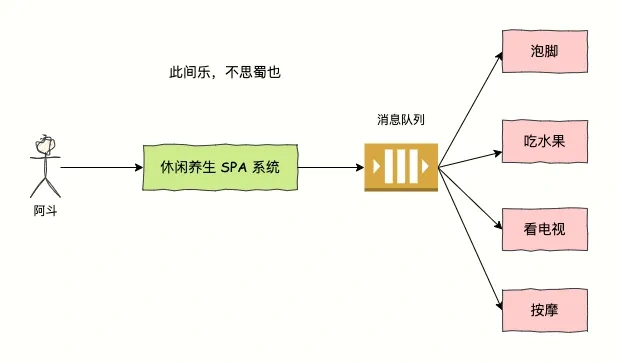
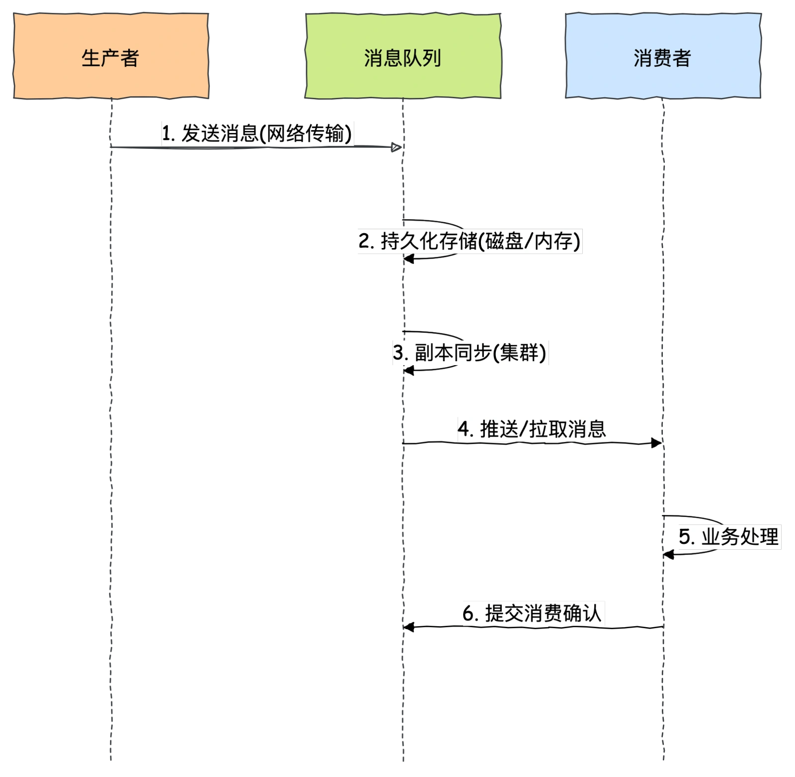
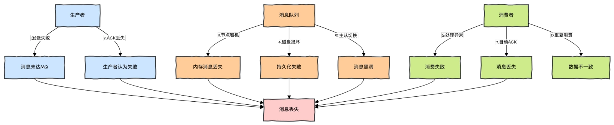
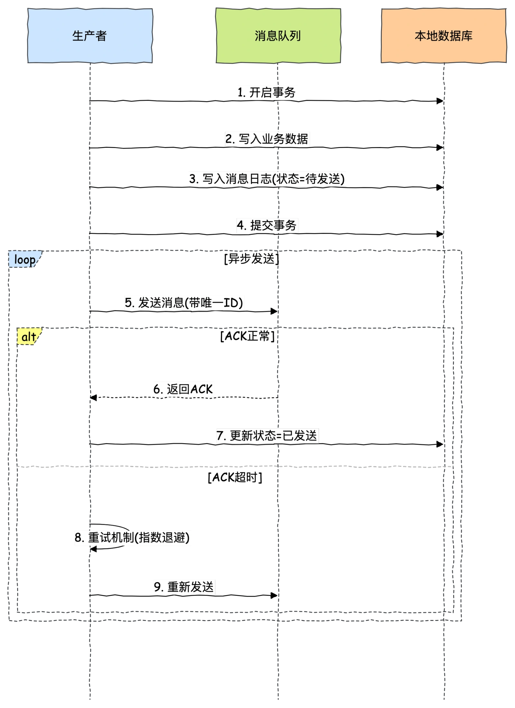
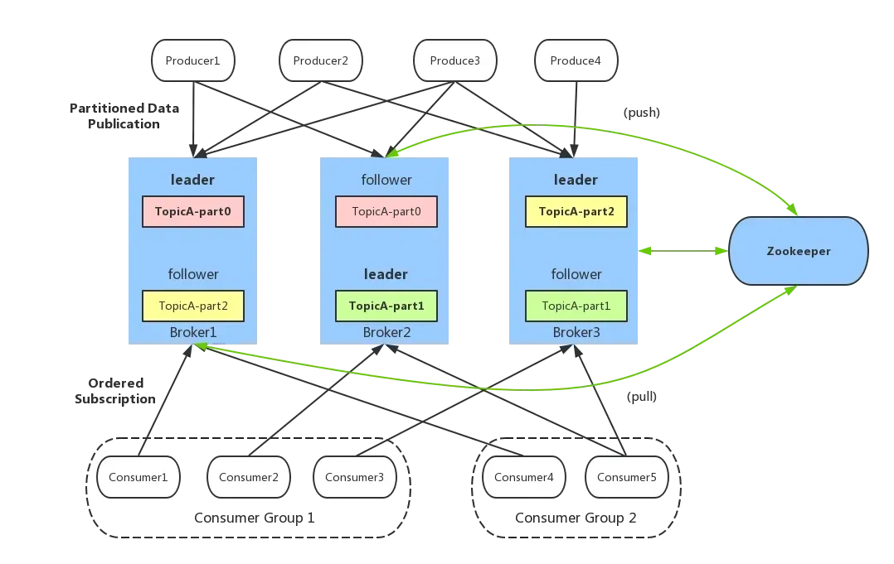
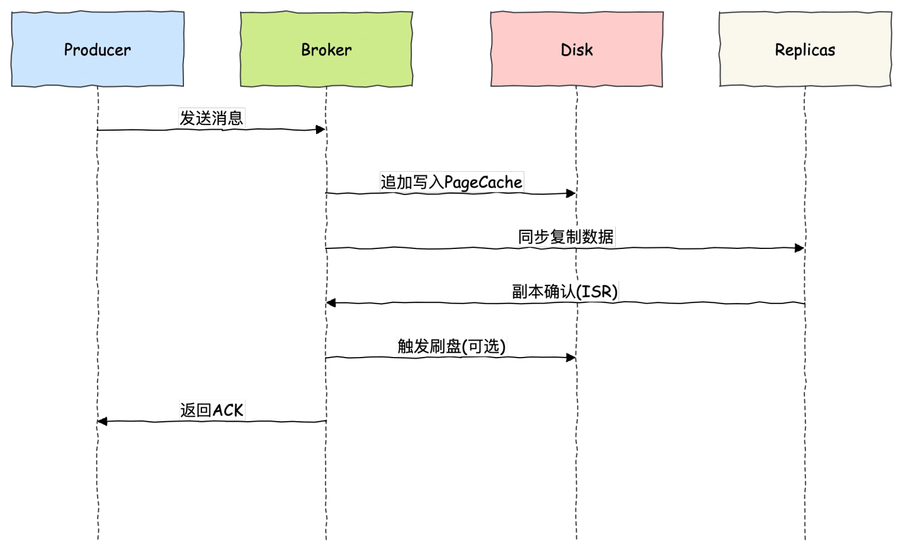
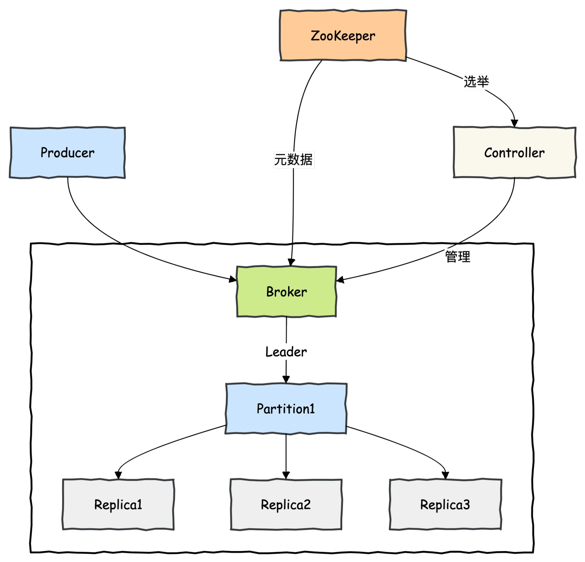
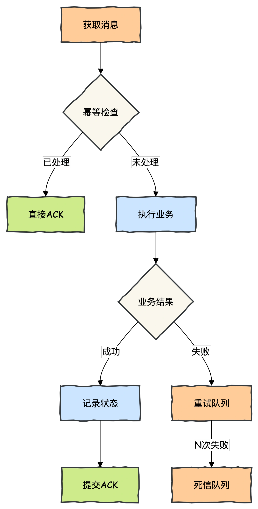
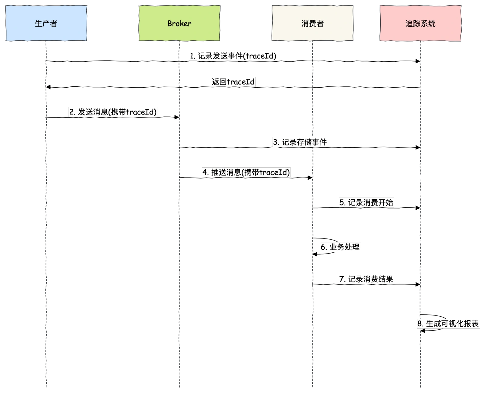

# 041|如何保证MQ消息不丢失？重复消费如何保证幂等？

<font style="color:rgb(51, 51, 51);background-color:rgb(248, 246, 244);">你好，见字如面。我是《Redis 高手心法》作者，腾讯云架构师同盟深圳区理事会成员、InfoQ 签约作者码哥，是一个手持菜刀砍电线，一路火花带闪电的靓仔。</font>

<font style="color:rgb(51, 51, 51);background-color:rgb(248, 246, 244);">面试官在面试候选人时，如果发现候选人的简历中写了在项目中使用了 MQ 技术（如 Kafka、RabbitMQ、RocketMQ），基本都会抛出一个问题：</font>**<font style="color:rgb(34, 34, 34);background-color:rgb(248, 246, 244);">在使用 MQ 的时候，怎么确保消息 100% 不丢失？重复消费如何保证幂等？</font>**

<font style="color:rgb(51, 51, 51);background-color:rgb(248, 246, 244);">这两个问题在实际工作中也很常见，既能考察你对 MQ 的掌握程度又能很好的判断是否有对应的实战经验。</font>

<font style="color:rgb(51, 51, 51);background-color:rgb(248, 246, 244);">本文将深入剖析消息丢失的本质原因，揭示 MQ 核心实现原理，并提供一套完整的 Java 实战解决方案。</font>

## **<font style="color:rgb(34, 34, 34);background-color:rgb(248, 246, 244);">消息传递的生命周期</font>**
<font style="color:rgb(51, 51, 51);background-color:rgb(248, 246, 244);">如下图所示，阿斗被邀请去休闲养生 SPA 享受，服务包含泡脚、按摩、吃水果、看电视，玩真人 CS。</font>



+ <font style="color:rgb(51, 51, 51);background-color:rgb(248, 246, 244);">生产者：休闲养生 SPA 系统，发送一条消息到 MQ。</font>
+ <font style="color:rgb(51, 51, 51);background-color:rgb(248, 246, 244);">MQ 消息队列：存储消息。</font>
+ <font style="color:rgb(51, 51, 51);background-color:rgb(248, 246, 244);">消息消费者：享受泡脚技师帮泡脚、按摩技师肩背按摩、推油技师推背，同时吃水果看电视（估计是不会看电视了）。</font>

<font style="color:rgb(51, 51, 51);background-color:rgb(248, 246, 244);">此间乐不思蜀也……</font>

<font style="color:rgb(51, 51, 51);background-color:rgb(248, 246, 244);">消息的生命周期如下图所示。</font>



<font style="color:rgb(51, 51, 51);background-color:rgb(248, 246, 244);">你可以发现，从生产者发送消息，MQ 保存消息，消费者消费消息，每一个环节都有可能丢失消息。</font>



### **<font style="color:rgb(34, 34, 34);background-color:rgb(248, 246, 244);">各环节丢失概率统计</font>**
**<font style="color:rgb(34, 34, 34);background-color:rgb(248, 246, 244);">环节故障概率平均恢复时间</font>**<font style="color:rgb(51, 51, 51);background-color:rgb(248, 246, 244);">网络传输0.1%-1%秒级内存存储0.01%-0.1%分钟级磁盘故障0.001%-0.01%小时级程序异常0.1%-5%分钟级</font>

### **<font style="color:rgb(34, 34, 34);background-color:rgb(248, 246, 244);">典型业务场景代价</font>**
+ **<font style="color:rgb(34, 34, 34);background-color:rgb(248, 246, 244);">支付系统</font>**<font style="color:rgb(51, 51, 51);background-color:rgb(248, 246, 244);">：单条消息丢失 ≈ 平均订单金额(如 1000 元)</font>
+ **<font style="color:rgb(34, 34, 34);background-color:rgb(248, 246, 244);">库存系统</font>**<font style="color:rgb(51, 51, 51);background-color:rgb(248, 246, 244);">：1%消息丢失率 ≈10 倍超卖风险</font>
+ **<font style="color:rgb(34, 34, 34);background-color:rgb(248, 246, 244);">物流追踪</font>**<font style="color:rgb(51, 51, 51);background-color:rgb(248, 246, 244);">：消息丢失率>0.1%≈ 客户投诉率提升 300%</font>

## **<font style="color:rgb(34, 34, 34);background-color:rgb(248, 246, 244);">消息生产者</font>**
<font style="color:rgb(51, 51, 51);background-color:rgb(248, 246, 244);">当生产者往 MQ 中写数据时，以下场景会导致消息丢失：</font>

1. **<font style="color:rgb(34, 34, 34);background-color:rgb(248, 246, 244);">网络闪断</font>**<font style="color:rgb(51, 51, 51);background-color:rgb(248, 246, 244);">：发送过程中网络中断</font>
2. **<font style="color:rgb(34, 34, 34);background-color:rgb(248, 246, 244);">ACK 丢失</font>**<font style="color:rgb(51, 51, 51);background-color:rgb(248, 246, 244);">：MQ 成功处理但确认丢失</font>
3. **<font style="color:rgb(34, 34, 34);background-color:rgb(248, 246, 244);">发送超时</font>**<font style="color:rgb(51, 51, 51);background-color:rgb(248, 246, 244);">：网络延迟导致超时误判</font>
4. **<font style="color:rgb(34, 34, 34);background-color:rgb(248, 246, 244);">程序崩溃</font>**<font style="color:rgb(51, 51, 51);background-color:rgb(248, 246, 244);">：处理中进程意外退出</font>

<font style="color:rgb(51, 51, 51);background-color:rgb(248, 246, 244);">生产者发送消息，主流消息队列都支持同步发送和异步发送。</font>

<font style="color:rgb(51, 51, 51);background-color:rgb(248, 246, 244);">如果使用同步发送，生产者发送消息后，会同步等待 Broker 返回的 ACK，收到 ACK 消息，就认为消息发送成功。如果长时间没有收到，则会认为消息发送失败，需要进行重试。</font>

### **<font style="color:rgb(34, 34, 34);background-color:rgb(248, 246, 244);">本地消息表 + 异步重试</font>**
<font style="color:rgb(51, 51, 51);background-color:rgb(248, 246, 244);">消息发送的流程如下图所示，基于本地消息表 + 业务数据表构成本地事务。</font>

<font style="color:rgb(51, 51, 51);background-color:rgb(248, 246, 244);">通过消息一步发送并接受消息队列的 ACK 来更新消息表状态，若果未发送则继续重试发送，保证消息一定发送出去。</font>



<font style="color:rgb(51, 51, 51);background-color:rgb(248, 246, 244);">代码案例如下所示：</font>

```plain
@Service
public class ReliableProducer {

    @Autowired
    private JdbcTemplate jdbcTemplate;

    @Autowired
    private KafkaTemplate<String, String> kafkaTemplate;

    @Transactional
    public void createOrder(Order order) {
        // 1. 业务数据入库
        jdbcTemplate.update(
            "INSERT INTO orders(id, amount) VALUES(?, ?)",
            order.getId(), order.getAmount());

        // 2. 消息记录入库
        String msgId = UUID.randomUUID().toString();
        jdbcTemplate.update(
            "INSERT INTO message_log(msg_id, topic, message, status) VALUES(?, ?, ?, ?)",
            msgId, "orders", JsonUtil.toJson(order), 0); // 0-待发送

        // 事务提交后触发异步发送
        CompletableFuture.runAsync(() -> sendWithRetry(msgId));
    }

    // 这里其实可以使用 xxl-job 等分布式调度框架查询未发送成功的消息发送。
    private void sendWithRetry(String msgId) {
        MessageRecord msg = jdbcTemplate.queryForObject(
            "SELECT * FROM message_log WHERE msg_id = ?",
            new MessageRecordRowMapper(), msgId);

        int attempt = 0;
        while (attempt < MAX_RETRIES) {
            try {
                ListenableFuture<SendResult<String, String>> future =
                    kafkaTemplate.send(msg.getTopic(), msg.getMessage());

                future.addCallback(result -> {
                    // 更新发送状态
                    jdbcTemplate.update("UPDATE message_log SET status = 1 WHERE msg_id = ?", msgId);
                }, ex -> {
                    scheduleRetry(msgId, attempt); // 失败重试
                });

                return;
            } catch (Exception e) {
                scheduleRetry(msgId, attempt);
                attempt++;
            }
        }
    }

    private void scheduleRetry(String msgId, int attempt) {
        long delay = (long) Math.pow(2, attempt) * 1000; // 指数退避
        scheduler.schedule(() -> sendWithRetry(msgId), delay, TimeUnit.MILLISECONDS);
    }
}
```

### **<font style="color:rgb(34, 34, 34);background-color:rgb(248, 246, 244);">ACK 机制原理对比</font>**
**<font style="color:rgb(34, 34, 34);background-color:rgb(248, 246, 244);">MQ 类型ACK 机制可靠性性能影响</font>**<font style="color:rgb(51, 51, 51);background-color:rgb(248, 246, 244);">Kafkaacks=0最低无Kafkaacks=1中等低Kafkaacks=all最高高RabbitMQ无确认低无RabbitMQ生产者确认高中等RocketMQ同步刷盘最高高</font>

## **<font style="color:rgb(34, 34, 34);background-color:rgb(248, 246, 244);">MQ 服务端：消息 100%存储原理</font>**
<font style="color:rgb(51, 51, 51);background-color:rgb(248, 246, 244);">生产者发送消息成功，也不能保证消息绝对不丢失。因为即使消息发送到 Broker，如果在消费者拉取到消息之前，Broker 宕机了，消息还没有落盘，也会导致消息丢失。</font>

### **<font style="color:rgb(34, 34, 34);background-color:rgb(248, 246, 244);">kafka 存储架构剖析</font>**


1. **<font style="color:rgb(34, 34, 34);background-color:rgb(248, 246, 244);">Producer（生产者）</font>**<font style="color:rgb(51, 51, 51);background-color:rgb(248, 246, 244);">：发送消息的一方，负责发布消息到 Kafka 主题（Topic）。</font>
2. **<font style="color:rgb(34, 34, 34);background-color:rgb(248, 246, 244);">Consumer（消费者）</font>**<font style="color:rgb(51, 51, 51);background-color:rgb(248, 246, 244);">：接受消息的一方，订阅主题并处理消息。Kafka 有 ConsumerGroup 的概念，每个 Consumer 只能消费所分配到的 Partition 的消息，每一个 Partition 只能被一个 ConsumerGroup 中的一个 Consumer 所消费，所以同一个 ConsumerGroup 中 Consumer 的数量如果超过了 Partiton 的数量，将会出现有些 Consumer 分配不到 partition 消费。</font>
3. **<font style="color:rgb(34, 34, 34);background-color:rgb(248, 246, 244);">Broker（代理）</font>**<font style="color:rgb(51, 51, 51);background-color:rgb(248, 246, 244);">：服务代理节点，Kafka 集群中的一台服务器就是一个 broker，可以水平无限扩展，</font>**<font style="color:rgb(34, 34, 34);background-color:rgb(248, 246, 244);">同一个 Topic 的消息可以分布在多个 broker 中</font>**<font style="color:rgb(51, 51, 51);background-color:rgb(248, 246, 244);">。</font>
4. **<font style="color:rgb(34, 34, 34);background-color:rgb(248, 246, 244);">Topic（主题）与 Partition（分区）</font>**<font style="color:rgb(51, 51, 51);background-color:rgb(248, 246, 244);"> </font><font style="color:rgb(51, 51, 51);background-color:rgb(248, 246, 244);">：Kafka 中的消息以 Topic 为单位进行划分，生产者将消息发送到特定的 Topic，而消费者负责订阅 Topic 的消息并进行消费。</font>**<font style="color:rgb(34, 34, 34);background-color:rgb(248, 246, 244);">图中 TopicA 有三个 Partiton（TopicA-par0、TopicA-par1、TopicA-par2）</font>**<font style="color:rgb(51, 51, 51);background-color:rgb(248, 246, 244);">为了提升整个集群的吞吐量，Topic 在物理上还可以细分多个 Partition，一个 Partition 在磁盘上对应一个文件夹。</font>
5. **<font style="color:rgb(34, 34, 34);background-color:rgb(248, 246, 244);">Replica（副本）</font>**<font style="color:rgb(51, 51, 51);background-color:rgb(248, 246, 244);">：副本，是 Kafka 保证数据高可用的方式，Kafka</font><font style="color:rgb(51, 51, 51);background-color:rgb(248, 246, 244);"> </font>**<font style="color:rgb(34, 34, 34);background-color:rgb(248, 246, 244);">同一 Partition 的数据可以在多 Broker 上存在多个副本</font>**<font style="color:rgb(51, 51, 51);background-color:rgb(248, 246, 244);">，通常只有 leader 副本对外提供读写服务，当 leader 副本所在 broker 崩溃或发生网络一场，Kafka 会在 Controller 的管理下会重新选择新的 Leader 副本对外提供读写服务。</font>
6. **<font style="color:rgb(34, 34, 34);background-color:rgb(248, 246, 244);">ZooKeeper</font>**<font style="color:rgb(51, 51, 51);background-color:rgb(248, 246, 244);">：管理 Kafka 集群的元数据和分布式协调。</font>

### **<font style="color:rgb(34, 34, 34);background-color:rgb(248, 246, 244);">同步刷盘</font>**
<font style="color:rgb(51, 51, 51);background-color:rgb(248, 246, 244);">kafka 为了得到更高的性能和吞吐量，将数据异步批量的存储在磁盘中。</font>

<font style="color:rgb(51, 51, 51);background-color:rgb(248, 246, 244);">消息的刷盘过程，为了提高性能，减少刷盘次数，kafka 采用了批量刷盘的做法。即，按照一定的消息量，和时间间隔进行刷盘。</font>

<font style="color:rgb(51, 51, 51);background-color:rgb(248, 246, 244);">这种机制也是由于 linux 操作系统决定的。</font>

<font style="color:rgb(51, 51, 51);background-color:rgb(248, 246, 244);">将数据存储到 linux 操作系统种，会先存储到页缓存（Page cache）中，按照时间或者其他条件进行刷盘（从 page cache 到 file），或者通过 fsync 命令强制刷盘。</font>



<font style="color:rgb(51, 51, 51);background-color:rgb(248, 246, 244);">数据在 page cache 中时，如果系统挂掉，数据会丢失。</font>

**<font style="color:rgb(34, 34, 34);background-color:rgb(248, 246, 244);">kafka 可靠性黄金配置</font>**

<font style="color:rgb(51, 51, 51);background-color:rgb(248, 246, 244);">如图所示的 kafka 集群，一个 Broker 的 Topic 其中一个 partition 一共有三 副本（包含 Leader）。</font>



**<font style="color:rgb(34, 34, 34);background-color:rgb(248, 246, 244);">试想一种情况：假如 leader 副本所在的 broker 突然挂掉，那么就要从 follower 副本重新选出一个 leader ，但是 leader 的数据还有一些没有被 follower 副本的同步的话，就会造成消息丢失。</font>**

<font style="color:rgb(51, 51, 51);background-color:rgb(248, 246, 244);">解决办法就是我们设置 acks = all。acks 是 Kafka 生产者(Producer) 很重要的一个参数。</font>

<font style="color:rgb(51, 51, 51);background-color:rgb(248, 246, 244);">acks 的默认值即为 1，代表我们的消息被 leader 副本接收之后就算被成功发送。当我们配置 acks = all 代表则所有副本都要接收到该消息之后该消息才算真正成功被发送。</font>

<font style="color:rgb(51, 51, 51);background-color:rgb(248, 246, 244);">该场景的 Kafka Broker 黄金高可靠配置如下：</font>

```plain
# Kafka配置示例
acks=all
min.insync.replicas=2 // 最小同步副本数
replication.factor=3  // 每个分区的 总副本数量（含 Leader）
unclean.leader.election.enable=false
log.flush.interval.messages=10000
log.flush.interval.ms=1000
```

+ <font style="color:rgb(51, 51, 51);background-color:rgb(248, 246, 244);">acks=all：生产者要求所有</font><font style="color:rgb(51, 51, 51);background-color:rgb(248, 246, 244);"> </font>**<font style="color:rgb(34, 34, 34);background-color:rgb(248, 246, 244);">ISR（In-Sync Replicas）副本</font>**<font style="color:rgb(51, 51, 51);background-color:rgb(248, 246, 244);"> </font><font style="color:rgb(51, 51, 51);background-color:rgb(248, 246, 244);">都成功写入消息后才返回确认。</font>
+ <font style="color:rgb(51, 51, 51);background-color:rgb(248, 246, 244);">min.insync.replicas：定义</font><font style="color:rgb(51, 51, 51);background-color:rgb(248, 246, 244);"> </font>**<font style="color:rgb(34, 34, 34);background-color:rgb(248, 246, 244);">最小同步副本数</font>**<font style="color:rgb(51, 51, 51);background-color:rgb(248, 246, 244);">，必须至少有 2 个副本处于同步状态（含 Leader）。</font>
    - <font style="color:rgb(51, 51, 51);background-color:rgb(248, 246, 244);">当 replication.factor=3 且 min.insync.replicas=2 时：允许 1 个副本宕机（如 Broker 故障）、若 2 个副本不可用，则生产会被阻塞</font>
+ <font style="color:rgb(51, 51, 51);background-color:rgb(248, 246, 244);">replication.factor=3：每个分区的</font><font style="color:rgb(51, 51, 51);background-color:rgb(248, 246, 244);"> </font>**<font style="color:rgb(34, 34, 34);background-color:rgb(248, 246, 244);">总副本数量</font>**<font style="color:rgb(51, 51, 51);background-color:rgb(248, 246, 244);">（含 Leader），为了保证整个 Kafka 服务的高可用性，你还需要确保 replication.factor > min.insync.replicas ，一般推荐设置成 replication.factor = min.insync.replicas + 1。</font>
+ <font style="color:rgb(51, 51, 51);background-color:rgb(248, 246, 244);">unclean.leader.election.enable=false：禁止</font><font style="color:rgb(51, 51, 51);background-color:rgb(248, 246, 244);"> </font>**<font style="color:rgb(34, 34, 34);background-color:rgb(248, 246, 244);">非同步副本（Out-of-Sync）</font>**<font style="color:rgb(51, 51, 51);background-color:rgb(248, 246, 244);"> </font><font style="color:rgb(51, 51, 51);background-color:rgb(248, 246, 244);">成为 Leader。若允许非同步副本成为 Leader，可能导致已提交数据被覆盖，金融场景必须设为 false。</font>
    - <font style="color:rgb(51, 51, 51);background-color:rgb(248, 246, 244);">我们最开始也说了我们发送的消息会被发送到 leader 副本，然后 follower 副本才能从 leader 副本中拉取消息进行同步。</font>
    - <font style="color:rgb(51, 51, 51);background-color:rgb(248, 246, 244);">多个 follower 副本之间的消息同步情况不一样，当我们配置了 unclean.leader.election.enable = false 的话，当 leader 副本发生故障时就不会从 follower 副本中和 leader 同步程度达不到要求的副本中选择出 leader ，即只从 ISR 中选择 leader，这样降低了消息丢失的可能性。</font>
+ <font style="color:rgb(51, 51, 51);background-color:rgb(248, 246, 244);">log.flush.interval.messages=10000：每累积</font><font style="color:rgb(51, 51, 51);background-color:rgb(248, 246, 244);"> </font>**<font style="color:rgb(34, 34, 34);background-color:rgb(248, 246, 244);">10000 条消息</font>**<font style="color:rgb(51, 51, 51);background-color:rgb(248, 246, 244);"> </font><font style="color:rgb(51, 51, 51);background-color:rgb(248, 246, 244);">强制刷盘一次。</font>
+ <font style="color:rgb(51, 51, 51);background-color:rgb(248, 246, 244);">log.flush.interval.ms=1000：每</font><font style="color:rgb(51, 51, 51);background-color:rgb(248, 246, 244);"> </font>**<font style="color:rgb(34, 34, 34);background-color:rgb(248, 246, 244);">1000 毫秒（1 秒）</font>**<font style="color:rgb(51, 51, 51);background-color:rgb(248, 246, 244);"> </font><font style="color:rgb(51, 51, 51);background-color:rgb(248, 246, 244);">强制刷盘一次。</font>

## **<font style="color:rgb(34, 34, 34);background-color:rgb(248, 246, 244);">消费者保证 100% 处理原理</font>**
<font style="color:rgb(51, 51, 51);background-color:rgb(248, 246, 244);">消息在被追加到 Partition(分区)的时候都会分配一个特定的偏移（offset）。</font>

<font style="color:rgb(51, 51, 51);background-color:rgb(248, 246, 244);">偏移量（offset)表示 Consumer 当前消费到的 Partition(分区)的所在的位置。Kafka 通过偏移量（offset）可以保证消息在分区内的顺序性。</font>

<font style="color:rgb(51, 51, 51);background-color:rgb(248, 246, 244);">当消费者拉取到了分区的某个消息之后，消费者会自动提交了 offset。</font>

<font style="color:rgb(51, 51, 51);background-color:rgb(248, 246, 244);">自动提交的话会有一个问题，试想一下，当消费者刚拿到这个消息准备进行真正消费的时候，突然挂掉了，消息实际上并没有被消费，但是 offset 却被自动提交了。</font>

**<font style="color:rgb(34, 34, 34);background-color:rgb(248, 246, 244);">解决办法也比较粗暴，我们手动关闭自动提交 offset，每次在真正消费完消息之后之后再自己手动提交 offset 。</font>**

<font style="color:rgb(51, 51, 51);background-color:rgb(248, 246, 244);">这样会带来消息被重新消费的问题。比如你刚刚消费完消息之后，还没提交 offset，结果自己挂掉了，那么这个消息理论上就会被消费两次。</font>

<font style="color:rgb(51, 51, 51);background-color:rgb(248, 246, 244);">开启手动提交的时候消费端需要去保证幂等性。</font>



### **<font style="color:rgb(34, 34, 34);background-color:rgb(248, 246, 244);">幂等消费 + 死信队列</font>**
```typescript
@Slf4j
@Component
public class ReliableConsumer {

    @Autowired
    private RedisTemplate<String, String> redisTemplate;

    @Autowired
    private OrderService orderService;

    @KafkaListener(topics = "orders")
    public void consume(ConsumerRecord<String, String> record) {
        String msgId = record.key();
        Order order = JsonUtil.fromJson(record.value(), Order.class);

        // 1. 幂等检查
        if (isProcessed(msgId)) {
            log.info("消息重复消费，已跳过: {}", msgId);
            return;
        }

        // 2. 获取分布式锁
        Lock lock = redisLockFactory.getLock("LOCK:" + msgId);
        if (!lock.tryLock(3, TimeUnit.SECONDS)) {
            throw new ConcurrentAccessException("获取锁失败");
        }

        try {
            // 3. 二次幂等检查（防并发）
            if (isProcessed(msgId)) {
                return;
            }

            // 4. 业务处理
            orderService.processOrder(order);

            // 5. 记录处理状态（设置24小时过期）
            markProcessed(msgId);
        } catch (BusinessException e) {
            // 6. 业务异常处理
            handleFailure(record, e);
        } finally {
            lock.unlock();
        }
    }

    private boolean isProcessed(String msgId) {
        return "PROCESSED".equals(
            redisTemplate.opsForValue().get("MSG:" + msgId));
    }

    private void markProcessed(String msgId) {
        redisTemplate.opsForValue().set(
            "MSG:" + msgId, "PROCESSED", 24, TimeUnit.HOURS);
    }

    private void handleFailure(ConsumerRecord<?, ?> record, Exception e) {
        // 失败计数
        int failCount = incrementFailCounter(record.key());

        if (failCount < 3) {
            throw new RetryableException(e); // 触发重试
        } else {
            sendToDlq(record); // 转移死信队列
        }
    }

    @Bean
    public ConcurrentKafkaListenerContainerFactory<?, ?> kafkaListenerContainerFactory() {
        ConcurrentKafkaListenerContainerFactory<Object, Object> factory =
            new ConcurrentKafkaListenerContainerFactory<>();
        factory.setConsumerFactory(consumerFactory());

        // 配置批量ACK（性能与可靠性的平衡）
        factory.getContainerProperties().setAckMode(
            AckMode.BATCH);

        // 消费并发控制
        factory.setConcurrency(3);

        return factory;
    }
}
```

## **<font style="color:rgb(34, 34, 34);background-color:rgb(248, 246, 244);">端到端保障：构建全链路防御体系</font>**
<font style="color:rgb(51, 51, 51);background-color:rgb(248, 246, 244);">除了对生产者、MQ 中间件、消费端保证不丢失消息的处理手段，还可以对消息轨迹进行监控。</font>



<font style="color:rgb(51, 51, 51);background-color:rgb(248, 246, 244);">自动化对账系统实现代码案例。</font>

```plain
@Service
@Slf4j
public class ReconciliationService {

    @Scheduled(cron = "0 0 2 * * ?") // 每天凌晨2点执行
    public void dailyReconciliation() {
        // 1. 生产端计数
        long produced = countProducerMessages();

        // 2. MQ端计数
        long stored = countMQMessages();

        // 3. 消费端计数
        long consumed = countConsumerMessages();

        // 4. 数据对比
        if (produced != stored) {
            handleLoss(produced - stored, "生产到MQ丢失");
        }

        if (stored != consumed) {
            handleLoss(stored - consumed, "MQ到消费丢失");
        }

        log.info("对账完成: 生产={}, MQ存储={}, 消费={}",
            produced, stored, consumed);
    }

    private void handleLoss(long lossCount, String stage) {
        log.error("消息丢失告警: 阶段={}, 数量={}", stage, lossCount);
        // 1. 通知运维团队
        alertService.notifyStaff(stage, lossCount);

        // 2. 自动恢复机制
        if (lossCount < 1000) {
            recoveryService.recoverFromBackup();
        } else {
            // 重大事故，启动紧急预案
            emergencyService.handleDisaster();
        }
    }
}
```

## **<font style="color:rgb(34, 34, 34);background-color:rgb(248, 246, 244);">总结</font>**
<font style="color:rgb(51, 51, 51);background-color:rgb(248, 246, 244);">消息零丢失的三位一体架构本质上是</font>**<font style="color:rgb(34, 34, 34);background-color:rgb(248, 246, 244);">对不确定性的系统化防御</font>**<font style="color:rgb(51, 51, 51);background-color:rgb(248, 246, 244);">：</font>

1. **<font style="color:rgb(34, 34, 34);background-color:rgb(248, 246, 244);">生产者防御</font>**<font style="color:rgb(51, 51, 51);background-color:rgb(248, 246, 244);">：建立冗余记录（消息表）对抗网络不确定性</font>
2. **<font style="color:rgb(34, 34, 34);background-color:rgb(248, 246, 244);">存储层防御</font>**<font style="color:rgb(51, 51, 51);background-color:rgb(248, 246, 244);">：通过副本机制抵御物理故障</font>
3. **<font style="color:rgb(34, 34, 34);background-color:rgb(248, 246, 244);">消费者防御</font>**<font style="color:rgb(51, 51, 51);background-color:rgb(248, 246, 244);">：依靠幂等性消除重试副作用</font>
4. **<font style="color:rgb(34, 34, 34);background-color:rgb(248, 246, 244);">监控层防御</font>**<font style="color:rgb(51, 51, 51);background-color:rgb(248, 246, 244);">：用全局视角捕捉异常情况</font>

<font style="color:rgb(51, 51, 51);background-color:rgb(248, 246, 244);">在 Java 生态中，我们拥有强大的工具集实现这套防御：</font>

+ <font style="color:rgb(51, 51, 51);background-color:rgb(248, 246, 244);">Spring 事务管理：确保本地事务一致性</font>
+ <font style="color:rgb(51, 51, 51);background-color:rgb(248, 246, 244);">Kafka/RabbitMQ 客户端：提供精细化的 ACK 控制</font>
+ <font style="color:rgb(51, 51, 51);background-color:rgb(248, 246, 244);">Redis 分布式锁：实现高并发下的幂等控制</font>


> 更新: 2025-11-20 09:25:14  
> 原文: <https://www.yuque.com/yuqueyonghue6cvnv/cxhfwd/xlc0oya0rr5gghts>