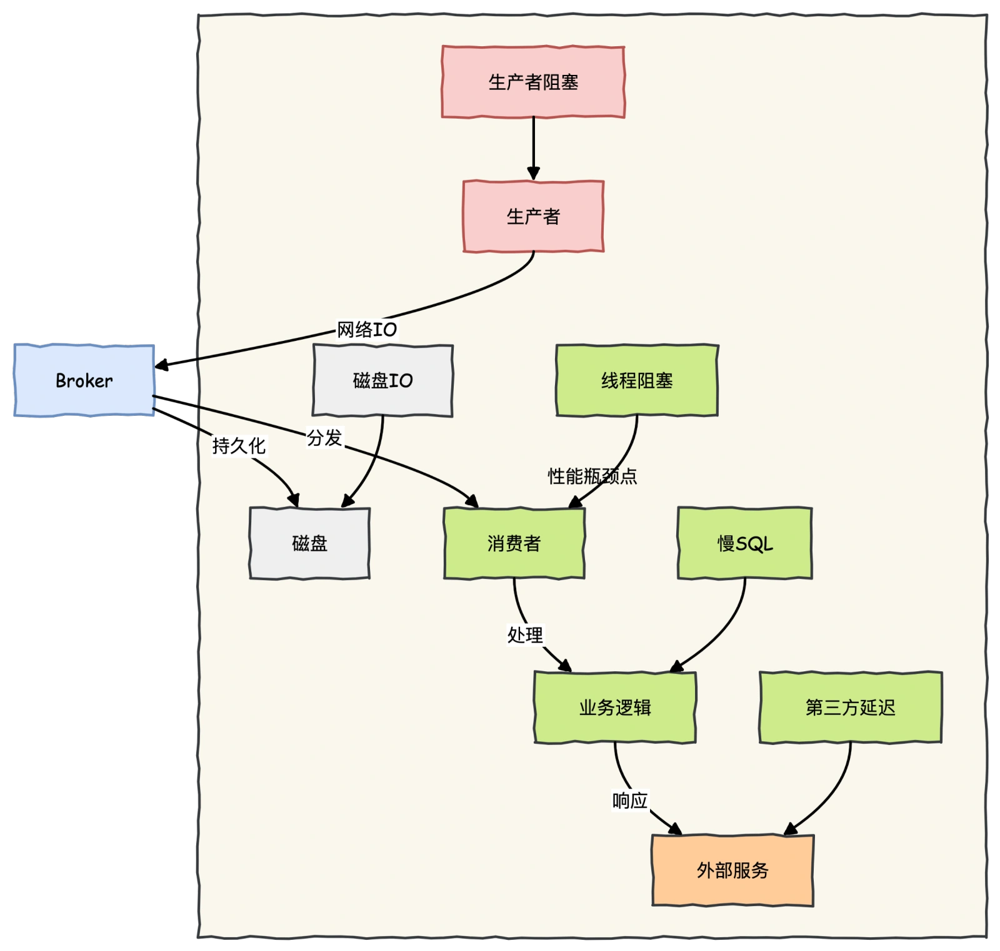
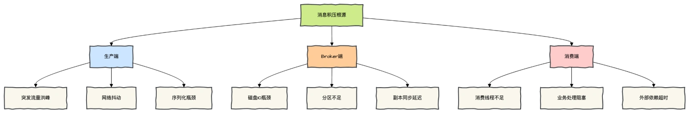
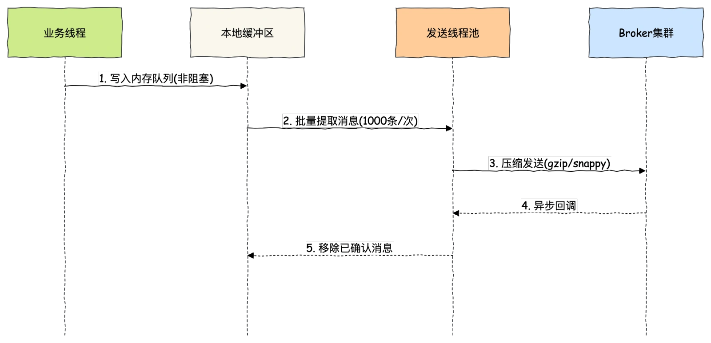
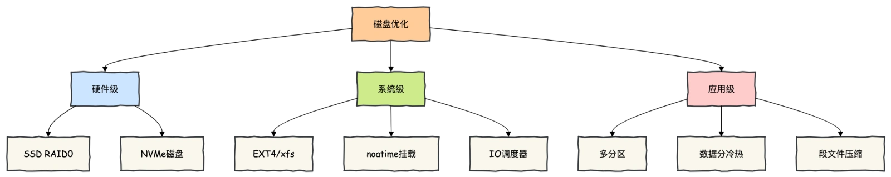
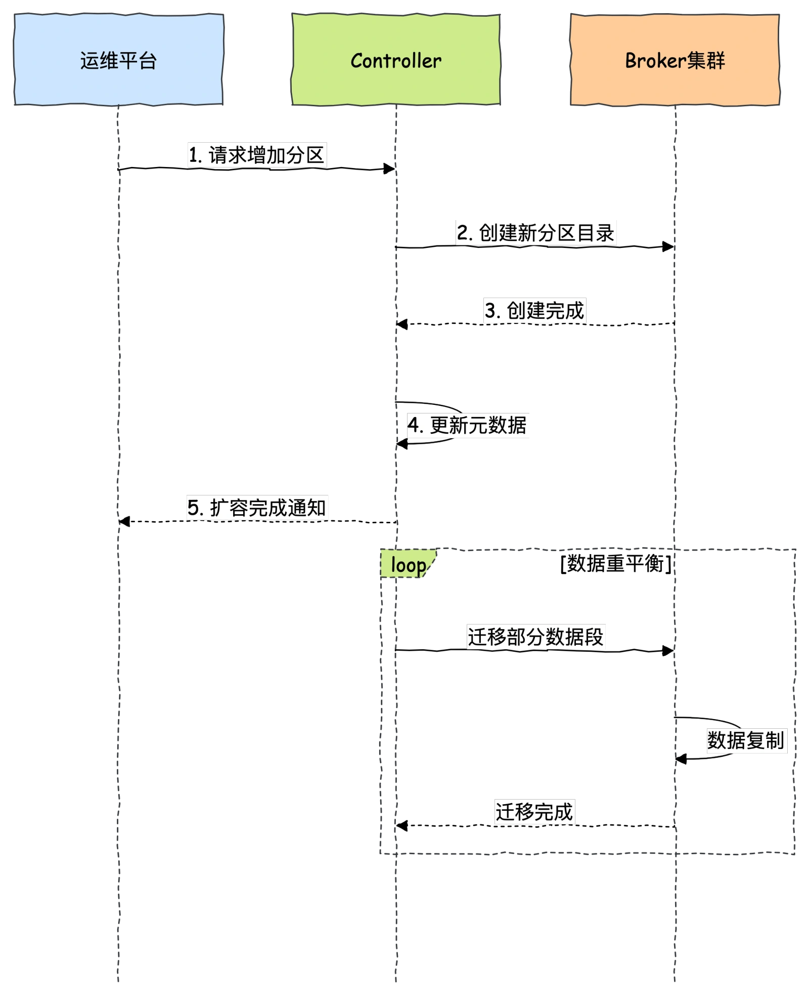

# 042 | MQ 消息积压了该如何处理？

<font style="color:rgb(51, 51, 51);background-color:rgb(248, 246, 244);">你好，见字如面。我是《Redis 高手心法》作者，腾讯云架构师同盟深圳区理事会成员、InfoQ 签约作者码哥，是一个手持菜刀砍电线，一路火花带闪电的靓仔。</font>

<font style="color:rgb(51, 51, 51);background-color:rgb(248, 246, 244);">在使用消息队列遇到的问题中，消息积压这个问题，应该是最常遇到的问题了，消息积压的直接原因，一定是系统中的某个部分出现了性能问题，来不及处理上游发送的消息，才会导致消息积压。</font>

<font style="color:rgb(51, 51, 51);background-color:rgb(248, 246, 244);">在使用消息队列时，如何来优化代码的性能，避免出现消息积压。然后再来看看，如果你的线上系统出现了消息积压，该如何进行紧急处理，最大程度地避免消息积压对业务的影响。</font>

## **<font style="color:rgb(34, 34, 34);background-color:rgb(248, 246, 244);">消息解压的本质与根源分析</font>**
<font style="color:rgb(51, 51, 51);background-color:rgb(248, 246, 244);">想要知道本质原因，我们需要知道消息生命周期的瓶颈全景图。</font>



<font style="color:rgb(51, 51, 51);background-color:rgb(248, 246, 244);">总结下出现消息积压的场景有以下三种：</font>

1. <font style="color:rgb(51, 51, 51);background-color:rgb(248, 246, 244);">生产端：突发流量红方、网络波动、序列化方式性能瓶颈</font>
2. <font style="color:rgb(51, 51, 51);background-color:rgb(248, 246, 244);">Broker 端：磁盘 I/O、分区数不足，副本同步延迟。</font>
3. <font style="color:rgb(51, 51, 51);background-color:rgb(248, 246, 244);">消费端：消费线程不足、业务逻辑处理耗时阻塞、外部依赖超时。</font>



<font style="color:rgb(100, 100, 100);background-color:rgb(248, 246, 244);">Chaya：对于绝大多数使用消息队列的业务来说，消息队列本身的处理能力要远大于业务系统的处理能力。</font>

<font style="color:rgb(51, 51, 51);background-color:rgb(248, 246, 244);">主流消息队列的单个节点，消息收发的性能可以达到每秒钟处理几万至几十万条消息的水平，还可以通过水平扩展 Broker 的实例数成倍地提升处理能力。</font>

<font style="color:rgb(51, 51, 51);background-color:rgb(248, 246, 244);">业务系统的业务逻辑远比消息队列要复杂，我们关注的核心是消费端业务逻辑的性能优化来比避免消息积压。</font>

## **<font style="color:rgb(34, 34, 34);background-color:rgb(248, 246, 244);">生产端性能优化</font>**
<font style="color:rgb(51, 51, 51);background-color:rgb(248, 246, 244);">发送端业务代码的处理性能，实际上和消息队列的关系不大，因为一般发送端都是先执行自己的业务逻辑，最后再发送消息。</font>

<font style="color:rgb(51, 51, 51);background-color:rgb(248, 246, 244);">如果说，你的代码发送消息的性能上不去，你需要优先检查一下，是不是发消息之前的业务逻辑耗时太多导致的。</font>

<font style="color:rgb(51, 51, 51);background-color:rgb(248, 246, 244);">如果发送端是一个微服务，主要接受 RPC 请求处理在线业务。很自然的，</font>**<font style="color:rgb(34, 34, 34);background-color:rgb(248, 246, 244);">微服务在处理每次请求的时候，就在当前线程直接发送消息就可以了，因为所有 RPC 框架都是多线程支持多并发的，自然也就实现了并行发送消息。</font>**

<font style="color:rgb(51, 51, 51);background-color:rgb(248, 246, 244);">如果是一个离线分析系统，离线系统在性能上的需求是什么呢？它不关心时延，更注重整个系统的吞吐量。</font>

<font style="color:rgb(51, 51, 51);background-color:rgb(248, 246, 244);">发送端的数据都是来自于数据库，这种情况就更适合批量发送，你可以批量从数据库读取数据，然后批量来发送消息，同样用少量的并发就可以获得非常高的吞吐量。</font>

<font style="color:rgb(100, 100, 100);background-color:rgb(248, 246, 244);">余姐姐：有没有一个架构方案，两种场景都可以适应的极致性能优化方案？</font>

<font style="color:rgb(51, 51, 51);background-color:rgb(248, 246, 244);">姐姐真是贪心呀……</font>

<font style="color:rgb(51, 51, 51);background-color:rgb(248, 246, 244);">不管离线还是微服务处理业务业务逻辑发送消息，想要追求极致的发送性能，可以使用</font>**<font style="color:rgb(34, 34, 34);background-color:rgb(248, 246, 244);">本地内存队列缓冲架构</font>**<font style="color:rgb(51, 51, 51);background-color:rgb(248, 246, 244);">优化。</font>



### **<font style="color:rgb(34, 34, 34);background-color:rgb(248, 246, 244);">关键优化策略</font>**
1. **<font style="color:rgb(34, 34, 34);background-color:rgb(248, 246, 244);">批量发送</font>**<font style="color:rgb(51, 51, 51);background-color:rgb(248, 246, 244);">：合并小消息减少网络 IO</font>
2. **<font style="color:rgb(34, 34, 34);background-color:rgb(248, 246, 244);">数据压缩</font>**<font style="color:rgb(51, 51, 51);background-color:rgb(248, 246, 244);">：使用 Snappy/LZ4 减少传输量</font>
3. **<font style="color:rgb(34, 34, 34);background-color:rgb(248, 246, 244);">异步确认</font>**<font style="color:rgb(51, 51, 51);background-color:rgb(248, 246, 244);">：非阻塞等待 Broker 响应</font>
4. **<font style="color:rgb(34, 34, 34);background-color:rgb(248, 246, 244);">分区选择</font>**<font style="color:rgb(51, 51, 51);background-color:rgb(248, 246, 244);">：基于业务键保证分区均匀</font>

## **<font style="color:rgb(34, 34, 34);background-color:rgb(248, 246, 244);">Broker 端优化</font>**
<font style="color:rgb(51, 51, 51);background-color:rgb(248, 246, 244);">Broker 端的话，通常可以通过扩展分区、磁盘存储优化、合理调整 Broker 参数实现。</font>

<font style="color:rgb(51, 51, 51);background-color:rgb(248, 246, 244);">最怕的就是有的公司引入了一些开源 MQ，在开源基础上包了一层皮封装的公司。</font>

<font style="color:rgb(51, 51, 51);background-color:rgb(248, 246, 244);">因为随着时间的发展，原先开源的那套可能已经退出历史舞台，性能也很差，但是公司魔改过，很多业务系统都在使用，根本改不了。</font>

### **<font style="color:rgb(34, 34, 34);background-color:rgb(248, 246, 244);">磁盘优化</font>**


### **<font style="color:rgb(34, 34, 34);background-color:rgb(248, 246, 244);">Kafka 分区动态扩容</font>**


<font style="color:rgb(51, 51, 51);background-color:rgb(248, 246, 244);">关键配置优化（Kafka 3.x）</font>

```plain
# Kafka黄金配置
# 网络吞吐
num.network.threads=8 # 网络线程数
queued.max.requests=1000 # 请求队列大小

# 磁盘优化
num.io.threads=16 # IO线程数
log.flush.interval.messages=10000
log.flush.interval.ms=1000

# 内存管理
log.retention.bytes=-1 # 按容量保留
log.segment.bytes=1073741824 # 1GB段文件
```

## **<font style="color:rgb(34, 34, 34);background-color:rgb(248, 246, 244);">消费端优化</font>**
<font style="color:rgb(100, 100, 100);background-color:rgb(248, 246, 244);">余姐姐：  好的爱情不是一味地索取，更不是毫无意义的付出，而是互相成长。</font>

<font style="color:rgb(51, 51, 51);background-color:rgb(248, 246, 244);">消息队列也是爱情的折射。</font>

<font style="color:rgb(51, 51, 51);background-color:rgb(248, 246, 244);">使用消息队列的时候，大部分的性能问题都出现在消费端，如果消费的速度跟不上发送端生产消息的速度，就会造成消息积压。最后系统崩塌。</font>

<font style="color:rgb(51, 51, 51);background-color:rgb(248, 246, 244);">所以消息的发送与消息的消费需要同频。要是消费速度一直比生产速度慢，时间长了，整个系统就会出现问题，要么，消息队列的存储被填满无法提供服务，要么消息丢失，这对于整个系统来说都是严重故障。</font>

<font style="color:rgb(51, 51, 51);background-color:rgb(248, 246, 244);">我们在设计系统的时候，</font>**<font style="color:rgb(34, 34, 34);background-color:rgb(248, 246, 244);">一定要保证消费端的消费性能要高于生产端的发送性能，这样的系统才能健康的持续运行。</font>**

<font style="color:rgb(51, 51, 51);background-color:rgb(248, 246, 244);">消费端的性能优化除了优化消费业务逻辑以外，也可以通过水平扩容，增加消费端的并发数来提升总体的消费性能。</font>

<font style="color:rgb(51, 51, 51);background-color:rgb(248, 246, 244);">特别需要注意的一点是，</font>**<font style="color:rgb(34, 34, 34);background-color:rgb(248, 246, 244);">在扩容 Consumer 的实例数量的同时，必须同步扩容主题中的分区（也叫队列）数量，确保 Consumer 的实例数和分区数量是相等的。</font>**

<font style="color:rgb(100, 100, 100);background-color:rgb(248, 246, 244);">Chaya：如果爱到了尽头，被压的喘不过气了该怎么办？同样的，处理消息的业务逻辑很难再优化了，为了避免消息积压，我能否先不处理消息，直接放到一个内存队列就返回 ack？然后再启动一些线程从内存队列取消息处理。</font>

<font style="color:rgb(51, 51, 51);background-color:rgb(248, 246, 244);">有一种爱就做放手……当爱已成往事，你能做的只有交给时间去处理。</font>

<font style="color:rgb(51, 51, 51);background-color:rgb(248, 246, 244);">如果不能提高处理该消息的业务逻辑，只是放到一个内存队列就返回 MQ ack，这是一种极其错误的实现方式。</font>

**<font style="color:rgb(34, 34, 34);background-color:rgb(248, 246, 244);">为什么错误？因为会丢消息。如果收消息的节点发生宕机，在内存队列中还没来及处理的这些消息就会丢失。</font>**

## **<font style="color:rgb(34, 34, 34);background-color:rgb(248, 246, 244);">消息积压了该如何处理？</font>**
<font style="color:rgb(51, 51, 51);background-color:rgb(248, 246, 244);">还有一种消息积压的情况是，日常系统正常运转的时候，没有积压或者只有少量积压很快就消费掉了，但是某一个时刻，突然就开始积压消息并且积压持续上涨。</font>

<font style="color:rgb(51, 51, 51);background-color:rgb(248, 246, 244);">这种情况下需要你在短时间内找到消息积压的原因，迅速解决问题才不至于影响业务。</font>

<font style="color:rgb(100, 100, 100);background-color:rgb(248, 246, 244);">Chaya：能导致消息积压忽然增加，通常只有两种情况：要么是发送变快了，要么是消费变慢了。</font>

<font style="color:rgb(51, 51, 51);background-color:rgb(248, 246, 244);">大部分消息队列都内置了监控的功能，只要通过监控数据，很容易确定是哪种原因。</font>

<font style="color:rgb(51, 51, 51);background-color:rgb(248, 246, 244);">如果是单位时间发送的消息增多，比如说是赶上大促或者抢购，短时间内不太可能优化消费端的代码来提升消费性能，</font>**<font style="color:rgb(34, 34, 34);background-color:rgb(248, 246, 244);">唯一的方法是通过扩容消费端的实例数来提升总体的消费能力。</font>**

<font style="color:rgb(51, 51, 51);background-color:rgb(248, 246, 244);">还有一种不太常见的情况，你通过监控发现，无论是发送消息的速度还是消费消息的速度和原来都没什么变化，这时候你需要检查一下你的消费端，是不是</font>**<font style="color:rgb(34, 34, 34);background-color:rgb(248, 246, 244);">消费失败导致的一条消息反复消费这种情况比较多</font>**<font style="color:rgb(51, 51, 51);background-color:rgb(248, 246, 244);">，这种情况也会拖慢整个系统的消费速度。</font>

## **<font style="color:rgb(34, 34, 34);background-color:rgb(248, 246, 244);">总结</font>**
<font style="color:rgb(51, 51, 51);background-color:rgb(248, 246, 244);">消息积压治理的本质是</font>**<font style="color:rgb(34, 34, 34);background-color:rgb(248, 246, 244);">资源与需求的动态平衡艺术</font>**<font style="color:rgb(51, 51, 51);background-color:rgb(248, 246, 244);">，需要建立三层防御体系：</font>

1. **<font style="color:rgb(34, 34, 34);background-color:rgb(248, 246, 244);">事前预防</font>**<font style="color:rgb(51, 51, 51);background-color:rgb(248, 246, 244);">：通过容量规划、代码优化和压力测试构建第一道防线</font>
    - <font style="color:rgb(51, 51, 51);background-color:rgb(248, 246, 244);">优化生产发送模式</font>
    - <font style="color:rgb(51, 51, 51);background-color:rgb(248, 246, 244);">合理设置分区数量</font>
    - <font style="color:rgb(51, 51, 51);background-color:rgb(248, 246, 244);">设计弹性消费架构</font>
2. **<font style="color:rgb(34, 34, 34);background-color:rgb(248, 246, 244);">事中监控</font>**<font style="color:rgb(51, 51, 51);background-color:rgb(248, 246, 244);">：建立全链路监控和智能预警系统</font>
    - <font style="color:rgb(51, 51, 51);background-color:rgb(248, 246, 244);">实时跟踪生产/消费速率比</font>
    - <font style="color:rgb(51, 51, 51);background-color:rgb(248, 246, 244);">设置多级积压阈值告警</font>
    - <font style="color:rgb(51, 51, 51);background-color:rgb(248, 246, 244);">可视化关键性能指标</font>
3. **<font style="color:rgb(34, 34, 34);background-color:rgb(248, 246, 244);">事后应急</font>**<font style="color:rgb(51, 51, 51);background-color:rgb(248, 246, 244);">：制定分级响应预案</font>
    - <font style="color:rgb(51, 51, 51);background-color:rgb(248, 246, 244);">轻度积压：动态扩容消费者</font>
    - <font style="color:rgb(51, 51, 51);background-color:rgb(248, 246, 244);">中度积压：限流+降级非核心</font>

<font style="color:rgb(51, 51, 51);background-color:rgb(248, 246, 244);">真正的消息专家不是让系统永不积压，而是当洪水来袭时，能在业务感知前完成疏导。</font>

<font style="color:rgb(51, 51, 51);background-color:rgb(248, 246, 244);">这要求我们在代码优化、架构设计和应急预案三方面建立纵深防御体系。</font>


> 更新: 2025-11-20 09:25:47  
> 原文: <https://www.yuque.com/yuqueyonghue6cvnv/cxhfwd/emolh8nv3l7xssby>