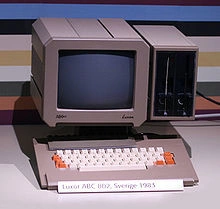
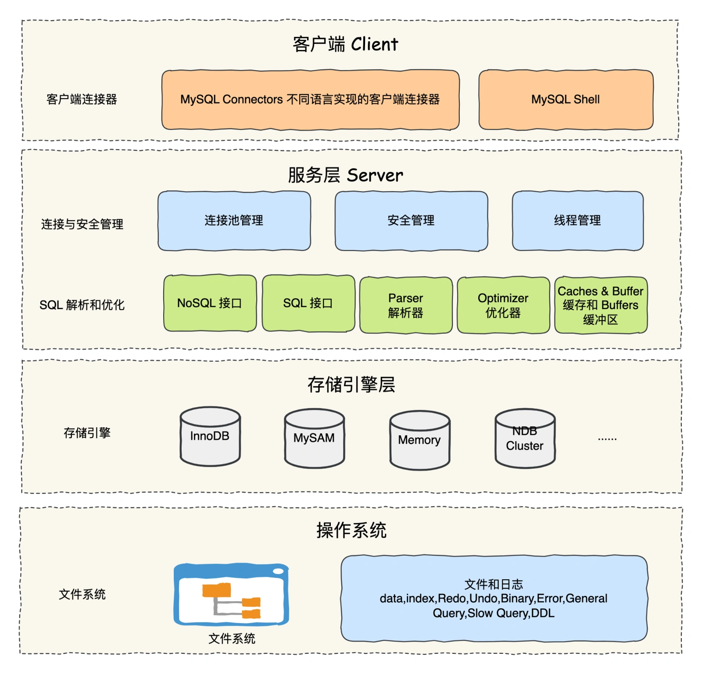
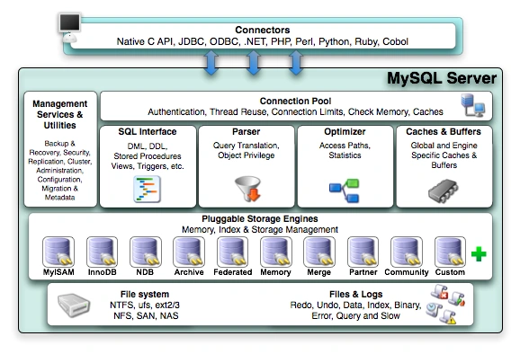

# 043| MySQL 架构是怎样的？

<font style="color:rgb(51, 51, 51);background-color:rgb(248, 246, 244);">我叫萧剑臣，今天 34 岁，2024 年快接近尾声，在一线城市「浅圳」打拼，在一家名叫「网讯」的互联网大厂工作，是一名资深后端架构师。</font>

<font style="color:rgb(51, 51, 51);background-color:rgb(248, 246, 244);">已经连续加班到 23:00 半年多才下班，现在已是亥时，push 完代码后拿出我在「拼夕夕」买的 「zippo」火机点上一支烟，看着它逐渐没有痕迹，空气中闻到一股股淡淡的味道。</font>

<font style="color:rgb(51, 51, 51);background-color:rgb(248, 246, 244);">我弹落的烟灰如此的黯然，黯然如我，思绪万千。我闭上眼睛就是天黑，一种撕裂的感觉。</font>

<font style="color:rgb(51, 51, 51);background-color:rgb(248, 246, 244);">我掐灭了烟头，又重新点上一支烟，沉浸在淡蓝色的烟雾中，是那么的温柔，那么的迷蒙，那么的深情。</font>

<font style="color:rgb(51, 51, 51);background-color:rgb(248, 246, 244);">Christina，我想起你了，发信息给你的手在键盘敲很轻，我给的思念很小心。</font>

<font style="color:rgb(100, 100, 100);background-color:rgb(248, 246, 244);">你说：我们不适合，每天 996，起得比鸡早，睡得比狗晚，每天忙忙碌碌。天天加班，肚子那么大，头发那么少，血糖高、尿素高、脂肪肝。</font>

<font style="color:rgb(51, 51, 51);background-color:rgb(248, 246, 244);">回到工位，我写下了一段愿望，希望世间再无 996，多金身材好，女朋友漂亮，左拥右抱….</font>

<font style="color:rgb(51, 51, 51);background-color:rgb(248, 246, 244);">或许是因为长期加班的缘故。忽然，我只觉心里难受，胸闷气短，眼前一片黑，我想要努力的睁开眼睛，可是却什么都看不见，逐渐听不见周边的声音……</font>

## **<font style="color:rgb(34, 34, 34);background-color:rgb(248, 246, 244);">重生</font>**
<font style="color:rgb(51, 51, 51);background-color:rgb(248, 246, 244);">当我新来睁开眼睛的时候，我看到办公桌的电脑长这个样子。</font>



<font style="color:rgb(51, 51, 51);background-color:rgb(248, 246, 244);">啥情况，我猝死了还是穿越了？还在我一脸懵逼的时候……</font>

<font style="color:rgb(100, 100, 100);background-color:rgb(248, 246, 244);">系统提示：萧剑臣，你已经 dead 过一次了，现在在另一个世界获得重生，你需要在这个世界完成一个任务，设计一款数据库 MySQL，就能就能回到原来的世界，迎娶白富美，脱离 996，并且在这个世界的成就也能带回原来的世界。</font>

<font style="color:rgb(51, 51, 51);background-color:rgb(248, 246, 244);">打开这个电脑一看，时间是 1979 年。那时 Bill Gates 退学没多久，微软公司也才刚刚起步，世间还没有 996 和福报，没有过劳猝死……</font>

<font style="color:rgb(51, 51, 51);background-color:rgb(248, 246, 244);">这个狗血，我居然重生了，我的机会来了……</font>

<font style="color:rgb(51, 51, 51);background-color:rgb(248, 246, 244);">1990 年，我接到了一个项目，客户需要为当时的 UNIREG 提供更加通用的 SQL 接口，公司的另一个团队负责人「郝纪晓」提议直接使用商用数据库。</font>

<font style="color:rgb(51, 51, 51);background-color:rgb(248, 246, 244);">重生后的第一个副本出现了，我不能让「郝纪晓」的提议达成，否则将永远 「狗 dead」。</font>

<font style="color:rgb(51, 51, 51);background-color:rgb(248, 246, 244);">经过一番测试后，我发现商用数据库的速度并不尽如人意，无法满足客户的需求。于是我联合 Monty Widenius，他雄心大起，设计一个数据库的任务就此开始……</font>

## **<font style="color:rgb(34, 34, 34);background-color:rgb(248, 246, 244);">MySQL 架构设计</font>**
<font style="color:rgb(51, 51, 51);background-color:rgb(248, 246, 244);">脑子里有 MySQL 8.0 版本的架构设计思路，我在这里岂不是如鱼得水，起飞，起飞，必须起飞。于是我把 MySQL 的架构设计图画了出来，如图 1-1 所示。</font>



<font style="color:rgb(51, 51, 51);background-color:rgb(248, 246, 244);">图 1-1</font>

<font style="color:rgb(51, 51, 51);background-color:rgb(248, 246, 244);">看到如此层级的架构设计，分层明确，职责清晰，众人惊呆了！！</font>

<font style="color:rgb(51, 51, 51);background-color:rgb(248, 246, 244);">但有一个人不懈的说到：划分这么多层，有什么意义？该不会是脱裤子放屁多此一举吧。</font>

<font style="color:rgb(51, 51, 51);background-color:rgb(248, 246, 244);">我心想，难道这是副第一个关卡出现的一个 boss，我看了看他的工牌，上面写着资深架构师——王妮玛。</font>

<font style="color:rgb(100, 100, 100);background-color:rgb(248, 246, 244);">系统提示音：新手任务，画出 MySQL 系统架构设计图，并解释每一层以及每层组件的主要作用，让众人理解并清晰认识该架构，让大家按照此架构开发。</font>

<font style="color:rgb(51, 51, 51);background-color:rgb(248, 246, 244);">好家伙，这个任务难度不大，我自信的给众人解释到：这个数据库名叫 MySQL，至上而下一共分为四层，重点是 Server 服务层和存储引擎层。</font>

<font style="color:rgb(51, 51, 51);background-color:rgb(248, 246, 244);">客户端由不同语言开发的客户端，Server 层包括连接池、安全管理、线程管理、缓存、SQL 接口、解析器、优化器等，涵盖了 MySQL 的大多数核心功能。</font>

<font style="color:rgb(51, 51, 51);background-color:rgb(248, 246, 244);">而存储引擎层负责数据的存储的读取。这是一个插件式架构，支持 InnoDB、MyISAM、Memory 等多个存储引擎。</font>

### **<font style="color:rgb(34, 34, 34);background-color:rgb(248, 246, 244);">客户端 Client</font>**
<font style="color:rgb(51, 51, 51);background-color:rgb(248, 246, 244);">这是一个 CS 架构，支持各种语言的客户端连接器连接到数据库，比如 Java、C++、JDBC 等。同时也支持 Shell 脚本直接连接。</font>

### **<font style="color:rgb(34, 34, 34);background-color:rgb(248, 246, 244);">Server 服务层</font>**
<font style="color:rgb(51, 51, 51);background-color:rgb(248, 246, 244);">这一层至关重要，里面还还会划分为「连接与安全管理」和「SQL 解析和优化」两大模块。</font>

<font style="color:rgb(51, 51, 51);background-color:rgb(248, 246, 244);">服务层是 MySQL 中的核心组件，负责提供各种数据库操作所需的基本功能，如 SQL 语法处理、事务管理、锁管理等。</font>

**<font style="color:rgb(34, 34, 34);background-color:rgb(248, 246, 244);">连接与安全管理</font>**

<font style="color:rgb(51, 51, 51);background-color:rgb(248, 246, 244);">当客户端发送连接请求时，MySQL 服务器会在连接与安全管理接收请求，分配一个线程来处理该连接，随后进行身份验证。具体的功能如下：</font>

+ <font style="color:rgb(51, 51, 51);background-color:rgb(248, 246, 244);">当客户端发起连接请求时，MySQL 会创建一个专用的线程（以操作系统级别的线程实现）来为该客户端服务。</font>
+ <font style="color:rgb(51, 51, 51);background-color:rgb(248, 246, 244);">MYSQL 对 TCP 传输过来的账号密码做身份认证、权限获取（例如，是否允许客户端对 world 数据库中的 Country 表执行 SELECT 语句）。验证通过，查询账户拥有的权限，并缓存起来。此链接是一个长链接</font>
+ <font style="color:rgb(51, 51, 51);background-color:rgb(248, 246, 244);">对于 TCP 链接，MySQL 采用池化技术，节省了 TCP 链接创建和销毁的成本。</font>
+ <font style="color:rgb(51, 51, 51);background-color:rgb(248, 246, 244);">一个客户端请求，必须要分配一个线程专门与客户端进行交互，所以还有个线程池，每一个链接从线程池中获取一个线程，省去了创建和销毁线程的开销。把线程池占满了，再连就报连接满了。</font>

**<font style="color:rgb(34, 34, 34);background-color:rgb(248, 246, 244);">SQL 解析和优化</font>**

<font style="color:rgb(51, 51, 51);background-color:rgb(248, 246, 244);">SQL Interface(SQL 接口，用来接受用户的 SQL 命令，并返回需要的结果。比如 select from 就是调用 SQL Interface。</font>

**<font style="color:rgb(34, 34, 34);background-color:rgb(248, 246, 244);">Parse 解析器</font>**

<font style="color:rgb(51, 51, 51);background-color:rgb(248, 246, 244);">MySQL 解析查询以创建内部数据结构（解析树），然后对其进行各种优化，包括重写查询、决定表的读取顺序，以及选择合适的索引等。</font>

**<font style="color:rgb(34, 34, 34);background-color:rgb(248, 246, 244);">Optimizer 优化器</font>**

<font style="color:rgb(51, 51, 51);background-color:rgb(248, 246, 244);">通过语法解析,MySQL 知道你的真实意图了，但你写的 SQL 不一定是高效的。</font>

<font style="color:rgb(51, 51, 51);background-color:rgb(248, 246, 244);">查询之前会使用Optimizer 优化器确定 SQL 语句的执行路径，生成一个执行计划，这个执行计划表明使用哪些索引进行查询。</font>

**<font style="color:rgb(34, 34, 34);background-color:rgb(248, 246, 244);">Caches & Buffers 缓冲区</font>**

<font style="color:rgb(51, 51, 51);background-color:rgb(248, 246, 244);">MySQL 内部维持着一些 Cache 和 Buffer，这个缓存机制是由一系列小缓存组成的。比如表缓存，记录缓存，key 缓存，权限缓存等。这个查询缓存可以在 不同客户端之间共享。</font>

1. **<font style="color:rgb(34, 34, 34);background-color:rgb(248, 246, 244);">查询缓存</font>**<font style="color:rgb(51, 51, 51);background-color:rgb(248, 246, 244);">：当相同的 SQL 查询被多次执行时，可以从查询缓存中直接获取结果，提高性能</font>**<font style="color:rgb(34, 34, 34);background-color:rgb(248, 246, 244);">。由于 MySQL 8.0 中已移除了查询缓存功能，使用者需要自行实现相关功能，如使用 Redis、Memcached 等中间缓存系统。</font>**
2. **<font style="color:rgb(34, 34, 34);background-color:rgb(248, 246, 244);">表缓存</font>**<font style="color:rgb(51, 51, 51);background-color:rgb(248, 246, 244);">：用于存储表的元数据，如表的结构定义。当查询需要表信息时，优先从表缓存中获取，避免磁盘操作。</font>
3. **<font style="color:rgb(34, 34, 34);background-color:rgb(248, 246, 244);">线程缓存</font>**<font style="color:rgb(51, 51, 51);background-color:rgb(248, 246, 244);">：用于复用服务器的连接线程。当一个连接关闭后，它的线程会被放回线程缓存池中，供新的连接使用。线程池意味着减少了创建和销毁线程的开销。</font>
4. **<font style="color:rgb(34, 34, 34);background-color:rgb(248, 246, 244);">缓冲池</font>**<font style="color:rgb(51, 51, 51);background-color:rgb(248, 246, 244);">：主要用于 InnoDB 存储引擎，缓冲池管理缓存的数据页，包括数据和索引。当需要访问这些页时，可以直接从缓冲池读取，提高访问速度。</font>

<font style="color:rgb(100, 100, 100);background-color:rgb(248, 246, 244);">buffer 与 cache 的区别?</font>

<font style="color:rgb(51, 51, 51);background-color:rgb(248, 246, 244);">简单的说就是，buffer 是写缓存，cache 是读缓存。</font>

**<font style="color:rgb(34, 34, 34);background-color:rgb(248, 246, 244);">存储引擎层</font>**

<font style="color:rgb(51, 51, 51);background-color:rgb(248, 246, 244);">存储引擎层负责存储数据和执行 SQL 语句。MySQL 支持多种存储引擎，每种引擎各有特点，根据实际需求进行选用。当然，只要没有非常明确的特殊需求就不需要更改存储引擎，因为 InnoDB 在大部分场景下都比其他引擎更加适用。</font>

**<font style="color:rgb(34, 34, 34);background-color:rgb(248, 246, 244);">InnoDB</font>**<font style="color:rgb(51, 51, 51);background-color:rgb(248, 246, 244);">：InnoDB 是 MySQL 的默认存储引擎，提供了事务支持、行级锁定、外键约束等功能，主要用于高并发、高可靠性的 OLTP 场景。</font>

**<font style="color:rgb(34, 34, 34);background-color:rgb(248, 246, 244);">MyISAM</font>**<font style="color:rgb(51, 51, 51);background-color:rgb(248, 246, 244);">：MyISAM 通常用于只读数据表，适用于简单查询和全文索引。其不支持事务、行级锁等功能，适用于 OLAP 场景。</font>

**<font style="color:rgb(34, 34, 34);background-color:rgb(248, 246, 244);">Memory</font>**<font style="color:rgb(51, 51, 51);background-color:rgb(248, 246, 244);">：Memory 存储引擎支持哈希和 B 树索引，它将数据存储在内存中，易受到系统断电或宕机等影响，具有较高的写性能但不适用于大规模数据分布。</font>

**<font style="color:rgb(34, 34, 34);background-color:rgb(248, 246, 244);">其他存储引擎</font>**<font style="color:rgb(51, 51, 51);background-color:rgb(248, 246, 244);">：MySQL 还支持如 Archive、NDB Cluster 等其他存储引擎，它们分别适用于存档表、分布式数据库等不同场景。</font>

<font style="color:rgb(51, 51, 51);background-color:rgb(248, 246, 244);">我们可以在 SQL 命令行中执行 show engines; 来查看当前支持的存储引擎：</font>

```plain
mysql> show engines;
+--------------------+---------+----------------------------------------------------------------+--------------+------+------------+
| Engine             | Support | Comment                                                        | Transactions | XA   | Savepoints |
+--------------------+---------+----------------------------------------------------------------+--------------+------+------------+
| FEDERATED          | NO      | Federated MySQL storage engine                                 | NULL         | NULL | NULL       |
| MEMORY             | YES     | Hash based, stored in memory, useful for temporary tables      | NO           | NO   | NO         |
| InnoDB             | DEFAULT | Supports transactions, row-level locking, and foreign keys     | YES          | YES  | YES        |
| PERFORMANCE_SCHEMA | YES     | Performance Schema                                             | NO           | NO   | NO         |
| MyISAM             | YES     | MyISAM storage engine                                          | NO           | NO   | NO         |
| MRG_MYISAM         | YES     | Collection of identical MyISAM tables                          | NO           | NO   | NO         |
| BLACKHOLE          | YES     | /dev/null storage engine (anything you write to it disappears) | NO           | NO   | NO         |
| CSV                | YES     | CSV storage engine                                             | NO           | NO   | NO         |
| ARCHIVE            | YES     | Archive storage engine                                         | NO           | NO   | NO         |
+--------------------+---------+----------------------------------------------------------------+--------------+------+------------+
9 rows in set (0.00 sec)
```

**<font style="color:rgb(34, 34, 34);background-color:rgb(248, 246, 244);">文件系统层</font>**

<font style="color:rgb(51, 51, 51);background-color:rgb(248, 246, 244);">文件系统由各操作系统提供，MySQL 将其持久化的数据物理存储在磁盘上，持久化保存数据、索引、binlog、redo log、undo log、error 日志、慢 sql 等；</font>

## **<font style="color:rgb(34, 34, 34);background-color:rgb(248, 246, 244);">总结</font>**
+ <font style="color:rgb(51, 51, 51);background-color:rgb(248, 246, 244);">服务层的连接和安全管理：用户与 MYSQL 服务进行 TCP 链接，校验用户身份，用户权限。</font>
+ <font style="color:rgb(51, 51, 51);background-color:rgb(248, 246, 244);">服务层的 SQL 解析和优化：用户写的 SQL 语句会到服务层进行解析，生成语法树。优化 SQL 语句，生成执行计划。</font>
+ <font style="color:rgb(51, 51, 51);background-color:rgb(248, 246, 244);">引擎层：真正与磁盘进行交互，对数据进行存储和读取。</font>

<font style="color:rgb(51, 51, 51);background-color:rgb(248, 246, 244);">最后，我再附上一张在我原来的世界尤其盛行的架构图，与 图 1-1 最大的差别是这次用英文，如图 1-2 所示。</font>



<font style="color:rgb(51, 51, 51);background-color:rgb(248, 246, 244);">图 1-2</font>

<font style="color:rgb(51, 51, 51);background-color:rgb(248, 246, 244);">我说完之后，众人纷纷对我称赞。CTO 觉得我的架构设计考虑的太周全了，立马从 T3 晋升为 T4，薪资涨了 20%……</font>

<font style="color:rgb(51, 51, 51);background-color:rgb(248, 246, 244);">故事还没结束，结构图出来以后，王妮玛说到：架构图虽然不错，可是还有很多问题并没提及，我们是实干主义，不是写个架构图就能忽悠的。</font>

1. <font style="color:rgb(51, 51, 51);background-color:rgb(248, 246, 244);">一条查询、insert、update、delete 语句的执行流程是怎样的？</font>
2. <font style="color:rgb(51, 51, 51);background-color:rgb(248, 246, 244);">并发如何控制？</font>
3. <font style="color:rgb(51, 51, 51);background-color:rgb(248, 246, 244);">事务如何处理？</font>
4. <font style="color:rgb(51, 51, 51);background-color:rgb(248, 246, 244);">Server 层与存储引擎层之间如何保证故障恢复？</font>
5. <font style="color:rgb(51, 51, 51);background-color:rgb(248, 246, 244);">binlog、redo log、undo log 都是什么玩意？</font>
6. <font style="color:rgb(51, 51, 51);background-color:rgb(248, 246, 244);">磁盘很慢，如何将 读写的随机 I/O 操作变成顺序写保证 数据库性能？</font>

<font style="color:rgb(51, 51, 51);background-color:rgb(248, 246, 244);">重生之后面对的困难也不简单，这么多问题需要解决，好在我那个世界钻研过 MySQL 技术。我较劲脑汁的回顾之前学过的 MySQL 技术，希望在这个世界不要就这么 go dead……</font>


> 更新: 2025-11-20 09:26:04  
> 原文: <https://www.yuque.com/yuqueyonghue6cvnv/cxhfwd/uizb8tnq6u7q8erb>