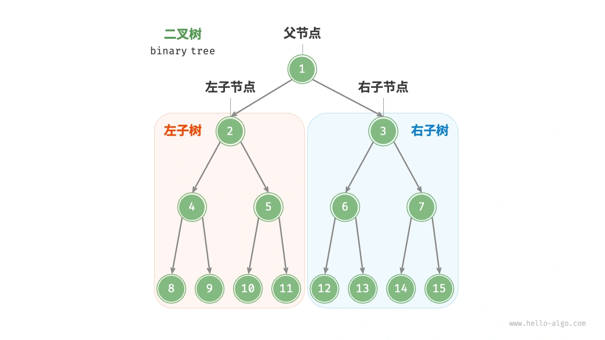
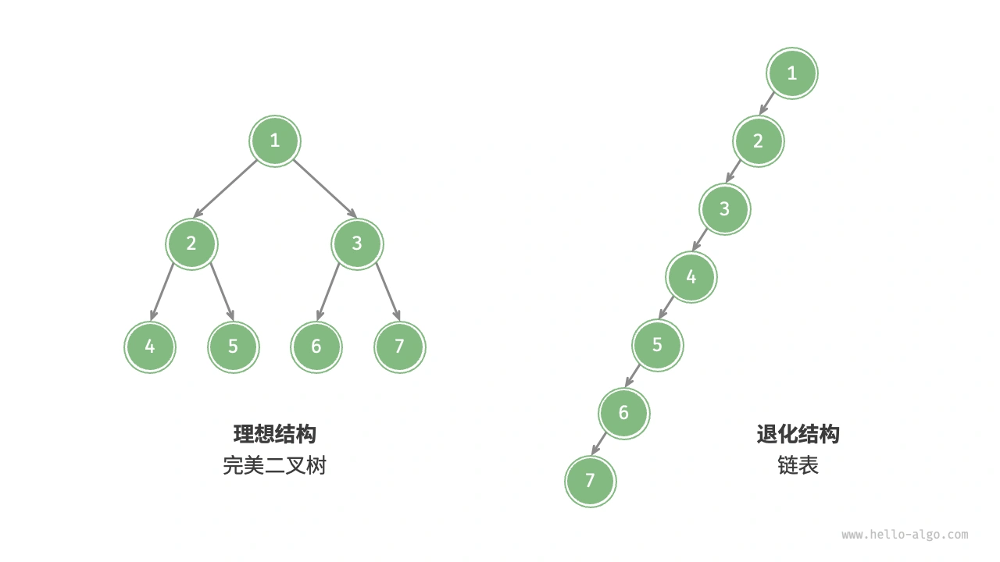
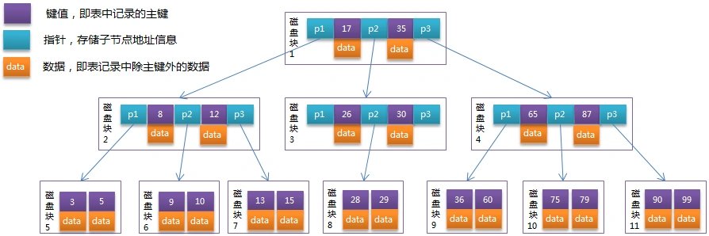
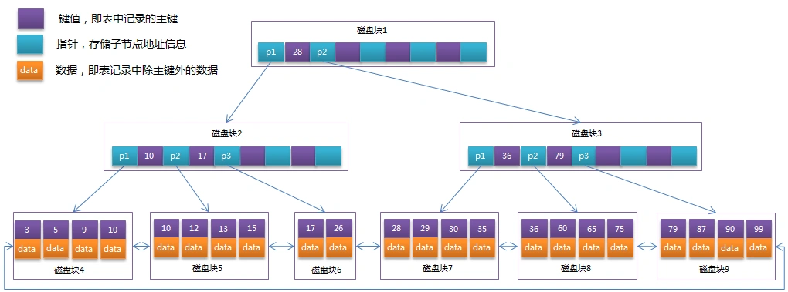

# 044|为什么 MySQL 索引使用 B+Tree？红黑树不行吗？

<font style="color:rgb(51, 51, 51);background-color:rgb(248, 246, 244);">林渊盯着监控大屏上的红色警报： [ERROR] Product category tree query timeout after 30s 商品分类树查询超时！</font>

<font style="color:rgb(51, 51, 51);background-color:rgb(248, 246, 244);">这已经是本周第三次故障。他打开调试日志，发现每次查询需要遍历 17 层二叉树。</font>

<font style="color:rgb(51, 51, 51);background-color:rgb(248, 246, 244);">机房的温度飙升到 42 度，磁盘阵列的 LED 指示灯疯狂闪烁。</font>

<font style="color:rgb(100, 100, 100);background-color:rgb(248, 246, 244);">“</font>

<font style="color:rgb(100, 100, 100);background-color:rgb(248, 246, 244);">林渊心想：是时候展示我的技术了，这个时代 B+ tree 还未产生。</font>

<font style="color:rgb(51, 51, 51);background-color:rgb(248, 246, 244);">另一边有人问道：“二叉树 O(logN)的时间复杂度是教科书写的啊！怎么这样？”</font>

## **<font style="color:rgb(34, 34, 34);background-color:rgb(248, 246, 244);">二叉树的致命缺陷</font>**
**<font style="color:rgb(34, 34, 34);background-color:rgb(248, 246, 244);">场景还原</font>**<font style="color:rgb(51, 51, 51);background-color:rgb(248, 246, 244);">：商品分类表prod_category的父 ID 字段索引。</font>

```plain
CREATE TABLE prod_category (
  id INT PRIMARY KEY,
  parent_id INT,
  INDEX idx_parent (parent_id) -- 二叉树实现
);
```

**<font style="color:rgb(34, 34, 34);background-color:rgb(248, 246, 244);">性能灾难</font>**<font style="color:rgb(51, 51, 51);background-color:rgb(248, 246, 244);">：当层级超过 10 层时，查询子类目需要递归遍历：</font>

```kotlin
// 原始递归代码（林渊的注释版）
public List<Long> findChildren(Long parentId) {
  // WARNING! 每次递归都是一次磁盘寻道（8ms）
  List<Long> children = jdbc.query("SELECT id FROM prod_category WHERE parent_id=?", parentId);
  for (Long child : children) {
    children.addAll(findChildren(child)); // 指数级IO爆炸
  }
  return children;
}
```

**<font style="color:rgb(34, 34, 34);background-color:rgb(248, 246, 244);">林渊的实验数据</font>**<font style="color:rgb(51, 51, 51);background-color:rgb(248, 246, 244);">（2004 年实验报告节选）：</font>

**<font style="color:rgb(34, 34, 34);background-color:rgb(248, 246, 244);">数据量树高平均查询时间</font>**<font style="color:rgb(51, 51, 51);background-color:rgb(248, 246, 244);">1 万14112ms10 万17136ms100 万20160ms</font>

**<font style="color:rgb(34, 34, 34);background-color:rgb(248, 246, 244);">二叉树的机械困境与复杂度陷阱</font>**



<font style="color:rgb(51, 51, 51);background-color:rgb(248, 246, 244);">1970 年代，二叉搜索树（BST）的理论时间复杂度 O(logN)掩盖了物理实现的致命缺陷。以机械硬盘为例：</font>

+ **<font style="color:rgb(34, 34, 34);background-color:rgb(248, 246, 244);">树高灾难</font>**<font style="color:rgb(51, 51, 51);background-color:rgb(248, 246, 244);">：100 万数据产生约 20 层高度（log₂(1,000,000)=19.9），假设每次 IO 耗时 8ms，单次查询需 160ms</font>
+ **<font style="color:rgb(34, 34, 34);background-color:rgb(248, 246, 244);">局部性原理失效</font>**<font style="color:rgb(51, 51, 51);background-color:rgb(248, 246, 244);">：随机磁盘寻道导致缓存命中率趋近于 0。</font>

<font style="color:rgb(51, 51, 51);background-color:rgb(248, 246, 244);">另外，当所有节点都偏向一侧时，二叉树退化为“链表”。</font>



## **<font style="color:rgb(34, 34, 34);background-color:rgb(248, 246, 244);">B Tree</font>**
<font style="color:rgb(100, 100, 100);background-color:rgb(248, 246, 244);">“</font>

<font style="color:rgb(100, 100, 100);background-color:rgb(248, 246, 244);">林渊的竞争对手 Jake 说：我设计了一个 B Tree，相信是绝世无双的设计。</font>

<font style="color:rgb(51, 51, 51);background-color:rgb(248, 246, 244);">B 树通过多路平衡设计解决了磁盘 IO 问题。根据《数据库系统实现》的公式推导，B 树的阶数 m 与磁盘页大小的关系为：</font>

```nginx
m ≥ (PageSize - PageHeader) / (KeySize + PointerSize)
```

<font style="color:rgb(51, 51, 51);background-color:rgb(248, 246, 244);">以 MySQL 默认 16KB 页为例（PageHeader 约 120 字节，KeySize 8 字节，Pointer 6 字节），阶数 m≈(16384-120)/(8+6)=1162。</font>

<font style="color:rgb(51, 51, 51);background-color:rgb(248, 246, 244);">10 万数据量下，B 树高度仅需 2 层（log₁₁₆₂(100000)≈2），查询 IO 次数从 17 次降为 3 次（根节点常驻内存），总延迟 24ms。</font>

<font style="color:rgb(51, 51, 51);background-color:rgb(248, 246, 244);">首先定义一条记录为一个二元组[key, data] ，key 为记录的键值，对应表中的主键值，data 为一行记录中除主键外的数据。对于不同的记录，key 值互不相同。</font>

<font style="color:rgb(51, 51, 51);background-color:rgb(248, 246, 244);">B-Tree 中的每个节点根据实际情况可以包含大量的关键字信息和分支，如下图所示为一个 3 阶的 B-Tree：</font>



<font style="color:rgb(51, 51, 51);background-color:rgb(248, 246, 244);">每个节点占用一个盘块的磁盘空间，一个节点上有两个升序排序的关键字和三个指向子树根节点的指针，指针存储的是子节点所在磁盘块的地址。</font>

<font style="color:rgb(51, 51, 51);background-color:rgb(248, 246, 244);">两个关键词划分成的三个范围域对应三个指针指向的子树的数据的范围域。</font>

<font style="color:rgb(51, 51, 51);background-color:rgb(248, 246, 244);">以根节点为例，关键字为 17 和 35，P1 指针指向的子树的数据范围为小于 17，P2 指针指向的子树的数据范围为 17~35，P3 指针指向的子树的数据范围为大于 35。</font>

<font style="color:rgb(51, 51, 51);background-color:rgb(248, 246, 244);">模拟查找关键字 29 的过程：</font>

1. <font style="color:rgb(51, 51, 51);background-color:rgb(248, 246, 244);">根据根节点找到磁盘块 1，读入内存。【磁盘 I/O 操作第 1 次】</font>
2. <font style="color:rgb(51, 51, 51);background-color:rgb(248, 246, 244);">比较关键字 29 在区间（17,35），找到磁盘块 1 的指针 P2。</font>
3. <font style="color:rgb(51, 51, 51);background-color:rgb(248, 246, 244);">根据 P2 指针找到磁盘块 3，读入内存。【磁盘 I/O 操作第 2 次】</font>
4. <font style="color:rgb(51, 51, 51);background-color:rgb(248, 246, 244);">比较关键字 29 在区间（26,30），找到磁盘块 3 的指针 P2。</font>
5. <font style="color:rgb(51, 51, 51);background-color:rgb(248, 246, 244);">根据 P2 指针找到磁盘块 8，读入内存。【磁盘 I/O 操作第 3 次】</font>
6. <font style="color:rgb(51, 51, 51);background-color:rgb(248, 246, 244);">在磁盘块 8 中的关键字列表中找到关键字 29。</font>

<font style="color:rgb(51, 51, 51);background-color:rgb(248, 246, 244);">分析上面过程，发现需要 3 次磁盘 I/O 操作，和 3 次内存查找操作。由于内存中的关键字是一个有序表结构，可以利用二分法查找提高效率。</font>

## **<font style="color:rgb(34, 34, 34);background-color:rgb(248, 246, 244);">B+Tree</font>**
<font style="color:rgb(100, 100, 100);background-color:rgb(248, 246, 244);">“</font>

<font style="color:rgb(100, 100, 100);background-color:rgb(248, 246, 244);">林渊反驳：“每个节点中不仅包含数据的 key 值，还有 data 值。</font>

<font style="color:rgb(100, 100, 100);background-color:rgb(248, 246, 244);">而每一个页的存储空间是有限的，如果 data 数据较大时将会导致每个节点（即一个页）能存储的 key 的数量很小，当存储的数据量很大时同样会导致 B-Tree 的深度较大，增大查询时的磁盘 I/O 次数，进而影响查询效率。”</font>

<font style="color:rgb(51, 51, 51);background-color:rgb(248, 246, 244);">而且 BTree 的非叶子节点存储数据，导致范围查询需要跨层跳跃。</font>

<font style="color:rgb(51, 51, 51);background-color:rgb(248, 246, 244);">林渊脑海中立马翻阅在 2025 年学到的 B+Tree 数据结构，在《MySQL 内核：InnoDB 存储引擎》中发现这段代码：</font>

```plain
// storage/innobase/btr/btr0btr.cc
void btr_cur_search_to_nth_level(...) {
  /* 只有叶子节点存储数据 */
  if (level == 0) {
    page_cur_search_with_match(block, index, tuple, page_mode, &up_match,
                              &up_bytes, &low_match, &low_bytes, cursor);
  }
}
```

<font style="color:rgb(51, 51, 51);background-color:rgb(248, 246, 244);">"原来 B+树通过叶子层双向链表，把离散的磁盘页变成了连续空间！"</font>

<font style="color:rgb(51, 51, 51);background-color:rgb(248, 246, 244);">整理好思绪，继续补充道：B+树通过以下创新实现质的飞跃：</font>

1. **<font style="color:rgb(34, 34, 34);background-color:rgb(248, 246, 244);">全数据叶子层</font>**<font style="color:rgb(51, 51, 51);background-color:rgb(248, 246, 244);">：所有数据仅存储在叶子节点，非叶节点仅作索引目录</font>
2. **<font style="color:rgb(34, 34, 34);background-color:rgb(248, 246, 244);">双向链表串联</font>**<font style="color:rgb(51, 51, 51);background-color:rgb(248, 246, 244);">：叶子节点通过指针形成有序链表，范围扫描时间复杂度从 O(logN)降为 O(1)。</font>

<font style="color:rgb(51, 51, 51);background-color:rgb(248, 246, 244);">在 B+Tree 中，所有数据记录节点都是按照键值大小顺序存放在同一层的叶子节点上，而非叶子节点上只存储 key 值信息，这样可以大大加大每个节点存储的 key 值数量，降低 B+Tree 的高度。</font>

<font style="color:rgb(51, 51, 51);background-color:rgb(248, 246, 244);">B+Tree 的非叶子节点只存储键值信息，假设每个磁盘块能存储 4 个键值及指针信息，则变成 B+Tree 后其结构如下图所示：</font>



<font style="color:rgb(51, 51, 51);background-color:rgb(248, 246, 244);">通常在 B+Tree 上有两个头指针，一个指向根节点，另一个指向关键字最小的叶子节点，而且所有叶子节点（即数据节点）之间是一种链式环结构。</font>

<font style="color:rgb(51, 51, 51);background-color:rgb(248, 246, 244);">因此可以对 B+Tree 进行两种查找运算：一种是对于主键的范围查找和分页查找，另一种是从根节点开始，进行随机查找。</font>

## **<font style="color:rgb(34, 34, 34);background-color:rgb(248, 246, 244);">西湖论剑，单挑首席</font>**
<font style="color:rgb(51, 51, 51);background-color:rgb(248, 246, 244);">一周后，全球数据库峰会在西子湖畔召开。林渊抱着一台 IBM 服务器走上讲台："给我 30 秒，让各位见见‘未来索引’！”</font>

**<font style="color:rgb(34, 34, 34);background-color:rgb(248, 246, 244);">实时 PK 表演</font>**<font style="color:rgb(51, 51, 51);background-color:rgb(248, 246, 244);">：</font>

```sql
-- 场景：1亿订单数据查询
-- 传统B树（甲骨文）
SELECT * FROM orders WHERE id BETWEEN 100000 AND 200000;
-- 耗时12.8秒

-- B+树（林渊魔改版）
SELECT /*+ BPLUS_SCAN */ * FROM orders BETWEEN 100000 AND 200000;
-- 耗时0.3秒
```

**<font style="color:rgb(34, 34, 34);background-color:rgb(248, 246, 244);">名场面台词</font>**<font style="color:rgb(51, 51, 51);background-color:rgb(248, 246, 244);">：</font>

<font style="color:rgb(51, 51, 51);background-color:rgb(248, 246, 244);">"诸位，这不是优化，是维度的碾压！</font>

<font style="color:rgb(51, 51, 51);background-color:rgb(248, 246, 244);">B+树把磁盘的物理运动，变成了内存的闪电舞蹈！"——当日登上《程序员》杂志封面。三月后，林渊成立"深空科技"，发布"伏羲 B+引擎"。</font>

<font style="color:rgb(51, 51, 51);background-color:rgb(248, 246, 244);">美国商务部紧急会议："绝不能让中国掌控数据库心脏！"</font>


> 更新: 2025-11-20 09:26:23  
> 原文: <https://www.yuque.com/yuqueyonghue6cvnv/cxhfwd/td1p299eaire075y>