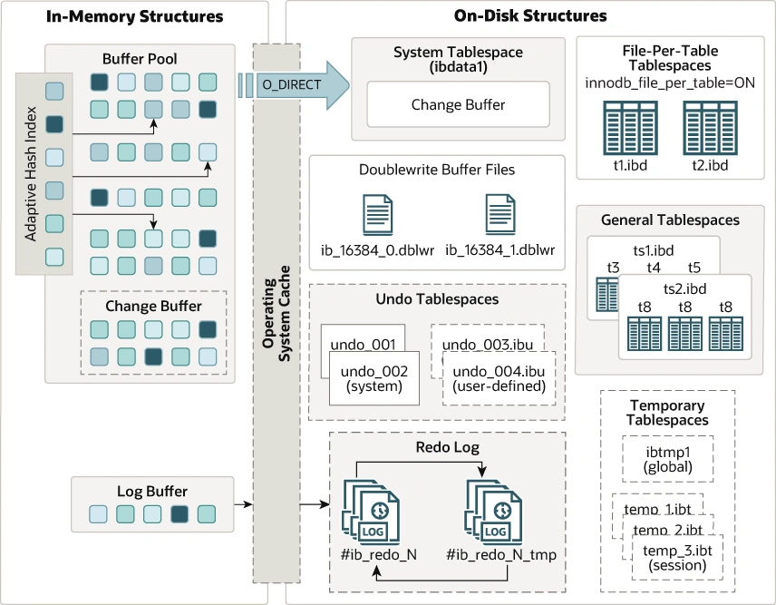
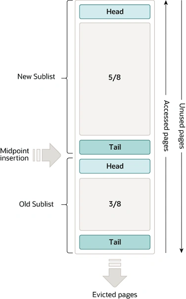
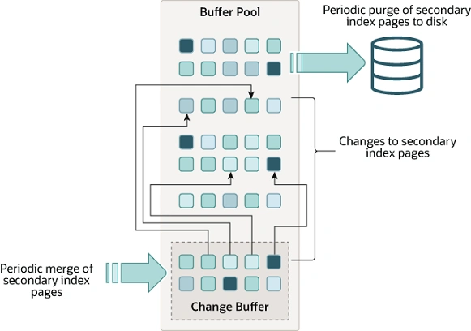
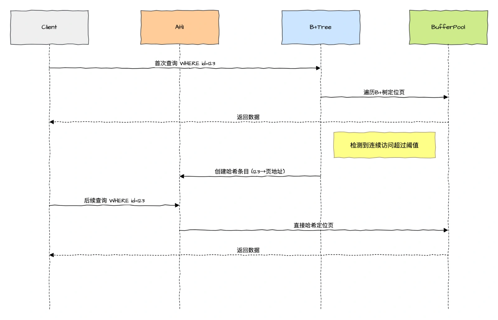
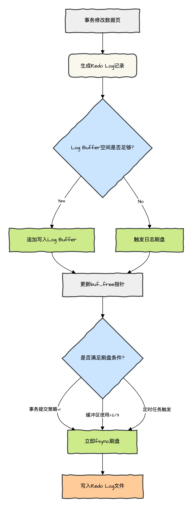
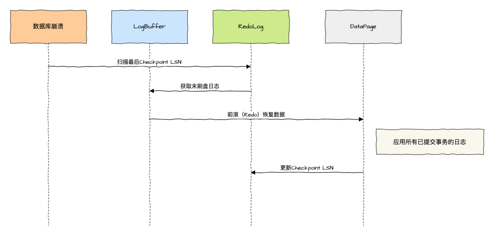
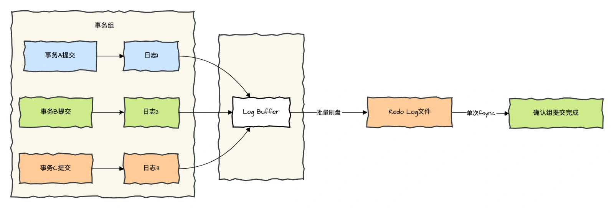

# 045|MySQL InnoDB 引擎：Buffer Pool、Change Buffer、Buffer Pool LRU 算法、（自适应哈希索引）、Log Buffer 是什么？

<font style="color:rgb(100, 100, 100);background-color:rgb(248, 246, 244);">你好，我是《Redis 高手心法》畅销书作者码哥。</font>

<font style="color:rgb(51, 51, 51);background-color:rgb(248, 246, 244);">书接上回，林渊重生使得 MySQL B+Tree 提前问世二十年，这次亲自操刀 InnoDB 架构引擎的设计，一个支持高并发读写、支持事务行级锁的划时代架构诞生...</font>

<font style="color:rgb(51, 51, 51);background-color:rgb(248, 246, 244);">文章关键词：MySQL InnoDB 架构、Buffer Pool、Change Buffer、Buffer Pool LRU 算法、Adaptive Hash Index（自适应哈希索引）、Log Buffer</font>

## **<font style="color:rgb(34, 34, 34);background-color:rgb(248, 246, 244);">InnoDB 架构诞生</font>**
<font style="color:rgb(51, 51, 51);background-color:rgb(248, 246, 244);">2003 年 12 月 24 日，平安夜，林渊从维修台猛然惊醒，耳边是 DBA 的怒吼："商品库又被表锁卡死了！每秒 500 单变 5 单！"</font>

<font style="color:rgb(100, 100, 100);background-color:rgb(248, 246, 244);">"小林，数据库锁表了，MyISAM 的表锁就是定时炸弹！我们要突破技术封锁，开发一套划时代的存储引擎“ CTO 对小林说道。</font>

<font style="color:rgb(51, 51, 51);background-color:rgb(248, 246, 244);">生在 2025 年作为互联网打工牛马的林渊，学过很多关于 MySQL 的技术，记忆如潮水涌入——2025 年的 InnoDB 架构图在他脑中展开，InnoDB 内存架构、磁盘架构；</font>

<font style="color:rgb(51, 51, 51);background-color:rgb(248, 246, 244);">以及那些 Buffer Pool、Change Buffer 的代码如同梵高星月夜般绚烂，解锁《InnoDB 设计图鉴》，准备扬名立万。</font>



<font style="color:rgb(51, 51, 51);background-color:rgb(248, 246, 244);">于是他在京都国际数据库提交一篇提案：《论行级锁与内存缓冲池——下一代存储引擎设计提案》，附件性能对比图震撼业界。</font>

**<font style="color:rgb(34, 34, 34);background-color:rgb(248, 246, 244);">场景MyISAM"InnoDB"原型</font>**<font style="color:rgb(51, 51, 51);background-color:rgb(248, 246, 244);">100 万并发更新崩溃TPS 18,492范围查询12.8s0.3s</font>

**<font style="color:rgb(34, 34, 34);background-color:rgb(248, 246, 244);">InnoDB 内存结构主要包含 Buffer Pool 、Change Buffer 、</font>**[<font style="color:rgb(177, 75, 67);background-color:rgb(248, 246, 244);">Adaptive Hash Index</font>](https://dev.mysql.com/doc/refman/8.4/en/innodb-adaptive-hash.html)<font style="color:rgb(51, 51, 51);background-color:rgb(248, 246, 244);">** (自适应哈希索引)和 Log Buffer。**</font>

## **<font style="color:rgb(34, 34, 34);background-color:rgb(248, 246, 244);">Buffer Pool</font>**
<font style="color:rgb(51, 51, 51);background-color:rgb(248, 246, 244);">Buffer Pool 是主内存中的一个区域，它在访问时缓存表和索引数据。Buffer Pool 允许频繁使用的数据直接从内存中访问，从而加快处理速度。</font>

<font style="color:rgb(51, 51, 51);background-color:rgb(248, 246, 244);">Buffer Pool 是 InnoDB 引擎的核心内存组件，采用预分配的连续内存空间，默认大小通过 innodb_buffer_pool_size 配置（建议设置为物理内存的 60-80%）。</font>

<font style="color:rgb(51, 51, 51);background-color:rgb(248, 246, 244);">其本质是一个基于页（Page）的缓存系统，通过 Page Directory 和 Free List 实现高效内存管理。</font>

<font style="color:rgb(51, 51, 51);background-color:rgb(248, 246, 244);">为了提高大量读取操作的效率，缓冲池被划分为可以潜在地包含多行的页面。</font>

### **<font style="color:rgb(34, 34, 34);background-color:rgb(248, 246, 244);">Buffer Pool LRU 算法</font>**
<font style="color:rgb(51, 51, 51);background-color:rgb(248, 246, 244);">Buffer Pool 使用 LRU 算法的变体进行管理。当需要空间向缓冲池中添加新页面时，最近最少使用的页面被移除，并将新页面添加到列表的中间。</font>

<font style="color:rgb(51, 51, 51);background-color:rgb(248, 246, 244);">这种中间插入策略将列表视为两个子列表：</font>

+ <font style="color:rgb(51, 51, 51);background-color:rgb(248, 246, 244);">在头部，一个包含最近访问的新（“young”）页面的子列表，称之为 「New Sublist」</font>
+ <font style="color:rgb(51, 51, 51);background-color:rgb(248, 246, 244);">在尾部，一个包含较旧（“Old”）页面的子列表，称之为 「Old Sublist」，这些页面数据通常是较少被访问的。</font>



<font style="color:rgb(51, 51, 51);background-color:rgb(248, 246, 244);">算法将频繁使用的页面保留在「New Sublist」中。「Old Sublist」包含使用频率较低的页面。</font>

<font style="color:rgb(51, 51, 51);background-color:rgb(248, 246, 244);">默认情况下，算法按以下方式运行：</font>

+ <font style="color:rgb(51, 51, 51);background-color:rgb(248, 246, 244);">Buffer Pool 的 3/8 用于「Old Sublist」。</font>
+ <font style="color:rgb(51, 51, 51);background-color:rgb(248, 246, 244);">列表的中点是「New Sublist」的尾部与「Old Sublist」的头部相交的边界。</font>
+ <font style="color:rgb(51, 51, 51);background-color:rgb(248, 246, 244);">当 InnoDB 将页面读入 Buffer Pool 时，它最初将其插入中点（「Old Sublist」的头部）。可以读取页面，因为它需要用于用户发起的操作，如 SQL 查询，或者作为 InnoDB 自动执行的预读操作的组成部分。</font>
+ <font style="color:rgb(51, 51, 51);background-color:rgb(248, 246, 244);">访问「Old Sublist」中的页面数据会将其设置为“Young”，将其移动到「New Sublist」的头部。如果页面是因为用户发起的操作而读取的，则第一次访问立即发生，页面变为“Young”。如果页面是因为预读操作而读取的，则第一次访问不会立即发生。</font>
+ <font style="color:rgb(51, 51, 51);background-color:rgb(248, 246, 244);">随着数据库的运行，Buffer Pool 中未被访问的页面会通过向列表尾部移动而“老化”。「New Sublist」和「Old Sublist」中的页面都会随着其他页面变为新页面而老化。当页面在中间插入时，「Old Sublist」中的页面也会老化。最终，一个未被使用的页面会到达「Old Sublist」的尾部并被淘汰。</font>

<font style="color:rgb(100, 100, 100);background-color:rgb(248, 246, 244);">优化提示：应将缓冲池的大小设置为尽可能大的值，同时为服务器上其他进程运行留出足够的内存，避免过度分页。缓冲池越大， InnoDB 就越像内存数据库，一次从磁盘读取数据，然后在后续读取中从内存中访问数据。</font>

## **<font style="color:rgb(34, 34, 34);background-color:rgb(248, 246, 244);">Change Buffer</font>**
<font style="color:rgb(100, 100, 100);background-color:rgb(248, 246, 244);">"每秒 10 万次非主键更新，磁盘 IOPS 爆表！"运维总监瘫坐在监控屏前。林渊拔下服务器电源："上 Change Buffer！"</font>

<font style="color:rgb(51, 51, 51);background-color:rgb(248, 246, 244);">实时监控屏上，磁盘写入曲线从锯齿状骤变为平滑直线：</font>

```plain
Before: IOPS 15,000 → After: 2,300 (下降85%)
```

<font style="color:rgb(51, 51, 51);background-color:rgb(248, 246, 244);">甲骨文特派员 Mike 脸色铁青："这算法...至少超越时代十年！”</font>

<font style="color:rgb(100, 100, 100);background-color:rgb(248, 246, 244);">林渊清了清嗓子，继续给大家解释 Change Buffer 的设计思路……</font>

<font style="color:rgb(51, 51, 51);background-color:rgb(248, 246, 244);">Change Buffer 是一种特殊的数据结构，针对非唯一二级索引的写优化结构，用于缓存当</font>**<font style="color:rgb(34, 34, 34);background-color:rgb(248, 246, 244);">二级索引页</font>**<font style="color:rgb(51, 51, 51);background-color:rgb(248, 246, 244);">不在 Buffer Pool 中时的</font>**<font style="color:rgb(34, 34, 34);background-color:rgb(248, 246, 244);">写操作</font>**<font style="color:rgb(51, 51, 51);background-color:rgb(248, 246, 244);">。</font>

<font style="color:rgb(51, 51, 51);background-color:rgb(248, 246, 244);">当二级索引页不在缓冲池中时，用于缓存对这些页面的更改。这些由 INSERT 、 UPDATE 或 DELETE 操作（DML）产生的缓冲更改，将在页面通过其他读取操作加载到缓冲池时进行合并。</font>

+ <font style="color:rgb(51, 51, 51);background-color:rgb(248, 246, 244);">若目标页不在 Buffer Pool，将变更记录写入 Change Buffer 生成 Redo Log 保证持久化；</font>
+ <font style="color:rgb(51, 51, 51);background-color:rgb(248, 246, 244);">当后续读取该索引页时，将 Change Buffer 中的变更合并（Merge）到 Buffer Pool，触发异步刷盘。</font>



<font style="color:rgb(100, 100, 100);background-color:rgb(248, 246, 244);">台下有人问：“有了 Buffer Pool 为何还要再设计一个 Change Buffer 呢？”</font>

<font style="color:rgb(51, 51, 51);background-color:rgb(248, 246, 244);">与聚簇索引不同，二级索引通常是非唯一的，且对二级索引的插入操作往往以相对随机的顺序发生。</font>

<font style="color:rgb(51, 51, 51);background-color:rgb(248, 246, 244);">同样，删除和更新操作也可能影响索引树中不相邻的二级索引页。</font>

**<font style="color:rgb(34, 34, 34);background-color:rgb(248, 246, 244);">当其他操作将受影响的页读入 Buffer Pool 时，随后将缓存的更改合并，避免了从磁盘读取二级索引页至 Buffer Pool 所需的大量随机访问 I/O。</font>**

<font style="color:rgb(51, 51, 51);background-color:rgb(248, 246, 244);">系统在空闲时段或缓慢关闭期间运行的清除操作会周期性地将更新的索引页写入磁盘。</font>

<font style="color:rgb(51, 51, 51);background-color:rgb(248, 246, 244);">相较于立即逐条写入磁盘，清除操作能以更高效的方式批量写入包含连续索引值的磁盘块。</font>

<font style="color:rgb(100, 100, 100);background-color:rgb(248, 246, 244);">Change Buffer 有什么不足呢？</font>

<font style="color:rgb(51, 51, 51);background-color:rgb(248, 246, 244);">当存在大量受影响的行和需要更新的二级索引时，Change Buffer 合并可能需要数小时。</font>

<font style="color:rgb(51, 51, 51);background-color:rgb(248, 246, 244);">在此期间，磁盘 I/O 会增加，可能导致磁盘密集型查询显著变慢。Change Buffer 合并操作可能在事务提交后持续进行，甚至在服务器关闭并重启后仍会继续。</font>

<font style="color:rgb(51, 51, 51);background-color:rgb(248, 246, 244);">在内存中，Change Buffer 占用 Buffer Pool 的一部分空间。在磁盘上，Change Buffer 属于系统表空间的一部分，当数据库服务器关闭时，索引变更将在此处缓冲存储。</font>

### **<font style="color:rgb(34, 34, 34);background-color:rgb(248, 246, 244);">Change Buffer 划时代意义</font>**
<font style="color:rgb(51, 51, 51);background-color:rgb(248, 246, 244);">当对表执行 INSERT 、 UPDATE 和 DELETE 操作时，索引列的值（尤其是二级键的值）通常处于无序状态，需要大量 I/O 操作来更新二级索引。</font>

**<font style="color:rgb(34, 34, 34);background-color:rgb(248, 246, 244);">当相关页面不在 Buffer Pool 中时，Change Buffer 会缓存对二级索引条目的修改，从而避免立即从磁盘读取页面所产生的高昂 I/O 开销</font>**<font style="color:rgb(51, 51, 51);background-color:rgb(248, 246, 244);">。</font>

<font style="color:rgb(51, 51, 51);background-color:rgb(248, 246, 244);">当页面被加载到 Buffer Pool 时，缓冲的更改会被合并，更新后的页面随后会刷写到磁盘。</font>

<font style="color:rgb(51, 51, 51);background-color:rgb(248, 246, 244);">由于变更缓冲能够减少磁盘读写次数，因此对于 I/O 密集型工作负载（例如涉及大量 DML 操作的应用场景，如批量插入）具有重要价值，这类场景可显著受益于 Change Buffer 机制。</font>

## **<font style="color:rgb(34, 34, 34);background-color:rgb(248, 246, 244);">Adaptive Hash Index（自适应哈希索引）</font>**
<font style="color:rgb(51, 51, 51);background-color:rgb(248, 246, 244);">2005 年 eBay 中国竞标现场，林渊与 Oracle 团队正面对决。</font>

<font style="color:rgb(100, 100, 100);background-color:rgb(248, 246, 244);">"贵司方案处理不了热点数据吧？"Oracle 首席亮出 TPC-C 测试报告。林渊轻笑一声，敲下：</font>

```plain
SET GLOBAL innodb_adaptive_hash_index=ON;
-- 激活哈希索引
```

<font style="color:rgb(51, 51, 51);background-color:rgb(248, 246, 244);">瞬间，用户 ID 查询从 378ms 降至 0.09ms。</font>

**<font style="color:rgb(34, 34, 34);background-color:rgb(248, 246, 244);">自适应哈希索引（Adaptive Hash Index，AHI）</font>**<font style="color:rgb(51, 51, 51);background-color:rgb(248, 246, 244);"> </font><font style="color:rgb(51, 51, 51);background-color:rgb(248, 246, 244);">是 InnoDB 存储引擎内部自动创建和管理的哈希索引，用于优化</font><font style="color:rgb(51, 51, 51);background-color:rgb(248, 246, 244);"> </font>**<font style="color:rgb(34, 34, 34);background-color:rgb(248, 246, 244);">等值查询（如</font>****<font style="color:rgb(34, 34, 34);background-color:rgb(248, 246, 244);"> </font>**<font style="color:rgb(51, 51, 51);background-color:rgb(248, 246, 244);">WHERE key = 'value'</font>**<font style="color:rgb(34, 34, 34);background-color:rgb(248, 246, 244);">）</font>**<font style="color:rgb(51, 51, 51);background-color:rgb(248, 246, 244);"> </font><font style="color:rgb(51, 51, 51);background-color:rgb(248, 246, 244);">的性能。</font>

<font style="color:rgb(51, 51, 51);background-color:rgb(248, 246, 244);">与传统手动创建的哈希索引不同，AHI 完全由 InnoDB 根据查询模式动态生成和销毁，无需用户干预。</font>

**<font style="color:rgb(34, 34, 34);background-color:rgb(248, 246, 244);">核心作用</font>**<font style="color:rgb(51, 51, 51);background-color:rgb(248, 246, 244);">：通过将频繁访问的索引键值映射到哈希表，</font>**<font style="color:rgb(34, 34, 34);background-color:rgb(248, 246, 244);">绕过 B+ 树的逐层查找</font>**<font style="color:rgb(51, 51, 51);background-color:rgb(248, 246, 244);">，直接定位到目标数据页，从而减少磁盘 I/O 和 CPU 开销。</font>

<font style="color:rgb(100, 100, 100);background-color:rgb(248, 246, 244);">他的触发条件是什么？</font>

<font style="color:rgb(51, 51, 51);background-color:rgb(248, 246, 244);">InnoDB 通过监控索引页的访问模式，动态决定是否创建 AHI：</font>

+ **<font style="color:rgb(34, 34, 34);background-color:rgb(248, 246, 244);">频率阈值</font>**<font style="color:rgb(51, 51, 51);background-color:rgb(248, 246, 244);">：同一索引页被连续访问超过 100 次。</font>
+ **<font style="color:rgb(34, 34, 34);background-color:rgb(248, 246, 244);">查询模式匹配</font>**<font style="color:rgb(51, 51, 51);background-color:rgb(248, 246, 244);">：相同查询条件多次访问同一页（次数阈值：页中记录数 / 16）。</font>

### **<font style="color:rgb(34, 34, 34);background-color:rgb(248, 246, 244);">生命周期管理</font>**
+ **<font style="color:rgb(34, 34, 34);background-color:rgb(248, 246, 244);">自动创建</font>**<font style="color:rgb(51, 51, 51);background-color:rgb(248, 246, 244);">：满足触发条件时动态生成哈希条目。</font>
+ **<font style="color:rgb(34, 34, 34);background-color:rgb(248, 246, 244);">自动淘汰</font>**<font style="color:rgb(51, 51, 51);background-color:rgb(248, 246, 244);">：</font>
    - <font style="color:rgb(51, 51, 51);background-color:rgb(248, 246, 244);">当索引页不再被频繁访问时，通过 LRU 机制逐步移除哈希条目。</font>
    - <font style="color:rgb(51, 51, 51);background-color:rgb(248, 246, 244);">当表被删除或重建时，相关 AHI 条目自动清理。</font>

<font style="color:rgb(51, 51, 51);background-color:rgb(248, 246, 244);">工作流程如下图所示：</font>



### **<font style="color:rgb(34, 34, 34);background-color:rgb(248, 246, 244);">优缺点分析</font>**
**<font style="color:rgb(34, 34, 34);background-color:rgb(248, 246, 244);">优点局限性</font>**<font style="color:rgb(51, 51, 51);background-color:rgb(248, 246, 244);">减少等值查询的 B+ 树遍历层级仅适用于等值查询（=, IN），不适用范围查询降低 CPU 和 I/O 开销哈希冲突可能影响性能完全自动化，无需人工维护高并发场景可能因锁争用成为瓶颈对热点数据访问有显著加速效果内存占用增加（需权衡 innodb_adaptive_hash_index_parts）</font>

### **<font style="color:rgb(34, 34, 34);background-color:rgb(248, 246, 244);">使用场景建议</font>**
+ **<font style="color:rgb(34, 34, 34);background-color:rgb(248, 246, 244);">推荐开启</font>**<font style="color:rgb(51, 51, 51);background-color:rgb(248, 246, 244);">： OLTP 系统中以等值查询为主的场景（如用户中心、订单查询）。</font>
+ **<font style="color:rgb(34, 34, 34);background-color:rgb(248, 246, 244);">建议关闭</font>**<font style="color:rgb(51, 51, 51);background-color:rgb(248, 246, 244);">：</font>
    - <font style="color:rgb(51, 51, 51);background-color:rgb(248, 246, 244);">写密集型负载（如日志写入）。</font>
    - <font style="color:rgb(51, 51, 51);background-color:rgb(248, 246, 244);">内存紧张或出现大量哈希冲突时。</font>
    - <font style="color:rgb(51, 51, 51);background-color:rgb(248, 246, 244);">使用 SSD 且 Buffer Pool 足够大时，B+ 树自身性能已足够。</font>

## **<font style="color:rgb(34, 34, 34);background-color:rgb(248, 246, 244);">Log Buffer（日志缓冲区）</font>**
<font style="color:rgb(100, 100, 100);background-color:rgb(248, 246, 244);">"林工，交易系统每秒百万事务，如何保证零丢失？"</font>

<font style="color:rgb(51, 51, 51);background-color:rgb(248, 246, 244);">用 Redo Log 实现！避免每次事务操作都写磁盘，我设计了 Log Buffer。</font>

**<font style="color:rgb(34, 34, 34);background-color:rgb(248, 246, 244);">Log Buffer</font>**<font style="color:rgb(51, 51, 51);background-color:rgb(248, 246, 244);"> </font><font style="color:rgb(51, 51, 51);background-color:rgb(248, 246, 244);">是 InnoDB 存储引擎用于临时缓存</font><font style="color:rgb(51, 51, 51);background-color:rgb(248, 246, 244);"> </font>**<font style="color:rgb(34, 34, 34);background-color:rgb(248, 246, 244);">重做日志（Redo Log）</font>**<font style="color:rgb(51, 51, 51);background-color:rgb(248, 246, 244);"> </font><font style="color:rgb(51, 51, 51);background-color:rgb(248, 246, 244);">的内存区域。</font>

<font style="color:rgb(51, 51, 51);background-color:rgb(248, 246, 244);">Log Buffer 大小由 innodb_log_buffer_size 变量定义，默认大小为 64MB。</font>

**<font style="color:rgb(34, 34, 34);background-color:rgb(248, 246, 244);">所有事务对数据的修改在写入磁盘前，其对应的 Redo Log 会先写入 Log Buffer，随后按策略批量刷新到磁盘的 Redo Log 文件中。</font>**

**<font style="color:rgb(34, 34, 34);background-color:rgb(248, 246, 244);">设计目标</font>**<font style="color:rgb(51, 51, 51);background-color:rgb(248, 246, 244);">：</font>

1. **<font style="color:rgb(34, 34, 34);background-color:rgb(248, 246, 244);">减少磁盘 I/O 次数</font>**<font style="color:rgb(51, 51, 51);background-color:rgb(248, 246, 244);">：合并多个日志写入操作，避免频繁的小数据量磁盘写入。</font>
2. **<font style="color:rgb(34, 34, 34);background-color:rgb(248, 246, 244);">提升事务响应速度</font>**<font style="color:rgb(51, 51, 51);background-color:rgb(248, 246, 244);">：延迟日志刷盘，降低事务提交的等待时间。</font>
3. **<font style="color:rgb(34, 34, 34);background-color:rgb(248, 246, 244);">保证持久性（Durability）</font>**<font style="color:rgb(51, 51, 51);background-color:rgb(248, 246, 244);">：通过可控的刷盘策略，确保已提交事务的日志最终持久化。</font>

<font style="color:rgb(51, 51, 51);background-color:rgb(248, 246, 244);">Log Buffer 内容会定期刷新到磁盘。较大的 Log Buffer 允许大型事务在提交前无需将 Redo Log 数据写入磁盘。</font>

<font style="color:rgb(51, 51, 51);background-color:rgb(248, 246, 244);">因此，若有更新、插入或删除大量行的事务，增大 Log Buffer 可节省磁盘 I/O。</font>

### **<font style="color:rgb(34, 34, 34);background-color:rgb(248, 246, 244);">Log Buffer 实现原理</font>**
<font style="color:rgb(51, 51, 51);background-color:rgb(248, 246, 244);">Log Buffer 内存结构与写入流程：</font>

1. **<font style="color:rgb(34, 34, 34);background-color:rgb(248, 246, 244);">日志生成</font>**<font style="color:rgb(51, 51, 51);background-color:rgb(248, 246, 244);">：</font>
    - <font style="color:rgb(51, 51, 51);background-color:rgb(248, 246, 244);">事务修改数据页时，生成 Redo Log 记录。</font>
    - <font style="color:rgb(51, 51, 51);background-color:rgb(248, 246, 244);">日志记录包含修改内容、LSN（Log Sequence Number）等信息。</font>
2. **<font style="color:rgb(34, 34, 34);background-color:rgb(248, 246, 244);">缓冲区写入</font>**<font style="color:rgb(51, 51, 51);background-color:rgb(248, 246, 244);">：</font>
    - <font style="color:rgb(51, 51, 51);background-color:rgb(248, 246, 244);">Log Buffer 空间足够，则日志按顺序追加到 Log Buffer 的空闲位置。</font>
    - <font style="color:rgb(51, 51, 51);background-color:rgb(248, 246, 244);">使用 buf_free 指针标记当前写入偏移量。</font>
3. **<font style="color:rgb(34, 34, 34);background-color:rgb(248, 246, 244);">刷盘触发条件</font>**<font style="color:rgb(51, 51, 51);background-color:rgb(248, 246, 244);">：</font>
    - **<font style="color:rgb(34, 34, 34);background-color:rgb(248, 246, 244);">事务提交</font>**<font style="color:rgb(51, 51, 51);background-color:rgb(248, 246, 244);">：根据 innodb_flush_log_at_trx_commit 设置决定是否刷盘。</font>
    - **<font style="color:rgb(34, 34, 34);background-color:rgb(248, 246, 244);">缓冲区满</font>**<font style="color:rgb(51, 51, 51);background-color:rgb(248, 246, 244);">：当写入数据超过缓冲区空闲空间时强制刷盘。</font>
    - **<font style="color:rgb(34, 34, 34);background-color:rgb(248, 246, 244);">定时任务</font>**<font style="color:rgb(51, 51, 51);background-color:rgb(248, 246, 244);">：每隔 innodb_flush_log_at_timeout 秒触发刷盘（策略为 0 或 2 时）。</font>



### **<font style="color:rgb(34, 34, 34);background-color:rgb(248, 246, 244);">刷盘策略详解</font>**
**<font style="color:rgb(34, 34, 34);background-color:rgb(248, 246, 244);">参数值行为描述数据安全性性能适用场景0</font>**<font style="color:rgb(51, 51, 51);background-color:rgb(248, 246, 244);">日志每秒刷盘一次，事务提交时不强制刷盘最低最高非关键数据批量处理</font>**<font style="color:rgb(34, 34, 34);background-color:rgb(248, 246, 244);">1</font>**<font style="color:rgb(51, 51, 51);background-color:rgb(248, 246, 244);">每次事务提交时同步刷盘（fsync）最高最低金融交易等高安全需求</font>**<font style="color:rgb(34, 34, 34);background-color:rgb(248, 246, 244);">2</font>**<font style="color:rgb(51, 51, 51);background-color:rgb(248, 246, 244);">事务提交时写入操作系统缓存，不立即刷盘；每秒由操作系统异步刷盘中等较高常规业务系统</font>

### **<font style="color:rgb(34, 34, 34);background-color:rgb(248, 246, 244);">Log Buffer 与 Redo Log 协作</font>**
**<font style="color:rgb(34, 34, 34);background-color:rgb(248, 246, 244);">1. 与 Redo Log 文件的关系</font>**

+ **<font style="color:rgb(34, 34, 34);background-color:rgb(248, 246, 244);">循环写入</font>**<font style="color:rgb(51, 51, 51);background-color:rgb(248, 246, 244);">：Redo Log 文件（如 ib_logfile0、ib_logfile1）以循环方式复用。</font>
+ **<font style="color:rgb(34, 34, 34);background-color:rgb(248, 246, 244);">LSN 协调</font>**<font style="color:rgb(51, 51, 51);background-color:rgb(248, 246, 244);">：</font>
    - <font style="color:rgb(51, 51, 51);background-color:rgb(248, 246, 244);">每个日志记录携带 LSN，全局唯一且递增。</font>
    - <font style="color:rgb(51, 51, 51);background-color:rgb(248, 246, 244);">Checkpoint LSN 标记已持久化的日志位置。</font>

**<font style="color:rgb(34, 34, 34);background-color:rgb(248, 246, 244);">2. 崩溃恢复流程</font>**



1. **<font style="color:rgb(34, 34, 34);background-color:rgb(248, 246, 244);">重启时扫描 Redo Log</font>**<font style="color:rgb(51, 51, 51);background-color:rgb(248, 246, 244);">：从最后一个 Checkpoint LSN 开始重放日志。</font>
2. **<font style="color:rgb(34, 34, 34);background-color:rgb(248, 246, 244);">前滚（Redo）</font>**<font style="color:rgb(51, 51, 51);background-color:rgb(248, 246, 244);">：将 Log Buffer 中未刷盘的日志重新应用到数据页。</font>
3. **<font style="color:rgb(34, 34, 34);background-color:rgb(248, 246, 244);">后滚（Undo）</font>**<font style="color:rgb(51, 51, 51);background-color:rgb(248, 246, 244);">：通过 Undo Log 回滚未提交的事务。</font>

**<font style="color:rgb(34, 34, 34);background-color:rgb(248, 246, 244);">3. Group Commit 优化</font>**



+ **<font style="color:rgb(34, 34, 34);background-color:rgb(248, 246, 244);">合并提交</font>**<font style="color:rgb(51, 51, 51);background-color:rgb(248, 246, 244);">：多个事务的日志写入合并为一次磁盘操作。</font>
+ **<font style="color:rgb(34, 34, 34);background-color:rgb(248, 246, 244);">工作流程</font>**<font style="color:rgb(51, 51, 51);background-color:rgb(248, 246, 244);">：</font>
    1. <font style="color:rgb(51, 51, 51);background-color:rgb(248, 246, 244);">事务提交时，将日志追加到 Log Buffer。</font>
    2. <font style="color:rgb(51, 51, 51);background-color:rgb(248, 246, 244);">由后台线程统一将多个事务的日志批量写入磁盘。</font>
    3. <font style="color:rgb(51, 51, 51);background-color:rgb(248, 246, 244);">减少频繁的 fsync 调用，提升高并发下的吞吐量。</font>

**<font style="color:rgb(34, 34, 34);background-color:rgb(248, 246, 244);">Log Buffer</font>**<font style="color:rgb(51, 51, 51);background-color:rgb(248, 246, 244);"> </font><font style="color:rgb(51, 51, 51);background-color:rgb(248, 246, 244);">通过内存缓冲和批量刷盘机制，在</font><font style="color:rgb(51, 51, 51);background-color:rgb(248, 246, 244);"> </font>**<font style="color:rgb(34, 34, 34);background-color:rgb(248, 246, 244);">事务持久性</font>**<font style="color:rgb(51, 51, 51);background-color:rgb(248, 246, 244);"> </font><font style="color:rgb(51, 51, 51);background-color:rgb(248, 246, 244);">与</font><font style="color:rgb(51, 51, 51);background-color:rgb(248, 246, 244);"> </font>**<font style="color:rgb(34, 34, 34);background-color:rgb(248, 246, 244);">系统性能</font>**<font style="color:rgb(51, 51, 51);background-color:rgb(248, 246, 244);"> </font><font style="color:rgb(51, 51, 51);background-color:rgb(248, 246, 244);">之间取得平衡。</font>

<font style="color:rgb(51, 51, 51);background-color:rgb(248, 246, 244);">合理配置 innodb_flush_log_at_trx_commit 和缓冲区大小，结合 Group Commit 等优化技术，可显著提升高并发场景下的数据库性能。</font>

<font style="color:rgb(51, 51, 51);background-color:rgb(248, 246, 244);">同时，需根据业务容忍度选择恰当的刷盘策略，避免数据丢失风险。</font>

<font style="color:rgb(100, 100, 100);background-color:rgb(248, 246, 244);">甲骨文 CEO 拉里·埃里森颓然坐倒："这架构...我们十年也追不上！”</font>

<font style="color:rgb(51, 51, 51);background-color:rgb(248, 246, 244);">本次数据库峰会，林渊大放异彩。</font>

**<font style="color:rgb(34, 34, 34);background-color:rgb(248, 246, 244);">关于 InnoDB 磁盘架构（Tables、Indexes、Tablespace、Doublewrite Buffer、Redo Log、Undo Log）的设计，且听下回分解……</font>**


> 更新: 2025-11-20 09:26:52  
> 原文: <https://www.yuque.com/yuqueyonghue6cvnv/cxhfwd/oeec5zloh6sqpakk>