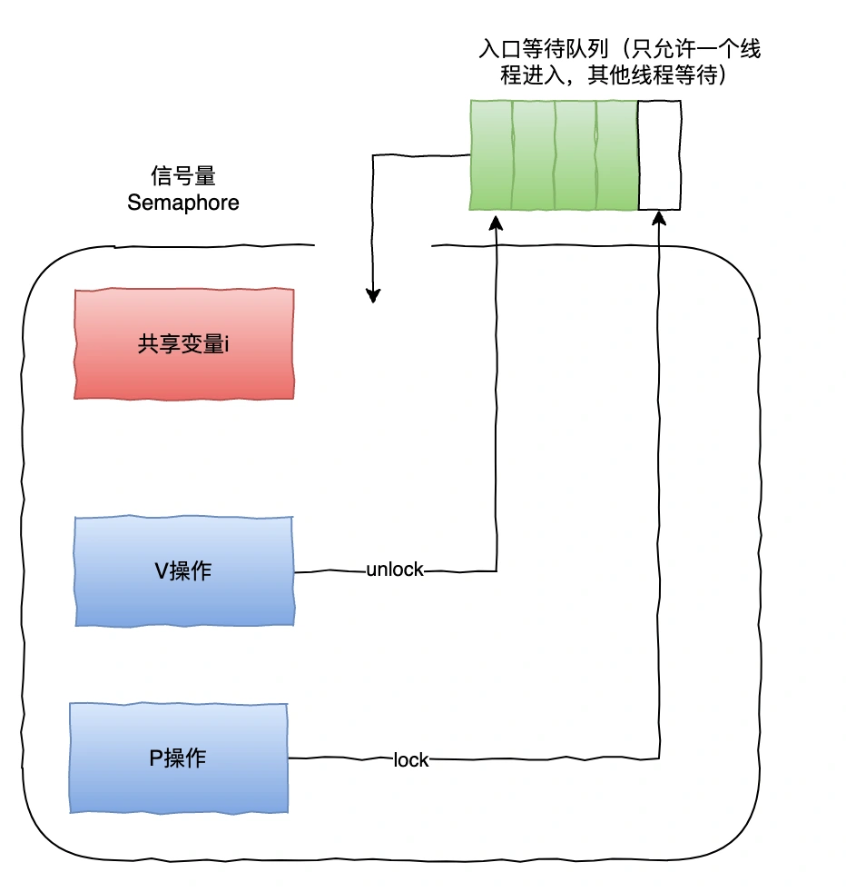
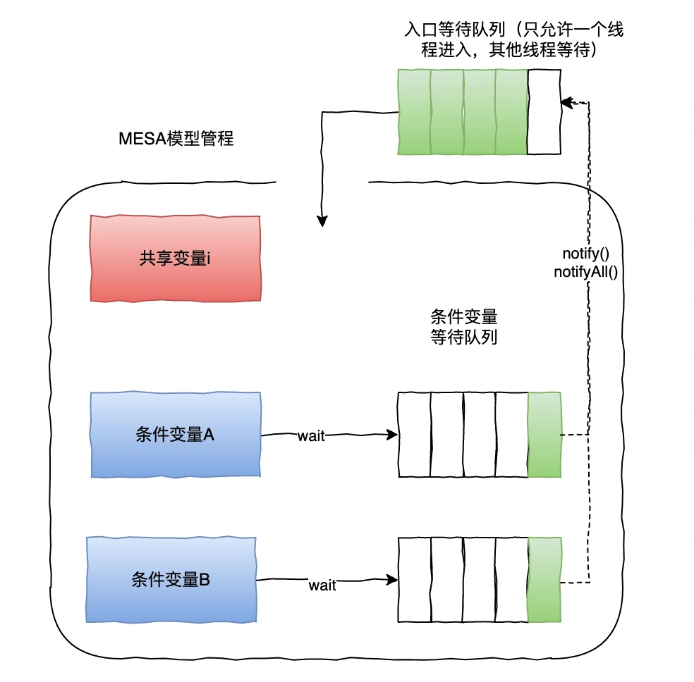
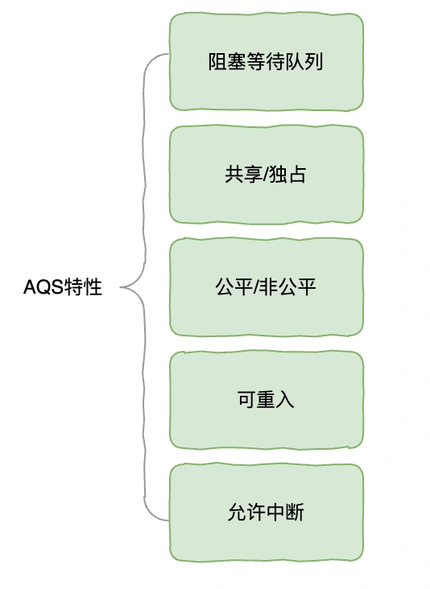
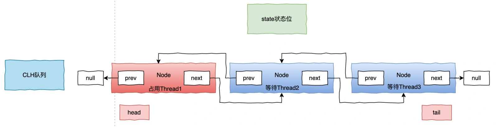
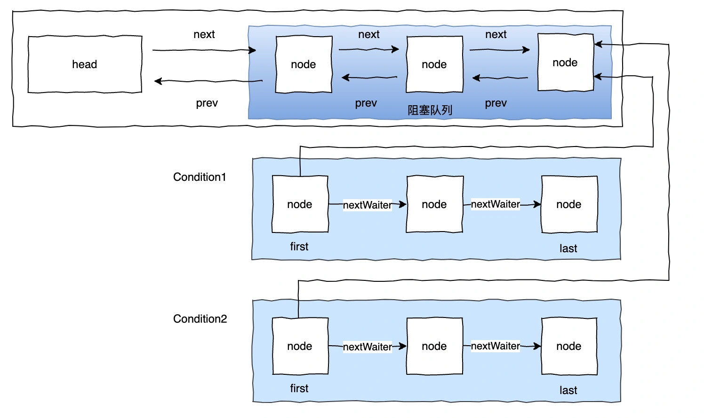
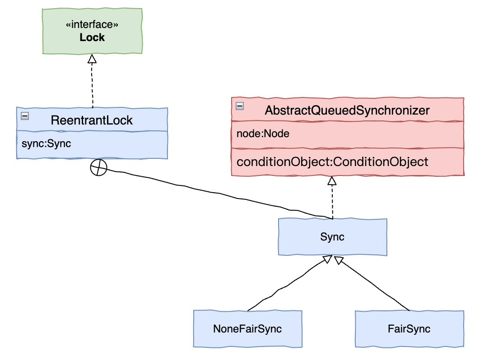
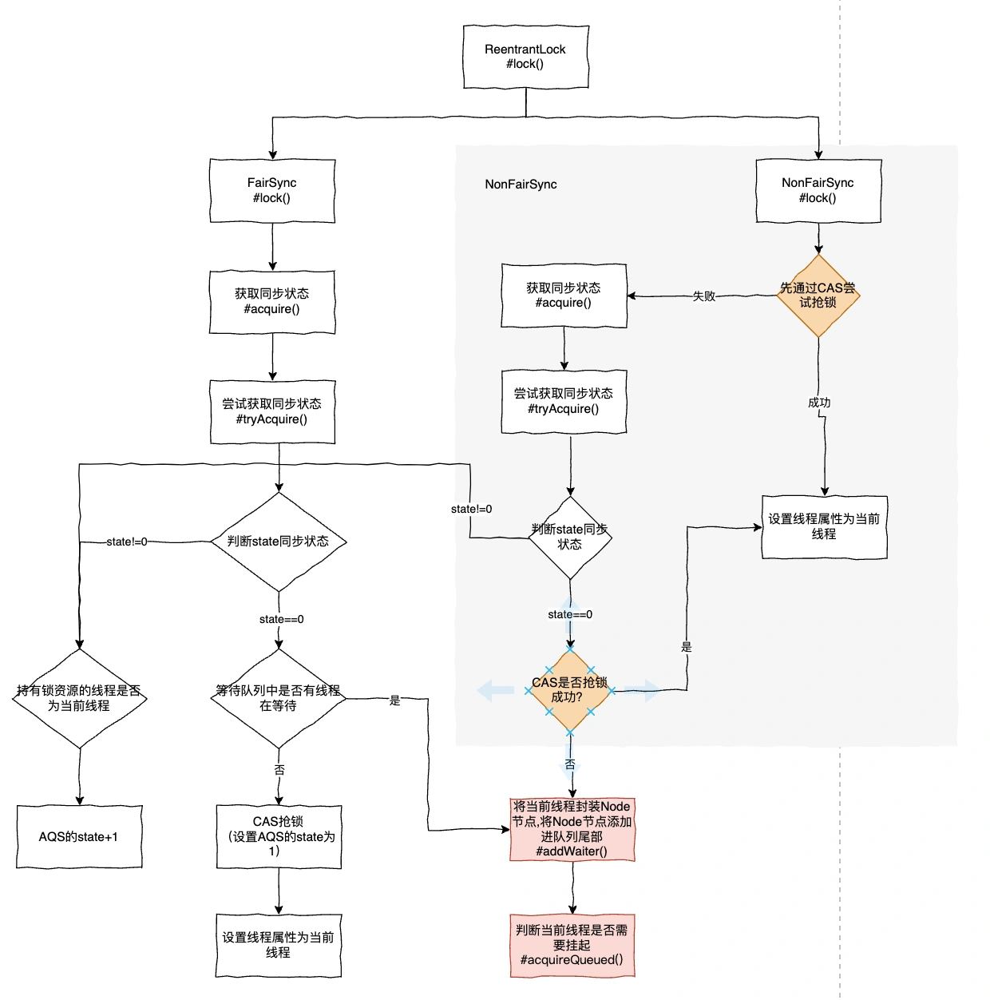
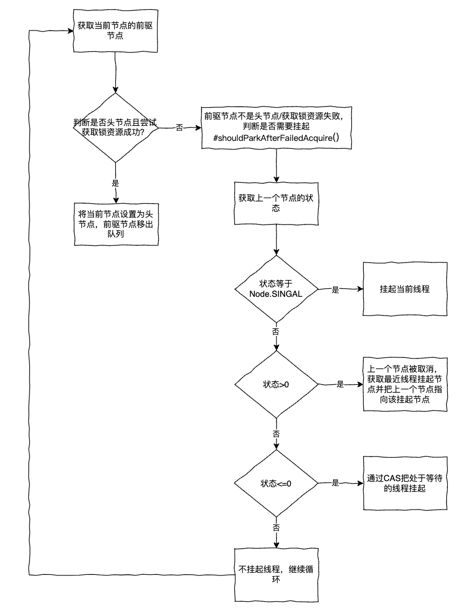

# 04｜谈谈你对 AQS 的理解，为什么它是锁的灵魂？

<font style="color:rgb(51, 51, 51);background-color:rgb(248, 246, 244);">相信大家对于 AQS 都有所耳闻，AQS（ AbstractQueuedSynchronizer ）是一个用来构建锁和同步器的抽象类，是 Java 中众多锁和并发工具的基础。</font>

<font style="color:rgb(51, 51, 51);background-color:rgb(248, 246, 244);">而在面试中，关于 AQS 的问题也是层出不穷，所以，掌握 AQS 的核心实现原理至关重要，希望大家在读完本篇文章都有所收获。</font>

# <font style="color:rgb(0, 0, 0);background-color:rgb(248, 246, 244);">信号量和管程</font>
<font style="color:rgb(51, 51, 51);background-color:rgb(248, 246, 244);">在并发编程领域由几个核心概念：</font>

+ <font style="color:rgb(51, 51, 51);background-color:rgb(248, 246, 244);">互斥：只有一个线程能访问临界区。</font>
+ <font style="color:rgb(51, 51, 51);background-color:rgb(248, 246, 244);">临界资源：多个线程可以共享系统中的资源，但是临界资源在同一时刻只允许一个线程访问。</font>
+ <font style="color:rgb(51, 51, 51);background-color:rgb(248, 246, 244);">临界区：访问临界资源的代码即临界区。</font>

<font style="color:rgb(51, 51, 51);background-color:rgb(248, 246, 244);">管程和信号量是操作系统中实现并发编程的两种重要技术。</font>

+ <font style="color:rgb(51, 51, 51);background-color:rgb(248, 246, 244);">信号量：是一种低级的同步工具，是一个计数器，用于控制对共享资源的访问。信号量的值表示可用的资源数量。</font>

<font style="color:rgb(51, 51, 51);background-color:rgb(248, 246, 244);">主要包含共享变量 S、P 操作（申请资源）和 V 操作（释放资源）。P 操作会使 S 值减一，当 S 值为负时，表示没有资源可操作，此时要进入等待队列； V 操作会使信号量的值加一，并唤醒等待队列中的线程。</font>



+ <font style="color:rgb(51, 51, 51);background-color:rgb(248, 246, 244);">管程：为了解决信号量在临界区的 PV 操作上的配对的麻烦而提出的并发编程方法，使用条件变量等同步机制来实现线程之间的协作。</font>

<font style="color:rgb(51, 51, 51);background-color:rgb(248, 246, 244);">MESA 模型的 wait()是进入条件变量的等待队列，当被 notify()或者 notifyAll()唤醒，会从条件变量等待队列进入入口等待队列。</font>



<font style="color:rgb(100, 100, 100);background-color:rgb(248, 246, 244);">小白：等等，什么是条件变量等待队列呀？</font>

<font style="color:rgb(51, 51, 51);background-color:rgb(248, 246, 244);">打个比方，你去医院看病，就诊过程医生先让你去拍个 CT，于是你就去拍 CT 的队列（条件队列）排队了，这时医生可以给其他病人(线程)就诊，那当你拍完 CT 拿到结果后（满足条件变量）回来给医生看，不是立马执行，而是需要先进入入口等待队列里面，等待医生给你看结果。</font>

<font style="color:rgb(51, 51, 51);background-color:rgb(248, 246, 244);">而这个场景下如果用信号量实现，那会比较复杂，而且如果用不好，还会有死锁的问题。</font>

<font style="color:rgb(51, 51, 51);background-color:rgb(248, 246, 244);">在 Java 中，锁大多都是通过管程来实现的，比如大家熟悉的 Synchronized、AQS。这里先通过信号量、管程的对比帮助大家开始了解 AQS 的设计。</font>

# <font style="color:rgb(0, 0, 0);background-color:rgb(248, 246, 244);">AQS 实现原理</font>
<font style="color:rgb(51, 51, 51);background-color:rgb(248, 246, 244);">Java 并发编程核心在于 java.cocurrent.util 包，而 juc 里面大多同步器的实现都有共同的特点：等待队列、条件队列、独占获取、共享获取等，那么这个场景很容易就让我们想到用模板方法的设计模式来实现。</font>

<font style="color:rgb(51, 51, 51);background-color:rgb(248, 246, 244);">在 AQS 中实现了锁的获取释放框架，实际逻辑由子类去实现，而核心的队列入队出队操作在 AQS 父类抽象出来，正是基于这种抽象变与不变的思想，AQS 定义了一套多线程并发编程的抽象框架。</font>

<font style="color:rgb(51, 51, 51);background-color:rgb(248, 246, 244);">AQS 核心特性。</font>



<font style="color:rgb(51, 51, 51);background-color:rgb(248, 246, 244);">我们再来看下 AQS 的基本结构，它维护了一个共享资源 state 和一个 FIFO 的等待队列，底层通过 CAS 机制保证了操作的原子性。</font>

<font style="color:rgb(51, 51, 51);background-color:rgb(248, 246, 244);">上文讲过，AQS 是基于 MESA 模型实现的，所以在 AQS 中有两种队列：</font>

1. <font style="color:rgb(51, 51, 51);background-color:rgb(248, 246, 244);">同步等待队列：AQS 的同步等待队列也称为 CLH 队列，主要是 Craig、Landin、Hagersten 这三位大佬发明的一种基于双向链表数据结构的队列，是 FIFO 先入先出等待队列。</font>



1. <font style="color:rgb(51, 51, 51);background-color:rgb(248, 246, 244);">条件等待队列：Condition 是一个多线程间协调通信的工具，主要使某些线程一起等待某个条件，等具备该条件时，这些线程会被唤醒，从而进去等待队列中争夺锁资源。</font>



<font style="color:rgb(51, 51, 51);background-color:rgb(248, 246, 244);">AQS 还定义了两种资源获取方式:</font>

1. <font style="color:rgb(51, 51, 51);background-color:rgb(248, 246, 244);">Exclusive-独占，只有一个线程能执行成功，如 ReentrantLock。</font>
2. <font style="color:rgb(51, 51, 51);background-color:rgb(248, 246, 244);">Share-共享，多个线程可以同时执行成功，如 Semaphore/CountDownLatch，当然还有读写锁的读锁，因为不涉及数据一致性问题，也是通过共享模式获取资源。</font>

<font style="color:rgb(51, 51, 51);background-color:rgb(248, 246, 244);">在 AQS 中，不同场景下，不同的同步器争抢资源的方式不同，但是不同的同步器只需要共享资源 state 的获取和释放方法即可，至于线程等待队列的维护（比如入队/唤醒出队）在 AQS 顶层已实现好，如果你要自定义一个同步器，通常需要实现以下几个方法：</font>

+ <font style="color:rgb(51, 51, 51);background-color:rgb(248, 246, 244);">isHeldExclusively：该线程是否正在独占资源</font>
+ <font style="color:rgb(51, 51, 51);background-color:rgb(248, 246, 244);">tryAcquire(int)：独占方法。尝试获取资源，成功返回 true，失败返回 false。</font>
+ <font style="color:rgb(51, 51, 51);background-color:rgb(248, 246, 244);">tryRelease(int)：独占方法。尝试释放资源，成功返回 true，失败返回 false。</font>
+ <font style="color:rgb(51, 51, 51);background-color:rgb(248, 246, 244);">tryAcquireShared(int)：独占方法。尝试获取资源，负数表示失败，大于等于 0 表示成功。</font>
+ <font style="color:rgb(51, 51, 51);background-color:rgb(248, 246, 244);">tryReleaseShared(int)：独占方法。尝试释放资源，如果释放后允许唤醒后续等待节点返回 true，否则返回 false。</font>

<font style="color:rgb(100, 100, 100);background-color:rgb(248, 246, 244);">那么，你知道 JUC 中不同锁/同步器都是怎么实现的吗？</font>

# <font style="color:rgb(0, 0, 0);background-color:rgb(248, 246, 244);">AQS 源码分析</font>
<font style="color:rgb(51, 51, 51);background-color:rgb(248, 246, 244);">ReentrantLock 是我们经常使用到一种锁，下面我们以它为例子，分析它是如何实现获取和释放锁资源的，一起来揭开 AQS 的神秘面纱。</font>

<font style="color:rgb(51, 51, 51);background-color:rgb(248, 246, 244);">我们都知道 ReentrantLock 是独占锁，有公平和非公平锁两种模式。</font>

<font style="color:rgb(51, 51, 51);background-color:rgb(248, 246, 244);">什么是公平和非公平锁？</font>

+ <font style="color:rgb(51, 51, 51);background-color:rgb(248, 246, 244);">公平锁：指多个线程按照申请锁的顺序来获取锁，即按照线程的先后顺序排队获取锁。当一个线程释放锁后，等待时间最长的线程会获得锁的访问权，保证每个线程都有机会获取到锁，避免饥饿现象的发生</font>
+ <font style="color:rgb(51, 51, 51);background-color:rgb(248, 246, 244);">非公平锁：指多个线程获取锁的顺序是不确定的，不按照申请锁的顺序排队。一个线程在等待锁时，有可能在其他线程释放锁后立即获取锁，允许某些线程相对于其他线程具有更高的获取锁的机会。</font>

<font style="color:rgb(51, 51, 51);background-color:rgb(248, 246, 244);">我们先来看下 ReentrantLock 相关核心类的关系。</font>



<font style="color:rgb(51, 51, 51);background-color:rgb(248, 246, 244);">FairSync 和 NoneFairSync 是 ReentrantLock 实现的内部类，ReentrantLock 公平锁和非公平锁就是通过它们来实现的。</font>

## **<font style="color:rgb(34, 34, 34);background-color:rgb(248, 246, 244);">lock</font>**
<font style="color:rgb(51, 51, 51);background-color:rgb(248, 246, 244);">然后再来看下 lock()方法的流程。</font>



<font style="color:rgb(51, 51, 51);background-color:rgb(248, 246, 244);">由上面可看出，ReentrantLock 实现的公平锁、非公平锁唯一的区别在于，非公平锁在一开始调用获取资源方式时，就直接尝试获取锁，不会判断等待队列是否有线程在等待，获取不到时，再把线程添加到等待队列中。</font>

<font style="color:rgb(100, 100, 100);background-color:rgb(248, 246, 244);">小白：我有个问题，把线程节点添加到队列尾部后，为啥还要调用 acquireQueued 方法判断是否要挂起呀？</font>

<font style="color:rgb(51, 51, 51);background-color:rgb(248, 246, 244);">这个问题提得好，我们先来思考下，假设在线程获取锁资源失败把线程节点添加到队列中直接就挂起阻塞，意味着线程运行状态转换为阻塞，会带来 CPU 从用户态与内核态之间转换的两次操作（阻塞和唤醒），特别在并发场景下，这种切换会带来较大的性能开销，所以 AQS 在入队时首先会让线程通过自旋的方式来等待竞争锁。</font>

<font style="color:rgb(100, 100, 100);background-color:rgb(248, 246, 244);">小白：那么这里 acquireQueued 方法是如何实现的呢？</font>

<font style="color:rgb(51, 51, 51);background-color:rgb(248, 246, 244);">先看下核心源码</font>

```plain
final boolean acquireQueued(final Node node, int arg) {
        // 获取锁资源标识
        boolean failed = true;
        try {
            boolean interrupted = false;
            // 自旋
            for (;;) {
                // 获取当前节点的前驱节点
                final Node p = node.predecessor();
                // 当前节点的前驱节点为头节点，并获取锁资源成功
                if (p == head && tryAcquire(arg)) {
                    //把当前节点设置为头节点
                    setHead(node);
                    // 原头节点的下节点指向设置为null，方便GC回收
                    p.next = null; // help GC
                    // 设置锁资源获取成功
                    failed = false;
                    return interrupted;
                }
                // 如果当前节点不是head的下一节点/获取锁资源失败，尝试挂起线程
                if (shouldParkAfterFailedAcquire(p, node) &&
                    parkAndCheckInterrupt())
                    interrupted = true;
            }
        } finally {
            if (failed)
                cancelAcquire(node);
        }
    }
```

<font style="color:rgb(51, 51, 51);background-color:rgb(248, 246, 244);">通过源码，我们发现它主要是根据上一节点的状态来判断是否需要挂起，那么我们先看下 Node 有哪几个状态。</font>

+ <font style="color:rgb(51, 51, 51);background-color:rgb(248, 246, 244);">CANCELLED：1，线程已被取消。</font>
+ <font style="color:rgb(51, 51, 51);background-color:rgb(248, 246, 244);">SIGNAL：-1，等待队列中存在待被唤醒的挂起线程。</font>
+ <font style="color:rgb(51, 51, 51);background-color:rgb(248, 246, 244);">CONDITION：-2，当前线程在 Condition 队列中，未在 AQS 队列中。</font>
+ <font style="color:rgb(51, 51, 51);background-color:rgb(248, 246, 244);">PROPAGATE：-3，表示后续结点会传播唤醒的操作，共享模式下起作用。</font>

<font style="color:rgb(51, 51, 51);background-color:rgb(248, 246, 244);">通过流程图分析。</font>



<font style="color:rgb(51, 51, 51);background-color:rgb(248, 246, 244);">以上就是获取锁的全部流程啦，怎么样，通过流程图分析后是不是觉得很简单呢。</font>

<font style="color:rgb(100, 100, 100);background-color:rgb(248, 246, 244);">小白：嗯嗯，我还有一个疑问，为什么 acquireQueued 方法里面还要判断线程是否中断呢？</font>

<font style="color:rgb(51, 51, 51);background-color:rgb(248, 246, 244);">嗯不错，你看得很细，一般线程中断可以按中断时线程状态分为两种：1、运行时中断；2、阻塞或等待线程中断。一般有中断时，运行时的线程会在某个取消点中断执行，其实这也可以理解，因为如果立刻中断，那么容易造成对象状态不一致的情况发生。而阻塞或等待状态的线程大多会立即响应中断。</font>

<font style="color:rgb(51, 51, 51);background-color:rgb(248, 246, 244);">但是 JUC 中获取独占锁的阻塞状态不会立即响应中断，这里在 acquireQueued 方法中对线程的中断状态判断，如果中断了返回 true，执行 selfInterrupt 方法进入中断状态，但注意是在获取锁之后，在获取到锁之前是不会做出响应的。</font>

## **<font style="color:rgb(34, 34, 34);background-color:rgb(248, 246, 244);">unLock</font>**
<font style="color:rgb(51, 51, 51);background-color:rgb(248, 246, 244);">看完了 lock 方法，我们再来看下 unlock 释放资源的实现，ReentrantLock 实际调用的是 AQS 的 release 方法。</font>

<font style="color:rgb(51, 51, 51);background-color:rgb(248, 246, 244);">核心代码</font>

```java
public final boolean release(int arg) {
        //尝试释放锁，返回锁资源的计数值
        if (tryRelease(arg)) {
            //获取等待队列头节点
            Node h = head;
            if (h != null && h.waitStatus != 0)
                //唤醒等待队列中待唤醒的节点
                unparkSuccessor(h);
            //表示完全释放锁资源
            return true;
        }
        //表示未完全释放锁资源
        return false;
    }
```

<font style="color:rgb(51, 51, 51);background-color:rgb(248, 246, 244);">进去 release 方法，发现实际调用的还是 ReentrantLock 自己实现的 tryRelease 方法</font>

```java
protected final boolean tryRelease(int releases) {
        //修改AQS的state
        int c = getState() - releases;
        //当前线程不是持有锁线程，抛出异常
        if (Thread.currentThread() != getExclusiveOwnerThread())
            throw new IllegalMonitorStateException();
        //是否完全释放锁资源标识
        boolean free = false;
        if (c == 0) {
            //修改标识，表示完全释放
            free = true;
            //将占用锁资源的属性设置为null
            setExclusiveOwnerThread(null);
        }
        //设置state值
        setState(c);
        //为true表示当前线程完全释放资源
        //为false表示当前线程未完全释放
        return free;
    }
```

<font style="color:rgb(51, 51, 51);background-color:rgb(248, 246, 244);">以上就是释放资源的实现原理。</font>

<font style="color:rgb(51, 51, 51);background-color:rgb(248, 246, 244);">好了，通过对 ReentrantLock 的实现分析完后，你对 AQS 底层的原理是不是了解得更多了呢？那么你知道怎么学习其他同步器都是如何实现的了吗？</font>

<font style="color:rgb(100, 100, 100);background-color:rgb(248, 246, 244);">最后，我们再看来看一个问题，为什么 AQS 要使用双向链表呢？</font>

<font style="color:rgb(51, 51, 51);background-color:rgb(248, 246, 244);">首先，我们来看下双向链表的特点，双向链表有两个指针，一个指针指向前置节点，一个指针指向后继节点，因此可以快速找到前置节点。双向链表支持在两端进行高效的操作，尾部添加新节点，头部移除节点。可以保证先进先出的顺序，实现一定的公平性。</font>

<font style="color:rgb(51, 51, 51);background-color:rgb(248, 246, 244);">AQS 在多个地方需要获取前置节点的信息，比如在入队时需要判断前置节点的状态来决定是否阻塞；在线程自旋阻塞时，只有头节点的下一节点才需要竞争锁，否则全部都去争抢会造成羊群效应，为了避免这个问题，加入到链表的节点在争抢锁之前需要判断前置节点是否头节点。</font>

<font style="color:rgb(51, 51, 51);background-color:rgb(248, 246, 244);">而在单向链表中，去查找前置节点的效率显然比双向链表低很多。</font>

<font style="color:rgb(51, 51, 51);background-color:rgb(248, 246, 244);">扩展:CountDownLatch 是如何实现的呢？</font>

<font style="color:rgb(0, 0, 0);background-color:rgb(248, 246, 244);">  
</font>


> 更新: 2024-10-08 11:21:29  
> 原文: <https://www.yuque.com/yuqueyonghue6cvnv/cxhfwd/gg85h465g0ziqx1n>