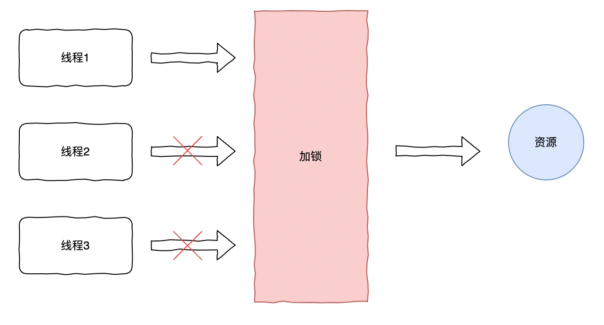
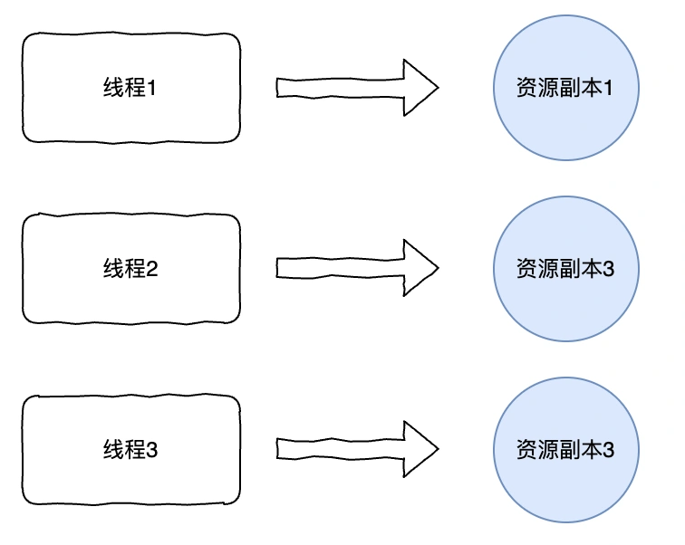
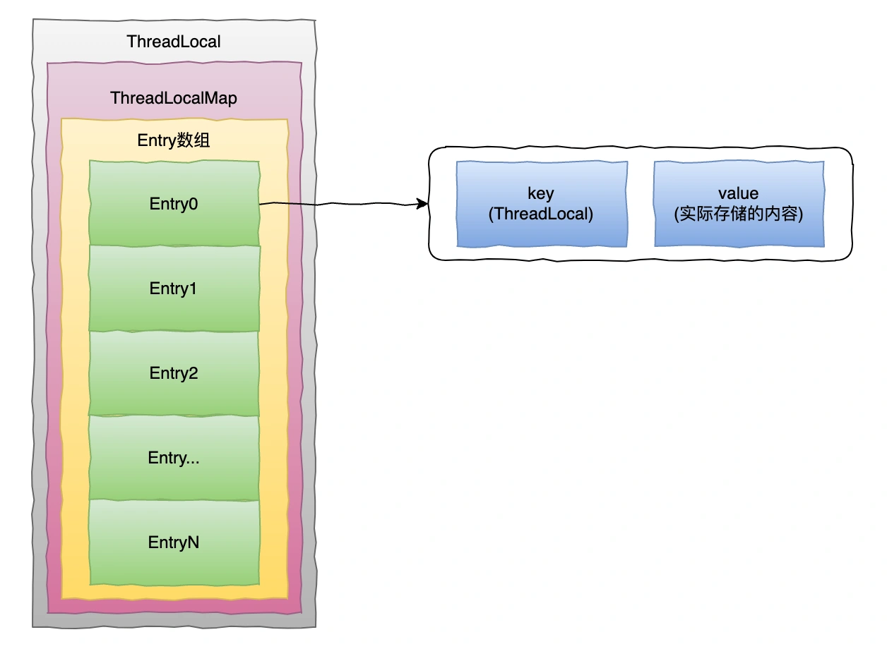
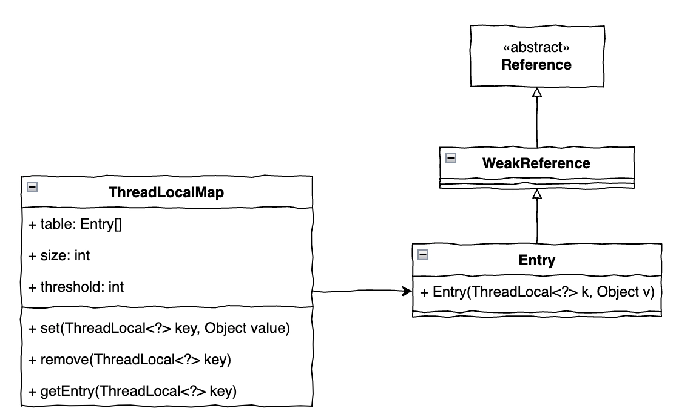
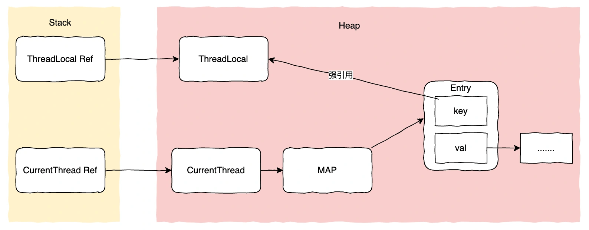
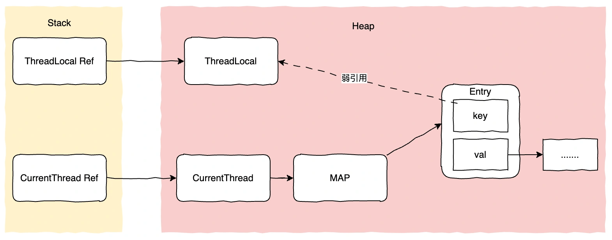

# 05｜ThreadLocal会导致内存泄露么？在什么场景使用？

# <font style="color:rgb(0, 0, 0);background-color:rgb(248, 246, 244);">什么是ThreadLocal？</font>
<font style="color:rgb(51, 51, 51);background-color:rgb(248, 246, 244);">之前我们了解到解决并发安全问题大多情况下是使用锁的方式，如下</font>



<font style="color:rgb(100, 100, 100);background-color:rgb(248, 246, 244);">那除了加锁，有没有别的方式呢？</font>

<font style="color:rgb(51, 51, 51);background-color:rgb(248, 246, 244);">当然，我们先来看下ThreadLocal是用来干嘛的。</font>

<font style="color:rgb(51, 51, 51);background-color:rgb(248, 246, 244);">Java官方文档中的描述：</font>**<font style="color:rgb(34, 34, 34);background-color:rgb(248, 246, 244);">ThreadLocal类用来提供线程内部的局部变量</font>**<font style="color:rgb(51, 51, 51);background-color:rgb(248, 246, 244);">。在多线程环境下访问时保证各个线程的变量独立于其他线程，而不是共享变量，采用空间换时间的方式来避免线程间的同步问题。</font>



<font style="color:rgb(100, 100, 100);background-color:rgb(248, 246, 244);">再举个常见的场景，用户登录某电商网站后，进行浏览商品，加购到购物车下单等操作，那么我们后台服务接口处理中都需要拿到用户信息，那么用户信息保存在哪比较合适呢，还是通过每个方法逐层传递下去呢？有没有更好的方式实现？</font>

<font style="color:rgb(51, 51, 51);background-color:rgb(248, 246, 244);">这个场景下，显然通过Threadlocal实现就比较合适，用户登录后，由前端把信息传递给后端，在请求的开始可以通过切面保存到ThreadLocal，那么后续只要是这个请求的处理线程都能比较方便地取到对应用户会话信息了。</font>

<font style="color:rgb(51, 51, 51);background-color:rgb(248, 246, 244);">让我们先用一个简单的demo来了解如何使用ThreadLocal。</font>

```csharp
public class UserThreadLocal {

    //初始化，创建ThreadLocal
    private static ThreadLocal<User> userSession = new ThreadLocal<>();

    //设置当前线程ThreadLocal值
    public static void setUser(User user){
        userSession.set(user);
    }

    //获取当前线程ThreadLocal值
    public static User getUser(User user){
        return userSession.get();
    }

    //删除当前线程ThreadLocal值
    public static void removeUser(User user){
        userSession.remove();
    }
}
```

<font style="color:rgb(100, 100, 100);background-color:rgb(248, 246, 244);">那你知道ThreadLocal是如何做到线程之间数据隔离的吗？</font>

# <font style="color:rgb(0, 0, 0);background-color:rgb(248, 246, 244);">ThreadLocal原理</font>
<font style="color:rgb(51, 51, 51);background-color:rgb(248, 246, 244);">接下来我们来看下ThreadLocal的内部结构，一起学习下它内部实现线程隔离的原理。</font>

<font style="color:rgb(51, 51, 51);background-color:rgb(248, 246, 244);">在JDK8的ThreadLocal设计中，每个线程维护一个ThreadLocalMap，每个Map的key是ThreadLocal对象本身，value才是我们真正要存的内容。</font>



<font style="color:rgb(51, 51, 51);background-color:rgb(248, 246, 244);">正是通过这种方式，不同线程是获取不到当前线程的数据副本，从而形成了线程间数据的隔离。</font>

<font style="color:rgb(100, 100, 100);background-color:rgb(248, 246, 244);">那么它的核心源码是如何实现的呢？</font>

<font style="color:rgb(51, 51, 51);background-color:rgb(248, 246, 244);">ThreadLocal核心源码</font>

<font style="color:rgb(51, 51, 51);background-color:rgb(248, 246, 244);">ThreadLocal主要由以下几个核心方法</font>

+ <font style="color:rgb(51, 51, 51);background-color:rgb(248, 246, 244);">protected T initialValue(). //设置初始化值，可以自定义子类重写</font>
+ <font style="color:rgb(51, 51, 51);background-color:rgb(248, 246, 244);">public void set( T value). //设置当前线程的数据副本</font>
+ <font style="color:rgb(51, 51, 51);background-color:rgb(248, 246, 244);">public T get() //获取当前线程的数据副本</font>
+ <font style="color:rgb(51, 51, 51);background-color:rgb(248, 246, 244);">public void remove() //删除当前的数据副本</font>

<font style="color:rgb(51, 51, 51);background-color:rgb(248, 246, 244);">接下来看它的源码分析。</font>

## **<font style="color:rgb(34, 34, 34);background-color:rgb(248, 246, 244);">set 方法</font>**
```plain
/**
     * 设置当前线程对应的ThreadLocal值
     */
    public void set(T value) {
        //获取当前线程
        Thread t = Thread.currentThread();
        //获取当前线程的ThreadLocalMap
        ThreadLocal.ThreadLocalMap map = getMap(t);
        if (map != null) {
            //如果ThreadLocalMap已存在，设置对应值
            map.set(this, value);
        } else {
            //1、如果ThreadLocalMap不存在,先初始化，
            //2、然后把t当前线程和v值存到ThreadLocalMap的第一个Entry
            createMap(t, value);
        }
    }
```

## **<font style="color:rgb(34, 34, 34);background-color:rgb(248, 246, 244);">get 方法</font>**
```java
/**
     * 返回当前线程对应ThreadLocal值
     * @return
     */
    public T get() {
        //获取当前线程
        Thread t = Thread.currentThread();
        //获取当前线程的ThreadLocalMap
        ThreadLocal.ThreadLocalMap map = getMap(t);
        if (map != null) {
            //如果ThreadLocalMap已存在,以当前ThreadLocal为key，获取对应的值
            ThreadLocal.ThreadLocalMap.Entry e = map.getEntry(this);
            if (e != null) {
                @SuppressWarnings("unchecked")
                T result = (T)e.value;
                return result;
            }
        }
        //初始化
        return setInitialValue();
    }
    //设置初始化
    private T setInitialValue() {
        //获取初始化值，可以自定义自类重写该方法
        T value = initialValue();
        //获取当前线程
        Thread t = Thread.currentThread();
        //获取当前线程的ThreadLocalMap
        ThreadLocal.ThreadLocalMap map = getMap(t);
        if (map != null) {
            //不为空的情况，设置初始化值
            map.set(this, value);
        } else {
            //1、如果ThreadLocalMap不存在,先初始化，
            //2、然后把t当前线程和v值存到ThreadLocalMap的第一个Entry
            createMap(t, value);
        }
        if (this instanceof TerminatingThreadLocal) {
            TerminatingThreadLocal.register((TerminatingThreadLocal<?>) this);
        }
        return value;
    }
```

<font style="color:rgb(51, 51, 51);background-color:rgb(248, 246, 244);">删除方法</font>

```csharp
/**
     * 删除当前线程中保存ThreadLocal对应的实体entry
     */
    public void remove() {
        //获取当前线程的ThreadLocalMap
        ThreadLocal.ThreadLocalMap m = getMap(Thread.currentThread());
        if (m != null) {
            //如果存在，以当前ThreadLocal为key，删除对应entry
            m.remove(this);
        }
    }
```

<font style="color:rgb(51, 51, 51);background-color:rgb(248, 246, 244);">看完这几个核心方法的实现源码，其实ThreadLocal就是围绕着ThreadLocalMap来实现的，我们来看下ThreadLocalMap的核心类图。</font>



<font style="color:rgb(100, 100, 100);background-color:rgb(248, 246, 244);">不难发现，ThreadLocalMap的Entry继承WeakReference，也就是key(ThreadLocal)是弱引用，那么为什么要这么设计呢，可以用强引用吗？</font>

# <font style="color:rgb(0, 0, 0);background-color:rgb(248, 246, 244);">ThreadLocal 什么情况下会内存泄漏？</font>
<font style="color:rgb(51, 51, 51);background-color:rgb(248, 246, 244);">这时，让我们回到主题，ThreadLocal 会导致内存泄露么，答案是，会的。那么内存泄露和弱引用没有关系呢，也不见得，下面我们来一起分析下。</font>

<font style="color:rgb(51, 51, 51);background-color:rgb(248, 246, 244);">首先先看下Java的强、弱引用类型</font>

+ <font style="color:rgb(51, 51, 51);background-color:rgb(248, 246, 244);">强引用，就是最常见的对象引用，只要引用还指向一个对象，垃圾回收器就不会对该对象进行回收。</font>
+ <font style="color:rgb(51, 51, 51);background-color:rgb(248, 246, 244);">弱引用：垃圾回收器一旦发现只有弱引用的对象，不管当前内存是否足够，都会回收该对象。</font>

<font style="color:rgb(51, 51, 51);background-color:rgb(248, 246, 244);">（1）如果ThreadLocal使用强引用，如下图</font>



<font style="color:rgb(51, 51, 51);background-color:rgb(248, 246, 244);">业务代码调用完ThreadLocal后，ThreadLocal Ref被回收了，但是ThreadLocalMap的Entry强引用了ThreadLocal，会导致Threadlocal无法被回收。</font>

<font style="color:rgb(51, 51, 51);background-color:rgb(248, 246, 244);">那一般我们使用线程池的情况下（自定义或Tomcat线程池），这个线程还一直在运行着，而我们又没有手动删除，就会导致内存泄露的情况发生。</font>

<font style="color:rgb(51, 51, 51);background-color:rgb(248, 246, 244);">（2）如果ThreadLocal使用弱引用，如下图</font>



<font style="color:rgb(51, 51, 51);background-color:rgb(248, 246, 244);">业务代码调用完ThreadLocal后，ThreadLocal Ref被回收了，此时没有任何强引用指向ThreadLocal，ThreadLocal会在下次gc时被回收掉。但如果没有手动删除Entry的话，对val的强引用链还是会一直存在。</font>

<font style="color:rgb(51, 51, 51);background-color:rgb(248, 246, 244);">所以如果我们要避免内存泄漏的问题发生，一定要在业务代码最后调用remove方法，它会把Entry的key和val都设置为null，通常在finally里面执行，这样即使抛出异常也会被调用到。</font>

<font style="color:rgb(100, 100, 100);background-color:rgb(248, 246, 244);">那如果没有调用remove方法呢？</font>

<font style="color:rgb(51, 51, 51);background-color:rgb(248, 246, 244);">我们如果看了get、set方法会发现它会把key为null的value值设为null，其实弱引用比强引用多了这一层保障。但即使ThreadLocal使用了弱引用，如果线程使用完后没有调用remove、get、set这三个方法其中一个的话，最后还是可能会导致内存泄露的。</font>

<font style="color:rgb(100, 100, 100);background-color:rgb(248, 246, 244);">最后，再问个问题，你知道ThreadLocal会在什么场景下用到吗？</font>

<font style="color:rgb(51, 51, 51);background-color:rgb(248, 246, 244);">那可太多了</font>

+ <font style="color:rgb(51, 51, 51);background-color:rgb(248, 246, 244);">Spring事务TransactionSynchronizationManager就是使用ThreadLocal管理当前线程事务上下文。</font>
+ <font style="color:rgb(51, 51, 51);background-color:rgb(248, 246, 244);">Apache Log4j使用ThreadLocal管理每个线程的日志上下文，方便在日志输出时可以包含特定线程的上下文信息。</font>
+ <font style="color:rgb(51, 51, 51);background-color:rgb(248, 246, 244);">Mybatis使用ThreadLocal管理SqlSession。</font>
+ <font style="color:rgb(51, 51, 51);background-color:rgb(248, 246, 244);">动态多数据源切换场景，使用ThreadLocal管理当前线程数据源标识。</font>
+ <font style="color:rgb(51, 51, 51);background-color:rgb(248, 246, 244);">日常开发中的请求链追踪ID，用户认证等信息都可以使用ThreadLocal来传递。</font>


> 更新: 2024-10-08 11:21:39  
> 原文: <https://www.yuque.com/yuqueyonghue6cvnv/cxhfwd/vc04g4gclztrxi97>