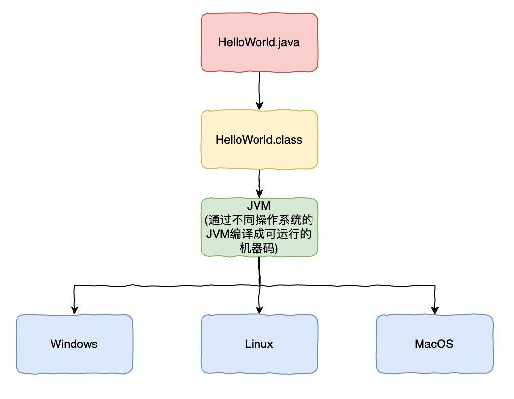
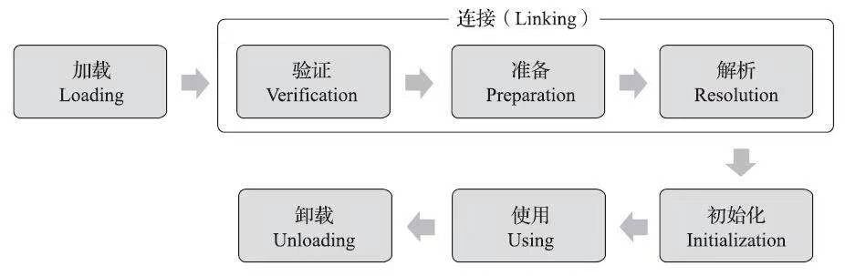
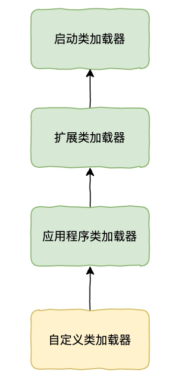
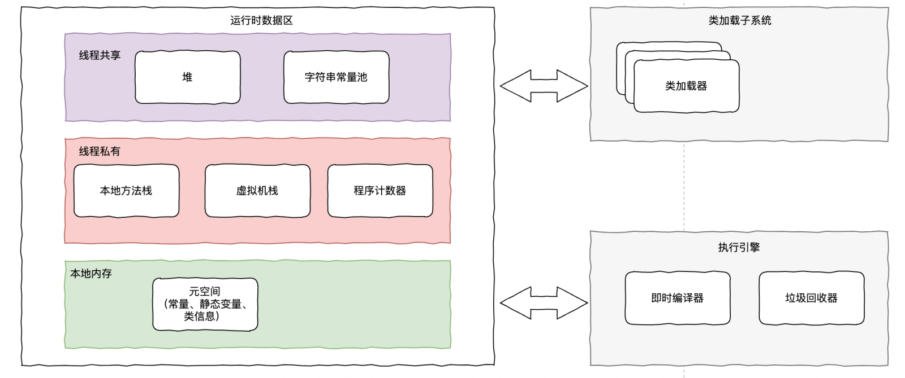
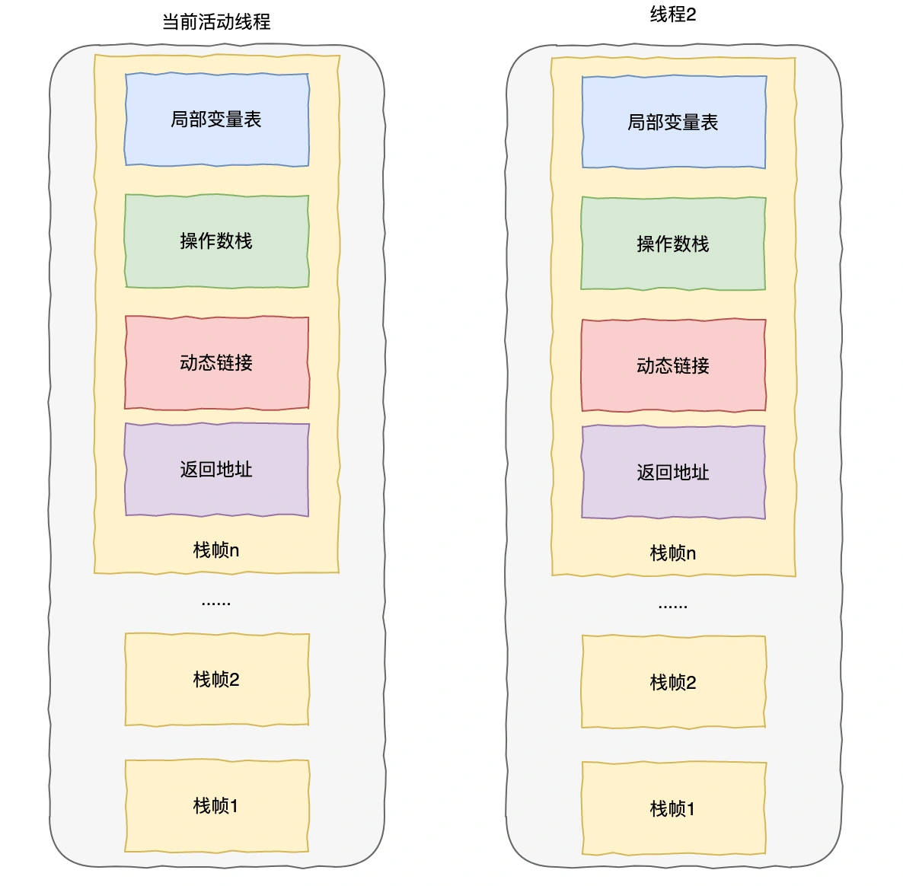

# 06 | JVM 类加载机制和JVM内存区域划分

# <font style="color:rgb(0, 0, 0);background-color:rgb(248, 246, 244);">JDK、JRE 区别知道吗？</font>
<font style="color:rgb(51, 51, 51);background-color:rgb(248, 246, 244);">JDK：我们可以把 Java 程序、Java 虚拟机、Java 类库三部份统称为 JDK，JDK 是用于支持 Java 程序开发的最小环境，包含了编译 Java 代码所需的编译器、调试器、工具和库。</font>

+ <font style="color:rgb(51, 51, 51);background-color:rgb(248, 246, 244);">JRE：是支持 Java 程序运行的标准环境，包含了运行 Java 程序所需的 Java 虚拟机（JVM）和核心类库。</font>
+ <font style="color:rgb(51, 51, 51);background-color:rgb(248, 246, 244);">JavaSE：支持面向桌面级应用的 Java 平台，提供了完整的 Java 核心 API。</font>
+ <font style="color:rgb(51, 51, 51);background-color:rgb(248, 246, 244);">JavaEE：支持使用多层架构的企业应用（如 ERP、MIS、CRM 应用）的 Java 平台。</font>

<font style="color:rgb(51, 51, 51);background-color:rgb(248, 246, 244);">通过不同平台上的 Java 虚拟机，实现跨平台的“一次编写，到处运行”。</font>



# <font style="color:rgb(0, 0, 0);background-color:rgb(248, 246, 244);">JVM 类加载机制了解多少？</font>
<font style="color:rgb(51, 51, 51);background-color:rgb(248, 246, 244);">一个 Java 类的整个生命周期会经历以下几个阶段：</font>

+ <font style="color:rgb(51, 51, 51);background-color:rgb(248, 246, 244);">加载：根据类的全限定名获取次此类的二进制流，读入到内存中转化为运行时数据结构，最后生成代表这个类的 class 对象。 验证：文件格式验证、元数据验证、字节码验证和符号引用验证，确保 class 文件无问题。</font>
+ <font style="color:rgb(51, 51, 51);background-color:rgb(248, 246, 244);">准备：为类的静态变量分配内存，设置初始默认值。</font>
+ <font style="color:rgb(51, 51, 51);background-color:rgb(248, 246, 244);">解析：将常量池内的符号引用替换为直接引用，编译阶段并不知道某个类或方法在内存那个位置，所以编译器会在常量池中生成一个符号引用。直接引用就是直接指向到内存中的实际位置）。 初始化：应用程序初始化类变量和其他资源值，执行静态化模块。</font>
+ <font style="color:rgb(51, 51, 51);background-color:rgb(248, 246, 244);">使用：经过以上几个阶段后可以提供给程序调用创建对象实例了。</font>
+ <font style="color:rgb(51, 51, 51);background-color:rgb(248, 246, 244);">卸载：当该类没有任何引用，所有对象实例已被回收，类加载器可卸载该类，释放内存空间。</font>



# <font style="color:rgb(0, 0, 0);background-color:rgb(248, 246, 244);">JVM 有哪些类加载器？</font>
<font style="color:rgb(51, 51, 51);background-color:rgb(248, 246, 244);">对于任意一个类，必须由类加载器加载的，类和类加载器一起共同确立了其在 Java 虚拟机中的唯一性。</font>

<font style="color:rgb(51, 51, 51);background-color:rgb(248, 246, 244);">Java 的类加载器可分为：</font>

+ <font style="color:rgb(51, 51, 51);background-color:rgb(248, 246, 244);">启动类加载器：负责加载 Java 的核心类库。</font>
+ <font style="color:rgb(51, 51, 51);background-color:rgb(248, 246, 244);">扩展类加载器：负责加载 Java 扩展目录下的类 ava Home\lib\ext 目录下。</font>
+ <font style="color:rgb(51, 51, 51);background-color:rgb(248, 246, 244);">应用类加载器：负责加载应用程序的类，通常是 classpath 指定目录下。</font>
+ <font style="color:rgb(51, 51, 51);background-color:rgb(248, 246, 244);">自定义类加载器：用户可自定义类加载器。</font>

<font style="color:rgb(100, 100, 100);background-color:rgb(248, 246, 244);">什么是双亲委派机制？</font>

<font style="color:rgb(51, 51, 51);background-color:rgb(248, 246, 244);">双亲委派机制：如果一个类加载器收到类加载的请求，它首先会把这个请求委派给父类加载器去完成，直到最顶层的启动类加载器，只有当父类加载器无法完成这个加载请求时，子类加载器才会去尝试自己加载。</font>

<font style="color:rgb(51, 51, 51);background-color:rgb(248, 246, 244);">这样做的好处就是：避免重复的类加载，保证被加载类的唯一性；保护 Java 核心类的安全，比如自己写的 java.lang.String.class 不会被加载，防止核心类被篡改。</font>



<font style="color:rgb(100, 100, 100);background-color:rgb(248, 246, 244);">双亲委派机制可以被打破吗？什么场景下需要用到？</font>

<font style="color:rgb(51, 51, 51);background-color:rgb(248, 246, 244);">可以的，比如 Tomcat 为例，Tomca 作为 Web 容器，存在以下需要解决的问题：</font>

1. <font style="color:rgb(51, 51, 51);background-color:rgb(248, 246, 244);">同一个 web 容器中存在多个应用程序，那么不同应用程序依赖的三方库版本存在差异，所以需要保证每个应用程序的类库都是独立的。</font>
2. <font style="color:rgb(51, 51, 51);background-color:rgb(248, 246, 244);">部署在同一个 web 容器中相同类相同版本可以共享</font>
3. <font style="color:rgb(51, 51, 51);background-color:rgb(248, 246, 244);">Web 容器自己依赖的类库需要和应用程序的隔离</font>

<font style="color:rgb(51, 51, 51);background-color:rgb(248, 246, 244);">所以 Tomcat 需要由自己实现的类加载器来打破双亲委派机制也就是自定义类加载器重写 loadclass 方法，核心代码如下：</font>

```typescript
protected Class<?> loadClass(String name, boolean resolve) {
        //......前置实现
        //非自定义类通过双亲委派加载
        if (!name.startsWith("com.myself.***")) {
            this.getParent().loadClass(name);
        } else {
            //自定义实现
            findClass(name);
        }
        //......后置实现
    }
```

# <font style="color:rgb(0, 0, 0);background-color:rgb(248, 246, 244);">简单介绍下 JVM 区域划分</font>
<font style="color:rgb(51, 51, 51);background-color:rgb(248, 246, 244);">JVM 主要包括类加载器、运行时数据、执行引擎和 JIT 编译器等。</font>



<font style="color:rgb(51, 51, 51);background-color:rgb(248, 246, 244);">运行时数据区按照线程私有公有可分为线程私有和线程共享两部分。</font>

## **<font style="color:rgb(34, 34, 34);background-color:rgb(248, 246, 244);">线程私有的</font>**
+ <font style="color:rgb(51, 51, 51);background-color:rgb(248, 246, 244);">本地方法栈：为虚拟机使用到的本地（Native）方法服务。</font>
+ <font style="color:rgb(51, 51, 51);background-color:rgb(248, 246, 244);">虚拟机栈：每个方法被执行的时候，Java 虚拟机栈都会同步创建一个栈帧，用于存储局部变量表、操作数栈、动态链接、方法出口等信息。每一个方法被调用至执行完成的过程中，对应着一个栈帧在虚拟机栈中入栈到出栈的过程。</font>



<font style="color:rgb(51, 51, 51);background-color:rgb(248, 246, 244);">下面用一个例子说明下</font>

```csharp
public int calculate(int x, int y) {//x和y存入局部变量表
    int result = add(x, y); // 动态链接到add方法
    return result; // 方法出口
}

public int add(int a, int b) {
    return a + b; // 操作数栈执行计算
}
```

<font style="color:rgb(51, 51, 51);background-color:rgb(248, 246, 244);">由这个例子可看出</font>

+ <font style="color:rgb(51, 51, 51);background-color:rgb(248, 246, 244);">局部变量表：是一组变量值的存储空间，用于存放方法参数和方法内部定义的局部变量，比如 x 和 y，a 和 b。</font>
+ <font style="color:rgb(51, 51, 51);background-color:rgb(248, 246, 244);">操作数栈：是一个先入后出栈，在执行方法时，会有各种字节码指令往操作数栈完成入栈和出栈操作。比如 a+b，先把 a 和 b 元素入栈，执行 a+b 后，把 a 和 b 两个 int 值出栈，并把相加的结果再次入栈。</font>
+ <font style="color:rgb(51, 51, 51);background-color:rgb(248, 246, 244);">动态链接：在方法调用时，将符号引用解析为实际的地址。</font>
+ <font style="color:rgb(51, 51, 51);background-color:rgb(248, 246, 244);">方法出口：在方法执行完后返回结果的地方，通常会清理操作数栈和局部变量表。</font>

<font style="color:rgb(100, 100, 100);background-color:rgb(248, 246, 244);">那么是不是栈帧可以无限创建呢？</font>

<font style="color:rgb(51, 51, 51);background-color:rgb(248, 246, 244);">当然不是，JVM 启动参数可以通过-Xss 设置栈帧内存大小，比如</font>

```plain
Xss1024k   //栈内存大小1024k
```

<font style="color:rgb(51, 51, 51);background-color:rgb(248, 246, 244);">当一个线程创建的帧栈超过上限，就会抛出 StackOverflowError 异常。如果 Xss 设置得越小，那么一个线程能创建的栈帧就越小，但是相对来说 JVM 整体上能创建的线程数会更多。</font>

+ <font style="color:rgb(51, 51, 51);background-color:rgb(248, 246, 244);">程序计数器：可以看作是当前线程所执行的字节码的行号指示器。程序控制的分支、循环、跳转、异常处理、线程恢复等都依赖程序计数器来完成。</font>

## **<font style="color:rgb(34, 34, 34);background-color:rgb(248, 246, 244);">线程共享的</font>**
+ <font style="color:rgb(51, 51, 51);background-color:rgb(248, 246, 244);">堆：Java 堆是所有线程共享的内存区域，存放几乎所有的对象实例。Java 的对象可以分为基本数据类型和普通对象。对于普通对象来说，JVM 会首先在堆上创建对象，然后在其他地方使用的其实是它的引用。如果是方法内部创建的，那么会分配在栈上。</font>
+ <font style="color:rgb(51, 51, 51);background-color:rgb(248, 246, 244);">元空间：保存类信息、字段信息、方法信息、常量、静态变量、即时编译器编译后的代码缓存等数据</font>

<font style="color:rgb(51, 51, 51);background-color:rgb(248, 246, 244);">关于元空间的设置参数有两个：</font>

```ruby
-XX:MetaspaceSize=N   //元空间最大值，默认-1，即不限制，受本地内存限制。
```

```ruby
-XX:MaxMetaspaceSize=N   //元空间触发Fullgc的初始阈值(元空间无固定初始大小)，以字节为单位，默认是21M。
```


> 更新: 2024-10-08 11:21:57  
> 原文: <https://www.yuque.com/yuqueyonghue6cvnv/cxhfwd/coah961r95pk7623>