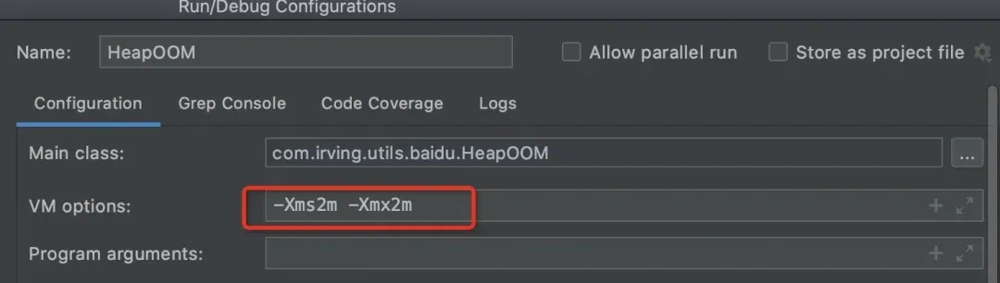
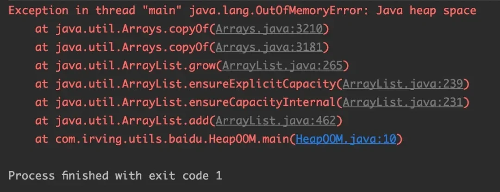
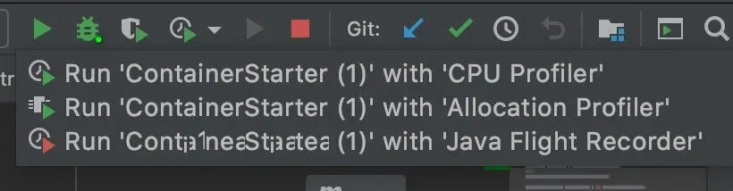
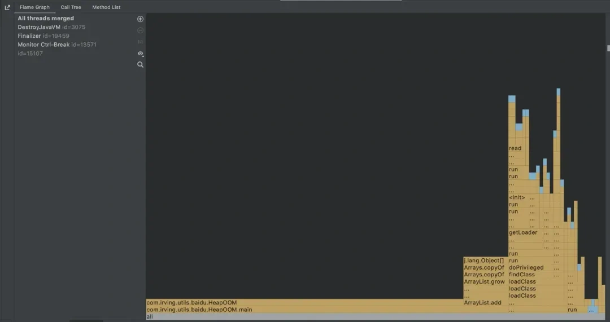
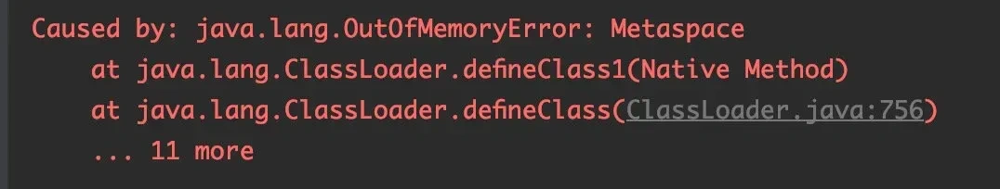
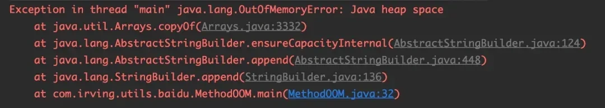
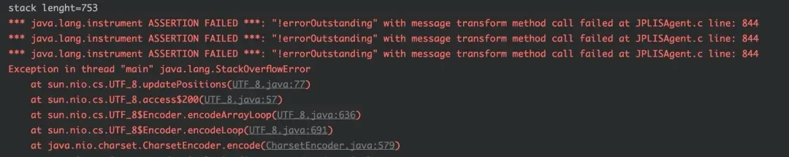

# 07 | 哪些场景会产生OOM？怎么解决？

<font style="color:rgb(51, 51, 51);background-color:rgb(248, 246, 244);">什么时候会抛出OutOfMemery异常呢？初看好像挺简单的，其实深究起来考察的是对整个JVM的了解，而且这个问题从网上可以翻到一些乱七八糟的答案，其实在总结下来基本上4个场景可以概括下来。</font>

### **<font style="color:rgb(34, 34, 34);background-color:rgb(248, 246, 244);">堆内存溢出</font>**
<font style="color:rgb(51, 51, 51);background-color:rgb(248, 246, 244);">堆内存溢出太常见，大部分人都应该能想得到这一点，堆内存用来存储对象实例，我们只要不停的创建对象，并且保证GC Roots和对象之间有可达路径避免垃圾回收，那么在对象数量超过最大堆的大小限制后很快就能出现这个异常。</font>

<font style="color:rgb(51, 51, 51);background-color:rgb(248, 246, 244);">写一段代码测试一下，设置堆内存大小2M。</font>



```typescript
public class HeapOOM {
    public static void main(String[] args) {
        List<HeapOOM> list = new ArrayList<>();
        while (true) {
            list.add(new HeapOOM());
        }
    }
}
```

<font style="color:rgb(51, 51, 51);background-color:rgb(248, 246, 244);">运行代码，很快能看见OOM异常出现，这里的提示是Java heap space堆内存溢出。</font>



<font style="color:rgb(51, 51, 51);background-color:rgb(248, 246, 244);">一般的排查方式可以通过设置-XX: +HeapDumpOnOutOfMemoryError在发生异常时dump出当前的内存转储快照来分析，分析可以使用Eclipse Memory Analyzer(MAT)来分析，独立文件可以在官网下载。</font>

<font style="color:rgb(51, 51, 51);background-color:rgb(248, 246, 244);">另外如果使用的是IDEA的话，可以使用商业版JProfiler或者开源版本的JVM-Profiler，此外IDEA2018版本之后内置了分析工具，包括Flame Graph(火焰图)和Call Tree(调用树)功能。</font>



### **<font style="color:rgb(34, 34, 34);background-color:rgb(248, 246, 244);">方法区(运行时常量池)和元空间溢出</font>**
<font style="color:rgb(51, 51, 51);background-color:rgb(248, 246, 244);">方法区和堆一样，是线程共享的区域，包含Class文件信息、运行时常量池、常量池，运行时常量池和常量池的主要区别是具备动态性，也就是不一定非要是在Class文件中的常量池中的内容才能进入运行时常量池，运行期间也可以可以将新的常量放入池中，比如String的intern()方法。</font>

<font style="color:rgb(51, 51, 51);background-color:rgb(248, 246, 244);">我们写一段代码验证一下String.intern()，同时我们设置-XX:MetaspaceSize=50m -XX:MaxMetaspaceSize=50m 元空间大小。由于我使用的是1.8版本的JDK，而1.8版本之前方法区存在于永久代(PermGen)，1.8之后取消了永久代的概念，转为元空间(Metaspace)，如果是之前版本可以设置PermSize MaxPermSize永久代的大小。</font>

```plain
private static String str = "test";
    public static void main(String[] args) {
        List<String> list = new ArrayList<>();
        while (true){
            String str2 = str + str;
            str = str2;
            list.add(str.intern());
        }
}
```

<font style="color:rgb(51, 51, 51);background-color:rgb(248, 246, 244);">运行代码，会发现代码报错。</font>



<font style="color:rgb(51, 51, 51);background-color:rgb(248, 246, 244);">再次修改配置，去除元空间限制，修改堆内存大小-Xms20m -Xmx20m，可以看见堆内存报错。</font>



<font style="color:rgb(51, 51, 51);background-color:rgb(248, 246, 244);">这是为什么呢？intern()本身是一个native方法，它的作用是：如果字符串常量池中已经包含一个等 于此String对象的字符串，则返回代表池中这个字符串的String对象;否则，将此String对象包含的字符串添加到常量池中，并且返回String对象的引用。</font>

<font style="color:rgb(51, 51, 51);background-color:rgb(248, 246, 244);">而在1.7版本之后，字符串常量池已经转移到堆区，所以会报出堆内存溢出的错误，如果1.7之前版本的话会看见PermGen space的报错。</font>

### **<font style="color:rgb(34, 34, 34);background-color:rgb(248, 246, 244);">直接内存溢出</font>**
<font style="color:rgb(51, 51, 51);background-color:rgb(248, 246, 244);">直接内存并不是虚拟机运行时数据区域的一部分，并且不受堆内存的限制，但是受到机器内存大小的限制。常见的比如在NIO中可以使用native函数直接分配堆外内存就容易导致OOM的问题。</font>

<font style="color:rgb(51, 51, 51);background-color:rgb(248, 246, 244);">直接内存大小可以通过-XX:MaxDirectMemorySize指定，如果不指定，则默认与Java 堆最大值-Xmx一样。</font>

<font style="color:rgb(51, 51, 51);background-color:rgb(248, 246, 244);">由直接内存导致的内存溢出，一个明显的特征是在Dump文件中不会看见明显的异常，如果发现OOM之后Dump文件很小，而程序中又直接或间接使用了NIO，那就可以考虑检查一下是不是这方面的原因。</font>

### **<font style="color:rgb(34, 34, 34);background-color:rgb(248, 246, 244);">栈内存溢出</font>**
<font style="color:rgb(51, 51, 51);background-color:rgb(248, 246, 244);">栈是线程私有，它的生命周期和线程相同。每个方法在执行的同时都会创建一个栈帧用于存储局部变量表、操作数栈、动态链接、方法出口等信息，方法调用的过程就是栈帧入栈和出栈的过程。</font>

<font style="color:rgb(51, 51, 51);background-color:rgb(248, 246, 244);">在java虚拟机规范中，对虚拟机栈定义了两种异常：</font>

1. <font style="color:rgb(51, 51, 51);background-color:rgb(248, 246, 244);">如果线程请求的栈深度大于虚拟机所允许的深度，将抛出StackOverflowError异常</font>
2. <font style="color:rgb(51, 51, 51);background-color:rgb(248, 246, 244);">如果虚拟机栈可以动态扩展，并且扩展时无法申请到足够的内存，抛出OutOfMemoryError异常</font>

<font style="color:rgb(51, 51, 51);background-color:rgb(248, 246, 244);">先写一段代码测试一下，设置-Xss160k，-Xss代表每个线程的栈内存大小</font>

```csharp
public class StackOOM {
    private int length = 1;

    public void stackTest() {
        System.out.println("stack lenght=" + length);
        length++;
        stackTest();
    }

    public static void main(String[] args) {
        StackOOM test = new StackOOM();
        test.stackTest();
    }
}
```

<font style="color:rgb(51, 51, 51);background-color:rgb(248, 246, 244);">测试发现，单线程下无论怎么设置参数都是StackOverflow异常。</font>



<font style="color:rgb(51, 51, 51);background-color:rgb(248, 246, 244);">尝试把代码修改为多线程，调整-Xss2m，因为为每个线程分配的内存越大，栈空间可容纳的线程数量越少，越容易产生内存溢出。</font>

<font style="color:rgb(51, 51, 51);background-color:rgb(248, 246, 244);">反之，如果内存不够的情况，可以调小该参数来达到支撑更多线程的目的。</font>

```plain
public class StackOOM {
    private void dontStop() {
        while (true) {
        }
    }

    public void stackLeakByThread() {
        while (true) {
            new Thread(() -> dontStop()).start();
        }
    }

    public static void main(String[] args) throws Throwable {
        StackOOM stackOOM = new StackOOM();
        stackOOM.stackLeakByThread();
    }
}
```


> 更新: 2024-10-08 11:22:12  
> 原文: <https://www.yuque.com/yuqueyonghue6cvnv/cxhfwd/snsd57ndlx7fba6y>