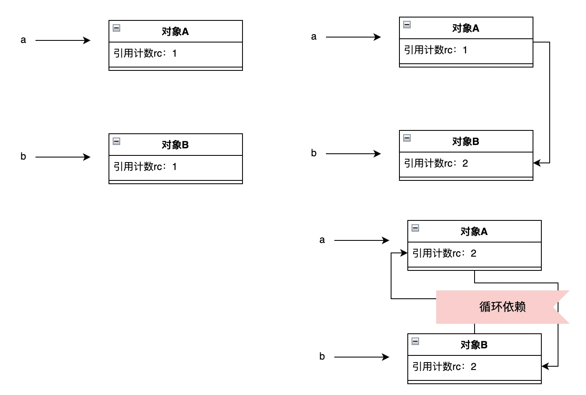
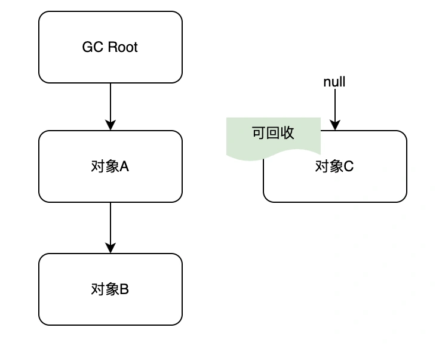
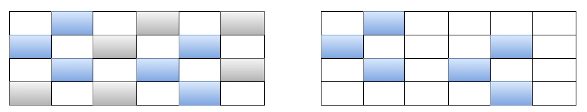
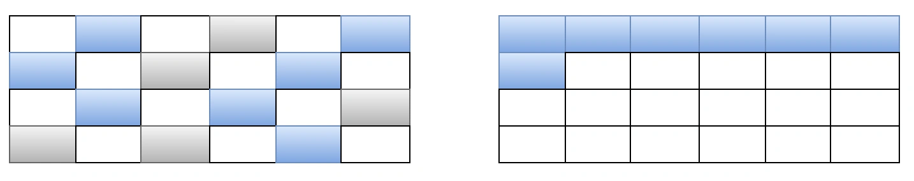
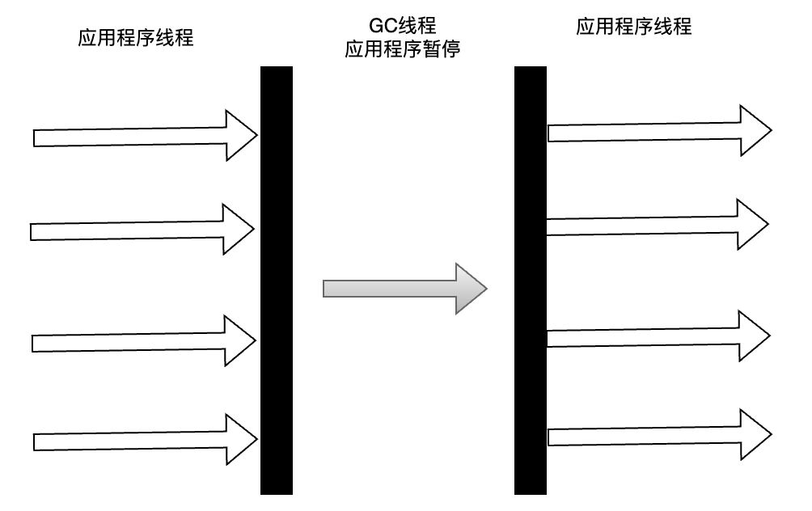
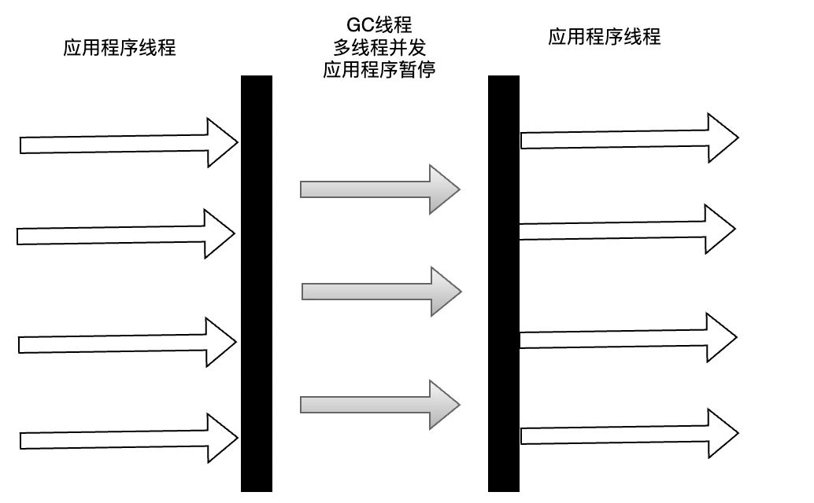
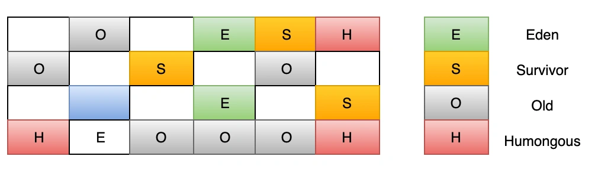

# 08|JVM垃圾回收算法有哪些？常用的垃圾收集器是什么？

JVM 垃圾回收时自动管理内存的一种机制，用于释放不再使用的对象所占用的内存空间。 一般是通过两个步骤实现：

1. 标记阶段：识别可回收的垃圾对象
2. 清除阶段：回收标记为垃圾的对象所占的内存。

下面我们先来看下垃圾的标记是如何实现的。

# 垃圾标记方式
通常，标记垃圾有两种方式：引用计数和可达性分析。

## 引用计数
通过维护每个对象的引用计数来判断对象是否可以被回收。当有一个指针引用它，那么引用计数+1，当引用计数为 0 时，表示没有被对象引用，可以被回收。

但是引用计数会存在一个问题，就是对象互相引用会导致-循环引用，形成一个环状，这样在这个循环引用的环内所有对象的引用次数至少都为 1，那么这些对象永远无法被回收了。

## 可达性分析算法
Java 采用的也是这一种，可达性分析算法表示从 GC Roots 为起点，开始查找存活对象，在查找过的路径称为引用链，所有能访问到对象标记为“可达”，无法访问到的对象就是不可达，也就是可以被回收的垃圾。

哪些可以作为 GC ROOTS 对象呢?

1. 虚拟机栈的引用：方法中的局部变量。
2. 方法区中的类静态属性、常量引用的对象。
3. JNI（Java Native Interface)引用：本地方法持有的对象引用。
4. 正在被线程引用的对象。

那么在找到垃圾后，如何进行回收垃圾呢？

# 垃圾回收算法
## 标记-清除算法
主要分为“标记”和“清除”两个阶段，标记存在引用的对象，回收未被标记的对象空间。

存在问题：

+ 效率不高，因为需要标记的对象太多。
+ 存在大量不连续的空间碎片

## 复制算法
主要是将内存分为大小相同的两部分，每次只使用其中一个，当其中一个的内存使用完时，把存活的对象复制到另一边去，然后把剩下的空间清理掉。

这样可以提高一定效率，但缺点是内存空间使用不高。

## 标记-整理算法
标记过程和“标记-清除”算法一致，但在回收阶段，它是让所有存活的对象移动至一端，然后清理掉边界以外的对象。

## 分代收集算法
分代收集算法主要是将 Java 堆分为年轻代和老年代两个区域。

+ 年轻代：年轻代的绝大多数对象都是朝生夕亡的，每次回收只需要关注如何保存少量存活的对象，而不是标记大量即将回收的对象。
+ 老年代：老年代的绝大多数对象是存活时间较长的对象。

# 垃圾收集器
垃圾收集器是 JVM 中对垃圾回收算法的具体实现。

## Serial 收集器
Serial（串行）收集器是最基本的垃圾收集器了，它是一个单线程得收集器，进行垃圾回收时，只会用一个线程去完成垃圾回收工作，同时会让其他所有的工作线程停止（Stop The World），等待它执行完成。

## Parallel Scavengel 收集器
Parallel Scavengel 收集器其实就是 Serial 的多线程版本，使用多线程进行垃圾回收，而它的系统吞吐量自然也是比 Serial 的要高。

## ParNew 收集器
ParNew 收集器和 Parallel Scavengel 收集器十分类似，通常会和 CMS 结合使用，新生代采用它完成垃圾回收。

## CMS 收集器
CMS，Concurrent Mark Sweep，是一款追求以最短回收时间为目标的垃圾收集器，注重提升用户体验，它是第一次实现了同时让垃圾回收线程和用户线程一起工作。

CMS 是基于“标记-清除”算法实现的，它的运作过程有以下几个步骤：

+ 初始标记：暂停所有的线程，记录下 GC Roots 直接引用到的对象，这个过程耗时非常短。
+ 并发标记：这个过程是和用户线程并发运行的，就是从 GC Roots 直接引用对象开始遍历，虽然耗时较长，但也不影响用户程序，但是会存在一个问题就是，因为用户线程是不暂停的（Stop The World），可能有些已经标记过的对象状态会发生改变。
+ 重新标记：这个过程就是为了修正上一阶段因为用户线程导致的已经标记过对象的状态发生改变的记录，主要处理多标、漏标问题。这个过程会比初始标记阶段的耗时长，但也远低于并发标记阶段。
+ 并发清理：和用户线程并发运行，GC 线程对为标记的区域清理。
+ 并发重置：重置本次 GC 的标记数据。

从上面过程就可看出，CMS 的主要特点是：并发收集，延迟低。但也存在几个缺点：

+ 占用 CPU 资源
+ 无法处理浮动垃圾，即并发清理阶段中产生新的垃圾，只能等到下一次 GC 再清理。
+ 因为它使用的是“标记-清除”算法，这个会产生大量内存空间碎片。
+ 某些情况下，会导致 CMS 退化成 Serial Old 垃圾收集器，比如上一次老年代存在大量垃圾未收集完成，这时垃圾回收又被触发。

CMS 有哪些常用的参数呢？

-XX:+UseConcMarkSweepGC，启用 CMS 收集器，注意 JDK8 默认使用的是 Parallel GC，JDK9 以后使用 G1 GC。

-XX:ConcGCThreads，CMS 并发过程运行的线程数。

-XX:+UseCMSCompactAtFullCollection，FullGC 完成后再做压缩整理，针对 CMS 容易产生内存碎片做的优化。

-XX:CMSFullGCsBeforeCompaction，配合上面使用，多少次 FullGC 完成后进行压缩，，默认是 0，即每次都会压缩。

-XX:CMSInitiatingOccupancyFraction，老年代使用达到的某个比例时会触发 FullGC，默认是 92。

-XX:+CMSParallellnitialMarkEnabled，表示在初始标记阶段采用多线程执行，减少 STW 时间。

-XX:+CMSParallelRemarkEnabled，表示在重新标记阶段采用多线程执行，减少 STW 时间。

## G1 收集器
G1 是一面向服务器的垃圾收集器，主要针对多处理器和大内存的机器，在极高概率满足 GC 停顿时间要求的同时，具备高吞吐量特性。

G1 将 Java 堆划分为多个大小相等的独立区域（Region），JVM 最多可以有 2048 个 Region。一般 Region 大小等于堆大小除以 2048，比如堆大小为 4096M，则 Region 大小为 2M。

G1 保留了年轻代和老年代的概念，但不再是物理隔阂了，它们都是（可以不连续)Region 的集合。默认年轻代对堆内存的占比是 5%，如果堆大小为 4096M，那么年轻代占据 200MB 左右的内存，对应大概是 100 个 Region。

G1 回收步骤：

+ 初始标记：暂停所有的线程，记录下 GC Roots 直接引用到的对象，这个过程耗时非常短。
+ 并发标记：同 CMS。
+ 最终标记：和 CMS 的重新标记一样。
+ 筛选回收：首先对各 Region 的回收价值和成本进行计算，根据用户设定的 GC 停顿时间（-XX:MaxGCPauseMillis 参数）来制定回收计划，比如此时又 1000 个 Region 需要回收，但是用户设置的停顿时间是 200ms，那么通过之前回收成本计算，只会回收其中部分 Region 比如 600 个，所以时间是用户可控的。回收算法主要用的复制算法，把一个 Region 存活的对象复制到另外一个 Region 中，所以不会像 CMS 那样存在内存碎片。

> 更新: 2024-10-08 11:22:31  
> 原文: <https://www.yuque.com/yuqueyonghue6cvnv/cxhfwd/wf1vqdqea11g74t8>