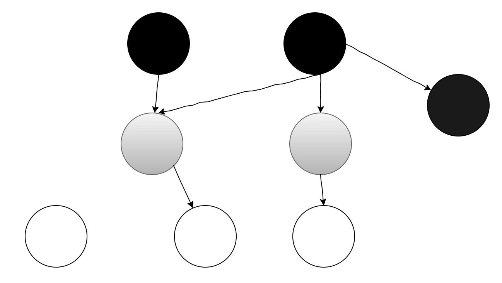
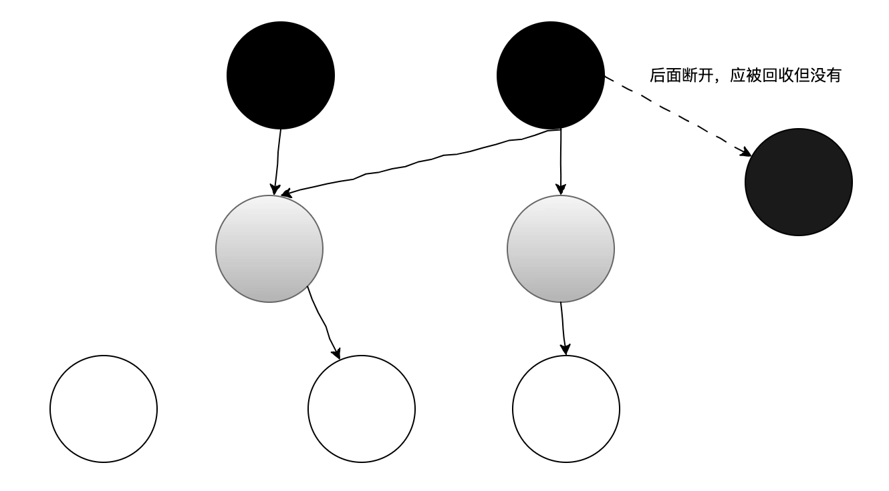
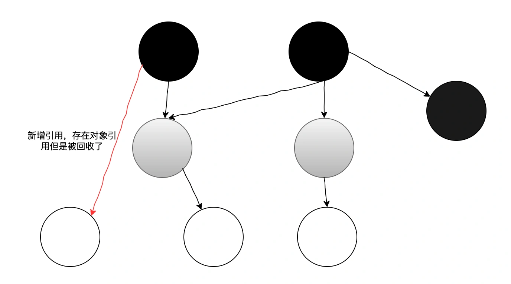

# 09|JVM垃圾回收算法有哪些？常用的垃圾收集器是什么？

相对于 CMS 回收器来说，G1 有许多相似的地方，比如都是注重于 GC 停顿时间，都采用了分代回收的思想。

但是 G1 在许多地方做了许多改进，特别是在 JDK1.9 以后，都适用了 G1 作为默认的垃圾收集器，那么它相对 CMS 来说有什么不一样的地方呢？

# **使用范围不一样**
+ CMS 是针对老年代的回收器，一般配合新生代的 ParNew 一起使用。
+ G1 是老年代和年轻滴的回收器，不需要结合其他回收器使用。

# **垃圾回收算法**
+ CMS 采用的是标记-清除垃圾回收算法。这种算法会产生较多内存碎片，当然也可以通过 CMS 参数来优化，在回收结束后再整理内存。
+ G1 采用标记-整理的算法，不会像 CMS 一样产生内存碎片。

# **STW 时间**
+ CMS 是以最小停顿时间为目标的回收器。
+ G1 回收器是基于用户预期、可预测的停顿时间为基础的回收器。

为什么在大内存服务器场景中采用 G1 更加合适呢？

设想下，在超过 8 个 G 以上的机器，如果使用 CMS，那么扫描一次的代价耗时会是多大？

而 G1 采用“化整为零”的思想，把整个堆划分为多个 Region。

G1 回收器每次会根据收集的时间，优先选择回收性价比最大的部分 Region，从而提高系统吞吐量，主要通过参数-XX:MaxGCPauseMillis"指定。

当然，虽然这个时间由用户来设定，但是也不能设置得过低了，因为假设设置 10 毫秒，那么每次都只回收很少一部分内存区域，回收的速度按远远跟不上分配的速度，会导致垃圾对象慢慢堆积，最终导致 Full GC，这样就得不偿失了。

所以这个时间还是得根据实际情况来设置，一般设置 100-300 毫秒比较合理。

# **垃圾收集算法实现**
CMS 和 G1 底层的垃圾回收算法，GC 线程都是和用户线程并发执行的，那么在并发标记过程中，因为用户线程还在执行，可能会造成对象引用存在变化，也就是会发生“多标”和“漏标”的情况发生。

+ 多标：在并发标记过程中，因为方法运行结束使得这部分局部变量 GCROOT 对象被销毁，但是这个 GCROOT 引用的对象之前已经被扫描过，并标记为存活对象，这次 GC 不会回收该对象，所以会产生“浮动垃圾”。不过这些浮动垃圾也不会影响程序正常运行，下次 GC 回收掉即可。
+ 漏标：本来扫描过后没有引用的对象没有被标记为存活对象，过后又被引用了（因为用户线程还在运行），在 GC 时误当成垃圾对象被清除，那么这就是严重 bug 了。

CMS 和 G1 都是采用三色标记法解决“漏标”可能产生的程序问题。

三色标记算法其实就是把 GC ROOTS 可达性分析遍历过程中扫描到的对象，按照是否访问过标记成以下三个颜色：

+ 黑色：表示对象已经被垃圾收集器访问过，且该对象的引用都已经被扫描过，且是安全存活的。
+ 灰色：表示对象已经被垃圾收集器访问过，但这个对象至少还有一个引用未被扫描过。

白色：表示对象没有被垃圾收集器访问过。所以在刚开始时，所有的对象都是白色，在可达性分析结束时，如果对象还是白色，即表示不可达，可以被回收掉。

+ 

**多标的情况如下**

+ 

**漏标的情况如下**

+ 

虽然 CMS 都是采用的三色标记法解决漏标的问题，但他们具体实现方案又有所区别，CMS 采用增量更新，G1 采用的原始快照。

+ 增量更新：当黑色对象新增新的指向白色对象的引用时，会把这个新增的引用记录记录下来，等并发标记结束后，再把这些记录下来的引用关系中的黑色对象为根再重新扫描一次。
+ 原始快照：当灰色对象要删除指向白色对象的引用时，会把这个引用记录下来，在并发标记结束后，把这些记录下来的引用关系中的灰色对象为根再重新扫描，这样重新扫描过的白色对象标记为黑色，因此存活下来。

其实两者区别就是增量更新是记录新插入的引用关系，原始快照是记录要删除的引用关系。

但不管是哪种，它们都是采用写屏障来实现的。

**写屏障**：就是在给某个对象的变量赋值操作前后，加入一些处理，参考 AOP。

写屏障实现就是在对象的成员变量引用关系发生变化时，利用写屏障把新插入的引用对象或要删除的引用对象记录下来。

小白：为什么 G1 使用原始快照，而不是增量更新呢？

主要还是基于效率考虑，因为 G1 是通过将堆分为多个区域来实现并行和并发回收，尤其在大堆环境下，使用原始快照只通过一次完整的标记来识别垃圾对象，如果采用增量更新，再重新标记阶段重新深度扫描删除对象 G1 的代价会比 CMS 高很多。

综上所述，G1 更适合以下场景：

+ 大堆内存（8GB 以上）：回收效率高，且有效管理内存碎片。
+ 堆存活对象占用多。
+ 垃圾回收时间比较长，可以可以使用 G1 优化。
+ 低停顿时间：对于响应时间要求高的场景，G1 能够预测停顿时间。

> 更新: 2024-10-08 11:22:45  
> 原文: <https://www.yuque.com/yuqueyonghue6cvnv/cxhfwd/fapw7lkv9n3hgwf2>