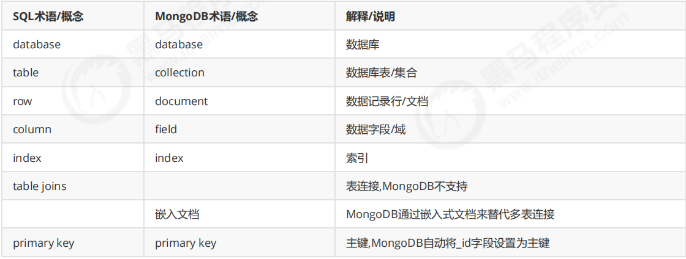

## 基于分布式文件存储的数据库
- 非关系型数据库,以文档形式存储数据

- 支持的数据结构:  bson(binary json)

- 与mysql的区别

mysql用table 表
mongo  用collection 集合 (表)\   用  Document  标识一行数据 (row)
{field:value}

## 应用场景

- 数据量大  \  读写都很频繁\   价值较低的数据,对事务性要求不高




# 数据操作语句

## 查询语句

- db.collection.find({query,projection}), 默认为{},查询所有文档,  传入多个参数 以,隔开

- db.collection.findOne({query,projection})

- db.collection.find().sort({xx:-1}).skip(5).limit11  根据 xx排序 ,-1是降序  1是升序,  limit限制返回数,skip 跳过指定数量文档


## 插入语句

- db.collection.insertOne({document,options})

db.myCollection.insertOne({
    name: "Alice",
    age: 25,
    city: "New York"
});


- db.colletion.insertMany({})

- db.colletion.save()  // 如果_id已存在则会更新  ,不存在则插入`

## 删除语句

 db.iast_loophole_detail.deleteOne\  deleteMany({taskId:1837007127184977920})


## update语句
````
db.iast_loophole_detail.updateMany(
{funId:{$eq:11} }, // 更新条件
{$set: { funId:13 }} // 更新操作
)
````
