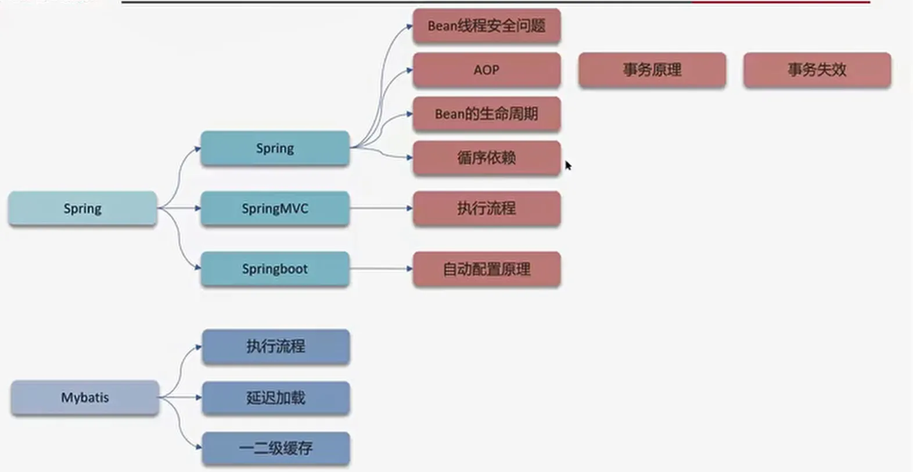

# Spring
单例
============

## AOP
面向切面编程
Spring管理的事务 底层用的就是AOP，AOP 的底层用的是动态代理
使用场景

● 记录操作日志
● 缓存处理
● Spring中内置的事务处理

## 事务失效

● 异常捕获处理

● 抛出检查异常

● 非public方法

## Bean 的生命周期
- 实例化：
- 设置属性(Bean注入和装配)
- 初始化：
- 使用：
- 销毁：

## 循环引用
三级缓存解决循环依赖

## SpringMVC的执行流程
- 用户发送出请求到前端控制器dispatcherservlet
- dispatcherservlet收到请求调用handlermapping(处理器映射器）
- handlermapping找到具体的处理器，生成处理器对象及处理器拦截器（如果有）,再一起返
回给dispatcherservlet.
- dispatcherservlet调用handleradapter (处理器适配器）
- handleradapter/controller)
- 方法上添加了@responsebody
- 通过httpmessageconverter来返回结果转换为json并响应

## SpringBoot 自动配置原理
三个注解
- @SpringBootApplication
- @EnableAutoConfiguration
- @ComponentScan
核心注解 @EnableAutoConfiguration
- @EnableAutoConfiguration会扫描META-INF/spring.factories文件，里面配置了所有需要自动配置的bean。
- 根据条件注解所制定的条件决定是否需要导入到spring容器中。

## Mybatis执行流程
- 读取mybatis配置文件：mybatis-config.xml加载运行环境和映射文件
- 构造会话工厂sqlsessionfactory
- 会话工厂创建sqlsession对象（包含了执行sql语句的所有方法）
- 操作数据库的接口，executor执行器，同时负责查询缓存的维护
- executor接口的执行方法中有一个mappedstatement类型的参数，封装了映射信息
- 输入参数映射
- 输出结果映射

