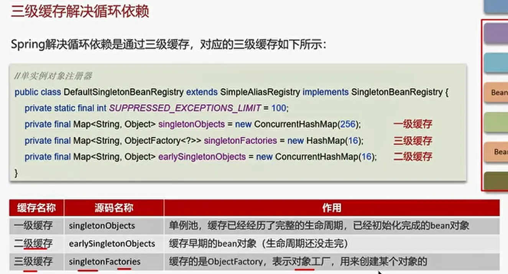
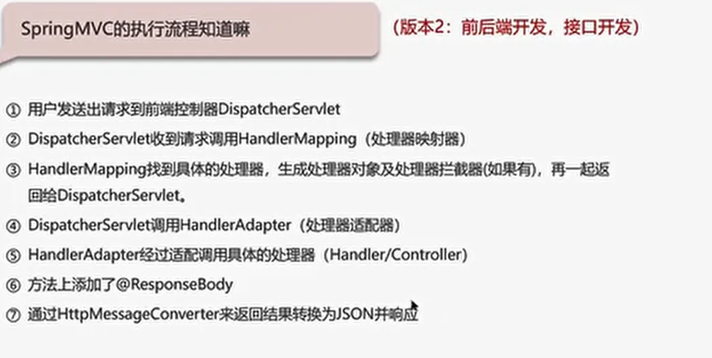
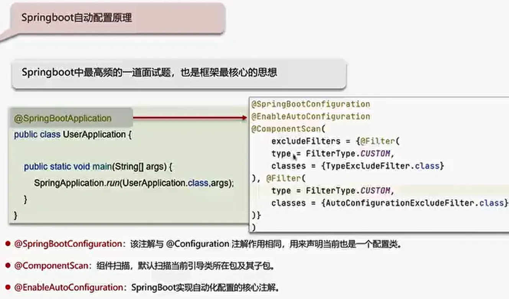
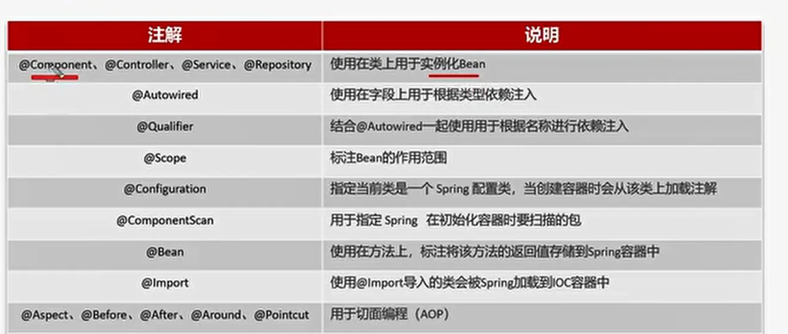
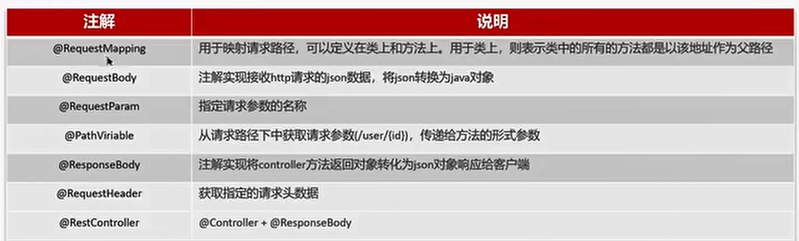
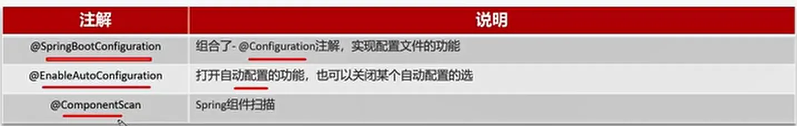
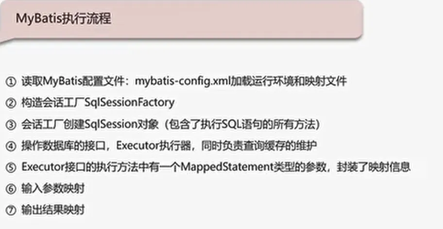
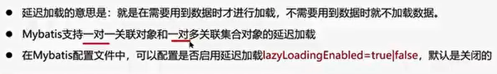
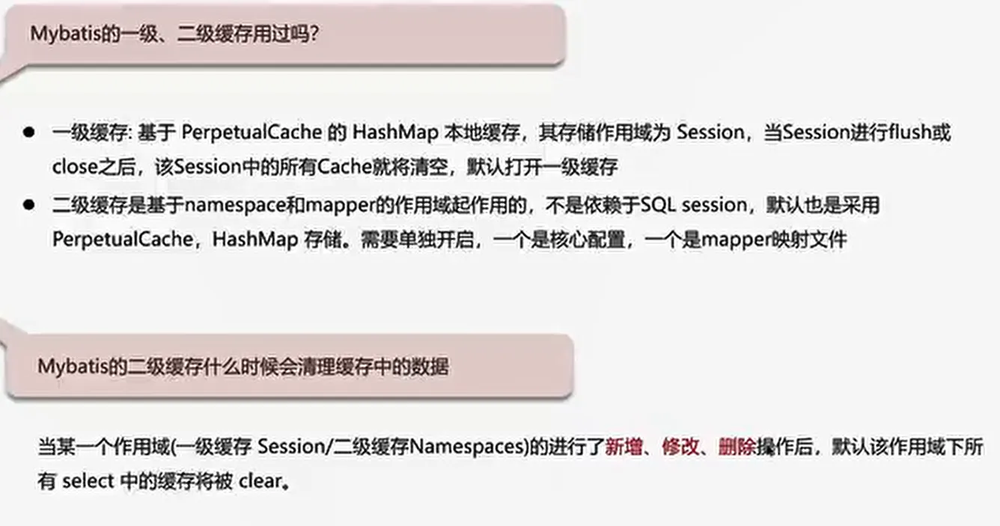

# Spring
单例
============

## AOP
面向切面编程
Spring管理的事务 底层用的就是AOP，AOP 的底层用的是动态代理
使用场景

● 记录操作日志
● 缓存处理
● Spring中内置的事务处理

## 事务失效

● 异常捕获处理

● 抛出检查异常

● 非public方法

## Bean 的生命周期
- 实例化：
- 设置属性(Bean注入和装配)
- 初始化：
- 使用：
- 销毁：

## 循环引用

## SpringMVC的执行流程

## SpringBoot 自动配置原理

## Spring常见注解

## SpringMVC常见注解

## SpringBoot常见注解

## Mybatis执行流程

## Mybatis是否支持延迟加载

## Mybatis的一级、二级缓存用过吗

